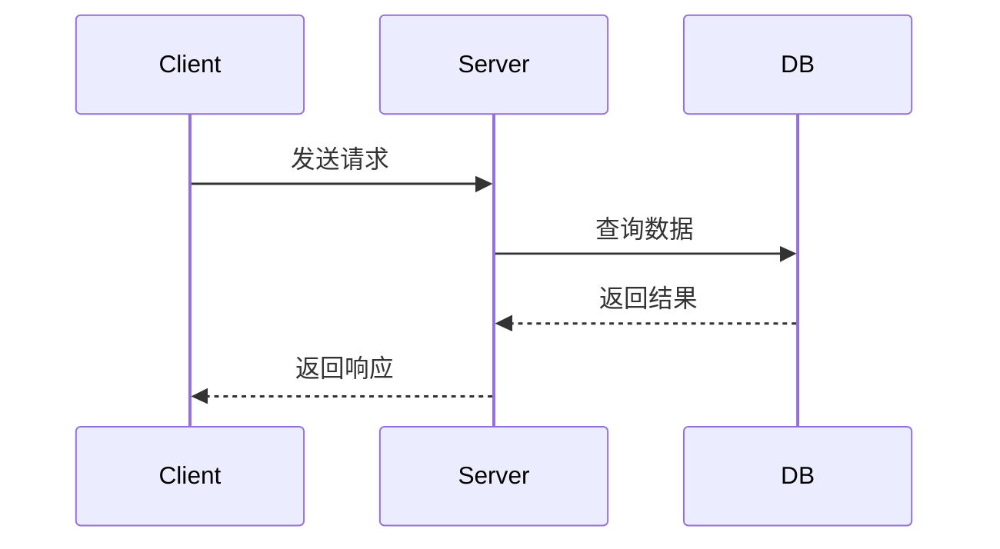

## 写文章的要求

以下是写新文章时必须遵守的质量标准。

### 1. 内容必须准确

- 所有技术描述、API 说明、代码示例必须基于真实知识，不能编造
- 涉及版本特性时需明确说明适用版本
- 如果某个知识点不确定，宁可不写，也不能写错误的内容

### 2. 内容要系统全面，有逻辑关联

文章不是知识点的堆砌，而是一条有逻辑的叙述链路。每篇文章需要做到：

- **有完整的知识脉络**：从"为什么"出发，讲清楚"是什么"，再讲"怎么用"，最后讲"边界和注意事项"
- **章节之间要有承接**：后面的章节建立在前面章节的认知基础上，避免跳跃式展开
- **不能草草带过**：每个核心概念都要展开讲透，给出足够的上下文，让读者能真正理解而不只是看懂语法

**推荐文章结构：**

```
1. 引言 —— 这篇文章解决什么问题，适合什么读者
2. 核心概念建立 —— 搭建读者理解后续内容所需的心智模型
3. 主体内容（多个章节） —— 每个章节深入一个子主题，章节间有递进关系
4. 实际应用 / 完整示例 —— 把前面的知识点串起来
5. 常见问题 / 注意事项 —— 补充边界情况和易错点
```

### 3. 优先使用 `.mdx` 格式，代码示例要具体

#### 文件格式

新文章统一使用 `.mdx` 格式（而非 `.md`），放在对应分类目录下：

```
posts/<category>/<slug>.mdx
```

`.mdx` 相比 `.md` 的优势：支持内置的交互组件（`CodeRunner`、`SqlSimulator`、`ShaderPreview` 等），以及 MDX 原生的 JSX 语法。

#### 代码示例要求

**每个核心概念都必须有对应的代码示例**，示例要满足：

- **完整可运行**：不要只贴片段，要让读者能直接复制运行
- **有注释说明关键行**：复杂逻辑必须在代码内注释
- **示例要循序渐进**：先给最简单的用法，再给进阶用法，不要一上来就上复杂场景

**好的示例写法：**

````mdx
最基础的用法，先建立概念：

```js
// 最简单的 Promise
const p = new Promise((resolve, reject) => {
  setTimeout(() => resolve('done'), 1000);
});

p.then(result => console.log(result)); // 1 秒后输出 "done"
```

在这个基础上，加入错误处理：

```js
// 加入 reject 分支
const p = new Promise((resolve, reject) => {
  const success = Math.random() > 0.5;
  if (success) {
    resolve('成功');
  } else {
    reject(new Error('失败'));
  }
});

p.then(result => console.log('结果:', result))
 .catch(err => console.error('错误:', err.message));
```
````

**可运行的代码块**（适合演示算法、JS 逻辑）：

````mdx
```js
// 可运行
function fibonacci(n) {
  if (n <= 1) return n;
  return fibonacci(n - 1) + fibonacci(n - 2);
}

// 输出前 10 项
for (let i = 0; i < 10; i++) {
  console.log(`fib(${i}) =`, fibonacci(i));
}
```
````

**流程图**（适合说明执行流程、架构关系）：

````mdx

````

#### 告示块的使用

合理使用告示块来区分信息优先级，避免正文里全是平铺的段落：

```md
:::tip
这里放对读者有帮助的补充说明或最佳实践。
:::

:::warning
这里放容易踩坑的地方，或者使用时需要注意的限制。
:::

:::note
这里放背景知识或延伸阅读，不影响主线理解。
:::
```

#### 折叠块的使用

答案、完整代码、扩展内容适合用折叠块，避免文章主体过长：

```md
::: details 查看完整实现代码
（完整代码放这里）
:::

::: details 为什么不用 XX 方案？
（延伸讨论放这里）
:::
```
