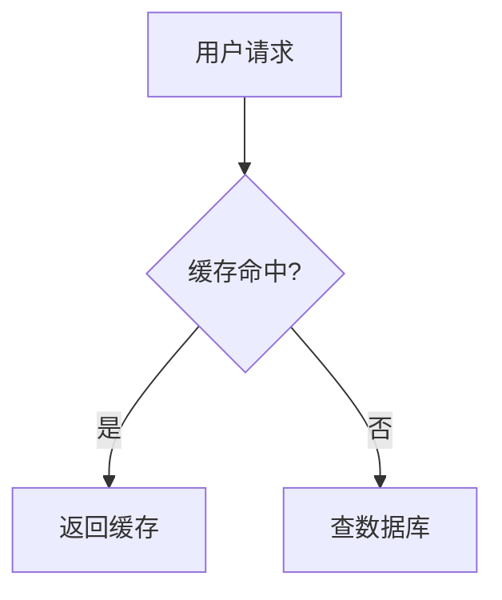
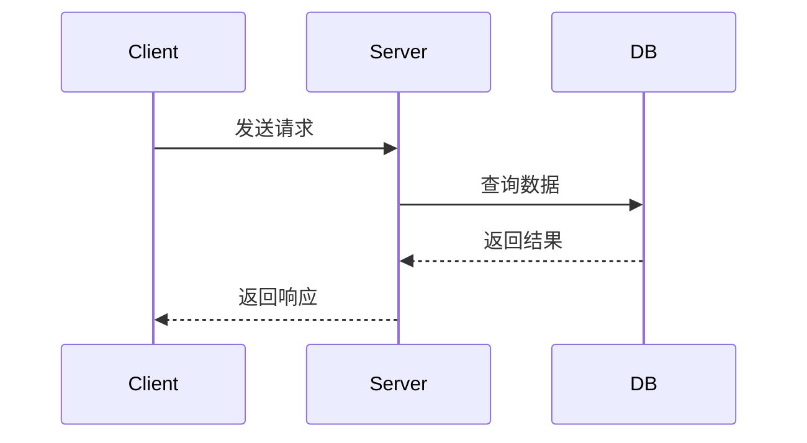

# CLAUDE.md

This file provides guidance to Claude Code (claude.ai/code) when working with code in this repository.

---

## Commands

```bash
# 开发
pnpm dev            # 先执行 scan-pdfs，再启动 next dev
pnpm build          # 先执行 scan-pdfs + copy-images，再静态导出 (next build)
pnpm lint           # eslint --ext .ts,.tsx,.js,.jsx

# 单独脚本
pnpm copy:images    # 把 posts/*/images/ 下的图片复制到 public/posts/*/images/
pnpm scan-pdfs      # 扫描 public/pdf/ 目录，生成 public/json/pdf-list.json
pnpm generate-posts # tsx scripts/generate-posts-json.ts（生成 posts JSON 索引）
```

没有测试框架，无 `test` 命令。

---

## 整体架构

项目是一个 **Next.js 16 纯静态博客**，在 `next.config.ts` 中配置了：

```ts
// next.config.ts
const nextConfig: NextConfig = {
  output: 'export',       // 静态导出，构建产物在 out/
  basePath: '/blog',      // 所有路由都带 /blog 前缀
  pageExtensions: ['js', 'jsx', 'md', 'mdx', 'ts', 'tsx'],
  reactCompiler: true,    // babel-plugin-react-compiler 已启用
  images: { unoptimized: true },
};
```

由于是纯静态导出，**没有服务端运行时**，`app/api/` 目录目前为空，所有数据都在构建期通过 `lib/markdown.ts` 读取 `posts/` 目录生成。

---

## 内容管道：从 `.md`/`.mdx` 到页面

整条内容链路如下：

```
posts/<category>/<slug>.md(x)
        ↓  lib/markdown.ts
   gray-matter 解析 frontmatter
        ↓
   .mdx → @mdx-js/mdx compile()   →  compiledContent (function-body 字符串)
   .md  → transformMarkdownDetails() →  rawMarkdown 字符串
        ↓
  Post 对象 { slug, title, date, content, isMdxCompiled, ... }
        ↓
  app/(pages)/posts/[slug]/page.tsx
        ↓
  components/MDXComponents.tsx（客户端渲染）
```

### `lib/markdown.ts` 核心函数

| 函数 | 说明 |
|---|---|
| `getAllPostSlugs()` | 递归扫描 `posts/` 目录，返回所有 slug |
| `getPostData(slug)` | 读取单篇文章，解析 frontmatter，编译 MDX |
| `getAllPosts()` | 获取全部文章，按日期降序排列 |
| `extractToc(content)` | 从 rawContent 提取 h2/h3/h4 生成目录项 |
| `transformMarkdownDetails(content)` | 把 `:::details` 语法预处理为 `<details>` HTML |

### MDX 编译配置

`.mdx` 文件在服务端通过 `@mdx-js/mdx` 的 `compile()` 编译为 `function-body` 格式的字符串，编译时应用以下插件：

```ts
// lib/markdown.ts
const compiled = await compile(content, {
  outputFormat: 'function-body',
  remarkPlugins: [
    remarkGfm,
    remarkMath,
    remarkDetails,          // 处理 ::: details
    [remarkAdmonitionsCustom, { keywords: ['details','note','warning','tip','important','info'] }],
  ],
  rehypePlugins: [
    rehypeSlug,             // 给标题生成 id
    rehypeHighlight,        // 代码高亮
    rehypeKatex,            // 数学公式
  ],
  development: false,
});
```

编译失败时会回退到 raw markdown，`isMdxCompiled` 字段标记实际使用的渲染路径。

---

## 文章目录结构与 frontmatter

### 目录规范

```
posts/
  <category>/           # 分类名，例如 react、nextjs、mysql
    <slug>.md(x)        # 文章文件，slug 即文件名去掉扩展名
    images/             # 该分类的图片（构建时复制到 public/posts/<category>/images/）
```

分类名会被自动追加到文章的 `tags` 数组中（`lib/markdown.ts:ensureCategoryInTags`）。

### frontmatter 规范

```mdx
---
title: '文章标题'
date: '2024-01-15'
excerpt: '摘要，用于文章列表展示'
tags: ['tag1', 'tag2']
coverImage: '/posts/react/images/cover.png'   # 可选
author:
  name: '作者名'                               # 可选
---
```

- `date` 支持字符串和 Date 对象，最终统一转为 `YYYY-MM-DD`
- `excerpt` 显示在文章列表卡片中
- `coverImage` 路径需要带 `/blog` basePath（构建后访问路径为 `/blog/posts/...`）

---

## 文章写作：MDX 特殊语法

### 1. 告示块（Admonitions）

由 `lib/remark-admonitions-custom.ts` 实现，支持 6 种类型：

```md
:::note
这是一条注意事项
:::

:::tip
这是一个提示
:::

:::warning
这是一个警告
:::

:::important
这是重要信息
:::

:::info
这是普通信息
:::
```

也支持自定义标题：

```md
:::warning 部署前必读
生产环境需要设置 NODE_ENV=production
:::
```

渲染效果：各类型有不同的左边框颜色（蓝/绿/黄/红/青）和背景色。

### 2. 折叠块（Details）

有两条处理链路，效果相同，推荐用法：

**用于 `.md` 文件**（由 `lib/markdown.ts:transformMarkdownDetails` 预处理）：

```md
::: details 点击展开查看答案
答案内容在这里，支持 **Markdown**。
:::
```

**用于 `.mdx` 文件**（由 `lib/remark-details.ts` 处理）：

```md
::: details 点击展开查看答案
答案内容在这里，支持 **Markdown**。
:::
```

两者都渲染为 `<details>` 原生元素，通过 `MDXComponents.tsx` 中的 `details` 映射添加样式。

### 3. 可运行代码块

在代码块内加上注释 `// 可运行` 或 `// runnable`，会渲染为带"运行代码"按钮的 `CodeRunner` 组件（仅支持 `javascript`/`js`）：

````md
```js
// 可运行
const arr = [1, 2, 3];
console.log(arr.map(x => x * 2));
```
````

`CodeRunner` 通过 `new Function()` 在浏览器沙箱中执行代码，劫持 `console.log/error/warn` 输出结果。

### 4. Mermaid 图表

代码块语言设置为 `mermaid`，`CodeBlock` 会自动渲染为 Excalidraw 风格预览，并提供"查看代码/查看预览"切换按钮：

````md

````

底层由 `components/MermaidToExcalidraw.tsx`（动态导入）渲染。

### 5. 数学公式

行内公式用 `$...$`，块级公式用 `$$...$$`：

```md
行内：$E = mc^2$

块级：
$$
\int_{-\infty}^{\infty} e^{-x^2} dx = \sqrt{\pi}
$$
```

由 `remark-math` + `rehype-katex` 处理，在 `MDXComponents.tsx` 中引入了 `katex/dist/katex.min.css`。

### 6. 图片

文章内的相对路径图片（`./images/foo.png`）在渲染时由 `MDXComponents.tsx:resolveImagePath` 自动转换为绝对路径：

```ts
// components/MDXComponents.tsx
return `/blog/posts/${category}/images/${imageName}`;
```

因此图片文件必须放在 `posts/<category>/images/` 下，构建前 `scripts/copy-images.js` 会把它们复制到 `public/posts/<category>/images/`。

点击图片会通过 `Lightbox` 组件打开全屏灯箱预览。

### 7. 在 MDX 中使用内置组件

`.mdx` 文件可以直接使用以下组件（无需 import，已注入 `mdxComponents`）：

```mdx
{/* 可运行 JS 代码块（等同于 // 可运行 注释） */}
<CodeRunner code="console.log('hello')" language="javascript" />

{/* GLSL/WebGL 着色器预览 */}
<ShaderPreview fragmentShader={`...`} />

{/* CodePen 风格交互式编辑器 */}
<CodePenDemo html="..." css="..." js="..." />

{/* SQL 模拟器（内置数据集） */}
<SqlSimulator />
```

---

## 代码高亮：`CodeBlock` 组件

`components/CodeBlock.tsx` 是所有代码块的统一容器，特性：

- 使用 `lowlight`（基于 highlight.js）在客户端异步高亮，支持所有语言
- 超过 **15 行**的代码块默认折叠，显示渐变蒙版，提供"展开全部 (N 行)"按钮
- 语言别名映射（`redis` → `bash`，`cs` → `csharp`，`yml` → `yaml`）
- `mermaid` 语言块走 `MermaidExcalidraw` 渲染路径

```ts
// components/CodeBlock.tsx
const LANGUAGE_ALIASES: Record<string, string> = {
  redis: 'bash',
  shell: 'bash',
  sh: 'bash',
  cs: 'csharp',
  yml: 'yaml',
  plain: 'plaintext',
  text: 'plaintext',
};
```

---

## 目录（TOC）与 Heading ID 机制

这是系统中**最需要保持一致性**的部分：服务端生成目录、客户端渲染标题，必须用相同的逻辑生成相同的 ID，否则目录点击跳转会失效。

### `lib/slugify.ts:slugify`

这是唯一的 slug 生成函数，服务端和客户端都必须通过它生成 ID：

```ts
export function slugify(text: string): string {
  const normalizedText = text
    .replace(/[""''""「」『』]/g, '')   // 去引号
    .replace(/[（）()]/g, '')           // 去括号
    .replace(/[：:]/g, '')              // 去冒号
    .replace(/[、，,]/g, '')            // 去顿号逗号
    .replace(/[？?]/g, '')              // 去问号
    .replace(/[\/]/g, '')              // 去斜杠
    .replace(/[.]/g, '')               // 去点号
    .replace(/[—–]+/g, '-');           // 破折号→连字符

  return normalizedText
    .toLowerCase()
    .replace(/[^\u4e00-\u9fa5a-z0-9]+/g, '-')  // 保留中文、字母、数字
    .replace(/^-+|-+$/g, '');
}
```

### 重复 ID 的去重规则

服务端（`lib/markdown.ts:extractToc`）和客户端（`components/MDXComponents.tsx:generateHeadingId`）都维护一个 `Map<baseId, count>`，第一次出现 ID 直接用 `baseId`，后续重复依次加 `-1`、`-2`……

```ts
// 第一次 "安装" → id="安装"
// 第二次 "安装" → id="安装-1"
// 第三次 "安装" → id="安装-2"
```

**修改 `slugify` 或去重逻辑时，服务端和客户端必须同步修改。**

---

## 路由结构

所有页面在 `app/(pages)/` 路由组下，路由组不影响 URL：

| 文件 | URL | 说明 |
|---|---|---|
| `app/page.tsx` | `/` | 首页 |
| `app/(pages)/posts/page.tsx` | `/posts` | 文章列表，服务端获取 `getAllPosts()`，传给客户端 `BlogList` |
| `app/(pages)/posts/[slug]/page.tsx` | `/posts/:slug` | 文章详情，`generateStaticParams` 生成所有静态路径 |
| `app/(pages)/about/page.tsx` | `/about` | 关于页 |
| `app/(pages)/todos/page.tsx` | `/todos` | Todo 应用，数据由 `lib/todos-db.ts` 管理 |
| `app/(pages)/tools/page.tsx` | `/tools` | 工具列表 |
| `app/(pages)/tools/[tool]/page.tsx` | `/tools/:tool` | 工具详情（diff-checker、json-formatter、sql-simulator 等） |

`generateStaticParams` 在 `app/(pages)/posts/[slug]/page.tsx` 中调用，确保所有文章在构建期生成静态 HTML。

---

## 客户端渲染路径

`components/MDXComponents.tsx` 是纯客户端组件（`"use client"`），接收三个 prop：

```ts
interface MDXContentProps {
  content: string;        // 编译后的 MDX function-body 字符串，或原始 markdown 字符串
  isMdxCompiled?: boolean; // true → 走 new Function() 执行路径；false → 走 react-markdown
  category?: string;      // 用于图片路径解析
}
```

**MDX 渲染路径**（`isMdxCompiled = true`）：

```ts
// 1. useMemo 中 new Function(content) 执行编译后的 function-body
const fn = new Function(content);
const result = fn.call(null, { Fragment, jsx, jsxs, ... });
// 2. result.default 是 React 组件
const MDXComponent = result.default;
// 3. 传入 mdxComponents 覆盖默认元素
<MDXComponent components={mdxComponents} />
```

**Markdown 渲染路径**（`isMdxCompiled = false`）：

```ts
<ReactMarkdown
  remarkPlugins={[remarkGfm, remarkMath, [remarkAdmonitionsCustom, ...]]}
  rehypePlugins={[rehypeRaw, rehypeHighlight, rehypeKatex]}
  components={mdxComponents}
>
  {content}
</ReactMarkdown>
```

重型组件（`ShaderPreview`、`CodePenDemo`、`SqlSimulator`、`CodeRunner`、`InteractiveComponent`）全部通过 `next/dynamic` + `{ ssr: false }` 懒加载，避免 SSR 阶段报错也减少初始 bundle 体积。

---

## 关键路径别名

`tsconfig.json` 中配置：

```json
{ "paths": { "@/*": ["./*"] } }
```

项目内所有 import 使用 `@/` 前缀引用根目录下的文件，例如 `@/lib/markdown`、`@/components/CodeBlock`。

---

## 样式系统

- **Tailwind CSS v4**，配置文件 `tailwind.config.ts`，通过 `@tailwindcss/postcss` 处理
- 所有设计 token（颜色、字体、间距）定义为 CSS 变量，在 `app/globals.css` 的 `:root` 中声明
- 全局样式文件：`app/globals.css`（token + body 基础样式）、`styles/code-highlight.css`（代码高亮主题覆盖）、`styles/algolia-search.css`
- 字体：`Public_Sans`（UI sans）、`IBM_Plex_Mono`（代码）、`Noto_Sans_SC`（中文），通过 CSS 变量 `--font-public-sans`、`--font-ibm-plex-mono`、`--font-noto-sans-sc` 注入

主题色：`#ea580c`（orange-600），贯穿链接、高亮、TOC 激活状态。

---

## 写新文章的要求

以下是写新文章时必须遵守的质量标准。

### 1. 内容必须准确

- 所有技术描述、API 说明、代码示例必须基于真实知识，不能编造
- 涉及版本特性时需明确说明适用版本
- 如果某个知识点不确定，宁可不写，也不能写错误的内容

### 2. 内容要系统全面，有逻辑关联

文章不是知识点的堆砌，而是一条有逻辑的叙述链路。每篇文章需要做到：

- **有完整的知识脉络**：从"为什么"出发，讲清楚"是什么"，再讲"怎么用"，最后讲"边界和注意事项"
- **章节之间要有承接**：后面的章节建立在前面章节的认知基础上，避免跳跃式展开
- **不能草草带过**：每个核心概念都要展开讲透，给出足够的上下文，让读者能真正理解而不只是看懂语法

**推荐文章结构：**

```
1. 引言 —— 这篇文章解决什么问题，适合什么读者
2. 核心概念建立 —— 搭建读者理解后续内容所需的心智模型
3. 主体内容（多个章节） —— 每个章节深入一个子主题，章节间有递进关系
4. 实际应用 / 完整示例 —— 把前面的知识点串起来
5. 常见问题 / 注意事项 —— 补充边界情况和易错点
```

### 3. 优先使用 `.mdx` 格式，代码示例要具体

#### 文件格式

新文章统一使用 `.mdx` 格式（而非 `.md`），放在对应分类目录下：

```
posts/<category>/<slug>.mdx
```

`.mdx` 相比 `.md` 的优势：支持内置的交互组件（`CodeRunner`、`SqlSimulator`、`ShaderPreview` 等），以及 MDX 原生的 JSX 语法。

#### 代码示例要求

**每个核心概念都必须有对应的代码示例**，示例要满足：

- **完整可运行**：不要只贴片段，要让读者能直接复制运行
- **有注释说明关键行**：复杂逻辑必须在代码内注释
- **示例要循序渐进**：先给最简单的用法，再给进阶用法，不要一上来就上复杂场景

**好的示例写法：**

````mdx
最基础的用法，先建立概念：

```js
// 最简单的 Promise
const p = new Promise((resolve, reject) => {
  setTimeout(() => resolve('done'), 1000);
});

p.then(result => console.log(result)); // 1 秒后输出 "done"
```

在这个基础上，加入错误处理：

```js
// 加入 reject 分支
const p = new Promise((resolve, reject) => {
  const success = Math.random() > 0.5;
  if (success) {
    resolve('成功');
  } else {
    reject(new Error('失败'));
  }
});

p.then(result => console.log('结果:', result))
 .catch(err => console.error('错误:', err.message));
```
````

**可运行的代码块**（适合演示算法、JS 逻辑）：

````mdx
```js
// 可运行
function fibonacci(n) {
  if (n <= 1) return n;
  return fibonacci(n - 1) + fibonacci(n - 2);
}

// 输出前 10 项
for (let i = 0; i < 10; i++) {
  console.log(`fib(${i}) =`, fibonacci(i));
}
```
````

**流程图**（适合说明执行流程、架构关系）：

````mdx

````

#### 告示块的使用

合理使用告示块来区分信息优先级，避免正文里全是平铺的段落：

```md
:::tip
这里放对读者有帮助的补充说明或最佳实践。
:::

:::warning
这里放容易踩坑的地方，或者使用时需要注意的限制。
:::

:::note
这里放背景知识或延伸阅读，不影响主线理解。
:::
```

#### 折叠块的使用

答案、完整代码、扩展内容适合用折叠块，避免文章主体过长：

```md
::: details 查看完整实现代码
（完整代码放这里）
:::

::: details 为什么不用 XX 方案？
（延伸讨论放这里）
:::
```
