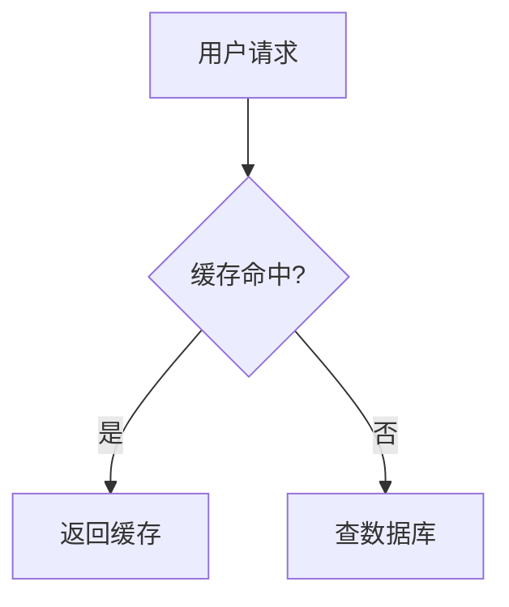

## 文章写作：MDX 特殊语法

### 1. 告示块（Admonitions）

由 `lib/remark-admonitions-custom.ts` 实现，支持 6 种类型：

```md
:::note
这有一条注意事项
:::

:::tip
这是一个提示
:::

:::warning
这是一个警告
:::

:::important
这是重要信息
:::

:::info
这是普通信息
:::
```

也支持自定义标题：

```md
:::warning 部署前必读
生产环境需要设置 NODE_ENV=production
:::
```

渲染效果：各类型有不同的左边框颜色（蓝/绿/黄/红/青）和背景色。

### 2. 折叠块（Details）

有两条处理链路，效果相同，推荐用法：

**用于 `.md` 文件**（由 `lib/markdown.ts:transformMarkdownDetails` 预处理）：

```md
::: details 点击展开查看答案
答案内容在这里，支持 **Markdown**。
:::
```

**用于 `.mdx` 文件**（由 `lib/remark-details.ts` 处理）：

```md
::: details 点击展开查看答案
答案内容在这里，支持 **Markdown**。
:::
```

两者都渲染为 `<details>` 原生元素，通过 `MDXComponents.tsx` 中的 `details` 映射添加样式。

### 3. 可运行代码块

在代码块内加上注释 `// 可运行` 或 `// runnable`，会渲染为带"运行代码"按钮的 `CodeRunner` 组件（仅支持 `javascript`/`js`）：

````md
```js
// 可运行
const arr = [1, 2, 3];
console.log(arr.map(x => x * 2));
```
````

`CodeRunner` 通过 `new Function()` 在浏览器沙箱中执行代码，劫持 `console.log/error/warn` 输出结果。

### 4. Mermaid 图表

代码块语言设置为 `mermaid`，`CodeBlock` 会自动渲染为 Excalidraw 风格预览，并提供"查看代码/查看预览"切换按钮：

````md

````

底层由 `components/MermaidToExcalidraw.tsx`（动态导入）渲染。

### 5. 数学公式

行内公式用 `$...$`，块级公式用 `$$...$$`：

```md
行内：$E = mc^2$

块级：
$$
\int_{-\infty}^{\infty} e^{-x^2} dx = \sqrt{\pi}
$$
```

由 `remark-math` + `rehype-katex` 处理，在 `MDXComponents.tsx` 中引入了 `katex/dist/katex.min.css`。

### 6. 图片

文章内的相对路径图片（`./images/foo.png`）在渲染时由 `MDXComponents.tsx:resolveImagePath` 自动转换为绝对路径：

```ts
// components/MDXComponents.tsx
return `/blog/posts/${category}/images/${imageName}`;
```

因此图片文件必须放在 `posts/<category>/images/` 下，构建前 `scripts/copy-images.js` 会把它们复制到 `public/posts/<category>/images/`。

点击图片会通过 `Lightbox` 组件打开全屏灯箱预览。

### 7. 在 MDX 中使用内置组件

`.mdx` 文件可以直接使用以下组件（无需 import，已注入 `mdxComponents`）：

```mdx
{/* 可运行 JS 代码块（等同于 // 可运行 注释） */}
<CodeRunner code="console.log('hello')" language="javascript" />

{/* GLSL/WebGL 着色器预览 */}
<ShaderPreview fragmentShader={`...`} />

{/* CodePen 风格交互式编辑器 */}
<CodePenDemo html="..." css="..." js="..." />

{/* SQL 模拟器（内置数据集） */}
<SqlSimulator />
```

---

## 代码高亮：`CodeBlock` 组件

`components/CodeBlock.tsx` 是所有代码块的统一容器，特性：

- 使用 `lowlight`（基于 highlight.js）在客户端异步高亮，支持所有语言
- 超过 **15 行**的代码块默认折叠，显示渐变蒙版，提供"展开全部 (N 行)"按钮
- 语言别名映射（`redis` → `bash`，`cs` → `csharp`，`yml` → `yaml`）
- `mermaid` 语言块走 `MermaidExcalidraw` 渲染路径

```ts
// components/CodeBlock.tsx
const LANGUAGE_ALIASES: Record<string, string> = {
  redis: 'bash',
  shell: 'bash',
  sh: 'bash',
  cs: 'csharp',
  yml: 'yaml',
  plain: 'plaintext',
  text: 'plaintext',
};
```
