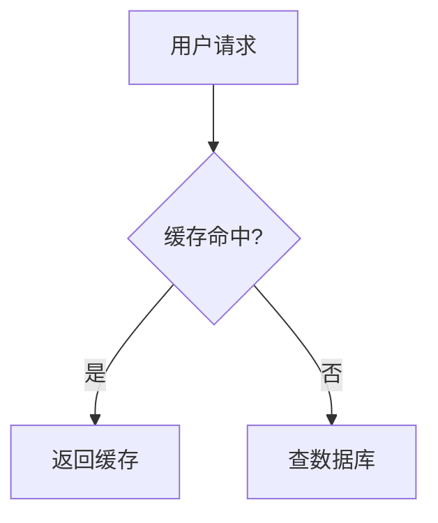

## 文章写作：MDX 特殊语法

### 1. 告示块（Admonitions）

由 `lib/remark-admonitions-custom.ts` 实现，支持 6 种类型：

```md
:::note
这有一条注意事项
:::

:::tip
这是一个提示
:::

:::warning
这是一个警告
:::

:::important
这是重要信息
:::

:::info
这是普通信息
:::
```

也支持自定义标题：

```md
:::warning 部署前必读
生产环境需要设置 NODE_ENV=production
:::
```

渲染效果：各类型有不同的左边框颜色（蓝/绿/黄/红/青）和背景色。

### 2. 折叠块（Details）

有两条处理链路，效果相同，推荐用法：

**用于 `.md` 文件**（由 `lib/markdown.ts:transformMarkdownDetails` 预处理）：

```md
::: details 点击展开查看答案
答案内容在这里，支持 **Markdown**。
:::
```

**用于 `.mdx` 文件**（由 `lib/remark-details.ts` 处理）：

```md
::: details 点击展开查看答案
答案内容在这里，支持 **Markdown**。
:::
```

两者都渲染为 `<details>` 原生元素，通过 `MDXComponents.tsx` 中的 `DetailsEnhanced` 组件添加增强样式。

#### Hover 提示（Hint）

在标题后加 `|` 分隔符，可以为折叠块添加 hover 提示文本，鼠标悬停在标题右侧的 ❓ 图标上会显示弹窗：

```md
::: details 深入理解闭包 | 鼠标悬停查看简介
闭包是指函数可以访问其词法作用域中的变量……
:::
```

#### 增强效果

`DetailsEnhanced` 组件提供以下增强展示：

- **图标指示器**：标题前显示 `▶`（ChevronRight），展开时旋转 90°，收起时恢复
- **Hover 弹窗提示**：带 `| hint` 语法的折叠块，标题右侧显示 ❓ 图标，hover 出现深色弹窗
- **展开/收起动画**：基于 CSS Grid `grid-template-rows` 的平滑高度过渡动画

### 3. 可运行代码块

在代码块内加上注释 `// 可运行` 或 `// runnable`，会渲染为带"运行代码"按钮的 `CodeRunner` 组件（仅支持 `javascript`/`js`）：

````md
```js
// 可运行
const arr = [1, 2, 3];
console.log(arr.map(x => x * 2));
```
````

`CodeRunner` 通过 `new Function()` 在浏览器沙箱中执行代码，劫持 `console.log/error/warn` 输出结果。

### 4. Mermaid 图表

代码块语言设置为 `mermaid`，`CodeBlock` 会自动渲染为 Excalidraw 风格预览，并提供"查看代码/查看预览"切换按钮：

````md

````

底层由 `components/MermaidToExcalidraw.tsx`（动态导入）渲染。

### 5. 数学公式

行内公式用 `$...$`，块级公式用 `$$...$$`：

```md
行内：$E = mc^2$

块级：
$$
\int_{-\infty}^{\infty} e^{-x^2} dx = \sqrt{\pi}
$$
```

由 `remark-math` + `rehype-katex` 处理，在 `MDXComponents.tsx` 中引入了 `katex/dist/katex.min.css`。

### 6. 图片

文章内的相对路径图片（`./images/foo.png`）在渲染时由 `MDXComponents.tsx:resolveImagePath` 自动转换为绝对路径：

```ts
// components/MDXComponents.tsx
return `/blog/posts/${category}/images/${imageName}`;
```

因此图片文件必须放在 `posts/<category>/images/` 下，构建前 `scripts/copy-images.js` 会把它们复制到 `public/posts/<category>/images/`。

点击图片会通过 `Lightbox` 组件打开全屏灯箱预览。

### 7. 在 MDX 中使用内置组件

`.mdx` 文件可以直接使用以下组件（无需 import，已注入 `mdxComponents`）：

```mdx
{/* 可运行 JS 代码块（等同于 // 可运行 注释） */}
<CodeRunner code="console.log('hello')" language="javascript" />

{/* GLSL/WebGL 着色器预览 */}
<ShaderPreview fragmentShader={`...`} />

{/* CodePen 风格交互式编辑器 */}
<CodePenDemo html="..." css="..." js="..." />

{/* SQL 模拟器（内置数据集） */}
<SqlSimulator />

{/* 函数绘图器 */}
<FunctionPlotter expression="sin(x)" domain={[-6,6]} />
```

### 8. 代码组切换（CodeTabs）

同一概念的多语言/多框架代码展示，用 Tab 切换而非纵向堆叠：

```mdx
<CodeTabs items={["npm", "yarn", "pnpm"]}>
  ```bash
  npm install foo
  ```
  ---
  ```bash
  yarn add foo
  ```
  ---
  ```bash
  pnpm add foo
  ```
</CodeTabs>
```

每个 Tab 内容用 `---` 分隔，`items` 数组定义 Tab 标签名。每个 Tab 内的代码块使用标准 Markdown 代码语法。

### 9. 代码行注解（CodeAnnotation）

代码块中指定行 hover 时，右侧浮出解释面板。适合逐行讲解关键代码：

```mdx
<CodeAnnotation
  language="javascript"
  lines={[
    { code: 'const cache = new Map();', note: 'Map 比 Object 更适合做缓存，因为键可以是任意类型' },
    { code: '' },
    { code: 'function memoize(fn) {' },
    { code: '  return (...args) => {', note: '用 rest 参数收集，支持任意参数个数' },
    { code: '    const key = JSON.stringify(args);' },
    { code: '    if (cache.has(key)) return cache.get(key);', note: '缓存命中直接返回，避免重复计算' },
    { code: '    const result = fn(...args);' },
    { code: '    cache.set(key, result);' },
    { code: '    return result;' },
    { code: '  };' },
    { code: '}' },
  ]}
/>
```

`lines` 数组中每个对象：`code` 是代码文本，`note` 是 hover 注解（可选，无 note 的行不可交互）。

### 10. 步骤指示器（Steps）

多步骤教程用编号圆圈 + 竖线串联，比纯数字列表更有视觉引导力：

```mdx
<Steps>
### 安装依赖
npm install foo

### 配置环境变量
创建 `.env` 文件……

### 启动开发服务器
npm run dev
</Steps>
```

组件自动检测子元素中的 `h2~h6` 标题作为步骤标题，并自动编号。非标题内容归属到上一个步骤。

### 11. 文件树（FileTree）

展示项目目录结构，文件夹可点击展开/收起，文件 hover 显示注释：

```mdx
<FileTree tree={[
  { name: "src", type: "folder", comment: "源代码", children: [
    { name: "index.ts", type: "file", comment: "入口文件" },
    { name: "utils", type: "folder", children: [
      { name: "helpers.ts", type: "file" },
    ]},
  ]},
  { name: "package.json", type: "file", comment: "项目配置" },
]} />
```

`tree` 是 `FileTreeItem[]` 类型的 JSON 数组，每项有 `name`、`type`（`file`|`folder`）、可选 `children`（文件夹）和 `comment`（hover 注释）。

### 12. 代码对比（DiffCompare）

以 GitHub 风格 diff 视图展示代码变更，支持增/删/上下文行：

```mdx
<DiffCompare
  language="typescript"
  title="重构前 → 重构后"
  diff={[
    { type: "context", content: "function getUser(id: string) {", oldLineNum: 1, newLineNum: 1 },
    { type: "remove", content: "  return fetch('/api/user/' + id);", oldLineNum: 2 },
    { type: "add", content: "  return fetch(`/api/user/${id}`);", newLineNum: 2 },
    { type: "context", content: "}", oldLineNum: 3, newLineNum: 3 },
  ]}
/>
```

`diff` 数组每项：`type` 为 `add`/`remove`/`context`，`content` 为代码文本，`oldLineNum`/`newLineNum` 为行号。

### 13. 术语提示（Glossary）

行内术语下划虚线，hover 弹出释义卡片。适合系列文章中反复出现的技术术语：

```mdx
<Glossary term="AOT 编译：Ahead-of-Time，在程序运行前将代码编译为机器码，与 JIT 相对">
  AOT
</Glossary>
编译可以提升启动速度。
```

`term` 是 hover 时弹出的完整释义，`children` 是行内显示的文本（可省略，默认显示 `term` 的前几个字）。

### 14. 系列进度条（ProgressIndicator）

系列文章顶部显示"第 N/M 篇"进度条，已读文章可点击跳转：

```mdx
<ProgressIndicator
  current="dotnet/csharp-collections-exceptions"
  items={[
    { slug: "dotnet/csharp-language-roadmap", title: "C# 语言路线图" },
    { slug: "dotnet/csharp-basic-syntax", title: "基础语法" },
    { slug: "dotnet/csharp-collections-exceptions", title: "集合与异常" },
  ]}
/>
```

`current` 是当前文章 slug，`items` 是系列文章列表。当前篇高亮，已过篇可点击。

---

## 代码高亮：`CodeBlock` 组件

`components/CodeBlock.tsx` 是所有代码块的统一容器，特性：

- 使用 `lowlight`（基于 highlight.js）在客户端异步高亮，支持所有语言
- 超过 **15 行**的代码块默认折叠，显示渐变蒙版，提供"展开全部 (N 行)"按钮
- 语言别名映射（`redis` → `bash`，`cs` → `csharp`，`yml` → `yaml`）
- `mermaid` 语言块走 `MermaidExcalidraw` 渲染路径

```ts
// components/CodeBlock.tsx
const LANGUAGE_ALIASES: Record<string, string> = {
  redis: 'bash',
  shell: 'bash',
  sh: 'bash',
  cs: 'csharp',
  yml: 'yaml',
  plain: 'plaintext',
  text: 'plaintext',
};
```
