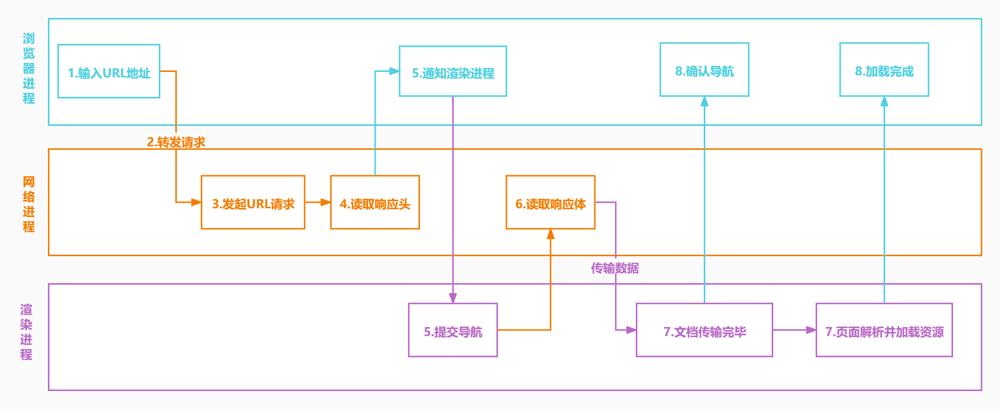
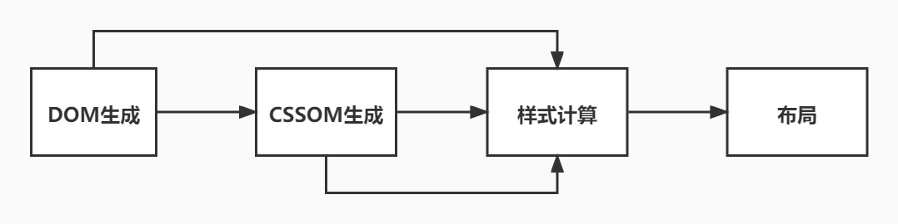
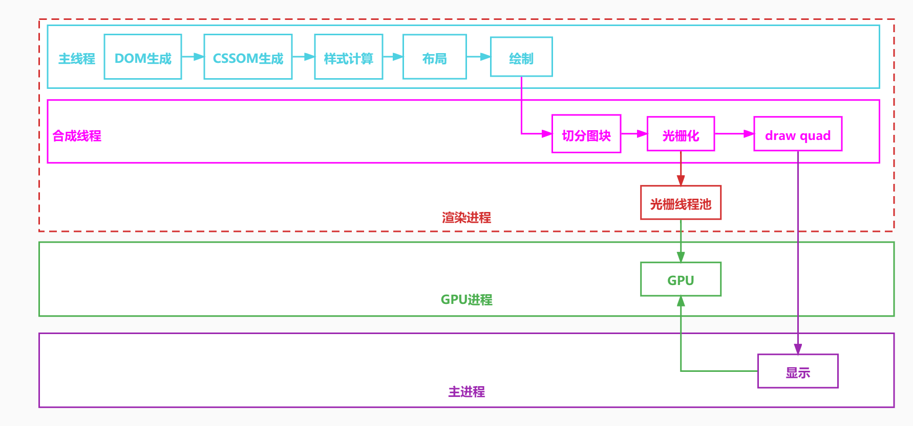
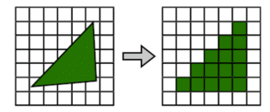
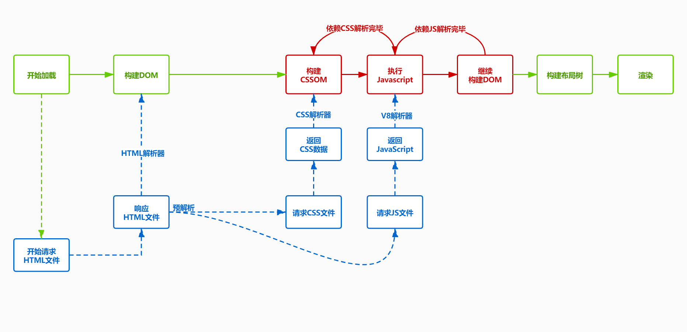

## 进程架构

- 当启动一个程序时，操作系统会为该程序分配内存，用来存放代码、运行过程中的数据，这样的运行环境叫做进程
- 一个进程可以启动和管理多个线程，线程之间可以共享进行数据，任何一个线程出错都可能会导致进程崩溃

### Chrome 的进程架构

- 浏览器主进程 负责界面显示、用户交互和子进程管理
- 渲染进程 排版引擎和 V8 引擎运行在该进程中，负责把 HTML、CSS 和 JavaScript 转变成网页
- 网络进程 用来加载网络资源的
- GPU 进程 用来实现 CSS3 和 3D 效果

### HTML 加载

- 主进程接收用户输入的 URL
- 主进程把该 URL 转发给网络进程
- 在网络进程中发起 URL 请求
- 网络进程接收到响应头数据并转发给主进程
- 主进程发送提交导航消息到渲染进程
- 渲染进程开始从网络进程接收 HTML 数据
- HTML 接收接受完毕后通知主进程确认导航
- 渲染进程开始 HTML 解析和加载子资源
- HTML 解析完毕和加载子资源页面加载完成后会通知主进程页面加载完成



## 渲染过程

- 渲染进程把 HTML 转变为 DOM 树型结构
- 渲染进程把 CSS 文本转为浏览器中的 stylesheet
- 通过 stylesheet 计算出 DOM 节点的样式
- 根据 DOM 树创建布局树
- 并计算各个元素的布局信息
- 根据布局树生成分层树
- 根据分层树进行生成绘制步骤
- 把绘制步骤交给渲染进程中的合成线程进行合成
- 合成线程将图层分成图块(tile)
- 合成线程会把分好的图块发给栅格化线程池，栅格化线程会把图片(tile)转化为位图
- 而其实栅格化线程在工作的时候会把栅格化的工作交给 GPU 进程来完成，最终生成的位图就保存在了 GPU 内存中
- 当所有的图块都光栅化之后合成线程会发送绘制图块的命令给浏览器主进程
- 浏览器主进程然后会从 GPU 内存中取出位图显示到页面上

### HTML 转 DOM 树

- 浏览器中的 HTML 解析器可以把 HTML 字符串转换成 DOM 结构
- HTML 解析器边接收网络数据边解析 HTML
- 解析 DOM
  - HTML 字符串转 Token
  - Token 栈用来维护节点之间的父子关系，Token 会依次压入栈中
  - 如果是开始标签，把 Token 压入栈中并且创建新的 DOM 节点并添加到父节点的 children 中
  - 如果是文本 Token，则把文本节点添加到栈顶元素的 children 中，文本 Token 不需要入栈
  - 如果是结束标签，此开始标签出栈

### CSS 转 stylesheet

- 渲染进程把 CSS 文本转为浏览器中的 stylesheet
- CSS 来源可能有 link 标签、style 标签和 style 行内样式
- 渲染引擎会把 CSS 转换为 document.styleSheets

### 计算出 DOM 节点的样式

- 根据 CSS 的继承和层叠规则计算 DOM 节点的样式
- DOM 节点的样式保存在了 ComputedStyle 中

### 构建布局树

- 创建布局树
- 创建一棵只包含可见元素的布局树
  

### 计算布局

计算各个元素的布局

::: details request

```js
const htmlparser2 = require('htmlparser2');
const http = require('http');
const css = require("css");
const main = require('./main.js');
const network = require('./network.js');
const render = require('./render.js');
const host = 'localhost';
const port = 80;
Array.prototype.top = function () {
    return this[this.length - 1];
}
/** 浏览器主进程 **/
main.on('request', function (options) {
    //2.主进程把该URL转发给网络进程
    network.emit('request', options);
})
//开始准备渲染页面
main.on('prepareRender', function (response) {
    //5.主进程发送提交导航消息到渲染进程
    render.emit('commitNavigation', response);
})
main.on('confirmNavigation', function () {
    console.log('confirmNavigation');
})
main.on('DOMContentLoaded', function () {
    console.log('DOMContentLoaded');
})
main.on('Load', function () {
    console.log('Load');
})

/** 网络进程 **/
network.on('request', function (options) {
    //3.在网络进程中发起URL请求
    let request = http.request(options, (response) => {
        //4.网络进程接收到响应头数据并转发给主进程
        main.emit('prepareRender', response);
    });
    //结束请求体
    request.end();
})

/** 渲染进程 **/
//6.渲染进程开始从网络进程接收HTML数据
render.on('commitNavigation', function (response) {
    const headers = response.headers;
    const contentType = headers['content-type'];
    if (contentType.indexOf('text/html') !== -1) {
        //1. 渲染进程把HTML转变为DOM树型结构
        const document = { type: 'document', attributes: {}, children: [] };
        const cssRules = [];
        const tokenStack = [document];
        const parser = new htmlparser2.Parser({
            onopentag(name, attributes = {}) {
                const parent = tokenStack.top();
                const element = {
                    type: 'element',
                    tagName: name,
                    children: [],
                    attributes,
                    parent
                }
                parent.children.push(element);
                tokenStack.push(element);
            },
            ontext(text) {
                if (!/^[\r\n\s]*$/.test(text)) {
                    const parent = tokenStack.top();
                    const textNode = {
                        type: 'text',
                        children: [],
                        attributes: {},
                        parent,
                        text
                    }
                    parent.children.push(textNode);
                }
            },
            /**
             * 在预解析阶段，HTML发现CSS和JS文件会并行下载，等全部下载后先把CSS生成CSSOM，然后再执行JS脚本
             * 然后再构建DOM树，重新计算样式，构建布局树，绘制页面
             * @param {*} tagname
             */
            onclosetag(tagname) {
                switch (tagname) {
                    case 'style':
                        const styleToken = tokenStack.top();
                        const cssAST = css.parse(styleToken.children[0].text);
                        cssRules.push(...cssAST.stylesheet.rules);
                        break;
                    default:
                        break;
                }
                tokenStack.pop();
            },
        });
        //开始接收响应体
        response.on('data', (buffer) => {
            //8.渲染进程开始HTML解析和加载子资源
            //网络进程加载了多少数据，HTML 解析器便解析多少数据。
            parser.write(buffer.toString());
        });
        response.on('end', () => {
            //7.HTML接收接受完毕后通知主进程确认导航
            main.emit('confirmNavigation');
            //3. 通过stylesheet计算出DOM节点的样式
            recalculateStyle(cssRules, document);
           //4. 根据DOM树创建布局树,就是复制DOM结构并过滤掉不显示的元素
           const html = document.children[0];
           const body = html.children[1];
           const layoutTree = createLayout(body);
+          //5.并计算各个元素的布局信息
+          updateLayoutTree(layoutTree);
           //触发DOMContentLoaded事件
           main.emit('DOMContentLoaded');
           //9.HTML解析完毕和加载子资源页面加载完成后会通知主进程页面加载完成
           main.emit('Load');
        });
    }
})
+function updateLayoutTree(element, top = 0, parentTop = 0) {
+    const computedStyle = element.computedStyle;
+    element.layout = {
+        top: top + parentTop,
+        left: 0,
+        width: computedStyle.width,
+        height: computedStyle.height,
+        background: computedStyle.background,
+        color: computedStyle.color
+    }
+    let childTop = 0;
+    element.children.forEach(child => {
+        updateLayoutTree(child, childTop, element.layout.top);
+        childTop += parseInt(child.computedStyle.height || 0);
+    });
+}
function createLayout(element) {
    element.children = element.children.filter(isShow);
    element.children.forEach(child => createLayout(child));
    return element;
}
function isShow(element) {
    let isShow = true;
    if (element.tagName === 'head' || element.tagName === 'script') {
        isShow = false;
    }
    const attributes = element.attributes;
    Object.entries(attributes).forEach(([key, value]) => {
        if (key === 'style') {
            const attributes = value.split(';');
            attributes.forEach((attribute) => {
                const [property, value] = attribute.split(/:\s*/);
                if (property === 'display' && value === 'none') {
                    isShow = false;
                }
            });
        }
    });
    return isShow;
}
function recalculateStyle(cssRules, element, parentComputedStyle = {}) {
    const attributes = element.attributes;
    element.computedStyle = {color:parentComputedStyle.color}; // 计算样式
    Object.entries(attributes).forEach(([key, value]) => {
        //stylesheets
        cssRules.forEach(rule => {
            let selector = rule.selectors[0].replace(/\s+/g, '');
            if ((selector == '#' + value && key == 'id') || (selector == '.' + value && key == 'class')) {
                rule.declarations.forEach(({ property, value }) => {
                    element.computedStyle[property] = value;
                })
            }
        })
        //行内样式
        if (key === 'style') {
            const attributes = value.split(';');
            attributes.forEach((attribute) => {
                const [property, value] = attribute.split(/:\s*/);
                element.computedStyle[property] = value;
            });
        }
    });
    element.children.forEach(child => recalculateStyle(cssRules, child,element.computedStyle));
}

//1.主进程接收用户输入的URL
main.emit('request', { host, port, path: '/index.html' });
```

:::

### 生成分层树

- 根据布局树生成分层树
- 渲染引擎需要为某些节点生成单独的图层，并组合成图层树
  - z-index
  - 绝对定位和固定定位
  - 滤镜
  - 透明
  - 裁剪
- 这些图层合成最终的页面

::: details request

```js
const htmlparser2 = require('htmlparser2');
const http = require('http');
const css = require("css");
const main = require('./main.js');
const network = require('./network.js');
const render = require('./render.js');
const host = 'localhost';
const port = 80;
Array.prototype.top = function () {
    return this[this.length - 1];
}
/** 浏览器主进程 **/
main.on('request', function (options) {
    //2.主进程把该URL转发给网络进程
    network.emit('request', options);
})
//开始准备渲染页面
main.on('prepareRender', function (response) {
    //5.主进程发送提交导航消息到渲染进程
    render.emit('commitNavigation', response);
})
main.on('confirmNavigation', function () {
    console.log('confirmNavigation');
})
main.on('DOMContentLoaded', function () {
    console.log('DOMContentLoaded');
})
main.on('Load', function () {
    console.log('Load');
})

/** 网络进程 **/
network.on('request', function (options) {
    //3.在网络进程中发起URL请求
    let request = http.request(options, (response) => {
        //4.网络进程接收到响应头数据并转发给主进程
        main.emit('prepareRender', response);
    });
    //结束请求体
    request.end();
})

/** 渲染进程 **/
//6.渲染进程开始从网络进程接收HTML数据
render.on('commitNavigation', function (response) {
    const headers = response.headers;
    const contentType = headers['content-type'];
    if (contentType.indexOf('text/html') !== -1) {
        //1. 渲染进程把HTML转变为DOM树型结构
        const document = { type: 'document', attributes: {}, children: [] };
        const cssRules = [];
        const tokenStack = [document];
        const parser = new htmlparser2.Parser({
            onopentag(name, attributes = {}) {
                const parent = tokenStack.top();
                const element = {
                    type: 'element',
                    tagName: name,
                    children: [],
                    attributes,
                    parent
                }
                parent.children.push(element);
                tokenStack.push(element);
            },
            ontext(text) {
                if (!/^[\r\n\s]*$/.test(text)) {
                    const parent = tokenStack.top();
                    const textNode = {
                        type: 'text',
                        children: [],
                        attributes: {},
                        parent,
                        text
                    }
                    parent.children.push(textNode);
                }
            },
            /**
             * 在预解析阶段，HTML发现CSS和JS文件会并行下载，等全部下载后先把CSS生成CSSOM，然后再执行JS脚本
             * 然后再构建DOM树，重新计算样式，构建布局树，绘制页面
             * @param {*} tagname
             */
            onclosetag(tagname) {
                switch (tagname) {
                    case 'style':
                        const styleToken = tokenStack.top();
                        const cssAST = css.parse(styleToken.children[0].text);
                        cssRules.push(...cssAST.stylesheet.rules);
                        break;
                    default:
                        break;
                }
                tokenStack.pop();
            },
        });
        //开始接收响应体
        response.on('data', (buffer) => {
            //8.渲染进程开始HTML解析和加载子资源
            //网络进程加载了多少数据，HTML 解析器便解析多少数据。
            parser.write(buffer.toString());
        });
        response.on('end', () => {
            //7.HTML接收接受完毕后通知主进程确认导航
            main.emit('confirmNavigation');
            //3. 通过stylesheet计算出DOM节点的样式
            recalculateStyle(cssRules, document);
            //4. 根据DOM树创建布局树,就是复制DOM结构并过滤掉不显示的元素
            const html = document.children[0];
            const body = html.children[1];
            const layoutTree = createLayout(body);
            //5.并计算各个元素的布局信息
            updateLayoutTree(layoutTree);
+           //6. 根据布局树生成分层树
+           const layers = [layoutTree];
+           createLayerTree(layoutTree, layers);
+           console.log(layers);
            //触发DOMContentLoaded事件
            main.emit('DOMContentLoaded');
            //9.HTML解析完毕和加载子资源页面加载完成后会通知主进程页面加载完成
            main.emit('Load');
        });
    }
})
+function createLayerTree(element, layers) {
+    element.children = element.children.filter((child) => createNewLayer(child, layers));
+    element.children.forEach(child => createLayerTree(child, layers));
+    return layers;
+}
+function createNewLayer(element, layers) {
+    let created = true;
+    const attributes = element.attributes;
+    Object.entries(attributes).forEach(([key, value]) => {
+        if (key === 'style') {
+            const attributes = value.split(';');
+            attributes.forEach((attribute) => {
+                const [property, value] = attribute.split(/:\s*/);
+                if (property === 'position' && value === 'absolute') {
+                    updateLayoutTree(element);//对单独的层重新计算位置
+                    layers.push(element);
+                    created = false;
+                }
+            });
+        }
+    });
+    return created;
+}
function updateLayoutTree(element, top = 0, parentTop = 0) {
    const computedStyle = element.computedStyle;
    element.layout = {
        top: top + parentTop,
        left: 0,
        width: computedStyle.width,
        height: computedStyle.height,
        background: computedStyle.background,
        color: computedStyle.color
    }
    let childTop = 0;
    element.children.forEach(child => {
        updateLayoutTree(child, childTop, element.layout.top);
        childTop += parseInt(child.computedStyle.height || 0);
    });
}
function createLayout(element) {
    element.children = element.children.filter(isShow);
    element.children.forEach(child => createLayout(child));
    return element;
}
function isShow(element) {
    let isShow = true;
    if (element.tagName === 'head' || element.tagName === 'script') {
        isShow = false;
    }
    const attributes = element.attributes;
    Object.entries(attributes).forEach(([key, value]) => {
        if (key === 'style') {
            const attributes = value.split(';');
            attributes.forEach((attribute) => {
                const [property, value] = attribute.split(/:\s*/);
                if (property === 'display' && value === 'none') {
                    isShow = false;
                }
            });
        }
    });
    return isShow;
}
function recalculateStyle(cssRules, element, parentComputedStyle = {}) {
    const attributes = element.attributes;
    element.computedStyle = {color:parentComputedStyle.color}; // 计算样式
    Object.entries(attributes).forEach(([key, value]) => {
        //stylesheets
        cssRules.forEach(rule => {
            let selector = rule.selectors[0].replace(/\s+/g, '');
            if ((selector == '#' + value && key == 'id') || (selector == '.' + value && key == 'class')) {
                rule.declarations.forEach(({ property, value }) => {
                    element.computedStyle[property] = value;
                })
            }
        })
        //行内样式
        if (key === 'style') {
            const attributes = value.split(';');
            attributes.forEach((attribute) => {
                const [property, value] = attribute.split(/:\s*/);
                element.computedStyle[property] = value;
            });
        }
    });
    element.children.forEach(child => recalculateStyle(cssRules, child,element.computedStyle));
}

//1.主进程接收用户输入的URL
main.emit('request', { host, port, path: '/index.html' });
```

:::

### 绘制

- 根据分层树进行生成绘制步骤复合图层
- 每个图层会拆分成多个绘制指令，这些指令组合在一起成为绘制列表

::: details request

```js
const htmlparser2 = require('htmlparser2');
const http = require('http');
const css = require("css");
const main = require('./main.js');
const network = require('./network.js');
const render = require('./render.js');
const host = 'localhost';
const port = 80;
Array.prototype.top = function () {
    return this[this.length - 1];
}
/** 浏览器主进程 **/
main.on('request', function (options) {
    //2.主进程把该URL转发给网络进程
    network.emit('request', options);
})
//开始准备渲染页面
main.on('prepareRender', function (response) {
    //5.主进程发送提交导航消息到渲染进程
    render.emit('commitNavigation', response);
})
main.on('confirmNavigation', function () {
    console.log('confirmNavigation');
})
main.on('DOMContentLoaded', function () {
    console.log('DOMContentLoaded');
})
main.on('Load', function () {
    console.log('Load');
})

/** 网络进程 **/
network.on('request', function (options) {
    //3.在网络进程中发起URL请求
    let request = http.request(options, (response) => {
        //4.网络进程接收到响应头数据并转发给主进程
        main.emit('prepareRender', response);
    });
    //结束请求体
    request.end();
})

/** 渲染进程 **/
//6.渲染进程开始从网络进程接收HTML数据
render.on('commitNavigation', function (response) {
    const headers = response.headers;
    const contentType = headers['content-type'];
    if (contentType.indexOf('text/html') !== -1) {
        //1. 渲染进程把HTML转变为DOM树型结构
        const document = { type: 'document', attributes: {}, children: [] };
        const cssRules = [];
        const tokenStack = [document];
        const parser = new htmlparser2.Parser({
            onopentag(name, attributes = {}) {
                const parent = tokenStack.top();
                const element = {
                    type: 'element',
                    tagName: name,
                    children: [],
                    attributes,
                    parent
                }
                parent.children.push(element);
                tokenStack.push(element);
            },
            ontext(text) {
                if (!/^[\r\n\s]*$/.test(text)) {
                    const parent = tokenStack.top();
                    const textNode = {
                        type: 'text',
                        children: [],
                        attributes: {},
                        parent,
                        text
                    }
                    parent.children.push(textNode);
                }
            },
            /**
             * 在预解析阶段，HTML发现CSS和JS文件会并行下载，等全部下载后先把CSS生成CSSOM，然后再执行JS脚本
             * 然后再构建DOM树，重新计算样式，构建布局树，绘制页面
             * @param {*} tagname
             */
            onclosetag(tagname) {
                switch (tagname) {
                    case 'style':
                        const styleToken = tokenStack.top();
                        const cssAST = css.parse(styleToken.children[0].text);
                        cssRules.push(...cssAST.stylesheet.rules);
                        break;
                    default:
                        break;
                }
                tokenStack.pop();
            },
        });
        //开始接收响应体
        response.on('data', (buffer) => {
            //8.渲染进程开始HTML解析和加载子资源
            //网络进程加载了多少数据，HTML 解析器便解析多少数据。
            parser.write(buffer.toString());
        });
        response.on('end', () => {
            //7.HTML接收接受完毕后通知主进程确认导航
            main.emit('confirmNavigation');
            //3. 通过stylesheet计算出DOM节点的样式
            recalculateStyle(cssRules, document);
            //4. 根据DOM树创建布局树,就是复制DOM结构并过滤掉不显示的元素
            const html = document.children[0];
            const body = html.children[1];
            const layoutTree = createLayout(body);
            //5.并计算各个元素的布局信息
            updateLayoutTree(layoutTree);
            //6. 根据布局树生成分层树
            const layers = [layoutTree];
            createLayerTree(layoutTree, layers);
+           //7. 根据分层树进行生成绘制步骤并复合图层
+           const paintSteps = compositeLayers(layers);
+           console.log(paintSteps.flat().join('\r\n'));
            //触发DOMContentLoaded事件
            main.emit('DOMContentLoaded');
            //9.HTML解析完毕和加载子资源页面加载完成后会通知主进程页面加载完成
            main.emit('Load');
        });
    }
})
+function compositeLayers(layers) {
+    //10.合成线程会把分好的图块发给栅格化线程池，栅格化线程会把图片(tile)转化为位图
+    return layers.map(layout => paint(layout));
+}
+function paint(element, paintSteps = []) {
+    const { background = 'black', color = 'black', top = 0, left = 0, width = 100, height = 0 } = element.layout;
+    if (element.type === 'text') {
+        paintSteps.push(`ctx.font = '20px Impact;'`);
+        paintSteps.push(`ctx.strokeStyle = '${color}';`);
+        paintSteps.push(`ctx.strokeText("${element.text.replace(/(^\s+|\s+$)/g, '')}", ${left},${top + 20});`);
+    } else {
+        paintSteps.push(`ctx.fillStyle="${background}";`);
+        paintSteps.push(`ctx.fillRect(${left},${top}, ${parseInt(width)}, ${parseInt(height)});`);
+    }
+    element.children.forEach(child => paint(child, paintSteps));
+    return paintSteps;
+}
function createLayerTree(element, layers) {
    element.children = element.children.filter((child) => createNewLayer(child, layers));
    element.children.forEach(child => createLayerTree(child, layers));
    return layers;
}
function createNewLayer(element, layers) {
    let created = true;
    const attributes = element.attributes;
    Object.entries(attributes).forEach(([key, value]) => {
        if (key === 'style') {
            const attributes = value.split(';');
            attributes.forEach((attribute) => {
                const [property, value] = attribute.split(/:\s*/);
                if (property === 'position' && value === 'absolute') {
                    updateLayoutTree(element);//对单独的层重新计算位置
                    layers.push(element);
                    created = false;
                }
            });
        }
    });
    return created;
}
function updateLayoutTree(element, top = 0, parentTop = 0) {
    const computedStyle = element.computedStyle;
    element.layout = {
        top: top + parentTop,
        left: 0,
        width: computedStyle.width,
        height: computedStyle.height,
        background: computedStyle.background,
        color: computedStyle.color
    }
    let childTop = 0;
    element.children.forEach(child => {
        updateLayoutTree(child, childTop, element.layout.top);
        childTop += parseInt(child.computedStyle.height || 0);
    });
}
function createLayout(element) {
    element.children = element.children.filter(isShow);
    element.children.forEach(child => createLayout(child));
    return element;
}
function isShow(element) {
    let isShow = true;
    if (element.tagName === 'head' || element.tagName === 'script') {
        isShow = false;
    }
    const attributes = element.attributes;
    Object.entries(attributes).forEach(([key, value]) => {
        if (key === 'style') {
            const attributes = value.split(';');
            attributes.forEach((attribute) => {
                const [property, value] = attribute.split(/:\s*/);
                if (property === 'display' && value === 'none') {
                    isShow = false;
                }
            });
        }
    });
    return isShow;
}
function recalculateStyle(cssRules, element, parentComputedStyle = {}) {
    const attributes = element.attributes;
    element.computedStyle = {color:parentComputedStyle.color};// 计算样式
    Object.entries(attributes).forEach(([key, value]) => {
        //stylesheets
        cssRules.forEach(rule => {
            let selector = rule.selectors[0].replace(/\s+/g, '');
            if ((selector == '#' + value && key == 'id') || (selector == '.' + value && key == 'class')) {
                rule.declarations.forEach(({ property, value }) => {
                    element.computedStyle[property] = value;
                })
            }
        })
        //行内样式
        if (key === 'style') {
            const attributes = value.split(';');
            attributes.forEach((attribute) => {
                const [property, value] = attribute.split(/:\s*/);
                element.computedStyle[property] = value;
            });
        }
    });
    element.children.forEach(child => recalculateStyle(cssRules, child,element.computedStyle));
}

//1.主进程接收用户输入的URL
main.emit('request', { host, port, path: '/index.html' });

```

:::

### 合成线程

- 合成线程将图层分成图块(tile)
- 合成线程会把分好的图块发给栅格化线程池，栅格化线程会把图片(tile)转化为位图
- 而其实栅格化线程在工作的时候会把栅格化的工作交给 GPU 进程来完成，最终生成的位图就保存在了 GPU 内存中
- 当所有的图块都光栅化之后合成线程会发送绘制图块的命令给浏览器主进程
- 浏览器主进程然后会从 GPU 内存中取出位图显示到页面上



#### 图块

- 图块渲染也称基于瓦片渲染或基于小方块渲染
- 它是一种通过规则的网格细分计算机图形图像并分别渲染图块(tile)各部分的过程
  

#### 栅格化

- 栅格化是将矢量图形格式表示的图像转换成位图以用于显示器输出的过程
- 栅格即像素
- 栅格化即将矢量图形转化为位图(栅格图像)



### 资源加载

- CSS 加载不会影响 DOM 解析
- CSS 加载不会阻塞 JS 加载，但是会阻塞 JS 执行
- JS 会依赖 CSS 加载，JS 会阻塞 DOM 解析


