参考: [浏览器工作原理与实践](https://time.geekbang.org/column/intro/100033601)

## 变量提升


```js
showName()
console.log(myname)
var myname = '极客时间'
function showName() {
    console.log('函数showName被执行');
}
```
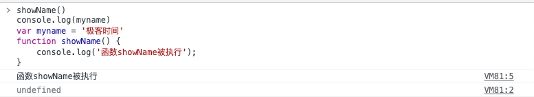

- 执行过程中，若使用了未声明的变量，那么JavaScript执行会报错。
- 在一个变量定义之前使用它，不会出错，但是该变量的值会为undefined，而不是定义时的值。
- 在一个函数定义之前使用它，不会出错，且函数能正确执行

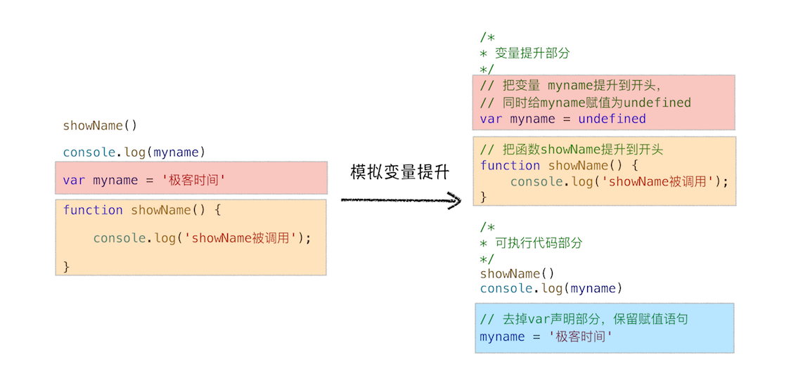

### 变量提升(Hoisting)

```js
var myName = '变量提升'
//等同于
var myName;
myName = '变量提升'
```
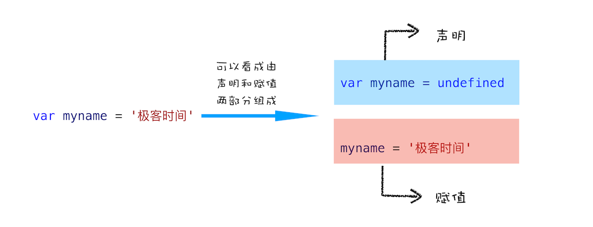


```js
function foo(){
  console.log('foo')
}

var bar = function(){
  console.log('bar')
}

```
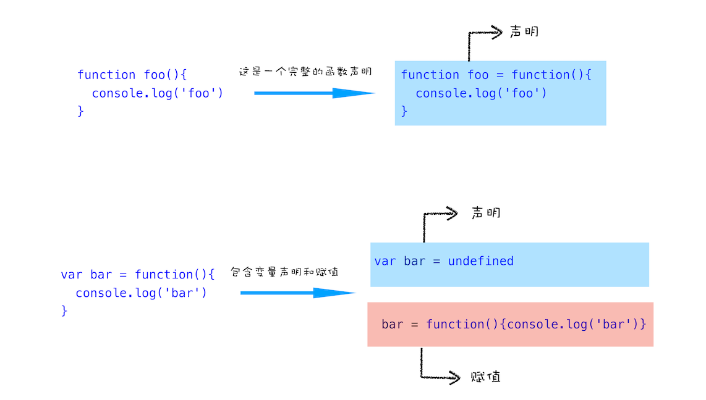

### JavaScript代码的执行流程


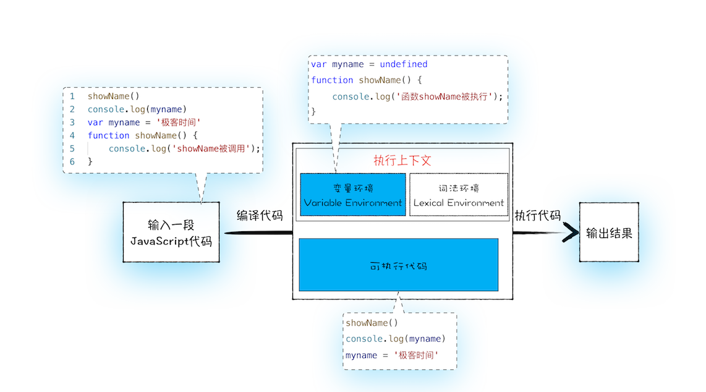

## 栈溢出

**执行上下文**

- 当JavaScript执行全局代码的时候，会编译全局代码并创建全局执行上下文，而且在整个页面的生存周期内，全局执行上下文只有一份。
- 当调用一个函数的时候，函数体内的代码会被编译，并创建函数执行上下文，一般情况下，函数执行结束之后，创建的函数执行上下文会被销毁。
- 当使用eval函数的时候，eval的代码也会被编译，并创建执行上下文。

```js
var a = 2
function add(){
    var b = 10
    return  a+b
}
add()

```


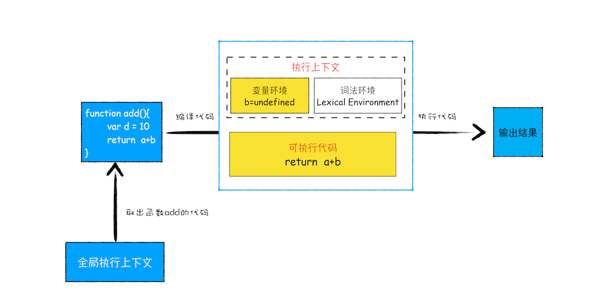

JavaScript引擎通过一种叫栈的数据结构来管理执行上下文

**调用栈**

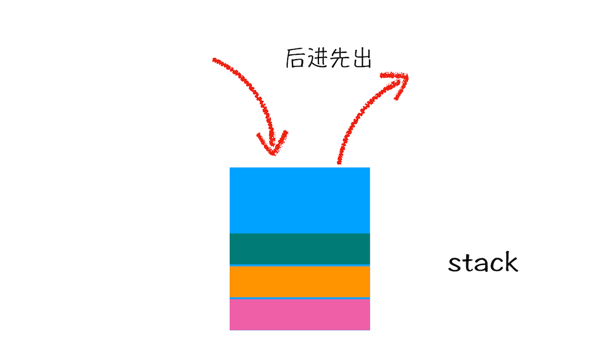

JavaScript引擎正是利用栈的这种结构来管理执行上下文的。在执行上下文创建好后，JavaScript引擎会将执行上下文压入栈中，通常把这种用来管理执行上下文的栈称为执行上下文栈，又称调用栈。


```js
var a = 2
function add(b,c){
  return b+c
}
function addAll(b,c){
  var d = 10
  result = add(b,c)
  return  a+result+d
}
addAll(3,6)

```
第一步，创建全局上下文，并将其压入栈底

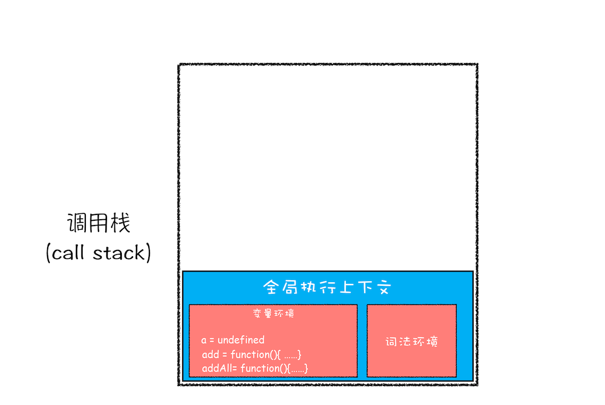

第二步是调用addAll函数

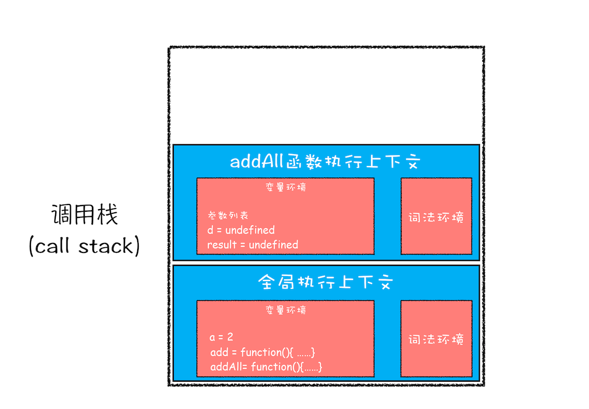

第三步，当执行到add函数调用语句时，同样会为其创建执行上下文，并将其压入调用栈

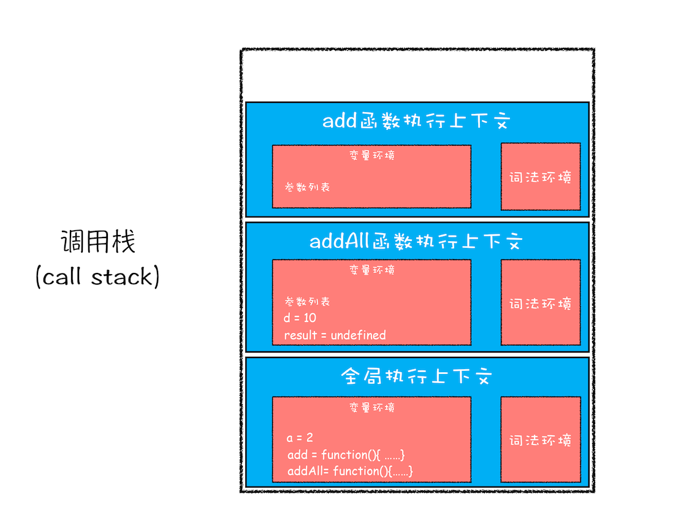

当add函数返回时，该函数的执行上下文就会从栈顶弹出，并将result的值设置为add函数的返回值

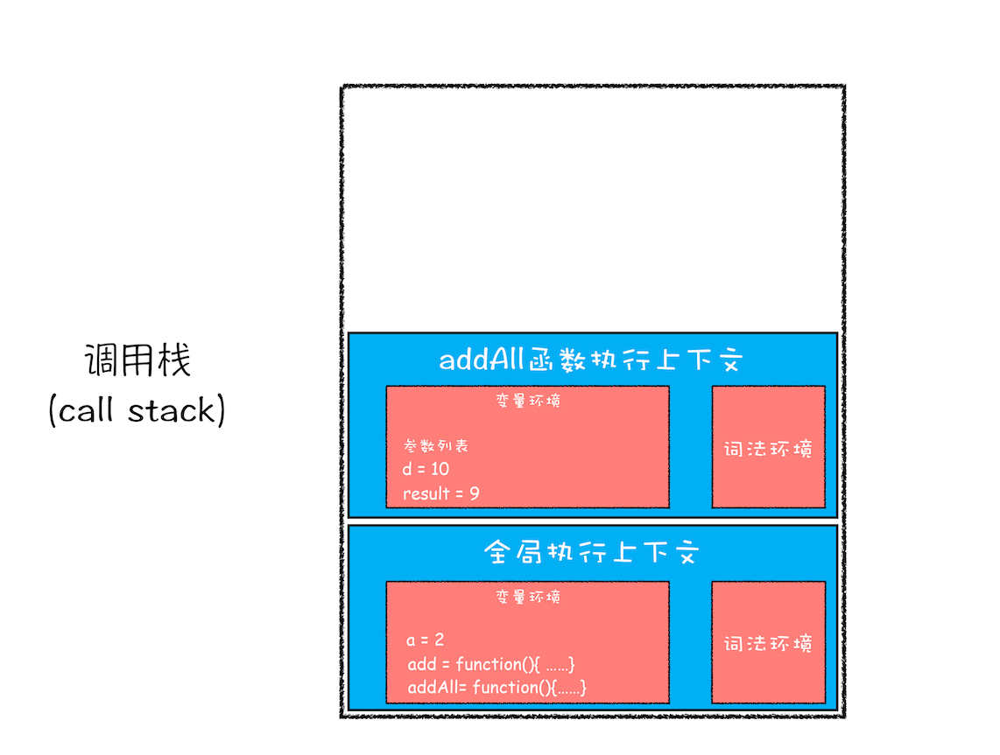


### 浏览器查看调用栈

如何利用浏览器查看调用栈的信息

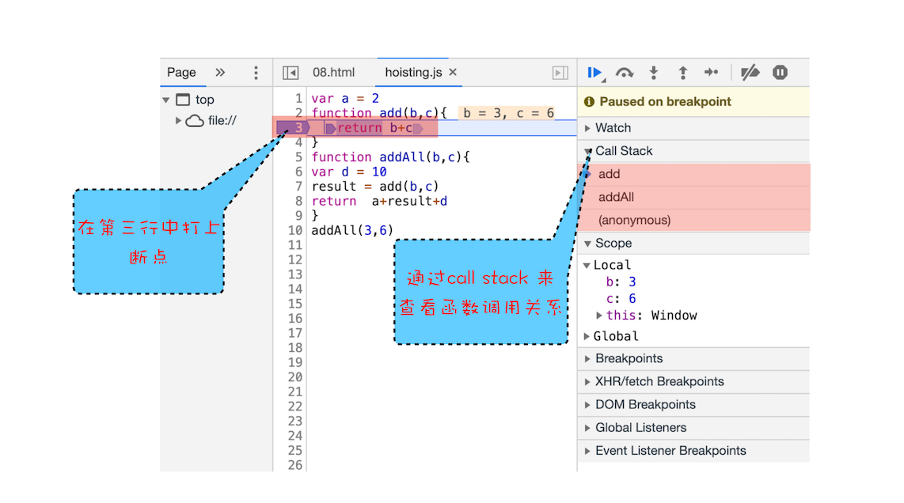

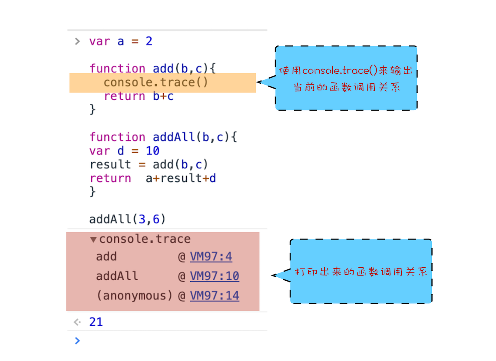

栈溢出（Stack Overflow）

```js
function division(a,b){
    return division(a,b)
}
console.log(division(1,2))
```

当JavaScript引擎开始执行这段代码时，它首先调用函数division，并创建执行上下文，压入栈中；然而，这个函数是递归的，并且没有任何终止条件，所以它会一直创建新的函数执行上下文，并反复将其压入栈中，但栈是有容量限制的，超过最大数量后就会出现栈溢出的错误。

## 作用域 （scope)

作用域是指在程序中定义变量的区域，该位置决定了变量的生命周期。通俗地理解，作用域就是变量与函数的可访问范围，即作用域控制着变量和函数的可见性和生命周期

在ES6之前，ES的作用域只有两种：全局作用域和函数作用域。

- 全局作用域中的对象在代码中的任何地方都能访问，其生命周期伴随着页面的生命周期。
- 函数作用域就是在函数内部定义的变量或者函数，并且定义的变量或者函数只能在函数内部被访问。函数执行结束之后，函数内部定义的变量会被销毁。


### 变量提升的问题

变量容易在不被察觉的情况下被覆盖掉


```js
var myname = "极客时间"
function showName(){
  console.log(myname);
  if(0){
   var myname = "极客邦"
  }
  console.log(myname);
}
showName()
```
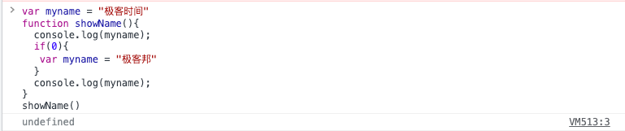

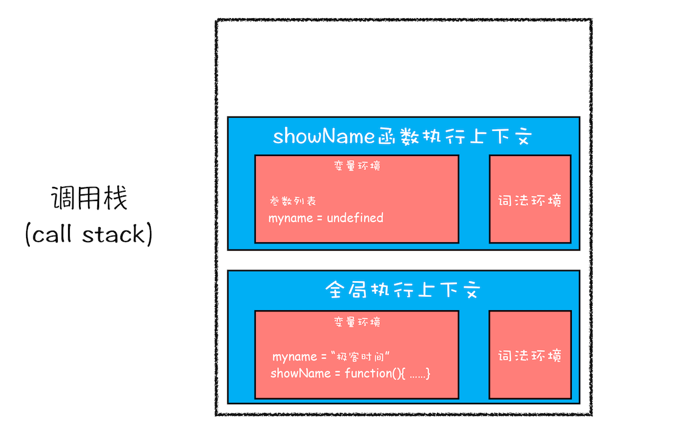


本应销毁的变量没有被销毁

```js
function foo(){
  for (var i = 0; i < 7; i++) {
  }
  //   i的值并未被销毁，所以最后打印出来的是7
  console.log(i); 
}
foo()

```

### ES6解决变量提升的缺陷

```js
function varTest() {
  var x = 1;
  if (true) {
    var x = 2;  // 同样的变量!
    console.log(x);  // 2
  }
  console.log(x);  // 2
}
```
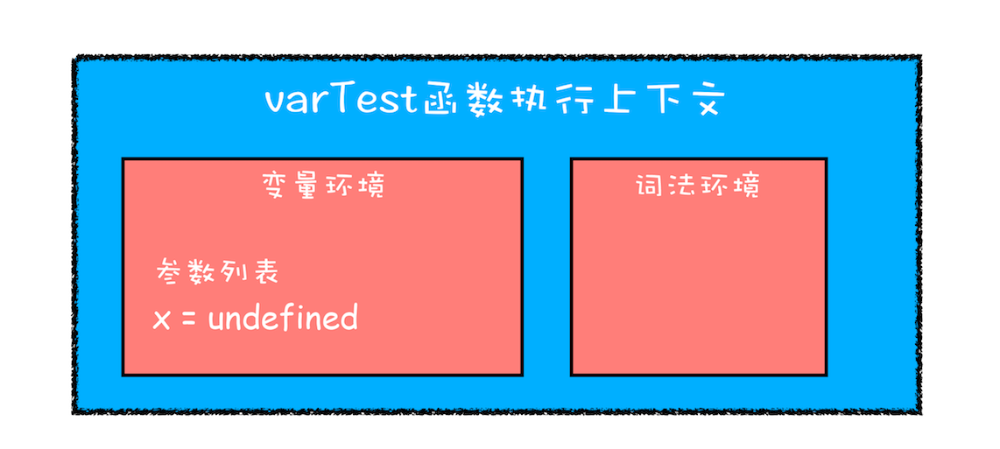

```js
function letTest() {
  let x = 1;
  if (true) {
    let x = 2;  // 不同的变量
    console.log(x);  // 2
  }
  console.log(x);  // 1
}

```

### 如何支持块级作用域

```js
function foo(){
    var a = 1
    let b = 2
    {
      let b = 3
      var c = 4
      let d = 5
      console.log(a)
      console.log(b)
    }
    console.log(b) 
    console.log(c)
    console.log(d)
}   
foo()
```
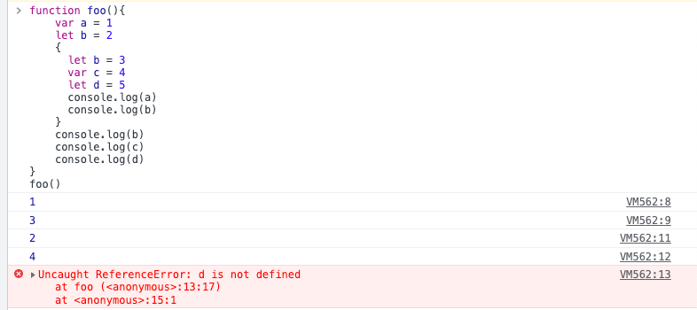

第一步是编译并创建执行上下文

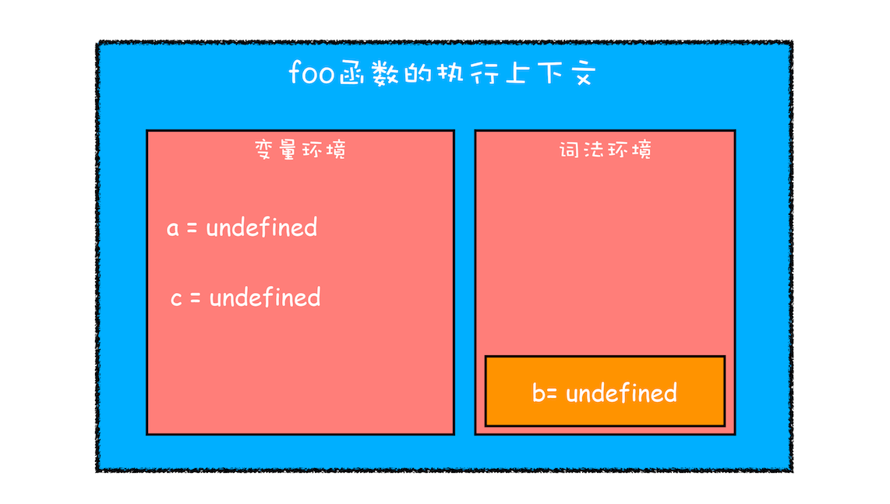

- 函数内部通过var声明的变量，在编译阶段全都被存放到变量环境里面了。
- 通过let声明的变量，在编译阶段会被存放到词法环境（Lexical Environment）中。
- 在函数的作用域内部，通过let声明的变量并没有被存放到词法环境中。
- 接下来，第二步继续执行代码，当执行到代码块里面时，变量环境中a的值已经被设置成了1，词法环境中b的值已经被设置成了2，

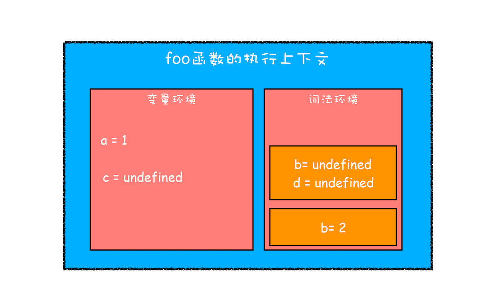

在词法环境内部，维护了一个小型栈结构，栈底是函数最外层的变量，进入一个作用域块后，就会把该作用域块内部的变量压到栈顶；当作用域执行完成之后，该作用域的信息就会从栈顶弹出，这就是词法环境的结构。

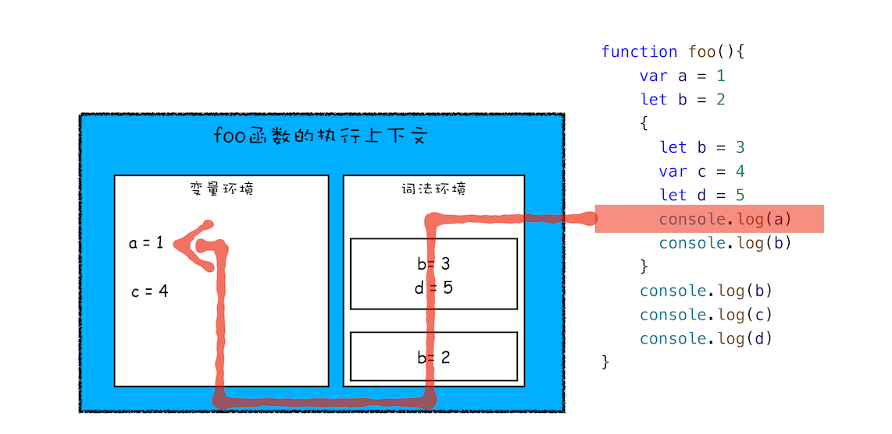

当作用域块执行结束之后，其内部定义的变量就会从词法环境的栈顶弹出，最终执行上下文如下图所示：

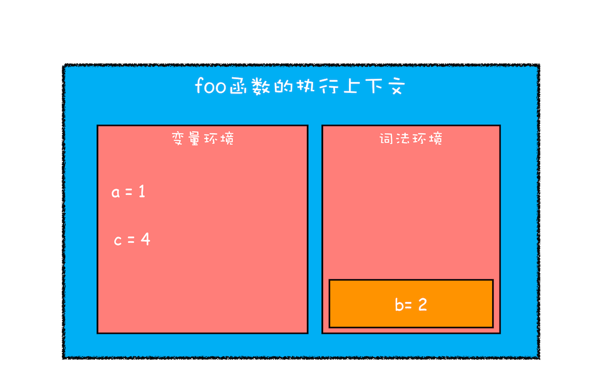

## 作用域链和闭包

```js
function bar() {
    console.log(myName)
}
function foo() {
    var myName = " 极客邦 "
    bar()
}
var myName = " 极客时间 "
foo()
```

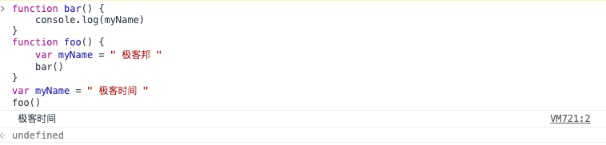

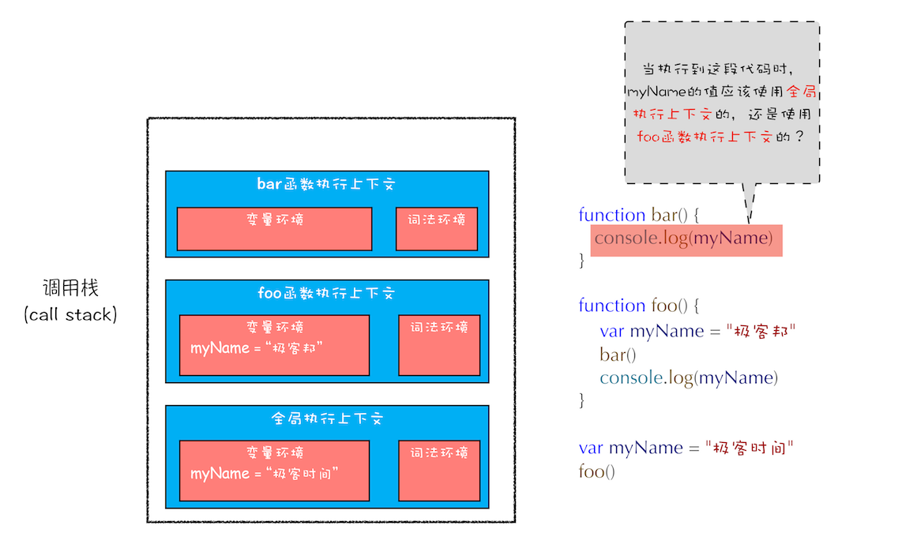

### 作用域链

每个执行上下文的变量环境中，都包含了一个外部引用，用来指向外部的执行上下文

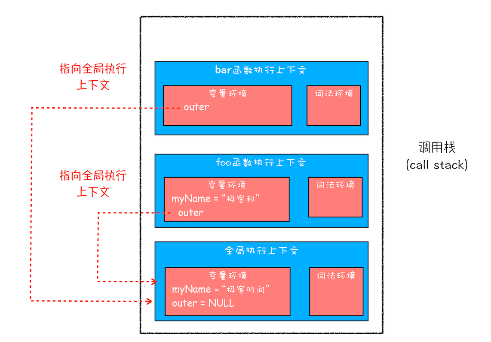

### 词法作用域

**词法作用域就是指作用域是由代码中函数声明的位置来决定的**，所以词法作用域是静态的作用域，通过它就能够预测代码在执行过程中如何查找标识符

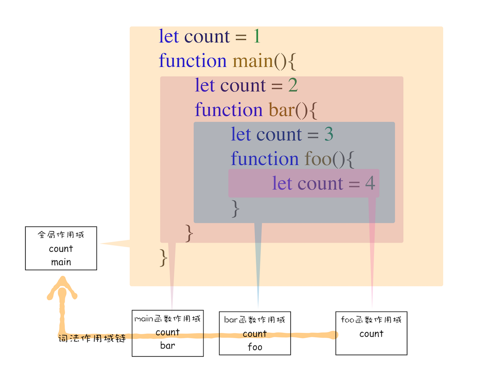


### 变量查找

```js
function bar() {
    var myName = " 极客世界 "
    let test1 = 100
    if (1) {
        let myName = "Chrome 浏览器 "
        console.log(test)
    }
}
function foo() {
    var myName = " 极客邦 "
    let test = 2
    {
        let test = 3
        bar()
    }
}
var myName = " 极客时间 "
let myAge = 10
let test = 1
foo()

```
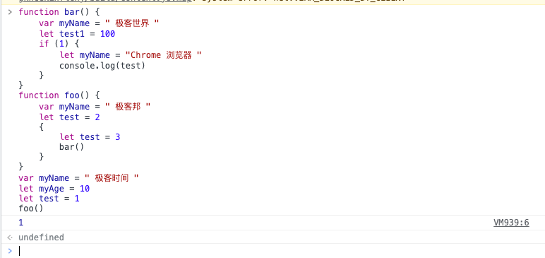

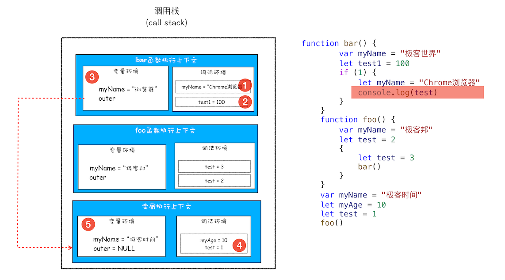

## 闭包

```js
function foo() {
    var myName = " 极客时间 "
    let test1 = 1
    const test2 = 2
    var innerBar = {
        getName:function(){
            console.log(test1)
            return myName
        },
        setName:function(newName){
            myName = newName
        }
    }
    return innerBar
}
var bar = foo()
bar.setName(" 极客邦 ")
bar.getName()
console.log(bar.getName())

```

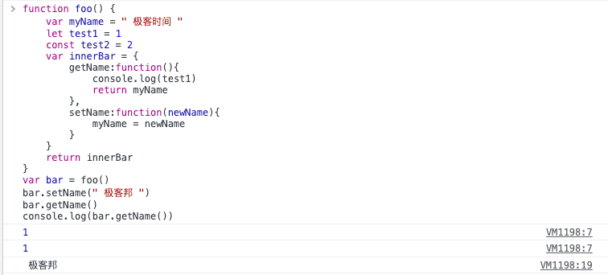

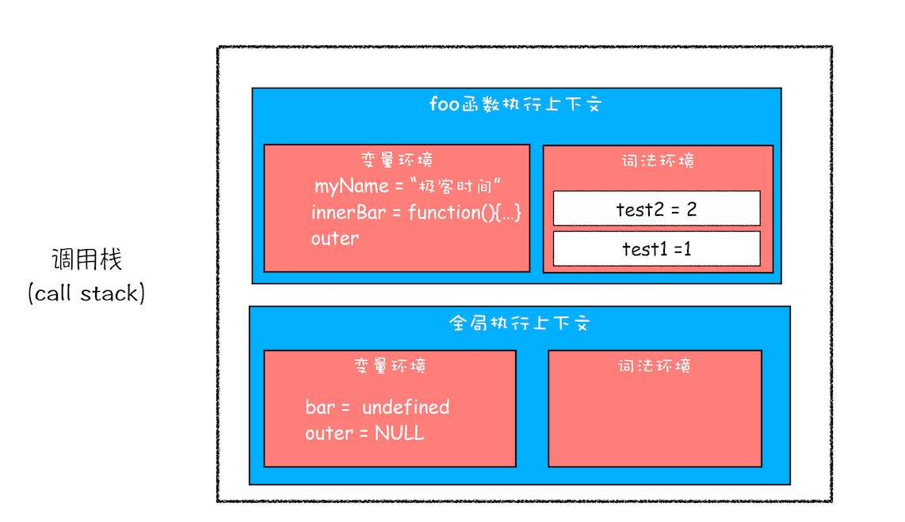

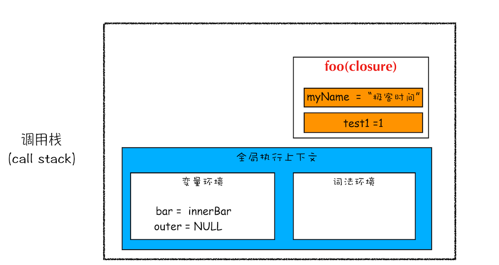

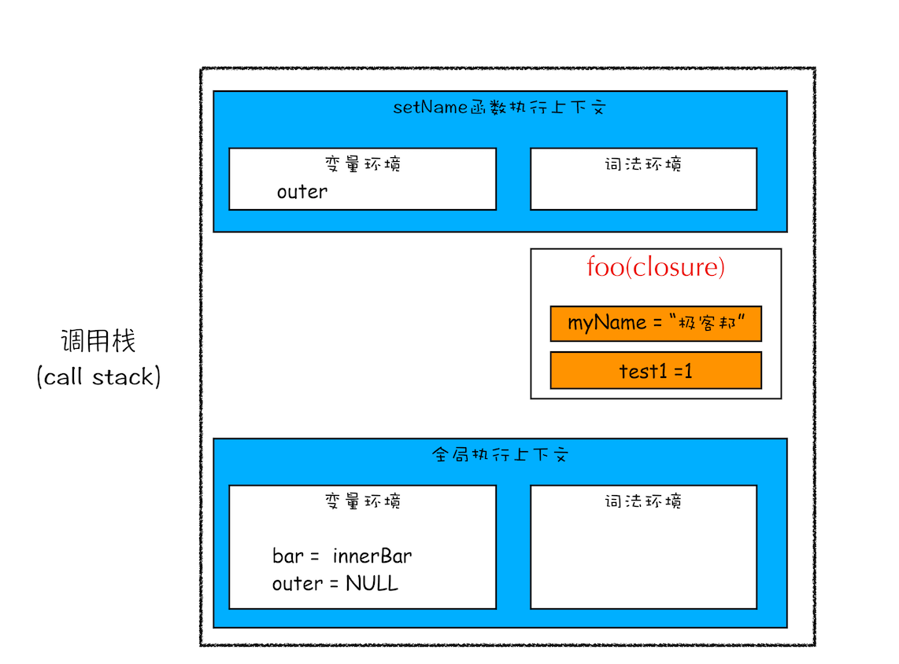

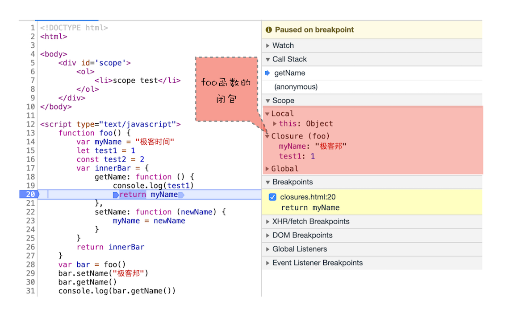


### 闭包回收

如果引用闭包的函数是一个全局变量，那么闭包会一直存在直到页面关闭；但如果这个闭包以后不再使用的话，就会造成内存泄漏。

引用闭包的函数是个局部变量，等函数销毁后，在下次 JavaScript 引擎执行垃圾回收时，判断闭包这块内容如果已经不再被使用了，那么 JavaScript 引擎的垃圾回收器就会回收这块内存。

## this

当函数作为对象的方法调用时，函数中的 this 就是该对象； 
当函数被正常调用时，在严格模式下，this 值是 undefined，非严格模式下 this 指向的是全局对象 window； 
嵌套函数中的 this 不会继承外层函数的 this 值。 

this 是和执行上下文绑定的
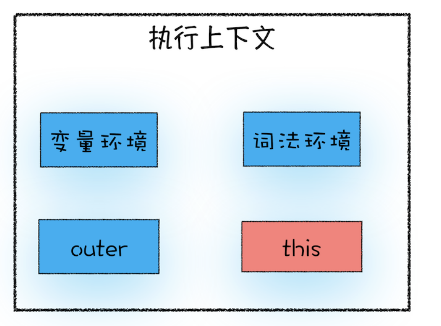

