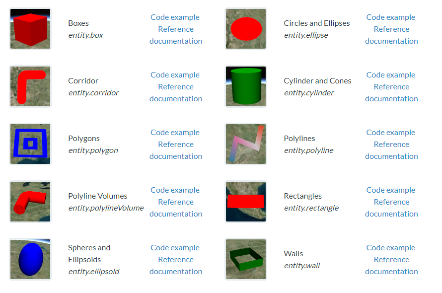

## 物体



```js
var viewer = new Cesium.Viewer('cesiumContainer');

// 创建一个entity
var entity = viewer.entities.add({
    name: 'Sample Entity', // 实体名称
    position: Cesium.Cartesian3.fromDegrees(-75.59777, 40.03883), // 实体的位置，使用经度、纬度、高度表示
    description: 'This is a sample entity.', // 描述
    point: { // 点属性
        pixelSize: 10, // 点大小
        color: Cesium.Color.YELLOW, // 点颜色
        outlineColor: Cesium.Color.BLACK, // 边框颜色
        outlineWidth: 2 // 边框宽度
    },
    label: { // 标签属性
        text: 'Sample Entity', // 标签文本
        font: '16px sans-serif', // 字体
        fillColor: Cesium.Color.RED, // 文本颜色
        outlineColor: Cesium.Color.BLACK, // 文本边框颜色
        outlineWidth: 2, // 文本边框宽度
        style: Cesium.LabelStyle.FILL_AND_OUTLINE // 标签样式
    },
    polyline: { // 折线属性
        positions: Cesium.Cartesian3.fromDegreesArray([-75.59777, 40.03883, -80.50, 35.14]), // 折线顶点数组
        width: 5, // 折线宽度
        material: Cesium.Color.GREEN // 折线颜色
    },
    polygon: { // 多边形属性
        hierarchy: Cesium.Cartesian3.fromDegreesArray([
            -72.0, 40.0,
            -70.0, 35.0,
            -75.0, 30.0,
            -80.0, 33.0,
            -78.0, 38.0]), // 多边形顶点数组
        material: Cesium.Color.BLUE.withAlpha(0.5), // 多边形填充颜色
        outline: true, // 是否显示多边形边框
        outlineColor: Cesium.Color.BLACK, // 多边形边框颜色
        outlineWidth: 2 // 多边形边框宽度
    },
    billboard: { // 图标属性
        image: 'img/rocket.png', // 图标路径
        width: 50, // 图标宽度
        height: 50 // 图标高度
    },
    ellipse: { // 椭圆属性
        semiMinorAxis: 250000.0, // 椭圆的短轴半径
        semiMajorAxis: 400000.0, // 椭圆的长轴半径
        height: 500000.0, // 椭圆的高度
        material: Cesium.Color.RED.withAlpha(0.5), // 椭圆的填充颜色
        outline: true, // 是否绘制轮廓线
        outlineColor: Cesium.Color.BLACK, // 轮廓线的颜色
        outlineWidth: 2, // 轮廓线的宽度
        numberOfVerticalLines: 10, // 椭圆的竖直方向分割线的数量
        numberOfHorizontalLines: 10, // 椭圆的水平方向分割线的数量
        rotation: Cesium.Math.toRadians(45), // 椭圆的旋转角度，单位为弧度
        stRotation: Cesium.Math.toRadians(0), // 纹理的旋转角度，单位为弧度
        granularity: Cesium.Math.toRadians(1.0), // 椭圆的分辨率，即两个分割线之间的角度，单位为弧度
    },
});

```

<iframe src="/cesium/examples/entity-cesium-entity.html" width="100%" height="500px"></iframe>

## [材质](https://cesium.com/learn/cesiumjs-learn/cesiumjs-geometry-appearances/)


1. ColorMaterialProperty: 颜色材质，用于指定实体的颜色。可以使用静态颜色或动态颜色。

```js
// 静态颜色
entity.model.color = Cesium.Color.RED;

// 动态颜色
entity.polygon.material = new Cesium.ColorMaterialProperty(
  Cesium.Color.fromCssColorString("#ff0000").withAlpha(0.5)
);
```

2. ImageMaterialProperty: 图片材质，用于将实体表面纹理映射到指定的图像。

```js
entity.polygon.material = new Cesium.ImageMaterialProperty({
  image: "https://cesium.com/downloads/cesiumjs/releases/1.83/Build/Cesium/Assets/Textures/maki/grocery.png",
  repeat: new Cesium.Cartesian2(4, 4),
});
```

3. StripeMaterialProperty: 条纹材质，用于在实体表面创建条纹。可以控制条纹的颜色、方向和宽度。

```js
entity.polygon.material = new Cesium.StripeMaterialProperty({
  evenColor: Cesium.Color.fromCssColorString("#FFD700").withAlpha(0.5),
  oddColor: Cesium.Color.fromCssColorString("#F4A460").withAlpha(0.5),
  repeat: 5,
  offset: 0.5,
  orientation: Cesium.StripeOrientation.HORIZONTAL,
  evenRepeat: 2,
  oddRepeat: 2,
});
```

4. CheckerboardMaterialProperty: 棋盘材质，用于在实体表面创建棋盘格。可以控制颜色和方向。

```js
entity.polygon.material = new Cesium.CheckerboardMaterialProperty({
  evenColor: Cesium.Color.fromCssColorString("#FFD700").withAlpha(0.5),
  oddColor: Cesium.Color.fromCssColorString("#F4A460").withAlpha(0.5),
  repeat: new Cesium.Cartesian2(4, 4),
});
```

5. PolylineOutlineMaterialProperty: 折线轮廓材质，用于在折线上创建轮廓线。可以控制轮廓线的颜色、宽度和间隔。

```js
entity.polyline.material = new Cesium.PolylineOutlineMaterialProperty({
  color: Cesium.Color.RED,
  outlineColor: Cesium.Color.BLUE,
  outlineWidth: 2,
  gapColor: Cesium.Color.YELLOW,
  gapWidth: 4,
});
```

6. PolylineGlowMaterialProperty: 折线发光材质，用于在折线上创建发光效果。可以控制发光线的颜色、宽度和强度。

```js
entity.polyline.material = new Cesium.PolylineGlowMaterialProperty({
  glowPower: 0.2,
  taperPower: 0.5,
  color: Cesium.Color.YELLOW,
  taperOpacity: 0.3,
});
```


7. PolylineArrowMaterialProperty：用于创建带箭头的折线材质。

属性：

- color: Color对象，表示箭头的颜色。
- outlineColor: Color对象，表示箭头的轮廓线的颜色。
- outlineWidth: 数字，表示箭头的轮廓线的宽度。
- proportion: 数字，表示箭头的长度和线段长度的比例。
- angle: 数字，表示箭头两侧的夹角。

```js
let arrowMaterial = new Cesium.PolylineArrowMaterialProperty(
  Cesium.Color.RED, // 箭头颜色
  5, // 线宽
  0.3, // 箭头长度与线段长度的比例
  Cesium.Math.toRadians(30) // 箭头夹角
);
```

8. PolylineDashMaterialProperty：用于创建虚线材质。

属性：

- color: Color对象，表示虚线的颜色。
- gapColor: Color对象，表示虚线中间的间隔的颜色。
- dashLength: 数字，表示虚线的短划线的长度。
- dashPattern: 数组，表示虚线中的短划线和间隔的长度比例。

```js
let dashMaterial = new Cesium.PolylineDashMaterialProperty({
  color: Cesium.Color.YELLOW,
  gapColor: Cesium.Color.TRANSPARENT,
  dashLength: 20.0,
  dashPattern: [5.0, 10.0],
});
```

9. PolylineGlowMaterialProperty：用于创建发光的折线材质。

属性：

- color: Color对象，表示发光的颜色。
- glowPower: 数字，表示发光的强度。

```js
let glowMaterial = new Cesium.PolylineGlowMaterialProperty({
  color: Cesium.Color.BLUE,
  glowPower: 0.2,
});
```

10. PolylineOutlineMaterialProperty：用于创建有轮廓线的折线材质。

属性：

- color: Color对象，表示轮廓线的颜色。
- outlineColor: Color对象，表示轮廓线的颜色。
- outlineWidth: 数字，表示轮廓线的宽度。

```js
let outlineMaterial = new Cesium.PolylineOutlineMaterialProperty({
  color: Cesium.Color.ORANGE,
  outlineColor: Cesium.Color.WHITE,
  outlineWidth: 2,
});
```

<iframe src="/cesium/examples/entity-cesium-material.html" width="100%" height="500px"></iframe>
