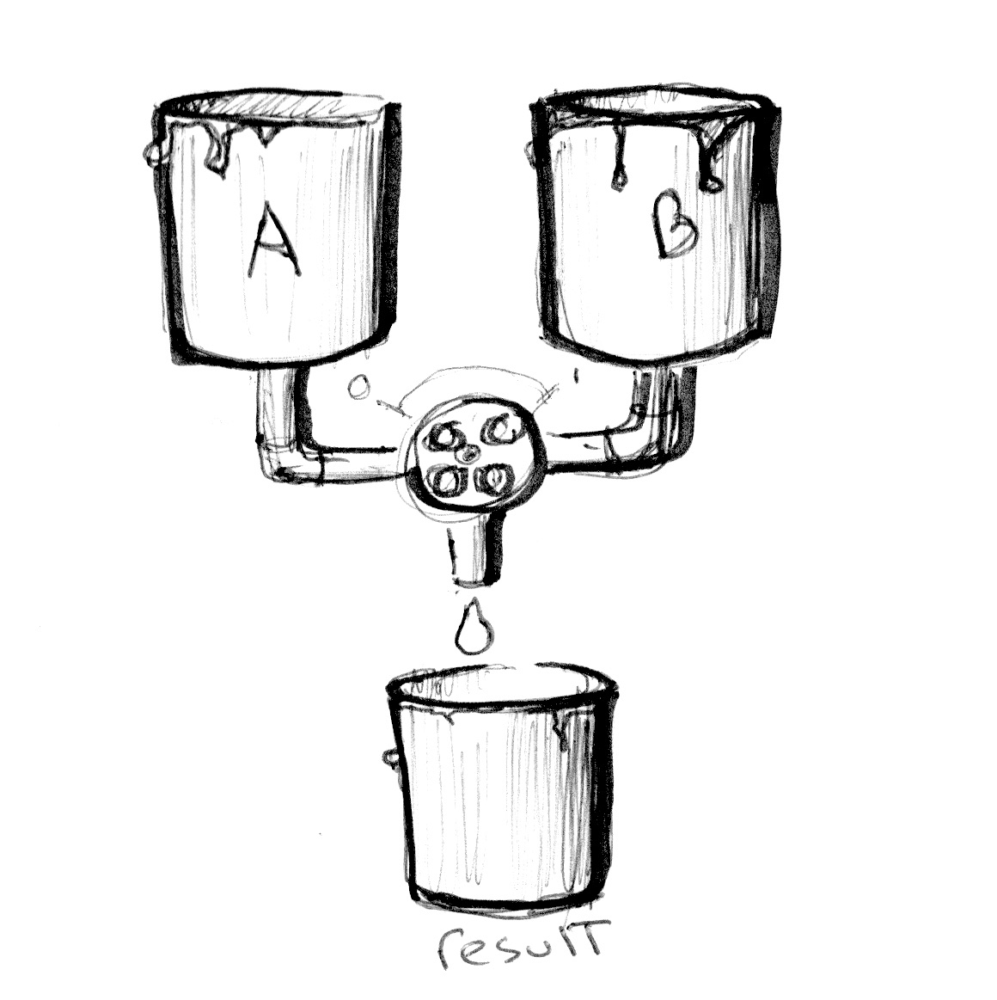
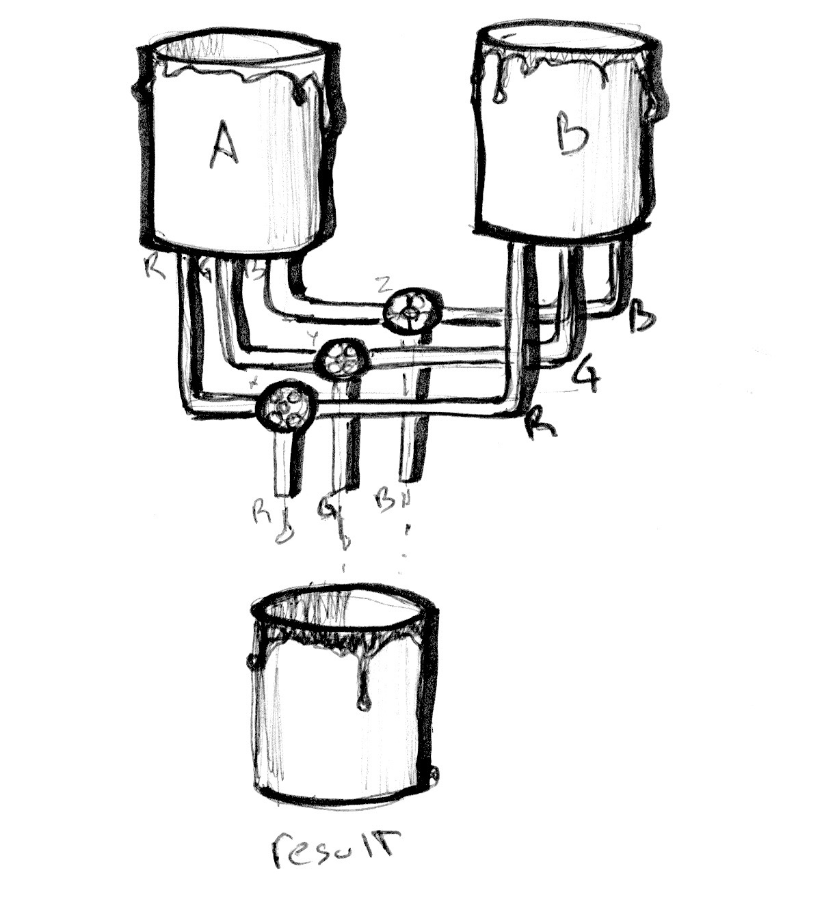

 部分参考： 《OpenGL 编程指南》、《The Book of Shader》

## 混合颜色

<!--  -->


```glsl
#ifdef GL_ES
precision mediump float;
#endif

uniform vec2 u_resolution;
uniform float u_time;

vec3 colorA = vec3(0.149,0.141,0.912);
vec3 colorB = vec3(1.000,0.833,0.224);

void main() {
    vec3 color = vec3(0.0);

    float pct = abs(sin(u_time));

    // Mix uses pct (a value from 0-1) to
    // mix the two colors
    color = mix(colorA, colorB, pct);

    gl_FragColor = vec4(color,1.0);
}


```

<div ref="mixRef"></div>

## 渐变



<!--  -->

```glsl
#ifdef GL_ES
precision mediump float;
#endif

#define PI 3.14159265359

uniform vec2 u_resolution;
uniform vec2 u_mouse;
uniform float u_time;

vec3 colorA = vec3(0.149,0.141,0.912);
vec3 colorB = vec3(1.000,0.833,0.224);

/*

生成一条直线
pct.x => x轴坐标 当st.y = stx.x 放回 1 
*/
float plot (vec2 st, float pct){
  return  smoothstep( pct-0.01, pct, st.y) -
          smoothstep( pct, pct+0.01, st.y);
}

void main() {
    vec2 st = gl_FragCoord.xy/u_resolution.xy;
    vec3 color = vec3(0.0);

    vec3 pct = vec3(st.x);

    // pct.r = smoothstep(0.0,1.0, st.x);
    // pct.g = sin(st.x*PI);
    // pct.b = pow(st.x,0.5);

    color = mix(colorA, colorB, pct);

    // Plot transition lines for each channel
    color = mix(color,vec3(1.0,0.0,0.0),plot(st,pct.r));
    color = mix(color,vec3(0.0,1.0,0.0),plot(st,pct.g));
    color = mix(color,vec3(0.0,0.0,1.0),plot(st,pct.b));

    gl_FragColor = vec4(color,1.0);
}


```

<div ref="fadeRef"></div>

```glsl

varying vec2 v_uv;
uniform float u_time;
void main(){
       vec3 col = 0.5 + 0.5*cos(u_time+v_uv.xyx+vec3(0,2,4));
       gl_FragColor = vec4(col,1.0);
   }

```

<div ref="colorFadeRef"> </div>

## HSB

```glsl
#ifdef GL_ES
precision mediump float;
#endif

uniform vec2 u_resolution;
uniform float u_time;

vec3 rgb2hsb( in vec3 c ){
    vec4 K = vec4(0.0, -1.0 / 3.0, 2.0 / 3.0, -1.0);
    vec4 p = mix(vec4(c.bg, K.wz),
                 vec4(c.gb, K.xy),
                 step(c.b, c.g));
    vec4 q = mix(vec4(p.xyw, c.r),
                 vec4(c.r, p.yzx),
                 step(p.x, c.r));
    float d = q.x - min(q.w, q.y);
    float e = 1.0e-10;
    return vec3(abs(q.z + (q.w - q.y) / (6.0 * d + e)),
                d / (q.x + e),
                q.x);
}

//  Function from Iñigo Quiles
//  https://www.shadertoy.com/view/MsS3Wc
vec3 hsb2rgb( in vec3 c ){
    vec3 rgb = clamp(abs(mod(c.x*6.0+vec3(0.0,4.0,2.0),
                             6.0)-3.0)-1.0,
                     0.0,
                     1.0 );
    rgb = rgb*rgb*(3.0-2.0*rgb);
    return c.z * mix(vec3(1.0), rgb, c.y);
}

void main(){
    vec2 st = gl_FragCoord.xy/u_resolution;
    vec3 color = vec3(0.0);

    // We map x (0.0 - 1.0) to the hue (0.0 - 1.0)
    // And the y (0.0 - 1.0) to the brightness
    color = hsb2rgb(vec3(st.x,1.0,st.y));

    gl_FragColor = vec4(color,1.0);
}


```

<div ref="hsbRef"></div>

```glsl
#ifdef GL_ES
precision mediump float;
#endif

#define TWO_PI 6.28318530718

uniform vec2 u_resolution;
uniform float u_time;

//  Function from Iñigo Quiles
//  https://www.shadertoy.com/view/MsS3Wc
vec3 hsb2rgb( in vec3 c ){
    vec3 rgb = clamp(abs(mod(c.x*6.0+vec3(0.0,4.0,2.0),
                             6.0)-3.0)-1.0,
                     0.0,
                     1.0 );
    rgb = rgb*rgb*(3.0-2.0*rgb);
    return c.z * mix( vec3(1.0), rgb, c.y);
}

void main(){
    vec2 st = gl_FragCoord.xy/u_resolution;
    vec3 color = vec3(0.0);

    // Use polar coordinates instead of cartesian
    vec2 toCenter = vec2(0.5)-st;
    float angle = atan(toCenter.y,toCenter.x);
    float radius = length(toCenter)*2.0;

    // Map the angle (-PI to PI) to the Hue (from 0 to 1)
    // and the Saturation to the radius
    color = hsb2rgb(vec3((angle/TWO_PI)+0.5,radius,1.0));

    gl_FragColor = vec4(color,1.0);
}
```

<div ref="rgbRef"></div>

## 落日

```glsl
//作者：https://www.shadertoy.com/view/XlsXDB
// License: CC BY 4.0
# ifdef GL_ES
precision mediump float;
# endif
uniform vec3 iResolution;
uniform float iTime;
uniform vec4 iDate;

#define saturate(x) clamp(x,0.,1.)
#define rgb(r,g,b) (vec3(r,g,b)/255.)

float rand(float x) { return fract(sin(x) * 71.5413291); }

float rand(vec2 x) { return rand(dot(x, vec2(13.4251, 15.5128))); }

float noise(vec2 x)
{
    vec2 i = floor(x);
    vec2 f = x - i;
    f *= f*(3.-2.*f);
    return mix(mix(rand(i), rand(i+vec2(1,0)), f.x),
               mix(rand(i+vec2(0,1)), rand(i+vec2(1,1)), f.x), f.y);
}

float fbm(vec2 x)
{
    float r = 0.0, s = 1.0, w = 1.0;
    for (int i=0; i<5; i++)
    {
        s *= 2.0;
        w *= 0.5;
        r += w * noise(s * x);
    }
    return r;
}

float cloud(vec2 uv, float scalex, float scaley, float density, float sharpness, float speed)
{
    return pow(saturate(fbm(vec2(scalex,scaley)*(uv+vec2(speed,0)*iTime))-(1.0-density)), 1.0-sharpness);
}

vec3 render(vec2 uv)
{
    // sky
    vec3 color = mix(rgb(255,212,166), rgb(204,235,255), uv.y);
    // sun
    vec2 spos = uv - vec2(0., 0.4);
    float sun = exp(-20.*dot(spos,spos));
    vec3 scol = rgb(255,155,102) * sun * 0.7;
    color += scol;
    // clouds
    vec3 cl1 = mix(rgb(151,138,153), rgb(166,191,224),uv.y);
    float d1 = mix(0.9,0.1,pow(uv.y, 0.7));
    color = mix(color, cl1, cloud(uv,2.,8.,d1,0.4,0.04));
    color = mix(color, vec3(0.9), 8.*cloud(uv,14.,18.,0.9,0.75,0.02) * cloud(uv,2.,5.,0.6,0.15,0.01)*uv.y);
    color = mix(color, vec3(0.8), 5.*cloud(uv,12.,15.,0.9,0.75,0.03) * cloud(uv,2.,8.,0.5,0.0,0.02)*uv.y);
    // post
    color *= vec3(1.0,0.93,0.81)*1.04;
    color = mix(0.75*rgb(255,205,161), color, smoothstep(-0.1,0.3,uv.y));
    color = pow(color,vec3(1.3));
    return color;
}

void main()
{
	vec2 uv = gl_FragCoord.xy / iResolution.xy;
    uv.x -= 0.5;
    uv.x *= iResolution.x / iResolution.y;
    
	gl_FragColor = vec4(render(uv),1.0);
}

```

<div ref="sunsetRef"></div>

<script setup>
import {ref,onMounted} from 'vue'
import * as THREE from 'three'

import {
    OrbitControls
} from 'three/examples/jsm/controls/OrbitControls'

const initScene = (shader)=>{
    // 1.创建场景
    const scene = new THREE.Scene()
    const clock = new THREE.Clock();
    const uniforms = {
        u_time: { type: "f", value: 1.0 },
        u_resolution: { type: "v2", value: new THREE.Vector2()}
    }
    // 2.创建相机
    const camera = new THREE.PerspectiveCamera(75,
    2 , 0.1, 1000);

    // 设置相机位置
    camera.position.set(0, 0, 20)
    scene.add(camera)

    // 着色器配置
    const shaderMaterial = new THREE.ShaderMaterial({
        uniforms:uniforms,
            vertexShader:`
        precision lowp float;
        varying vec2 v_uv;
        void main(){
            v_uv = uv;
            gl_Position = projectionMatrix *viewMatrix* modelMatrix * vec4( position, 1.0 );
        }
        `,
        fragmentShader: shader.fragmentShader,
        side: THREE.DoubleSide
    })
    // 创建平面
    const floor = new THREE.Mesh(new THREE.PlaneGeometry(100, 100), shaderMaterial)
    floor.position.set(0,0,0)
    scene.add(floor)
    // 初始化渲染器
    const renderer = new THREE.WebGLRenderer()
    if(!__VUEPRESS_SSR__) {
        renderer.setPixelRatio( window.devicePixelRatio );
    }
    // 设置渲染器大小

    renderer.setSize(shader.shaderDom.value.offsetWidth, shader.shaderDom.value.offsetWidth/2)
    renderer.shadowMap.enabled = true
    shader.shaderDom.value.appendChild(renderer.domElement)
    renderer.render(scene,camera)
        // 创建轨道控制器
    const controls = new OrbitControls(camera, renderer.domElement)
    // 设置控制器阻尼
    controls.enableDamping = true
    uniforms.u_resolution.value.x = renderer.domElement.width
    uniforms.u_resolution.value.y = renderer.domElement.height
    function render() {
        uniforms.u_time.value += clock.getDelta();
        controls.update()
        renderer.render(scene, camera)
        requestAnimationFrame(render)
    }

    render()

}

const initShaderToy = (shader) => {
        // 1.创建场景
    const scene = new THREE.Scene()
    const clock = new THREE.Clock();
    const uniforms = {
        iResolution: { value: new THREE.Vector3() },
        iTime: { value: 0 },
        iTimeDelta: { value: 0 },
        iFrameRate: { value: 60 },
        iFrame: { value: 0 },
        iChannelTime: { value: [0, 0, 0, 0] },
        iChannelResolution: { value: [new THREE.Vector3(), new THREE.Vector3(), new THREE.Vector3(), new THREE.Vector3()] },
        iMouse: { value: new THREE.Vector4() },
        iChannel0: { value: new THREE.Texture() },
        iChannel1: { value: new THREE.Texture() },
        iChannel2: { value: new THREE.Texture() },
        iChannel3: { value: new THREE.Texture() },
        iDate: { value: new THREE.Vector4() }
    }
    // 2.创建相机
    const camera = new THREE.PerspectiveCamera(75,
    2 , 0.1, 1000);

    // 设置相机位置
    camera.position.set(0, 0, 20)
    scene.add(camera)

    // 着色器配置
    const shaderMaterial = new THREE.ShaderMaterial({
        uniforms:uniforms,
            vertexShader:`
        precision lowp float;
        varying vec2 v_uv;
        void main(){
            v_uv = uv;
            gl_Position = projectionMatrix *viewMatrix* modelMatrix * vec4( position, 1.0 );
        }
        `,
        fragmentShader: shader.fragmentShader,
        side: THREE.DoubleSide
    })
    // 创建平面
    const floor = new THREE.Mesh(new THREE.PlaneGeometry(100, 100), shaderMaterial)
    floor.position.set(0,0,0)
    scene.add(floor)
    // 初始化渲染器
    const renderer = new THREE.WebGLRenderer()
    if(!__VUEPRESS_SSR__) {
        renderer.setPixelRatio( window.devicePixelRatio );
    }
    // 设置渲染器大小

    renderer.setSize(shader.shaderDom.value.offsetWidth, shader.shaderDom.value.offsetWidth/2)
    renderer.shadowMap.enabled = true
    shader.shaderDom.value.appendChild(renderer.domElement)
    renderer.render(scene,camera)
        // 创建轨道控制器
    const controls = new OrbitControls(camera, renderer.domElement)
    // 设置控制器阻尼
    controls.enableDamping = true
    const textureLoader = new THREE.TextureLoader();
    shaderMaterial.uniforms.iResolution.value.set(shader.shaderDom.value.offsetWidth, shader.shaderDom.value.offsetWidth/2,1);

    // shaderMaterial.uniforms.iResolution.value.set(renderer.domElement.width, renderer.domElement.height, 1);
    // shaderMaterial.uniforms.iResolution.value.set(window.innerWidth, window.innerHeight, 1);
    shaderMaterial.uniforms.iChannel0.value = textureLoader.load("/assets/textures/ca.jpeg");;
    if(!__VUEPRESS_SSR__) {
        shader.shaderDom.value.addEventListener('mousemove',(event) => {
            // console.log(event.clientX,event.clientY,'event')
            shaderMaterial.uniforms.iMouse.value.set(event.clientX, event.clientY, 0, 0);

        })
    }

    function render() {
        controls.update()
        renderer.render(scene, camera)
        requestAnimationFrame(render)
        const now = new Date();
        const time = now.getTime() * 0.001;
        shaderMaterial.uniforms.iTime.value += clock.getDelta();
        shaderMaterial.uniforms.iDate.value.set(
          now.getFullYear(),
          now.getMonth(),
          now.getDate(),
          time
        );

    }

    render()
}
const mixRef = ref()
const mixShader = {
        shaderDom:mixRef,
        fragmentShader:`
# ifdef GL_ES
precision mediump float;
# endif

uniform vec2 u_resolution;
uniform float u_time;

vec3 colorA = vec3(0.149,0.141,0.912);
vec3 colorB = vec3(1.000,0.833,0.224);

void main() {
    vec3 color = vec3(0.0);

    float pct = abs(sin(u_time));

    // Mix uses pct (a value from 0-1) to
    // mix the two colors
    color = mix(colorA, colorB, pct);

    gl_FragColor = vec4(color,1.0);
}
`}

const fadeRef = ref()
const fadeShader = {
    shaderDom:fadeRef,
    fragmentShader:`
    #ifdef GL_ES
precision mediump float;
# endif

# define PI 3.14159265359

uniform vec2 u_resolution;
uniform vec2 u_mouse;
uniform float u_time;

vec3 colorA = vec3(0.149,0.141,0.912);
vec3 colorB = vec3(1.000,0.833,0.224);

float plot (vec2 st, float pct){
  return  smoothstep( pct-0.01, pct, st.y) -
          smoothstep( pct, pct+0.01, st.y);
}

void main() {
    vec2 st = gl_FragCoord.xy/u_resolution.xy;
    vec3 color = vec3(0.0);

    vec3 pct = vec3(st.x);

    // pct.r = smoothstep(0.0,1.0, st.x);
    // pct.g = sin(st.x*PI);
    // pct.b = pow(st.x,0.5);

    color = mix(colorA, colorB, pct);

    // Plot transition lines for each channel
    color = mix(color,vec3(1.0,0.0,0.0),plot(st,pct.r));
    color = mix(color,vec3(0.0,1.0,0.0),plot(st,pct.g));
    color = mix(color,vec3(0.0,0.0,1.0),plot(st,pct.b));

    gl_FragColor = vec4(color,1.0);
}

    `
}

const hsbRef = ref()
const hsbShader = {
    shaderDom:hsbRef,
    fragmentShader:`
    #ifdef GL_ES
precision mediump float;
# endif

uniform vec2 u_resolution;
uniform float u_time;

vec3 rgb2hsb( in vec3 c ){
    vec4 K = vec4(0.0, -1.0 / 3.0, 2.0 / 3.0, -1.0);
    vec4 p = mix(vec4(c.bg, K.wz),
                 vec4(c.gb, K.xy),
                 step(c.b, c.g));
    vec4 q = mix(vec4(p.xyw, c.r),
                 vec4(c.r, p.yzx),
                 step(p.x, c.r));
    float d = q.x - min(q.w, q.y);
    float e = 1.0e-10;
    return vec3(abs(q.z + (q.w - q.y) / (6.0 * d + e)),
                d / (q.x + e),
                q.x);
}

//  Function from Iñigo Quiles
//  https://www.shadertoy.com/view/MsS3Wc
vec3 hsb2rgb( in vec3 c ){
    vec3 rgb = clamp(abs(mod(c.x*6.0+vec3(0.0,4.0,2.0),
                             6.0)-3.0)-1.0,
                     0.0,
                     1.0 );
    rgb = rgb*rgb*(3.0-2.0*rgb);
    return c.z * mix(vec3(1.0), rgb, c.y);
}

void main(){
    vec2 st = gl_FragCoord.xy/u_resolution;
    vec3 color = vec3(0.0);

    // We map x (0.0 - 1.0) to the hue (0.0 - 1.0)
    // And the y (0.0 - 1.0) to the brightness
    color = hsb2rgb(vec3(st.x,1.0,st.y));

    gl_FragColor = vec4(color,1.0);
}

    `
}

const rgbRef = ref()
const rgbShader = {
    shaderDom:rgbRef,
    fragmentShader:`
    #ifdef GL_ES
precision mediump float;
# endif

# define TWO_PI 6.28318530718

uniform vec2 u_resolution;
uniform float u_time;

//  Function from Iñigo Quiles
//  https://www.shadertoy.com/view/MsS3Wc
vec3 hsb2rgb( in vec3 c ){
    vec3 rgb = clamp(abs(mod(c.x*6.0+vec3(0.0,4.0,2.0),
                             6.0)-3.0)-1.0,
                     0.0,
                     1.0 );
    rgb = rgb*rgb*(3.0-2.0*rgb);
    return c.z * mix( vec3(1.0), rgb, c.y);
}

void main(){
    vec2 st = gl_FragCoord.xy/u_resolution;
    vec3 color = vec3(0.0);

    // Use polar coordinates instead of cartesian
    vec2 toCenter = vec2(0.5)-st;
    float angle = atan(toCenter.y,toCenter.x);
    float radius = length(toCenter)*2.0;

    // Map the angle (-PI to PI) to the Hue (from 0 to 1)
    // and the Saturation to the radius
    color = hsb2rgb(vec3((angle/TWO_PI)+0.5,radius,1.0));

    gl_FragColor = vec4(color,1.0);
}

    `

}

const colorFadeRef = ref()

const colorFadeShader = {
    shaderDom:colorFadeRef,
    fragmentShader:`
    varying vec2 v_uv;
uniform float u_time;
void main(){
       vec3 col = 0.5 + 0.5*cos(u_time+v_uv.xyx+vec3(0,2,4));
       gl_FragColor = vec4(col,1.0);
   }

    `
}

const sunsetRef = ref()
const sunsetShader = {
shaderDom:sunsetRef,
fragmentShader:`
# ifdef GL_ES
precision mediump float;
# endif
uniform vec3 iResolution;
uniform float iTime;
uniform vec4 iDate;

#define saturate(x) clamp(x,0.,1.)
#define rgb(r,g,b) (vec3(r,g,b)/255.)

float rand(float x) { return fract(sin(x) * 71.5413291); }

float rand(vec2 x) { return rand(dot(x, vec2(13.4251, 15.5128))); }

float noise(vec2 x)
{
    vec2 i = floor(x);
    vec2 f = x - i;
    f *= f*(3.-2.*f);
    return mix(mix(rand(i), rand(i+vec2(1,0)), f.x),
               mix(rand(i+vec2(0,1)), rand(i+vec2(1,1)), f.x), f.y);
}

float fbm(vec2 x)
{
    float r = 0.0, s = 1.0, w = 1.0;
    for (int i=0; i<5; i++)
    {
        s *= 2.0;
        w *= 0.5;
        r += w * noise(s * x);
    }
    return r;
}

float cloud(vec2 uv, float scalex, float scaley, float density, float sharpness, float speed)
{
    return pow(saturate(fbm(vec2(scalex,scaley)*(uv+vec2(speed,0)*iTime))-(1.0-density)), 1.0-sharpness);
}

vec3 render(vec2 uv)
{
    // sky
    vec3 color = mix(rgb(255,212,166), rgb(204,235,255), uv.y);
    // sun
    vec2 spos = uv - vec2(0., 0.4);
    float sun = exp(-20.*dot(spos,spos));
    vec3 scol = rgb(255,155,102) * sun * 0.7;
    color += scol;
    // clouds
    vec3 cl1 = mix(rgb(151,138,153), rgb(166,191,224),uv.y);
    float d1 = mix(0.9,0.1,pow(uv.y, 0.7));
    color = mix(color, cl1, cloud(uv,2.,8.,d1,0.4,0.04));
    color = mix(color, vec3(0.9), 8.*cloud(uv,14.,18.,0.9,0.75,0.02) * cloud(uv,2.,5.,0.6,0.15,0.01)*uv.y);
    color = mix(color, vec3(0.8), 5.*cloud(uv,12.,15.,0.9,0.75,0.03) * cloud(uv,2.,8.,0.5,0.0,0.02)*uv.y);
    // post
    color *= vec3(1.0,0.93,0.81)*1.04;
    color = mix(0.75*rgb(255,205,161), color, smoothstep(-0.1,0.3,uv.y));
    color = pow(color,vec3(1.3));
    return color;
}

void main()
{
	vec2 uv = gl_FragCoord.xy / iResolution.xy;
    uv.x -= 0.5;
    uv.x *= iResolution.x / iResolution.y;
    
	gl_FragColor = vec4(render(uv),1.0);
}

`
}
onMounted(()=>{
    initScene(mixShader)
    initScene(fadeShader)
    initScene(hsbShader)
    initScene(rgbShader)
    initScene(colorFadeShader)
    initShaderToy(sunsetShader)
})
</script>
