| 参考 | 《网络是怎样连接的》 |
| ---- | -------------------- |

浏览器、Web服务器、网址（URL）、HTTP、HTML、协议、URI、请求消息、解析器、
Socket库、DNS服务器、域名

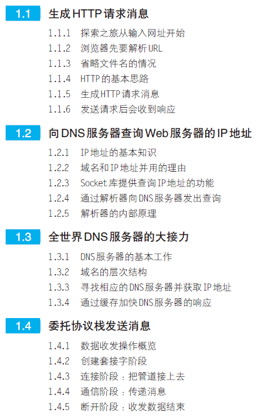

## 生成HTTP请求信息

### URL

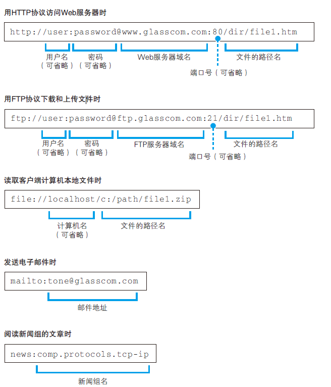

 

### 解析URL

**URL 以“/”来结尾表示访问的默认文件名**

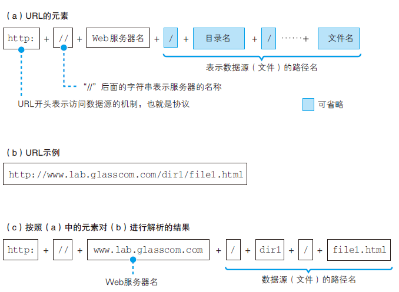

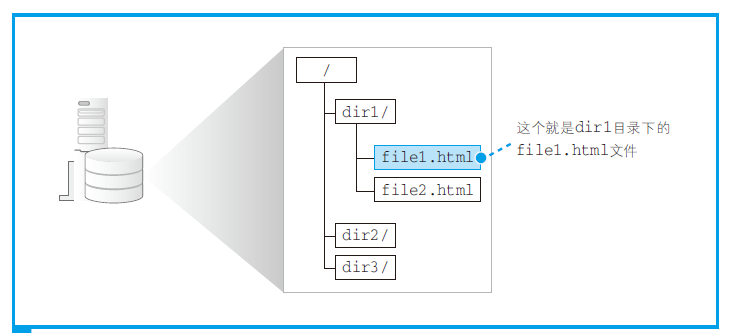

### 省略文件名

（a）[http://www.lab.glasscom.com/dir/](http://www.lab.glasscom.com/dir/)

像前面这样省略文件名时，服务器就会访问/dir/index.html者/dir/default.htm。

（b）[http://www.lab.glasscom.com/](http://www.lab.glasscom.com/)

由于省略了文件名，所以结果就是访问/index.html 或者default.htm 这样的文件

（c）[http://www.lab.glasscom.com](http://www.lab.glasscom.com/)

当没路径名时，就代表访问根目录下事先设置的默认文，也就是/index.tml 或者/default.htm 这些文

（d）[http://www.lab.glasscom.com/whatisthis](http://www.lab.glasscom.com/whatisthis)

如果eb 服务器上存在名为whatisthis 的文件，则将whatisthis 作为文件名来处；如果存在名为whatisthis 的目录，则将whatisthis 作为目录名来处理

### HTTP

HTTP 协议定义了客户端和服务器之间交互的消息内容和步骤

客户端会向服务器发送请求消息。请求息中包含的内容是“对什么”和“进行怎样的操作”两个部分

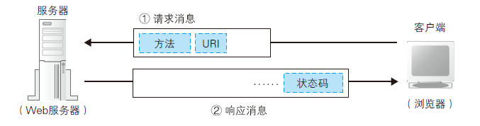

**“对什么”的部分称为UR**。一般来说，URI 的内容是一个存放网页据的文件名或者是一个CGI 程序B 的文件名，例如“/dir1/file1.html”/dir1/program1.cgi”

**“进行怎样的操作”的部分称为方法**。方法表示需要让Web 服务器完成怎样的工作，其中典型的例子包括读取URI 表示的数据、客户端输入的数据发送给URI 表示的程序等。

HTTP主要方法：

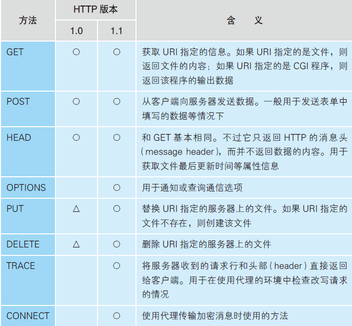

### 生成HTTP请求信息

对URL 进行解析之后，浏览器确定了Web 服务器和文件名，接下来就是根据这些信息来生成HTTP 请求消息

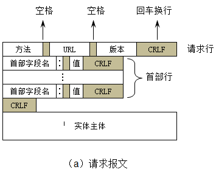

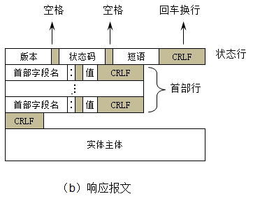

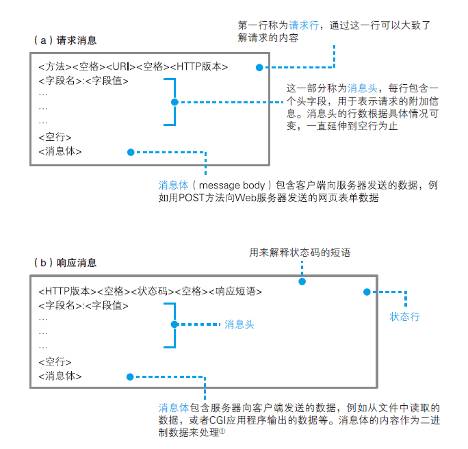

### 发送请求收到响应

**1 条请求消息中只能写1 个URI。如果需要获取多个文件，必须每个文件单独发送1 条请求。**

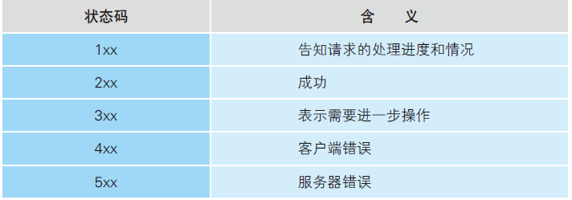

## 向DNS服务查询IP

### IP地址

生成HTTP 消息之后，接下来我们需要委托操作系统将消息发送给Web 服务器。

**在委托操作系统发送消息时，必须要提供通信对象IP 地址**

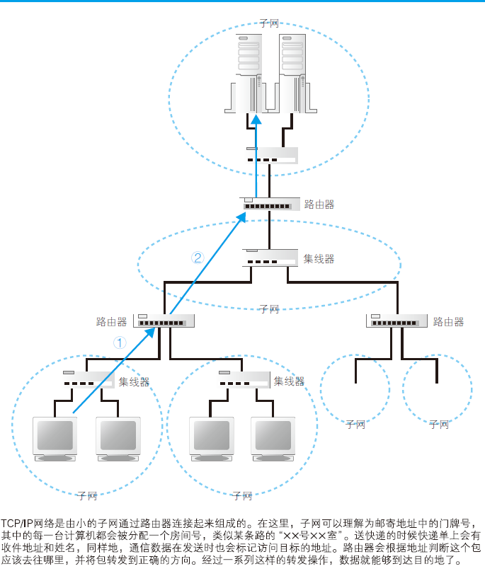

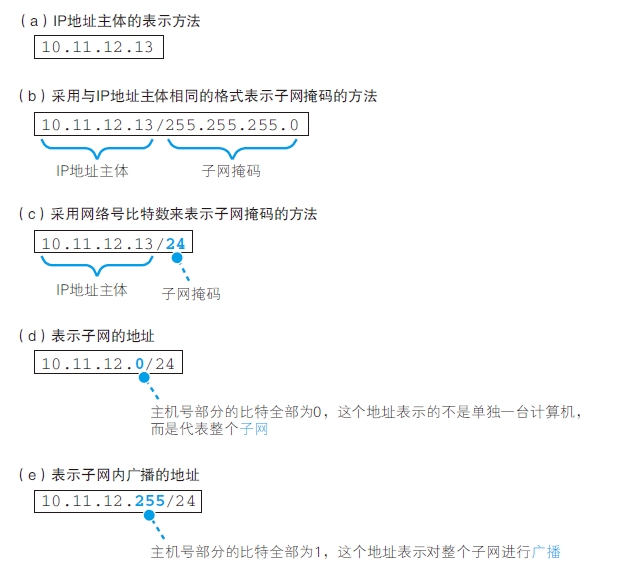

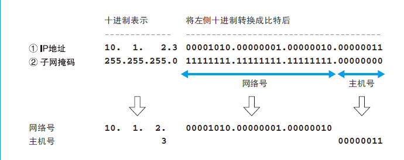

> IP 地址的主机号
全0：表示整个子网
全1：表示向子网上所有设备发送包，即“广播”
> 

### 域名和IP地址并用理由

**让人来使用名称，让路由器来使用IP 地址**

### socket库提供查询IP地址

查询IP 地址的方法非常简单，只要询问最近的DNS 服务器“www.[lab.glasscom.com](http://lab.glasscom.com/) 的IP 地址是什么”就可以了

向DNS 服务器发出查询，也就是向DNS 服务器发送查询消息，并接收服务器返回的响应消息

通过DNS 查询IP 地址的操作称为域名解析，因此负责执行解析（resolution）这一操作的就叫解析器（resolver）

解析器实际上是一段程序，它包含在操作系统的Socket 库中

Socket 库也是一种库，其中包含的程序组件可以让其他的应用程序调用操作系统的网络功能，而解析器就是这个库中
的其中一种程序组件。

### 通过解析器向DNS查询

**根据域名查询IP 地址时，浏览器会使用Socket 库中的解析器。**

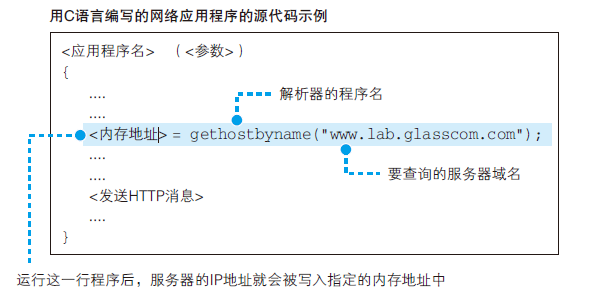

调用解析器后，解析器会向DNS 服务器发送查询消息，然后DNS 服务器会返回响应消息。响应消息中包含查询到的IP 地址，解析器会取出IP地址，并将其写入浏览器指定的内存地址中

### 解析器的内部原理

应用程序编写的操作内容是从上往下按顺序执行的，当到达需要调用解析器的部分时，对应的那一行程序就会被执行，应用程序本身的工作就会暂停

当控制流程转移到解析器后，解析器会生成要发送给DNS 服务器的查询消息。这个过程与浏览器生成要发送给Web 服务器的HTTP 请求消息的过程类似，解析器会根据DNS 的规格，生成一条表示“请告诉我www.lab.[glasscom.com](http://glasscom.com/) 的IP 地址”B 的数据，并将它发送给DNS 服务器。

发送消息这个操作并不是由解析器自身来执行，而是要委托给操作系统内部的协议栈来执行

解析器调用协议栈后，控制流程会再次转移，协议栈会执行发送消息的操作，然后通过网卡将消息发送给DNS 服务器

当DNS 服务器收到查询消息后，它会根据消息中的查询内容进行查询。

如果要访问的Web 服务器已经在DNS 服务器上注册，那么这条记录就能够被找到，然后其IP 地址会被写入响应消息并返回给客户端

消息经过网络到达客户端，再经过协议栈被传递给解析器

然后解析器读取出消息取出IP 地址，并将IP 地址传递给应用程序

向DNS 服务器发送消息时，我们当然也需要知道DNS 服务器的IP 地址。只不过这个IP 地址是作为TCP/IP 的一个设置项目事先设置好的，不需要再去查询了。

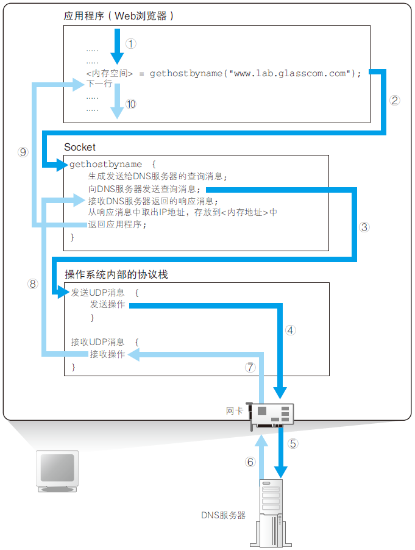

## DNS服务器

### DNS基本工作

DNS 服务器的基本工作就是接收来自客户端的查询消息，然后根据消息的内容返回响应

（a） 域名
服务器、邮件服务器（邮件地址中@ 后面的部分）的名称
（b） Class
在最早设计DNS 方案时，DNS 在互联网以外的其他网络中的应用

（c） 记录类型
表示域名对应何种类型的记录。

**DNS 服务器会从域名与IP 地址的对照表中查找相应的记录，并返回IP 地址**

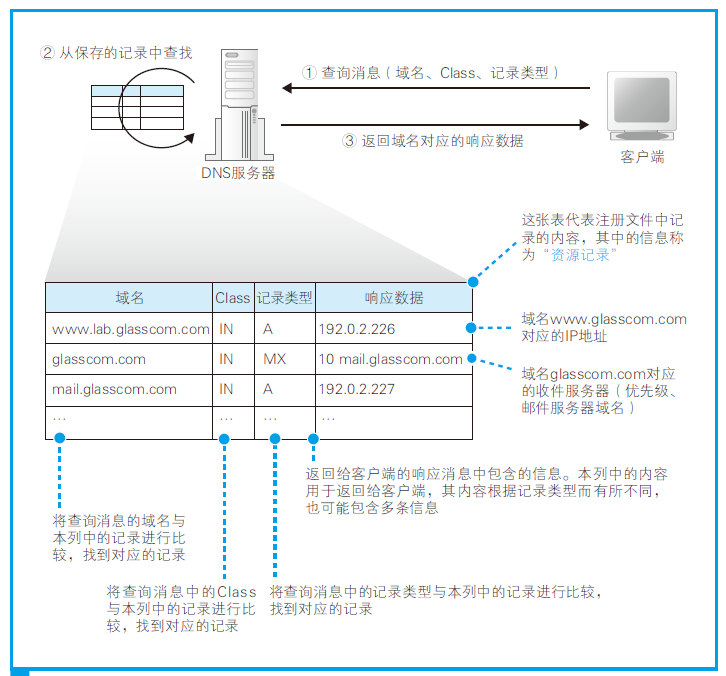

### 域名的层次结构

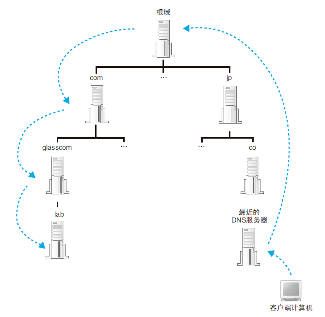

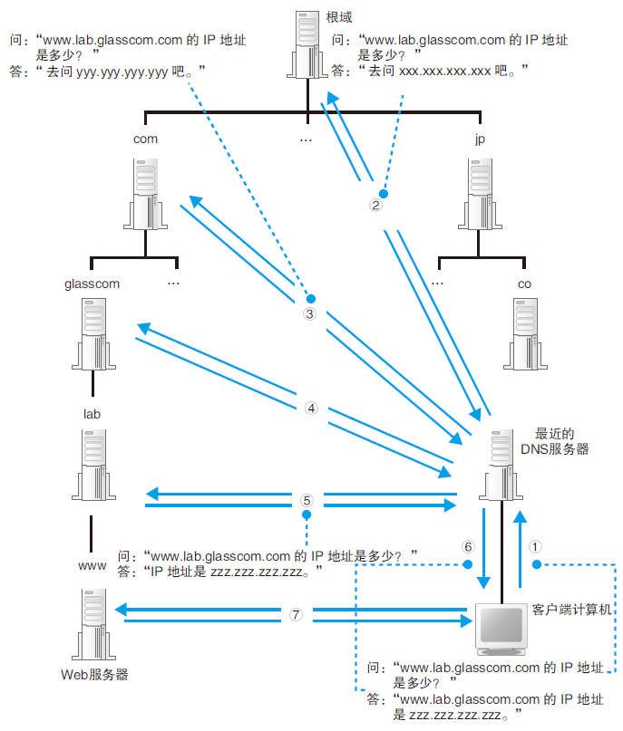

### 通过缓存加快DNS服务器的响应

在真实的互联网中，一台DNS 服务器可以管理多个域的信息

现实中上级域和下级域有可能共享同一台DNS 服务器。

有时候并不需要从最上级的根域开始查找，因为DNS 服务器有一个缓存A功能，可以记住之前查询过的域名。如果要查询的域名和相关信息已经在缓存中，那么就可以直接返回响应，接下来的查询可以从缓存的位置开始向下进行。相比每次都从根域找起来说，缓存可以减少查询所需的时间。

## 委托协议栈发送消息

### 数据收发操作概览

这一操作的过程也不仅适用于Web，而是适用于任何网络应用程序

向操作系统内部的协议栈发出委托时，需要按照指定的顺序来调用Socket 库中的程序组件。

收发数据的两台计算机之间连接了一条数据通道，数据沿着这条通道流动，最终到达目的地。

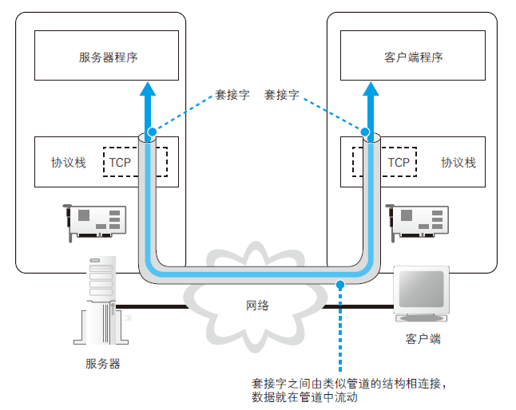

（1）创建套接字（创建套接字阶段）
（2）将管道连接到服务器端的套接字上（连接阶段）
（3）收发数据（通信阶段）
（4）断开管道并删除套接字（断开阶段）

### 创建套接字阶段

客户端创建套接字的操作非常简单，只要调用Socket 库中的socket 程序组件

应用程序是通过“描述符”这一类似号码牌的东西来识别套接字的

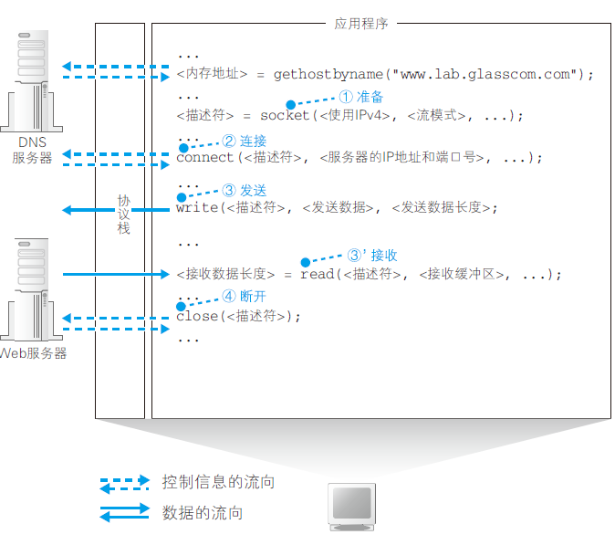