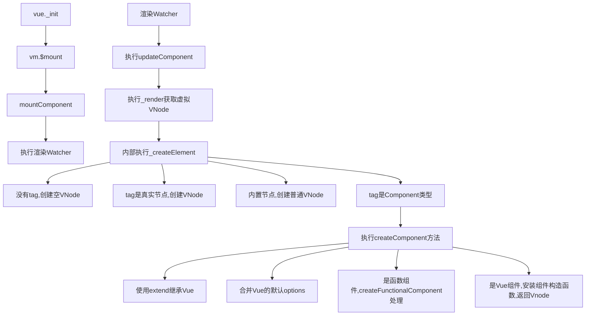

## mount

```js
// vue._init()
if (vm.$options.el) {
  vm.$mount(vm.$options.el);
}
```

```js
Vue.prototype.$mount = function (
  el?: string | Element,
  hydrating?: boolean
): Component {
  el = el && inBrowser ? query(el) : undefined;
  return mountComponent(this, el, hydrating);
};
```

`this`


## mountComponent

  

`core/instance/lifecycle`

```js
export function mountComponent(
  vm: Component,
  el: Element | null | undefined,
  hydrating?: boolean
): Component {
  vm.$el = el;
  if (!vm.$options.render) {
    //  判断实例上是否存在渲染函数
    vm.$options.render = createEmptyVNode;
  }
  callHook(vm, "beforeMount");

  let updateComponent;

  updateComponent = () => {
    /*
    vm._render()得到一份最新的VNode节点树，
    然后执行vm._update()方法对最新的VNode节点树与上一次渲染的旧VNode节点树进行对比并更新DOM节点(即patch操作)，
    完成一次渲染。
    */
    vm._update(vm._render(), hydrating);
  };

  const watcherOptions: WatcherOptions = {
    before() {
      if (vm._isMounted && !vm._isDestroyed) {
        callHook(vm, "beforeUpdate");
      }
    },
  };
  // we set this to vm._watcher inside the watcher's constructor
  // since the watcher's initial patch may call $forceUpdate (e.g. inside child
  // component's mounted hook), which relies on vm._watcher being already defined
  new Watcher(
    vm,
    updateComponent,
    noop,
    watcherOptions,
    true /* isRenderWatcher */
  );
  hydrating = false;

  // flush buffer for flush: "pre" watchers queued in setup()
  const preWatchers = vm._preWatchers;
  if (preWatchers) {
    for (let i = 0; i < preWatchers.length; i++) {
      preWatchers[i].run();
    }
  }

  // manually mounted instance, call mounted on self
  // mounted is called for render-created child components in its inserted hook
  if (vm.$vnode == null) {
    vm._isMounted = true;
    callHook(vm, "mounted");
  }
  return vm;
}
```

### render

::: details \_render

```js
  Vue.prototype._render = function (): VNode {
    const vm: Component = this
    const { render, _parentVnode } = vm.$options

    if (_parentVnode) {
      vm.$scopedSlots = normalizeScopedSlots(
        vm.$parent!,
        _parentVnode.data!.scopedSlots,
        vm.$slots,
        vm.$scopedSlots
      )
      if (vm._slotsProxy) {
        syncSetupSlots(vm._slotsProxy, vm.$scopedSlots)
      }
    }

    // set parent vnode. this allows render functions to have access
    // to the data on the placeholder node.
    vm.$vnode = _parentVnode!
    // render self
    let vnode
    try {
      // There's no need to maintain a stack because all render fns are called
      // separately from one another. Nested component's render fns are called
      // when parent component is patched.
      setCurrentInstance(vm)
      currentRenderingInstance = vm
      // vm._renderProxy = vm
      vnode = render.call(vm._renderProxy, vm.$createElement)
    } catch (e: any) {
      handleError(e, vm, `render`)
      // return error render result,
      // or previous vnode to prevent render error causing blank component
      /* istanbul ignore else */
        vnode = vm._vnode

    } finally {
      currentRenderingInstance = null
      setCurrentInstance()
    }
    // if the returned array contains only a single node, allow it
    if (isArray(vnode) && vnode.length === 1) {
      vnode = vnode[0]
    }
    // return empty vnode in case the render function errored out
    if (!(vnode instanceof VNode)) {
      vnode = createEmptyVNode()
    }
    // set parent
    vnode.parent = _parentVnode
    return vnode
  }

```

:::

### createElement

```js
vnode = render.call(vm._renderProxy, vm.$createElement);
vm.$createElement = (a, b, c, d) => createElement(vm, a, b, c, d, true);
//  => vm._renderProxy.render(vm.$createElement) _renderProxy = vm
//  => vm.render(vm.$createElement)
// App.vue  render: h => h(App) = h =vm.$createElement
```

::: details render

```js
var render = function () {
  var _vm = this
  var _h = _vm.$createElement
  var _c = _vm._self._c || _h
  return _c(
    "div",
    { attrs: { id: "app" } },
    [
      _c("img", {
        attrs: { alt: "Vue logo", src: __webpack_require__(/*! ./assets/logo.png */ "./src/assets/logo.png") },
      }),
      _vm._v(" "),
      _c("HelloWorldVue", { attrs: { msg: "Welcome to Your Vue.js App" } }),
      _vm._v(" "),
      _c("input", { directives: [{ name: "focus", rawName: "v-focus" }] }),
      _vm._v(" "),
      _c("router-link", { attrs: { to: "/home" } }, [_vm._v("Home")]),
      _vm._v(" "),
      _c("router-link", { attrs: { to: "/about" } }, [_vm._v("About")]),
      _vm._v(" "),
      _c("KeepAlive", [_c("router-view")], 1),
      _vm._v(" "),
      _c(
        "button",
        {
          on: {
            click: function ($event) {
              _vm.num = _vm.num + 1
            },
          },
        },
        [_vm._v(_vm._s(_vm.num))]
      ),
    ],
    1
  )
}
```

:::

  

```js
export function createElement(
  context: Component, //context 表示 VNode 的上下文环境
  tag: any, //tag 表示标签，它可以是一个字符串，也可以是一个 Component
  data: any,//data 表示 VNode 的数据，它是一个 VNodeData 类型
  children: any,//children 表示当前 VNode 的子节点，它是任意类型的
  normalizationType: any, //normalizationType 表示子节点规范的类型，类型不同规范的方法也就不一样
  alwaysNormalize: boolean
): VNode | Array<VNode> {
  if (isArray(data) || isPrimitive(data)) {
    normalizationType = children;
    children = data;
    data = undefined;
  }
  if (isTrue(alwaysNormalize)) {
    normalizationType = ALWAYS_NORMALIZE;
  }
  return _createElement(context, tag, data, children, normalizationType);
}

export function _createElement(
  context: Component,
  tag?: string | Component | Function | Object,
  data?: VNodeData,
  children?: any,
  normalizationType?: number
): VNode | Array<VNode> {
  // object syntax in v-bind
  if (isDef(data) && isDef(data.is)) {
    tag = data.is
  }
  if (!tag) {
    // in case of component :is set to falsy value
    return createEmptyVNode()
  }
  // support single function children as default scoped slot
  if (isArray(children) && isFunction(children[0])) {
    data = data || {}
    data.scopedSlots = { default: children[0] }
    children.length = 0
  }
  if (normalizationType === ALWAYS_NORMALIZE) {
    // render 函数是用户手写的
    children = normalizeChildren(children)
  } else if (normalizationType === SIMPLE_NORMALIZE) {
    // render 函数是编译生成的
    children = simpleNormalizeChildren(children)
  }
  let vnode, ns
  if (typeof tag === 'string') {
    let Ctor
    ns = (context.$vnode && context.$vnode.ns) || config.getTagNamespace(tag)
    if (config.isReservedTag(tag)) {
      // platform built-in elements
      vnode = new VNode(
        config.parsePlatformTagName(tag),
        data,
        children,
        undefined,
        undefined,
        context
      )
    } else if (
      (!data || !data.pre) &&
      isDef((Ctor = resolveAsset(context.$options, 'components', tag)))
    ) {
      // tag 一个 Component 类型，则直接调用 createComponent 创建一个组件类型的 VNode 节点
      // component
      vnode = createComponent(Ctor, data, context, children, tag)
    } else {
      // unknown or unlisted namespaced elements
      // check at runtime because it may get assigned a namespace when its
      // parent normalizes children
      // 如果是内置的一些节点，则直接创建一个普通 VNode
      vnode = new VNode(tag, data, children, undefined, undefined, context)
    }
  } else {
    // direct component options / constructor
    vnode = createComponent(tag as any, data, context, children)
  }
  if (isArray(vnode)) {
    return vnode
  } else if (isDef(vnode)) {
    if (isDef(ns)) applyNS(vnode, ns)
    if (isDef(data)) registerDeepBindings(data)
    return vnode
  } else {
    return createEmptyVNode()
  }
}
```

### createComponent

节点是组件

```js
export function createComponent(
  Ctor: typeof Component | Function | ComponentOptions | void,
  data: VNodeData | undefined,
  context: Component,
  children?: Array<VNode>,
  tag?: string
): VNode | Array<VNode> | void {
  if (isUndef(Ctor)) {
    return
  }
  // Vue.options._base = Vue
  const baseCtor = context.$options._base
  // plain options object: turn it into a constructor
  if (isObject(Ctor)) {
    Ctor = baseCtor.extend(Ctor as typeof Component)
  }
  if (typeof Ctor !== 'function') {
    if (__DEV__) {
      warn(`Invalid Component definition: ${String(Ctor)}`, context)
    }
    return
  }
  let asyncFactory
  // @ts-expect-error
  if (isUndef(Ctor.cid)) {
    asyncFactory = Ctor
    Ctor = resolveAsyncComponent(asyncFactory, baseCtor)
    if (Ctor === undefined) {
      return createAsyncPlaceholder(asyncFactory, data, context, children, tag)
    }
  }
  data = data || {}
  //  合并 options, 就是把自定义的 options 和 默认的 `options` 合并
  resolveConstructorOptions(Ctor as typeof Component)
  if (isDef(data.model)) {
    // @ts-expect-error
    transformModel(Ctor.options, data)
  }
  // extract props
  // @ts-expect-error
  const propsData = extractPropsFromVNodeData(data, Ctor, tag)
  // functional component
  // @ts-expect-error
  if (isTrue(Ctor.options.functional)) {
    return createFunctionalComponent(
      Ctor as typeof Component,
      propsData,
      data,
      context,
      children
    )
  }
  // extract listeners, since these needs to be treated as
  // child component listeners instead of DOM listeners
  const listeners = data.on
  // replace with listeners with .native modifier
  // so it gets processed during parent component patch.
  data.on = data.nativeOn
  // @ts-expect-error
  if (isTrue(Ctor.options.abstract)) {
    // abstract components do not keep anything
    // other than props & listeners & slot

    // work around flow
    const slot = data.slot
    data = {}
    if (slot) {
      data.slot = slot
    }
  }
  // 安装组件钩子函数
  // install component management hooks onto the placeholder node
  installComponentHooks(data)

  // return a placeholder vnode
  // @ts-expect-error
  const name = Ctor.options.name || tag
  const vnode = new VNode(
    // @ts-expect-error
    `vue-component-${Ctor.cid}${name ? `-${name}` : ''}`,
    data,
    undefined,
    undefined,
    undefined,
    context,
    // @ts-expect-error
    { Ctor, propsData, listeners, tag, children },
    asyncFactory
  )

  return vnode
}


```

### \_update

```js
const vnode = vm._render();
vm._update(vnode, hydrating);
```

::: details vnode

```js

```

:::

```js
/*


mountComponent(vm,el) vm.$el = el
*/

Vue.prototype._update = function (vnode: VNode, hydrating?: boolean) {
  const vm: Component = this;
  const prevEl = vm.$el;
  const prevVnode = vm._vnode;
  const restoreActiveInstance = setActiveInstance(vm);
  vm._vnode = vnode;
  // Vue.prototype.__patch__ is injected in entry points
  // based on the rendering backend used.
  if (!prevVnode) {
    // initial render
    vm.$el = vm.__patch__(vm.$el, vnode, hydrating, false /* removeOnly */);
  } else {
    // updates
    vm.$el = vm.__patch__(prevVnode, vnode);
  }
  restoreActiveInstance();
  // update __vue__ reference
  if (prevEl) {
    prevEl.__vue__ = null;
  }
  if (vm.$el) {
    vm.$el.__vue__ = vm;
  }
  // if parent is an HOC, update its $el as well
  if (vm.$vnode && vm.$parent && vm.$vnode === vm.$parent._vnode) {
    vm.$parent.$el = vm.$el;
  }
  // updated hook is called by the scheduler to ensure that children are
  // updated in a parent's updated hook.
};
```

## createPathFunction

DOM-Diff 过程叫做 patch 过程。patch,意为“补丁”，即指对旧的 VNode 修补，打补丁从而得到新的 VNode

- 创建节点：新的 VNode 中有而旧的 oldVNode 中没有，就在旧的 oldVNode 中创建。
- 删除节点：新的 VNode 中没有而旧的 oldVNode 中有，就从旧的 oldVNode 中删除。
- 更新节点：新的 VNode 和旧的 oldVNode 中都有，就以新的 VNode 为准，更新旧的 oldVNode。

```js
Vue.prototype.__patch__ = inBrowser ? patch : noop;
export const patch: Function = createPatchFunction({ nodeOps, modules });

export function createPathFunction(backend) {
  const { tag, data, children } = vnode;

  return function patch(oldVnode, vnode, hydrating, removeOnly) {
    // ....
  };
}
```

### path

```js
export function isUndef(v: any): v is undefined | null {
  return v === undefined || v === null
}

export function isDef<T>(v: T): v is NonNullable<T> {
  return v !== undefined && v !== null
}

export function isTrue(v: any): boolean {
  return v === true
}

export function isFalse(v: any): boolean {
  return v === false
}
return function patch(oldVnode, vnode, hydrating, removeOnly) {
  // 如果新节点不存在，老节点存在，则调用 destroy，销毁老节点
  if (isUndef(vnode)) {
    if (isDef(oldVnode)) invokeDestroyHook(oldVnode);
    return;
  }

  let isInitialPatch = false;
  const insertedVnodeQueue: any[] = [];
   // 新的 VNode 存在，老的 VNode 不存在，这种情况会在一个组件初次渲染的时候出现
  if (isUndef(oldVnode)) {
    // empty mount (likely as component), create new root element
    isInitialPatch = true;
    createElm(vnode, insertedVnodeQueue);
  } else {
    // 判断 oldVnode 是否为真实元素
    const isRealElement = isDef(oldVnode.nodeType);
    if (!isRealElement && sameVnode(oldVnode, vnode)) {
       // 不是真实元素，但是老节点和新节点是同一个节点，则是更新阶段，执行 patch 更新节点
      patchVnode(oldVnode, vnode, insertedVnodeQueue, null, null, removeOnly);
    } else {
      // 是真实元素，则表示初次渲染
      if (isRealElement) {
        // mounting to a real element
        // check if this is server-rendered content and if we can perform
        // a successful hydration.
        if (oldVnode.nodeType === 1 && oldVnode.hasAttribute(SSR_ATTR)) {
          oldVnode.removeAttribute(SSR_ATTR);
          hydrating = true;
        }
        if (isTrue(hydrating)) {
          if (hydrate(oldVnode, vnode, insertedVnodeQueue)) {
            invokeInsertHook(vnode, insertedVnodeQueue, true);
            return oldVnode;
          } else if (__DEV__) {
            warn(
              "The client-side rendered virtual DOM tree is not matching " +
                "server-rendered content. This is likely caused by incorrect " +
                "HTML markup, for example nesting block-level elements inside " +
                "<p>, or missing <tbody>. Bailing hydration and performing " +
                "full client-side render."
            );
          }
        }
        // 走到这儿说明不是服务端渲染，或者 hydration 失败，则根据 oldVnode 创建一个 vnode 节点
        // either not server-rendered, or hydration failed.
        // create an empty node and replace it
        oldVnode = emptyNodeAt(oldVnode);
      }

       // 拿到老节点的真实元素
      const oldElm = oldVnode.elm;
       // 获取老节点的父元素，即 body
      const parentElm = nodeOps.parentNode(oldElm);

      // 基于新 vnode 创建整棵 DOM 树并插入到 body 元素下
      createElm(
        vnode,
        insertedVnodeQueue,
        // extremely rare edge case: do not insert if old element is in a
        // leaving transition. Only happens when combining transition +
        // keep-alive + HOCs. (#4590)
        oldElm._leaveCb ? null : parentElm,
        nodeOps.nextSibling(oldElm)
      );

     // 递归更新父占位符节点元素
      if (isDef(vnode.parent)) {
        let ancestor = vnode.parent;
        const patchable = isPatchable(vnode);
        while (ancestor) {
          for (let i = 0; i < cbs.destroy.length; ++i) {
            cbs.destroy[i](ancestor);
          }
          ancestor.elm = vnode.elm;
          if (patchable) {
            for (let i = 0; i < cbs.create.length; ++i) {
              cbs.create[i](emptyNode, ancestor);
            }
            // #6513
            // invoke insert hooks that may have been merged by create hooks.
            // e.g. for directives that uses the "inserted" hook.
            const insert = ancestor.data.hook.insert;
            if (insert.merged) {
              // start at index 1 to avoid re-invoking component mounted hook
              for (let i = 1; i < insert.fns.length; i++) {
                insert.fns[i]();
              }
            }
          } else {
            registerRef(ancestor);
          }
          ancestor = ancestor.parent;
        }
      }

      // destroy old node
      if (isDef(parentElm)) {
        removeVnodes([oldVnode], 0, 0);
      } else if (isDef(oldVnode.tag)) {
        invokeDestroyHook(oldVnode);
      }
    }
  }

  invokeInsertHook(vnode, insertedVnodeQueue, isInitialPatch);
  return vnode.elm;
};
```

#### sameVnode

- key 必须相同（都是 undefined 则也是相同的），
- DOM 元素的标签必须相同。比如都是 div
- 如果满足以上条件，那么就认为是相同的 vnode，因此就可以进行 patchVnode 操作。那么如果不是呢？就认为是完全新的一个 vnode，因此会进入下面的 createElm。让我们梳理下逻辑：当进入 patch 之后有两种分支可以走：
- 如果是第一次 patch（组件第一次挂载的时候），或者发现元素的标签不相同了（比如 div 变 p 了），那么直接 createElm 创建新的 DOM 元素
- 否则，就是对已存在的 DOM 元素进行更新，那么通过 patchVnode 进行 diff，有条件的更新以提升性能

```js
function sameVnode(a, b) {
  return (
    // key 必须相同，需要注意的是 undefined === undefined => true
    a.key === b.key &&
    a.asyncFactory === b.asyncFactory &&
    // 标签相同
    ((a.tag === b.tag &&
      // 都是注释节点
      a.isComment === b.isComment &&
      // 都有 data 属性
      isDef(a.data) === isDef(b.data) &&
      // input 标签的情况
      sameInputType(a, b)) ||
      (isTrue(a.isAsyncPlaceholder) && isUndef(b.asyncFactory.error)))
  );
}
```

#### createElm

基于 vnode 创建整棵 DOM 树，并插入到父节点上

VNode 类可以描述 6 种类型的节点，而实际上只有 3 种类型的节点能够被创建并插入到 DOM 中，它们分别是：元素节点、文本节点、注释节点。

```js
function createElm(
  vnode,
  insertedVnodeQueue,
  parentElm?: any,
  refElm?: any,
  nested?: any,
  ownerArray?: any,
  index?: any
) {
  if (isDef(vnode.elm) && isDef(ownerArray)) {
    // This vnode was used in a previous render!
    // now it's used as a new node, overwriting its elm would cause
    // potential patch errors down the road when it's used as an insertion
    // reference node. Instead, we clone the node on-demand before creating
    // associated DOM element for it.
    vnode = ownerArray[index] = cloneVNode(vnode);
  }

  vnode.isRootInsert = !nested; // for transition enter check
  /**
   * 重点
   * 1、如果 vnode 是一个组件，则执行 init 钩子，创建组件实例并挂载，
   *   然后为组件执行各个模块的 create 钩子
   *   如果组件被 keep-alive 包裹，则激活组件
   * 2、如果是一个普通元素，则什么也不错
   */
  if (createComponent(vnode, insertedVnodeQueue, parentElm, refElm)) {
    return;
  }

  const data = vnode.data;
  const children = vnode.children;
  const tag = vnode.tag;
  // 创建元素节点
  // 有tag属性即认为是元素节点，则调用createElement方法创建元素节点
  if (isDef(tag)) {
    vnode.elm = vnode.ns
      ? nodeOps.createElementNS(vnode.ns, tag)
      : nodeOps.createElement(tag, vnode);
    setScope(vnode);
    // 循环遍历 children调用 createElm
    createChildren(vnode, children, insertedVnodeQueue);

    if (isDef(data)) {
      invokeCreateHooks(vnode, insertedVnodeQueue);
    }
    insert(parentElm, vnode.elm, refElm);
    // 创建注释节点
    // isComment属性是否为true
  } else if (isTrue(vnode.isComment)) {
    vnode.elm = nodeOps.createComment(vnode.text);
    // 将组件的 DOM 节点插入到父节点内
    insert(parentElm, vnode.elm, refElm);
    // 创建文本节点
  } else {
    vnode.elm = nodeOps.createTextNode(vnode.text);
    insert(parentElm, vnode.elm, refElm);
  }
}
```

##### createComponent()

```js
/**
 * 如果 vnode 是一个组件，则执行 init 钩子，创建组件实例，并挂载
 * 然后为组件执行各个模块的 create 方法
 * @param {*} vnode 组件新的 vnode
 * @param {*} insertedVnodeQueue 数组
 * @param {*} parentElm oldVnode 的父节点
 * @param {*} refElm oldVnode 的下一个兄弟节点
 * @returns 如果 vnode 是一个组件并且组件创建成功，则返回 true，否则返回 undefined
 */
function createComponent(vnode, insertedVnodeQueue, parentElm, refElm) {
  let i = vnode.data;
  if (isDef(i)) {
    // 验证组件实例是否已经存在 && 被 keep-alive 包裹

    const isReactivated = isDef(vnode.componentInstance) && i.keepAlive;
    // 如果是组件没有被 keep-alive 包裹或者首次渲染，则初始化组件，并进入挂载阶段
    if (isDef((i = i.hook)) && isDef((i = i.init))) {
      i(vnode, false /* hydrating */);
    }
    // after calling the init hook, if the vnode is a child component
    // it should've created a child instance and mounted it. the child
    // component also has set the placeholder vnode's elm.
    // in that case we can just return the element and be done.
    if (isDef(vnode.componentInstance)) {
      // 如果 vnode 是一个子组件，则调用 init 钩子之后会创建一个组件实例，并挂载
      // 这时候就可以给组件执行各个模块的的 create 钩子了
      initComponent(vnode, insertedVnodeQueue);
      insert(parentElm, vnode.elm, refElm);

      if (isTrue(isReactivated)) {
        // 组件被 keep-alive 包裹的情况，激活组件
        reactivateComponent(vnode, insertedVnodeQueue, parentElm, refElm);
      }
      return true;
    }
  }
}
```

###### initComponent

```js
function initComponent(vnode, insertedVnodeQueue) {
  if (isDef(vnode.data.pendingInsert)) {
    insertedVnodeQueue.push.apply(insertedVnodeQueue, vnode.data.pendingInsert);
    vnode.data.pendingInsert = null;
  }
  vnode.elm = vnode.componentInstance.$el;
  if (isPatchable(vnode)) {
    invokeCreateHooks(vnode, insertedVnodeQueue);
    setScope(vnode);
  } else {
    // empty component root.
    // skip all element-related modules except for ref (#3455)
    registerRef(vnode);
    // make sure to invoke the insert hook
    insertedVnodeQueue.push(vnode);
  }
}
```

##### insert

向父节点插入节点

```js
function insert(parent, elm, ref) {
  if (isDef(parent)) {
    if (isDef(ref)) {
      if (nodeOps.parentNode(ref) === parent) {
        nodeOps.insertBefore(parent, elm, ref);
      }
    } else {
      nodeOps.appendChild(parent, elm);
    }
  }
}
```

#### removeNode

```js
function removeNode(el) {
  const parent = nodeOps.parentNode(el); // 获取父节点
  // element may have already been removed due to v-html / v-text
  if (isDef(parent)) {
    nodeOps.removeChild(parent, el); // 调用父节点的removeChild方法
  }
}
```

#### invokeCreateHooks

`createPatchFunction`

```js
const hooks = ["create", "activate", "update", "remove", "destroy"];
export function createPatchFunction(backend) {
  let i, j;
  const cbs: any = {};

  const { modules, nodeOps } = backend;

  for (i = 0; i < hooks.length; ++i) {
    cbs[hooks[i]] = [];
    for (j = 0; j < modules.length; ++j) {
      if (isDef(modules[j][hooks[i]])) {
        cbs[hooks[i]].push(modules[j][hooks[i]]);
      }
    }
  }
  //....
}
```

```js
function invokeCreateHooks(vnode, insertedVnodeQueue) {
  for (let i = 0; i < cbs.create.length; ++i) {
    cbs.create[i](emptyNode, vnode);
  }
  i = vnode.data.hook; // Reuse variable
  if (isDef(i)) {
    if (isDef(i.create)) i.create(emptyNode, vnode);
    if (isDef(i.insert)) insertedVnodeQueue.push(vnode);
  }
}
```

#### patchVnode

更新节点

```js
function patchVnode(
  oldVnode,
  vnode,
  insertedVnodeQueue,
  ownerArray,
  index,
  removeOnly?: any
) {
  // 老节点和新节点相同，直接返回
  if (oldVnode === vnode) {
    return;
  }

  if (isDef(vnode.elm) && isDef(ownerArray)) {
    // clone reused vnode
    vnode = ownerArray[index] = cloneVNode(vnode);
  }

  const elm = (vnode.elm = oldVnode.elm);

  if (isTrue(oldVnode.isAsyncPlaceholder)) {
    if (isDef(vnode.asyncFactory.resolved)) {
      hydrate(oldVnode.elm, vnode, insertedVnodeQueue);
    } else {
      vnode.isAsyncPlaceholder = true;
    }
    return;
  }

  // reuse element for static trees.
  // note we only do this if the vnode is cloned -
  // if the new node is not cloned it means the render functions have been
  // reset by the hot-reload-api and we need to do a proper re-render.
  // 跳过静态节点
  if (
    isTrue(vnode.isStatic) &&
    isTrue(oldVnode.isStatic) &&
    vnode.key === oldVnode.key &&
    (isTrue(vnode.isCloned) || isTrue(vnode.isOnce))
  ) {
    // 新旧节点都是静态的而且两个节点的 key 一样，并且新节点被 clone 了 或者 新节点有 v-once指令，则重用这部分节点
    vnode.componentInstance = oldVnode.componentInstance;
    return;
  }
  // 执行组件的 prepatch 钩子
  let i;
  const data = vnode.data;
  if (isDef(data) && isDef((i = data.hook)) && isDef((i = i.prepatch))) {
    i(oldVnode, vnode);
  }

  const oldCh = oldVnode.children;
  const ch = vnode.children;
  // 全量更新新节点的属性
  /*
    - 全量的属性更新
    - 如果新老节点都有孩子，则递归执行 diff
    - 如果新节点有孩子，老节点没孩子，则新增新节点的这些孩子节点
    - 如果老节点有孩子，新节点没孩子，则删除老节点的这些孩子
    - 更新文本节点
  */
  if (isDef(data) && isPatchable(vnode)) {
    // 执行新节点所有的属性更新
    for (i = 0; i < cbs.update.length; ++i) cbs.update[i](oldVnode, vnode);
    if (isDef((i = data.hook)) && isDef((i = i.update))) i(oldVnode, vnode);
  }

  if (isUndef(vnode.text)) {
    // 新节点不是文本节点
    if (isDef(oldCh) && isDef(ch)) {
      if (oldCh !== ch)
        updateChildren(elm, oldCh, ch, insertedVnodeQueue, removeOnly);
    } else if (isDef(ch)) {
      if (isDef(oldVnode.text)) nodeOps.setTextContent(elm, "");
      addVnodes(elm, null, ch, 0, ch.length - 1, insertedVnodeQueue);
    } else if (isDef(oldCh)) {
      removeVnodes(oldCh, 0, oldCh.length - 1);
    } else if (isDef(oldVnode.text)) {
      // 老节点是文本节点，则将文本内容置空
      nodeOps.setTextContent(elm, "");
    }
  } else if (oldVnode.text !== vnode.text) {
    // 新节点是文本节点，则更新文本节点
    nodeOps.setTextContent(elm, vnode.text);
  }
  if (isDef(data)) {
    if (isDef((i = data.hook)) && isDef((i = i.postpatch))) i(oldVnode, vnode);
  }
}
```

#### updateChildren


- 先把 newChildren 数组里的所有未处理子节点的第一个子节点和 oldChildren 数组里所有未处理子节点的第一个子节点做比对，如果相同，那就直接进入更新节点的操作；
- 如果不同，再把 newChildren 数组里所有未处理子节点的最后一个子节点和 oldChildren 数组里所有未处理子节点的最后一个子节点做比对，如果相同，那就直接进入更新节点的操作；
- 如果不同，再把 newChildren 数组里所有未处理子节点的最后一个子节点和 oldChildren 数组里所有未处理子节点的第一个子节点做比对，如果相同，那就直接进入更新节点的操作，更新完后再将 oldChildren 数组里的该节点移动到与 newChildren 数组里节点相同的位置；
- 如果不同，再把 newChildren 数组里所有未处理子节点的第一个子节点和 oldChildren 数组里所有未处理子节点的最后一个子节点做比对，如果相同，那就直接进入更新节点的操作，更新完后再将 oldChildren 数组里的该节点移动到与 newChildren 数组里节点相同的位置；
- 如果上面的四种假设都不成立，则通过遍历找到新开始节点在老节点中的位置索引
- 如果老节点先于新节点遍历结束，则剩余的新节点执行新增节点操作
- 如果新节点先于老节点遍历结束，则剩余的老节点执行删除操作，移除这些老节点

```js
function updateChildren(
  parentElm,
  oldCh,
  newCh,
  insertedVnodeQueue,
  removeOnly
) {
  let oldStartIdx = 0;
  let newStartIdx = 0;
  let oldEndIdx = oldCh.length - 1;
  let oldStartVnode = oldCh[0];
  let oldEndVnode = oldCh[oldEndIdx];
  let newEndIdx = newCh.length - 1;
  let newStartVnode = newCh[0];
  let newEndVnode = newCh[newEndIdx];
  let oldKeyToIdx, idxInOld, vnodeToMove, refElm;

  // removeOnly is a special flag used only by <transition-group>
  // to ensure removed elements stay in correct relative positions
  // during leaving transitions
  const canMove = !removeOnly;

  // 遍历新老两组节点，只要有一组遍历完（开始索引超过结束索引）则跳出循环
  while (oldStartIdx <= oldEndIdx && newStartIdx <= newEndIdx) {
    if (isUndef(oldStartVnode)) {
      oldStartVnode = oldCh[++oldStartIdx]; // Vnode has been moved left
    } else if (isUndef(oldEndVnode)) {
      oldEndVnode = oldCh[--oldEndIdx];
    } else if (sameVnode(oldStartVnode, newStartVnode)) {
      patchVnode(
        oldStartVnode,
        newStartVnode,
        insertedVnodeQueue,
        newCh,
        newStartIdx
      );
      oldStartVnode = oldCh[++oldStartIdx];
      newStartVnode = newCh[++newStartIdx];
    } else if (sameVnode(oldEndVnode, newEndVnode)) {
      patchVnode(
        oldEndVnode,
        newEndVnode,
        insertedVnodeQueue,
        newCh,
        newEndIdx
      );
      oldEndVnode = oldCh[--oldEndIdx];
      newEndVnode = newCh[--newEndIdx];
    } else if (sameVnode(oldStartVnode, newEndVnode)) {
      // Vnode moved right
      patchVnode(
        oldStartVnode,
        newEndVnode,
        insertedVnodeQueue,
        newCh,
        newEndIdx
      );
      canMove &&
        nodeOps.insertBefore(
          parentElm,
          oldStartVnode.elm,
          nodeOps.nextSibling(oldEndVnode.elm)
        );
      oldStartVnode = oldCh[++oldStartIdx];
      newEndVnode = newCh[--newEndIdx];
    } else if (sameVnode(oldEndVnode, newStartVnode)) {
      // Vnode moved left
      patchVnode(
        oldEndVnode,
        newStartVnode,
        insertedVnodeQueue,
        newCh,
        newStartIdx
      );
      canMove &&
        nodeOps.insertBefore(parentElm, oldEndVnode.elm, oldStartVnode.elm);
      oldEndVnode = oldCh[--oldEndIdx];
      newStartVnode = newCh[++newStartIdx];
    } else {
      if (isUndef(oldKeyToIdx))
        //  找到老节点中每个节点 key 和 索引之间的关系映射 => oldKeyToIdx = { key1: idx1, ... }
        oldKeyToIdx = createKeyToOldIdx(oldCh, oldStartIdx, oldEndIdx);
      idxInOld = isDef(newStartVnode.key)
        ? oldKeyToIdx[newStartVnode.key]
        : findIdxInOld(newStartVnode, oldCh, oldStartIdx, oldEndIdx);
      if (isUndef(idxInOld)) {
        // New element
        createElm(
          newStartVnode,
          insertedVnodeQueue,
          parentElm,
          oldStartVnode.elm,
          false,
          newCh,
          newStartIdx
        );
      } else {
        vnodeToMove = oldCh[idxInOld];
        if (sameVnode(vnodeToMove, newStartVnode)) {
          patchVnode(
            vnodeToMove,
            newStartVnode,
            insertedVnodeQueue,
            newCh,
            newStartIdx
          );
          oldCh[idxInOld] = undefined;
          canMove &&
            nodeOps.insertBefore(parentElm, vnodeToMove.elm, oldStartVnode.elm);
        } else {
          // same key but different element. treat as new element
          createElm(
            newStartVnode,
            insertedVnodeQueue,
            parentElm,
            oldStartVnode.elm,
            false,
            newCh,
            newStartIdx
          );
        }
      }
      newStartVnode = newCh[++newStartIdx];
    }
  }

  //  老节点被遍历完了，新节点有剩余，则说明这部分剩余的节点是新增的节点，然后添加这些节点
  if (oldStartIdx > oldEndIdx) {
    refElm = isUndef(newCh[newEndIdx + 1]) ? null : newCh[newEndIdx + 1].elm;
    addVnodes(
      parentElm,
      refElm,
      newCh,
      newStartIdx,
      newEndIdx,
      insertedVnodeQueue
    );
    // 说明新节点被遍历完了，老节点有剩余，说明这部分的节点被删掉了，则移除这些节点
  } else if (newStartIdx > newEndIdx) {
    removeVnodes(oldCh, oldStartIdx, oldEndIdx);
  }
}
```
