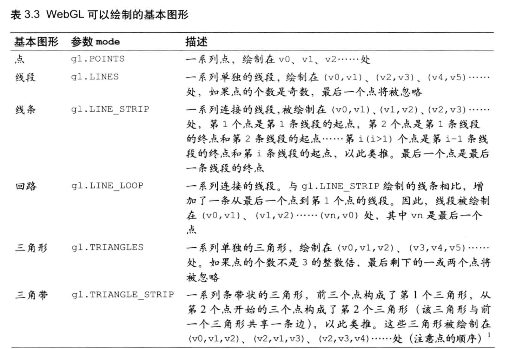
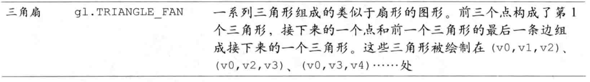
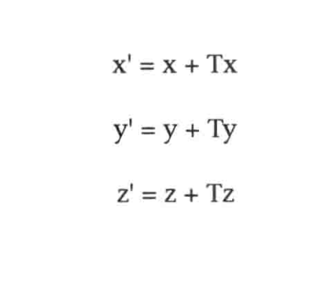
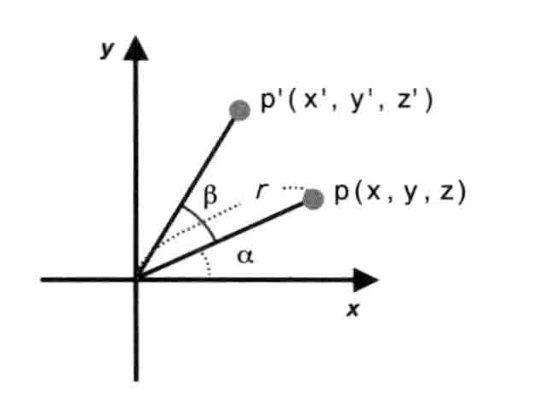
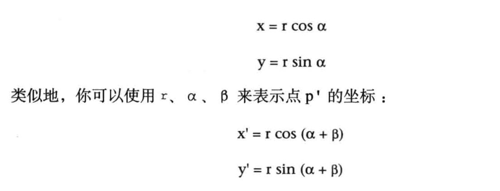
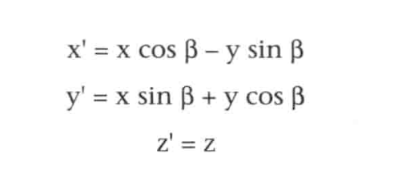

参考：<https://webglfundamentals.org/webgl/lessons/zh_cn/webgl-fundamentals.html>
《WebGL编程指南》

WebGL只关心两件事：
裁剪空间中的坐标值和颜色值。使用WebGL只需要给它提供这两个东西。
你需要提供两个着色器来做这两件事，一个顶点着色器提供裁剪空间坐标值，一个片段着色器提供颜色值。

**无论你的画布有多大，裁剪空间的坐标范围永远是 -1 到 1**

1.需要一个HTML中的canvas（画布）对象

```js
<canvas id="canvas" ></canvas>

const canvas = document.querySelector('#canvas')
```

2.创建一个WebGL渲染上下文（WebGLRenderingContext）

```js
const gl = canvas.getContext('webgl')
if(!gl) {
 // 不能使用WebGL
}

```

3.创建着色器
 W e b G L 依 赖 于 一种 新 的 称 为 着 色 器 ( s h a d e r ) 的 绘 图 机 制

```html
<script id="vertex-shader-2d" type="notjs">
 
  // 一个属性变量，将会从缓冲中获取数据
  attribute vec4 a_position;
 
  // 所有着色器都有一个main方法
  void main() {
  
    // gl_Position 是一个顶点着色器主要设置的变量

  // vec4 gl_Position 表示顶点位置 (必须被赋值)
  // float gl_PointSize  表 示 点 的 尺 寸 (像 素 数 )

    gl_Position = a_position;
  }
 
</script>
 
<script id="fragment-shader-2d" type="notjs">
 
  // 片段着色器没有默认精度，所以我们需要设置一个精度
  // mediump是一个不错的默认值，代表“medium precision”（中等精度）
  precision mediump float;
 
  void main() {
    // gl_FragColor是一个片段着色器主要设置的变量
    gl_FragColor = vec4(1, 0, 0.5, 1); // 返回“瑞迪施紫色”
  }
 
</script>

```

```js
// 创建着色器方法，输入参数：渲染上下文，着色器类型，数据源
function createShader(gl, type, source) {
  var shader = gl.createShader(type); // 创建着色器对象
  gl.shaderSource(shader, source); // 提供数据源
  gl.compileShader(shader); // 编译 -> 生成着色器
  var success = gl.getShaderParameter(shader, gl.COMPILE_STATUS);
  if (success) {
    return shader;
  }
 
  gl.deleteShader(shader);
}
const vertexShaderSource = document.querySelector("#vertex-shader-2d").text;
const fragmentShaderSource = document.querySelector("#fragment-shader-2d").text;

const vertexShader = createShader(gl, gl.VERTEX_SHADER, vertexShaderSource);
const fragmentShader = createShader(gl, gl.FRAGMENT_SHADER, fragmentShaderSource);

```

4.将着色器 link（链接）到一个 program（着色程序）

```js
function createProgram(gl, vertexShader, fragmentShader) {
  const program = gl.createProgram();
  gl.attachShader(program, vertexShader);
  gl.attachShader(program, fragmentShader);
  gl.linkProgram(program);
  var success = gl.getProgramParameter(program, gl.LINK_STATUS);
  if (success) {
    return program;
  }
 
  console.log(gl.getProgramInfoLog(program));
  gl.deleteProgram(program);
}
const program = createProgram(gl, vertexShader, fragmentShader);
```

5.为着色器提供数据

```js
//获取 a_position attribute变量的存储位蛋
const positionAttributeLocation = gl.getAttribLocation(program, "a_position");
//创建缓存区 
const positionBuffer = gl.createBuffer();
// 绑定缓存区
gl.bindBuffer(gl.ARRAY_BUFFER, positionBuffer);

const positions = [
    0, 0,
    0, 0.5,
    0.7, 0,
  ];
 // 将数据写入缓存区
gl.bufferData(gl.ARRAY_BUFFER, new Float32Array(positions), gl.STATIC_DRAW);
// 连接着色器 a_position变量
gl.enableVertexAttribArray(positionAttributeLocation);
// 将缓存区数据分配给a_position变量
gl.vertexAttribPointer(positionAttributeLocation,2,gl.FLOAT,false,0,0);

```

6.开始绘制

```js
 // 清空画布
  gl.clearColor(0, 0, 0, 0);
  gl.clear(gl.COLOR_BUFFER_BIT);
 // 开始绘制
  gl.drawArrays(gl.TRIANGLES, 0, 3);
```

<canvas class="canvas_hello" ref="canvas_hello"></canvas>

## 顶点着色器

顶点着色器是用来描述顶点特性(如位置、颜色等) 的程序。顶点(vertex) 是指 二维或 三维空间中的 一个点，比如 二维或 三维图形的 端点或交点。

顶点着色器的作用是计算顶点的位置。根据计算出的一系列顶点位置，WebGL可以对点， 线和三角形在内的一些图元进行光栅化处理。

## 片元着色器

进行逐片元处理过程如光照的程序。片元 (fragment ) 是 一 个 WebGL 术 语 ， 你 可 以 将 其 理 解 为 像 素
片段着色器的作用是计算出当前绘制图元中每个像素的颜色值。

## 为着色器赋值

### attribute

```glsl
attribute vec4 a_position
```

```js
//荻取attzibute变量的存储位置
var a_Position = gl.getAttribLocation(gl.program, 'a_Position');

//将数据(v0,v1,v2)传给由location参数指定的attribution变量
// 1f 2f 3f
gl.vertexAttrib3f(a_Position,0.0,0.0,0.0)
// 
gl.drawArrays(gl.POINTS,0,1);

```

### uniform

```glsl
uniform vec4 u_FragColor;
```

```js

let u_FragColor = gl.getUniformLocation(gl.program,'u_FragColor')
gl.uniform4f(u_FragColor,rgba[0],rgba[1],rgba[2],rgba[3])

```

## 注册事件

```js
canvas.onmousedown = function(ev) {
 click(ev,gl,canvas,a_Position);
}
function click(ev,gl,canvas,a_Position) {
 let x = ev.clientX;
 let y = ev.clientY;
 const rect = ev.target.getBoundingClientRect();
 x = ((x-rect.left)- canvas.height/2)/(canvas.height/2);
 y = (canvas.width/2 - (y-rect.top))/(canvas.width/2)
 let g_points = []
 g_points.push(x);g_points.push(y);
 gl.clear(gl.COLOR_BUFFER_BIF);
 let len = g_points.length;
 for(let i =0;i<len;i+=2){
  gl.vertexAttrib3f(a_Position,g_points[i],g_points[i+1],0.0)
  gl.drawArrays(gl.POINTS,0,1);
 }
}
```

## 缓冲区对象（buffer object）

可以一次性向着色器传入多个顶点的数据

```js
// 1.创建缓冲区对象
const vertexBuffer = gl.createBuffer();
// 2.将缓存区绑定到目标
// gl.ARRAY_BUFFER 表示缓冲区对象中包含了顶点的数据
// gl.ELEMENT_ARRAY_BUFFER 表示缓冲区对象中包含了顶点的索引值
gl.bindBuffer(gl.ARRAY_BUFFER,vertexBuffer)

const vertices = new Float32Array([0.0,0.5,-0.5,-0.5,0.5,-0.5])
// 3.将数据写入缓存区
// gl.STATIC_DRAW 只会向缓冲区对象中写入一次数据，但需要绘制很多次
// gl.STREAM_DRAW 只会向缓冲区对象中写入一次数据，然后绘制若干次
// gl.DYNAMIC_DRAW 会向缓冲区中多次写入数据，并绘制很多次
gl.bufferData(gl.ARRAY_BUFFER,vertices,gl.STATIC_DRAW);

const a_Position = gl.getAttribLocation(gl.program,'a_Position'); 
// 4.将缓冲区对象分配给a_position变量
// gl.FLOAT 数据格式 
gl.vertexAttribPointer(a_Position,2,gl.FLOAT,false,0,0);
// 5.连接a_Position变量与分配给它的缓冲区对象
// 让着色器可以访问到 
// gl.disableVertexArray 关闭分配
gl.enableVertexAttribArray(a_Position);

// 6.开始绘制
// POINTS,LINES,LINE_STRIP,LINE_LOOP,TRIANGLES,TRIANGLE_STRIP,TRIANGLE_FAN
// 
// 0 从第0个顶点开始绘制
// 1 绘制要用到1个顶点
gl.drawArrays(gl.POINTS,0,1)

```




## 移动、旋转、缩放

### 平移



```glsl
uniform vec4 u_Translation;
attribute vec4 a_Position;

void main(){
 gl_Position = a_Position + u_Translation;
}
```

```js
const u_Translation = gl.getUniformLocation(gl.program,'u_Translation');
const Tx = 0.5,Ty = 0.5,Tz = 0.5;
gl.uniform4f(u_Translation,Tx,Ty,Tz,0.0);
```

### 旋转

- 旋转轴（图形将围绕旋转轴旋转）
- 旋转方向（方向：顺时针或逆时针）
- 旋转角度（图形旋转经过的角度）

绕z轴旋转




消除r得



```glsl
uniform vec4 a_Position;
uniform float u_CosB,u_SinB;

void main(){
 gl_Position.x = a_Position.x*u_CosB - a_Position.y * u_SinB;
 gl_Position.y = a_Position.x*u_SinB + a_Position.y * u_CosB;
 gl_Position.z = a_Position.z;
 gl_Position.w = 1.0;
}

```

```js
const ANGLE = 90;

function main(){
 const radian = Math.PI * ANGLE / 180.0;
 const cosB = Math.cos(radian);
 const sinB = Math.sin(radian);

 const u_CosB = gl.getUniformLocation(gl.program, 'u_CosB');
 const u_SinB = gl.getUniformLocation(gl.program, 'u_SinB');

 gl.uniform1f(u_CosB,cosB);
 gl.uniform1f(u_SinB,sinB);

}

```


<script setup>

import {ref,onMounted} from 'vue'

const canvas_hello = ref()

const hello_func = () => {

 // 创建着色器方法，输入参数：渲染上下文，着色器类型，数据源
 function createShader(gl, type, source) {
   var shader = gl.createShader(type); // 创建着色器对象
   gl.shaderSource(shader, source); // 提供数据源
   gl.compileShader(shader); // 编译 -> 生成着色器
   var success = gl.getShaderParameter(shader, gl.COMPILE_STATUS);
   if (success) {
     return shader;
   }
   gl.deleteShader(shader);
 }
  function createProgram(gl, vertexShader, fragmentShader) {
   var program = gl.createProgram();
   gl.attachShader(program, vertexShader);
   gl.attachShader(program, fragmentShader);
   gl.linkProgram(program);
   var success = gl.getProgramParameter(program, gl.LINK_STATUS);
   if (success) {
     return program;
   }

   console.log(gl.getProgramInfoLog(program));
   gl.deleteProgram(program);
 }
  const gl = canvas_hello.value.getContext('webgl');
   // Only continue if WebGL is available and working
  if (gl === null) {
    alert(
      "Unable to initialize WebGL. Your browser or machine may not support it."
    );
    return;
  }

  const vertexShaderSource = `
   // 一个属性变量，将会从缓冲中获取数据
  attribute vec4 a_position;

  // 所有着色器都有一个main方法
  void main() {

    // gl_Position 是一个顶点着色器主要设置的变量
    gl_Position = a_position;
  }
 `;
  const fragmentShaderSource = `
   // 片段着色器没有默认精度，所以我们需要设置一个精度
  // mediump是一个不错的默认值，代表“medium precision”（中等精度）
  precision mediump float;

  void main() {
    // gl_FragColor是一个片段着色器主要设置的变量
    gl_FragColor = vec4(1, 0, 0.5, 1); // 返回“瑞迪施紫色”
  }

 `;
  const vertexShader = createShader(gl, gl.VERTEX_SHADER, vertexShaderSource);
  const fragmentShader = createShader(gl, gl.FRAGMENT_SHADER, fragmentShaderSource);
  const program = createProgram(gl, vertexShader, fragmentShader);
  const positionAttributeLocation = gl.getAttribLocation(program, "a_position");
  const positionBuffer = gl.createBuffer();

 gl.bindBuffer(gl.ARRAY_BUFFER, positionBuffer);
  const positions = [
   0, 0,
   0, 0.5,
   0.7, 0,
 ];
 gl.bufferData(gl.ARRAY_BUFFER, new Float32Array(positions), gl.STATIC_DRAW);
   // Tell WebGL how to convert from clip space to pixels
  gl.viewport(0, 0, gl.canvas.width, gl.canvas.height);

  // Set clear color to black, fully opaque
  gl.clearColor(0.0, 0.0, 0.0, 1.0);
  // Clear the color buffer with specified clear color
  gl.clear(gl.COLOR_BUFFER_BIT);

   // Tell it to use our program (pair of shaders)
  gl.useProgram(program);

  // Turn on the attribute
  gl.enableVertexAttribArray(positionAttributeLocation);

  // Bind the position buffer.
  gl.bindBuffer(gl.ARRAY_BUFFER, positionBuffer);

   // Tell the attribute how to get data out of positionBuffer (ARRAY_BUFFER)
  var size = 2;          // 2 components per iteration
  var type = gl.FLOAT;   // the data is 32bit floats
  var normalize = false; // don't normalize the data
  var stride = 0;        // 0 = move forward size * sizeof(type) each iteration to get the next position
  var offset = 0;        // start at the beginning of the buffer
  gl.vertexAttribPointer(
      positionAttributeLocation, size, type, normalize, stride, offset);

  // draw
  var primitiveType = gl.TRIANGLES;
  var offset = 0;
  var count = 3;
  gl.drawArrays(primitiveType, offset, count);

}
onMounted(()=>{
    hello_func()
})
</script>

<style  scoped>

 .canvas_hello {
  width:100%;
 }
</style>
