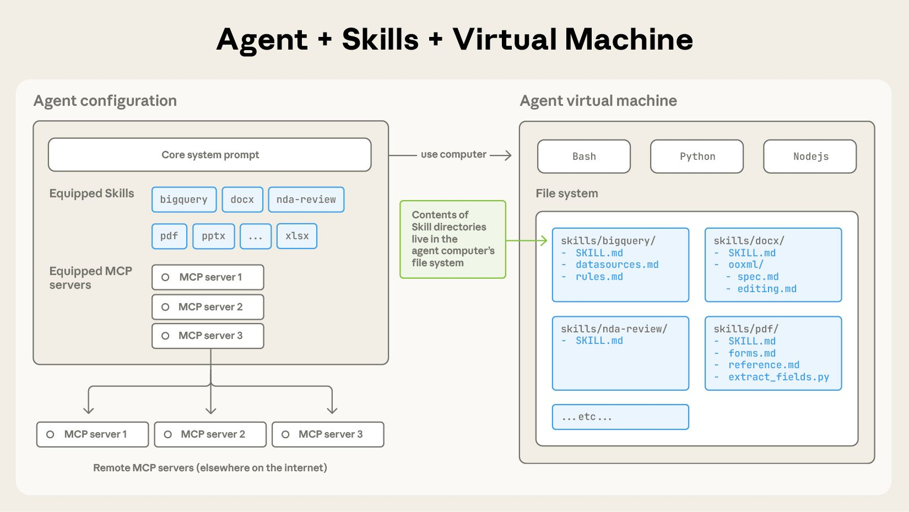
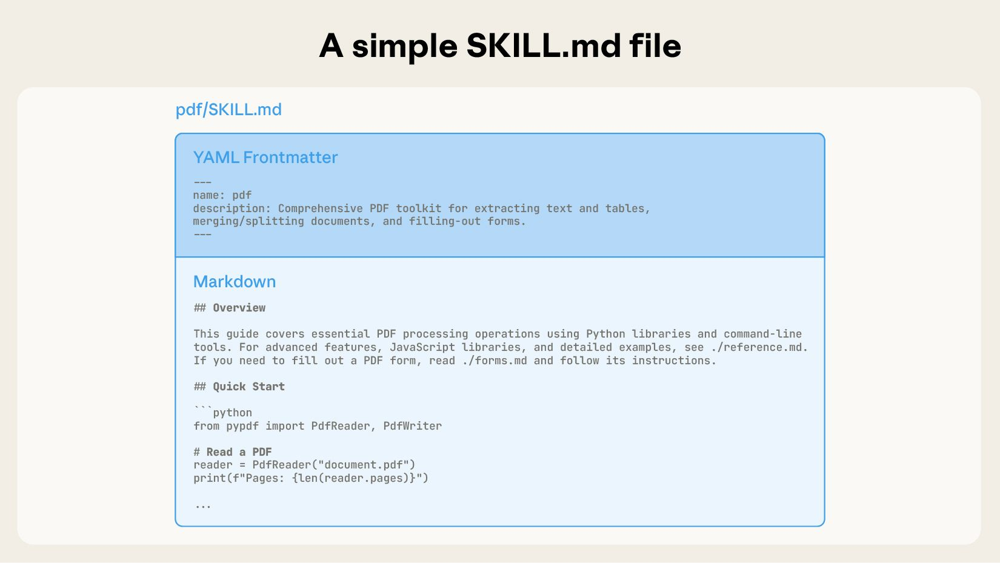
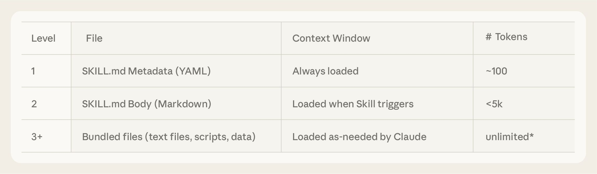
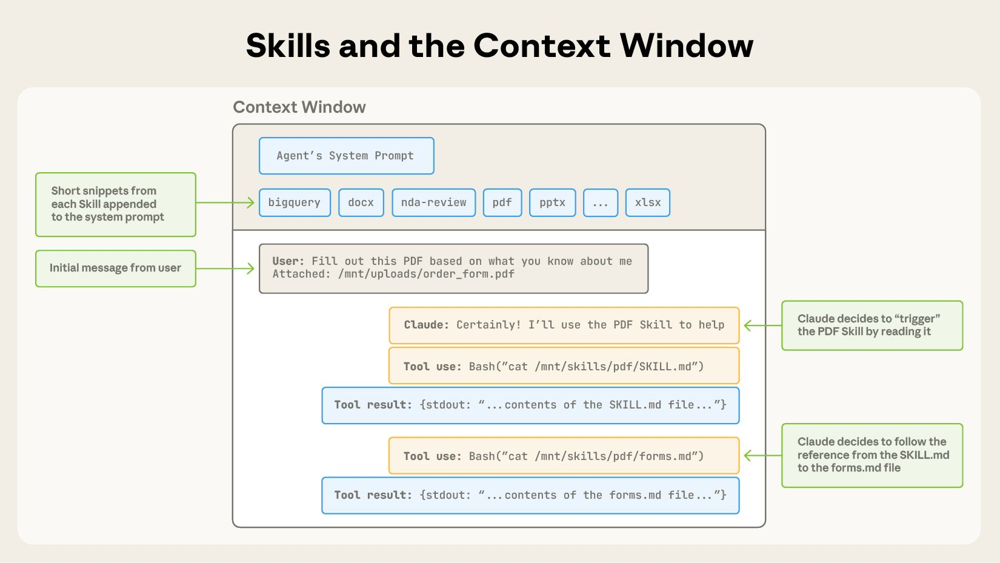

> **更新**：我们已将 Agent Skills 发布为跨平台移植的开放标准。（2025年12月18日）

随着模型能力的提升，我们现在可以构建能够与完整的计算环境交互的通用智能体。例如，[Claude Code](https://claude.com/product/claude-code) 可以利用本地代码执行和文件系统，跨领域完成复杂的任务。但是，随着这些智能体变得越来越强大，我们需要更可组合、可扩展和可移植的方式来为它们配备特定领域的专业知识。

这促使我们创建了 [**Agent Skills**](https://www.anthropic.com/news/skills)：这是一组有组织的指令、脚本和资源文件夹，智能体可以动态发现和加载这些内容，以便更好地执行特定任务。Skills 通过将你的专业知识打包成可组合的资源来扩展 Claude 的能力，将通用智能体转变为符合你需求的专用智能体。

为智能体构建 Skill 就像是为新员工编写入职指南。现在，任何人都可以通过捕捉和分享他们的过程性知识，利用可组合的能力来专门化他们的智能体，而不再需要为每个用例构建碎片化的、定制设计的智能体。在这篇文章中，我们将解释什么是 Skills，展示它们是如何工作的，并分享构建你自己的 Skill 的最佳实践。

## 什么是 Skill？

最简单来说，一个 Skill 就是一个包含 `SKILL.md` 文件的目录。这个文件包含有组织的指令、脚本和资源，赋予智能体额外的能力。

### Skill 的解剖结构

为了看看 Skills 的实际应用，让我们通过一个真实的例子来了解：这是为 [Claude 最近推出的文档编辑能力](https://www.anthropic.com/news/create-files) 提供支持的一个 Skill。Claude 已经非常擅长理解 PDF，但在直接操作它们（例如填写表单）方面能力有限。这个 [PDF Skill](https://github.com/anthropics/skills/tree/main/document-skills/pdf) 让我们能够赋予 Claude 这些新能力。

一个 Skill 本质上是一个包含 `SKILL.md` 文件的目录。这个文件必须以 YAML Frontmatter 开头，其中包含一些必需的元数据：`name` 和 `description`。在启动时，智能体会将每个已安装 Skill 的名称和描述预加载到其系统提示词中。

这种元数据是 **渐进式披露（Progressive Disclosure）** 的第一层：它提供了刚好足够的信息，让 Claude 知道何时应该使用某个 Skill，而无需将所有内容都加载到上下文中。这个文件的实际主体是第二层细节。如果 Claude 认为该 Skill 与当前任务相关，它将通过读取完整的 `SKILL.md` 将其加载到上下文中。

### 渐进式披露

随着 Skill 变得越来越复杂，它们可能包含太多的上下文而无法放入单个 `SKILL.md` 中，或者包含仅在特定场景下相关的上下文。在这些情况下，Skill 可以在 Skill 目录中打包额外的文件，并从 `SKILL.md` 中按名称引用它们。这些额外的链接文件是第三层（及更多层）细节，Claude 可以选择仅在需要时导航和发现这些内容。

在 PDF Skill 示例中，`SKILL.md` 引用了两个额外的文件（`reference.md` 和 `forms.md`），Skill 作者选择将它们与核心 `SKILL.md` 打包在一起。通过将表单填写指令移动到单独的文件（`forms.md`），Skill 作者能够保持 Skill 的核心精简，相信 Claude 只有在填写表单时才会读取 `forms.md`。

渐进式披露是使 Agent Skills 具有灵活性和可扩展性的核心设计原则。就像一本组织良好的手册，从目录开始，然后是特定章节，最后是详细的附录，Skills 让 Claude 仅在需要时加载信息：

**拥有文件系统和代码执行工具的智能体在处理特定任务时，不需要将整个 Skill 读取到它们的上下文窗口中。**

这意味着可以打包到 Skill 中的上下文数量实际上是无限的。

---

## Skill 与上下文窗口

以下是图表展示当用户的消息触发 Skill 时，上下文窗口如何变化：

操作顺序如下：

1. **初始状态**：上下文窗口包含核心系统提示词和每个已安装 Skill 的元数据，以及用户的初始消息。
2. **触发 Skill**：Claude 通过调用 Bash 工具读取 `pdf/SKILL.md` 的内容来触发 PDF Skill。
3. **按需加载**：Claude 选择读取与 Skill 捆绑在一起的 `forms.md` 文件。
4. **执行任务**：最后，Claude 在加载了 PDF Skill 的相关指令后，继续处理用户的任务。

---

## Skill 与代码执行

Skills 还可以包含供 Claude 酌情作为工具执行的代码。

大型语言模型在许多任务上表现出色，但某些操作更适合传统的代码执行。例如，通过 token 生成来排序列表比简单地运行排序算法要昂贵得多。除了效率问题外，许多应用程序还需要只有代码才能提供的确定性可靠性。

在我们的示例中，PDF Skill 包含一个预写的 Python 脚本，用于读取 PDF 并提取所有表单字段。Claude 可以运行此脚本，而无需将脚本或 PDF 加载到上下文中。并且因为代码是确定性的，这个工作流程是一致且可重复的。

---

## 开发与评估 Skills

以下是开始创作和测试 Skills 的一些实用指南：

- **从评估开始**：通过在代表性任务上运行智能体，识别智能体能力的具体差距，观察它们在哪些地方挣扎或需要额外的上下文。然后逐步构建 Skills 来解决这些不足。
- **结构化以实现扩展**：当 `SKILL.md` 文件变得笨重时，将其内容拆分成单独的文件并引用它们。如果某些上下文是互斥的或很少一起使用，保持路径分离将减少 Token 使用。最后，代码既可以作为可执行工具，也可以作为文档。应该明确 Claude 是应该直接运行脚本，还是将它们作为参考读取到上下文中。
- **从 Claude 的视角思考**：在真实场景中监控 Claude 如何使用你的技能，并根据观察进行迭代：注意意外的轨迹或对某些上下文的过度依赖。特别注意你的技能的 `name` 和 `description`。Claude 在决定是否响应其当前任务触发该技能时会使用这些信息。
- **与 Claude 迭代**：当你与 Claude 一起工作时，要求 Claude 将其成功方法和常见错误捕获到技能中的可重用上下文和代码中。如果在使用技能完成任务时偏离了轨道，要求它自我反思出了什么问题。这个过程将帮助你发现 Claude 实际需要什么上下文，而不是试图预先预测它。

### 使用 Skills 时的安全考虑

Skills 通过指令和代码为 Claude 提供新功能。虽然这使它们功能强大，但也意味着恶意技能可能会引入它们所在环境的漏洞，或指示 Claude 渗透数据并采取意外行动。

我们建议仅从可信来源安装技能。当从不太可信的来源安装技能时，请在使用前彻底审核。首先阅读技能中捆绑的文件内容以了解其功能，特别注意代码依赖和捆绑的资源（如图像或脚本）。同样，注意技能内的指令或代码，这些指令或代码指示 Claude 连接到可能不受信任的外部网络来源。

---

## Skills 的未来

Agent Skills 目前在 [Claude.ai](https://claude.ai/)、Claude Code、Claude Agent SDK 和 Claude Developer Platform 上得到支持。

在未来几周，我们将继续添加支持创建、编辑、发现、共享和使用 Skills 完整生命周期的功能。我们特别期待 Skills 能够帮助组织和个人与 Claude 共享他们的上下文和工作流程。我们还将探索 Skills 如何通过教授智能体涉及外部工具和软件的更复杂工作流程来补充 [Model Context Protocol](https://modelcontextprotocol.io/) (MCP) 服务器。

展望更远的未来，我们希望能够使智能体能够自主创建、编辑和评估 Skills，让它们将自己行为模式编码为可重用的能力。

Skills 是一个简单概念，格式也相应简单。这种简单性使组织、开发者和最终用户更容易构建定制化智能体并赋予它们新功能。

我们对人们用 Skills 构建的东西感到兴奋。今天就开始，查看我们的 Skills [文档](https://docs.claude.com/en/docs/agents-and-tools/agent-skills/overview) 和 [烹饪书](https://github.com/anthropics/claude-cookbooks/tree/main/skills)。

---

## 致谢

由 Barry Zhang、Keith Lazuka 和 Mahesh Murag 撰写，他们都非常喜欢文件夹。特别感谢 Anthropic 内部许多支持并构建 Skills 的其他人。

> **文章来源**：[Equipping agents for the real world with Agent Skills](https://www.anthropic.com/engineering/equipping-agents-for-the-real-world-with-agent-skills) - Anthropic Engineering Team
