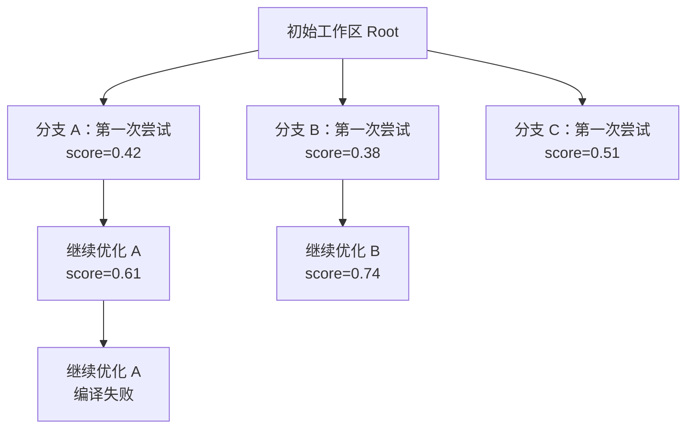
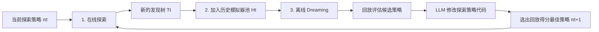

# Dream-RSI 论文解读：让 AI Agent 在历史世界中练习如何探索

AI Agent 已经能在算法设计、数学优化和 GPU Kernel 优化中反复提出方案、运行程序、读取反馈，再继续改进。但当一次发现过程要持续几百甚至几千轮时，一个比“单次能不能写出好代码”更棘手的问题会出现：**有限的计算预算究竟应该分配到哪里？**

是继续深挖当前最好方案，还是新开一条分支？一次并行尝试多少方向？遇到编译错误的分支应该修复还是放弃？什么时候停止？这些决定共同构成了 Agent 的**探索策略（exploration policy）**。

2026 年 9 月的论文 [Dream-RSI: Recursive Self-Improvement through Evolving Worlds](https://arxiv.org/abs/2609.14858) 提出了一种很有启发性的答案：

> 不要只把过去的探索记录当作提示词或训练数据，而要把它组织成一个可以反复游玩的“历史世界”。让 Agent 先在这些世界中低成本试验大量探索策略，再把更好的策略部署到真实任务。

这套框架叫 **Dream-RSI**。这里的 RSI 是 Recursive Self-Improvement，即递归自改进。

:::important 先给结论
Dream-RSI 改进的不是 Gemini 的模型权重，也不是负责生成候选程序的编码 Agent。它改进的是位于更上层的**探索编排代码**：选择哪些分支、并行执行哪些尝试，以及何时停止。
:::

本文会依次讲清楚：

1. 为什么优化探索策略比优化单个候选方案更困难；
2. 历史发现树为何可以充当 replay simulator；
3. Dream-RSI 如何形成“在线探索—离线做梦—重新部署”的闭环；
4. 论文的实验结果说明了什么，又没有说明什么；
5. 如何用一段可运行的 Python 代码理解最小版本的历史回放。

---

## 一、真正昂贵的是“评估搜索方法”

普通候选方案的反馈通常很直接：生成一段代码，运行评测器，就能得到正确性、速度或目标函数值。但要判断一套探索策略好不好，必须让它控制一个完整的长周期搜索过程。

假设探索策略决定：

- 同时维护多少条独立分支；
- 哪条分支值得继续加深；
- 何时开辟新方向；
- 哪些失败属于可修复的实现错误；
- 什么时候收益已经停滞，可以提前停止。

只有执行许多轮“生成—评估”之后，才能知道这些决策最终有没有找到更优解。于是元策略优化面临两个瓶颈：

| 瓶颈 | 含义 |
| :--- | :--- |
| 反馈延迟且昂贵 | 每评估一套新策略，都可能需要重新执行一次长周期在线搜索 |
| 策略空间巨大 | 分支选择、批大小、剪枝、容错和停止规则的组合近乎无穷 |

固定策略虽然便宜，却不会从累计经验中进步；在线试错虽然能适应任务，却会把大量预算消耗在表现糟糕的策略上。Dream-RSI 的核心，就是把“评估探索策略”从昂贵的在线阶段搬到便宜的历史回放阶段。

## 二、关键洞察：历史不是日志，而是一个可重放世界

一次在线发现过程天然会形成一棵树：

- 根节点表示初始工作区；
- 从根出发代表开启一个新方向；
- 从叶节点继续代表沿当前方案再优化一步；
- 每个非根节点保存生成结果、文件快照、评测诊断和分数；
- 父子关系记录候选方案从哪个历史状态演化而来。



传统做法可能把整棵树压缩成几条经验，例如“分支 B 值得继续”“不要使用 A3 的实现”。Dream-RSI 不急着总结，而是保留树的结构和结果，让另一套策略从根节点重新开始，只能逐步看到它选择展开的节点。

例如策略甲先查看 A1、B1，再持续深挖 A；策略乙先并行查看 A1、B1、C1，然后只继续 B。两者访问的是同一棵历史树，却会看到不同的子树、消耗不同的尝试次数，并在不同时间发现历史最佳结果。

这就是论文所说的 **replay simulator（回放模拟器）**。它与强化学习中的 world model 有相似目标：不必每次都与真实环境交互，而是在已有经验构成的环境中评估策略。

:::note Replay 不会创造未发生过的结果
它只能揭示历史树中已经存在的节点，不能推演一条从未被真实探索过的新分支会产生什么。这一点既保证了反馈有真实评测结果支撑，也构成了方法最重要的能力边界。
:::

### 2.1 在线执行与离线回放共享同一接口

论文把可选起点限制为根节点和当前已观察子树的叶节点。若最大并行 worker 数为 $W$，策略每轮选择一个批次：

$$
C \subseteq A(T), \qquad |C| \le W
$$

其中 $A(T)$ 是当前可选节点集合。选择根节点表示新开分支，选择叶节点表示继续已有分支，返回空集合则表示停止。

两种环境的区别只在“选择之后发生什么”：

| 阶段 | 选择节点后 |
| :--- | :--- |
| 在线探索 | 编码 Agent 从对应工作区生成新候选，评测器真实运行并创建子节点 |
| 离线回放 | 模拟器直接揭示历史树中已记录的下一个子节点，不再调用编码 Agent 和评测器 |

因为策略面对相同的决策接口，所以离线回放中改好的代码可以重新部署到在线环境。

## 三、Dream-RSI 的完整自改进闭环

Dream-RSI 由三个阶段反复循环：



### 3.1 在线探索：积累新的真实世界

第 $t$ 轮中，策略 $\pi_t$ 控制固定的编码 Agent 和固定评测器，最多执行 $K_1$ 个决策轮。每次可以并行选择多个起点，生成结果被追加为新的叶节点。整轮结束后得到发现树 $T_t$，并加入历史集合：

$$
H_t = H_{t-1} \cup \{T_t\}
$$

这里“固定”非常重要：底层模型、任务评测方式和执行接口不变，只有探索策略会跨轮更新。因此实验能更集中地衡量编排层改进带来的差异。

### 3.2 离线 Dreaming：在所有历史树上试策略

离线阶段从当前策略开始，由一个固定的 LLM 策略开发 Agent 阅读回放轨迹和评分，修改**可执行的探索策略代码**。每个候选版本都会在当前所有历史树上重新回放，然后继续根据反馈修订。

这不是让 LLM 口头写一句“以后多探索”，而是让它改变实际决策逻辑，例如：

- 如何综合分支当前分数、历史趋势和剩余深度；
- 如何识别可修复失败，避免一次编译错误就永久剪枝；
- 如何在 exploitation、exploration 和 recovery 之间组装动态批次；
- 如何根据停滞证据停止，而不是使用固定的宽搜/深搜节奏。

论文附录还规定了 **prefix-only** 约束：策略只能使用当前已经揭示的观察，不能偷看未来节点分数、真实最优值或预先写死获胜节点。这是在防止离线回放变成“背答案”。

### 3.3 回放目标：质量、成本和并行度同时优化

对候选策略 $m$ 在第 $i$ 棵历史树上的一次回放，论文定义：

$$
V_i^m =
\underbrace{\max_{v \in T_i^*} s_v}_{\text{quality}}
- \underbrace{\beta_1 N_i^m}_{\text{cost}}
+ \underbrace{\beta_2 \frac{N_i^m}{\max(1, k_i^*)}}_{\text{parallelism}}
$$

- $T_i^*$：候选策略 $m$ 最终揭示的历史子树；
- $s_v$：节点的真实评测分数；
- $N_i^m$：揭示的非根节点数量，对应在线时需要的生成—评测请求数；
- $k_i^*$：执行的决策轮数；
- $\beta_1,\beta_2$：成本与并行度的权重。

第一项鼓励找到高质量方案，第二项惩罚无效尝试，第三项鼓励把互相独立且有价值的尝试放进同一个并行批次。候选策略的总分是它在所有历史树上的平均值。下一轮部署得分最高的版本，并且候选集合包含当前策略，因此它在**固定历史集合的回放分数**上不会比当前版本更差。

:::warning 这个保证不是在线性能保证
“回放分数不下降”只针对已经收集的有限历史树。新一轮真实搜索可能遇到不同分支和随机结果，所以不能据此推出在线性能单调提升。
:::

## 四、最小可运行示例：在历史树上比较两种策略

下面的程序实现了一个刻意简化的 replay simulator。它不调用 LLM，但完整展示了三个关键机制：只能揭示历史节点、策略按当前可见前缀决策，以及用“最好分数减成本”比较策略。

```python
from dataclasses import dataclass, field
from typing import Dict, List, Optional, Protocol


@dataclass(frozen=True)
class Node:
    """历史发现树中的一个已评测节点。"""

    node_id: str
    parent_id: Optional[str]
    score: float


@dataclass
class ReplayWorld:
    nodes: Dict[str, Node]
    children: Dict[str, List[str]]
    revealed: set[str] = field(default_factory=lambda: {"root"})
    next_child_index: Dict[str, int] = field(default_factory=dict)

    def legal_actions(self) -> List[str]:
        """根用于开启新分支；已揭示叶节点用于继续当前分支。"""
        actions: List[str] = []
        for node_id in sorted(self.revealed):
            children = self.children.get(node_id, [])
            index = self.next_child_index.get(node_id, 0)
            if index < len(children):
                actions.append(node_id)
        return actions

    def probe_batch(self, parents: List[str], max_workers: int = 2) -> List[Node]:
        if len(parents) > max_workers or len(parents) != len(set(parents)):
            raise ValueError("批次必须去重且不能超过并行 worker 数")

        legal = set(self.legal_actions())
        if not set(parents).issubset(legal):
            raise ValueError("策略选择了当前不可见或无法继续的节点")

        observations: List[Node] = []
        for parent_id in parents:
            index = self.next_child_index.get(parent_id, 0)
            child_id = self.children[parent_id][index]
            self.next_child_index[parent_id] = index + 1
            self.revealed.add(child_id)
            observations.append(self.nodes[child_id])
        return observations


class Policy(Protocol):
    def select(self, world: ReplayWorld, max_workers: int) -> List[str]: ...


class SerialDeepenPolicy:
    """优先沿字典序最前的合法节点串行深挖。"""

    def select(self, world: ReplayWorld, max_workers: int) -> List[str]:
        actions = world.legal_actions()
        non_root = [action for action in actions if action != "root"]
        return (non_root or actions)[:1]


class ParallelExplorePolicy:
    """优先并行开分支，再继续当前可见的高分叶节点。"""

    def select(self, world: ReplayWorld, max_workers: int) -> List[str]:
        actions = world.legal_actions()
        ranked = sorted(
            actions,
            key=lambda action: (
                action != "root",  # root 在仍有新分支时优先
                -world.nodes[action].score,
            ),
        )
        return ranked[:max_workers]


def make_world() -> ReplayWorld:
    nodes = {
        "root": Node("root", None, 0.00),
        "a1": Node("a1", "root", 0.42),
        "a2": Node("a2", "a1", 0.61),
        "a3": Node("a3", "a2", 0.58),
        "b1": Node("b1", "root", 0.38),
        "b2": Node("b2", "b1", 0.74),
        "c1": Node("c1", "root", 0.51),
    }
    children = {
        "root": ["a1", "b1", "c1"],
        "a1": ["a2"],
        "a2": ["a3"],
        "b1": ["b2"],
    }
    return ReplayWorld(nodes=nodes, children=children)


def evaluate(policy: Policy, cost_weight: float = 0.03) -> tuple[float, float, int]:
    world = make_world()
    probes = 0
    for _ in range(4):
        batch = policy.select(world, max_workers=2)
        if not batch:
            break
        probes += len(world.probe_batch(batch, max_workers=2))

    best = max(world.nodes[node_id].score for node_id in world.revealed)
    replay_score = best - cost_weight * probes
    return replay_score, best, probes


for policy in (SerialDeepenPolicy(), ParallelExplorePolicy()):
    replay_score, best, probes = evaluate(policy)
    print(
        f"{policy.__class__.__name__:>22}: "
        f"best={best:.2f}, probes={probes}, replay_score={replay_score:.2f}"
    )
```

运行后可以看到，两种策略并没有生成任何新候选，只是以不同顺序揭示同一棵历史树。真实 Dream-RSI 会在多棵树上评估更复杂的策略代码，还会显式考虑决策轮数和并行收益。

这个例子也暴露了 replay 的本质限制：如果在线历史从未包含 `b2`，离线策略就不可能知道继续 `b1` 会到达 0.74。回放只能更高效地利用已有覆盖，不能替代真实世界中的持续探索。

## 五、实验结果：更少调用下达到相当或更好的结果

论文在 8 个任务上评估 Dream-RSI，覆盖三类发现问题：Lasso 正则化路径算法、3 个数学优化问题，以及 4 个 KernelBench GPU Kernel。主要对照组是 **Recursive Fixed Exploration**：使用相同底层 Agent、评测器、初始化和每轮预算，但始终不更新探索策略。

### 5.1 Lasso 算法工程

在 6 个未参与搜索的下游数据集上，论文报告的平均运行时间如下，越低越好：

| 方法 | 模型 | 累计 Agent 调用 | 平均运行时间 |
| :--- | :--- | ---: | ---: |
| Recursive Fixed Exploration | Gemini-3.1-Pro | 550 | 3587.1 ms |
| Dream-RSI | Gemini-3.1-Pro | 317 | **2931.0 ms** |
| Recursive Fixed Exploration | Gemini-3.7-Flash | 3200 | 2516.7 ms |
| Dream-RSI | Gemini-3.7-Flash | 1879 | **2350.6 ms** |
| SimpleTES | GPT-OSS-120B | 51200 | 3804.8 ms |

Dream-RSI 发现的 Lasso 求解器结合了 strong-rule screening、基于 Cauchy–Schwarz 的 KKT 剪枝、按需精确梯度重算、惰性 Gram 矩阵构造和面向硬件的实现优化。这里值得注意的不是某一个技巧，而是策略更有效地把 Agent 调用投入到了能产生这些组合的分支。

### 5.2 数学优化

在 Sum–Difference、Autocorrelation Inequalities 和 Circle Packing 三项任务上，Dream-RSI 使用 Gemini-3.1-Pro，进行 10 轮递归发现，总计少于 1000 次 generation：

- **Sum–Difference**：得到 1.145427，高于固定探索的 1.144047 和论文列出的 SimpleTES 结果 1.143975；
- **Circle Packing**：得到 2.635983，与对比方法中的最强结果持平；
- **Autocorrelation**：得到 1.456375，保持竞争力，但没有超过表中 SimpleTES 的 1.453675（该任务越低越好）。

因此更准确的表述是：Dream-RSI 在有限预算下整体有竞争力，并非每项任务都达到最佳质量。

### 5.3 GPU Kernel 工程

在 VGG16 和 LayerNorm 上，它分别用 **2.43 倍**和 **1.79 倍**更少的 generation 达到相近性能；在 ConvDiv 和 ConvMax 上，相近预算下性能分别提高到固定探索的 **2.09 倍**和 **1.44 倍**。

论文还观察到策略会随进展调整投入：在 ConvDiv 上，早期性能上升时，它把一轮评估次数从 110 降到 50；当进展停滞后，又主动增加探索量，并伴随新的性能提升。这比“永远保持固定分支数和深度”更像真正的预算调度。

### 5.4 一个反直觉的消融结果

作者还尝试把历史轨迹总结为高层方向建议，再注入后续轮次的 prompt。无论固定探索还是 Dream-RSI，加入这种显式 guidance 后表现反而下降。

论文给出的解释是：长周期、多分支发现依赖探索多样性，过强的语义方向会让不同线程过早收敛到同一个局部区域。结构化回放的优势在于，它用历史检验**如何分配探索**，而不是直接规定**下一步必须探索什么内容**。

---

## 六、怎样理解这项工作的意义

### 6.1 它把自改进从“对象层”抬到了“元层”

许多自改进系统优化的是候选代码、提示词、技能库或模型权重。Dream-RSI 优化的是产生这些改进的搜索机制本身：

| 层级 | 被改进的对象 | 示例问题 |
| :--- | :--- | :--- |
| 对象层 | 某个候选程序 | 这段 CUDA Kernel 还能怎样加速？ |
| 元层 | 寻找候选程序的策略 | 该继续当前 Kernel，还是并行尝试新算法？ |

真正的递归性来自闭环：改进后的元策略带来新的在线历史，新历史又成为下一次改进元策略的环境。

### 6.2 它提供了一种不改模型权重的自改进路径

策略以可执行代码存在，底层模型不需要重新训练。这样做的优点是模块边界清晰、改动容易检查，也能把同一套 orchestration 思路放到不同发现任务上。但能力上限仍然受到编码 Agent、评测器质量和历史覆盖范围约束。

### 6.3 历史保留结构，比历史摘要更有价值

如果只保留“哪些思路成功”这样的文字摘要，就丢失了到达结果所需的成本、顺序、失败恢复过程和并行关系。发现树保留了反事实回放所需的结构：另一套策略可以问“如果先看这些分支、晚一点看那些分支，会怎样？”

---

## 七、局限与阅读时需要保持的谨慎

:::warning 论文是 2026 年 9 月发布的 v1 预印本
当前结果尚不等同于经过同行评审后的稳定结论，后续版本可能修改实验、实现和表述。
:::

### 7.1 回放世界只有历史覆盖，没有生成能力

它更接近“可交互日志”，而不是能预测任意动作结果的生成式 world model。历史树没有覆盖的动作无法评估；早期在线策略若系统性漏掉某类方向，离线优化也可能继承这个盲区。

### 7.2 历史结果被确定性重放

真实编码 Agent 具有随机性，同一个工作区再次生成未必得到相同结果。回放把一次实现结果视作该节点的确定反馈，可能低估方差，也可能把偶然成功或偶然失败当成稳定信号。

### 7.3 可能对有限模拟器池过拟合

策略开发 Agent 反复在同一批历史树上修改代码和选优，存在适应这些树的风险。prefix-only 约束能防止直接偷看未来，却不能完全保证对新任务分布泛化。

### 7.4 成本口径主要是 discovery-agent calls

论文强调节省真实发现调用，但离线阶段仍需要策略开发 Agent 多次生成和评估策略代码，保存完整历史也有存储与工程成本。“近乎零执行成本”是相对于重新运行底层候选生成和任务评测而言，不代表整个离线过程没有成本。

### 7.5 外部基线并非完全同条件

与 Recursive Fixed Exploration 的对照是严格受控的；但与 SimpleTES 等外部系统比较时，模型、实现、硬件与预算口径并不完全一致。因此“162 倍”“50 倍”等数字更适合视为论文设定下的调用量对比，不宜直接推广成所有场景的固定收益。

### 7.6 任务需要可靠且自动化的评测器

历史回放依赖节点分数。如果正确性检查不完整、评分噪声太大，或者目标本身难以自动量化，策略可能非常高效地优化错误指标。

---

## 八、总结

Dream-RSI 最值得记住的不是某个具体搜索启发式，而是一个更通用的设计模式：

1. 把探索控制从底层 Agent 中分离，做成明确、可执行的策略；
2. 保存每次真实探索的完整树结构和评测结果；
3. 将这些历史树转成只能逐步揭示结果的 replay simulator；
4. 在回放世界中低成本评估和改写探索策略；
5. 把改进后的策略重新上线，收集新的历史世界；
6. 重复这个过程，让“如何搜索”本身持续进化。

它并没有解决通用意义上的无限递归自改进，也没有让模型凭空获得新能力。它解决的是一个更具体、也更工程化的问题：**怎样重复利用昂贵的历史发现经验，降低优化长周期探索策略的反馈成本。**

对于已经在运行多 Agent 搜索、代码演化、AutoML 或自动性能优化系统的团队，这个思路很实用：先别急着继续堆在线采样预算，检查你保存的历史轨迹是否已经足够结构化，能够成为下一轮策略优化的“训练场”。

## 参考资料

- [论文：Dream-RSI: Recursive Self-Improvement through Evolving Worlds（arXiv:2609.14858v1）](https://arxiv.org/abs/2609.14858)
- [论文项目代码：zhengkid/Dream-RSI](https://github.com/zhengkid/Dream-RSI)
- [论文项目主页：dream-rsi.com](https://dream-rsi.com/)