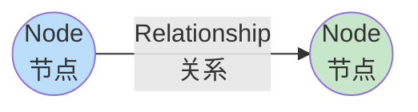
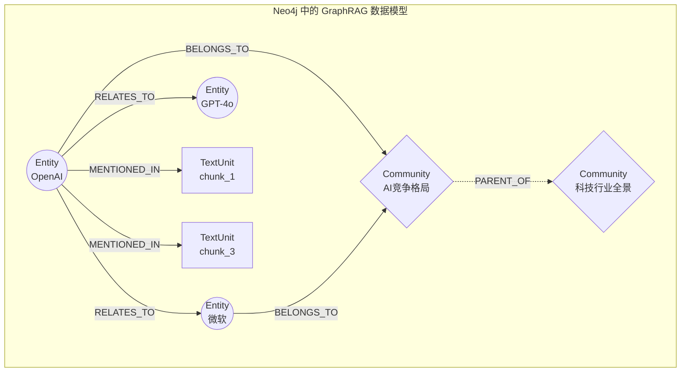
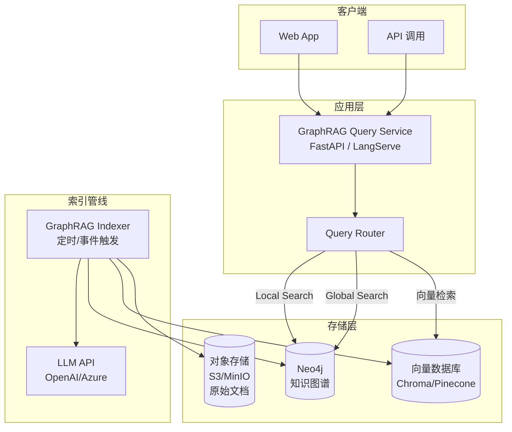
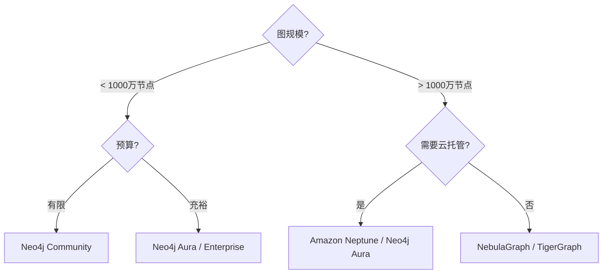

# GraphRAG 图数据库篇：用 Neo4j 存储和查询知识图谱

在[原理篇](/blog/ai/graphrag-principles)中，我们理解了 GraphRAG 为什么需要知识图谱；在[源码篇](/blog/ai/graphrag-source-code)中，我们看到了微软官方实现如何用 NetworkX 在内存中构建图、用 Parquet 文件持久化。

这套方案在原型验证阶段是足够的。但当你要将 GraphRAG 投入生产，马上会遇到这些问题：

- NetworkX 图完全在内存中——100 万节点的图需要 20+ GB 内存，启动时要全量加载
- Parquet 文件不支持实时查询——想做"从实体 A 出发找 3 跳内的所有路径"需要自己写 BFS
- 不支持并发读写——多个查询请求不能同时访问同一张图
- 没有索引——实体名称匹配只能全表扫描
- 图更新代价大——新增一个实体需要重写整个 Parquet 文件

**图数据库**正是为解决这些问题而生的。它原生支持图结构存储、提供专用的图查询语言、内置索引和并发控制，是 GraphRAG 生产化的关键基础设施。

---

## 一、为什么需要图数据库

### 1.1 关系型数据库处理图查询的困境

假设你的知识图谱有"实体"和"关系"两张表：

```sql
-- 关系型数据库中的图
CREATE TABLE entities (
    id VARCHAR PRIMARY KEY,
    name VARCHAR,
    type VARCHAR,
    description TEXT
);

CREATE TABLE relationships (
    source_id VARCHAR REFERENCES entities(id),
    target_id VARCHAR REFERENCES entities(id),
    relation VARCHAR,
    weight FLOAT
);
```

现在你要执行一个简单的 2 跳查询："找到与 OpenAI 有直接或间接关系的所有实体"：

```sql
-- 1 跳
SELECT e2.name FROM entities e1
JOIN relationships r ON e1.id = r.source_id
JOIN entities e2 ON r.target_id = e2.id
WHERE e1.name = 'OpenAI';

-- 2 跳（已经开始变复杂）
SELECT DISTINCT e3.name FROM entities e1
JOIN relationships r1 ON e1.id = r1.source_id
JOIN entities e2 ON r1.target_id = e2.id
JOIN relationships r2 ON e2.id = r2.source_id
JOIN entities e3 ON r2.target_id = e3.id
WHERE e1.name = 'OpenAI';

-- 3 跳？4 跳？N 跳？每加一跳就要多写一层 JOIN...
```

每增加一跳，SQL 就多一层 JOIN。3 跳查询在百万级关系表上可能需要数秒甚至数十秒，因为关系型数据库的 JOIN 操作本质上是笛卡尔积过滤。

### 1.2 图数据库的原生优势

图数据库（如 Neo4j）将节点和边作为一等公民存储，用**索引无关邻接（Index-free Adjacency）**实现高效遍历：每个节点直接持有指向其邻居的指针，无需通过索引或 JOIN。

同样的 2 跳查询在 Neo4j 中：

```cypher
MATCH (e:Entity {name: 'OpenAI'})-[*1..2]-(related:Entity)
RETURN DISTINCT related.name
```

一行搞定，且执行时间几乎不随图规模增长（只与遍历的局部子图大小相关）。

| 维度 | 关系型数据库 | 图数据库 |
| :--- | :--- | :--- |
| **多跳查询** | N 层 JOIN，性能指数衰减 | 原生遍历，性能线性 |
| **路径发现** | 极难表达 | 内置支持 |
| **模式匹配** | 复杂的子查询 | 声明式模式 |
| **图算法** | 需外部实现 | 内置（PageRank、社区检测等） |
| **灵活 schema** | 需 ALTER TABLE | 天然无 schema 约束 |

### 1.3 GraphRAG 场景下的具体需求

| GraphRAG 操作 | 对应的图数据库能力 |
| :--- | :--- |
| Local Search 的实体邻域扩展 | 从节点出发的 N 跳 BFS/DFS |
| 基于关系权重的相关性排序 | 边属性过滤和排序 |
| 社区检测 | 内置图算法库 |
| 增量索引（新增文档） | 实时的节点/边插入 |
| 并发查询 | ACID 事务 + 读写分离 |
| 实体模糊匹配 | 全文索引 |

---

## 二、Neo4j 基础

Neo4j 是目前最成熟的图数据库，有活跃的社区和完善的 Python 生态。我们以它为主来讲解。

### 2.1 核心概念



Neo4j 的数据模型由三个核心元素组成：

- **Node（节点）**：图中的实体，可以有多个 Label（标签）和 Properties（属性）
- **Relationship（关系）**：连接两个节点的有向边，有一个 Type（类型）和任意 Properties
- **Property（属性）**：键值对，附着在节点或关系上

映射到 GraphRAG：

```
GraphRAG Entity  →  Neo4j Node (label: Entity, 属性: name, type, description, rank)
GraphRAG Relationship  →  Neo4j Relationship (type: RELATES_TO, 属性: description, weight)
GraphRAG Community  →  Neo4j Node (label: Community, 属性: level, summary)
GraphRAG TextUnit  →  Neo4j Node (label: TextUnit, 属性: text, n_tokens)
```

### 2.2 Cypher 查询语言速成

Cypher 是 Neo4j 的声明式图查询语言，语法直观地反映图的模式：

```cypher
-- 节点用圆括号表示
(n:Entity {name: 'OpenAI'})

-- 关系用方括号和箭头表示
-[r:RELATES_TO]->

-- 完整的模式匹配
MATCH (a:Entity)-[r:RELATES_TO]->(b:Entity)
WHERE a.name = 'OpenAI'
RETURN b.name, r.description, r.weight
ORDER BY r.weight DESC
```

**常用操作速查**：

```cypher
-- 创建节点
CREATE (e:Entity {name: 'OpenAI', type: 'ORGANIZATION', description: 'AI研究公司'})

-- 创建关系
MATCH (a:Entity {name: 'OpenAI'}), (b:Entity {name: '微软'})
CREATE (b)-[:INVESTED_IN {weight: 10, description: '投资130亿美元'}]->(a)

-- 多跳查询（1到3跳）
MATCH path = (start:Entity {name: 'OpenAI'})-[*1..3]-(end:Entity)
RETURN path

-- 最短路径
MATCH path = shortestPath(
    (a:Entity {name: 'OpenAI'})-[*]-(b:Entity {name: 'Meta'})
)
RETURN path

-- 图算法：度中心性（找最重要的节点）
MATCH (e:Entity)
RETURN e.name, size([(e)-[]-() | 1]) AS degree
ORDER BY degree DESC LIMIT 10

-- 聚合：统计每种实体类型的数量
MATCH (e:Entity)
RETURN e.type, count(*) AS count
ORDER BY count DESC
```

### 2.3 安装与连接

```bash
# Docker 方式启动 Neo4j（推荐开发环境）
docker run -d \
  --name neo4j \
  -p 7474:7474 \
  -p 7687:7687 \
  -e NEO4J_AUTH=neo4j/your_password \
  -e NEO4J_PLUGINS='["graph-data-science"]' \
  -v neo4j_data:/data \
  neo4j:5-community

# 浏览器访问 http://localhost:7474 可使用可视化界面
```

Python 连接：

```python
from neo4j import GraphDatabase

# 创建驱动
driver = GraphDatabase.driver(
    "bolt://localhost:7687",
    auth=("neo4j", "your_password")
)

# 验证连接
with driver.session() as session:
    result = session.run("RETURN 'Hello Neo4j' AS message")
    print(result.single()["message"])

# 使用完毕关闭
driver.close()
```

---

## 三、将 GraphRAG 知识图谱导入 Neo4j

### 3.1 数据导入策略

GraphRAG 索引完成后的 Parquet 文件需要导入到 Neo4j 中。有两种策略：

| 策略 | 适用场景 | 速度 |
| :--- | :--- | :--- |
| **Cypher 逐条写入** | 小图（< 1 万节点）、增量更新 | 慢 |
| **批量导入（UNWIND）** | 大图（> 1 万节点）、全量初始化 | 快 |

### 3.2 完整导入代码

```python
import pandas as pd
from neo4j import GraphDatabase

class GraphRAGNeo4jImporter:
    """将 GraphRAG 索引结果导入 Neo4j"""

    def __init__(self, uri: str, user: str, password: str):
        self.driver = GraphDatabase.driver(uri, auth=(user, password))

    def close(self):
        self.driver.close()

    def import_all(self, output_dir: str):
        """完整导入流程"""
        print("=== 步骤 1/5：创建索引和约束 ===")
        self._create_constraints()

        print("=== 步骤 2/5：导入实体 ===")
        entities_df = pd.read_parquet(f"{output_dir}/entities.parquet")
        self._import_entities(entities_df)
        print(f"  导入 {len(entities_df)} 个实体")

        print("=== 步骤 3/5：导入关系 ===")
        rels_df = pd.read_parquet(f"{output_dir}/relationships.parquet")
        self._import_relationships(rels_df)
        print(f"  导入 {len(rels_df)} 条关系")

        print("=== 步骤 4/5：导入文本块 ===")
        text_units_df = pd.read_parquet(f"{output_dir}/text_units.parquet")
        self._import_text_units(text_units_df)
        print(f"  导入 {len(text_units_df)} 个文本块")

        print("=== 步骤 5/5：导入社区信息 ===")
        reports_df = pd.read_parquet(f"{output_dir}/community_reports.parquet")
        self._import_communities(reports_df)
        print(f"  导入 {len(reports_df)} 个社区报告")

        print("\n✓ 导入完成！")

    def _create_constraints(self):
        """创建唯一约束和索引"""
        with self.driver.session() as session:
            # 唯一约束（同时创建索引）
            session.run("""
                CREATE CONSTRAINT entity_id IF NOT EXISTS
                FOR (e:Entity) REQUIRE e.id IS UNIQUE
            """)
            session.run("""
                CREATE CONSTRAINT textunit_id IF NOT EXISTS
                FOR (t:TextUnit) REQUIRE t.id IS UNIQUE
            """)
            session.run("""
                CREATE CONSTRAINT community_id IF NOT EXISTS
                FOR (c:Community) REQUIRE c.id IS UNIQUE
            """)

            # 全文索引（用于模糊搜索实体名称）
            session.run("""
                CREATE FULLTEXT INDEX entity_name_fulltext IF NOT EXISTS
                FOR (e:Entity) ON EACH [e.name, e.description]
            """)

            # 普通索引
            session.run("""
                CREATE INDEX entity_name IF NOT EXISTS
                FOR (e:Entity) ON (e.name)
            """)
            session.run("""
                CREATE INDEX entity_type IF NOT EXISTS
                FOR (e:Entity) ON (e.type)
            """)

    def _import_entities(self, df: pd.DataFrame):
        """批量导入实体节点"""
        # 准备数据
        entities = []
        for _, row in df.iterrows():
            entities.append({
                "id": row.get("id", ""),
                "name": row.get("title", ""),
                "type": row.get("type", "UNKNOWN"),
                "description": row.get("description", ""),
                "rank": row.get("rank", 0),
                "community_ids": row.get("community_ids", []),
            })

        # 批量写入（UNWIND 比逐条 CREATE 快 10-100 倍）
        with self.driver.session() as session:
            session.run("""
                UNWIND $entities AS entity
                MERGE (e:Entity {id: entity.id})
                SET e.name = entity.name,
                    e.type = entity.type,
                    e.description = entity.description,
                    e.rank = entity.rank
            """, entities=entities)

            # 为每种类型添加额外 Label
            session.run("""
                MATCH (e:Entity)
                WHERE e.type = 'PERSON'
                SET e:Person
            """)
            session.run("""
                MATCH (e:Entity)
                WHERE e.type = 'ORGANIZATION'
                SET e:Organization
            """)

    def _import_relationships(self, df: pd.DataFrame):
        """批量导入关系"""
        rels = []
        for _, row in df.iterrows():
            rels.append({
                "source": row.get("source", ""),
                "target": row.get("target", ""),
                "description": row.get("description", ""),
                "weight": row.get("weight", 1.0),
                "id": row.get("id", ""),
            })

        with self.driver.session() as session:
            session.run("""
                UNWIND $rels AS rel
                MATCH (source:Entity {name: rel.source})
                MATCH (target:Entity {name: rel.target})
                MERGE (source)-[r:RELATES_TO {id: rel.id}]->(target)
                SET r.description = rel.description,
                    r.weight = rel.weight
            """, rels=rels)

    def _import_text_units(self, df: pd.DataFrame):
        """导入文本块并建立与实体的关联"""
        text_units = []
        for _, row in df.iterrows():
            text_units.append({
                "id": row.get("id", ""),
                "text": row.get("text", ""),
                "n_tokens": row.get("n_tokens", 0),
                "entity_ids": row.get("entity_ids", []),
            })

        with self.driver.session() as session:
            # 创建 TextUnit 节点
            session.run("""
                UNWIND $units AS unit
                MERGE (t:TextUnit {id: unit.id})
                SET t.text = unit.text,
                    t.n_tokens = unit.n_tokens
            """, units=text_units)

            # 建立 Entity → TextUnit 的关联
            session.run("""
                UNWIND $units AS unit
                MATCH (t:TextUnit {id: unit.id})
                UNWIND unit.entity_ids AS eid
                MATCH (e:Entity {id: eid})
                MERGE (e)-[:MENTIONED_IN]->(t)
            """, units=text_units)

    def _import_communities(self, df: pd.DataFrame):
        """导入社区及摘要"""
        communities = []
        for _, row in df.iterrows():
            communities.append({
                "id": row.get("id", row.get("community_id", "")),
                "title": row.get("title", ""),
                "level": row.get("level", 0),
                "summary": row.get("summary", ""),
                "full_content": row.get("full_content", ""),
                "rank": row.get("rank", 0),
                "entity_ids": row.get("entity_ids", []),
            })

        with self.driver.session() as session:
            # 创建 Community 节点
            session.run("""
                UNWIND $communities AS comm
                MERGE (c:Community {id: comm.id})
                SET c.title = comm.title,
                    c.level = comm.level,
                    c.summary = comm.summary,
                    c.full_content = comm.full_content,
                    c.rank = comm.rank
            """, communities=communities)

            # 建立 Entity → Community 的关联
            session.run("""
                UNWIND $communities AS comm
                MATCH (c:Community {id: comm.id})
                UNWIND comm.entity_ids AS eid
                MATCH (e:Entity {id: eid})
                MERGE (e)-[:BELONGS_TO]->(c)
            """, communities=communities)
```

使用：

```python
importer = GraphRAGNeo4jImporter(
    uri="bolt://localhost:7687",
    user="neo4j",
    password="your_password"
)
importer.import_all("output/")
importer.close()
```

### 3.3 导入后的图模型



---

## 四、基于 Neo4j 的 Local Search 实现

有了图数据库，Local Search 的核心操作——子图遍历——变得极为高效。

### 4.1 实体检索

```python
from neo4j import GraphDatabase
from langchain_openai import ChatOpenAI
from langchain_core.messages import SystemMessage, HumanMessage

class Neo4jLocalSearch:
    """基于 Neo4j 的 Local Search"""

    def __init__(self, driver: GraphDatabase.driver, llm: ChatOpenAI):
        self.driver = driver
        self.llm = llm

    def search(self, query: str, hops: int = 2, top_k: int = 10) -> str:
        """执行 Local Search"""
        # Step 1: 从查询中识别实体
        seed_entities = self._find_seed_entities(query, top_k=5)

        if not seed_entities:
            return "未在知识图谱中找到相关实体。"

        # Step 2: 获取子图上下文
        context = self._get_subgraph_context(seed_entities, hops=hops)

        # Step 3: 获取关联的原始文本
        source_texts = self._get_source_texts(seed_entities)

        # Step 4: LLM 生成答案
        return self._generate_answer(query, context, source_texts)

    def _find_seed_entities(self, query: str, top_k: int = 5) -> list[dict]:
        """利用 Neo4j 全文索引找到种子实体"""
        with self.driver.session() as session:
            # 方式1: 全文索引模糊搜索
            result = session.run("""
                CALL db.index.fulltext.queryNodes('entity_name_fulltext', $query)
                YIELD node, score
                RETURN node.name AS name,
                       node.type AS type,
                       node.description AS description,
                       node.id AS id,
                       score
                ORDER BY score DESC
                LIMIT $top_k
            """, query=query, top_k=top_k)

            entities = [dict(record) for record in result]

            # 如果全文搜索结果不够，补充精确匹配
            if len(entities) < top_k:
                # 用 LLM 从问题中提取实体名称
                extracted = self._llm_extract_entities(query)
                for name in extracted:
                    exact_result = session.run("""
                        MATCH (e:Entity)
                        WHERE toLower(e.name) CONTAINS toLower($name)
                        RETURN e.name AS name, e.type AS type,
                               e.description AS description, e.id AS id,
                               1.0 AS score
                        LIMIT 3
                    """, name=name)
                    entities.extend([dict(r) for r in exact_result])

            return entities[:top_k]

    def _get_subgraph_context(self, seed_entities: list[dict], hops: int) -> str:
        """从种子实体出发，获取 N 跳子图的结构化上下文"""
        entity_names = [e["name"] for e in seed_entities]

        with self.driver.session() as session:
            # 获取子图中的所有节点和关系
            result = session.run("""
                UNWIND $names AS seedName
                MATCH (seed:Entity {name: seedName})
                CALL apoc.path.subgraphAll(seed, {
                    maxLevel: $hops,
                    relationshipFilter: 'RELATES_TO'
                })
                YIELD nodes, relationships
                UNWIND nodes AS node
                WITH DISTINCT node
                OPTIONAL MATCH (node)-[r:RELATES_TO]-(neighbor)
                WHERE neighbor IN nodes
                RETURN
                    node.name AS entity_name,
                    node.type AS entity_type,
                    node.description AS entity_description,
                    node.rank AS entity_rank,
                    collect(DISTINCT {
                        neighbor: neighbor.name,
                        relation: r.description,
                        weight: r.weight
                    }) AS connections
                ORDER BY node.rank DESC
            """, names=entity_names, hops=hops)

            # 格式化为文本上下文
            context_parts = ["## 知识图谱子图信息\n"]
            for record in result:
                context_parts.append(
                    f"### {record['entity_name']} ({record['entity_type']})"
                )
                if record['entity_description']:
                    context_parts.append(f"{record['entity_description']}\n")

                connections = record['connections']
                if connections and connections[0].get('neighbor'):
                    context_parts.append("**关联实体：**")
                    for conn in connections:
                        if conn['neighbor']:
                            context_parts.append(
                                f"- → {conn['neighbor']}: "
                                f"{conn['relation']} (权重: {conn['weight']})"
                            )
                    context_parts.append("")

            return "\n".join(context_parts)

    def _get_source_texts(self, entities: list[dict], max_chunks: int = 5) -> str:
        """获取实体关联的原始文本块"""
        entity_ids = [e["id"] for e in entities if e.get("id")]

        with self.driver.session() as session:
            result = session.run("""
                UNWIND $ids AS eid
                MATCH (e:Entity {id: eid})-[:MENTIONED_IN]->(t:TextUnit)
                RETURN DISTINCT t.text AS text, t.n_tokens AS tokens
                ORDER BY t.n_tokens DESC
                LIMIT $max_chunks
            """, ids=entity_ids, max_chunks=max_chunks)

            texts = [record["text"] for record in result]

        if texts:
            return "## 原始文本证据\n\n" + "\n\n---\n\n".join(texts)
        return ""

    def _generate_answer(self, query: str, context: str, source_texts: str) -> str:
        """基于上下文生成最终答案"""
        full_context = f"{context}\n\n{source_texts}"

        response = self.llm.invoke([
            SystemMessage(content="""基于提供的知识图谱信息和原始文本回答问题。
要求：
1. 答案必须基于提供的上下文，不要编造
2. 引用具体的实体关系作为依据
3. 如果信息不足，诚实说明"""),
            HumanMessage(content=f"问题：{query}\n\n上下文：\n{full_context}")
        ])
        return response.content

    def _llm_extract_entities(self, query: str) -> list[str]:
        """用 LLM 从问题中提取可能的实体名称"""
        response = self.llm.invoke([
            SystemMessage(content="从用户问题中提取所有可能的实体名称（人名、组织名、产品名等），以JSON列表返回。"),
            HumanMessage(content=query)
        ])
        import json
        try:
            content = response.content
            return json.loads(content[content.index("["):content.rindex("]")+1])
        except:
            return []
```

### 4.2 高级图查询模式

```cypher
-- 1. 加权最短路径：找两个实体间最强的关联路径
MATCH path = shortestPath(
    (a:Entity {name: 'OpenAI'})-[r:RELATES_TO*]-(b:Entity {name: 'Meta'})
)
WHERE ALL(rel IN relationships(path) WHERE rel.weight > 3)
RETURN path,
       reduce(total = 0, r IN relationships(path) | total + r.weight) AS total_weight

-- 2. 共同邻居：找两个实体的共同关联
MATCH (a:Entity {name: 'OpenAI'})-[:RELATES_TO]-(common)-[:RELATES_TO]-(b:Entity {name: 'Google'})
RETURN common.name, common.type, common.description

-- 3. 影响力传播：从一个实体出发，按权重衰减找到受影响的实体
MATCH path = (start:Entity {name: 'OpenAI'})-[r:RELATES_TO*1..3]-(end:Entity)
WITH end,
     reduce(score = 1.0, rel IN relationships(path) | score * (rel.weight / 10.0)) AS influence
WHERE influence > 0.1
RETURN end.name, influence
ORDER BY influence DESC

-- 4. 社区内聚合：获取某社区的完整信息
MATCH (c:Community {title: 'AI竞争格局'})
MATCH (e:Entity)-[:BELONGS_TO]->(c)
OPTIONAL MATCH (e)-[r:RELATES_TO]-(other:Entity)-[:BELONGS_TO]->(c)
RETURN e.name, e.type, collect(DISTINCT {target: other.name, relation: r.description})

-- 5. 跨社区桥接：找到连接不同社区的关键实体
MATCH (e:Entity)-[:BELONGS_TO]->(c1:Community)
MATCH (e)-[:RELATES_TO]-(neighbor:Entity)-[:BELONGS_TO]->(c2:Community)
WHERE c1 <> c2
WITH e, count(DISTINCT c2) AS bridge_count
WHERE bridge_count >= 2
RETURN e.name, e.type, bridge_count
ORDER BY bridge_count DESC
```

### 4.3 使用 APOC 和 GDS 增强查询

Neo4j 有两个重要的扩展库：

- **APOC**（Awesome Procedures on Cypher）：提供 400+ 实用函数
- **GDS**（Graph Data Science）：提供图算法（PageRank、社区检测、相似度等）

```cypher
-- 使用 GDS 计算 PageRank（找最重要的实体）
CALL gds.graph.project('graphrag', 'Entity', 'RELATES_TO', {
    relationshipProperties: 'weight'
})

CALL gds.pageRank.stream('graphrag', {
    maxIterations: 20,
    dampingFactor: 0.85,
    relationshipWeightProperty: 'weight'
})
YIELD nodeId, score
WITH gds.util.asNode(nodeId) AS node, score
RETURN node.name, node.type, score
ORDER BY score DESC
LIMIT 20

-- 使用 GDS 做社区检测（替代 Python 端的 Leiden）
CALL gds.leiden.stream('graphrag', {
    includeIntermediateCommunities: true
})
YIELD nodeId, communityId, intermediateCommunityIds
WITH gds.util.asNode(nodeId) AS node, communityId
RETURN node.name, communityId
ORDER BY communityId

-- 使用 APOC 做路径扩展
MATCH (start:Entity {name: 'OpenAI'})
CALL apoc.path.expandConfig(start, {
    relationshipFilter: 'RELATES_TO',
    minLevel: 1,
    maxLevel: 3,
    limit: 50,
    bfs: true
})
YIELD path
RETURN path
```

---

## 五、基于 Neo4j 的 Global Search 实现

Global Search 不需要图遍历，但图数据库仍然有用——它可以高效地按层级聚合社区信息。

### 5.1 社区摘要检索

```python
class Neo4jGlobalSearch:
    """基于 Neo4j 的 Global Search"""

    def __init__(self, driver, llm):
        self.driver = driver
        self.llm = llm

    def search(self, query: str, level: int = 1) -> str:
        """执行 Global Search"""
        # Step 1: 获取目标层级的社区报告
        reports = self._get_community_reports(level)

        if not reports:
            return "未找到社区信息。"

        # Step 2: 筛选相关社区（用 embedding 或 LLM 打分）
        relevant_reports = self._rank_reports(query, reports)

        # Step 3: Map-Reduce 生成答案
        return self._map_reduce(query, relevant_reports)

    def _get_community_reports(self, level: int) -> list[dict]:
        """从 Neo4j 获取指定层级的社区报告"""
        with self.driver.session() as session:
            result = session.run("""
                MATCH (c:Community)
                WHERE c.level = $level
                OPTIONAL MATCH (e:Entity)-[:BELONGS_TO]->(c)
                WITH c, collect(e.name) AS entity_names, count(e) AS entity_count
                RETURN c.id AS id,
                       c.title AS title,
                       c.summary AS summary,
                       c.full_content AS full_content,
                       c.rank AS rank,
                       entity_names,
                       entity_count
                ORDER BY c.rank DESC
            """, level=level)

            return [dict(record) for record in result]

    def _rank_reports(self, query: str, reports: list[dict], top_k: int = 10) -> list[dict]:
        """按相关性筛选社区报告"""
        # 简单策略：用 LLM 对每个社区标题+摘要打分
        scored = []
        for report in reports:
            response = self.llm.invoke([
                SystemMessage(content="判断社区摘要与问题的相关性，只返回0-10的数字。"),
                HumanMessage(content=f"问题：{query}\n摘要：{report['summary'][:200]}")
            ])
            try:
                score = float(response.content.strip())
            except:
                score = 5.0
            scored.append((report, score))

        scored.sort(key=lambda x: x[1], reverse=True)
        return [r for r, s in scored[:top_k] if s >= 5]

    def _map_reduce(self, query: str, reports: list[dict]) -> str:
        """Map-Reduce 生成全局答案"""
        # Map: 每个社区生成部分答案
        partial_answers = []
        for report in reports:
            response = self.llm.invoke([
                SystemMessage(content="基于社区信息回答问题的相关部分。如不相关返回'无关'。"),
                HumanMessage(content=f"问题：{query}\n\n社区信息：\n{report['full_content']}")
            ])
            answer = response.content
            if "无关" not in answer:
                partial_answers.append(f"[{report['title']}] {answer}")

        if not partial_answers:
            return "根据现有知识图谱，无法回答此问题。"

        # Reduce: 合并为最终答案
        response = self.llm.invoke([
            SystemMessage(content="将多个来源的分析整合为完整连贯的答案。去重、组织、标注来源。"),
            HumanMessage(content=f"问题：{query}\n\n各社区分析：\n" + "\n\n---\n\n".join(partial_answers))
        ])
        return response.content
```

### 5.2 利用图结构增强 Global Search

图数据库的独特优势——可以在社区摘要的基础上，补充实时的图结构分析：

```python
def enhanced_global_search(self, query: str) -> str:
    """增强版 Global Search：摘要 + 实时图分析"""
    # 基本的 Map-Reduce 答案
    basic_answer = self.search(query)

    # 补充图结构统计
    with self.driver.session() as session:
        # 图的整体统计
        stats = session.run("""
            MATCH (e:Entity)
            WITH count(e) AS total_entities
            MATCH ()-[r:RELATES_TO]->()
            WITH total_entities, count(r) AS total_rels
            MATCH (c:Community)
            RETURN total_entities, total_rels, count(c) AS total_communities
        """).single()

        # 最核心的实体（PageRank Top 10）
        top_entities = session.run("""
            MATCH (e:Entity)
            RETURN e.name, e.type,
                   size([(e)-[:RELATES_TO]-() | 1]) AS connections
            ORDER BY connections DESC
            LIMIT 10
        """)
        top_list = [f"{r['e.name']} ({r['connections']}个连接)" for r in top_entities]

    # 将统计信息加入上下文
    graph_context = f"""
补充信息 - 图结构统计：
- 总实体数：{stats['total_entities']}
- 总关系数：{stats['total_rels']}
- 社区数：{stats['total_communities']}
- 核心实体：{', '.join(top_list)}
"""
    # 让 LLM 整合
    response = self.llm.invoke([
        SystemMessage(content="结合文本分析和图结构统计，给出更完整的答案。"),
        HumanMessage(content=f"问题：{query}\n\n文本分析：\n{basic_answer}\n\n{graph_context}")
    ])
    return response.content
```

---

## 六、增量更新：实时维护知识图谱

生产环境中，文档会持续新增。图数据库支持实时的增量更新，无需重建整张图。

### 6.1 增量索引流程

```python
class GraphRAGIncrementalUpdater:
    """增量更新 Neo4j 中的知识图谱"""

    def __init__(self, driver, llm):
        self.driver = driver
        self.llm = llm

    async def add_document(self, document: str, doc_id: str):
        """增量添加一篇新文档"""
        # 1. 分块
        chunks = chunk_text(document)

        # 2. 对每个 chunk 做实体抽取
        for i, chunk in enumerate(chunks):
            chunk_id = f"{doc_id}_chunk_{i}"
            entities, relationships = await extract_entities(chunk, self.llm)

            # 3. 增量写入 Neo4j
            self._upsert_entities(entities, chunk_id)
            self._upsert_relationships(relationships, chunk_id)
            self._create_text_unit(chunk_id, chunk, entities)

        # 4. 重新计算受影响社区的摘要
        affected_communities = self._find_affected_communities(entities)
        await self._regenerate_community_reports(affected_communities)

    def _upsert_entities(self, entities: list, chunk_id: str):
        """Upsert 实体：存在则更新，不存在则创建"""
        with self.driver.session() as session:
            for entity in entities:
                session.run("""
                    MERGE (e:Entity {name: $name})
                    ON CREATE SET
                        e.id = randomUUID(),
                        e.type = $type,
                        e.description = $description,
                        e.rank = 1,
                        e.created_at = datetime()
                    ON MATCH SET
                        e.rank = e.rank + 1,
                        e.description = CASE
                            WHEN size(e.description) < size($description)
                            THEN $description
                            ELSE e.description
                        END,
                        e.updated_at = datetime()
                """, name=entity["name"], type=entity["type"],
                    description=entity["description"])

    def _upsert_relationships(self, relationships: list, chunk_id: str):
        """Upsert 关系"""
        with self.driver.session() as session:
            for rel in relationships:
                session.run("""
                    MATCH (source:Entity {name: $source})
                    MATCH (target:Entity {name: $target})
                    MERGE (source)-[r:RELATES_TO]->(target)
                    ON CREATE SET
                        r.id = randomUUID(),
                        r.description = $description,
                        r.weight = $weight
                    ON MATCH SET
                        r.weight = r.weight + $weight,
                        r.description = r.description + '; ' + $description
                """, source=rel["source"], target=rel["target"],
                    description=rel["description"], weight=rel["weight"])

    def _find_affected_communities(self, new_entities: list) -> list[str]:
        """找到受新实体影响的社区"""
        names = [e["name"] for e in new_entities]
        with self.driver.session() as session:
            result = session.run("""
                UNWIND $names AS name
                MATCH (e:Entity {name: name})-[:BELONGS_TO]->(c:Community)
                RETURN DISTINCT c.id AS community_id
            """, names=names)
            return [r["community_id"] for r in result]

    async def _regenerate_community_reports(self, community_ids: list[str]):
        """重新生成受影响社区的报告"""
        for cid in community_ids:
            with self.driver.session() as session:
                # 获取社区内的最新实体和关系
                result = session.run("""
                    MATCH (e:Entity)-[:BELONGS_TO]->(c:Community {id: $cid})
                    OPTIONAL MATCH (e)-[r:RELATES_TO]-(other:Entity)-[:BELONGS_TO]->(c)
                    RETURN e.name AS name, e.type AS type, e.description AS desc,
                           collect(DISTINCT {neighbor: other.name, relation: r.description}) AS rels
                """, cid=cid)

                # 用 LLM 重新生成摘要
                community_data = [dict(r) for r in result]
                new_summary = await self._generate_report(community_data)

                # 更新 Neo4j 中的社区报告
                session.run("""
                    MATCH (c:Community {id: $cid})
                    SET c.summary = $summary,
                        c.updated_at = datetime()
                """, cid=cid, summary=new_summary)
```

### 6.2 社区结构的增量更新

新增实体可能改变社区结构。两种策略：

```python
# 策略1: 轻量级 — 新实体加入最近邻所在的社区
def assign_to_nearest_community(self, entity_name: str):
    """将新实体分配到其最多邻居所在的社区"""
    with self.driver.session() as session:
        result = session.run("""
            MATCH (e:Entity {name: $name})-[:RELATES_TO]-(neighbor:Entity)
            MATCH (neighbor)-[:BELONGS_TO]->(c:Community)
            WITH c, count(*) AS neighbor_count
            ORDER BY neighbor_count DESC
            LIMIT 1
            RETURN c.id AS community_id
        """, name=entity_name)

        record = result.single()
        if record:
            session.run("""
                MATCH (e:Entity {name: $name})
                MATCH (c:Community {id: $cid})
                MERGE (e)-[:BELONGS_TO]->(c)
            """, name=entity_name, cid=record["community_id"])

# 策略2: 完整重检测 — 定期用 GDS 重新运行 Leiden
def full_community_redetection(self):
    """完整重新检测社区（定期运行，如每日凌晨）"""
    with self.driver.session() as session:
        # 删除旧的社区关系
        session.run("MATCH ()-[r:BELONGS_TO]->(:Community) DELETE r")
        session.run("MATCH (c:Community) DETACH DELETE c")

        # 使用 GDS 重新检测
        session.run("""
            CALL gds.graph.project('temp_graph', 'Entity', 'RELATES_TO')
        """)
        session.run("""
            CALL gds.leiden.write('temp_graph', {
                writeProperty: 'community_id',
                includeIntermediateCommunities: true
            })
        """)

        # 根据检测结果创建 Community 节点和关系
        session.run("""
            MATCH (e:Entity)
            WITH DISTINCT e.community_id AS cid
            CREATE (c:Community {id: 'community_' + toString(cid), level: 0})
        """)
        session.run("""
            MATCH (e:Entity)
            MATCH (c:Community {id: 'community_' + toString(e.community_id)})
            CREATE (e)-[:BELONGS_TO]->(c)
        """)

        session.run("CALL gds.graph.drop('temp_graph')")
```

---

## 七、性能优化

### 7.1 查询优化

```cypher
-- 1. 使用参数化查询（避免查询计划缓存失效）
-- 好：
MATCH (e:Entity {name: $name}) RETURN e
-- 坏：
MATCH (e:Entity {name: 'OpenAI'}) RETURN e

-- 2. 限制遍历深度和结果数
MATCH path = (start:Entity {name: $name})-[*1..3]-(end:Entity)
WITH end, min(length(path)) AS distance
RETURN end.name, distance
ORDER BY distance
LIMIT 50

-- 3. 使用 WHERE 子句尽早过滤
MATCH (e:Entity)-[r:RELATES_TO]-(neighbor)
WHERE r.weight > 5  -- 只看强关系
AND e.name = $name
RETURN neighbor

-- 4. 对热查询使用 PROFILE 分析执行计划
PROFILE
MATCH (e:Entity {name: 'OpenAI'})-[r:RELATES_TO*1..2]-(related)
RETURN related.name, related.type
```

### 7.2 索引策略

```cypher
-- 必须创建的索引
CREATE INDEX entity_name FOR (e:Entity) ON (e.name);
CREATE INDEX entity_type FOR (e:Entity) ON (e.type);
CREATE INDEX community_level FOR (c:Community) ON (c.level);
CREATE INDEX relationship_weight FOR ()-[r:RELATES_TO]-() ON (r.weight);

-- 全文索引（支持模糊搜索）
CREATE FULLTEXT INDEX entity_search
FOR (e:Entity)
ON EACH [e.name, e.description];

-- 向量索引（Neo4j 5.11+，支持 embedding 相似度搜索）
CREATE VECTOR INDEX entity_embedding
FOR (e:Entity)
ON (e.description_embedding)
OPTIONS {indexConfig: {
    `vector.dimensions`: 1536,
    `vector.similarity_function`: 'cosine'
}};

-- 使用向量索引查询
CALL db.index.vector.queryNodes('entity_embedding', 10, $query_embedding)
YIELD node, score
RETURN node.name, score
```

### 7.3 大规模图的分区策略

当图超过千万节点时，单机 Neo4j 可能不够：

```python
# 策略1: 按社区分片读取（减少内存压力）
def query_by_community(driver, community_id: str):
    """只加载一个社区的子图到内存"""
    with driver.session() as session:
        return session.run("""
            MATCH (e:Entity)-[:BELONGS_TO]->(c:Community {id: $cid})
            OPTIONAL MATCH (e)-[r:RELATES_TO]-(other:Entity)-[:BELONGS_TO]->(c)
            RETURN e, r, other
        """, cid=community_id)

# 策略2: Neo4j Fabric（跨数据库联邦查询）
# 适合按领域拆分的超大图
# graph_ai 数据库存 AI 领域的实体
# graph_finance 数据库存金融领域的实体
# 通过 Fabric 统一查询

# 策略3: Neo4j Aura（云托管，自动扩缩容）
# 生产环境推荐，省去运维负担
```

---

## 八、与 LangChain/LangGraph 集成

### 8.1 使用 LangChain 的 Neo4j 集成

```python
from langchain_community.graphs import Neo4jGraph
from langchain_openai import ChatOpenAI
from langchain.chains import GraphCypherQAChain

# LangChain 内置的 Neo4j 图集成
graph = Neo4jGraph(
    url="bolt://localhost:7687",
    username="neo4j",
    password="your_password"
)

# 查看图的 schema（LangChain 会自动探测）
print(graph.schema)

# 使用 GraphCypherQAChain：LLM 自动生成 Cypher 查询
llm = ChatOpenAI(model="gpt-4o", temperature=0)

chain = GraphCypherQAChain.from_llm(
    llm=llm,
    graph=graph,
    verbose=True,
    # 允许 LLM 看到完整的图 schema 来生成准确的 Cypher
    allow_dangerous_requests=True,
)

# 自然语言查询 → 自动转 Cypher → 返回结果
result = chain.invoke({"query": "OpenAI 和哪些公司有竞争关系？"})
print(result["result"])
```

### 8.2 自定义 Retriever

```python
from langchain_core.retrievers import BaseRetriever
from langchain_core.documents import Document
from typing import List

class Neo4jGraphRAGRetriever(BaseRetriever):
    """自定义的 GraphRAG Retriever，可直接插入 LangChain 的 RAG 链"""

    driver: any
    llm: any
    search_type: str = "local"  # "local" or "global"
    hops: int = 2

    class Config:
        arbitrary_types_allowed = True

    def _get_relevant_documents(self, query: str) -> List[Document]:
        """检索相关文档"""
        if self.search_type == "local":
            searcher = Neo4jLocalSearch(self.driver, self.llm)
            context = searcher._get_subgraph_context(
                searcher._find_seed_entities(query), hops=self.hops
            )
            source_texts = searcher._get_source_texts(
                searcher._find_seed_entities(query)
            )
            return [
                Document(page_content=context, metadata={"source": "graph_context"}),
                Document(page_content=source_texts, metadata={"source": "text_units"}),
            ]
        else:
            searcher = Neo4jGlobalSearch(self.driver, self.llm)
            reports = searcher._get_community_reports(level=1)
            return [
                Document(
                    page_content=r["full_content"],
                    metadata={"source": f"community_{r['id']}"}
                )
                for r in reports[:10]
            ]
```

### 8.3 在 LangGraph 中编排 GraphRAG

```python
from langgraph.graph import StateGraph, START, END
from langgraph.graph.message import add_messages
from typing import Annotated, TypedDict

class GraphRAGState(TypedDict):
    messages: Annotated[list, add_messages]
    query: str
    search_mode: str  # local | global | hybrid
    graph_context: str
    final_answer: str

def query_router(state: GraphRAGState) -> dict:
    """路由：判断用 Local 还是 Global Search"""
    response = llm.invoke([
        SystemMessage(content="判断问题类型。具体实体问题返回'local'，概括性问题返回'global'，复杂问题返回'hybrid'。只返回一个词。"),
        HumanMessage(content=state["query"])
    ])
    return {"search_mode": response.content.strip().lower()}

def local_search_node(state: GraphRAGState) -> dict:
    """执行 Local Search"""
    searcher = Neo4jLocalSearch(driver, llm)
    answer = searcher.search(state["query"])
    return {"graph_context": answer}

def global_search_node(state: GraphRAGState) -> dict:
    """执行 Global Search"""
    searcher = Neo4jGlobalSearch(driver, llm)
    answer = searcher.search(state["query"])
    return {"graph_context": answer}

def hybrid_search_node(state: GraphRAGState) -> dict:
    """混合搜索"""
    local_result = Neo4jLocalSearch(driver, llm).search(state["query"])
    global_result = Neo4jGlobalSearch(driver, llm).search(state["query"])
    combined = f"局部分析：\n{local_result}\n\n全局视角：\n{global_result}"
    return {"graph_context": combined}

def generate_answer(state: GraphRAGState) -> dict:
    """生成最终答案"""
    response = llm.invoke([
        SystemMessage(content="基于检索到的图谱信息生成完整答案。"),
        HumanMessage(content=f"问题：{state['query']}\n\n信息：\n{state['graph_context']}")
    ])
    return {"final_answer": response.content, "messages": [response]}

def route_search(state: GraphRAGState) -> str:
    mode = state.get("search_mode", "local")
    if mode == "global":
        return "global_search"
    elif mode == "hybrid":
        return "hybrid_search"
    return "local_search"

# 构建 LangGraph 工作流
graph = StateGraph(GraphRAGState)

graph.add_node("router", query_router)
graph.add_node("local_search", local_search_node)
graph.add_node("global_search", global_search_node)
graph.add_node("hybrid_search", hybrid_search_node)
graph.add_node("generate", generate_answer)

graph.add_edge(START, "router")
graph.add_conditional_edges("router", route_search, {
    "local_search": "local_search",
    "global_search": "global_search",
    "hybrid_search": "hybrid_search",
})
graph.add_edge("local_search", "generate")
graph.add_edge("global_search", "generate")
graph.add_edge("hybrid_search", "generate")
graph.add_edge("generate", END)

graphrag_agent = graph.compile()
```

---

## 九、图数据库选型对比

除了 Neo4j，还有多个图数据库可用于 GraphRAG 场景。

### 9.1 主流图数据库对比

| 数据库 | 查询语言 | 分布式 | 开源 | Python SDK | 适合规模 |
| :--- | :--- | :--- | :--- | :--- | :--- |
| **Neo4j** | Cypher | Enterprise 版 | 社区版是 | 完善 | 百万-十亿 |
| **NebulaGraph** | nGQL / Cypher | 原生支持 | 是 | 完善 | 十亿+ |
| **ArangoDB** | AQL | 是 | 是 | 完善 | 百万-十亿 |
| **TigerGraph** | GSQL | 是 | 社区版 | 一般 | 十亿+ |
| **Amazon Neptune** | Gremlin/SPARQL | 托管 | 否 | AWS SDK | 十亿+ |
| **JanusGraph** | Gremlin | 是 | 是 | 通过 Gremlin | 十亿+ |

### 9.2 Neo4j 的优势与劣势

:::tip Neo4j 适合 GraphRAG 的原因
- **Cypher 语言最直观**：学习成本低，模式匹配语法天然适合知识图谱查询
- **GDS 库功能强大**：内置 Leiden/Louvain 社区检测、PageRank 等，无需外部依赖
- **向量索引原生支持**（5.11+）：可以同时做图遍历和向量相似度搜索
- **LangChain 集成完善**：GraphCypherQAChain、Neo4jGraph 等开箱即用
- **可视化工具好**：Neo4j Browser/Bloom 可以直接看图结构
:::

:::warning Neo4j 的局限
- **社区版不支持分布式**：单机存储上限约 340 亿节点/关系（企业版无限制）
- **写入吞吐量有限**：大批量导入时需要使用 neo4j-admin import 工具
- **内存消耗大**：建议物理内存 ≥ 图大小的 1.5 倍
- **企业版价格高**：分布式、热备、高级安全功能需要企业许可
:::

### 9.3 NebulaGraph：大规模分布式场景

如果你的知识图谱节点超过 10 亿，或需要高并发写入，NebulaGraph 是更好的选择：

```python
from nebula3.gclient.net import ConnectionPool
from nebula3.Config import Config

# 连接 NebulaGraph
config = Config()
config.max_connection_pool_size = 10
pool = ConnectionPool()
pool.init([('127.0.0.1', 9669)], config)

session = pool.get_session('root', 'nebula')
session.execute('USE graphrag_space')

# nGQL 查询（类似 Cypher 但有差异）
# 多跳查询
result = session.execute('''
    GO 1 TO 3 STEPS FROM "OpenAI" OVER relates_to
    YIELD relates_to._dst AS entity,
          relates_to.description AS relation
''')

# 最短路径
result = session.execute('''
    FIND SHORTEST PATH FROM "OpenAI" TO "Meta" OVER relates_to
    YIELD path AS p
''')

# NebulaGraph 也支持 Cypher（通过兼容层）
result = session.execute('''
    MATCH (a)-[r:relates_to*1..3]-(b)
    WHERE id(a) == "OpenAI"
    RETURN b.entity.name, r
    LIMIT 50
''')

session.release()
pool.close()
```

**NebulaGraph vs Neo4j 选型**：

| 场景 | 推荐 |
| :--- | :--- |
| 原型验证/小团队 | Neo4j Community |
| 中等规模生产（< 10 亿节点） | Neo4j Enterprise 或 Aura |
| 大规模（> 10 亿节点）| NebulaGraph |
| 高写入吞吐（实时流式数据）| NebulaGraph |
| 需要 SQL 兼容/多模型 | ArangoDB |
| AWS 原生/无运维 | Amazon Neptune |

### 9.4 ArangoDB：多模型方案

ArangoDB 同时支持文档、图、键值三种数据模型，适合需要混合存储的场景：

```python
from arango import ArangoClient

client = ArangoClient()
db = client.db('graphrag', username='root', password='password')

# 创建图
if not db.has_graph('knowledge_graph'):
    graph = db.create_graph('knowledge_graph')
    graph.create_vertex_collection('entities')
    graph.create_edge_definition(
        edge_collection='relationships',
        from_vertex_collections=['entities'],
        to_vertex_collections=['entities']
    )

# AQL 图查询
cursor = db.aql.execute('''
    FOR v, e, p IN 1..3 OUTBOUND 'entities/OpenAI'
    GRAPH 'knowledge_graph'
    FILTER e.weight > 5
    RETURN {entity: v.name, relation: e.description, depth: LENGTH(p.edges)}
''')

for doc in cursor:
    print(doc)
```

---

## 十、生产部署架构

### 10.1 完整的 GraphRAG 生产架构



### 10.2 FastAPI 服务示例

```python
from fastapi import FastAPI, HTTPException
from pydantic import BaseModel
from neo4j import GraphDatabase
from langchain_openai import ChatOpenAI

app = FastAPI(title="GraphRAG Query Service")

# 全局资源
driver = GraphDatabase.driver("bolt://neo4j:7687", auth=("neo4j", "password"))
llm = ChatOpenAI(model="gpt-4o")

class QueryRequest(BaseModel):
    question: str
    mode: str = "auto"  # auto | local | global
    hops: int = 2

class QueryResponse(BaseModel):
    answer: str
    mode_used: str
    entities_found: list[str]

@app.post("/query", response_model=QueryResponse)
async def query(request: QueryRequest):
    """GraphRAG 查询接口"""
    try:
        mode = request.mode
        if mode == "auto":
            mode = classify_query(request.question, llm)

        if mode == "local":
            searcher = Neo4jLocalSearch(driver, llm)
            answer = searcher.search(request.question, hops=request.hops)
            entities = [e["name"] for e in searcher._find_seed_entities(request.question)]
        else:
            searcher = Neo4jGlobalSearch(driver, llm)
            answer = searcher.search(request.question)
            entities = []

        return QueryResponse(
            answer=answer,
            mode_used=mode,
            entities_found=entities
        )
    except Exception as e:
        raise HTTPException(status_code=500, detail=str(e))

@app.get("/graph/stats")
async def graph_stats():
    """图的基本统计"""
    with driver.session() as session:
        result = session.run("""
            MATCH (e:Entity) WITH count(e) AS entities
            MATCH ()-[r:RELATES_TO]->() WITH entities, count(r) AS relationships
            MATCH (c:Community) WITH entities, relationships, count(c) AS communities
            RETURN entities, relationships, communities
        """).single()
        return dict(result)

@app.on_event("shutdown")
def shutdown():
    driver.close()
```

### 10.3 Docker Compose 部署

```yaml
# docker-compose.yml
version: '3.8'

services:
  neo4j:
    image: neo4j:5-community
    ports:
      - "7474:7474"
      - "7687:7687"
    environment:
      - NEO4J_AUTH=neo4j/graphrag_password
      - NEO4J_PLUGINS=["graph-data-science"]
      - NEO4J_server_memory_heap_initial__size=1G
      - NEO4J_server_memory_heap_max__size=4G
      - NEO4J_server_memory_pagecache_size=2G
    volumes:
      - neo4j_data:/data
      - neo4j_logs:/logs

  graphrag-api:
    build: .
    ports:
      - "8000:8000"
    environment:
      - NEO4J_URI=bolt://neo4j:7687
      - NEO4J_USER=neo4j
      - NEO4J_PASSWORD=graphrag_password
      - OPENAI_API_KEY=${OPENAI_API_KEY}
    depends_on:
      - neo4j

volumes:
  neo4j_data:
  neo4j_logs:
```

---

## 十一、监控与运维

### 11.1 Neo4j 健康监控

```python
class Neo4jHealthChecker:
    """Neo4j 健康检查"""

    def __init__(self, driver):
        self.driver = driver

    def check_health(self) -> dict:
        with self.driver.session() as session:
            # 基本连通性
            session.run("RETURN 1")

            # 图规模
            stats = session.run("""
                MATCH (n) WITH count(n) AS nodes
                MATCH ()-[r]->() WITH nodes, count(r) AS rels
                RETURN nodes, rels
            """).single()

            # 存储使用
            store_info = session.run("CALL dbms.queryJmx('org.neo4j:*')").data()

            return {
                "status": "healthy",
                "nodes": stats["nodes"],
                "relationships": stats["rels"],
                "store_info": store_info
            }

    def check_index_status(self) -> list:
        """检查所有索引的状态"""
        with self.driver.session() as session:
            result = session.run("SHOW INDEXES")
            return [dict(r) for r in result]

    def check_slow_queries(self, threshold_ms: int = 5000) -> list:
        """检查慢查询"""
        with self.driver.session() as session:
            result = session.run("""
                CALL dbms.listQueries()
                YIELD queryId, query, elapsedTimeMillis
                WHERE elapsedTimeMillis > $threshold
                RETURN queryId, query, elapsedTimeMillis
            """, threshold=threshold_ms)
            return [dict(r) for r in result]
```

### 11.2 图质量监控

```python
def graph_quality_report(driver) -> dict:
    """图质量报告——定期运行，发现数据问题"""
    with driver.session() as session:
        report = {}

        # 孤立节点（没有任何关系的实体）
        isolated = session.run("""
            MATCH (e:Entity)
            WHERE NOT (e)-[:RELATES_TO]-()
            RETURN count(e) AS count
        """).single()["count"]
        report["isolated_entities"] = isolated

        # 自环（自己连自己）
        self_loops = session.run("""
            MATCH (e:Entity)-[r:RELATES_TO]->(e)
            RETURN count(r) AS count
        """).single()["count"]
        report["self_loops"] = self_loops

        # 重复关系
        duplicates = session.run("""
            MATCH (a)-[r:RELATES_TO]->(b)
            WITH a, b, count(r) AS rel_count
            WHERE rel_count > 1
            RETURN count(*) AS duplicate_pairs
        """).single()["duplicate_pairs"]
        report["duplicate_relationships"] = duplicates

        # 描述缺失率
        missing_desc = session.run("""
            MATCH (e:Entity)
            WHERE e.description IS NULL OR e.description = ''
            RETURN count(e) * 1.0 / (MATCH (e2:Entity) RETURN count(e2))[0] AS rate
        """).single()
        report["missing_description_rate"] = missing_desc

        # 社区覆盖率（有多少实体还没分配社区）
        uncommunity = session.run("""
            MATCH (e:Entity)
            WHERE NOT (e)-[:BELONGS_TO]->(:Community)
            RETURN count(e) AS count
        """).single()["count"]
        report["entities_without_community"] = uncommunity

        return report
```

---

## 总结

图数据库是 GraphRAG 从原型走向生产的关键基础设施。它解决了三个核心问题：

1. **高效遍历**：多跳查询从 O(N²) 的 JOIN 变为 O(K) 的指针跟随
2. **实时更新**：增量添加节点/边，无需重建整个图
3. **并发查询**：支持多用户同时访问，ACID 保证一致性

**技术选型决策树**：



**关键实践建议**：

1. **先用 Neo4j Community 起步**——免费、生态好、学习资源多
2. **索引设计要提前**——全文索引 + 向量索引 + 属性索引三位一体
3. **增量更新比全量重建好**——设计好 MERGE（upsert）策略
4. **社区重检测定期做**——增量分配是临时策略，定期全量重检测保证质量
5. **监控图的健康度**——孤立节点、重复边、描述缺失率是早期预警指标

:::tip 系列文章导航
- [原理篇](/blog/ai/graphrag-principles) —— 设计动机与核心方法论
- [源码篇](/blog/ai/graphrag-source-code) —— 微软 GraphRAG 开源实现的架构与代码走读
- **图数据库篇**（本文） —— 用 Neo4j 存储和查询知识图谱
:::
