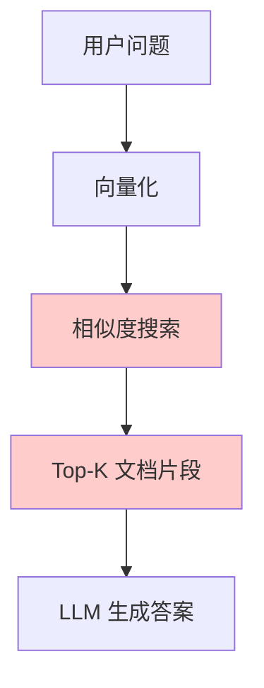
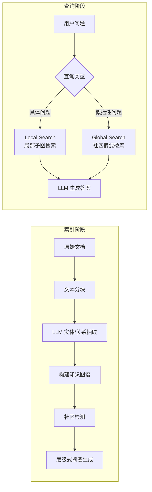
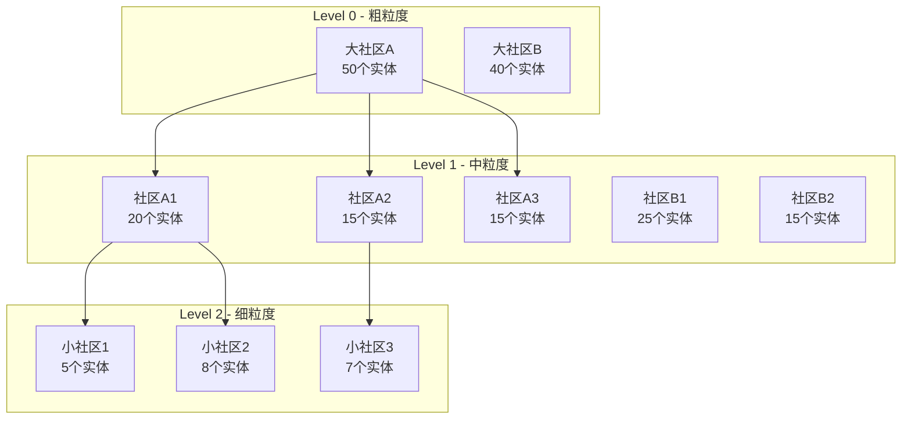
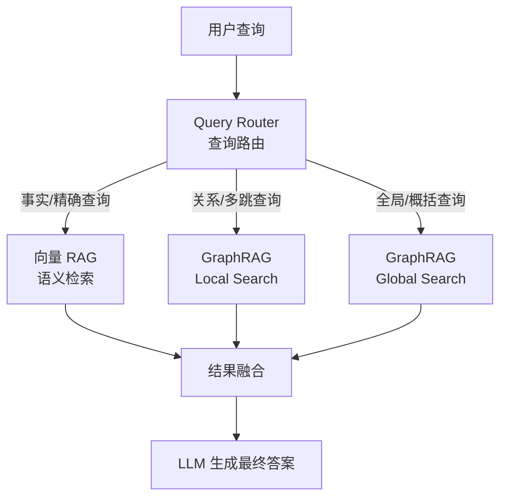
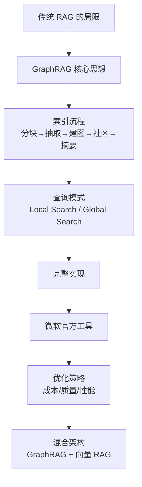

# GraphRAG 完全指南：用知识图谱突破传统 RAG 的天花板

传统 RAG（Retrieval-Augmented Generation）已经成为 LLM 应用的标配方案——把文档切片、向量化、检索相关片段、丢给 LLM 生成回答。这在大多数简单问答场景下效果不错。

但当你尝试用 RAG 回答以下类型的问题时，就会发现明显的瓶颈：

- **"这份年报中提到的所有合作伙伴之间有什么关联？"**——需要跨越多个文档块的信息关联
- **"整个代码库的架构设计思路是什么？"**——需要全局性的概括总结
- **"张三和李四之间隔了几层汇报关系？"**——需要多跳推理
- **"这个领域近五年的研究趋势是什么？"**——需要对大量文档做高层次归纳

这些问题的共同点是：**答案不在任何一个文档片段里，而是分散在多个片段的关联关系中**。

传统 RAG 的向量检索本质上是"找最相似的片段"，它无法理解实体之间的关系，也无法做全局性的概括。**GraphRAG** 正是为了解决这些问题而提出的。

---

## 一、传统 RAG 的局限性

在深入 GraphRAG 之前，先明确传统 RAG 在哪些场景下会失败。

### 1.1 向量检索的根本局限



传统 RAG 的检索步骤本质上是**局部匹配**：找到与 query 语义最接近的文本片段。它有三个固有限制：

| 局限 | 描述 | 示例 |
| :--- | :--- | :--- |
| **信息孤岛** | 每个 chunk 独立，无法关联跨 chunk 信息 | "A公司投资了B公司"和"B公司收购了C公司"分在不同 chunk，无法推出 A→B→C 的投资链 |
| **缺乏全局视角** | 只能找局部相关片段，无法做全局总结 | "整个文档集的主题是什么？" 无法用 Top-K 回答 |
| **多跳推理困难** | 需要经过多个中间节点才能得到答案 | "X的导师的合作者的学生有谁？" 需要3跳推理 |

### 1.2 一个具体的失败案例

假设你有一份 100 页的公司年报，用户问："**这家公司的供应链面临哪些系统性风险？**"

传统 RAG 会怎么做：
1. 把问题向量化
2. 找到最相似的 5 个片段（可能是"供应链"、"风险"相关的段落）
3. 让 LLM 基于这 5 个片段回答

**问题在于**：供应链风险的答案分散在年报的多个章节——财务风险、运营风险、地缘政治、原材料价格、物流中断、合作伙伴依赖度……这些信息之间有复杂的关联关系，不是 Top-5 片段能覆盖的。

GraphRAG 的做法截然不同：它会先把年报中提到的所有实体（公司、人物、地区、风险因素）和它们之间的关系构建成一张知识图谱，然后基于图结构做检索和推理。

---

## 二、GraphRAG 是什么

GraphRAG 是微软研究院在 2024 年提出的方法（论文：*From Local to Global: A Graph RAG Approach to Query-Focused Summarization*），核心思想是：

> **在索引阶段构建知识图谱，在查询阶段基于图结构进行检索和生成**。

它不是对传统 RAG 的小修小补，而是一套完整的新范式：



### 2.1 核心组件

| 组件 | 作用 | 传统 RAG 对应物 |
| :--- | :--- | :--- |
| **知识图谱** | 存储实体及其关系 | 向量数据库 |
| **社区结构** | 将图划分为语义相关的子图 | 无对应 |
| **层级摘要** | 不同粒度的社区概括 | 无对应 |
| **Local Search** | 基于实体和关系的局部检索 | 相似度检索 |
| **Global Search** | 基于社区摘要的全局检索 | 无对应 |

### 2.2 与传统 RAG 的对比

| 维度 | 传统 RAG | GraphRAG |
| :--- | :--- | :--- |
| **索引结构** | 向量索引（平坦的） | 知识图谱 + 社区层级（结构化的） |
| **检索方式** | 语义相似度 | 图遍历 + 社区匹配 |
| **跨文档关联** | 无 | 通过实体/关系天然关联 |
| **全局概括** | 不支持 | 通过层级摘要支持 |
| **多跳推理** | 极弱 | 通过图路径天然支持 |
| **索引成本** | 低（embedding） | 高（大量 LLM 调用） |
| **查询延迟** | 低 | 中等 |

:::note
GraphRAG 不是要替代传统 RAG，而是为那些传统 RAG 处理不好的复杂查询提供解决方案。简单的事实查询（"第三季度营收是多少？"）用传统 RAG 就够了，也更快更便宜。
:::

---

## 三、索引阶段：从文本到知识图谱

GraphRAG 的索引流程远比传统 RAG 复杂。它需要经过多个 LLM 调用密集的步骤，最终产出一张富含语义信息的知识图谱。

### 3.1 步骤一：文本分块

和传统 RAG 一样，第一步是将长文档切成可管理的片段。但 GraphRAG 的分块有特殊考量：

```python
from typing import List

def chunk_text(text: str, chunk_size: int = 1200, overlap: int = 100) -> List[str]:
    """
    GraphRAG 的分块策略：
    - chunk_size 较大（1200-2000 token），因为实体抽取需要更多上下文
    - overlap 适中，确保跨边界的实体关系不丢失
    """
    words = text.split()
    chunks = []
    start = 0

    while start < len(words):
        end = start + chunk_size
        chunk = " ".join(words[start:end])
        chunks.append(chunk)
        start = end - overlap  # 滑动窗口

    return chunks
```

:::tip
GraphRAG 的 chunk size 通常比传统 RAG 更大。原因是实体关系抽取需要足够的上下文——太短的片段中，实体之间的关系可能不完整。微软官方实现默认使用 1200 token 的 chunk size。
:::

### 3.2 步骤二：实体与关系抽取

这是 GraphRAG 的核心步骤——用 LLM 从每个文本块中抽取实体（Entity）和关系（Relationship）。

```python
from langchain_openai import ChatOpenAI
from langchain_core.messages import SystemMessage, HumanMessage
import json

model = ChatOpenAI(model="gpt-4o", temperature=0)

ENTITY_EXTRACTION_PROMPT = """你是一个信息抽取专家。从给定的文本中抽取所有实体和它们之间的关系。

## 实体类型
- PERSON（人物）
- ORGANIZATION（组织）
- LOCATION（地点）
- EVENT（事件）
- CONCEPT（概念/技术）
- PRODUCT（产品）
- DATE（日期/时间）

## 输出格式（JSON）
{
  "entities": [
    {"name": "实体名称", "type": "实体类型", "description": "一句话描述该实体"}
  ],
  "relationships": [
    {"source": "源实体名", "target": "目标实体名", "relation": "关系描述", "weight": 1-10}
  ]
}

## 抽取原则
1. 抽取所有有意义的实体，即使只提到一次
2. 关系要具体（不要只写"相关"，要写明具体关系如"投资了"、"创立了"、"位于"）
3. weight 表示关系的强度/重要性（1最弱，10最强）
4. 同一实体在不同表述下应统一命名（如"微软"和"Microsoft"统一为"微软"）

## 文本
{text}
"""

def extract_entities_and_relations(chunk: str) -> dict:
    """从单个文本块中抽取实体和关系"""
    response = model.invoke([
        SystemMessage(content="你是信息抽取专家，严格按JSON格式输出。"),
        HumanMessage(content=ENTITY_EXTRACTION_PROMPT.format(text=chunk))
    ])

    try:
        # 提取 JSON 部分
        content = response.content
        json_start = content.index("{")
        json_end = content.rindex("}") + 1
        result = json.loads(content[json_start:json_end])
        return result
    except (json.JSONDecodeError, ValueError):
        return {"entities": [], "relationships": []}


# 示例
sample_text = """
2024年3月，OpenAI发布了GPT-4o模型。该模型由Sam Altman领导的团队开发，
支持多模态输入。Google随后发布了Gemini 1.5 Pro作为竞品回应。
两家公司在人工智能领域展开激烈竞争，微软作为OpenAI的主要投资方，
持续加大在Azure平台上的AI基础设施投入。
"""

result = extract_entities_and_relations(sample_text)
print(json.dumps(result, ensure_ascii=False, indent=2))
```

输出示例：

```json
{
  "entities": [
    {"name": "OpenAI", "type": "ORGANIZATION", "description": "人工智能研究公司，开发了GPT系列模型"},
    {"name": "GPT-4o", "type": "PRODUCT", "description": "OpenAI发布的多模态大语言模型"},
    {"name": "Sam Altman", "type": "PERSON", "description": "OpenAI CEO，领导GPT-4o开发团队"},
    {"name": "Google", "type": "ORGANIZATION", "description": "科技巨头，发布Gemini系列模型"},
    {"name": "Gemini 1.5 Pro", "type": "PRODUCT", "description": "Google发布的竞品大语言模型"},
    {"name": "微软", "type": "ORGANIZATION", "description": "OpenAI的主要投资方，运营Azure云平台"},
    {"name": "Azure", "type": "PRODUCT", "description": "微软的云计算平台"}
  ],
  "relationships": [
    {"source": "OpenAI", "target": "GPT-4o", "relation": "发布了", "weight": 9},
    {"source": "Sam Altman", "target": "OpenAI", "relation": "领导", "weight": 9},
    {"source": "Sam Altman", "target": "GPT-4o", "relation": "领导开发", "weight": 8},
    {"source": "Google", "target": "Gemini 1.5 Pro", "relation": "发布了", "weight": 9},
    {"source": "Gemini 1.5 Pro", "target": "GPT-4o", "relation": "竞争对手", "weight": 7},
    {"source": "微软", "target": "OpenAI", "relation": "投资了", "weight": 10},
    {"source": "微软", "target": "Azure", "relation": "运营", "weight": 8},
    {"source": "OpenAI", "target": "Google", "relation": "竞争关系", "weight": 8}
  ]
}
```

### 3.3 步骤三：实体解析与图合并

不同文本块中抽取的实体可能指向同一个现实对象（如"OpenAI"、"openai公司"、"那家公司"）。需要进行实体消解后合并为统一的知识图谱。

```python
import networkx as nx
from collections import defaultdict

class KnowledgeGraph:
    """知识图谱构建器"""

    def __init__(self):
        self.graph = nx.Graph()
        self.entity_descriptions = defaultdict(list)  # 累积多个描述

    def normalize_entity_name(self, name: str) -> str:
        """基础的实体名称标准化"""
        return name.strip().lower()

    def add_extraction_result(self, extraction: dict, source_chunk_id: str):
        """将一次抽取结果合并入图"""
        # 添加实体节点
        for entity in extraction.get("entities", []):
            name = self.normalize_entity_name(entity["name"])
            self.entity_descriptions[name].append(entity.get("description", ""))

            if self.graph.has_node(name):
                # 已有节点，累加出现次数
                self.graph.nodes[name]["frequency"] = self.graph.nodes[name].get("frequency", 1) + 1
                self.graph.nodes[name]["source_chunks"].append(source_chunk_id)
            else:
                self.graph.add_node(
                    name,
                    type=entity.get("type", "UNKNOWN"),
                    description=entity.get("description", ""),
                    frequency=1,
                    source_chunks=[source_chunk_id]
                )

        # 添加关系边
        for rel in extraction.get("relationships", []):
            source = self.normalize_entity_name(rel["source"])
            target = self.normalize_entity_name(rel["target"])
            relation = rel.get("relation", "related_to")
            weight = rel.get("weight", 5)

            if self.graph.has_edge(source, target):
                # 已有边，增强权重
                self.graph[source][target]["weight"] += weight
                self.graph[source][target]["relations"].append(relation)
            else:
                self.graph.add_edge(
                    source, target,
                    weight=weight,
                    relations=[relation],
                    source_chunks=[source_chunk_id]
                )

    def get_entity_summary(self, entity_name: str) -> str:
        """用 LLM 为实体生成综合描述"""
        name = self.normalize_entity_name(entity_name)
        descriptions = self.entity_descriptions.get(name, [])
        if not descriptions:
            return ""

        # 将多个片段中的描述合并为一个综合描述
        response = model.invoke([
            SystemMessage(content="请将以下对同一实体的多段描述合并为一句精练的综合描述。"),
            HumanMessage(content=f"实体：{entity_name}\n描述列表：\n" + "\n".join(descriptions))
        ])
        return response.content

    def get_stats(self) -> dict:
        return {
            "nodes": self.graph.number_of_nodes(),
            "edges": self.graph.number_of_edges(),
            "avg_degree": sum(dict(self.graph.degree()).values()) / max(self.graph.number_of_nodes(), 1)
        }
```

### 3.4 步骤四：社区检测

这是 GraphRAG 区别于普通知识图谱 QA 的关键步骤。通过图聚类算法（如 Leiden 算法）将知识图谱划分为多个**社区（Community）**——每个社区包含一组紧密相关的实体。

```python
import networkx as nx
from networkx.algorithms.community import louvain_communities

def detect_communities(graph: nx.Graph, resolution: float = 1.0) -> dict:
    """
    使用 Louvain 算法进行社区检测
    （GraphRAG 论文使用 Leiden 算法，这里用 Louvain 作为演示）

    resolution 参数控制社区粒度：
    - 值越大，社区越小越多
    - 值越小，社区越大越少
    """
    # 执行社区检测
    communities = louvain_communities(graph, resolution=resolution, seed=42)

    # 构建节点 → 社区映射
    node_to_community = {}
    community_data = {}

    for idx, community_nodes in enumerate(communities):
        community_id = f"community_{idx}"
        community_data[community_id] = {
            "id": community_id,
            "nodes": list(community_nodes),
            "size": len(community_nodes),
            "internal_edges": graph.subgraph(community_nodes).number_of_edges()
        }
        for node in community_nodes:
            node_to_community[node] = community_id

    return {
        "communities": community_data,
        "node_mapping": node_to_community,
        "num_communities": len(communities)
    }


# 层级社区检测：多级粒度
def hierarchical_community_detection(graph: nx.Graph) -> dict:
    """
    生成多层级社区结构：
    - Level 0：粗粒度（大社区，适合全局查询）
    - Level 1：中等粒度
    - Level 2：细粒度（小社区，适合局部查询）
    """
    levels = {}

    # 从粗到细
    for level, resolution in enumerate([0.5, 1.0, 2.0]):
        result = detect_communities(graph, resolution=resolution)
        levels[f"level_{level}"] = result
        print(f"Level {level} (resolution={resolution}): {result['num_communities']} communities")

    return levels
```



### 3.5 步骤五：社区摘要生成

对每个社区生成描述性摘要——这是 GraphRAG 支持全局查询的关键。

```python
def generate_community_summary(
    graph: nx.Graph,
    community_nodes: list[str],
    max_entities: int = 20
) -> str:
    """为一个社区生成摘要"""

    # 收集社区内的实体和关系信息
    subgraph = graph.subgraph(community_nodes)
    entities_info = []
    relations_info = []

    # 按重要性排序实体（degree centrality）
    centrality = nx.degree_centrality(subgraph)
    sorted_nodes = sorted(community_nodes, key=lambda n: centrality.get(n, 0), reverse=True)

    for node in sorted_nodes[:max_entities]:
        node_data = graph.nodes[node]
        entities_info.append(f"- {node} ({node_data.get('type', '?')}): {node_data.get('description', '')}")

    for u, v, data in subgraph.edges(data=True):
        relations = data.get("relations", ["相关"])
        relations_info.append(f"- {u} → {v}: {', '.join(relations)}")

    # 用 LLM 生成社区摘要
    prompt = f"""基于以下知识图谱社区的实体和关系信息，生成一段综合摘要。

摘要要求：
1. 概括该社区的核心主题
2. 提及关键实体及其关系
3. 150-300字

## 实体（按重要性排序）
{chr(10).join(entities_info[:max_entities])}

## 关系
{chr(10).join(relations_info[:30])}
"""

    response = model.invoke([
        SystemMessage(content="你是知识图谱分析专家，擅长从结构化信息中提炼要点。"),
        HumanMessage(content=prompt)
    ])

    return response.content


def generate_all_summaries(graph: nx.Graph, communities: dict) -> dict:
    """为所有社区生成摘要"""
    summaries = {}
    for community_id, community_info in communities["communities"].items():
        summary = generate_community_summary(graph, community_info["nodes"])
        summaries[community_id] = {
            "summary": summary,
            "size": community_info["size"],
            "key_entities": community_info["nodes"][:5]  # 前5个核心实体
        }
    return summaries
```

---

## 四、查询阶段：Local Search 与 Global Search

GraphRAG 提供两种互补的查询模式，适用于不同类型的问题。

### 4.1 Local Search：精确的局部检索

适用于**具体的、有明确目标实体的问题**。工作原理：

1. 从问题中识别相关实体
2. 在知识图谱中找到这些实体
3. 扩展其邻域（N 跳内的相关实体和关系）
4. 收集相关的文本片段
5. 基于子图信息和原文生成答案

```python
from typing import List, Dict

class LocalSearch:
    """GraphRAG 局部搜索"""

    def __init__(self, graph: nx.Graph, chunks: Dict[str, str], model):
        self.graph = graph
        self.chunks = chunks  # chunk_id → chunk_text 的映射
        self.model = model

    def identify_entities(self, query: str) -> List[str]:
        """从查询中识别相关实体"""
        response = self.model.invoke([
            SystemMessage(content=f"""从用户问题中识别可能在知识图谱中存在的实体名称。
已知图中的实体包括：{list(self.graph.nodes())[:100]}
返回 JSON 列表格式：["实体1", "实体2", ...]"""),
            HumanMessage(content=query)
        ])
        try:
            content = response.content
            start = content.index("[")
            end = content.rindex("]") + 1
            return json.loads(content[start:end])
        except:
            return []

    def get_subgraph(self, entities: List[str], hops: int = 2) -> dict:
        """获取实体的 N 跳邻域子图"""
        relevant_nodes = set()
        relevant_edges = []

        for entity in entities:
            entity_normalized = entity.strip().lower()
            if entity_normalized not in self.graph:
                continue

            # BFS 扩展 N 跳
            visited = {entity_normalized}
            frontier = [entity_normalized]

            for hop in range(hops):
                next_frontier = []
                for node in frontier:
                    for neighbor in self.graph.neighbors(node):
                        if neighbor not in visited:
                            visited.add(neighbor)
                            next_frontier.append(neighbor)
                            edge_data = self.graph[node][neighbor]
                            relevant_edges.append({
                                "source": node,
                                "target": neighbor,
                                "relations": edge_data.get("relations", []),
                                "weight": edge_data.get("weight", 1)
                            })
                frontier = next_frontier

            relevant_nodes.update(visited)

        # 收集节点信息
        node_info = []
        for node in relevant_nodes:
            if node in self.graph:
                data = self.graph.nodes[node]
                node_info.append({
                    "name": node,
                    "type": data.get("type", ""),
                    "description": data.get("description", "")
                })

        return {"nodes": node_info, "edges": relevant_edges}

    def get_relevant_chunks(self, entities: List[str]) -> List[str]:
        """获取与相关实体关联的原始文本块"""
        chunk_ids = set()
        for entity in entities:
            entity_normalized = entity.strip().lower()
            if entity_normalized in self.graph:
                node_data = self.graph.nodes[entity_normalized]
                chunk_ids.update(node_data.get("source_chunks", []))

        return [self.chunks[cid] for cid in chunk_ids if cid in self.chunks]

    def search(self, query: str, hops: int = 2) -> str:
        """执行局部搜索"""
        # 1. 识别实体
        entities = self.identify_entities(query)
        if not entities:
            return "未在知识图谱中找到相关实体。"

        # 2. 获取子图
        subgraph = self.get_subgraph(entities, hops=hops)

        # 3. 获取原文
        relevant_texts = self.get_relevant_chunks(entities)

        # 4. 构建上下文
        context = self._format_context(subgraph, relevant_texts)

        # 5. 生成答案
        response = self.model.invoke([
            SystemMessage(content="""基于以下知识图谱信息和原始文本回答问题。
如果信息不足以完整回答，请说明哪些信息缺失。
回答要有条理，引用具体的实体关系作为依据。"""),
            HumanMessage(content=f"问题：{query}\n\n上下文：\n{context}")
        ])

        return response.content

    def _format_context(self, subgraph: dict, texts: List[str]) -> str:
        """格式化上下文信息"""
        parts = ["## 知识图谱信息\n"]

        parts.append("### 相关实体")
        for node in subgraph["nodes"][:20]:
            parts.append(f"- **{node['name']}** ({node['type']}): {node['description']}")

        parts.append("\n### 实体关系")
        for edge in subgraph["edges"][:30]:
            relations = ", ".join(edge["relations"])
            parts.append(f"- {edge['source']} → {edge['target']}: {relations}")

        if texts:
            parts.append("\n## 原始文本片段")
            for i, text in enumerate(texts[:5]):
                parts.append(f"\n[片段{i+1}] {text[:500]}")

        return "\n".join(parts)
```

### 4.2 Global Search：全局性的概括检索

适用于**需要全局视角、总结性、概括性的问题**。工作原理：

1. 将问题与所有社区摘要进行匹配
2. 选出最相关的社区摘要
3. 用 Map-Reduce 方式：先让每个相关社区生成部分答案，再聚合为最终答案

```python
class GlobalSearch:
    """GraphRAG 全局搜索"""

    def __init__(self, community_summaries: Dict[str, dict], model):
        self.summaries = community_summaries
        self.model = model

    def rank_communities(self, query: str, top_k: int = 5) -> List[dict]:
        """对社区摘要按相关性排序"""
        # 构建所有社区摘要的列表
        summary_texts = []
        for cid, data in self.summaries.items():
            summary_texts.append({
                "id": cid,
                "summary": data["summary"],
                "size": data["size"],
                "key_entities": data.get("key_entities", [])
            })

        # 用 LLM 评估每个社区与查询的相关性
        response = self.model.invoke([
            SystemMessage(content="""评估每个社区摘要与用户问题的相关性。
返回 JSON 格式的相关性排名：[{"id": "community_id", "relevance": 0-10, "reason": "原因"}]
只返回 relevance >= 5 的社区。"""),
            HumanMessage(content=f"问题：{query}\n\n社区摘要列表：\n{json.dumps(summary_texts, ensure_ascii=False)}")
        ])

        try:
            content = response.content
            start = content.index("[")
            end = content.rindex("]") + 1
            rankings = json.loads(content[start:end])
            rankings.sort(key=lambda x: x.get("relevance", 0), reverse=True)
            return rankings[:top_k]
        except:
            return []

    def map_generate(self, query: str, community_summary: str) -> str:
        """Map 阶段：基于单个社区摘要生成部分答案"""
        response = self.model.invoke([
            SystemMessage(content="""基于给定的社区信息，尽可能回答用户问题的相关部分。
如果这个社区的信息与问题无关，返回"无相关信息"。
保持回答简洁，只回答你有把握的部分。"""),
            HumanMessage(content=f"问题：{query}\n\n社区信息：\n{community_summary}")
        ])
        return response.content

    def reduce_combine(self, query: str, partial_answers: List[str]) -> str:
        """Reduce 阶段：合并所有部分答案为最终答案"""
        combined = "\n\n---\n\n".join([
            f"[来源{i+1}] {answer}"
            for i, answer in enumerate(partial_answers)
            if "无相关信息" not in answer
        ])

        if not combined:
            return "根据现有知识图谱信息，无法回答这个问题。"

        response = self.model.invoke([
            SystemMessage(content="""将来自不同社区的部分答案整合为一个完整、连贯的最终答案。
要求：
1. 去除重复信息
2. 保持逻辑连贯
3. 如有矛盾信息，指出并分析
4. 明确标注"全局分析表明..."来体现综合视角"""),
            HumanMessage(content=f"问题：{query}\n\n各社区的部分答案：\n{combined}")
        ])

        return response.content

    def search(self, query: str) -> str:
        """执行全局搜索"""
        # 1. 排序社区
        ranked_communities = self.rank_communities(query)
        if not ranked_communities:
            return "未找到相关社区信息。"

        # 2. Map：并行生成部分答案
        partial_answers = []
        for community in ranked_communities:
            cid = community["id"]
            if cid in self.summaries:
                answer = self.map_generate(query, self.summaries[cid]["summary"])
                partial_answers.append(answer)

        # 3. Reduce：合并为最终答案
        final_answer = self.reduce_combine(query, partial_answers)
        return final_answer
```

### 4.3 混合查询策略

实际使用中，可以结合两种搜索模式：

```python
class HybridGraphRAG:
    """混合查询：自动选择 Local 或 Global Search"""

    def __init__(self, local_search: LocalSearch, global_search: GlobalSearch, model):
        self.local = local_search
        self.global_search = global_search
        self.model = model

    def classify_query(self, query: str) -> str:
        """判断问题适合哪种搜索模式"""
        response = self.model.invoke([
            SystemMessage(content="""判断用户问题的类型，返回一个词：
- "local"：具体的事实查询、关于特定实体的问题、需要精确答案
  例如："OpenAI的CEO是谁？"、"项目A用了什么技术栈？"
- "global"：需要全局视角、总结性、趋势性的问题
  例如："这个领域的主要趋势是什么？"、"所有项目面临的共同挑战？"
- "hybrid"：既需要具体实体信息，又需要全局概括
  例如："OpenAI和Google在AI领域的竞争格局如何？"

只返回一个词：local / global / hybrid"""),
            HumanMessage(content=query)
        ])
        return response.content.strip().lower()

    def search(self, query: str) -> dict:
        """智能路由查询"""
        query_type = self.classify_query(query)

        if query_type == "local":
            answer = self.local.search(query)
            return {"type": "local", "answer": answer}
        elif query_type == "global":
            answer = self.global_search.search(query)
            return {"type": "global", "answer": answer}
        else:
            # Hybrid：两种都执行，合并结果
            local_answer = self.local.search(query)
            global_answer = self.global_search.search(query)

            combined = self.model.invoke([
                SystemMessage(content="将局部精确信息与全局概括信息整合为完整答案。"),
                HumanMessage(content=f"问题：{query}\n\n局部信息：\n{local_answer}\n\n全局信息：\n{global_answer}")
            ])
            return {"type": "hybrid", "answer": combined.content}
```

---

## 五、完整实现：从零构建 GraphRAG 系统

将前面的所有组件串联起来，实现一个完整可用的 GraphRAG 系统。

```python
import json
import networkx as nx
from typing import Dict, List
from langchain_openai import ChatOpenAI
from langchain_core.messages import SystemMessage, HumanMessage

class GraphRAGSystem:
    """完整的 GraphRAG 系统"""

    def __init__(self, model_name: str = "gpt-4o"):
        self.model = ChatOpenAI(model=model_name, temperature=0)
        self.graph = nx.Graph()
        self.chunks: Dict[str, str] = {}  # chunk_id → text
        self.community_summaries: Dict[str, dict] = {}
        self.node_to_community: Dict[str, str] = {}

    # ========== 索引阶段 ==========

    def index_documents(self, documents: List[str], chunk_size: int = 1200):
        """
        完整的索引流程：
        1. 分块
        2. 实体/关系抽取
        3. 构建图
        4. 社区检测
        5. 摘要生成
        """
        print("=== 步骤 1/5：文本分块 ===")
        all_chunks = []
        for doc_idx, doc in enumerate(documents):
            chunks = self._chunk_text(doc, chunk_size)
            for chunk_idx, chunk in enumerate(chunks):
                chunk_id = f"doc{doc_idx}_chunk{chunk_idx}"
                self.chunks[chunk_id] = chunk
                all_chunks.append((chunk_id, chunk))
        print(f"  生成 {len(all_chunks)} 个文本块")

        print("=== 步骤 2/5：实体与关系抽取 ===")
        for i, (chunk_id, chunk) in enumerate(all_chunks):
            extraction = self._extract_entities(chunk)
            self._merge_into_graph(extraction, chunk_id)
            if (i + 1) % 10 == 0:
                print(f"  已处理 {i+1}/{len(all_chunks)} 个文本块")
        print(f"  图构建完成：{self.graph.number_of_nodes()} 节点, {self.graph.number_of_edges()} 边")

        print("=== 步骤 3/5：实体消解 ===")
        self._resolve_entities()

        print("=== 步骤 4/5：社区检测 ===")
        self._detect_communities()
        print(f"  检测到 {len(set(self.node_to_community.values()))} 个社区")

        print("=== 步骤 5/5：社区摘要生成 ===")
        self._generate_summaries()
        print(f"  生成 {len(self.community_summaries)} 份社区摘要")

        print("\n✓ 索引完成！")

    def _chunk_text(self, text: str, chunk_size: int) -> List[str]:
        words = text.split()
        chunks = []
        overlap = chunk_size // 10
        start = 0
        while start < len(words):
            end = min(start + chunk_size, len(words))
            chunks.append(" ".join(words[start:end]))
            start = end - overlap
        return chunks

    def _extract_entities(self, chunk: str) -> dict:
        prompt = f"""从以下文本中抽取实体和关系，返回JSON格式：
{{"entities": [{{"name": "名称", "type": "类型", "description": "描述"}}],
 "relationships": [{{"source": "源", "target": "目标", "relation": "关系", "weight": 1-10}}]}}

类型可选：PERSON, ORGANIZATION, LOCATION, EVENT, CONCEPT, PRODUCT, DATE

文本：{chunk[:2000]}"""

        response = self.model.invoke([
            SystemMessage(content="你是信息抽取专家，严格按JSON格式输出。"),
            HumanMessage(content=prompt)
        ])
        try:
            content = response.content
            json_start = content.index("{")
            json_end = content.rindex("}") + 1
            return json.loads(content[json_start:json_end])
        except:
            return {"entities": [], "relationships": []}

    def _merge_into_graph(self, extraction: dict, chunk_id: str):
        for entity in extraction.get("entities", []):
            name = entity["name"].strip().lower()
            if self.graph.has_node(name):
                self.graph.nodes[name]["frequency"] = self.graph.nodes[name].get("frequency", 1) + 1
                self.graph.nodes[name].setdefault("source_chunks", []).append(chunk_id)
            else:
                self.graph.add_node(name,
                    type=entity.get("type", "UNKNOWN"),
                    description=entity.get("description", ""),
                    frequency=1,
                    source_chunks=[chunk_id]
                )

        for rel in extraction.get("relationships", []):
            source = rel["source"].strip().lower()
            target = rel["target"].strip().lower()
            if not self.graph.has_node(source):
                self.graph.add_node(source, type="UNKNOWN", description="", frequency=1, source_chunks=[chunk_id])
            if not self.graph.has_node(target):
                self.graph.add_node(target, type="UNKNOWN", description="", frequency=1, source_chunks=[chunk_id])

            if self.graph.has_edge(source, target):
                self.graph[source][target]["weight"] += rel.get("weight", 5)
                self.graph[source][target].setdefault("relations", []).append(rel.get("relation", ""))
            else:
                self.graph.add_edge(source, target,
                    weight=rel.get("weight", 5),
                    relations=[rel.get("relation", "")],
                    source_chunks=[chunk_id]
                )

    def _resolve_entities(self):
        """简单的实体消解：合并高度相似的节点名称"""
        # 实际生产中可以使用更复杂的实体链接算法
        # 这里做基本的字符串相似度匹配
        pass

    def _detect_communities(self):
        if self.graph.number_of_nodes() < 3:
            # 节点太少，整个图作为一个社区
            self.node_to_community = {n: "community_0" for n in self.graph.nodes()}
            return

        from networkx.algorithms.community import louvain_communities
        communities = louvain_communities(self.graph, seed=42)
        for idx, nodes in enumerate(communities):
            for node in nodes:
                self.node_to_community[node] = f"community_{idx}"

    def _generate_summaries(self):
        # 按社区分组
        community_nodes = {}
        for node, cid in self.node_to_community.items():
            community_nodes.setdefault(cid, []).append(node)

        for cid, nodes in community_nodes.items():
            # 收集社区内实体和关系信息
            entities_info = []
            for node in nodes[:15]:
                data = self.graph.nodes[node]
                entities_info.append(f"{node} ({data.get('type', '?')}): {data.get('description', '')}")

            subgraph = self.graph.subgraph(nodes)
            relations_info = []
            for u, v, data in subgraph.edges(data=True):
                rels = ", ".join(data.get("relations", ["相关"]))
                relations_info.append(f"{u} → {v}: {rels}")

            # LLM 生成摘要
            prompt = f"""概括以下社区的核心主题（100-200字）：

实体：{chr(10).join(entities_info[:15])}

关系：{chr(10).join(relations_info[:20])}"""

            response = self.model.invoke([
                SystemMessage(content="生成简洁的社区摘要。"),
                HumanMessage(content=prompt)
            ])

            self.community_summaries[cid] = {
                "summary": response.content,
                "size": len(nodes),
                "key_entities": nodes[:5]
            }

    # ========== 查询阶段 ==========

    def query(self, question: str, mode: str = "auto") -> str:
        """
        查询接口
        mode: "local" | "global" | "auto"
        """
        if mode == "auto":
            mode = self._classify_query(question)
            print(f"  [自动选择] {mode} search")

        if mode == "local":
            return self._local_search(question)
        else:
            return self._global_search(question)

    def _classify_query(self, query: str) -> str:
        response = self.model.invoke([
            SystemMessage(content='判断问题类型。具体事实问题返回"local"，概括/趋势/总结类返回"global"。只返回一个词。'),
            HumanMessage(content=query)
        ])
        result = response.content.strip().lower()
        return result if result in ["local", "global"] else "local"

    def _local_search(self, query: str) -> str:
        # 识别相关实体
        response = self.model.invoke([
            SystemMessage(content=f"从问题中提取可能的实体名称，返回JSON列表。已知实体：{list(self.graph.nodes())[:50]}"),
            HumanMessage(content=query)
        ])
        try:
            content = response.content
            entities = json.loads(content[content.index("["):content.rindex("]")+1])
        except:
            entities = []

        if not entities:
            return "未识别到相关实体，建议使用 global search。"

        # 获取子图上下文
        context_parts = []
        visited = set()
        for entity in entities:
            e = entity.strip().lower()
            if e in self.graph:
                visited.add(e)
                context_parts.append(f"**{e}** ({self.graph.nodes[e].get('type', '')}): {self.graph.nodes[e].get('description', '')}")
                for neighbor in list(self.graph.neighbors(e))[:10]:
                    edge_data = self.graph[e][neighbor]
                    context_parts.append(f"  → {neighbor}: {', '.join(edge_data.get('relations', []))}")
                    visited.add(neighbor)

        # 收集原文
        relevant_chunks = []
        for node in visited:
            chunks = self.graph.nodes[node].get("source_chunks", [])
            for cid in chunks[:2]:
                if cid in self.chunks:
                    relevant_chunks.append(self.chunks[cid][:300])

        context = "\n".join(context_parts) + "\n\n原文片段：\n" + "\n---\n".join(relevant_chunks[:5])

        response = self.model.invoke([
            SystemMessage(content="基于知识图谱和原文回答问题，要有理有据。"),
            HumanMessage(content=f"问题：{query}\n\n{context}")
        ])
        return response.content

    def _global_search(self, query: str) -> str:
        if not self.community_summaries:
            return "尚未构建社区摘要，请先执行索引。"

        # Map：对每个社区生成部分答案
        partial_answers = []
        for cid, data in self.community_summaries.items():
            response = self.model.invoke([
                SystemMessage(content="如果社区信息与问题相关，给出简要回答；否则返回'无关'。"),
                HumanMessage(content=f"问题：{query}\n\n社区摘要：{data['summary']}")
            ])
            answer = response.content
            if "无关" not in answer:
                partial_answers.append(answer)

        if not partial_answers:
            return "在知识图谱中未找到与问题相关的信息。"

        # Reduce：合并答案
        response = self.model.invoke([
            SystemMessage(content="整合以下多个来源的信息为一个完整、有条理的答案。"),
            HumanMessage(content=f"问题：{query}\n\n各来源信息：\n" + "\n---\n".join(partial_answers))
        ])
        return response.content
```

### 使用示例

```python
# 初始化系统
rag = GraphRAGSystem(model_name="gpt-4o")

# 准备文档
documents = [
    """OpenAI是一家人工智能研究公司，由Sam Altman领导。2024年，OpenAI发布了GPT-4o和o1模型。
微软是OpenAI最大的投资者，投资总额超过130亿美元。微软将OpenAI的技术整合到Azure云平台和
Copilot产品线中。OpenAI与Google的DeepMind部门在AGI研究领域存在直接竞争关系...""",

    """Google的AI研究主要由DeepMind负责，Demis Hassabis是DeepMind的CEO。
2024年Google发布了Gemini系列模型与GPT-4o竞争。Google还在TPU硬件上持续投入，
为AI训练提供算力基础设施。Anthropic由前OpenAI研究员Dario Amodei创立，
获得了Google和Amazon的投资...""",

    """Anthropic开发了Claude系列模型，注重AI安全研究。Amazon向Anthropic投资了40亿美元，
并将Claude集成到AWS Bedrock平台。Meta的AI研究走开源路线，发布了Llama系列模型。
马克·扎克伯格认为开源AI将促进技术民主化...""",
]

# 构建索引
rag.index_documents(documents)

# 查询示例
# Local Search：关于特定实体的问题
answer1 = rag.query("OpenAI和微软是什么关系？", mode="local")
print(answer1)

# Global Search：全局概括性问题
answer2 = rag.query("当前AI行业的竞争格局是怎样的？", mode="global")
print(answer2)

# 自动模式
answer3 = rag.query("这些公司在AI领域分别投资了多少钱？")
print(answer3)
```

---

## 六、微软 GraphRAG 官方实现

微软在 2024 年开源了 GraphRAG 的官方实现（`graphrag` Python 包），生产项目建议直接使用。

### 6.1 安装与初始化

```bash
pip install graphrag
```

```bash
# 初始化项目
mkdir my-graphrag-project
cd my-graphrag-project
graphrag init
```

初始化后的目录结构：

```
my-graphrag-project/
├── settings.yaml          # 配置文件
├── .env                   # API Key 等环境变量
└── input/                 # 放入待索引的文档
    └── *.txt
```

### 6.2 配置

```yaml
# settings.yaml
llm:
  api_key: ${GRAPHRAG_API_KEY}
  model: gpt-4o
  type: openai_chat

embeddings:
  llm:
    api_key: ${GRAPHRAG_API_KEY}
    model: text-embedding-3-small
    type: openai_embedding

chunks:
  size: 1200
  overlap: 100

entity_extraction:
  max_gleanings: 1  # 对同一个 chunk 抽取几轮

community_reports:
  max_length: 2000

claim_extraction:
  enabled: false  # 是否启用声明/事实抽取

storage:
  type: file
  base_dir: output
```

### 6.3 执行索引

```bash
# 对 input/ 目录下的所有文档执行索引
graphrag index --root .
```

索引完成后会在 `output/` 目录生成：

```
output/
├── entities.parquet       # 实体表
├── relationships.parquet  # 关系表
├── communities.parquet    # 社区信息
├── community_reports.parquet  # 社区摘要
├── text_units.parquet     # 文本块
└── documents.parquet      # 原始文档元数据
```

### 6.4 执行查询

```bash
# Local Search
graphrag query --root . --method local --query "OpenAI的技术路线是什么？"

# Global Search
graphrag query --root . --method global --query "AI行业的主要竞争态势如何？"
```

Python API 方式：

```python
import asyncio
from graphrag.query.indexer_adapters import (
    read_indexer_entities,
    read_indexer_relationships,
    read_indexer_reports,
    read_indexer_text_units,
)
from graphrag.query.llm.oai.chat_openai import ChatOpenAI
from graphrag.query.structured_search.local_search.mixed_context import LocalSearchMixedContext
from graphrag.query.structured_search.local_search.search import LocalSearch
from graphrag.query.structured_search.global_search.community_context import GlobalCommunityContext
from graphrag.query.structured_search.global_search.search import GlobalSearch

# 加载索引数据
entities = read_indexer_entities("output/entities.parquet")
relationships = read_indexer_relationships("output/relationships.parquet")
reports = read_indexer_reports("output/community_reports.parquet")
text_units = read_indexer_text_units("output/text_units.parquet")

# 配置 LLM
llm = ChatOpenAI(api_key="your-key", model="gpt-4o")

# Local Search
local_context = LocalSearchMixedContext(
    entities=entities,
    relationships=relationships,
    text_units=text_units,
    community_reports=reports,
)
local_search = LocalSearch(llm=llm, context_builder=local_context)

result = asyncio.run(local_search.asearch("OpenAI的商业模式是什么？"))
print(result.response)

# Global Search
global_context = GlobalCommunityContext(community_reports=reports)
global_search = GlobalSearch(llm=llm, context_builder=global_context)

result = asyncio.run(global_search.asearch("AI行业整体面临哪些挑战？"))
print(result.response)
```

---

## 七、GraphRAG 的优化策略

### 7.1 降低索引成本

GraphRAG 的最大痛点是索引成本——每个 chunk 都需要至少一次 LLM 调用做实体抽取。对于大型文档集，成本可能很高。

```python
# 策略1：使用更便宜的模型做抽取
# 实体抽取是结构化任务，不需要最强的模型
extraction_model = ChatOpenAI(model="gpt-4o-mini")  # 便宜 10 倍
summary_model = ChatOpenAI(model="gpt-4o")  # 摘要用好模型

# 策略2：过滤低质量 chunk
def should_index(chunk: str) -> bool:
    """跳过没有实质内容的 chunk"""
    if len(chunk.split()) < 50:  # 太短
        return False
    if chunk.count("\n") / len(chunk) > 0.3:  # 大量空行（可能是目录/表格）
        return False
    return True

# 策略3：增量索引 —— 只索引新增/修改的文档
import hashlib

def get_chunk_hash(chunk: str) -> str:
    return hashlib.md5(chunk.encode()).hexdigest()

indexed_hashes = set()  # 已索引的 chunk hash

def incremental_index(new_chunks: List[str]):
    for chunk in new_chunks:
        h = get_chunk_hash(chunk)
        if h not in indexed_hashes:
            # 只对新 chunk 做实体抽取
            extract_and_merge(chunk)
            indexed_hashes.add(h)
```

### 7.2 提升抽取质量

```python
# 策略1：多轮抽取（Gleaning）
# 对同一个 chunk 抽取多次，合并结果以提高召回率

def extract_with_gleaning(chunk: str, rounds: int = 2) -> dict:
    """多轮抽取，每轮让 LLM 关注之前遗漏的实体"""
    all_entities = []
    all_relations = []

    # 第一轮：标准抽取
    result = extract_entities_and_relations(chunk)
    all_entities.extend(result.get("entities", []))
    all_relations.extend(result.get("relationships", []))

    # 后续轮次：让 LLM 关注遗漏的
    for _ in range(rounds - 1):
        existing = [e["name"] for e in all_entities]
        follow_up_prompt = f"""上一轮从文本中抽取了以下实体：{existing}
请检查是否有遗漏的实体或关系。如果有，补充抽取。
如果没有遗漏，返回空的 entities 和 relationships 列表。

原文：{chunk}"""

        response = model.invoke([
            SystemMessage(content="补充抽取遗漏的实体和关系。"),
            HumanMessage(content=follow_up_prompt)
        ])
        # 解析并合并...

    return {"entities": all_entities, "relationships": all_relations}


# 策略2：领域特定的实体类型
# 根据你的领域定制实体类型，提高抽取精度
DOMAIN_ENTITY_TYPES = """
## 医疗领域实体类型
- DISEASE（疾病）
- DRUG（药物）
- SYMPTOM（症状）
- TREATMENT（治疗方案）
- BODY_PART（身体部位）
- MEDICAL_TEST（检查项目）
- DOCTOR（医生）
- HOSPITAL（医院）
"""
```

### 7.3 查询优化

```python
# 策略1：缓存社区摘要的 embedding，加速 Global Search 的社区筛选
from langchain_openai import OpenAIEmbeddings
import numpy as np

embeddings = OpenAIEmbeddings(model="text-embedding-3-small")

# 预计算所有社区摘要的向量
community_vectors = {}
for cid, data in community_summaries.items():
    vec = embeddings.embed_query(data["summary"])
    community_vectors[cid] = np.array(vec)

def fast_rank_communities(query: str, top_k: int = 5) -> List[str]:
    """用向量相似度快速筛选社区，代替 LLM 评分"""
    query_vec = np.array(embeddings.embed_query(query))
    scores = {}
    for cid, vec in community_vectors.items():
        scores[cid] = np.dot(query_vec, vec) / (np.linalg.norm(query_vec) * np.linalg.norm(vec))
    ranked = sorted(scores.items(), key=lambda x: x[1], reverse=True)
    return [cid for cid, _ in ranked[:top_k]]


# 策略2：Local Search 中的智能跳数控制
def adaptive_hops(query: str, initial_entity_count: int) -> int:
    """根据问题复杂度自适应调整跳数"""
    if initial_entity_count >= 3:
        return 1  # 已有多个起点，1跳就够
    elif "关系" in query or "之间" in query:
        return 2  # 问关系的需要多跳
    elif "链路" in query or "路径" in query:
        return 3  # 问路径的需要更多跳
    return 2  # 默认2跳
```

---

## 八、GraphRAG + 向量 RAG 混合架构

生产环境中，最佳方案往往是将 GraphRAG 和传统向量 RAG **结合使用**，各取所长。

### 8.1 架构设计



```python
from langchain_openai import OpenAIEmbeddings, ChatOpenAI
from langchain_community.vectorstores import Chroma

class HybridRAGSystem:
    """混合 RAG 系统：向量检索 + GraphRAG"""

    def __init__(self):
        self.model = ChatOpenAI(model="gpt-4o")
        self.embeddings = OpenAIEmbeddings()

        # 向量存储（传统 RAG）
        self.vector_store = None

        # GraphRAG 组件
        self.graph_rag = GraphRAGSystem()

    def index(self, documents: List[str]):
        """同时构建向量索引和图索引"""
        # 1. 向量索引
        self.vector_store = Chroma.from_texts(
            texts=documents,
            embedding=self.embeddings
        )

        # 2. GraphRAG 索引
        self.graph_rag.index_documents(documents)

    def query(self, question: str) -> str:
        """智能路由 + 多源融合"""
        # 1. 判断查询类型
        query_type = self._route_query(question)

        # 2. 根据类型执行不同检索
        results = {}

        if query_type in ["factual", "hybrid"]:
            # 向量检索
            docs = self.vector_store.similarity_search(question, k=5)
            results["vector"] = "\n".join([d.page_content for d in docs])

        if query_type in ["relational", "hybrid"]:
            # GraphRAG Local
            results["graph_local"] = self.graph_rag.query(question, mode="local")

        if query_type in ["global", "hybrid"]:
            # GraphRAG Global
            results["graph_global"] = self.graph_rag.query(question, mode="global")

        # 3. 融合多源结果
        return self._fuse_results(question, results)

    def _route_query(self, query: str) -> str:
        response = self.model.invoke([
            SystemMessage(content="""判断问题类型：
- factual: 具体事实查询（"X是什么？"、"某个指标的值？"）
- relational: 关系/多跳查询（"A和B什么关系？"、"谁影响了谁？"）
- global: 全局概括（"整体趋势？"、"有哪些共同点？"）
- hybrid: 综合型
只返回一个词。"""),
            HumanMessage(content=query)
        ])
        return response.content.strip().lower()

    def _fuse_results(self, question: str, results: dict) -> str:
        context_parts = []
        for source, content in results.items():
            context_parts.append(f"[{source}]\n{content}")

        response = self.model.invoke([
            SystemMessage(content="""综合以下多个来源的信息回答问题。
注明信息的来源类型。如有冲突信息，以图谱结构化信息为准。"""),
            HumanMessage(content=f"问题：{question}\n\n" + "\n\n---\n\n".join(context_parts))
        ])
        return response.content
```

### 8.2 各方案适用场景总结

| 查询类型 | 最佳方案 | 示例 |
| :--- | :--- | :--- |
| 精确事实查询 | 向量 RAG | "第三季度营收多少？" |
| 实体关系查询 | GraphRAG Local | "A公司的供应商有哪些？" |
| 多跳推理 | GraphRAG Local (高跳数) | "投资了我们竞争对手的公司有哪些？" |
| 全局概括 | GraphRAG Global | "行业整体面临什么挑战？" |
| 对比分析 | 混合 | "两家公司的战略差异在哪？" |

---

## 九、性能与成本分析

### 9.1 索引成本估算

```python
def estimate_indexing_cost(
    total_tokens: int,
    chunk_size: int = 1200,
    model: str = "gpt-4o-mini",
    gleaning_rounds: int = 1
):
    """估算 GraphRAG 索引成本"""
    # 模型价格（美元/百万 token，2024年）
    prices = {
        "gpt-4o": {"input": 2.5, "output": 10},
        "gpt-4o-mini": {"input": 0.15, "output": 0.6},
    }

    price = prices[model]
    num_chunks = total_tokens / chunk_size

    # 每个 chunk 的实体抽取
    extraction_input = num_chunks * chunk_size * gleaning_rounds  # 输入 token
    extraction_output = num_chunks * 500 * gleaning_rounds  # 估计输出 500 token/chunk

    # 社区摘要生成（约 chunk 数的 10-20%）
    num_communities = num_chunks * 0.15
    summary_input = num_communities * 2000
    summary_output = num_communities * 500

    total_input = extraction_input + summary_input
    total_output = extraction_output + summary_output

    cost_input = (total_input / 1_000_000) * price["input"]
    cost_output = (total_output / 1_000_000) * price["output"]

    return {
        "num_chunks": int(num_chunks),
        "estimated_communities": int(num_communities),
        "total_input_tokens": int(total_input),
        "total_output_tokens": int(total_output),
        "cost_usd": round(cost_input + cost_output, 2),
    }

# 示例：索引一本 10 万 token 的书
print(estimate_indexing_cost(100_000, model="gpt-4o-mini"))
# {'num_chunks': 83, 'estimated_communities': 12, 'total_input_tokens': 124000,
#  'total_output_tokens': 47000, 'cost_usd': 0.05}

print(estimate_indexing_cost(100_000, model="gpt-4o"))
# {'num_chunks': 83, 'estimated_communities': 12, 'total_input_tokens': 124000,
#  'total_output_tokens': 47000, 'cost_usd': 0.78}
```

### 9.2 查询延迟对比

| 查询方式 | 典型延迟 | LLM 调用次数 |
| :--- | :--- | :--- |
| 传统向量 RAG | 1-3 秒 | 1 次 |
| GraphRAG Local | 3-8 秒 | 2 次（实体识别 + 生成） |
| GraphRAG Global | 5-30 秒 | N+1 次（N个社区 Map + 1次 Reduce） |

:::warning
GraphRAG Global Search 的延迟与社区数量成正比。对于大型知识库（1000+ 社区），考虑：
1. 先用向量相似度快速筛选 Top-K 社区，而非全部遍历
2. Map 阶段并行执行
3. 对低频变动的文档集，缓存社区摘要
:::

---

## 十、常见问题与最佳实践

### 10.1 何时用 GraphRAG

:::tip 适合 GraphRAG 的场景
- 文档集内部有丰富的实体关系（人物、公司、事件的关联网络）
- 频繁需要回答跨文档的关联性问题
- 需要全局视角的概括/总结
- 需要多跳推理（A→B→C）
- 对答案质量要求高，可以接受较高的索引成本
:::

:::warning 不适合 GraphRAG 的场景
- 文档主要是纯叙述性文本，实体关系稀疏
- 查询主要是简单的事实检索（用向量 RAG 就够了）
- 文档更新极频繁（索引成本太高）
- 预算有限、对延迟敏感
- 文档量极小（几页文档没必要构建图）
:::

### 10.2 实体抽取质量是关键

GraphRAG 的效果高度依赖实体抽取的质量。如果抽取不准确，整个图的结构就会有偏差。

```python
# 提升抽取质量的 Prompt 技巧：

# 1. 提供领域示例
EXAMPLES = """
示例输入："阿里巴巴集团于2023年进行组织架构调整，将云智能集团独立分拆。"
示例输出：
entities: [
  {"name": "阿里巴巴集团", "type": "ORGANIZATION", "description": "中国科技巨头"},
  {"name": "云智能集团", "type": "ORGANIZATION", "description": "阿里巴巴旗下云计算业务部门"}
]
relationships: [
  {"source": "阿里巴巴集团", "target": "云智能集团", "relation": "分拆独立", "weight": 9}
]
"""

# 2. 明确实体粒度
GRANULARITY_GUIDE = """
实体粒度要求：
- 人物：用全名，不要用代称
- 组织：用官方名称，子公司和母公司分别作为独立实体
- 产品：具体到版本号（如 GPT-4o 而非 GPT）
- 事件：包含时间信息（如"2024年Q1裁员"而非"裁员"）
"""

# 3. 关系权重标准
WEIGHT_GUIDE = """
关系权重标准：
- 9-10：直接的、已证实的强关系（收购、创立、直接汇报）
- 7-8：明确的中等关系（投资、合作、竞争）
- 5-6：间接的关系（可能竞争、潜在合作）
- 3-4：弱关联（同行业、同地区）
- 1-2：极弱关联（仅共同出现在文中）
"""
```

### 10.3 图的维护与更新

```python
class GraphRAGMaintainer:
    """图的增量更新和维护"""

    def __init__(self, graph_rag: GraphRAGSystem):
        self.rag = graph_rag

    def add_documents(self, new_docs: List[str]):
        """增量添加新文档（不重建整个图）"""
        for doc in new_docs:
            chunks = self.rag._chunk_text(doc, 1200)
            for i, chunk in enumerate(chunks):
                chunk_id = f"new_doc_{hash(doc)[:8]}_chunk{i}"
                self.rag.chunks[chunk_id] = chunk
                extraction = self.rag._extract_entities(chunk)
                self.rag._merge_into_graph(extraction, chunk_id)

        # 重新检测社区（增量更新后社区结构可能变化）
        self.rag._detect_communities()
        # 只重新生成受影响社区的摘要
        self.rag._generate_summaries()

    def prune_graph(self, min_frequency: int = 2, min_edge_weight: int = 3):
        """修剪图：去除低质量节点和边"""
        # 删除低频实体（可能是抽取噪声）
        nodes_to_remove = [
            n for n, data in self.rag.graph.nodes(data=True)
            if data.get("frequency", 1) < min_frequency
        ]
        self.rag.graph.remove_nodes_from(nodes_to_remove)

        # 删除低权重边
        edges_to_remove = [
            (u, v) for u, v, data in self.rag.graph.edges(data=True)
            if data.get("weight", 0) < min_edge_weight
        ]
        self.rag.graph.remove_edges_from(edges_to_remove)

    def get_health_report(self) -> dict:
        """图的健康度报告"""
        G = self.rag.graph
        return {
            "total_nodes": G.number_of_nodes(),
            "total_edges": G.number_of_edges(),
            "avg_degree": sum(dict(G.degree()).values()) / max(G.number_of_nodes(), 1),
            "connected_components": nx.number_connected_components(G),
            "isolated_nodes": len(list(nx.isolates(G))),
            "density": nx.density(G),
            "communities": len(self.rag.community_summaries),
        }
```

---

## 总结

GraphRAG 代表了 RAG 技术的一次重要演进——从"平坦的语义匹配"走向"结构化的知识关联"。

回顾本文的知识脉络：



**核心要点：**

1. **GraphRAG 解决的是传统 RAG 的结构性缺陷**——不是优化检索精度，而是引入全新的检索维度
2. **索引成本是最大的 trade-off**——LLM 实体抽取是主要开销，选择合适的模型和策略至关重要
3. **Local Search 和 Global Search 互补**——具体问题用 Local，概括问题用 Global
4. **生产中建议混合架构**——简单查询走向量 RAG（快且便宜），复杂查询走 GraphRAG（慢但强）
5. **实体抽取质量决定了系统上限**——在 Prompt 工程和后处理上多花精力

:::tip 进一步学习
- [GraphRAG 论文](https://arxiv.org/abs/2404.16130) —— 完整的方法论和实验评估
- [微软 GraphRAG GitHub](https://github.com/microsoft/graphrag) —— 官方开源实现
- [LangGraph + GraphRAG](https://langchain-ai.github.io/langgraph/) —— 用 LangGraph 编排 GraphRAG 工作流
- [Neo4j + GraphRAG](https://neo4j.com/labs/genai-ecosystem/graphrag/) —— 图数据库原生支持
:::
