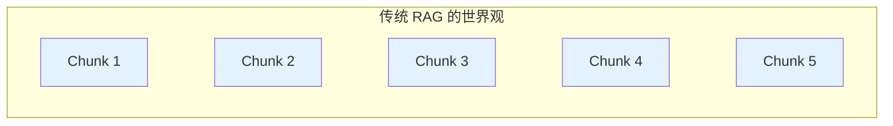
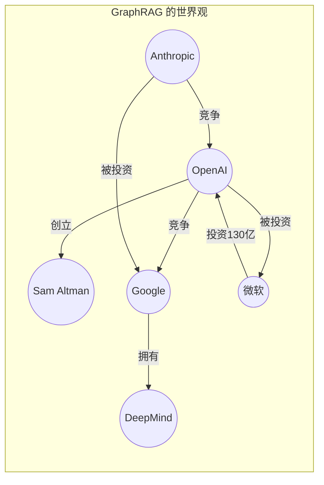
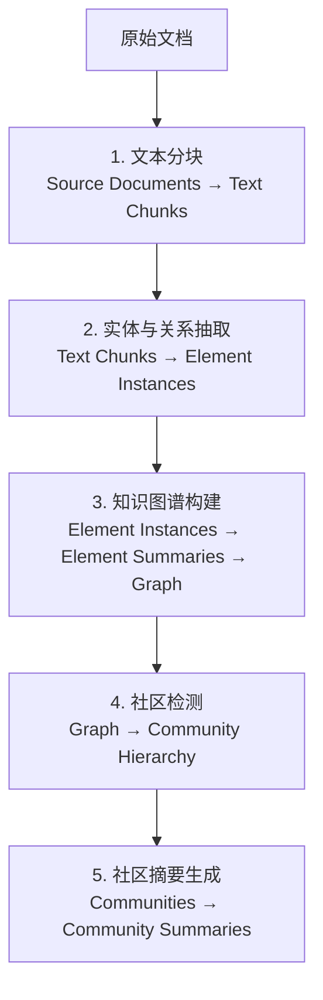
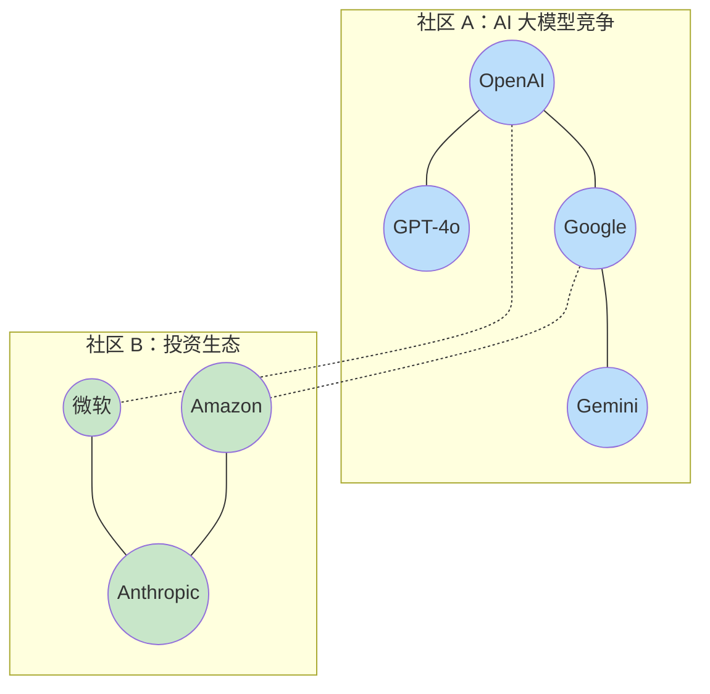
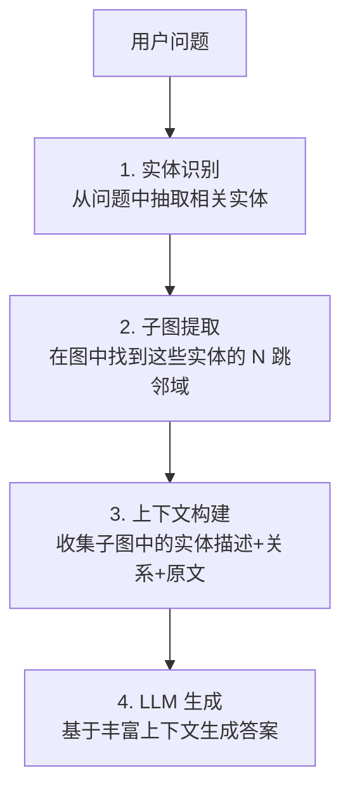
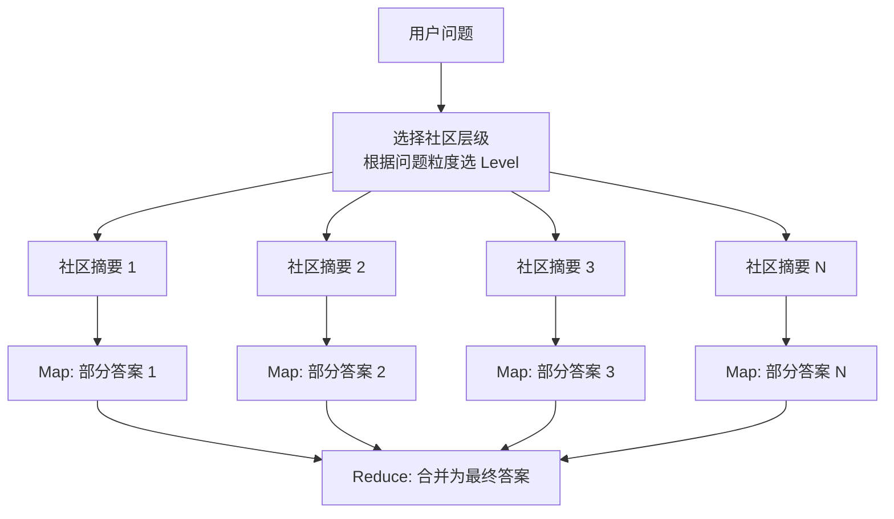
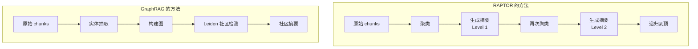
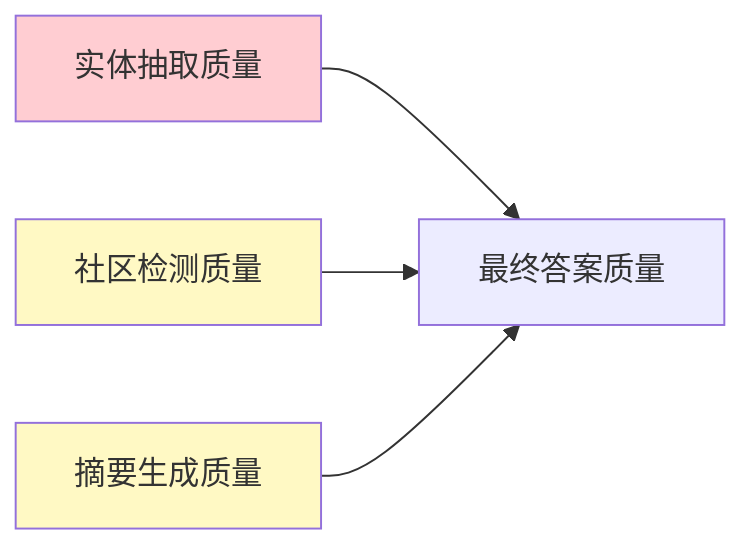
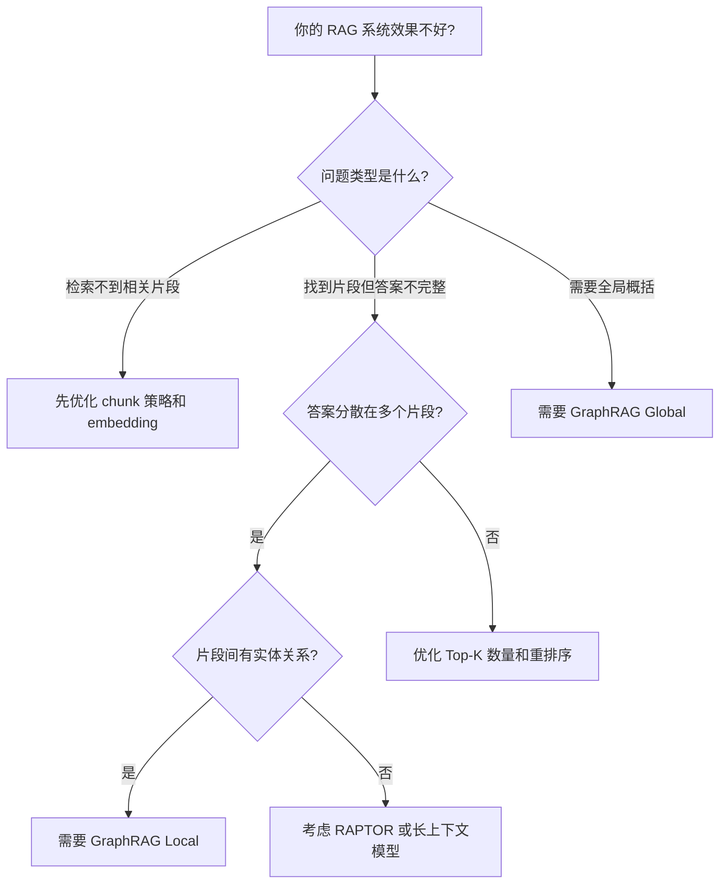
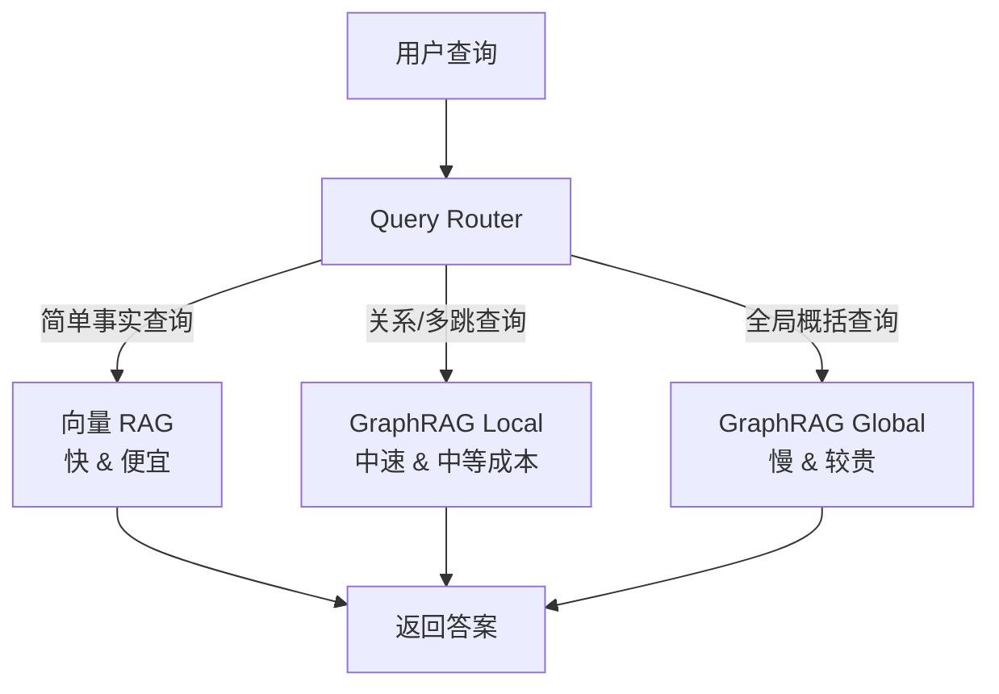

# GraphRAG 原理篇：为什么知识图谱能突破传统 RAG 的极限

如果你已经在生产中使用过 RAG（Retrieval-Augmented Generation），大概率遇到过这类让人沮丧的场景：

> 用户问："这份 200 页的报告中，所有被提及的合作方之间存在什么潜在的利益冲突？"
>
> RAG 系统返回了某一页中关于"合作方"的段落，然后 LLM 基于这个片段生成了一个看似合理但实际上遗漏了 80% 关键信息的回答。

问题不在 LLM 的能力，而在于**检索环节只给了 LLM 冰山一角**。

这篇文章不写代码。我们从第一性原理出发，搞清楚三个问题：

1. 传统 RAG 的检索到底在哪里失败了？
2. GraphRAG 的每一步设计是在解决什么具体问题？
3. 它的理论边界在哪——什么问题它也解决不了？

---

## 一、传统 RAG 的失败模式

在分析 GraphRAG 之前，必须先精确理解传统 RAG 的失败模式。不是"效果不好"这种模糊判断，而是从信息论角度理解它**结构性地无法处理**哪些查询。

### 1.1 传统 RAG 的工作模型

传统 RAG 的检索可以形式化为：

$$
R(q) = \text{Top-K} \left( \text{sim}(E(q), E(c_i)) \right), \quad c_i \in \text{Chunks}
$$

其中 $E$ 是 embedding 函数，$\text{sim}$ 是余弦相似度，$c_i$ 是文档切片。

这个公式揭示了一个根本限制：**检索的单位是独立的文本块，块与块之间没有任何结构性关联**。



每个 chunk 是一座孤岛。即使 Chunk 1 提到了"A公司投资了B公司"，Chunk 4 提到了"B公司收购了C公司"，系统也无法知道从 A 到 C 之间存在一条传递路径。

### 1.2 三类结构性失败

**失败模式一：信息散布（Information Scattering）**

答案需要的信息分散在多个 chunk 中，且这些 chunk 在向量空间中并不相近。

| 用户问题 | "项目 Alpha 面临哪些风险？" |
| :--- | :--- |
| Chunk 12 | "项目 Alpha 的交付时间紧迫，团队人员不足..." |
| Chunk 47 | "供应商 X 最近的财务状况恶化..." |
| Chunk 89 | "监管政策可能在 Q3 发生变化..." |
| Chunk 103 | "竞争对手已经发布了类似产品..." |

这四个 chunk 的 embedding 彼此相距甚远（它们讨论的是不同方面），传统 Top-K 检索很难同时命中所有相关片段。

**失败模式二：全局概括（Global Summarization）**

问题要求对整个文档集做高层次的概括，而非找某个具体事实。

> "这 50 篇论文反映了什么研究趋势？"

没有任何单个 chunk 包含"趋势"的答案——趋势是从所有文档的整体模式中涌现出来的。Top-K 检索在这里完全失效，因为问题本身就不是在"找某个片段"。

**失败模式三：多跳推理（Multi-hop Reasoning）**

答案需要沿着实体关系链条做多步推理。

> "投资了我们竞品的人中，谁同时也是我们股东？"

这要求系统先找到"竞品"有哪些 → 再找这些竞品的"投资方"有谁 → 再与"我方股东"做交集。每一跳的信息可能在不同的 chunk 甚至不同的文档中。

### 1.3 问题的本质

这三类失败的共同根源是：

> **传统 RAG 把文档视为无结构的文本片段集合，丢失了文档中固有的实体关系网络和层次结构。**

而人类阅读文档时，大脑自然会构建出一张"心智地图"——谁和谁有关系、哪些事情属于同一类、什么是局部细节什么是全局模式。GraphRAG 本质上就是在模拟这个过程。

---

## 二、GraphRAG 的核心洞察

微软研究院在 2024 年的论文《From Local to Global: A Graph RAG Approach to Query-Focused Summarization》中提出了 GraphRAG。它的核心洞察可以用一句话概括：

> **在索引阶段，先用 LLM 从文档中提取出知识图谱，再通过图算法发现社区结构并生成层级摘要；在查询阶段，根据问题类型选择基于图结构的局部检索或基于社区摘要的全局检索。**



文档不再是一堆孤立的文本块，而是一张有结构的知识网络。查询时不是找"最相似的片段"，而是在图上导航、推理、聚合。

### 2.1 设计哲学

GraphRAG 的设计遵循两个关键原则：

**原则一：索引时多花精力，查询时更高效准确。**

传统 RAG 的索引很轻量（只做 embedding），但查询质量受限。GraphRAG 反过来——索引阶段投入大量 LLM 调用来构建知识图谱和摘要，换取查询阶段更高质量的结果。

**原则二：同时支持"从局部到全局"的连续查询谱。**

不同问题需要不同的检索粒度。有的问题只需要找到特定实体的邻域信息（局部），有的问题需要对整个文档集做概括（全局）。GraphRAG 的双重查询模式正是为此设计的。

---

## 三、索引管线：五阶段深度剖析

GraphRAG 的索引流程分为五个阶段，每个阶段都有明确的输入、输出和解决的问题。



### 3.1 阶段一：文本分块

**解决的问题**：将长文档切割为 LLM 上下文窗口能容纳的单元。

**与传统 RAG 分块的差异**：

| 维度 | 传统 RAG 分块 | GraphRAG 分块 |
| :--- | :--- | :--- |
| **目标** | 让每个 chunk 成为有意义的检索单元 | 让每个 chunk 包含足够的实体关系上下文 |
| **典型大小** | 256-512 token | 1200-2000 token |
| **为什么** | 小 chunk 的 embedding 更精确 | 大 chunk 让 LLM 能看到更完整的实体关系 |

为什么 GraphRAG 用更大的 chunk？因为下一步是让 LLM 从 chunk 中抽取实体和关系。如果 chunk 太小，一句"微软投资了 OpenAI"可能被拦腰截断，导致实体关系丢失。

:::important
分块大小是 GraphRAG 中一个重要的超参数。过小会丢失跨句的实体关系；过大会增加每次 LLM 调用的成本，且可能引入噪声。微软官方推荐 1200 token 作为起点。
:::

### 3.2 阶段二：实体与关系抽取

**解决的问题**：从非结构化文本中提取结构化的知识（实体、关系、属性）。

这是 GraphRAG 中**成本最高**的步骤——每个 chunk 都需要一次或多次 LLM 调用。

**抽取的内容**：

- **实体（Entity）**：文本中提到的具名对象——人物、组织、地点、事件、概念、产品等
- **关系（Relationship）**：两个实体之间的有向连接——"投资了"、"竞争"、"位于"、"创立了"等
- **属性（Attribute）**：实体的描述性信息——"成立于2015年"、"总部在旧金山"等

**多轮抽取（Gleaning）**：

论文中提出了一个关键技巧——对同一个 chunk 做多轮抽取（glean）。第一轮正常抽取后，把已找到的实体列表反馈给 LLM，让它"检查是否有遗漏"。这能显著提高召回率。

```
第一轮：
  输入 = "从这段文本中抽取所有实体和关系。"
  输出 = {entities: [A, B, C], relationships: [...]}

第二轮（Gleaning）：
  输入 = "上一轮找到了 [A, B, C]。请检查原文中是否有遗漏的实体或关系。"
  输出 = {entities: [D], relationships: [B→D: "合作"]}
```

**抽取质量的关键因素**：

1. **Prompt 设计**：明确实体类型范围、给出领域内的抽取示例、定义关系粒度标准
2. **模型选择**：GPT-4 级别模型抽取质量远优于小模型，但也贵得多
3. **chunk 大小**：决定了 LLM "能看到多少上下文"来判断实体关系

### 3.3 阶段三：知识图谱构建

**解决的问题**：将分散在各 chunk 中的抽取结果合并为一张统一的全局知识图谱。

这个阶段面临两个核心挑战：

**挑战一：实体消解（Entity Resolution）**

同一个实体可能在不同 chunk 中以不同形式出现：

- "OpenAI" / "openai" / "Open AI" / "这家公司"
- "Sam Altman" / "Altman" / "OpenAI CEO"

需要将这些不同的表述合并为同一个节点。GraphRAG 使用 LLM 或规则（字符串相似度 + 上下文判断）来完成实体消解。

**挑战二：关系融合**

同一对实体的关系可能在多个 chunk 中被重复提及，或以不同角度描述：

- Chunk 3："微软向 OpenAI 投资了 10 亿美元"
- Chunk 17："OpenAI 最大的投资方是微软"
- Chunk 42："微软持有 OpenAI 49% 的利润份额"

这三条信息应合并为"微软→OpenAI"这条边上的综合描述，并累加边的权重（表示关系强度/置信度）。

**图的形式化定义**：

$$
G = (V, E, \phi_V, \phi_E)
$$

其中：
- $V$ = 实体节点集合
- $E$ = 关系边集合
- $\phi_V: V \to \{type, description, frequency, source\_chunks\}$ = 节点属性函数
- $\phi_E: E \to \{relations, weight, source\_chunks\}$ = 边属性函数

**实体摘要生成**：

在合并完成后，对每个实体生成一段综合性描述（Entity Summary）。这是因为同一个实体在不同 chunk 中被描述的侧面不同，需要 LLM 将多段描述整合为一段全面的概括。

### 3.4 阶段四：社区检测

**解决的问题**：发现知识图谱中的聚类结构——哪些实体自然地形成一个紧密相关的"话题群组"。

这是 GraphRAG **最具创新性**的步骤——也是它支持全局查询的理论基础。

**什么是图社区？**

在图论中，社区（Community）是一组节点，它们内部的连接密度显著高于它们与外部节点的连接密度。直觉上，一个社区就是"关于同一个话题的一组紧密相关的实体"。



**Leiden 算法**：

GraphRAG 使用 **Leiden 算法**进行社区检测（论文中明确指定）。Leiden 是 Louvain 算法的改进版，主要优势：

1. **保证连通性**：Louvain 可能产生不连通的社区，Leiden 保证每个社区内部连通
2. **质量更高**：通过精细化阶段（refinement phase）提升模块度
3. **确定性**：同样的输入产生同样的结果

算法优化的目标函数是**模块度（Modularity）**：

$$
Q = \frac{1}{2m} \sum_{ij} \left[ A_{ij} - \frac{k_i k_j}{2m} \right] \delta(c_i, c_j)
$$

其中 $A_{ij}$ 是邻接矩阵，$k_i$ 是节点 $i$ 的度，$m$ 是总边数，$c_i$ 是节点 $i$ 所属社区，$\delta$ 是克罗内克 delta 函数。

直觉上：模块度衡量的是"社区内部的实际边数"与"随机图中期望边数"的差距。模块度越高，社区结构越明显。

**层级式社区**：

关键的是，GraphRAG 不只做一级社区检测，而是构建**层级式的社区树**：

```
Level 0（最粗粒度）：3个大社区
  ├── 社区 0.1：AI 行业（60个实体）
  ├── 社区 0.2：云计算市场（45个实体）
  └── 社区 0.3：监管政策（30个实体）

Level 1（中等粒度）：10个社区
  ├── 社区 1.1：大模型竞赛（20个实体）
  ├── 社区 1.2：AI 投资生态（15个实体）
  ├── 社区 1.3：AI 安全研究（12个实体）
  └── ...

Level 2（最细粒度）：25个社区
  ├── 社区 2.1：OpenAI 产品线（8个实体）
  ├── 社区 2.2：Google AI 布局（7个实体）
  └── ...
```

通过调整 Leiden 算法的 **resolution 参数**，可以控制社区的粒度：

- resolution 低 → 社区大而少（适合高层概括）
- resolution 高 → 社区小而多（适合精细查询）

**为什么需要层级？**

因为不同的问题需要不同粒度的答案：

- "AI 行业整体趋势是什么？" → 需要 Level 0 的大社区视角
- "OpenAI 的产品战略是什么？" → 需要 Level 2 的细粒度社区

### 3.5 阶段五：社区摘要生成

**解决的问题**：为每个社区生成人类可读的文本摘要，作为全局查询时的检索单元。

这一步将图结构信息**蒸馏**回自然语言。每个社区摘要包含：

1. **主题概述**：这个社区讨论的核心议题
2. **关键实体**：最重要的几个实体及其角色
3. **核心关系**：实体之间最重要的连接
4. **影响与意义**：这组信息对全局理解的贡献

**摘要生成的输入**：

```
输入给 LLM 的信息：
├── 社区内所有实体（按中心度排序，取 Top-N）
├── 每个实体的描述摘要
├── 社区内所有边（即实体间的关系）
└── 每条边的关系描述
```

**摘要的作用**：

社区摘要是 Global Search 的核心检索单元。当用户提出全局性问题时，系统不是在原始 chunk 中搜索，而是在社区摘要中搜索。每个摘要已经是对一组相关信息的浓缩概括，天然适合回答概括性问题。

:::note
社区摘要的质量直接决定 Global Search 的质量。论文建议限制摘要长度（约 500-2000 token），在信息密度和可读性之间取平衡。
:::

---

## 四、查询阶段：Local Search 与 Global Search

GraphRAG 的查询阶段提供两种互补的模式。它们不是"二选一"的关系，而是覆盖了从"具体"到"抽象"的查询谱。

### 4.1 Local Search：图上的精准导航

**适用问题**：具体的、有明确目标实体的问题。

> "OpenAI 和 Anthropic 之间是什么关系？"
> "哪些公司投资了我们的竞品？"
> "张三的直属上级是谁？"

**工作原理**：



详细步骤：

**Step 1 — 实体识别**：用 LLM 或 NER 模型从用户问题中提取可能存在于图中的实体名称。

**Step 2 — 子图提取**：以识别出的实体为起点，在图中做 BFS（广度优先搜索），提取 N 跳内的所有节点和边。N 通常取 1-3。

- 1 跳：直接关联（"微软投资了谁？"）
- 2 跳：间接关联（"微软投资的公司和谁竞争？"）
- 3 跳：复杂链路（"微软投资的公司的竞品的投资方有谁？"）

**Step 3 — 上下文构建**：将子图中的信息组织为 LLM 可理解的文本上下文：

```
上下文包含：
├── 相关实体及其描述（按与问题的相关度排序）
├── 实体间的关系描述
├── 实体关联的原始文本块（提供细节和原文证据）
└── 可选：实体所在社区的摘要（提供更宽的视野）
```

**Step 4 — 生成**：将问题和构建好的上下文一起送入 LLM 生成最终答案。

**Local Search 的优势**：

- 精确：直接基于结构化的实体关系回答
- 可追溯：答案中的每个断言都可以追溯到图中的具体边
- 支持多跳：通过增加跳数，天然支持多步推理

**Local Search 的局限**：

- 依赖准确的实体识别——如果问题中的实体识别不准，检索方向就错了
- 对于非常抽象的问题（没有明确实体）效果不好

### 4.2 Global Search：社区摘要的 Map-Reduce

**适用问题**：需要全局视角、概括性、趋势性的问题。

> "这个行业面临的共同挑战是什么？"
> "文档集中反映了哪些主要的技术发展方向？"
> "所有项目之间有什么共性和差异？"

这类问题没有明确的"目标实体"，答案需要对大量信息做综合归纳。这正是传统 RAG 完全无能为力的地方。

**工作原理**：



**Map 阶段**：

将用户问题分别发给每个社区摘要，让 LLM 基于该社区的信息生成一个"部分答案"。如果某个社区与问题无关，LLM 会返回"无相关信息"。

**Reduce 阶段**：

将所有非空的部分答案聚合在一起，让 LLM 做最终的综合、去重、组织，生成一个完整连贯的最终答案。

**为什么用 Map-Reduce 而不是直接把所有摘要丢给 LLM？**

因为社区摘要的总量可能超过 LLM 的上下文窗口。假设有 100 个社区、每个摘要 1000 token，总共就是 10 万 token——超过大多数模型的上下文限制。Map-Reduce 让每次 LLM 调用只处理一个社区，然后分阶段聚合。

**社区层级选择**：

- 问题越宏观 → 选择越粗粒度的层级（Level 0 的大社区）
- 问题越具体 → 选择越细粒度的层级（Level 2 的小社区）

论文的实验表明，中间层级（Level 1）在多数场景下效果最佳，因为它在概括力和信息密度之间取得了平衡。

### 4.3 两种模式的理论对比

| 维度 | Local Search | Global Search |
| :--- | :--- | :--- |
| **检索单元** | 图中的实体子图 + 原文 | 社区摘要 |
| **适合问题** | 有明确实体的具体问题 | 无明确实体的概括问题 |
| **信息来源** | 局部精确 | 全局概括 |
| **LLM 调用次数** | 2 次（实体识别 + 生成） | N+1 次（N 个社区 Map + 1 次 Reduce） |
| **延迟** | 低（3-8s） | 高（随社区数线性增长） |
| **答案风格** | 精确、有据可查 | 概括、综合视角 |
| **主要风险** | 实体识别不准导致方向错误 | 社区摘要质量不足导致遗漏 |

### 4.4 DRIFT Search：混合模式

论文后续工作还提出了 **DRIFT（Dynamic Reasoning and Inference with Flexible Traversal）Search**，试图结合两种模式的优点：

1. 先用社区信息定位大致方向（类似 Global 的社区匹配）
2. 再在相关社区内做精确的图遍历（类似 Local 的子图提取）
3. 动态决定是否需要扩展到更多社区

这使得系统能处理"既有具体实体、又需要一定全局视角"的复杂问题。

---

## 五、理论分析：GraphRAG 为什么有效

### 5.1 信息压缩的层级性

GraphRAG 的索引管线本质上是对原始文本做了**多级信息压缩**：

```
原始文本（100万 token）
    ↓ 实体抽取
知识图谱（节点描述 + 边描述 ≈ 10万 token）
    ↓ 社区检测 + 摘要
社区摘要（≈ 2万 token）
    ↓ 层级汇总
顶层摘要（≈ 5千 token）
```

每一级压缩都保留了该粒度下最重要的信息：
- 图保留了"谁和谁有什么关系"
- 社区摘要保留了"哪些实体形成了什么模式"
- 顶层摘要保留了"整体在说什么"

查询时，系统根据问题的粒度需求，选择在合适的压缩层级上检索。

### 5.2 与人类阅读理解的类比

GraphRAG 的索引流程可以类比人类精读一份长文档时大脑做的事情：

| 人类精读行为 | GraphRAG 对应步骤 |
| :--- | :--- |
| 标注关键人物、组织、概念 | 实体抽取 |
| 在旁边画箭头标注关系 | 关系抽取 |
| 发现"这几个点是一类的" | 社区检测 |
| 在每章结尾写小结 | 社区摘要 |
| 在最后写总结 | 顶层摘要 |

当别人问你"这份文档讲了什么"时，你会看自己写的总结（Global）；问你"张三和李四什么关系"时，你会看标注的箭头（Local）。

### 5.3 信息论视角

从信息论角度，传统 RAG 的检索是在**原始信号空间**中做最近邻搜索——高维、噪声大、同义关系复杂。

GraphRAG 的检索是在**结构化表示空间**中做搜索——实体是离散的符号、关系是有类型的边、社区是聚合的语义单元。这种结构化表示大幅降低了搜索空间的复杂度：

$$
\text{传统 RAG 搜索空间} = O(N_{\text{chunks}}) \quad \text{（所有文本块中线性搜索）}
$$

$$
\text{GraphRAG Local 搜索空间} = O(|V_{\text{seed}}| \times d^k) \quad \text{（种子实体的 k 跳邻域）}
$$

$$
\text{GraphRAG Global 搜索空间} = O(N_{\text{communities}}) \quad \text{（社区数，远小于 chunk 数）}
$$

### 5.4 GraphRAG 的代价

高质量不是免费的。GraphRAG 的主要代价：

**索引成本**：每个 chunk 需要 1-2 次 LLM 调用（实体抽取 + gleaning），社区摘要生成也需要 LLM。对于 10 万 token 的文档集，索引可能需要 100+ 次 LLM 调用。

**索引延迟**：索引一份大文档集可能需要几分钟到几十分钟（受 API 并发限制影响）。

**存储**：除了原始文档，还需要存储图结构、社区数据、各级摘要。

**更新成本**：新增文档需要重新做实体抽取、可能打破现有社区结构，需要重新检测社区并生成摘要。

---

## 六、与其他方案的系统对比

### 6.1 GraphRAG vs 传统向量 RAG

已在前文详述。核心区别：向量 RAG 在平坦空间做最近邻；GraphRAG 在结构化图上做导航。

### 6.2 GraphRAG vs RAPTOR

**RAPTOR**（Recursive Abstractive Processing for Tree-Organized Retrieval）也试图解决传统 RAG 的全局性问题，但方法不同：



| 维度 | RAPTOR | GraphRAG |
| :--- | :--- | :--- |
| **组织原则** | 文本块之间的语义相似度聚类 | 实体之间的关系网络 |
| **结构类型** | 树（层级聚类树） | 图 + 社区层级 |
| **多跳推理** | 不支持 | 通过图路径天然支持 |
| **聚类依据** | Embedding 相似度 | 图拓扑结构（边的密度） |
| **精确实体查询** | 不擅长 | Local Search 擅长 |
| **全局概括** | 支持（树顶层） | 支持（社区摘要） |
| **索引成本** | 中（只做 embedding + LLM 摘要） | 高（实体抽取 + 社区摘要） |

**关键区别**：RAPTOR 的聚类基于"文本块之间的语义距离"，GraphRAG 的社区基于"实体之间的关系密度"。后者更符合人类对知识结构的理解——"相关"不等于"相似"（比如"微软"和"OpenAI"的文本 embedding 不一定接近，但它们在知识网络中紧密相连）。

### 6.3 GraphRAG vs 传统知识图谱问答（KGQA）

传统的知识图谱问答（如基于 Freebase/Wikidata 的 QA 系统）也用图结构，但与 GraphRAG 有本质区别：

| 维度 | 传统 KGQA | GraphRAG |
| :--- | :--- | :--- |
| **图的来源** | 预定义的知识库（人工/半自动构建） | LLM 从文档中自动抽取 |
| **图的范围** | 通用知识（百科全书式） | 特定文档集的领域知识 |
| **查询方式** | SPARQL/图查询语言 | 自然语言 + LLM |
| **答案生成** | 精确匹配（三元组查找） | LLM 生成（允许推理和概括） |
| **全局概括** | 不支持 | 社区摘要支持 |
| **部署成本** | 需要专家构建 schema | 只需文档 + LLM API |

GraphRAG 的核心优势是**无需人工定义 schema**——只要有文档和 LLM API，就能自动构建领域知识图谱。这对于快速原型和企业内部知识库场景非常有价值。

### 6.4 GraphRAG vs HippoRAG

**HippoRAG** 受人类海马体记忆机制启发，将长期记忆组织为类似知识图谱的结构。与 GraphRAG 的主要区别：

- HippoRAG 更强调**增量学习**——像人类一样逐步积累记忆
- GraphRAG 更强调**批量索引**——一次性处理整个文档集
- HippoRAG 检索时模拟"联想回忆"——从一个概念扩散到相关概念
- GraphRAG 检索时更结构化——明确的 Local/Global 二分法

---

## 七、GraphRAG 的理论边界

没有万能的方案。理解 GraphRAG 的局限同样重要。

### 7.1 不适用的场景

**场景一：实体关系稀疏的文本**

如果文档主要是纯叙事性散文、个人感悟、小说情节——其中没有明确的"实体"和"关系"——那么实体抽取的产出会很稀薄，图结构没有信息密度。

**场景二：答案在单个段落中**

如果大多数用户问题都能在单个段落中找到完整答案（如 FAQ、产品参数查询），传统 RAG 已经足够好，GraphRAG 的额外成本不值得。

**场景三：高频更新的文档**

每次文档更新都需要重新做实体抽取、重建图、重新检测社区、重新生成摘要。如果文档每天都在大量变动，索引成本将持续走高。

**场景四：预算极度有限**

GraphRAG 的索引成本是传统 RAG 的 10-100 倍（embedding 非常便宜，LLM 抽取相对昂贵）。如果项目预算只够做 embedding 索引，GraphRAG 可能不是当前阶段的选择。

### 7.2 质量瓶颈

GraphRAG 的整体质量受限于**最弱的环节**：



**实体抽取**是最关键的瓶颈。如果抽取遗漏了关键实体、或错误地建立了不存在的关系，后续所有步骤都建立在错误的基础上。目前的 LLM 在实体抽取上仍有约 10-20% 的错误率（取决于文本复杂度和领域）。

### 7.3 开放问题

学术界和工业界仍在探索的问题：

1. **如何高效做增量更新？**——新增文档如何最小化对现有图和社区的影响
2. **最优的 chunk 大小和跳数如何自适应确定？**——而非固定的超参数
3. **如何量化评估 GraphRAG 的效果？**——目前没有统一的 benchmark
4. **如何处理时间维度？**——实体关系是动态变化的（如"CEO"这个关系可能在某个时间点后变了）
5. **多模态 GraphRAG？**——如何从图片、表格、视频中抽取实体关系

---

## 八、设计决策指南

如果你正在考虑在项目中引入 GraphRAG，以下决策框架可以帮助你做出合理选择。

### 8.1 是否需要 GraphRAG？



### 8.2 成本收益分析框架

| 因素 | 倾向传统 RAG | 倾向 GraphRAG |
| :--- | :--- | :--- |
| 文档类型 | 独立 FAQ、产品说明 | 复杂报告、研究论文集 |
| 查询模式 | "X 是什么？" | "X 和 Y 什么关系？整体趋势？" |
| 文档规模 | < 10 页 | > 50 页 |
| 更新频率 | 每天 | 每周/每月 |
| 对准确性要求 | 能接受 80% | 需要 95%+ |
| 预算 | 每月 < $10 | 每月 > $100 |
| 实体关系密度 | 低（纯文字叙述） | 高（大量人物/公司/事件关联） |

### 8.3 混合架构建议

生产环境中最务实的方案往往是**混合架构**——让传统 RAG 处理简单查询（快且便宜），让 GraphRAG 处理复杂查询（慢但强）：



Query Router 可以是：
- 一个轻量的分类模型
- 基于规则的关键词匹配（包含"关系"、"趋势"、"所有"等词时走 GraphRAG）
- LLM 做 few-shot 分类

---

## 总结

GraphRAG 的本质贡献是：**将 RAG 系统从"无结构的文本检索"提升为"有结构的知识推理"**。

它通过五阶段索引管线，将原始文档转化为一个多层级的知识结构：

$$
\text{Raw Text} \xrightarrow{\text{Entity Extraction}} \text{Knowledge Graph} \xrightarrow{\text{Leiden}} \text{Community Hierarchy} \xrightarrow{\text{Summarization}} \text{Multi-level Summaries}
$$

查询时，根据问题类型在不同层级上检索：

- **Local Search**：从实体出发，在图上做精确导航 → 适合具体问题
- **Global Search**：从社区摘要出发，做 Map-Reduce 聚合 → 适合概括问题

**核心 trade-off**：索引成本换取查询质量。对于实体关系密集、需要跨文档推理和全局概括的场景，这个 trade-off 是值得的。

:::tip 系列文章导航
- **原理篇**（本文）：设计动机与核心方法论
- **源码篇**（下一篇）：微软 GraphRAG 开源实现的架构与代码走读
- **图数据库篇**（第三篇）：用 Neo4j/NebulaGraph 存储和查询知识图谱
:::
