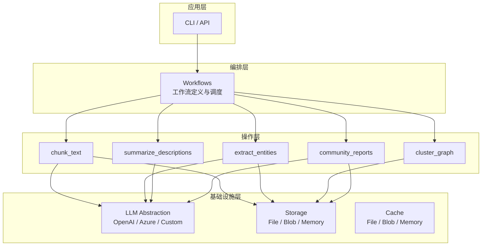
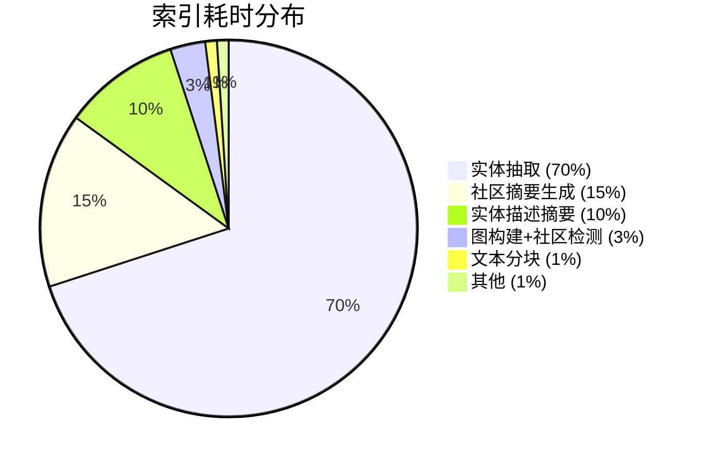

# GraphRAG 源码篇：微软官方实现架构与核心代码解析

在[原理篇](/blog/ai/graphrag-principles)中，我们理解了 GraphRAG 的设计动机和理论框架。但"知道原理"和"理解实现"之间还有一段不小的距离：

- 实体抽取的 Prompt 到底是怎么写的？多轮 Gleaning 具体怎么实现？
- Leiden 社区检测是怎么集成到 Python 管线中的？
- Local Search 的上下文窗口是怎么构建和裁剪的？
- 整个索引管线的数据流是怎样从原始文本一步步变成 Parquet 表的？

这篇文章通过走读微软 [graphrag](https://github.com/microsoft/graphrag) 开源项目的核心代码，回答上述问题。我们不逐行讲解每一个文件，而是**按数据流方向**，跟踪一份文档从进入系统到可被查询的完整旅程。

:::note 版本说明
本文基于 graphrag v1.x（2024-2025 年的稳定版本）。项目仍在快速迭代中，具体 API 可能有变化，但核心架构和设计思路是稳定的。建议对照 [GitHub 仓库](https://github.com/microsoft/graphrag) 阅读。
:::

---

## 一、项目总览

### 1.1 目录结构

```
graphrag/
├── graphrag/
│   ├── index/                    # 索引管线（核心）
│   │   ├── operations/           # 各步骤的具体实现
│   │   │   ├── chunk_text/       # 文本分块
│   │   │   ├── extract_entities/ # 实体抽取
│   │   │   ├── summarize_descriptions/ # 实体/关系描述摘要
│   │   │   ├── cluster_graph/    # 社区检测
│   │   │   ├── community_reports/# 社区报告生成
│   │   │   └── ...
│   │   ├── workflows/            # 工作流编排
│   │   └── run.py                # 索引入口
│   ├── query/                    # 查询管线
│   │   ├── structured_search/    # 结构化搜索
│   │   │   ├── local_search/     # Local Search 实现
│   │   │   └── global_search/    # Global Search 实现
│   │   └── context_builder/      # 上下文构建器
│   ├── config/                   # 配置管理
│   ├── llm/                      # LLM 抽象层
│   ├── storage/                  # 存储抽象
│   └── model/                    # 数据模型定义
├── tests/                        # 测试
└── examples_notebooks/           # 示例 Notebook
```

### 1.2 核心架构分层



GraphRAG 的架构遵循**关注点分离**原则：

- **操作层**：每个步骤是独立的、可测试的函数，只关注自己的逻辑
- **编排层**：负责将操作按正确顺序串联，管理数据在步骤间的传递
- **基础设施层**：提供可替换的底层服务（LLM、存储、缓存）

### 1.3 数据模型

GraphRAG 定义了一组核心数据模型，贯穿整个管线：

```python
# graphrag/model/entity.py
@dataclass
class Entity:
    id: str
    title: str                   # 实体名称
    type: str | None             # 实体类型（PERSON, ORG...）
    description: str | None      # 描述文本
    name_embedding: list[float] | None  # 名称的 embedding
    description_embedding: list[float] | None  # 描述的 embedding
    graph_embedding: list[float] | None  # 图结构 embedding
    community_ids: list[str]     # 所属社区 ID
    text_unit_ids: list[str]     # 关联的文本块 ID
    rank: int | None             # 重要性排名

# graphrag/model/relationship.py
@dataclass
class Relationship:
    id: str
    source: str                  # 源实体名
    target: str                  # 目标实体名
    description: str | None      # 关系描述
    weight: float                # 关系权重
    text_unit_ids: list[str]     # 来源文本块

# graphrag/model/community.py
@dataclass
class Community:
    id: str
    title: str
    level: int                   # 层级（0=最粗，越大越细）
    entity_ids: list[str]        # 包含的实体
    relationship_ids: list[str]  # 包含的关系
    summary: str | None          # 社区摘要报告

# graphrag/model/text_unit.py
@dataclass
class TextUnit:
    id: str
    text: str                    # 文本内容
    entity_ids: list[str]        # 包含的实体
    relationship_ids: list[str]  # 包含的关系
    document_ids: list[str]      # 所属文档
    n_tokens: int                # token 数
```

---

## 二、配置系统

### 2.1 配置文件结构

GraphRAG 使用 `settings.yaml` 作为主配置文件，包含所有管线参数：

```yaml
# settings.yaml - 完整配置示例

# LLM 配置
llm:
  api_key: ${GRAPHRAG_API_KEY}     # 支持环境变量引用
  type: openai_chat                 # openai_chat | azure_openai_chat
  model: gpt-4o
  max_tokens: 4000
  temperature: 0
  top_p: 1
  request_timeout: 180
  api_base: null                    # 自定义 API 地址
  api_version: null                 # Azure API 版本
  concurrent_requests: 25           # 并发请求数
  tokens_per_minute: 100000         # 速率限制
  requests_per_minute: 1000

# Embedding 模型配置
embeddings:
  llm:
    api_key: ${GRAPHRAG_API_KEY}
    type: openai_embedding
    model: text-embedding-3-small

# 文本分块配置
chunks:
  size: 1200                        # 每个 chunk 的 token 数
  overlap: 100                      # 重叠 token 数
  encoding_model: cl100k_base       # tokenizer

# 实体抽取配置
entity_extraction:
  prompt: null                      # 自定义 prompt 文件路径
  entity_types:                     # 要抽取的实体类型
    - organization
    - person
    - location
    - event
    - concept
  max_gleanings: 1                  # Gleaning 轮数
  strategy:
    type: graph_intelligence        # 使用 LLM 抽取

# 实体/关系描述摘要
summarize_descriptions:
  prompt: null
  max_length: 500

# 社区检测配置
cluster_graph:
  strategy:
    type: leiden                     # 使用 Leiden 算法
    max_cluster_size: 10            # 最大社区大小限制
    seed: 42

# 社区报告生成
community_reports:
  prompt: null
  max_length: 2000
  max_input_length: 8000

# 存储配置
storage:
  type: file                        # file | blob | cosmosdb
  base_dir: output

# 缓存配置（避免重复 LLM 调用）
cache:
  type: file                        # file | blob | memory | none
  base_dir: cache
```

### 2.2 配置解析代码

```python
# graphrag/config/models.py（简化版）

from pydantic import BaseModel, Field

class LLMConfig(BaseModel):
    """LLM 配置模型"""
    api_key: str
    type: str = "openai_chat"
    model: str = "gpt-4o"
    max_tokens: int = 4000
    temperature: float = 0
    concurrent_requests: int = 25
    tokens_per_minute: int = 100_000
    requests_per_minute: int = 1000
    request_timeout: float = 180

class ChunkingConfig(BaseModel):
    """分块配置"""
    size: int = 1200
    overlap: int = 100
    encoding_model: str = "cl100k_base"

class EntityExtractionConfig(BaseModel):
    """实体抽取配置"""
    entity_types: list[str] = ["organization", "person", "location", "event"]
    max_gleanings: int = 1
    prompt: str | None = None  # 自定义 prompt 路径

class GraphRagConfig(BaseModel):
    """顶层配置"""
    llm: LLMConfig
    embeddings: LLMConfig
    chunks: ChunkingConfig
    entity_extraction: EntityExtractionConfig
    # ... 其他子配置
```

:::tip
配置支持环境变量插值（`${VAR_NAME}`），方便在不同环境使用不同的 API Key 和参数。这由配置加载时的 `resolve_env_variables` 函数处理。
:::

---

## 三、索引管线：逐步骤代码走读

### 3.1 入口：索引启动

```python
# graphrag/index/run.py（简化逻辑）

async def run_pipeline(config: GraphRagConfig, documents: list[str]):
    """索引管线主入口"""

    # 1. 初始化基础设施
    llm = create_llm(config.llm)
    storage = create_storage(config.storage)
    cache = create_cache(config.cache)

    # 2. 按阶段执行工作流
    # 阶段 1: 文本处理
    text_units = await chunk_text(documents, config.chunks)

    # 阶段 2: 图构建
    entities, relationships = await extract_graph(text_units, llm, config.entity_extraction)
    entities = await summarize_descriptions(entities, llm, config.summarize_descriptions)

    # 阶段 3: 社区检测
    communities = await cluster_graph(entities, relationships, config.cluster_graph)

    # 阶段 4: 社区报告
    community_reports = await generate_community_reports(
        communities, entities, relationships, llm, config.community_reports
    )

    # 5. 持久化所有产出
    await storage.write("entities.parquet", entities.to_parquet())
    await storage.write("relationships.parquet", relationships.to_parquet())
    await storage.write("communities.parquet", communities.to_parquet())
    await storage.write("community_reports.parquet", community_reports.to_parquet())
    await storage.write("text_units.parquet", text_units.to_parquet())
```

实际实现中使用了 DataShaper 工作流引擎来编排步骤，支持步骤级缓存和断点恢复。但核心数据流就是上面这个顺序。

### 3.2 文本分块

```python
# graphrag/index/operations/chunk_text/chunk_text.py

import tiktoken

def chunk_text(
    documents: list[str],
    chunk_size: int = 1200,
    chunk_overlap: int = 100,
    encoding_model: str = "cl100k_base",
) -> list[TextUnit]:
    """
    将文档切分为 TextUnit。

    策略：基于 token 的滑动窗口分块。
    使用 tiktoken 精确计算 token 数，而非简单的字符数分割。
    """
    encoder = tiktoken.get_encoding(encoding_model)
    text_units = []
    unit_id = 0

    for doc_idx, doc_text in enumerate(documents):
        # 编码为 token
        tokens = encoder.encode(doc_text)

        # 滑动窗口切分
        start = 0
        while start < len(tokens):
            end = min(start + chunk_size, len(tokens))
            chunk_tokens = tokens[start:end]

            # 解码回文本
            chunk_text = encoder.decode(chunk_tokens)

            text_units.append(TextUnit(
                id=f"text_unit_{unit_id}",
                text=chunk_text,
                n_tokens=len(chunk_tokens),
                document_ids=[f"doc_{doc_idx}"],
                entity_ids=[],
                relationship_ids=[],
            ))

            unit_id += 1
            start += chunk_size - chunk_overlap  # 滑动步长

    return text_units
```

:::important 为什么用 tiktoken 而非简单分词
GraphRAG 用 tiktoken（与 OpenAI 模型相同的 tokenizer）来确保 chunk 大小精确对应 LLM 的 token 计算。如果用"按空格分词"来估算 token 数，可能导致送入 LLM 的实际 token 超过预期，引发上下文溢出。
:::

### 3.3 实体与关系抽取

这是代码量最大、也最关键的步骤。

**3.3.1 抽取 Prompt**

GraphRAG 内置了一个精心设计的抽取 Prompt，位于 `graphrag/index/operations/extract_entities/prompts.py`：

```python
# graphrag/index/operations/extract_entities/prompts.py（核心结构）

GRAPH_EXTRACTION_PROMPT = """
-Goal-
Given a text document that is potentially relevant to this activity and a list of entity types,
identify all entities of those types from the text and all relationships among the identified entities.

-Steps-
1. Identify all entities. For each identified entity, extract the following information:
- entity_name: Name of the entity, capitalized
- entity_type: One of the following types: [{entity_types}]
- entity_description: Comprehensive description of the entity's attributes and activities

Format each entity as ("entity"{tuple_delimiter}<entity_name>{tuple_delimiter}<entity_type>{tuple_delimiter}<entity_description>)

2. From the entities identified in step 1, identify all pairs of (source_entity, target_entity)
that are *clearly related* to each other.
For each pair of related entities, extract the following information:
- source_entity: name of the source entity
- target_entity: name of the target entity
- relationship_description: explanation of why these entities are related
- relationship_strength: a numeric score indicating strength of the relationship (1-10)

Format each relationship as ("relationship"{tuple_delimiter}<source_entity>{tuple_delimiter}<target_entity>{tuple_delimiter}<relationship_description>{tuple_delimiter}<relationship_strength>)

3. Return output in English as a single list of all the entities and relationships identified in steps 1 and 2.
Use **{record_delimiter}** as the list delimiter.

4. When finished, output {completion_delimiter}

######################
-Examples-
######################
{examples}

######################
-Real Data-
######################
Entity_types: [{entity_types}]
Text: {input_text}
######################
Output:
"""
```

**关键设计决策**：

1. **使用自定义分隔符**（`tuple_delimiter`、`record_delimiter`、`completion_delimiter`）而非 JSON——因为 LLM 生成结构化文本比生成合法 JSON 更稳定，错误率更低
2. **先抽实体再抽关系**——两步法比一步到位的准确率更高
3. **关系强度用 1-10 数字**——比"强/中/弱"这类模糊描述更精确
4. **提供领域内 Examples**——Few-shot 显著提升抽取质量

**3.3.2 抽取执行逻辑**

```python
# graphrag/index/operations/extract_entities/extract_entities.py（简化版）

from graphrag.llm import LLM

async def extract_entities(
    text_units: list[TextUnit],
    llm: LLM,
    config: EntityExtractionConfig,
) -> tuple[list[Entity], list[Relationship]]:
    """从所有 text_unit 中抽取实体和关系"""

    all_entities = []
    all_relationships = []

    # 构建 prompt
    prompt_template = load_prompt(config.prompt) or GRAPH_EXTRACTION_PROMPT
    entity_types_str = ", ".join(config.entity_types)

    for text_unit in text_units:
        # 第一轮抽取
        prompt = prompt_template.format(
            entity_types=entity_types_str,
            input_text=text_unit.text,
            tuple_delimiter="<|>",
            record_delimiter="##",
            completion_delimiter="<|COMPLETE|>",
            examples=EXAMPLES_TEXT,
        )

        response = await llm.generate(prompt)
        entities, relationships = parse_extraction_response(response)

        # Gleaning：多轮抽取以提高召回
        for gleaning_round in range(config.max_gleanings):
            existing_entities = [e.title for e in entities]
            gleaning_prompt = GLEANING_PROMPT.format(
                input_text=text_unit.text,
                existing_entities=", ".join(existing_entities),
            )
            gleaning_response = await llm.generate(gleaning_prompt)
            new_entities, new_rels = parse_extraction_response(gleaning_response)
            entities.extend(new_entities)
            relationships.extend(new_rels)

        # 记录来源
        for e in entities:
            e.text_unit_ids.append(text_unit.id)
        for r in relationships:
            r.text_unit_ids.append(text_unit.id)

        all_entities.extend(entities)
        all_relationships.extend(relationships)

    return all_entities, all_relationships
```

**3.3.3 响应解析**

```python
# graphrag/index/operations/extract_entities/extract_entities.py

def parse_extraction_response(
    response: str,
    tuple_delimiter: str = "<|>",
    record_delimiter: str = "##",
) -> tuple[list[Entity], list[Relationship]]:
    """解析 LLM 返回的抽取结果"""
    entities = []
    relationships = []

    # 按记录分隔符拆分
    records = response.split(record_delimiter)

    for record in records:
        record = record.strip()
        if not record:
            continue

        # 去除括号
        record = record.strip("()")

        # 按 tuple 分隔符拆分字段
        fields = record.split(tuple_delimiter)

        if len(fields) < 2:
            continue

        record_type = fields[0].strip().strip('"').lower()

        if record_type == "entity" and len(fields) >= 4:
            entities.append(Entity(
                id=generate_id(),
                title=fields[1].strip().strip('"'),
                type=fields[2].strip().strip('"'),
                description=fields[3].strip().strip('"'),
                text_unit_ids=[],
                community_ids=[],
                rank=None,
                name_embedding=None,
                description_embedding=None,
                graph_embedding=None,
            ))

        elif record_type == "relationship" and len(fields) >= 5:
            weight = 5  # 默认权重
            try:
                weight = float(fields[4].strip().strip('"'))
            except (ValueError, IndexError):
                pass

            relationships.append(Relationship(
                id=generate_id(),
                source=fields[1].strip().strip('"'),
                target=fields[2].strip().strip('"'),
                description=fields[3].strip().strip('"'),
                weight=weight,
                text_unit_ids=[],
            ))

    return entities, relationships
```

:::warning 解析的鲁棒性
LLM 生成的结构化文本不可能 100% 遵循格式。实际代码中包含大量的容错处理：
- 字段数不够时使用默认值
- 分隔符被 LLM 漏掉时尝试正则匹配
- 完全无法解析时跳过并记录警告（不中断整个管线）
:::

**3.3.4 Gleaning Prompt**

```python
GLEANING_PROMPT = """
MANY entities and relationships were missed in the last extraction.
Remember, you are looking for entities of types: [{entity_types}]

The previously extracted entities are:
{existing_entities}

Re-examine the text below and identify any ADDITIONAL entities and relationships
that were missed. ONLY return NEW ones not already listed above.

Text: {input_text}

Output:
"""
```

Gleaning 的策略很简单但有效：告诉 LLM "你上次遗漏了很多"（即使可能没有），让它带着"查漏补缺"的心态再看一遍文本。实验表明这能提升 10-20% 的实体召回率。

### 3.4 实体描述摘要

同一个实体可能在多个 text_unit 中被提及，每次的描述都不完全相同。这一步将多段描述合并为一段综合摘要。

```python
# graphrag/index/operations/summarize_descriptions/summarize_descriptions.py

SUMMARIZE_PROMPT = """
You are a helpful assistant responsible for generating a comprehensive summary
of the data provided below.
Given one or two entities, and a list of descriptions,
all related to the same entity or group of entities.
Please concatenate all of these into a single, comprehensive description.
Make sure to include information collected from all the descriptions.
If the provided descriptions are contradictory, please resolve the contradictions
and provide a single, coherent summary.
Make sure it is written in third person, and include the entity names
so we have full context.

#######
-Data-
Entities: {entity_name}
Description List: {description_list}
#######
Output:
"""

async def summarize_descriptions(
    entities: list[Entity],
    llm: LLM,
    config: SummarizeConfig,
) -> list[Entity]:
    """为每个实体生成综合描述"""

    # 按实体名称分组（合并同名实体）
    entity_groups: dict[str, list[Entity]] = {}
    for entity in entities:
        key = entity.title.lower().strip()
        entity_groups.setdefault(key, []).append(entity)

    summarized_entities = []

    for name, group in entity_groups.items():
        # 收集所有描述
        descriptions = [e.description for e in group if e.description]

        if len(descriptions) <= 1:
            # 只有一段描述，无需摘要
            merged = group[0]
            merged.text_unit_ids = list(set(
                tid for e in group for tid in e.text_unit_ids
            ))
            summarized_entities.append(merged)
            continue

        # 多段描述 → LLM 生成综合摘要
        prompt = SUMMARIZE_PROMPT.format(
            entity_name=name,
            description_list="\n".join(f"- {d}" for d in descriptions)
        )
        summary = await llm.generate(prompt)

        # 合并实体（保留所有来源信息）
        merged_entity = Entity(
            id=generate_id(),
            title=group[0].title,
            type=most_common_type(group),  # 取出现最多的类型
            description=summary,
            text_unit_ids=list(set(
                tid for e in group for tid in e.text_unit_ids
            )),
            community_ids=[],
            rank=len(group),  # 出现次数作为初始 rank
            name_embedding=None,
            description_embedding=None,
            graph_embedding=None,
        )
        summarized_entities.append(merged_entity)

    return summarized_entities
```

**这一步同时完成了实体消解**——通过对实体名称做标准化（小写 + strip），将不同 text_unit 中同名的实体合并为一个节点。

:::note
更复杂的实体消解（如"OpenAI"和"那家公司"指向同一实体）需要额外的共指消解（Coreference Resolution）步骤。当前版本的 GraphRAG 主要依赖名称匹配，对于代词指代的情况处理有限。
:::

### 3.5 图构建

实体和关系抽取完成后，需要构建 NetworkX 图对象，用于后续的社区检测。

```python
# graphrag/index/operations/cluster_graph/build_graph.py

import networkx as nx

def build_graph(
    entities: list[Entity],
    relationships: list[Relationship],
) -> nx.Graph:
    """从实体和关系列表构建 NetworkX 图"""
    graph = nx.Graph()

    # 添加节点
    for entity in entities:
        graph.add_node(
            entity.title,
            id=entity.id,
            type=entity.type,
            description=entity.description,
            rank=entity.rank or 0,
            text_unit_ids=entity.text_unit_ids,
        )

    # 添加边
    for rel in relationships:
        source = rel.source
        target = rel.target

        # 确保源和目标节点存在
        if not graph.has_node(source):
            graph.add_node(source, id=generate_id(), type="UNKNOWN", description="")
        if not graph.has_node(target):
            graph.add_node(target, id=generate_id(), type="UNKNOWN", description="")

        # 如果边已存在，累加权重
        if graph.has_edge(source, target):
            existing = graph[source][target]
            existing["weight"] = existing.get("weight", 0) + rel.weight
            existing["description"] = existing.get("description", "") + "\n" + (rel.description or "")
        else:
            graph.add_edge(
                source, target,
                id=rel.id,
                weight=rel.weight,
                description=rel.description,
                text_unit_ids=rel.text_unit_ids,
            )

    return graph
```

### 3.6 Leiden 社区检测

这一步是 GraphRAG 的核心算法环节。代码使用 `graspologic` 库（微软开发的图统计库）中的 Leiden 算法实现。

```python
# graphrag/index/operations/cluster_graph/cluster_graph.py

from graspologic.partition import hierarchical_leiden
import networkx as nx

def cluster_graph(
    graph: nx.Graph,
    max_cluster_size: int = 10,
    seed: int = 42,
) -> dict[int, dict[str, list[str]]]:
    """
    使用层级 Leiden 算法进行社区检测。

    Returns:
        {level: {community_id: [node_names]}}
    """

    # 确保图非空
    if graph.number_of_nodes() == 0:
        return {}

    # 使用 graspologic 的层级 Leiden
    # hierarchical_leiden 会在不同 resolution 下运行 Leiden，
    # 生成从粗到细的多级社区结构
    community_mapping = hierarchical_leiden(
        graph,
        max_cluster_size=max_cluster_size,
        random_seed=seed,
    )

    # community_mapping 的结果是：
    # {node_name: {level_0: community_id, level_1: community_id, ...}}

    # 转换为按层级组织的结构
    levels = {}
    for node, level_map in community_mapping.items():
        for level, community_id in level_map.items():
            if level not in levels:
                levels[level] = {}
            if community_id not in levels[level]:
                levels[level][community_id] = []
            levels[level][community_id].append(node)

    return levels
```

**hierarchical_leiden 的内部逻辑**：

1. 第一次运行 Leiden（低 resolution）→ 得到粗粒度社区（Level 0）
2. 对于超过 `max_cluster_size` 的大社区，递归地用更高 resolution 再次运行 Leiden
3. 重复直到所有社区都不超过大小限制

```python
# graspologic/partition/_leiden.py（简化的核心逻辑）

def hierarchical_leiden(graph, max_cluster_size, random_seed):
    """层级化 Leiden 社区检测"""

    # 第一层：整体做一次 Leiden
    initial_communities = leiden(graph, resolution=1.0, seed=random_seed)

    result = {}
    for node in graph.nodes():
        result[node] = {0: initial_communities[node]}

    # 递归细分大社区
    level = 1
    for community_id, members in group_by_community(initial_communities).items():
        if len(members) > max_cluster_size:
            subgraph = graph.subgraph(members)
            # 用更高的 resolution 继续细分
            sub_communities = leiden(subgraph, resolution=1.5, seed=random_seed)
            for node, sub_id in sub_communities.items():
                result[node][level] = f"{community_id}_{sub_id}"

    return result
```

:::important Leiden vs Louvain
GraphRAG 选择 Leiden 而非 Louvain 的原因：
1. **连通性保证**：Louvain 可能产生断裂的社区（内部不连通），Leiden 保证每个社区是连通的
2. **质量上界**：Leiden 的 refinement 阶段确保最终结果的模块度不低于 Louvain
3. **确定性**：设置 seed 后结果完全可复现
:::

### 3.7 社区报告生成

对每个社区生成一份结构化的报告，作为 Global Search 的检索单元。

```python
# graphrag/index/operations/community_reports/community_reports.py

COMMUNITY_REPORT_PROMPT = """
You are an AI assistant that helps a human analyst to perform general information
discovery. This involves identifying and assessing relevant information associated
with certain entities (e.g., organizations and individuals) within a network.

# Goal
Write a comprehensive assessment report of a community taking on the role of a
{persona}. The content of this report includes an overview of the community's
key entities as well as their relationships and associated claims.

# Report Structure
The report should include the following sections:
- TITLE: community's name that best represents its key entities - title should
  be short but specific.
- SUMMARY: An executive summary of the community's overall structure, how its
  entities are related to each other, and significant information associated
  with its entities.
- DETAILED FINDINGS: A list of 5-10 key insights about the community. Each
  insight should have a short summary followed by multiple paragraphs of
  explanatory text grounded according to the grounding rules below.
- IMPACT SEVERITY RATING: A float score between 0-10 that represents the
  severity of IMPACT made by entities within the community.

# Grounding Rules
- All information should be grounded in the input data.
- Do not include information that is not supported by the input data.

# Input Data
{input_data}

Output:
"""

async def generate_community_reports(
    communities: dict[int, dict[str, list[str]]],
    entities: list[Entity],
    relationships: list[Relationship],
    llm: LLM,
    config: CommunityReportConfig,
) -> list[CommunityReport]:
    """为每个社区生成报告"""

    reports = []
    entity_map = {e.title: e for e in entities}
    rel_map = build_relationship_map(relationships)

    for level, level_communities in communities.items():
        for community_id, node_names in level_communities.items():

            # 构建输入数据：该社区内的实体和关系信息
            input_data = format_community_data(
                node_names, entity_map, rel_map, config.max_input_length
            )

            # 调用 LLM 生成报告
            prompt = COMMUNITY_REPORT_PROMPT.format(
                persona="domain expert",
                input_data=input_data
            )
            report_text = await llm.generate(prompt)

            reports.append(CommunityReport(
                id=f"report_{community_id}",
                community_id=community_id,
                level=level,
                title=extract_title(report_text),
                summary=extract_summary(report_text),
                full_content=report_text,
                rank=extract_impact_rating(report_text),
                entity_ids=[entity_map[n].id for n in node_names if n in entity_map],
            ))

    return reports


def format_community_data(
    node_names: list[str],
    entity_map: dict,
    rel_map: dict,
    max_length: int,
) -> str:
    """格式化社区数据为 LLM 输入"""
    parts = []

    # 按重要性排序实体
    sorted_nodes = sorted(
        node_names,
        key=lambda n: entity_map.get(n, Entity(rank=0)).rank or 0,
        reverse=True
    )

    # 添加实体信息
    parts.append("## Entities\n")
    for node in sorted_nodes:
        if node in entity_map:
            e = entity_map[node]
            parts.append(f"### {e.title} ({e.type})")
            parts.append(f"{e.description}\n")

    # 添加关系信息
    parts.append("## Relationships\n")
    for node in sorted_nodes:
        if node in rel_map:
            for rel in rel_map[node]:
                if rel.target in node_names or rel.source in node_names:
                    parts.append(f"- {rel.source} -> {rel.target}: {rel.description} (weight: {rel.weight})")

    # 截断到 max_length
    full_text = "\n".join(parts)
    # 使用 tiktoken 精确截断
    return truncate_to_tokens(full_text, max_length)
```

---

## 四、查询管线：Local Search 代码解析

### 4.1 架构概览

Local Search 的代码分为三层：

```
query/structured_search/local_search/
├── search.py              # 搜索主逻辑
├── mixed_context.py       # 上下文构建器
└── system_prompt.py       # 系统 Prompt
```

### 4.2 上下文构建器

这是 Local Search 最核心的代码——决定了送入 LLM 的上下文包含哪些信息、如何排列、如何在 token 限制内做取舍。

```python
# graphrag/query/structured_search/local_search/mixed_context.py（简化版）

class LocalSearchMixedContext:
    """Local Search 的混合上下文构建器"""

    def __init__(
        self,
        entities: list[Entity],
        relationships: list[Relationship],
        text_units: list[TextUnit],
        community_reports: list[CommunityReport],
        entity_text_embeddings: dict | None = None,
        token_encoder: tiktoken.Encoding | None = None,
    ):
        self.entities = {e.title.lower(): e for e in entities}
        self.relationships = relationships
        self.text_units = {t.id: t for t in text_units}
        self.community_reports = community_reports
        self.token_encoder = token_encoder or tiktoken.get_encoding("cl100k_base")

    async def build_context(
        self,
        query: str,
        conversation_history: list | None = None,
        max_tokens: int = 8000,
        # 各部分的 token 预算分配
        community_report_weight: float = 0.2,
        entity_weight: float = 0.3,
        relationship_weight: float = 0.2,
        text_unit_weight: float = 0.3,
    ) -> str:
        """
        为 Local Search 构建上下文。

        token 预算分配策略：
        - 20% 给社区报告（提供宏观背景）
        - 30% 给实体描述（核心信息）
        - 20% 给关系描述（连接信息）
        - 30% 给原始文本块（细节和证据）
        """

        # Step 1: 识别种子实体（与查询最相关的实体）
        seed_entities = await self._find_seed_entities(query)

        # Step 2: 扩展到邻域
        expanded_entities, expanded_rels = self._expand_neighborhood(
            seed_entities, hops=2
        )

        # Step 3: 按 token 预算构建各部分
        budget = {
            "community": int(max_tokens * community_report_weight),
            "entity": int(max_tokens * entity_weight),
            "relationship": int(max_tokens * relationship_weight),
            "text_unit": int(max_tokens * text_unit_weight),
        }

        context_parts = []

        # 3a: 社区报告（提供背景）
        community_context = self._build_community_context(
            expanded_entities, budget["community"]
        )
        if community_context:
            context_parts.append(f"## Community Context\n{community_context}")

        # 3b: 实体描述
        entity_context = self._build_entity_context(
            expanded_entities, budget["entity"]
        )
        context_parts.append(f"## Entity Descriptions\n{entity_context}")

        # 3c: 关系描述
        rel_context = self._build_relationship_context(
            expanded_rels, budget["relationship"]
        )
        context_parts.append(f"## Relationships\n{rel_context}")

        # 3d: 原始文本块
        text_context = self._build_text_unit_context(
            expanded_entities, budget["text_unit"]
        )
        if text_context:
            context_parts.append(f"## Source Texts\n{text_context}")

        return "\n\n".join(context_parts)

    async def _find_seed_entities(self, query: str, top_k: int = 10) -> list[Entity]:
        """找到与查询最相关的种子实体"""
        # 方式1: 基于 embedding 相似度
        if self.entity_text_embeddings:
            query_embedding = await embed(query)
            scored = []
            for name, entity in self.entities.items():
                if entity.description_embedding:
                    sim = cosine_similarity(query_embedding, entity.description_embedding)
                    scored.append((entity, sim))
            scored.sort(key=lambda x: x[1], reverse=True)
            return [e for e, _ in scored[:top_k]]

        # 方式2: 基于关键词匹配（fallback）
        query_lower = query.lower()
        matches = []
        for name, entity in self.entities.items():
            if name in query_lower or any(
                word in name for word in query_lower.split()
            ):
                matches.append(entity)
        return matches[:top_k]

    def _expand_neighborhood(
        self,
        seed_entities: list[Entity],
        hops: int = 2,
    ) -> tuple[list[Entity], list[Relationship]]:
        """从种子实体出发，扩展 N 跳邻域"""
        visited_entities = set(e.title.lower() for e in seed_entities)
        result_entities = list(seed_entities)
        result_rels = []

        frontier = set(e.title.lower() for e in seed_entities)

        for _ in range(hops):
            next_frontier = set()
            for rel in self.relationships:
                src = rel.source.lower()
                tgt = rel.target.lower()

                if src in frontier and tgt not in visited_entities:
                    next_frontier.add(tgt)
                    visited_entities.add(tgt)
                    if tgt in self.entities:
                        result_entities.append(self.entities[tgt])
                    result_rels.append(rel)

                elif tgt in frontier and src not in visited_entities:
                    next_frontier.add(src)
                    visited_entities.add(src)
                    if src in self.entities:
                        result_entities.append(self.entities[src])
                    result_rels.append(rel)

                elif src in frontier and tgt in frontier:
                    result_rels.append(rel)

            frontier = next_frontier

        return result_entities, result_rels

    def _build_entity_context(self, entities: list[Entity], budget: int) -> str:
        """构建实体上下文，按重要性排序并截断到 budget"""
        # 按 rank 排序（rank 越高越重要）
        sorted_entities = sorted(entities, key=lambda e: e.rank or 0, reverse=True)

        lines = []
        used_tokens = 0
        for entity in sorted_entities:
            line = f"**{entity.title}** ({entity.type}): {entity.description}"
            line_tokens = len(self.token_encoder.encode(line))
            if used_tokens + line_tokens > budget:
                break
            lines.append(line)
            used_tokens += line_tokens

        return "\n".join(lines)
```

:::tip Token 预算管理
Local Search 的核心难题是**如何在有限的上下文窗口中塞入最有价值的信息**。代码使用了"按比例分配预算"的策略——先给四类信息（社区背景/实体/关系/原文）各分配一个 token 预算，然后在每类内部按重要性排序填充，直到预算用尽。

这比简单的"全部拼在一起截断"更合理，因为它确保了每类信息都有一定的表示，不会被某一类特别长的内容挤掉。
:::

### 4.3 搜索主逻辑

```python
# graphrag/query/structured_search/local_search/search.py

class LocalSearch:
    """Local Search 执行器"""

    def __init__(
        self,
        llm: LLM,
        context_builder: LocalSearchMixedContext,
        system_prompt: str | None = None,
        response_type: str = "multiple paragraphs",
    ):
        self.llm = llm
        self.context_builder = context_builder
        self.system_prompt = system_prompt or LOCAL_SEARCH_SYSTEM_PROMPT
        self.response_type = response_type

    async def asearch(
        self,
        query: str,
        conversation_history: list | None = None,
    ) -> SearchResult:
        """执行 Local Search"""

        # 1. 构建上下文
        context = await self.context_builder.build_context(
            query=query,
            conversation_history=conversation_history,
        )

        # 2. 构建完整 prompt
        system_message = self.system_prompt.format(
            context_data=context,
            response_type=self.response_type,
        )

        # 3. 调用 LLM 生成最终答案
        messages = [
            {"role": "system", "content": system_message},
            {"role": "user", "content": query},
        ]

        response = await self.llm.generate_chat(messages)

        return SearchResult(
            response=response,
            context_data=context,
            context_text=context,
        )
```

**Local Search 的系统 Prompt**：

```python
LOCAL_SEARCH_SYSTEM_PROMPT = """
---Role---
You are a helpful assistant responding to questions about data in the tables provided.

---Goal---
Generate a response of the target length and format that responds to the user's
question, summarizing all relevant information in the input data tables.
If you don't know the answer, just say so. Do not make anything up.

Points supported by data should list their data references as follows:
"This is an example sentence supported by multiple data references [Data: <dataset name> (record ids); <dataset name> (record ids)]."

Do not list more than 5 record ids in a single reference.

---Target response length and format---
{response_type}

---Data tables---
{context_data}
"""
```

---

## 五、查询管线：Global Search 代码解析

### 5.1 Map-Reduce 实现

Global Search 的代码实现了论文中描述的 Map-Reduce 模式：

```python
# graphrag/query/structured_search/global_search/search.py

class GlobalSearch:
    """Global Search 执行器"""

    def __init__(
        self,
        llm: LLM,
        context_builder: GlobalCommunityContext,
        map_system_prompt: str | None = None,
        reduce_system_prompt: str | None = None,
        max_data_tokens: int = 8000,
        map_llm_params: dict | None = None,
        reduce_llm_params: dict | None = None,
    ):
        self.llm = llm
        self.context_builder = context_builder
        self.map_prompt = map_system_prompt or MAP_SYSTEM_PROMPT
        self.reduce_prompt = reduce_system_prompt or REDUCE_SYSTEM_PROMPT
        self.max_data_tokens = max_data_tokens

    async def asearch(self, query: str) -> SearchResult:
        """执行 Global Search"""

        # 1. 获取社区报告，分批
        community_report_chunks = self.context_builder.build_context(
            max_tokens=self.max_data_tokens
        )

        # 2. Map 阶段：对每批社区报告生成部分答案
        map_responses = []
        for chunk in community_report_chunks:
            map_result = await self._map_response(query, chunk)
            if map_result and map_result.strip():
                map_responses.append(map_result)

        # 3. Reduce 阶段：合并所有部分答案
        final_response = await self._reduce_response(query, map_responses)

        return SearchResult(
            response=final_response,
            context_data=community_report_chunks,
        )

    async def _map_response(self, query: str, context_chunk: str) -> str:
        """Map：基于一批社区报告生成部分答案"""
        messages = [
            {"role": "system", "content": self.map_prompt.format(context_data=context_chunk)},
            {"role": "user", "content": query},
        ]
        response = await self.llm.generate_chat(messages)
        return response

    async def _reduce_response(self, query: str, map_responses: list[str]) -> str:
        """Reduce：合并所有 Map 阶段的部分答案"""
        # 过滤无效响应
        valid_responses = [r for r in map_responses if self._is_valid_response(r)]

        if not valid_responses:
            return "I am sorry but I am unable to answer this question given the provided data."

        # 将所有部分答案拼接
        combined = "\n\n---\n\n".join([
            f"--- Analyst Report {i+1} ---\n{response}"
            for i, response in enumerate(valid_responses)
        ])

        messages = [
            {"role": "system", "content": self.reduce_prompt.format(report_data=combined)},
            {"role": "user", "content": query},
        ]

        response = await self.llm.generate_chat(messages)
        return response

    def _is_valid_response(self, response: str) -> bool:
        """判断 Map 响应是否有效（非空且非拒绝回答）"""
        if not response or not response.strip():
            return False
        # 检查是否是"无法回答"类的响应
        refusal_phrases = ["i am sorry", "i don't know", "no relevant", "cannot answer"]
        return not any(phrase in response.lower() for phrase in refusal_phrases)
```

### 5.2 Map Prompt

```python
MAP_SYSTEM_PROMPT = """
---Role---
You are a helpful assistant responding to questions about a dataset by synthesizing
information from multiple analyst reports.

---Goal---
Generate a response consisting of a list of key points that responds to the user's
question, summarizing all relevant information in the input data tables.

You should use the data provided in the Data Tables below as the primary context
for generating the response.
If you don't know the answer or if the input data tables do not contain sufficient
information to provide an answer, just say so. Do not make anything up.

Each key point in the response should have the following element:
- Description: A comprehensive description of the point.
- Importance Score: An integer score between 0-100 that indicates how important
  the point is in answering the user's question. An 'I don't know' type of
  response should have a score of 0.

The response should be JSON formatted as follows:
{{
    "points": [
        {{"description": "Description of point 1 [Data: Reports (report ids)]", "score": score_value}},
        {{"description": "Description of point 2 [Data: Reports (report ids)]", "score": score_value}}
    ]
}}

---Data Tables---
{context_data}
"""
```

:::important Map 阶段输出结构化 JSON
注意 Map Prompt 要求 LLM 输出带有 importance score 的结构化 JSON。这不仅是为了格式规范，更是为了 Reduce 阶段能够**按重要性排序**来决定在有限 token 中保留哪些观点。低分观点会被优先裁剪。
:::

### 5.3 Reduce Prompt

```python
REDUCE_SYSTEM_PROMPT = """
---Role---
You are a helpful assistant responding to questions about a dataset by synthesizing
information from multiple analyst reports that have been provided below.

---Goal---
Generate a response of the target length and format that responds to the user's
question, summarizing all relevant information in the reports below.

Do not include information where the supporting evidence for it is not provided.

---Target response length and format---
Multiple paragraphs

---Analyst Reports---
{report_data}

Add sections and commentary to the response as appropriate for the length and
format. Style the response in markdown.
"""
```

### 5.4 社区上下文构建器

```python
# graphrag/query/structured_search/global_search/community_context.py

class GlobalCommunityContext:
    """Global Search 的上下文构建器"""

    def __init__(
        self,
        community_reports: list[CommunityReport],
        token_encoder: tiktoken.Encoding | None = None,
    ):
        self.reports = community_reports
        self.token_encoder = token_encoder or tiktoken.get_encoding("cl100k_base")

    def build_context(
        self,
        max_tokens: int = 8000,
        level: int | None = None,
    ) -> list[str]:
        """
        构建 Global Search 的上下文。

        将社区报告按 token 预算切分为多个 chunk，
        每个 chunk 作为一次 Map 调用的输入。
        """
        # 筛选层级
        reports = self.reports
        if level is not None:
            reports = [r for r in reports if r.level == level]

        # 按重要性排序（rank/impact score 高的优先）
        reports = sorted(reports, key=lambda r: r.rank or 0, reverse=True)

        # 将报告分批，每批不超过 max_tokens
        chunks = []
        current_chunk_parts = []
        current_tokens = 0

        for report in reports:
            report_text = self._format_report(report)
            report_tokens = len(self.token_encoder.encode(report_text))

            if current_tokens + report_tokens > max_tokens:
                # 当前 chunk 已满，开始新 chunk
                if current_chunk_parts:
                    chunks.append("\n\n".join(current_chunk_parts))
                current_chunk_parts = [report_text]
                current_tokens = report_tokens
            else:
                current_chunk_parts.append(report_text)
                current_tokens += report_tokens

        # 最后一个 chunk
        if current_chunk_parts:
            chunks.append("\n\n".join(current_chunk_parts))

        return chunks

    def _format_report(self, report: CommunityReport) -> str:
        """格式化单个社区报告"""
        return f"""### {report.title}
{report.summary}

{report.full_content}
"""
```

---

## 六、LLM 抽象层

GraphRAG 支持多种 LLM 后端，通过统一的抽象层实现切换。

### 6.1 接口定义

```python
# graphrag/llm/base.py

from abc import ABC, abstractmethod

class BaseLLM(ABC):
    """LLM 抽象基类"""

    @abstractmethod
    async def generate(
        self,
        prompt: str,
        max_tokens: int | None = None,
        temperature: float | None = None,
        **kwargs,
    ) -> str:
        """文本生成"""
        ...

    @abstractmethod
    async def generate_chat(
        self,
        messages: list[dict[str, str]],
        max_tokens: int | None = None,
        temperature: float | None = None,
        **kwargs,
    ) -> str:
        """对话生成"""
        ...
```

### 6.2 OpenAI 实现

```python
# graphrag/llm/openai/openai_chat_llm.py（简化版）

import openai
from tenacity import retry, stop_after_attempt, wait_exponential

class OpenAIChatLLM(BaseLLM):
    """OpenAI Chat 模型实现"""

    def __init__(self, config: LLMConfig):
        self.client = openai.AsyncOpenAI(
            api_key=config.api_key,
            base_url=config.api_base,
            timeout=config.request_timeout,
        )
        self.model = config.model
        self.max_tokens = config.max_tokens
        self.temperature = config.temperature

        # 速率限制器
        self.rate_limiter = RateLimiter(
            tokens_per_minute=config.tokens_per_minute,
            requests_per_minute=config.requests_per_minute,
        )

        # 并发限制
        self.semaphore = asyncio.Semaphore(config.concurrent_requests)

    @retry(
        stop=stop_after_attempt(3),
        wait=wait_exponential(multiplier=1, min=4, max=60),
        retry=retry_if_rate_limited,
    )
    async def generate_chat(self, messages: list[dict], **kwargs) -> str:
        """调用 OpenAI Chat API"""
        async with self.semaphore:  # 并发控制
            await self.rate_limiter.acquire()  # 速率控制

            response = await self.client.chat.completions.create(
                model=self.model,
                messages=messages,
                max_tokens=kwargs.get("max_tokens", self.max_tokens),
                temperature=kwargs.get("temperature", self.temperature),
            )

            return response.choices[0].message.content or ""

    async def generate(self, prompt: str, **kwargs) -> str:
        """将文本 prompt 转为 chat 格式调用"""
        messages = [{"role": "user", "content": prompt}]
        return await self.generate_chat(messages, **kwargs)
```

### 6.3 速率限制与重试

```python
# graphrag/llm/rate_limiter.py

import asyncio
import time

class RateLimiter:
    """令牌桶速率限制器"""

    def __init__(self, tokens_per_minute: int, requests_per_minute: int):
        self.tpm = tokens_per_minute
        self.rpm = requests_per_minute
        self._request_times: list[float] = []
        self._lock = asyncio.Lock()

    async def acquire(self):
        """获取一个请求许可"""
        async with self._lock:
            now = time.time()
            # 清理超过 1 分钟前的记录
            self._request_times = [t for t in self._request_times if now - t < 60]

            if len(self._request_times) >= self.rpm:
                # 已达速率限制，等待
                wait_time = 60 - (now - self._request_times[0])
                await asyncio.sleep(max(0, wait_time))

            self._request_times.append(time.time())
```

:::tip 速率限制是生产必需品
GraphRAG 索引阶段会产生大量 LLM 调用（每个 chunk 1-2 次 + 社区摘要）。不做速率限制会很快触发 OpenAI 的 429 错误。代码中内置了：
1. **令牌桶**：控制 RPM（每分钟请求数）和 TPM（每分钟 token 数）
2. **指数退避重试**：遇到 429/500/503 时自动等待并重试
3. **并发信号量**：限制同时在飞的请求数
:::

---

## 七、缓存系统

索引过程中，如果中途失败需要重跑，不希望重新调用已经成功的 LLM 请求。GraphRAG 的缓存系统解决这个问题。

```python
# graphrag/cache/file_pipeline_cache.py

import json
import hashlib
from pathlib import Path

class FilePipelineCache:
    """基于文件系统的缓存"""

    def __init__(self, base_dir: str):
        self.base_dir = Path(base_dir)
        self.base_dir.mkdir(parents=True, exist_ok=True)

    def _make_key(self, prompt: str, params: dict) -> str:
        """生成缓存键：对 prompt + 参数做哈希"""
        content = json.dumps({"prompt": prompt, "params": params}, sort_keys=True)
        return hashlib.sha256(content.encode()).hexdigest()

    async def get(self, prompt: str, params: dict) -> str | None:
        """读取缓存"""
        key = self._make_key(prompt, params)
        cache_file = self.base_dir / f"{key}.json"

        if cache_file.exists():
            data = json.loads(cache_file.read_text(encoding="utf-8"))
            return data.get("response")
        return None

    async def set(self, prompt: str, params: dict, response: str):
        """写入缓存"""
        key = self._make_key(prompt, params)
        cache_file = self.base_dir / f"{key}.json"

        data = {"prompt": prompt, "params": params, "response": response}
        cache_file.write_text(json.dumps(data, ensure_ascii=False), encoding="utf-8")
```

**缓存包裹 LLM 调用**：

```python
# graphrag/llm/cached_llm.py

class CachedLLM(BaseLLM):
    """在 LLM 外层包一层缓存"""

    def __init__(self, inner_llm: BaseLLM, cache: FilePipelineCache):
        self.inner = inner_llm
        self.cache = cache

    async def generate(self, prompt: str, **kwargs) -> str:
        # 先查缓存
        cached = await self.cache.get(prompt, kwargs)
        if cached is not None:
            return cached

        # 未命中，调用真实 LLM
        response = await self.inner.generate(prompt, **kwargs)

        # 写入缓存
        await self.cache.set(prompt, kwargs, response)
        return response
```

---

## 八、数据持久化：Parquet 格式

索引完成后，所有产出以 **Parquet** 格式存储。为什么选 Parquet 而非 JSON/SQLite？

| 格式 | 优势 | 劣势 |
| :--- | :--- | :--- |
| JSON | 人类可读 | 大数据量时 I/O 慢、内存大 |
| SQLite | 支持 SQL 查询 | 单机限制、不适合大文件 |
| **Parquet** | 列式存储、压缩率高、支持 pandas 直接加载 | 不可直接人眼阅读 |

GraphRAG 的典型产出大小：

```
output/
├── entities.parquet            # 5-50 MB（取决于文档规模）
├── relationships.parquet       # 2-20 MB
├── text_units.parquet          # 10-100 MB（包含原始文本）
├── communities.parquet         # 1-5 MB
├── community_reports.parquet   # 2-10 MB
└── documents.parquet           # < 1 MB（元数据）
```

**加载和查询**：

```python
import pandas as pd

# 直接用 pandas 加载
entities_df = pd.read_parquet("output/entities.parquet")
relationships_df = pd.read_parquet("output/relationships.parquet")

# 查看实体
print(entities_df[["title", "type", "description"]].head(10))

# 查看某个实体的所有关系
entity_name = "openai"
related = relationships_df[
    (relationships_df["source"].str.lower() == entity_name) |
    (relationships_df["target"].str.lower() == entity_name)
]
print(related[["source", "target", "description", "weight"]])

# 查看社区报告
reports_df = pd.read_parquet("output/community_reports.parquet")
print(reports_df[["title", "level", "rank"]].sort_values("rank", ascending=False).head())
```

---

## 九、扩展与自定义

### 9.1 自定义实体抽取 Prompt

当你的领域有特殊的实体类型时，需要自定义抽取 Prompt：

```yaml
# settings.yaml
entity_extraction:
  prompt: prompts/my_extraction_prompt.txt
  entity_types:
    - drug
    - disease
    - symptom
    - treatment
    - gene
```

```text
# prompts/my_extraction_prompt.txt

-Goal-
Given a text from a medical research paper, identify all entities and relationships.

-Entity Types-
- DRUG: Any pharmaceutical compound or medication
- DISEASE: Any medical condition or illness
- SYMPTOM: Observable signs of disease
- TREATMENT: Any therapeutic intervention
- GENE: Any gene or genetic marker

-Steps-
1. Identify all entities of the types above.
Format: ("entity"{tuple_delimiter}<name>{tuple_delimiter}<type>{tuple_delimiter}<description>)

2. Identify relationships between entities.
Format: ("relationship"{tuple_delimiter}<source>{tuple_delimiter}<target>{tuple_delimiter}<description>{tuple_delimiter}<strength>)

-Important Notes for Medical Domain-
- Use standardized medical terminology (e.g., "hypertension" not "high blood pressure")
- For drugs, include both brand names and generic names as separate entities
- Relationship strength: 9-10 for clinically proven, 5-7 for suggested, 1-4 for theoretical

######################
Text: {input_text}
######################
Output:
```

### 9.2 自定义 LLM 后端

如果你使用本地模型或非 OpenAI 兼容的 API：

```python
# my_custom_llm.py

from graphrag.llm.base import BaseLLM

class MyLocalLLM(BaseLLM):
    """自定义本地 LLM 实现"""

    def __init__(self, model_path: str):
        from transformers import AutoModelForCausalLM, AutoTokenizer
        self.tokenizer = AutoTokenizer.from_pretrained(model_path)
        self.model = AutoModelForCausalLM.from_pretrained(model_path)

    async def generate(self, prompt: str, **kwargs) -> str:
        inputs = self.tokenizer(prompt, return_tensors="pt")
        outputs = self.model.generate(
            **inputs,
            max_new_tokens=kwargs.get("max_tokens", 2000),
            temperature=kwargs.get("temperature", 0),
        )
        return self.tokenizer.decode(outputs[0], skip_special_tokens=True)

    async def generate_chat(self, messages: list[dict], **kwargs) -> str:
        # 将 chat 格式转为文本 prompt
        prompt = "\n".join([f"{m['role']}: {m['content']}" for m in messages])
        prompt += "\nassistant:"
        return await self.generate(prompt, **kwargs)
```

### 9.3 自定义存储后端

```python
# 例：使用 S3 作为存储后端
from graphrag.storage.base import BaseStorage

class S3Storage(BaseStorage):
    """基于 AWS S3 的存储实现"""

    def __init__(self, bucket: str, prefix: str = "graphrag/"):
        import boto3
        self.s3 = boto3.client("s3")
        self.bucket = bucket
        self.prefix = prefix

    async def write(self, key: str, data: bytes):
        self.s3.put_object(
            Bucket=self.bucket,
            Key=f"{self.prefix}{key}",
            Body=data,
        )

    async def read(self, key: str) -> bytes | None:
        try:
            obj = self.s3.get_object(Bucket=self.bucket, Key=f"{self.prefix}{key}")
            return obj["Body"].read()
        except self.s3.exceptions.NoSuchKey:
            return None

    async def list_keys(self, prefix: str = "") -> list[str]:
        response = self.s3.list_objects_v2(
            Bucket=self.bucket,
            Prefix=f"{self.prefix}{prefix}",
        )
        return [obj["Key"] for obj in response.get("Contents", [])]
```

---

## 十、关键设计模式总结

### 10.1 管线设计模式

GraphRAG 源码中体现了几个重要的软件设计模式：

**1. 策略模式（Strategy Pattern）**

每个步骤的具体算法都是可替换的：

```python
# 社区检测可以用不同算法
cluster_graph:
  strategy:
    type: leiden    # 可替换为 louvain, hierarchical_leiden 等
```

**2. 装饰器模式（Decorator Pattern）**

LLM 调用被层层装饰：

```
用户代码
  → CachedLLM（加缓存）
    → RateLimitedLLM（加速率限制）
      → RetryLLM（加重试）
        → OpenAIChatLLM（实际调用）
```

**3. 管道模式（Pipeline Pattern）**

整个索引是一个 DAG（有向无环图）形式的管道，步骤之间通过 DataFrame 传递数据：

```
chunk_text → extract_entities → summarize → cluster → community_reports
```

### 10.2 并发模型

```python
# 索引阶段的并发策略：

# 1. 文本块级并发：多个 chunk 的实体抽取可以并行
tasks = [
    extract_entities(chunk, llm)
    for chunk in text_units
]
results = await asyncio.gather(*tasks, return_exceptions=True)

# 2. 但要受速率限制约束（semaphore + rate limiter）
# 3. 社区摘要生成也可以并行（社区之间互不依赖）
```

### 10.3 容错设计

```python
# 核心原则：单个 chunk 的失败不应影响整体管线

async def safe_extract(chunk: TextUnit, llm: LLM) -> dict:
    """安全的抽取包装"""
    try:
        return await extract_entities(chunk, llm)
    except Exception as e:
        logger.warning(f"Extraction failed for chunk {chunk.id}: {e}")
        return {"entities": [], "relationships": []}  # 返回空结果而非崩溃

# 索引管线中所有 LLM 调用都有类似的容错包装
```

---

## 十一、性能剖面

### 11.1 时间分布

对于一个典型的 10 万 token 文档集（约 80 个 chunk），索引耗时的大致分布：



LLM 调用占据了绝对主导——优化索引速度的核心是**减少 LLM 调用次数**和**提高并发度**。

### 11.2 优化手段

```python
# 1. 提高并发数（如果 API 配额允许）
llm:
  concurrent_requests: 50  # 默认 25，可以提高

# 2. 减少 Gleaning 轮数（牺牲一点召回率换速度）
entity_extraction:
  max_gleanings: 0  # 0 表示不做 Gleaning

# 3. 使用更便宜的模型做抽取
llm:
  model: gpt-4o-mini  # 抽取用小模型
# 社区摘要可以单独配置用大模型

# 4. 缩小 chunk 大小（减少每次 LLM 输入的 token 数）
chunks:
  size: 800  # 默认 1200

# 5. 启用缓存避免重复调用
cache:
  type: file
```

### 11.3 内存占用

```python
# 内存峰值主要出现在：
# 1. 图构建时（所有实体和关系都在内存中）
# 2. 社区检测时（NetworkX 图 + Leiden 算法内部状态）

# 对于 10 万节点的图，内存约 2-4 GB
# 对于 100 万节点的图，内存可能需要 20+ GB

# 优化：对超大图可以分批构建，或使用 graph-tool 替代 NetworkX
```

---

## 十二、从源码中学到的设计智慧

读完 GraphRAG 源码后，有几个值得借鉴的设计决策：

### 12.1 "宁可多调 LLM，不可丢失信息"

整个系统的设计哲学是**索引时多花钱，查询时高质量**。体现在：

- 实体描述做专门的摘要聚合（而非简单拼接）
- 社区报告是完整的结构化文档（而非简单的关键词列表）
- Gleaning 多轮抽取（宁可多调一次 LLM，也不愿漏掉实体）

### 12.2 "自定义分隔符优于 JSON"

实体抽取的输出格式用自定义分隔符而非 JSON。这看起来"不优雅"，但实践中：

- LLM 生成合法 JSON 的失败率约 5-10%
- LLM 生成带分隔符的文本的失败率约 1-2%
- 解析带分隔符的文本比解析 JSON 更容易做容错（局部失败不影响整体）

### 12.3 "Token 预算制度"

上下文构建不是"把所有信息拼在一起"，而是给每类信息分配 token 预算，按重要性填充。这确保了：

- 不会因为某一类信息特别多而挤掉其他类型
- 最重要的信息总是被保留
- 上下文利用率最大化

### 12.4 "缓存是核心基础设施"

缓存不是可选的优化，而是管线正确运行的保障：

- 索引失败后重跑，已完成的 LLM 调用不会重复
- 开发调试时修改下游步骤，不需要重新调用上游的 LLM
- 节省大量 API 成本

---

## 总结

GraphRAG 的源码虽然涉及多个模块，但核心数据流是清晰的：

$$
\text{Documents} \xrightarrow{\text{chunk}} \text{TextUnits} \xrightarrow{\text{LLM}} \text{Entities + Rels} \xrightarrow{\text{merge}} \text{Graph} \xrightarrow{\text{Leiden}} \text{Communities} \xrightarrow{\text{LLM}} \text{Reports}
$$

查询时：
- **Local**：query → 实体匹配 → 子图扩展 → 多源上下文构建 → LLM 生成
- **Global**：query → 社区报告分批 → Map（逐批生成观点）→ Reduce（合并为答案）

关键源码文件速查：

| 功能 | 核心文件 |
| :--- | :--- |
| 实体抽取 Prompt | `index/operations/extract_entities/prompts.py` |
| 抽取执行逻辑 | `index/operations/extract_entities/extract_entities.py` |
| 图构建 | `index/operations/cluster_graph/build_graph.py` |
| Leiden 社区检测 | `index/operations/cluster_graph/cluster_graph.py` |
| 社区报告生成 | `index/operations/community_reports/community_reports.py` |
| Local Search 上下文 | `query/structured_search/local_search/mixed_context.py` |
| Global Search Map-Reduce | `query/structured_search/global_search/search.py` |
| LLM 抽象层 | `llm/openai/openai_chat_llm.py` |
| 缓存 | `cache/file_pipeline_cache.py` |
| 配置模型 | `config/models.py` |

:::tip 系列文章导航
- [原理篇](/blog/ai/graphrag-principles) —— 设计动机与核心方法论
- **源码篇**（本文） —— 微软 GraphRAG 开源实现的架构与代码走读
- **图数据库篇**（下一篇） —— 用 Neo4j/NebulaGraph 存储和查询知识图谱
:::
