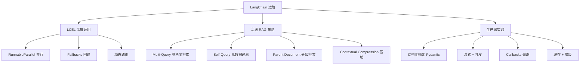

# LangChain 进阶：LCEL 深度运用、高级 RAG 模式与生产级实践

在[基础篇](/blog/ai/langchain-guide)中，我们学会了 LangChain 的核心模块——Prompt、LCEL、Memory、Retriever、Agent。你已经能构建基本的对话机器人和 RAG 系统。

但当你尝试将这些应用推到生产环境时，会遇到新一层的问题：

- 简单的 `retriever | prompt | llm` 链路检索质量不够——想同时用多种检索策略怎么办？
- LLM 有时返回格式不对——怎么强制输出结构化的 JSON/Pydantic 对象？
- 想让链路的某一步在失败时自动切换备用模型——LCEL 怎么配置 Fallback？
- 生产中需要流式返回 + 并发处理 + 请求追踪——LangChain 的基建怎么用？
- 想自己封装一个检索器或模型适配器——自定义组件的接口规范是什么？

这篇文章就是解决这些问题的。

---

## 一、LCEL 深度运用

LCEL（LangChain Expression Language）不仅仅是用 `|` 连接组件。它是一个完整的**函数式组合框架**，提供了并行、分支、回退、动态路由等高级能力。

### 1.1 Runnable 协议

LCEL 的所有组件都实现了 `Runnable` 接口，它定义了统一的调用方式：

```python
from langchain_core.runnables import Runnable

# 每个 Runnable 都支持这些方法：
# .invoke(input)       - 同步调用
# .ainvoke(input)      - 异步调用
# .stream(input)       - 流式输出
# .astream(input)      - 异步流式
# .batch([inputs])     - 批量处理
# .abatch([inputs])    - 异步批量

# 可以组合：
# chain = runnable_a | runnable_b    管道组合
# chain.with_fallbacks([backup])     添加回退
# chain.with_retry(max_attempts=3)   自动重试
# chain.with_config(tags=["prod"])   附加配置
```

### 1.2 RunnableParallel：并行执行

当链路中的多个步骤互不依赖时，可以并行执行以减少总延迟：

```python
from langchain_core.runnables import RunnableParallel, RunnablePassthrough
from langchain_openai import ChatOpenAI
from langchain_core.prompts import ChatPromptTemplate

model = ChatOpenAI(model="gpt-4o")

# 并行执行多个任务：同时分析情感、提取关键词、生成摘要
analysis_chain = RunnableParallel(
    sentiment=ChatPromptTemplate.from_template(
        "分析以下文本的情感倾向（正面/负面/中性）：\n{text}"
    ) | model,
    keywords=ChatPromptTemplate.from_template(
        "提取以下文本的 5 个关键词，以逗号分隔：\n{text}"
    ) | model,
    summary=ChatPromptTemplate.from_template(
        "用一句话概括以下文本：\n{text}"
    ) | model,
)

# 输入一段文本，三个分析并行执行
result = analysis_chain.invoke({"text": "OpenAI 发布了 GPT-4o，在多模态能力上取得重大突破..."})
print(result["sentiment"].content)   # 正面
print(result["keywords"].content)    # OpenAI, GPT-4o, 多模态, 突破, 发布
print(result["summary"].content)     # OpenAI发布多模态AI模型GPT-4o
```

**RunnableParallel 在 RAG 中的应用**——同时检索和处理查询：

```python
from langchain_core.runnables import RunnableParallel, RunnablePassthrough

# 经典的 RAG 模式：retriever 和 question 并行准备
rag_chain = (
    RunnableParallel(
        context=retriever | format_docs,   # 检索文档
        question=RunnablePassthrough(),     # 原始问题直接透传
    )
    | prompt
    | model
    | StrOutputParser()
)
```

### 1.3 RunnablePassthrough：透传与注入

`RunnablePassthrough` 用于在并行分支中保持原始输入不变：

```python
from langchain_core.runnables import RunnablePassthrough

# 基本透传
chain = RunnablePassthrough() | model
# 输入什么，model 就收到什么

# assign 模式：在原始输入基础上追加新字段
chain = RunnablePassthrough.assign(
    word_count=lambda x: len(x["text"].split()),
    uppercase=lambda x: x["text"].upper(),
)

result = chain.invoke({"text": "hello world"})
# {"text": "hello world", "word_count": 2, "uppercase": "HELLO WORLD"}
```

**实用场景——在 RAG 链中同时传递 query 和 context**：

```python
from langchain_core.output_parsers import StrOutputParser

rag_chain = (
    # 输入: {"question": "..."}
    RunnablePassthrough.assign(
        # 在输入字典中追加 context 字段
        context=lambda x: retriever.invoke(x["question"])
    )
    # 现在输入变为: {"question": "...", "context": [Document, ...]}
    | prompt    # prompt 模板使用 {question} 和 {context}
    | model
    | StrOutputParser()
)
```

### 1.4 RunnableLambda：自定义函数作为 Runnable

将任意 Python 函数包装为 Runnable，使其可以参与 LCEL 管道：

```python
from langchain_core.runnables import RunnableLambda

# 同步函数
def clean_text(input_dict: dict) -> dict:
    """预处理：清洗文本"""
    text = input_dict["text"]
    cleaned = text.strip().replace("\n\n", "\n")
    return {**input_dict, "text": cleaned}

# 异步函数
async def async_enrich(input_dict: dict) -> dict:
    """异步增强：调用外部 API 获取更多信息"""
    import aiohttp
    async with aiohttp.ClientSession() as session:
        # 模拟外部调用
        return {**input_dict, "metadata": {"enriched": True}}

# 包装为 Runnable
clean_step = RunnableLambda(clean_text)
enrich_step = RunnableLambda(async_enrich)

# 参与管道
chain = clean_step | enrich_step | prompt | model
```

**带错误处理的 Lambda**：

```python
def safe_parse_json(text: str) -> dict:
    """安全的 JSON 解析，失败时返回默认值"""
    import json
    try:
        return json.loads(text)
    except json.JSONDecodeError:
        return {"error": "JSON 解析失败", "raw": text}

chain = model | StrOutputParser() | RunnableLambda(safe_parse_json)
```

### 1.5 RunnableBranch：条件路由

根据输入动态选择执行哪条链路：

```python
from langchain_core.runnables import RunnableBranch

# 根据问题类型选择不同的处理链
routing_chain = RunnableBranch(
    # (条件函数, 对应的链路) 的元组列表
    (
        lambda x: "代码" in x["question"] or "编程" in x["question"],
        code_prompt | model  # 走代码专家链路
    ),
    (
        lambda x: "数学" in x["question"] or "计算" in x["question"],
        math_prompt | model  # 走数学专家链路
    ),
    # 默认链路（没有条件函数）
    general_prompt | model
)

# 或者用更灵活的方式：结合 RunnableLambda 做路由
from langchain_core.runnables import RunnableLambda

def route(input_dict: dict):
    """自定义路由逻辑"""
    question = input_dict["question"]
    if "代码" in question:
        return code_chain
    elif "数学" in question:
        return math_chain
    return general_chain

dynamic_chain = RunnableLambda(route)

# 使用 configurable_alternatives 做路由（更推荐）
from langchain_core.runnables import ConfigurableField

model_with_alternatives = model.configurable_alternatives(
    ConfigurableField(id="model_type"),
    default_key="gpt4o",
    cheap=ChatOpenAI(model="gpt-4o-mini"),
    strong=ChatOpenAI(model="gpt-4o"),
)

# 运行时选择模型
result = chain.invoke(input, config={"configurable": {"model_type": "cheap"}})
```

### 1.6 Fallbacks：优雅的回退机制

当主模型不可用时自动切换到备用模型：

```python
from langchain_openai import ChatOpenAI

# 主模型
primary_model = ChatOpenAI(model="gpt-4o", request_timeout=10)

# 备用模型
fallback_model = ChatOpenAI(model="gpt-4o-mini", request_timeout=30)

# 配置 fallback：primary 失败时自动切换到 fallback
robust_model = primary_model.with_fallbacks([fallback_model])

# 也可以对整条链路设置 fallback
primary_chain = prompt | primary_model | StrOutputParser()
fallback_chain = prompt | fallback_model | StrOutputParser()

robust_chain = primary_chain.with_fallbacks([fallback_chain])

# 链路级别的 fallback 示例：先尝试结构化输出，失败了走纯文本输出
structured_chain = prompt | model.with_structured_output(MySchema)
text_chain = prompt | model | StrOutputParser() | RunnableLambda(parse_manually)

final_chain = structured_chain.with_fallbacks([text_chain])
```

### 1.7 Retry：自动重试

```python
# 对整条链路启用重试
chain_with_retry = chain.with_retry(
    stop_after_attempt=3,           # 最多重试 3 次
    wait_exponential_jitter=True,   # 指数退避 + 随机抖动
    retry_if_exception_type=(      # 只对特定异常重试
        TimeoutError,
        ConnectionError,
    ),
)
```

### 1.8 组合示例：构建一个健壮的分析管道

```python
from langchain_core.runnables import (
    RunnableParallel, RunnablePassthrough, RunnableLambda, RunnableBranch
)
from langchain_core.prompts import ChatPromptTemplate
from langchain_core.output_parsers import StrOutputParser
from langchain_openai import ChatOpenAI

model = ChatOpenAI(model="gpt-4o")
fast_model = ChatOpenAI(model="gpt-4o-mini")

# 预处理
def preprocess(input_dict):
    text = input_dict["text"]
    return {
        "text": text.strip()[:5000],  # 截断过长文本
        "language": detect_language(text),
        "length": len(text.split()),
    }

# 路由逻辑
def route_by_length(input_dict):
    if input_dict["length"] > 1000:
        return "detailed"  # 长文本用详细分析
    return "quick"         # 短文本用快速分析

# 两条不同粒度的分析链
detailed_analysis = (
    ChatPromptTemplate.from_template("对以下长文本做深度分析...\n{text}")
    | model
    | StrOutputParser()
)

quick_analysis = (
    ChatPromptTemplate.from_template("快速总结以下文本的要点：\n{text}")
    | fast_model
    | StrOutputParser()
)

# 完整管道
analysis_pipeline = (
    RunnableLambda(preprocess)
    | RunnablePassthrough.assign(
        analysis=RunnableBranch(
            (lambda x: x["length"] > 1000, detailed_analysis),
            quick_analysis,  # 默认走快速分析
        )
    )
).with_fallbacks([
    # 如果上面整条链路都失败了，走最简单的 fallback
    RunnableLambda(lambda x: {"analysis": "分析服务暂时不可用", **x})
]).with_retry(stop_after_attempt=2)
```

---

## 二、结构化输出

让 LLM 返回符合预定义 Schema 的结构化数据，是生产应用中最常见的需求之一。

### 2.1 with_structured_output

LangChain 提供了 `with_structured_output` 方法，让模型直接输出 Pydantic 对象：

```python
from langchain_openai import ChatOpenAI
from pydantic import BaseModel, Field
from typing import Literal

# 定义输出 Schema
class SentimentAnalysis(BaseModel):
    """情感分析结果"""
    sentiment: Literal["positive", "negative", "neutral"] = Field(
        description="文本的情感倾向"
    )
    confidence: float = Field(
        description="置信度，0-1之间",
        ge=0, le=1
    )
    key_phrases: list[str] = Field(
        description="支持该判断的关键短语",
        max_length=5
    )
    reasoning: str = Field(
        description="判断理由的简要说明"
    )

model = ChatOpenAI(model="gpt-4o", temperature=0)

# 创建结构化输出模型
structured_model = model.with_structured_output(SentimentAnalysis)

# 调用时直接返回 Pydantic 对象
result: SentimentAnalysis = structured_model.invoke(
    "分析这段文本的情感：'这家餐厅的服务太差了，等了一个小时才上菜，再也不来了！'"
)

print(result.sentiment)      # "negative"
print(result.confidence)     # 0.95
print(result.key_phrases)    # ["太差了", "等了一个小时", "再也不来了"]
print(result.reasoning)      # "文本中包含强烈的负面情绪表达..."
```

### 2.2 复杂嵌套结构

```python
from pydantic import BaseModel, Field
from typing import Optional

class Person(BaseModel):
    name: str
    role: str
    affiliation: Optional[str] = None

class Event(BaseModel):
    title: str
    date: str
    location: Optional[str] = None
    participants: list[Person]
    description: str

class NewsExtraction(BaseModel):
    """新闻事件抽取结果"""
    events: list[Event] = Field(description="文本中提到的所有事件")
    main_topic: str = Field(description="新闻的主要话题")
    entities_mentioned: list[str] = Field(description="提到的所有实体名称")

structured_extractor = model.with_structured_output(NewsExtraction)

result = structured_extractor.invoke("""
2024年3月，Sam Altman 在旧金山举办的 AI 开发者大会上宣布了 GPT-4o。
Google CEO Sundar Pichai 随后在 Google I/O 大会上发布了 Gemini 1.5。
""")

for event in result.events:
    print(f"{event.date}: {event.title} @ {event.location}")
    for p in event.participants:
        print(f"  - {p.name} ({p.role})")
```

### 2.3 结构化输出 + LCEL 管道

```python
from langchain_core.prompts import ChatPromptTemplate

class QueryClassification(BaseModel):
    """查询分类结果"""
    category: Literal["technical", "business", "general"] = Field(
        description="问题类别"
    )
    complexity: Literal["simple", "medium", "complex"] = Field(
        description="问题复杂度"
    )
    requires_search: bool = Field(
        description="是否需要搜索外部信息"
    )

# 将结构化输出嵌入链路
classify_chain = (
    ChatPromptTemplate.from_messages([
        ("system", "对用户问题进行分类。"),
        ("human", "{question}")
    ])
    | model.with_structured_output(QueryClassification)
)

# 分类结果驱动后续路由
def route_by_classification(classification: QueryClassification):
    if classification.category == "technical" and classification.complexity == "complex":
        return "expert_chain"
    elif classification.requires_search:
        return "search_chain"
    return "direct_chain"

# 完整流程
full_chain = classify_chain | RunnableLambda(route_by_classification)
```

### 2.4 处理结构化输出失败

```python
from langchain_core.output_parsers import PydanticOutputParser
from langchain_core.exceptions import OutputParserException

# 方式1: with_structured_output 的 include_raw 参数
structured_model = model.with_structured_output(
    SentimentAnalysis,
    include_raw=True  # 同时返回原始 LLM 输出，方便调试
)
result = structured_model.invoke("分析情感：很好")
# result = {"raw": AIMessage(...), "parsed": SentimentAnalysis(...), "parsing_error": None}

# 方式2: 手动解析 + 重试
parser = PydanticOutputParser(pydantic_object=SentimentAnalysis)

chain_with_fix = (
    prompt
    | model
    | parser
).with_retry(
    stop_after_attempt=3,
    retry_if_exception_type=(OutputParserException,),
)

# 方式3: 提供格式修复链
from langchain.output_parsers import OutputFixingParser

fixing_parser = OutputFixingParser.from_llm(
    parser=parser,
    llm=model  # 用 LLM 修复格式错误
)
```

---

## 三、高级 RAG 策略

基础 RAG 是 `query → retrieve → generate`。但生产中面临更复杂的挑战：查询措辞与文档措辞不匹配、检索结果噪声太多、需要结合元数据过滤……LangChain 提供了多种高级检索策略。

### 3.1 Multi-Query Retriever：多角度检索

用户的一个问题可能有多种表达方式。Multi-Query 让 LLM 生成原始问题的多个变体，分别检索后合并去重：

```python
from langchain.retrievers.multi_query import MultiQueryRetriever
from langchain_openai import ChatOpenAI
from langchain_community.vectorstores import Chroma

llm = ChatOpenAI(model="gpt-4o-mini", temperature=0.7)
vectorstore = Chroma(...)  # 已初始化的向量库

# 创建 Multi-Query Retriever
multi_retriever = MultiQueryRetriever.from_llm(
    retriever=vectorstore.as_retriever(search_kwargs={"k": 5}),
    llm=llm,
    # 可选：自定义生成变体的 prompt
    # prompt=custom_prompt,
)

# 使用方式与普通 retriever 一致
docs = multi_retriever.invoke("LangChain 的内存管理怎么做？")
# 内部会生成类似这样的变体：
# 1. "LangChain 如何管理对话历史？"
# 2. "LangChain Memory 模块的使用方法"
# 3. "LangChain 怎么实现多轮对话的上下文保持？"
# 然后分别检索，合并去重
```

**自定义变体生成逻辑**：

```python
from langchain_core.prompts import ChatPromptTemplate

query_gen_prompt = ChatPromptTemplate.from_template("""
你是一个搜索查询优化专家。
用户的原始问题是：{question}

请从 3 个不同角度重新表述这个问题，使其更适合在技术文档中搜索。
每个变体一行，不要编号。
""")

multi_retriever = MultiQueryRetriever.from_llm(
    retriever=vectorstore.as_retriever(),
    llm=llm,
    prompt=query_gen_prompt,
)
```

### 3.2 Self-Query Retriever：结合元数据过滤

当文档有结构化元数据时（如年份、作者、类别），Self-Query 让 LLM 自动从用户问题中提取过滤条件：

```python
from langchain.retrievers.self_query.base import SelfQueryRetriever
from langchain.chains.query_constructor.schema import AttributeInfo
from langchain_openai import ChatOpenAI

# 定义元数据的 schema（让 LLM 知道有哪些字段可以过滤）
metadata_field_info = [
    AttributeInfo(
        name="year",
        description="文档的发表年份",
        type="integer",
    ),
    AttributeInfo(
        name="author",
        description="文档作者",
        type="string",
    ),
    AttributeInfo(
        name="category",
        description="文档类别，如 'tutorial'、'reference'、'blog'",
        type="string",
    ),
    AttributeInfo(
        name="language",
        description="文档语言，如 'zh'、'en'",
        type="string",
    ),
]

# 创建 Self-Query Retriever
self_query_retriever = SelfQueryRetriever.from_llm(
    llm=ChatOpenAI(model="gpt-4o-mini", temperature=0),
    vectorstore=vectorstore,
    document_contents="技术文档",  # 文档内容的简要描述
    metadata_field_info=metadata_field_info,
)

# 用户问题中的过滤条件会被自动提取
docs = self_query_retriever.invoke("2024年发表的关于 RAG 的英文教程")
# LLM 自动解析出：
# - 语义查询: "RAG"
# - 过滤条件: year == 2024 AND category == "tutorial" AND language == "en"
```

### 3.3 Parent Document Retriever：小块检索、大块返回

经典难题：小 chunk 检索更精确，但上下文不够；大 chunk 上下文足，但检索噪声大。Parent Document 两全其美——用小 chunk 做检索，但返回它所属的大 chunk：

```python
from langchain.retrievers import ParentDocumentRetriever
from langchain.storage import InMemoryStore
from langchain_text_splitters import RecursiveCharacterTextSplitter
from langchain_community.vectorstores import Chroma
from langchain_openai import OpenAIEmbeddings

# 两级分割器
# 父级：大块（用于最终返回给 LLM）
parent_splitter = RecursiveCharacterTextSplitter(chunk_size=2000, chunk_overlap=200)
# 子级：小块（用于向量检索）
child_splitter = RecursiveCharacterTextSplitter(chunk_size=400, chunk_overlap=50)

# 向量库存子块，文档存储存父块
vectorstore = Chroma(
    collection_name="child_chunks",
    embedding_function=OpenAIEmbeddings()
)
docstore = InMemoryStore()  # 生产中用 Redis/SQLite

# 创建 retriever
parent_retriever = ParentDocumentRetriever(
    vectorstore=vectorstore,
    docstore=docstore,
    child_splitter=child_splitter,
    parent_splitter=parent_splitter,
)

# 添加文档（会自动执行两级分割）
parent_retriever.add_documents(documents)

# 检索时：用 child chunk 的向量匹配，返回对应的 parent chunk
docs = parent_retriever.invoke("LangChain 的 LCEL 是什么？")
# 返回的每个 doc 是 2000 token 的大块，提供充足上下文
```

### 3.4 Contextual Compression：动态压缩检索结果

检索到的文档可能包含大量无关内容。Contextual Compression 用 LLM 或规则对检索结果做二次过滤/压缩，只保留与查询相关的部分：

```python
from langchain.retrievers import ContextualCompressionRetriever
from langchain.retrievers.document_compressors import (
    LLMChainExtractor,
    LLMChainFilter,
    EmbeddingsFilter,
    DocumentCompressorPipeline
)
from langchain_openai import ChatOpenAI, OpenAIEmbeddings

llm = ChatOpenAI(model="gpt-4o-mini", temperature=0)
base_retriever = vectorstore.as_retriever(search_kwargs={"k": 10})

# 方式1: LLM 提取相关片段（压缩）
compressor = LLMChainExtractor.from_llm(llm)
compressed_retriever = ContextualCompressionRetriever(
    base_compressor=compressor,
    base_retriever=base_retriever,
)

# 方式2: LLM 过滤不相关文档（过滤）
filter_compressor = LLMChainFilter.from_llm(llm)
filtered_retriever = ContextualCompressionRetriever(
    base_compressor=filter_compressor,
    base_retriever=base_retriever,
)

# 方式3: 基于 Embedding 相似度过滤（快且便宜，无需 LLM）
embeddings_filter = EmbeddingsFilter(
    embeddings=OpenAIEmbeddings(),
    similarity_threshold=0.75  # 低于 0.75 相似度的文档被过滤
)

# 方式4: 组合多个压缩器（管道模式）
pipeline_compressor = DocumentCompressorPipeline(
    transformers=[
        embeddings_filter,       # 先用 embedding 快速过滤
        LLMChainExtractor.from_llm(llm),  # 再用 LLM 精确提取
    ]
)
final_retriever = ContextualCompressionRetriever(
    base_compressor=pipeline_compressor,
    base_retriever=base_retriever,
)
```

### 3.5 Ensemble Retriever：混合检索

将多种检索策略的结果融合——典型场景是"向量检索 + BM25 关键词检索"：

```python
from langchain.retrievers import EnsembleRetriever
from langchain_community.retrievers import BM25Retriever
from langchain_community.vectorstores import Chroma

# 向量检索器
vector_retriever = vectorstore.as_retriever(search_kwargs={"k": 5})

# BM25 关键词检索器
bm25_retriever = BM25Retriever.from_documents(documents)
bm25_retriever.k = 5

# Ensemble：Reciprocal Rank Fusion 融合
ensemble_retriever = EnsembleRetriever(
    retrievers=[vector_retriever, bm25_retriever],
    weights=[0.6, 0.4],  # 向量权重 60%，关键词权重 40%
)

# 使用
docs = ensemble_retriever.invoke("Python 异步编程最佳实践")
```

### 3.6 完整的高级 RAG 链路

把上面的策略组合起来：

```python
from langchain_core.runnables import RunnablePassthrough
from langchain_core.output_parsers import StrOutputParser
from langchain_core.prompts import ChatPromptTemplate

# 高级 RAG 链路：Multi-Query + Parent Document + Compression
advanced_rag_chain = (
    RunnablePassthrough.assign(
        # 使用 Multi-Query 检索，底层用 Parent Document
        context=multi_query_retriever | format_docs
    )
    | ChatPromptTemplate.from_messages([
        ("system", """基于以下参考资料回答问题。如果资料不足以回答，明确说明。
引用来源时标注[1]、[2]等编号。

参考资料：
{context}"""),
        ("human", "{question}")
    ])
    | model
    | StrOutputParser()
)

result = advanced_rag_chain.invoke({"question": "GraphRAG 和传统 RAG 的核心区别是什么？"})
```

---

## 四、自定义组件开发

### 4.1 自定义 Retriever

```python
from langchain_core.retrievers import BaseRetriever
from langchain_core.documents import Document
from langchain_core.callbacks import CallbackManagerForRetrieverRun
from typing import List
import httpx

class APIRetriever(BaseRetriever):
    """自定义检索器：从外部搜索 API 获取文档"""

    api_url: str
    api_key: str
    top_k: int = 5

    def _get_relevant_documents(
        self,
        query: str,
        *,
        run_manager: CallbackManagerForRetrieverRun,
    ) -> List[Document]:
        """同步检索（必须实现）"""
        response = httpx.post(
            self.api_url,
            headers={"Authorization": f"Bearer {self.api_key}"},
            json={"query": query, "top_k": self.top_k},
        )
        response.raise_for_status()
        results = response.json()["results"]

        return [
            Document(
                page_content=r["content"],
                metadata={"source": r["url"], "score": r["score"]},
            )
            for r in results
        ]

    async def _aget_relevant_documents(
        self,
        query: str,
        *,
        run_manager,
    ) -> List[Document]:
        """异步检索（可选但推荐实现）"""
        async with httpx.AsyncClient() as client:
            response = await client.post(
                self.api_url,
                headers={"Authorization": f"Bearer {self.api_key}"},
                json={"query": query, "top_k": self.top_k},
            )
            results = response.json()["results"]
            return [
                Document(page_content=r["content"], metadata={"source": r["url"]})
                for r in results
            ]

# 使用
retriever = APIRetriever(
    api_url="https://search.example.com/api/search",
    api_key="xxx",
    top_k=10
)
docs = retriever.invoke("LangChain 最新版本")
```

### 4.2 自定义 Chat Model

```python
from langchain_core.language_models.chat_models import BaseChatModel
from langchain_core.messages import BaseMessage, AIMessage, HumanMessage
from langchain_core.outputs import ChatResult, ChatGeneration
from typing import List, Optional, Any

class MyCustomChatModel(BaseChatModel):
    """自定义 Chat Model —— 封装内部 API"""

    model_name: str = "my-model"
    api_endpoint: str = "http://internal-llm:8080/chat"
    temperature: float = 0.7

    @property
    def _llm_type(self) -> str:
        return "my-custom-model"

    def _generate(
        self,
        messages: List[BaseMessage],
        stop: Optional[List[str]] = None,
        **kwargs,
    ) -> ChatResult:
        """核心生成方法"""
        # 将 LangChain 消息转为你的 API 格式
        formatted_messages = [
            {"role": self._get_role(msg), "content": msg.content}
            for msg in messages
        ]

        response = httpx.post(
            self.api_endpoint,
            json={
                "messages": formatted_messages,
                "temperature": self.temperature,
                "stop": stop,
            },
        )
        data = response.json()

        return ChatResult(
            generations=[
                ChatGeneration(
                    message=AIMessage(content=data["choices"][0]["message"]["content"]),
                    generation_info={"finish_reason": data["choices"][0]["finish_reason"]},
                )
            ]
        )

    def _get_role(self, message: BaseMessage) -> str:
        if isinstance(message, HumanMessage):
            return "user"
        elif isinstance(message, AIMessage):
            return "assistant"
        return "system"

# 使用方式与任何 LangChain Chat Model 完全一致
my_model = MyCustomChatModel(api_endpoint="http://my-server:8080/chat")
chain = prompt | my_model | StrOutputParser()
```

### 4.3 自定义 Document Transformer

```python
from langchain_core.documents import Document
from langchain_core.documents.transformers import BaseDocumentTransformer
from typing import List, Sequence

class MetadataEnricher(BaseDocumentTransformer):
    """自定义文档转换器：自动为文档添加元数据"""

    def transform_documents(
        self, documents: Sequence[Document], **kwargs
    ) -> List[Document]:
        enriched = []
        for doc in documents:
            # 自动计算元数据
            metadata = {
                **doc.metadata,
                "word_count": len(doc.page_content.split()),
                "has_code": "```" in doc.page_content,
                "language": self._detect_language(doc.page_content),
            }
            enriched.append(Document(page_content=doc.page_content, metadata=metadata))
        return enriched

    def _detect_language(self, text: str) -> str:
        # 简单检测
        if any('\u4e00' <= c <= '\u9fff' for c in text[:100]):
            return "zh"
        return "en"
```

---

## 五、Callbacks 与可观测性

生产环境中，你需要追踪每一步的执行情况——延迟、token 消耗、错误、输入输出。LangChain 的 Callback 系统提供了这个能力。

### 5.1 内置 Callback Handler

```python
from langchain_core.tracers import ConsoleCallbackHandler
from langchain_openai import ChatOpenAI

# 控制台追踪：打印每一步的详细信息
model = ChatOpenAI(model="gpt-4o", callbacks=[ConsoleCallbackHandler()])
result = model.invoke("你好")
# 控制台会输出：
# [chain/start] ...
# [llm/start] Entering LLM with prompt...
# [llm/end] LLM output: ...
# [chain/end] ...
```

### 5.2 自定义 Callback Handler

```python
from langchain_core.callbacks import BaseCallbackHandler
from langchain_core.messages import BaseMessage
from typing import Any, Dict, List
import time
import json

class ProductionCallbackHandler(BaseCallbackHandler):
    """生产级回调：追踪延迟、token 用量、错误"""

    def __init__(self):
        self.start_times = {}
        self.metrics = []

    def on_llm_start(self, serialized: Dict, prompts: List[str], **kwargs):
        run_id = kwargs.get("run_id", "unknown")
        self.start_times[run_id] = time.time()
        # 记录输入
        print(f"[LLM Start] model={serialized.get('name')}, input_length={sum(len(p) for p in prompts)}")

    def on_llm_end(self, response, **kwargs):
        run_id = kwargs.get("run_id", "unknown")
        duration = time.time() - self.start_times.pop(run_id, time.time())

        # 提取 token 用量
        token_usage = response.llm_output.get("token_usage", {}) if response.llm_output else {}

        metric = {
            "duration_s": round(duration, 3),
            "prompt_tokens": token_usage.get("prompt_tokens", 0),
            "completion_tokens": token_usage.get("completion_tokens", 0),
            "total_tokens": token_usage.get("total_tokens", 0),
        }
        self.metrics.append(metric)
        print(f"[LLM End] {json.dumps(metric)}")

    def on_llm_error(self, error: Exception, **kwargs):
        print(f"[LLM Error] {type(error).__name__}: {error}")

    def on_retriever_start(self, serialized: Dict, query: str, **kwargs):
        run_id = kwargs.get("run_id", "unknown")
        self.start_times[f"ret_{run_id}"] = time.time()
        print(f"[Retriever Start] query='{query[:50]}...'")

    def on_retriever_end(self, documents, **kwargs):
        run_id = kwargs.get("run_id", "unknown")
        duration = time.time() - self.start_times.pop(f"ret_{run_id}", time.time())
        print(f"[Retriever End] docs={len(documents)}, duration={duration:.3f}s")

# 使用
handler = ProductionCallbackHandler()
chain = retriever | prompt | model | StrOutputParser()
result = chain.invoke("问题", config={"callbacks": [handler]})
print(f"总 token 消耗: {sum(m['total_tokens'] for m in handler.metrics)}")
```

### 5.3 LangSmith 集成

LangSmith 是 LangChain 官方的可观测性平台，提供完整的追踪、评估、监控能力：

```python
import os

# 只需设置环境变量，所有 LangChain 调用自动上报
os.environ["LANGCHAIN_TRACING_V2"] = "true"
os.environ["LANGCHAIN_API_KEY"] = "your-langsmith-api-key"
os.environ["LANGCHAIN_PROJECT"] = "my-rag-project"

# 之后的所有 chain.invoke() 都会自动追踪
# 在 smith.langchain.com 中可以看到：
# - 每一步的输入/输出
# - 延迟分解（哪一步最慢）
# - Token 消耗明细
# - 错误堆栈
# - 支持回放和对比
```

---

## 六、流式处理

### 6.1 基本流式

```python
from langchain_openai import ChatOpenAI
from langchain_core.output_parsers import StrOutputParser

model = ChatOpenAI(model="gpt-4o", streaming=True)
chain = prompt | model | StrOutputParser()

# 同步流式
for chunk in chain.stream({"question": "解释量子计算"}):
    print(chunk, end="", flush=True)

# 异步流式
async for chunk in chain.astream({"question": "解释量子计算"}):
    print(chunk, end="", flush=True)
```

### 6.2 流式事件（细粒度追踪）

```python
# astream_events 提供每个组件的事件流
async for event in chain.astream_events(
    {"question": "什么是 RAG？"},
    version="v2"
):
    kind = event["event"]
    if kind == "on_chat_model_stream":
        # LLM 的 token 流
        print(event["data"]["chunk"].content, end="")
    elif kind == "on_retriever_end":
        # 检索完成
        docs = event["data"]["output"]
        print(f"\n[检索到 {len(docs)} 个文档]")
    elif kind == "on_chain_end":
        # 链路完成
        print(f"\n[总耗时: {event['data'].get('run_id')}]")
```

### 6.3 FastAPI 流式端点

```python
from fastapi import FastAPI
from fastapi.responses import StreamingResponse
from langchain_core.output_parsers import StrOutputParser
import asyncio

app = FastAPI()

chain = prompt | model | StrOutputParser()

@app.post("/chat/stream")
async def chat_stream(question: str):
    """SSE 流式响应"""
    async def generate():
        async for chunk in chain.astream({"question": question}):
            yield f"data: {chunk}\n\n"
        yield "data: [DONE]\n\n"

    return StreamingResponse(
        generate(),
        media_type="text/event-stream",
        headers={"Cache-Control": "no-cache", "X-Accel-Buffering": "no"}
    )
```

---

## 七、缓存策略

避免重复的 LLM 调用可以显著降低成本和延迟。

### 7.1 精确匹配缓存

```python
from langchain_core.globals import set_llm_cache
from langchain_community.cache import InMemoryCache, SQLiteCache, RedisCache

# 内存缓存（开发用）
set_llm_cache(InMemoryCache())

# SQLite 缓存（单机持久化）
set_llm_cache(SQLiteCache(database_path=".langchain_cache.db"))

# Redis 缓存（分布式）
from redis import Redis
set_llm_cache(RedisCache(redis_=Redis(host="localhost", port=6379)))

# 设置缓存后，相同输入的 LLM 调用会直接返回缓存结果
model = ChatOpenAI(model="gpt-4o")
result1 = model.invoke("1+1等于几？")  # 第一次调用 LLM
result2 = model.invoke("1+1等于几？")  # 直接返回缓存，不调 LLM
```

### 7.2 语义缓存

相似但不完全相同的问题也命中缓存：

```python
from langchain_community.cache import RedisSemanticCache
from langchain_openai import OpenAIEmbeddings

set_llm_cache(RedisSemanticCache(
    redis_url="redis://localhost:6379",
    embedding=OpenAIEmbeddings(),
    score_threshold=0.92,  # 相似度阈值
))

# "1+1等于多少" 和 "一加一是几" 会命中同一个缓存
```

### 7.3 链路级缓存控制

```python
from langchain_openai import ChatOpenAI

# 对特定模型禁用缓存（适合需要实时性的场景）
realtime_model = ChatOpenAI(model="gpt-4o", cache=False)

# 对特定调用禁用缓存
result = model.invoke("现在几点了？", cache=False)
```

---

## 八、高级文本分割

### 8.1 按代码语言分割

```python
from langchain_text_splitters import (
    RecursiveCharacterTextSplitter,
    Language,
)

# Python 代码分割（按函数/类边界）
python_splitter = RecursiveCharacterTextSplitter.from_language(
    language=Language.PYTHON,
    chunk_size=1000,
    chunk_overlap=100,
)

# JavaScript/TypeScript
js_splitter = RecursiveCharacterTextSplitter.from_language(
    language=Language.JS,
    chunk_size=1000,
    chunk_overlap=100,
)

# Markdown（按标题层级）
md_splitter = RecursiveCharacterTextSplitter.from_language(
    language=Language.MARKDOWN,
    chunk_size=1500,
    chunk_overlap=200,
)

python_docs = python_splitter.create_documents([python_code])
```

### 8.2 语义分割

基于语义变化点而非固定长度来分割——同一主题的内容尽量不被分开：

```python
from langchain_experimental.text_splitter import SemanticChunker
from langchain_openai import OpenAIEmbeddings

# 语义分割器：在语义变化点切分
semantic_splitter = SemanticChunker(
    embeddings=OpenAIEmbeddings(),
    breakpoint_threshold_type="percentile",  # 或 "standard_deviation"
    breakpoint_threshold_amount=90,  # 百分位数阈值
)

docs = semantic_splitter.create_documents([long_text])
# 每个 chunk 内部的语义连贯性更强
```

### 8.3 按标题层级分割（保留结构）

```python
from langchain_text_splitters import MarkdownHeaderTextSplitter

# 按 Markdown 标题层级分割，保留层级信息
headers_to_split_on = [
    ("#", "h1"),
    ("##", "h2"),
    ("###", "h3"),
]

md_splitter = MarkdownHeaderTextSplitter(headers_to_split_on=headers_to_split_on)
docs = md_splitter.split_text(markdown_document)

# 每个 doc 的 metadata 中自动包含层级信息
# doc.metadata = {"h1": "第一章", "h2": "1.1 概述"}
```

---

## 九、多模态

### 9.1 图片理解

```python
from langchain_openai import ChatOpenAI
from langchain_core.messages import HumanMessage
import base64

model = ChatOpenAI(model="gpt-4o")

# 方式1: URL
result = model.invoke([
    HumanMessage(content=[
        {"type": "text", "text": "这张图片里有什么？"},
        {"type": "image_url", "image_url": {"url": "https://example.com/photo.jpg"}},
    ])
])

# 方式2: Base64
with open("screenshot.png", "rb") as f:
    image_data = base64.b64encode(f.read()).decode()

result = model.invoke([
    HumanMessage(content=[
        {"type": "text", "text": "分析这个架构图，描述系统的主要组件和数据流"},
        {"type": "image_url", "image_url": {"url": f"data:image/png;base64,{image_data}"}},
    ])
])
print(result.content)
```

### 9.2 多模态 RAG

```python
from langchain_core.runnables import RunnableLambda
from langchain_core.documents import Document
import base64

def create_multimodal_rag():
    """支持图文混合的 RAG 系统"""

    def format_docs_with_images(docs: list[Document]) -> list:
        """格式化文档，包含图片引用"""
        content_parts = []
        for doc in docs:
            content_parts.append({"type": "text", "text": doc.page_content})
            # 如果文档关联了图片
            if "image_path" in doc.metadata:
                with open(doc.metadata["image_path"], "rb") as f:
                    img_b64 = base64.b64encode(f.read()).decode()
                content_parts.append({
                    "type": "image_url",
                    "image_url": {"url": f"data:image/png;base64,{img_b64}"}
                })
        return content_parts

    # 链路
    chain = (
        RunnablePassthrough.assign(
            context=retriever | RunnableLambda(format_docs_with_images)
        )
        | RunnableLambda(lambda x: [
            HumanMessage(content=[
                {"type": "text", "text": f"基于以下资料回答：{x['question']}"},
                *x["context"]
            ])
        ])
        | model
    )
    return chain
```

---

## 十、生产最佳实践

### 10.1 错误处理模式

```python
from langchain_core.runnables import RunnableConfig
from langchain_core.runnables.utils import Input, Output
import logging

logger = logging.getLogger(__name__)

def create_production_chain():
    """生产级链路：带完整的错误处理"""

    # 主链路
    main_chain = (
        RunnablePassthrough.assign(context=retriever | format_docs)
        | prompt
        | model.with_structured_output(AnswerSchema)
    )

    # 降级链路：当主链路失败时使用
    degraded_chain = (
        prompt
        | ChatOpenAI(model="gpt-4o-mini")  # 用更可靠的小模型
        | StrOutputParser()
        | RunnableLambda(lambda text: AnswerSchema(
            answer=text,
            confidence=0.5,
            sources=[]
        ))
    )

    # 最终兜底
    def last_resort(input_dict):
        logger.error(f"All chains failed for query: {input_dict.get('question')}")
        return AnswerSchema(
            answer="抱歉，系统暂时无法处理您的问题，请稍后再试。",
            confidence=0.0,
            sources=[]
        )

    return (
        main_chain
        .with_fallbacks([degraded_chain, RunnableLambda(last_resort)])
        .with_retry(stop_after_attempt=2, wait_exponential_jitter=True)
    )
```

### 10.2 批处理与并发控制

```python
from langchain_openai import ChatOpenAI

model = ChatOpenAI(
    model="gpt-4o",
    max_retries=3,
    request_timeout=30,
    max_concurrency=10,  # 限制并发请求数
)

# 批量处理
questions = [
    {"question": "什么是 RAG？"},
    {"question": "什么是 LCEL？"},
    {"question": "什么是 Agent？"},
]

# batch 方法自动并发，但受 max_concurrency 控制
results = chain.batch(
    questions,
    config={"max_concurrency": 5}  # 也可以在调用时指定
)

# 异步批处理（推荐用于 Web 服务）
results = await chain.abatch(questions, config={"max_concurrency": 5})
```

### 10.3 配置管理

```python
from langchain_core.runnables import ConfigurableField
from langchain_openai import ChatOpenAI

# 可配置的模型选择
configurable_model = ChatOpenAI(model="gpt-4o").configurable_fields(
    model_name=ConfigurableField(
        id="model_name",
        name="模型名称",
        description="选择使用的模型"
    ),
    temperature=ConfigurableField(
        id="temperature",
        name="温度",
        description="生成的随机性"
    ),
)

# 运行时动态配置
result = chain.invoke(
    {"question": "..."},
    config={
        "configurable": {
            "model_name": "gpt-4o-mini",
            "temperature": 0,
        }
    }
)

# 可配置的检索器
configurable_retriever = vectorstore.as_retriever().configurable_fields(
    search_kwargs=ConfigurableField(
        id="search_params",
        name="检索参数",
    )
)

# 运行时调整检索 Top-K
docs = configurable_retriever.invoke(
    "查询",
    config={"configurable": {"search_params": {"k": 10, "score_threshold": 0.8}}}
)
```

### 10.4 速率限制

```python
from langchain_openai import ChatOpenAI

# OpenAI 的速率限制直接在模型层面配置
model = ChatOpenAI(
    model="gpt-4o",
    rate_limiter=None,  # LangChain 0.2+ 支持自定义限速器
)

# 更通用的方式：使用 tenacity
from tenacity import retry, stop_after_attempt, wait_exponential, retry_if_exception_type
from openai import RateLimitError

@retry(
    retry=retry_if_exception_type(RateLimitError),
    wait=wait_exponential(multiplier=1, min=4, max=60),
    stop=stop_after_attempt(5),
)
def call_with_rate_limit(chain, input_data):
    return chain.invoke(input_data)
```

### 10.5 Token 用量追踪

```python
from langchain_community.callbacks import get_openai_callback

# 精确追踪一段代码的 token 消耗和成本
with get_openai_callback() as cb:
    result = chain.invoke({"question": "什么是机器学习？"})

print(f"Prompt Tokens: {cb.prompt_tokens}")
print(f"Completion Tokens: {cb.completion_tokens}")
print(f"Total Tokens: {cb.total_tokens}")
print(f"Total Cost (USD): ${cb.total_cost:.4f}")
print(f"Successful Requests: {cb.successful_requests}")
```

---

## 十一、高级 Agent 模式

### 11.1 带结构化工具的 Agent

```python
from langchain_core.tools import tool
from pydantic import BaseModel, Field
from typing import Optional

# 工具输入的 Schema 定义
class SearchInput(BaseModel):
    query: str = Field(description="搜索关键词")
    max_results: int = Field(default=5, description="最大结果数")
    date_range: Optional[str] = Field(default=None, description="日期范围，如 '2024-01-01..2024-12-31'")

class DatabaseQueryInput(BaseModel):
    table: str = Field(description="要查询的表名")
    conditions: dict = Field(description="查询条件，如 {'status': 'active', 'age_gt': 18}")
    limit: int = Field(default=10, description="返回条数")

@tool(args_schema=SearchInput)
def advanced_search(query: str, max_results: int = 5, date_range: Optional[str] = None) -> str:
    """在知识库中搜索信息，支持日期范围过滤"""
    # 实际搜索逻辑
    results = f"找到 {max_results} 条关于「{query}」的结果"
    if date_range:
        results += f"（限定 {date_range}）"
    return results

@tool(args_schema=DatabaseQueryInput)
def query_database(table: str, conditions: dict, limit: int = 10) -> str:
    """查询数据库获取结构化数据"""
    return f"从 {table} 表中查到 {limit} 条满足 {conditions} 的记录"
```

### 11.2 Tool 调用 + 结构化输出组合

```python
from langchain_openai import ChatOpenAI
from langchain_core.messages import HumanMessage, ToolMessage

model = ChatOpenAI(model="gpt-4o")
model_with_tools = model.bind_tools([advanced_search, query_database])

# 手动处理 Tool Calling 循环（比 AgentExecutor 更灵活）
async def run_agent(question: str, max_iterations: int = 5):
    messages = [HumanMessage(content=question)]

    for _ in range(max_iterations):
        response = await model_with_tools.ainvoke(messages)
        messages.append(response)

        # 如果没有工具调用，返回最终结果
        if not response.tool_calls:
            return response.content

        # 执行所有工具调用
        for tool_call in response.tool_calls:
            tool_name = tool_call["name"]
            tool_args = tool_call["args"]

            # 分发到对应工具
            if tool_name == "advanced_search":
                result = advanced_search.invoke(tool_args)
            elif tool_name == "query_database":
                result = query_database.invoke(tool_args)
            else:
                result = f"未知工具: {tool_name}"

            messages.append(ToolMessage(
                content=str(result),
                tool_call_id=tool_call["id"]
            ))

    return "达到最大迭代次数，未能完成任务。"
```

---

## 总结

LangChain 进阶的核心在于三个方向：

| 方向 | 关键技术 | 解决的问题 |
|:---|:---|:---|
| **组合力** | LCEL 高级模式（Parallel/Branch/Fallback/Lambda） | 复杂工作流编排 |
| **检索力** | Multi-Query / Self-Query / Parent Doc / Ensemble | RAG 质量提升 |
| **生产力** | 结构化输出 / 流式 / 缓存 / 追踪 / 错误处理 | 系统可靠性 |



掌握这些进阶技术后，你已经具备构建生产级 LLM 应用的完整能力——从精准的检索策略、到可靠的错误处理、到高效的资源利用，LangChain 的每一层抽象都在为你的应用稳定性服务。

:::tip 延伸学习
- [LCEL 官方文档](https://python.langchain.com/docs/concepts/lcel/) —— 完整的 Runnable 协议参考
- [LangSmith](https://smith.langchain.com/) —— 追踪、评估、监控一站式平台
- [LangGraph](/blog/ai/langgraph-guide) —— 当 LCEL 的线性管道不够用时，用图结构编排
- [LangChain Templates](https://github.com/langchain-ai/langchain/tree/master/templates) —— 官方生产模板参考
:::
