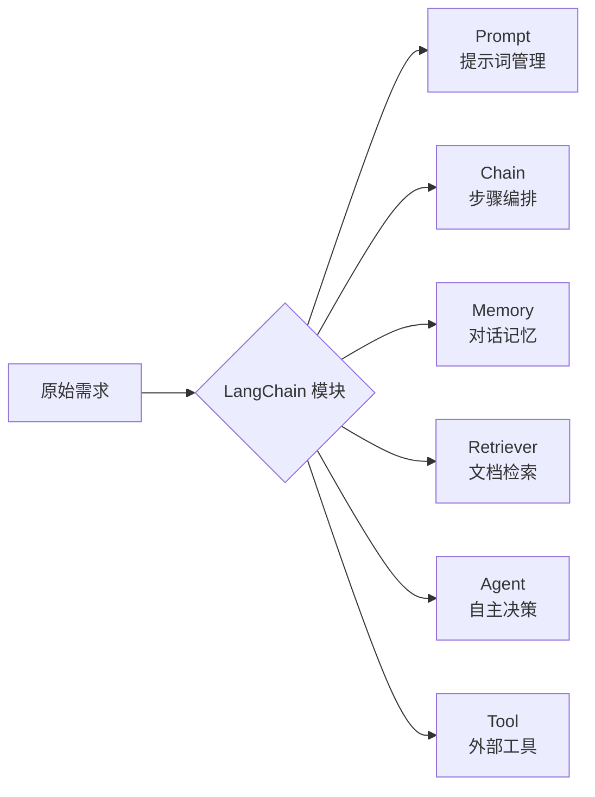
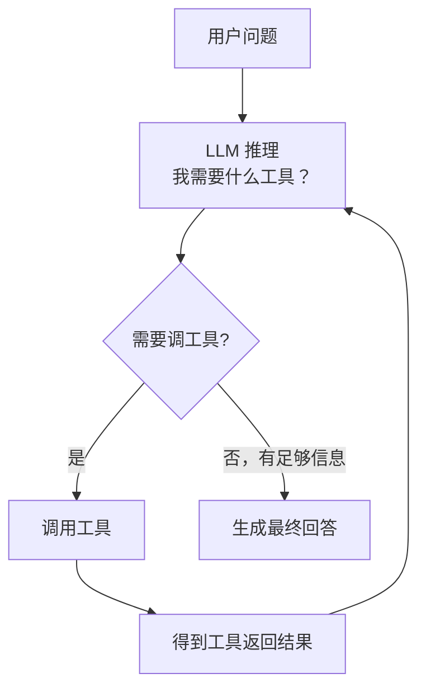

# LangChain 完全指南：从核心概念到 RAG 实战

你已经会调 OpenAI API，能让模型回答问题，但随着需求复杂起来，你开始遇到这些问题：

- 每次都要手写 Prompt 模板，换个场景就要重写一遍
- 想让模型记住上下文，但不知道怎么管理对话历史
- 想接入自己的文档做知识库问答，检索和生成要怎么串起来？
- 想让模型自己决定要不要调工具、调哪个工具

这些问题每个单独解决都不难，但加在一起，代码会越来越乱。**LangChain 就是为了把这些问题的解决方案标准化**，提供一套统一的抽象和组合方式。

---

## 一、LangChain 是什么，解决什么问题

LangChain 是一个用于构建 LLM 应用的框架，它把开发 LLM 应用时的常见模式抽象成**可组合的模块**：



**不用 LangChain 时**，一个带记忆的文档问答系统大概要写 200 行胶水代码：手动拼 prompt、手动维护历史、手动调向量库、手动解析输出……

**用 LangChain 时**，同样的功能可能只需要 30 行，因为这些"胶水"都被封装好了。

:::note
LangChain 目前有两个主要 API 风格：老的 `Chain` 类（如 `LLMChain`）和新的 **LCEL（LangChain Expression Language）**，用 `|` 管道符组合组件。本文以 LCEL 为主，这是官方推荐的现代写法（LangChain ≥ 0.1）。
:::

### 安装

```bash
pip install langchain langchain-openai langchain-community chromadb
```

---

## 二、Prompt：结构化你的提示词

直接拼字符串的问题：模板散落各处、难以复用、变量容易漏。

LangChain 的 `PromptTemplate` 把提示词模板化，变量用 `{变量名}` 占位：

```python
from langchain_core.prompts import PromptTemplate, ChatPromptTemplate

# 基础文本模板
template = PromptTemplate(
    input_variables=["product", "tone"],
    template="请用{tone}的语气，为产品「{product}」写一段 50 字以内的广告语。"
)

# 填入变量，得到完整 prompt 字符串
prompt_str = template.format(product="无线耳机", tone="活泼")
print(prompt_str)
# 请用活泼的语气，为产品「无线耳机」写一段 50 字以内的广告语。
```

对话场景更常用 `ChatPromptTemplate`，可以分别定义 system / human / ai 的消息：

```python
from langchain_core.prompts import ChatPromptTemplate, SystemMessagePromptTemplate, HumanMessagePromptTemplate

chat_prompt = ChatPromptTemplate.from_messages([
    ("system", "你是一个专业的{domain}顾问，回答要简洁专业。"),
    ("human", "{question}"),
])

# 调用时传入变量
messages = chat_prompt.format_messages(
    domain="法律",
    question="劳动合同到期后，公司不续签需要赔偿吗？"
)
```

### 使用 Partial：提前固定部分变量

```python
# 固定 domain，得到一个专用的法律顾问 prompt
legal_prompt = chat_prompt.partial(domain="法律")

# 之后只需要传 question
messages = legal_prompt.format_messages(question="试用期被辞退有补偿吗？")
```

---

## 三、LCEL：用管道符组合组件

LCEL（LangChain Expression Language）是 LangChain 的核心设计，用 `|` 把各个组件串成流水线：

```python
from langchain_openai import ChatOpenAI
from langchain_core.output_parsers import StrOutputParser
from langchain_core.prompts import ChatPromptTemplate

llm = ChatOpenAI(model="gpt-4o-mini", temperature=0)

prompt = ChatPromptTemplate.from_messages([
    ("system", "你是一个代码审查专家。"),
    ("human", "请审查以下代码，指出问题：\n\n```python\n{code}\n```"),
])

# 用 | 把 prompt → llm → 输出解析 串成链
chain = prompt | llm | StrOutputParser()

# 调用
result = chain.invoke({"code": "def add(a,b):\n  return a+b\nprint(add(1,'2'))"})
print(result)
```

LCEL 的优势：

- **统一接口**：每个组件都有 `.invoke()` / `.stream()` / `.batch()` 方法
- **天然支持流式输出**：`chain.stream(input)` 逐字返回
- **并行执行**：用 `RunnableParallel` 同时跑多个分支

```python
from langchain_core.runnables import RunnableParallel

# 同时生成标题和摘要
parallel_chain = RunnableParallel(
    title=ChatPromptTemplate.from_template("为这篇文章起一个标题：{text}") | llm | StrOutputParser(),
    summary=ChatPromptTemplate.from_template("用一句话总结这篇文章：{text}") | llm | StrOutputParser(),
)

result = parallel_chain.invoke({"text": "..."})
print(result["title"])    # 文章标题
print(result["summary"])  # 文章摘要
```

---

## 四、Memory：让模型记住对话历史

默认情况下，每次调用 LLM 都是无状态的，模型不记得上一句说了什么。

### 最简单的方式：手动维护消息列表

```python
from langchain_core.messages import HumanMessage, AIMessage, SystemMessage

history = [SystemMessage(content="你是一个友好的助手。")]

def chat(user_input: str) -> str:
    history.append(HumanMessage(content=user_input))
    response = llm.invoke(history)
    history.append(AIMessage(content=response.content))
    return response.content

print(chat("我叫张三"))           # 好的，张三，有什么我能帮你的？
print(chat("我刚才说我叫什么？"))  # 你刚才说你叫张三。
```

### 使用 ConversationBufferMemory（结构化管理）

```python
from langchain.memory import ConversationBufferMemory
from langchain_core.prompts import ChatPromptTemplate, MessagesPlaceholder
from langchain_core.runnables import RunnablePassthrough

memory = ConversationBufferMemory(return_messages=True, memory_key="history")

prompt = ChatPromptTemplate.from_messages([
    ("system", "你是一个友好的助手。"),
    MessagesPlaceholder(variable_name="history"),  # 历史消息自动插入这里
    ("human", "{input}"),
])

chain = (
    RunnablePassthrough.assign(history=lambda x: memory.load_memory_variables({})["history"])
    | prompt
    | llm
    | StrOutputParser()
)

def chat_with_memory(user_input: str) -> str:
    response = chain.invoke({"input": user_input})
    # 保存这轮对话到 memory
    memory.save_context({"input": user_input}, {"output": response})
    return response
```

### 长对话的问题：Token 超限

对话历史无限增长，最终会超出模型的上下文窗口。常见解决方案：

```python
from langchain.memory import ConversationSummaryBufferMemory

# 超过 max_token_limit 时，自动把早期对话压缩成摘要
memory = ConversationSummaryBufferMemory(
    llm=llm,
    max_token_limit=500,  # 超过 500 token 就开始压缩
    return_messages=True
)
```

---

## 五、Retriever：接入外部知识

Retriever 是 LangChain 对"文档检索"的抽象，所有 retriever 都有统一的接口：传入一个 query，返回相关文档列表。

### 用向量库构建 Retriever

```python
from langchain_openai import OpenAIEmbeddings
from langchain_community.vectorstores import Chroma
from langchain_core.documents import Document

embeddings = OpenAIEmbeddings(model="text-embedding-3-small")

# 准备文档
docs = [
    Document(page_content="LangChain 是一个用于构建 LLM 应用的框架。", metadata={"source": "intro"}),
    Document(page_content="LCEL 是 LangChain Expression Language 的缩写，用管道符组合组件。", metadata={"source": "lcel"}),
    Document(page_content="Memory 模块负责管理对话历史，避免模型遗忘上下文。", metadata={"source": "memory"}),
]

# 构建向量库并创建 retriever
vectorstore = Chroma.from_documents(docs, embeddings)
retriever = vectorstore.as_retriever(
    search_type="similarity",
    search_kwargs={"k": 3}   # 返回最相似的 3 条
)

# 检索
results = retriever.invoke("LangChain 怎么管理对话历史？")
for doc in results:
    print(doc.page_content)
```

### 从文件加载文档

实际项目中，文档通常来自 PDF、网页、Markdown 文件：

```python
from langchain_community.document_loaders import PyPDFLoader, WebBaseLoader
from langchain.text_splitter import RecursiveCharacterTextSplitter

# 加载 PDF
loader = PyPDFLoader("data/handbook.pdf")
raw_docs = loader.load()

# 分块（RecursiveCharacterTextSplitter 是最常用的分块策略）
splitter = RecursiveCharacterTextSplitter(
    chunk_size=500,     # 每块最多 500 字
    chunk_overlap=50,   # 相邻块有 50 字重叠，避免边界语义断裂
)
chunks = splitter.split_documents(raw_docs)
print(f"分成了 {len(chunks)} 个块")

# 构建向量库
vectorstore = Chroma.from_documents(chunks, embeddings, persist_directory="./chroma_db")
retriever = vectorstore.as_retriever(search_kwargs={"k": 5})
```

---

## 六、RAG Chain：把检索和生成串起来

有了 Retriever，再结合 LCEL，几行代码就能搭一个完整的 RAG 问答链：

```python
from langchain_core.prompts import ChatPromptTemplate
from langchain_core.runnables import RunnablePassthrough
from langchain_core.output_parsers import StrOutputParser

rag_prompt = ChatPromptTemplate.from_messages([
    ("system", """你是一个知识库问答助手。请根据下面的参考资料回答用户的问题。
如果参考资料中没有相关信息，请直接说"根据现有资料无法回答"，不要编造内容。

参考资料：
{context}"""),
    ("human", "{question}"),
])

def format_docs(docs: list) -> str:
    """把检索到的文档列表拼成字符串，作为 context 传给模型。"""
    return "\n\n---\n\n".join(doc.page_content for doc in docs)

rag_chain = (
    {
        "context": retriever | format_docs,   # 检索 → 格式化
        "question": RunnablePassthrough(),    # 问题直接透传
    }
    | rag_prompt
    | llm
    | StrOutputParser()
)

answer = rag_chain.invoke("LangChain 的 LCEL 是什么？")
print(answer)
```

### 附带来源引用

```python
from langchain_core.runnables import RunnablePassthrough, RunnableParallel

# 同时返回答案和引用来源
rag_chain_with_source = RunnableParallel(
    answer=rag_chain,
    sources=(retriever | (lambda docs: [d.metadata.get("source", "") for d in docs]))
)

result = rag_chain_with_source.invoke("LangChain 怎么管理对话历史？")
print(result["answer"])
print("来源：", result["sources"])
```

---

## 七、Agent：让模型自主决策调用工具

前面的 Chain 都是固定流程：prompt → llm → 输出。**Agent 的不同之处在于**：模型自己决定要不要调用工具、调哪个工具、用工具的结果再继续推理，直到得出最终答案。



### 定义工具

```python
from langchain_core.tools import tool

@tool
def get_weather(city: str) -> str:
    """查询指定城市的当前天气。city 参数为城市名称，如 '北京'、'上海'。"""
    # 实际项目中调真实天气 API
    weather_data = {
        "北京": "晴，气温 22°C，东南风 3 级",
        "上海": "多云，气温 18°C，东风 2 级",
    }
    return weather_data.get(city, f"暂无 {city} 的天气数据")

@tool
def calculator(expression: str) -> str:
    """计算数学表达式，如 '2 + 3 * 4'。只支持基础四则运算。"""
    try:
        # 注意：eval 有安全风险，生产环境用专门的表达式解析库
        result = eval(expression, {"__builtins__": {}})
        return str(result)
    except Exception as e:
        return f"计算出错：{e}"

tools = [get_weather, calculator]
```

### 创建并运行 Agent

```python
from langchain.agents import create_tool_calling_agent, AgentExecutor
from langchain_core.prompts import ChatPromptTemplate, MessagesPlaceholder

agent_prompt = ChatPromptTemplate.from_messages([
    ("system", "你是一个智能助手，可以使用工具来帮助用户。"),
    ("human", "{input}"),
    MessagesPlaceholder(variable_name="agent_scratchpad"),  # Agent 的中间推理过程
])

# 创建 agent（内部使用 Function Calling / Tool Calling）
agent = create_tool_calling_agent(llm, tools, agent_prompt)

# AgentExecutor 负责循环执行：推理 → 调工具 → 再推理
executor = AgentExecutor(
    agent=agent,
    tools=tools,
    verbose=True,    # 打印每步推理过程，调试很有用
    max_iterations=5 # 最多循环 5 次，防止无限循环
)

result = executor.invoke({"input": "北京今天天气怎么样？如果明天要出门，22度需要穿几件衣服合适？"})
print(result["output"])
```

`verbose=True` 时会打印完整的推理过程：

```
> Entering new AgentExecutor chain...
Invoking: `get_weather` with `{'city': '北京'}`
晴，气温 22°C，东南风 3 级

22°C 天气比较舒适，建议穿一件薄外套或长袖衬衫即可...

> Finished chain.
```

---

## 八、完整项目：带记忆的 RAG 知识库问答

把前面所有模块组合起来，实现一个支持多轮对话的知识库问答系统：

::: details 查看完整代码

```python
import os
from langchain_openai import ChatOpenAI, OpenAIEmbeddings
from langchain_community.vectorstores import Chroma
from langchain_community.document_loaders import PyPDFLoader
from langchain.text_splitter import RecursiveCharacterTextSplitter
from langchain_core.prompts import ChatPromptTemplate, MessagesPlaceholder
from langchain_core.runnables import RunnablePassthrough, RunnableParallel
from langchain_core.output_parsers import StrOutputParser
from langchain_core.messages import HumanMessage, AIMessage
from langchain_core.documents import Document

# ── 1. 初始化模型 ──────────────────────────────────────────

llm = ChatOpenAI(model="gpt-4o-mini", temperature=0)
embeddings = OpenAIEmbeddings(model="text-embedding-3-small")

# ── 2. 构建知识库 ──────────────────────────────────────────

def build_vectorstore(docs_path: str) -> Chroma:
    """从文档目录构建向量库，支持 PDF 和 txt 文件。"""
    all_docs = []

    for filename in os.listdir(docs_path):
        filepath = os.path.join(docs_path, filename)
        if filename.endswith(".pdf"):
            loader = PyPDFLoader(filepath)
            all_docs.extend(loader.load())

    splitter = RecursiveCharacterTextSplitter(chunk_size=500, chunk_overlap=50)
    chunks = splitter.split_documents(all_docs)

    vectorstore = Chroma.from_documents(
        chunks,
        embeddings,
        persist_directory="./chroma_db"
    )
    print(f"知识库构建完成，共 {len(chunks)} 个文本块")
    return vectorstore

# 如果向量库已存在，直接加载；否则重新构建
if os.path.exists("./chroma_db"):
    vectorstore = Chroma(persist_directory="./chroma_db", embedding_function=embeddings)
else:
    vectorstore = build_vectorstore("./docs")

retriever = vectorstore.as_retriever(search_kwargs={"k": 5})

# ── 3. 构建带历史的 RAG Chain ──────────────────────────────

rag_prompt = ChatPromptTemplate.from_messages([
    ("system", """你是一个知识库问答助手。请根据参考资料和对话历史回答用户的问题。
如果参考资料中没有相关信息，请说"根据现有资料无法回答"，不要编造。

参考资料：
{context}"""),
    MessagesPlaceholder(variable_name="history"),  # 对话历史
    ("human", "{question}"),
])

def format_docs(docs: list) -> str:
    return "\n\n---\n\n".join(
        f"[来源: {doc.metadata.get('source', '未知')}]\n{doc.page_content}"
        for doc in docs
    )

# ── 4. 对话管理 ────────────────────────────────────────────

class KnowledgeBaseChat:
    def __init__(self, retriever, llm, max_history: int = 10):
        self.retriever = retriever
        self.llm = llm
        self.history: list = []
        self.max_history = max_history  # 最多保留 N 轮历史，控制 token 用量

    def chat(self, question: str) -> dict:
        # 检索相关文档
        docs = self.retriever.invoke(question)
        context = format_docs(docs)

        # 构建消息并调用模型
        messages = rag_prompt.format_messages(
            context=context,
            history=self.history[-self.max_history:],  # 只保留最近 N 轮
            question=question,
        )
        response = self.llm.invoke(messages)
        answer = response.content

        # 更新历史
        self.history.append(HumanMessage(content=question))
        self.history.append(AIMessage(content=answer))

        return {
            "answer": answer,
            "sources": list(set(doc.metadata.get("source", "") for doc in docs))
        }

    def clear_history(self):
        self.history = []
        print("对话历史已清空")


# ── 5. 运行对话 ────────────────────────────────────────────

if __name__ == "__main__":
    bot = KnowledgeBaseChat(retriever, llm)

    print("知识库助手已就绪，输入 'quit' 退出，输入 'clear' 清空历史")
    print("-" * 50)

    while True:
        user_input = input("你：").strip()
        if not user_input:
            continue
        if user_input.lower() == "quit":
            break
        if user_input.lower() == "clear":
            bot.clear_history()
            continue

        result = bot.chat(user_input)
        print(f"\n助手：{result['answer']}")
        if result["sources"]:
            print(f"来源：{', '.join(result['sources'])}")
        print("-" * 50)
```
:::

---

## 九、LangChain vs 直接调 API：该怎么选

LangChain 不是银弹，引入它有代价：学习成本、版本更新快、调试链路比直接调 API 复杂。

| 场景 | 推荐 | 理由 |
|---|---|---|
| 单次问答、简单对话 | **直接调 API** | 5 行代码够用，引入 LangChain 反而增加复杂度 |
| 需要复杂 Prompt 模板管理 | **LangChain** | PromptTemplate 统一管理，复用方便 |
| RAG 知识库问答 | **LangChain** | Retriever + Chain 大量减少胶水代码 |
| 多步骤 Agent + 工具调用 | **LangChain** | AgentExecutor 处理好了推理循环和工具调度 |
| 生产级高并发服务 | **直接调 API** | LangChain 的抽象层在高并发下性能可控性差 |
| 需要极致定制化 | **直接调 API** | LangChain 的封装有时反而成为限制 |

一个实用的判断标准：

> **如果你需要把多个 LLM 调用、检索、工具、记忆组合在一起，用 LangChain。如果你只是调一次 API 拿个结果，直接用 openai SDK。**

:::warning
LangChain 版本迭代非常快，API 变化频繁。写代码前确认版本（`pip show langchain`），遇到报错优先查官方文档而不是搜索引擎，因为网上大量教程基于旧版本。本文基于 LangChain `0.3.x`。
:::

---

## 十、常见问题

**Q：LCEL 的 `|` 和直接调方法有什么区别？**

`|` 是 Python 的 `__or__` 运算符重载，等价于 `chain = prompt.pipe(llm).pipe(parser)`。优势是支持流式、批量、并发等高级特性，代码更简洁。

**Q：Memory 存储在哪里？进程重启后还在吗？**

默认 `ConversationBufferMemory` 存在内存里，进程重启后消失。需要持久化时，可以用 `RedisChatMessageHistory` 或 `SQLChatMessageHistory` 把历史存到外部存储：

```python
from langchain_community.chat_message_histories import RedisChatMessageHistory

message_history = RedisChatMessageHistory(
    session_id="user_123",
    url="redis://localhost:6379"
)
```

**Q：向量库的文档更新了怎么办？**

向量库不会自动感知原始文档的变化，需要手动重新索引。有两种策略：
- **全量重建**：删掉旧的 collection，重新 `from_documents()`
- **增量更新**：根据文档 ID 删除旧 chunk，再添加新 chunk

```python
# 删除旧文档的所有 chunk
vectorstore.delete(where={"source": "old_doc.pdf"})
# 添加新 chunk
vectorstore.add_documents(new_chunks)
```

---

## 总结

| 模块 | 作用 | 核心 API |
|---|---|---|
| **PromptTemplate** | 结构化管理提示词，支持变量注入 | `.format()` / `.partial()` |
| **LCEL** | 用 `\|` 把组件组合成流水线 | `.invoke()` / `.stream()` / `.batch()` |
| **Memory** | 管理对话历史，支持自动压缩 | `ConversationBufferMemory` / `ConversationSummaryBufferMemory` |
| **Retriever** | 从向量库检索相关文档 | `vectorstore.as_retriever()` |
| **RAG Chain** | 检索 + 生成的完整链路 | Retriever `\|` Prompt `\|` LLM |
| **Agent** | 模型自主决策调用工具 | `create_tool_calling_agent` + `AgentExecutor` |
| **Tool** | 封装外部功能（搜索、计算、API） | `@tool` 装饰器 |

LangChain 的价值在于**标准化**：用统一的抽象层屏蔽不同 LLM 供应商、不同向量库、不同工具的差异，让你专注于业务逻辑而不是底层接口。当你的应用需要把多个 AI 能力组合起来时，它的优势就体现出来了。

::: details 延伸阅读
- [LangChain 官方文档](https://python.langchain.com/)
- [LCEL 官方介绍](https://python.langchain.com/docs/concepts/lcel/)
- [LangSmith（LangChain 的调试和监控平台）](https://smith.langchain.com/)
- [LangGraph（基于 LangChain 的 Agent 工作流框架）](https://langchain-ai.github.io/langgraph/)
:::
