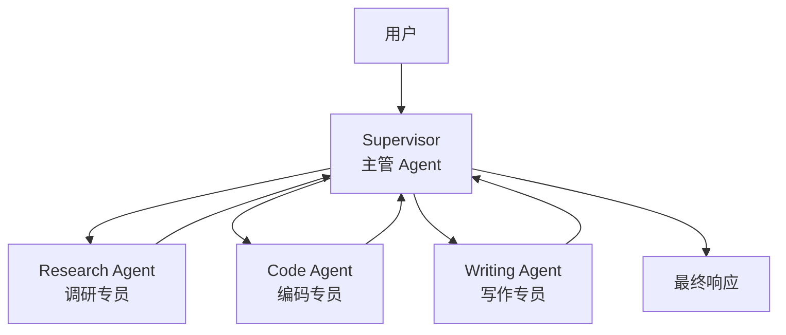
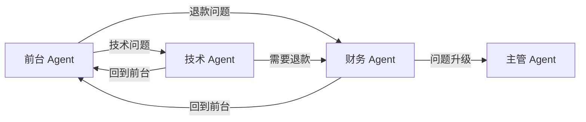
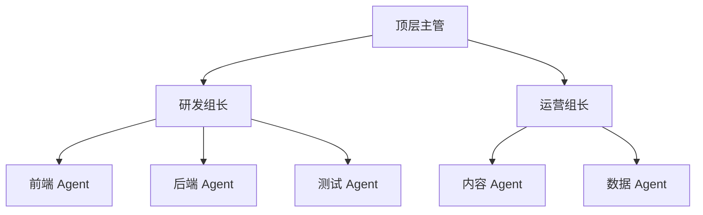
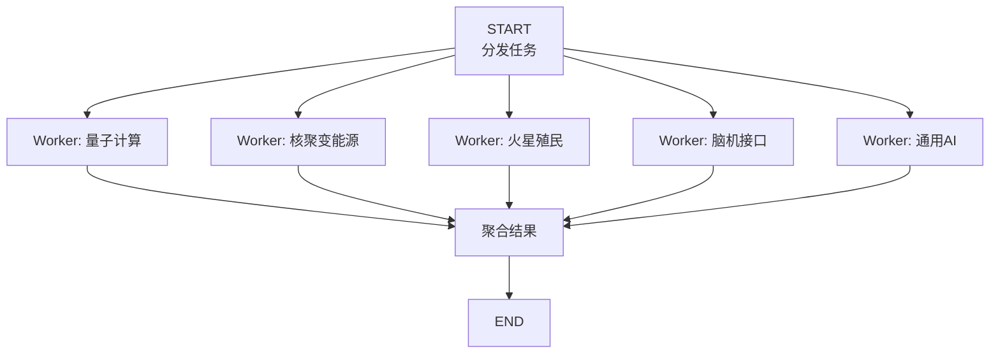
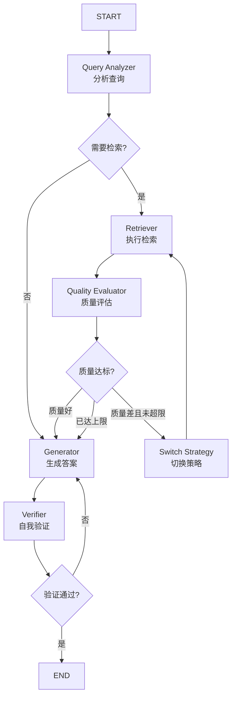
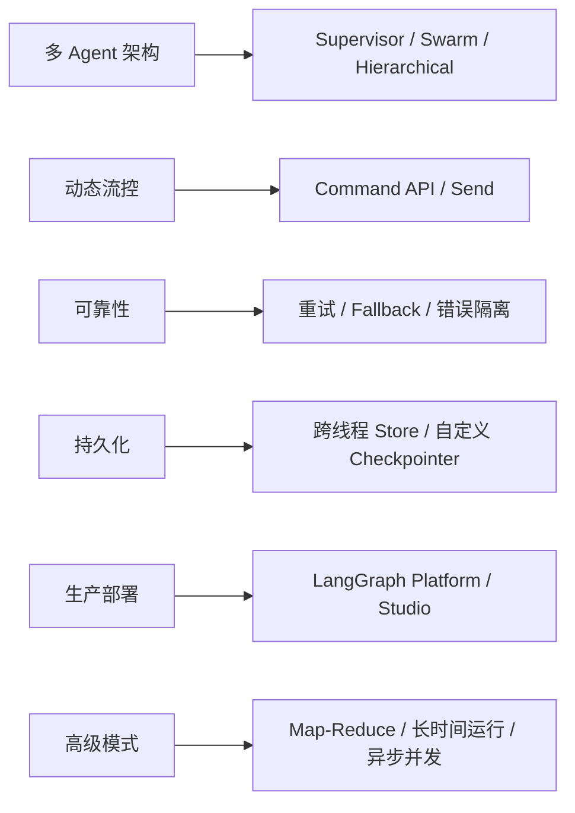

# LangGraph 进阶：多 Agent 架构、动态流控与生产级实践

在基础篇中，我们学会了用 LangGraph 构建单个 Agent：定义状态、连接节点、设置条件边、使用 Checkpointer。这足以应对大多数简单场景。

但当你开始构建真实的生产系统时，新的挑战出现了：

- 一个 Agent 不够用——需要**多个专业 Agent 协作**，谁来协调它们？
- 工作流在运行时才能确定下一步走哪——需要**动态改变图的走向**
- 某个步骤需要对一批数据并行处理——需要 **Map-Reduce 模式**
- 用户关闭浏览器明天再来，Agent 要能接着上次继续——需要**跨会话记忆**
- 工具调用偶尔超时，不能整个流程都失败——需要**优雅的错误处理**
- 工作流可能运行几小时甚至几天——需要**长时间运行的可靠执行**

这篇文章就是解决这些问题的。

:::note 前置知识
本文假设你已阅读过[LangGraph 基础篇](/blog/ai/langgraph-guide)，熟悉 StateGraph、Node、Edge、Conditional Edge、Checkpointer、interrupt 等核心概念。
:::

---

## 一、多 Agent 架构模式

单个 Agent 有其能力天花板：Prompt 越来越长、工具越来越多、职责越来越模糊。拆分为多个专业 Agent 协作是自然的演进方向。LangGraph 支持多种多 Agent 编排模式。

### 1.1 Supervisor 模式：中心化调度

一个"主管" Agent 负责接收用户请求、分配任务给专业 Agent、汇总结果。这是最直观的多 Agent 模式。



```python
from typing import Annotated, TypedDict, Literal
from langgraph.graph import StateGraph, START, END
from langgraph.graph.message import add_messages
from langgraph.prebuilt import create_react_agent
from langchain_openai import ChatOpenAI
from langchain_core.messages import HumanMessage, SystemMessage, AIMessage
from langchain_core.tools import tool

# ========== 定义专业工具 ==========
@tool
def search_papers(query: str) -> str:
    """搜索学术论文"""
    return f"找到关于「{query}」的 3 篇相关论文：\n1. {query} Survey (2024)\n2. Advanced {query} (2024)\n3. {query} in Practice (2023)"

@tool
def run_python_code(code: str) -> str:
    """执行 Python 代码并返回结果"""
    try:
        exec_globals = {}
        exec(code, exec_globals)
        return str(exec_globals.get("result", "代码执行成功，无返回值"))
    except Exception as e:
        return f"执行错误：{e}"

@tool
def write_document(title: str, content: str) -> str:
    """生成结构化文档"""
    return f"文档已生成：\n# {title}\n\n{content}"

# ========== 创建专业 Agent ==========
model = ChatOpenAI(model="gpt-4o")

research_agent = create_react_agent(
    model=model,
    tools=[search_papers],
    prompt="你是学术研究专员，擅长文献调研和信息收集。只在需要查找资料时被调用。"
)

code_agent = create_react_agent(
    model=model,
    tools=[run_python_code],
    prompt="你是编码专员，擅长编写和执行 Python 代码。只在需要编程时被调用。"
)

writing_agent = create_react_agent(
    model=model,
    tools=[write_document],
    prompt="你是写作专员，擅长将素材组织成高质量文档。只在需要写作时被调用。"
)

# ========== Supervisor 状态与逻辑 ==========
class SupervisorState(TypedDict):
    messages: Annotated[list, add_messages]
    next_agent: str
    task_complete: bool

def supervisor(state: SupervisorState) -> dict:
    """主管 Agent：决定下一步交给哪个专业 Agent"""
    supervisor_prompt = """你是项目主管，负责协调三个专业 Agent：
- research_agent：负责文献调研和信息搜索
- code_agent：负责编写和运行代码
- writing_agent：负责撰写文档和报告

根据当前对话状态，决定下一步应该交给哪个 Agent，或者任务已完成。
只回复一个 JSON：{"next": "research_agent|code_agent|writing_agent|FINISH", "reason": "原因"}"""

    response = model.invoke([
        SystemMessage(content=supervisor_prompt),
        *state["messages"]
    ])

    content = response.content
    # 解析 Supervisor 决策
    if "FINISH" in content:
        return {"next_agent": "FINISH", "task_complete": True, "messages": [response]}

    for agent_name in ["research_agent", "code_agent", "writing_agent"]:
        if agent_name in content:
            return {"next_agent": agent_name, "messages": [response]}

    return {"next_agent": "FINISH", "task_complete": True, "messages": [response]}

# 专业 Agent 节点封装
def research_node(state: SupervisorState) -> dict:
    result = research_agent.invoke({"messages": state["messages"]})
    last_msg = result["messages"][-1]
    return {"messages": [AIMessage(content=f"[Research Agent] {last_msg.content}")]}

def code_node(state: SupervisorState) -> dict:
    result = code_agent.invoke({"messages": state["messages"]})
    last_msg = result["messages"][-1]
    return {"messages": [AIMessage(content=f"[Code Agent] {last_msg.content}")]}

def writing_node(state: SupervisorState) -> dict:
    result = writing_agent.invoke({"messages": state["messages"]})
    last_msg = result["messages"][-1]
    return {"messages": [AIMessage(content=f"[Writing Agent] {last_msg.content}")]}

# ========== 构建 Supervisor 图 ==========
def route_to_agent(state: SupervisorState) -> str:
    if state.get("task_complete") or state["next_agent"] == "FINISH":
        return END
    return state["next_agent"]

graph = StateGraph(SupervisorState)

graph.add_node("supervisor", supervisor)
graph.add_node("research_agent", research_node)
graph.add_node("code_agent", code_node)
graph.add_node("writing_agent", writing_node)

graph.add_edge(START, "supervisor")
graph.add_conditional_edges("supervisor", route_to_agent, {
    "research_agent": "research_agent",
    "code_agent": "code_agent",
    "writing_agent": "writing_agent",
    END: END,
})
# 每个专业 Agent 完成后回到 Supervisor
graph.add_edge("research_agent", "supervisor")
graph.add_edge("code_agent", "supervisor")
graph.add_edge("writing_agent", "supervisor")

supervisor_system = graph.compile()
```

运行示例：

```python
result = supervisor_system.invoke({
    "messages": [HumanMessage(content="帮我调研 Transformer 架构的最新进展，写一段总结，并用代码画一个注意力机制的示意图")],
    "next_agent": "",
    "task_complete": False
})
```

:::tip Supervisor 模式的优缺点
**优点**：架构清晰、控制力强、容易调试（所有决策经过主管）

**缺点**：主管成为瓶颈，每次中转都有额外 LLM 调用开销；主管 Prompt 变复杂后决策准确率下降
:::

### 1.2 Swarm 模式：去中心化协作

Swarm（群体智能）模式中没有中心主管，每个 Agent 都可以主动将控制权**移交（Handoff）**给其他 Agent。适合对话型场景，如客服系统中不同专员之间的转接。



```python
from langgraph.prebuilt import create_react_agent
from langgraph.types import Command
from langchain_core.tools import tool, InjectedToolArg
from typing import Annotated

# ========== Handoff 工具：让 Agent 能移交控制权 ==========
def create_handoff_tool(target_agent: str, description: str):
    """创建一个 handoff 工具，让当前 Agent 能转交给目标 Agent"""
    @tool(f"transfer_to_{target_agent}")
    def handoff(
        reason: str,
        # 使用 InjectedToolArg 标记不需要 LLM 填充的参数
    ) -> Command:
        f"""将对话转交给 {target_agent}。{description}
        Args:
            reason: 转交原因
        """
        return Command(
            goto=target_agent,
            update={"messages": [AIMessage(content=f"[转交至 {target_agent}] 原因：{reason}")]},
        )
    return handoff

# ========== 定义各 Agent ==========
# 前台 Agent
triage_agent = create_react_agent(
    model=ChatOpenAI(model="gpt-4o"),
    tools=[
        create_handoff_tool("tech_support", "用户有技术问题时转交"),
        create_handoff_tool("billing", "用户有账单或退款问题时转交"),
    ],
    prompt="""你是前台接待。判断用户问题类型：
- 技术问题 → 转交 tech_support
- 账单/退款 → 转交 billing
- 简单问候/通用问题 → 直接回答"""
)

# 技术支持 Agent
tech_agent = create_react_agent(
    model=ChatOpenAI(model="gpt-4o"),
    tools=[
        create_handoff_tool("triage", "问题不属于技术范畴，退回前台"),
        create_handoff_tool("billing", "用户需要退款"),
    ],
    prompt="你是技术支持工程师，解决用户的技术问题。如果问题不在你的职责范围，转交给适当的同事。"
)

# 财务 Agent
billing_agent = create_react_agent(
    model=ChatOpenAI(model="gpt-4o"),
    tools=[
        create_handoff_tool("triage", "问题处理完毕，退回前台"),
    ],
    prompt="你是财务专员，处理退款、账单查询等财务问题。"
)

# ========== 构建 Swarm 图 ==========
from langgraph.graph import StateGraph, START, END
from langgraph.graph.message import add_messages

class SwarmState(TypedDict):
    messages: Annotated[list, add_messages]

swarm_graph = StateGraph(SwarmState)

swarm_graph.add_node("triage", triage_agent)
swarm_graph.add_node("tech_support", tech_agent)
swarm_graph.add_node("billing", billing_agent)

swarm_graph.add_edge(START, "triage")

# 注意：Swarm 模式中，路由由 Command 动态决定
# 当 Agent 返回 Command(goto="xxx") 时，LangGraph 自动路由
# 如果没有返回 Command，则结束
swarm_graph.add_edge("triage", END)
swarm_graph.add_edge("tech_support", END)
swarm_graph.add_edge("billing", END)

swarm = swarm_graph.compile()
```

:::important Command 驱动的动态路由
Swarm 模式的关键在于：**路由决策不在边上，而在节点内部**。Agent 通过返回 `Command(goto="target")` 来动态决定下一步去哪。这比条件边更灵活，因为决策逻辑和 Agent 逻辑是耦合在一起的——Agent 自己最清楚应该转交给谁。
:::

### 1.3 Hierarchical 模式：分层委托

当系统规模进一步扩大，可以将 Supervisor 模式嵌套——形成**分层架构**。顶层主管管理几个中层主管，每个中层主管管理一组专业 Agent。



```python
from langgraph.graph import StateGraph, START, END
from langgraph.graph.message import add_messages
from langgraph.checkpoint.memory import MemorySaver

# ========== 底层：研发团队子图 ==========
class DevTeamState(TypedDict):
    messages: Annotated[list, add_messages]
    task: str
    code_output: str

def frontend_dev(state: DevTeamState) -> dict:
    response = model.invoke([
        SystemMessage(content="你是前端开发工程师，编写 React/Vue 代码。"),
        HumanMessage(content=state["task"])
    ])
    return {"code_output": response.content, "messages": [response]}

def backend_dev(state: DevTeamState) -> dict:
    response = model.invoke([
        SystemMessage(content="你是后端开发工程师，编写 Python/Node.js 服务端代码。"),
        HumanMessage(content=state["task"])
    ])
    return {"code_output": response.content, "messages": [response]}

def dev_team_router(state: DevTeamState) -> str:
    task = state["task"].lower()
    if any(kw in task for kw in ["前端", "react", "vue", "css", "html", "ui"]):
        return "frontend"
    return "backend"

dev_team_graph = StateGraph(DevTeamState)
dev_team_graph.add_node("frontend", frontend_dev)
dev_team_graph.add_node("backend", backend_dev)
dev_team_graph.add_conditional_edges(START, dev_team_router, {
    "frontend": "frontend",
    "backend": "backend"
})
dev_team_graph.add_edge("frontend", END)
dev_team_graph.add_edge("backend", END)
dev_team = dev_team_graph.compile()

# ========== 中层：研发组长 ==========
class ManagerState(TypedDict):
    messages: Annotated[list, add_messages]
    subtasks: list[str]
    results: list[str]

def dev_manager(state: ManagerState) -> dict:
    """研发组长：拆解任务并分配给团队"""
    # 调用子图执行
    results = []
    for task in state.get("subtasks", [state["messages"][-1].content]):
        result = dev_team.invoke({
            "messages": [],
            "task": task,
            "code_output": ""
        })
        results.append(result["code_output"])
    return {"results": results, "messages": [AIMessage(content="\n".join(results))]}

# ========== 顶层主管只需编排中层管理者 ==========
# 类似 1.1 的 Supervisor 模式，但子节点不是具体 Agent 而是团队管理者
```

### 1.4 三种模式的选型建议

| 模式 | 适用场景 | 复杂度 | 可控性 |
| :--- | :--- | :--- | :--- |
| **Supervisor** | 任务明确、Agent 数量 ≤ 5 | 中 | 高 |
| **Swarm** | 对话场景、转接式协作 | 低 | 中 |
| **Hierarchical** | 大规模系统、Agent 数量 > 10 | 高 | 极高 |

---

## 二、Command API：运行时动态流控

基础篇中的条件边是**静态定义的**——你在构建图时就确定了所有可能的路由。但有些场景需要在运行时动态决定流转方向，甚至动态修改状态。这就是 **Command API** 的用武之地。

### 2.1 Command 的核心能力

`Command` 是 LangGraph 中节点返回值的一种特殊形式，它同时携带：

1. **状态更新**（`update`）：要修改哪些状态字段
2. **路由决策**（`goto`）：下一步去哪个节点

```python
from langgraph.types import Command
from langgraph.graph import StateGraph, START, END

class FlowState(TypedDict):
    messages: Annotated[list, add_messages]
    priority: str
    retry_count: int

def dynamic_router(state: FlowState) -> Command:
    """根据运行时状态动态决定流向"""
    priority = state.get("priority", "normal")
    retry_count = state.get("retry_count", 0)

    if priority == "urgent" and retry_count < 3:
        # 高优先级且未超重试上限 → 走快速通道
        return Command(
            update={"retry_count": retry_count + 1},
            goto="fast_track"
        )
    elif priority == "urgent" and retry_count >= 3:
        # 已多次重试 → 升级给人工
        return Command(
            update={"messages": [AIMessage(content="多次重试失败，转人工处理")]},
            goto="human_escalation"
        )
    else:
        # 普通优先级 → 走标准流程
        return Command(
            goto="standard_process"
        )
```

### 2.2 Command 与条件边的区别

```python
# ===== 条件边方式：路由逻辑和状态更新分离 =====
def router_func(state):
    """只能返回目标节点名"""
    return "node_a" if state["score"] > 0.8 else "node_b"

graph.add_conditional_edges("source", router_func, {"node_a": "node_a", "node_b": "node_b"})

# 如果路由时还想更新状态，只能在 source 节点里提前做好


# ===== Command 方式：路由 + 状态更新一步到位 =====
def smart_node(state) -> Command:
    """可以同时决定去向和更新状态"""
    if state["score"] > 0.8:
        return Command(
            update={"level": "advanced", "messages": [AIMessage(content="进入高级模式")]},
            goto="advanced_handler"
        )
    else:
        return Command(
            update={"level": "basic"},
            goto="basic_handler"
        )
```

:::tip 何时用 Command vs 条件边
- **条件边**：路由逻辑简单、不需要同时更新状态、路由选项在编译时已知
- **Command**：路由决策伴随状态更新、路由目标动态生成、Swarm 模式中 Agent 自主转交
:::

### 2.3 Command 在子图间跳转

Command 还能跨越子图边界，直接跳转到父图或兄弟子图的节点：

```python
from langgraph.types import Command

def subgraph_node(state) -> Command:
    """子图中的节点可以直接跳转到父图的节点"""
    if state["needs_escalation"]:
        return Command(
            goto="parent_escalation_node",
            # graph=Command.PARENT 表示目标在父图中
            graph=Command.PARENT,
            update={"escalation_reason": "子任务无法处理"}
        )
    return Command(update={"result": "处理完成"}, goto=END)
```

---

## 三、Map-Reduce 并行模式

某些场景需要对一批数据并行处理（Map），然后聚合结果（Reduce）。LangGraph 通过 `Send` API 原生支持这种模式。

### 3.1 Send：动态并行分发

```python
from langgraph.types import Send
from langgraph.graph import StateGraph, START, END
from langgraph.graph.message import add_messages

class MapReduceState(TypedDict):
    topics: list[str]       # 要并行处理的主题列表
    summaries: Annotated[list[str], lambda x, y: x + y]  # 聚合结果
    final_report: str

class WorkerState(TypedDict):
    """每个 worker 处理单个主题"""
    topic: str
    summary: str

# Worker 节点：处理单个主题
def research_worker(state: WorkerState) -> dict:
    response = model.invoke([
        SystemMessage(content="你是研究助手，对给定主题写 100 字摘要。"),
        HumanMessage(content=f"请研究并总结：{state['topic']}")
    ])
    return {"summary": response.content}

# 分发节点：创建多个并行任务
def distribute_tasks(state: MapReduceState) -> list[Send]:
    """为每个主题创建一个并行的 Send"""
    return [
        Send("worker", {"topic": topic, "summary": ""})
        for topic in state["topics"]
    ]

# 聚合节点：合并所有 worker 的结果
def aggregate_results(state: MapReduceState) -> dict:
    all_summaries = "\n\n".join(state["summaries"])
    response = model.invoke([
        SystemMessage(content="请将以下研究摘要整合为一份完整报告。"),
        HumanMessage(content=all_summaries)
    ])
    return {"final_report": response.content}

# 构建图
graph = StateGraph(MapReduceState)
graph.add_node("worker", research_worker)
graph.add_node("aggregate", aggregate_results)

# distribute_tasks 返回 Send 列表，LangGraph 会并行执行所有 Send
graph.add_conditional_edges(START, distribute_tasks)
graph.add_edge("worker", "aggregate")
graph.add_edge("aggregate", END)

map_reduce_graph = graph.compile()
```

运行：

```python
result = map_reduce_graph.invoke({
    "topics": ["量子计算", "核聚变能源", "火星殖民", "脑机接口", "通用人工智能"],
    "summaries": [],
    "final_report": ""
})

print(result["final_report"])
# 5 个主题被并行研究，最后聚合为一份报告
```



### 3.2 动态数量的并行任务

Send 的强大之处在于：并行任务的数量是运行时动态决定的，不需要在图定义时就确定。

```python
def smart_distribute(state: MapReduceState) -> list[Send]:
    """根据运行时状态动态决定并行数量"""
    topics = state["topics"]

    # 如果主题太多，分批处理
    batch_size = 5
    if len(topics) > batch_size:
        # 只处理前 batch_size 个，剩余的放入下一轮
        topics = topics[:batch_size]

    sends = []
    for topic in topics:
        # 还可以根据不同类型分配给不同的 worker
        if "code" in topic.lower():
            sends.append(Send("code_worker", {"topic": topic}))
        else:
            sends.append(Send("research_worker", {"topic": topic}))

    return sends
```

---

## 四、高级状态管理

### 4.1 私有状态与公共状态

在多 Agent 系统中，不是所有信息都应该对所有节点可见。LangGraph 支持节点拥有**私有状态**：

```python
from langgraph.graph import StateGraph, START, END
from typing import TypedDict, Annotated

# 图级公共状态
class PublicState(TypedDict):
    messages: Annotated[list, add_messages]
    user_request: str
    final_answer: str

# 节点私有的输入/输出 schema
class AnalysisInput(TypedDict):
    messages: list
    user_request: str
    # 不包含 final_answer —— 分析节点不需要看到它

class AnalysisOutput(TypedDict):
    messages: list
    # 分析节点只写入 messages，不碰其他字段

def analysis_node(state: AnalysisInput) -> AnalysisOutput:
    """这个节点只能看到 AnalysisInput 中的字段"""
    # state 中没有 final_answer，节点无法读取
    result = analyze(state["user_request"])
    return {"messages": [AIMessage(content=result)]}

# 使用 input/output schema 限制节点的可见范围
graph.add_node("analysis", analysis_node, input=AnalysisInput, output=AnalysisOutput)
```

### 4.2 状态 Schema 的版本演进

生产系统中，状态结构会随业务迭代变化。处理旧的 checkpoint 时需要兼容：

```python
from typing import TypedDict, Annotated

# V1 状态（已在生产中有存量 checkpoint）
class StateV1(TypedDict):
    messages: Annotated[list, add_messages]
    query: str

# V2 状态（新增字段，带默认值确保向后兼容）
class StateV2(TypedDict):
    messages: Annotated[list, add_messages]
    query: str
    # 新增字段，设置默认值处理旧 checkpoint
    source: str        # 新增
    confidence: float  # 新增

def migrate_state(old_state: dict) -> StateV2:
    """状态迁移函数：处理 V1 → V2 的升级"""
    return {
        **old_state,
        "source": old_state.get("source", "unknown"),
        "confidence": old_state.get("confidence", 0.0),
    }
```

:::warning
LangGraph 的 Checkpoint 存储的是完整状态快照。如果你修改了 State 的结构，已有的 checkpoint 可能无法直接反序列化。建议：
1. 新增字段始终提供默认值
2. 避免删除已有字段，可以标记为 deprecated
3. 重大变更时更换 `thread_id` 前缀
:::

### 4.3 跨节点的复杂 Reducer

```python
from typing import Annotated, TypedDict

# 带优先级的消息队列 reducer
def priority_queue_reducer(current: list[dict], new: list[dict]) -> list[dict]:
    """合并后按优先级排序"""
    merged = current + new
    return sorted(merged, key=lambda x: x.get("priority", 0), reverse=True)

# 带去重的集合 reducer
def deduplicated_append(current: list[str], new: list[str]) -> list[str]:
    """追加但去重"""
    seen = set(current)
    result = list(current)
    for item in new:
        if item not in seen:
            result.append(item)
            seen.add(item)
    return result

# 带上限的列表 reducer
def bounded_list(max_size: int):
    """创建一个有长度上限的 reducer"""
    def reducer(current: list, new: list) -> list:
        merged = current + new
        return merged[-max_size:]  # 只保留最近的 N 条
    return reducer

class AdvancedState(TypedDict):
    messages: Annotated[list, add_messages]
    task_queue: Annotated[list[dict], priority_queue_reducer]
    visited_pages: Annotated[list[str], deduplicated_append]
    recent_errors: Annotated[list[str], bounded_list(10)]  # 最多保留 10 条错误
```

---

## 五、跨线程记忆：Store API

Checkpointer 的记忆是**线程内**的——不同 `thread_id` 之间互相隔离。但有些信息需要跨会话共享（比如用户偏好、长期记忆）。LangGraph 的 **Store** API 就是为此设计的。

### 5.1 Store 基础用法

```python
from langgraph.store.memory import InMemoryStore
from langgraph.checkpoint.memory import MemorySaver
from langchain_core.messages import HumanMessage, SystemMessage

# 创建 Store（跨线程持久存储）
store = InMemoryStore()
checkpointer = MemorySaver()

# 编译图时同时传入 store 和 checkpointer
graph = graph_builder.compile(
    checkpointer=checkpointer,
    store=store
)
```

### 5.2 在节点中读写 Store

```python
from langgraph.store.base import BaseStore
from langgraph.config import get_store

class MemoryState(TypedDict):
    messages: Annotated[list, add_messages]
    user_id: str

def personalized_response(state: MemoryState, *, store: BaseStore) -> dict:
    """带长期记忆的个性化回复"""
    user_id = state["user_id"]

    # 从 Store 读取该用户的历史偏好
    namespace = ("user_preferences", user_id)
    memories = store.search(namespace)

    preferences = ""
    if memories:
        preferences = "\n".join([m.value.get("content", "") for m in memories])

    # 用偏好信息增强 Prompt
    messages = [
        SystemMessage(content=f"""你是个性化助手。
用户的历史偏好：
{preferences if preferences else '暂无记录'}

根据偏好调整回复风格。"""),
        *state["messages"]
    ]
    response = model.invoke(messages)

    # 从对话中提取新的偏好，存入 Store
    new_preference = extract_preference(state["messages"][-1].content)
    if new_preference:
        store.put(
            namespace,
            key=f"pref_{len(memories)}",
            value={"content": new_preference, "timestamp": "2024-01-01"}
        )

    return {"messages": [response]}

def extract_preference(text: str) -> str:
    """从用户消息中提取偏好信息"""
    preference_keywords = ["喜欢", "偏好", "习惯", "总是", "讨厌"]
    if any(kw in text for kw in preference_keywords):
        return text
    return ""
```

### 5.3 Store vs Checkpointer 对比

| 特性 | Checkpointer | Store |
| :--- | :--- | :--- |
| **作用域** | 单个 thread 内 | 跨 thread 全局 |
| **数据模型** | 完整状态快照 | Key-Value 文档 |
| **典型用途** | 对话历史、断点恢复 | 用户偏好、知识积累 |
| **查询方式** | 按 thread_id + checkpoint_id | 按 namespace + 语义搜索 |
| **生命周期** | 随 thread 过期 | 长期保留 |

---

## 六、错误处理与重试策略

生产环境中，LLM API 超时、工具执行失败、外部服务不可用是常态。优雅的错误处理是 Agent 可靠性的基石。

### 6.1 节点级重试

```python
from langgraph.graph import StateGraph, START, END
from langgraph.graph.message import add_messages
import time

class RobustState(TypedDict):
    messages: Annotated[list, add_messages]
    retry_count: int
    last_error: str

def unreliable_api_call(state: RobustState) -> dict:
    """模拟一个不稳定的外部 API 调用"""
    import random
    if random.random() < 0.3:  # 30% 概率失败
        raise Exception("API 超时：连接被拒绝")
    return {"messages": [AIMessage(content="API 调用成功")]}

def retry_wrapper(func, max_retries=3, backoff_base=2):
    """通用重试装饰器"""
    def wrapped(state):
        retries = 0
        while retries < max_retries:
            try:
                return func(state)
            except Exception as e:
                retries += 1
                if retries >= max_retries:
                    return {
                        "last_error": str(e),
                        "messages": [AIMessage(content=f"操作失败（已重试{max_retries}次）：{e}")]
                    }
                # 指数退避
                wait_time = backoff_base ** retries
                time.sleep(wait_time)
    return wrapped

# 使用重试包装器
graph = StateGraph(RobustState)
graph.add_node("api_call", retry_wrapper(unreliable_api_call, max_retries=3))
```

### 6.2 图级别的 Fallback 策略

```python
class FallbackState(TypedDict):
    messages: Annotated[list, add_messages]
    primary_result: str
    fallback_used: bool
    error_log: list[str]

def primary_llm(state: FallbackState) -> dict:
    """主 LLM（GPT-4o，可能较贵/较慢）"""
    try:
        response = ChatOpenAI(model="gpt-4o", request_timeout=10).invoke(state["messages"])
        return {"primary_result": response.content, "messages": [response]}
    except Exception as e:
        return {"error_log": [f"Primary LLM failed: {e}"], "primary_result": ""}

def fallback_llm(state: FallbackState) -> dict:
    """备用 LLM（GPT-4o-mini，更快更便宜）"""
    response = ChatOpenAI(model="gpt-4o-mini", request_timeout=30).invoke(state["messages"])
    return {
        "primary_result": response.content,
        "fallback_used": True,
        "messages": [response]
    }

def check_primary_result(state: FallbackState) -> str:
    """如果主模型失败，走 fallback"""
    if state.get("primary_result"):
        return "success"
    return "fallback"

graph = StateGraph(FallbackState)
graph.add_node("primary", primary_llm)
graph.add_node("fallback", fallback_llm)

graph.add_edge(START, "primary")
graph.add_conditional_edges("primary", check_primary_result, {
    "success": END,
    "fallback": "fallback"
})
graph.add_edge("fallback", END)

robust_graph = graph.compile()
```

### 6.3 工具级别的错误隔离

```python
from langgraph.prebuilt import ToolNode

# ToolNode 内置错误处理：工具出错不会导致整个图崩溃
tool_node = ToolNode(
    tools=[get_weather, search_web, calculate],
    handle_tool_errors=True  # 工具出错时返回错误信息给 LLM
)

# 自定义错误处理
def custom_tool_error_handler(error: Exception, tool_call: dict) -> str:
    """自定义工具错误处理"""
    tool_name = tool_call.get("name", "unknown")
    return f"工具 {tool_name} 执行失败：{str(error)}。请尝试其他方式或换一个工具。"

tool_node = ToolNode(
    tools=[get_weather, search_web],
    handle_tool_errors=custom_tool_error_handler
)
```

### 6.4 全局异常捕获与恢复

利用 Checkpointer 实现"从失败点恢复"：

```python
from langgraph.checkpoint.memory import MemorySaver

memory = MemorySaver()
graph = graph_builder.compile(checkpointer=memory)

config = {"configurable": {"thread_id": "resilient-1"}}

try:
    result = graph.invoke(input_data, config=config)
except Exception as e:
    print(f"执行失败：{e}")

    # 获取最后一个成功的检查点
    snapshot = graph.get_state(config)
    print(f"失败在节点：{snapshot.next}")
    print(f"已完成的消息数：{len(snapshot.values['messages'])}")

    # 修复问题后，从当前状态继续（不是从头开始）
    # 可以先更新状态修复问题
    graph.update_state(config, {"retry_count": 0, "last_error": ""})

    # 然后重新运行，会从失败点继续
    result = graph.invoke(None, config=config)
```

---

## 七、长时间运行的工作流

有些工作流不是几秒就完成的——它们可能需要几分钟、几小时甚至几天（比如等待人工审批、等待外部系统回调）。LangGraph 的持久化机制天然支持这种场景。

### 7.1 设计长时间运行工作流

```python
from langgraph.types import interrupt
from langgraph.checkpoint.postgres import PostgresSaver
from datetime import datetime

class LongRunningState(TypedDict):
    messages: Annotated[list, add_messages]
    workflow_id: str
    stage: str  # draft | review | approved | deployed
    created_at: str
    last_activity: str
    stakeholder_approvals: dict[str, bool]

def draft_proposal(state: LongRunningState) -> dict:
    """阶段1：AI 起草方案"""
    response = model.invoke([
        SystemMessage(content="起草一份技术方案，包含背景、方案设计、风险分析、时间估算。"),
        *state["messages"]
    ])
    return {
        "messages": [response],
        "stage": "review",
        "last_activity": datetime.now().isoformat()
    }

def collect_approvals(state: LongRunningState) -> dict:
    """阶段2：收集多人审批（可能持续数天）"""
    approvals = state.get("stakeholder_approvals", {})
    required_approvers = ["tech_lead", "product_manager", "security_reviewer"]
    pending = [a for a in required_approvers if a not in approvals]

    if pending:
        # 中断，等待下一个审批者
        decision = interrupt({
            "current_approvals": approvals,
            "pending_approvers": pending,
            "prompt": f"等待 {pending[0]} 审批。请输入 approve/reject:"
        })

        approver = pending[0]
        approvals[approver] = (decision == "approve")

        return {
            "stakeholder_approvals": approvals,
            "last_activity": datetime.now().isoformat()
        }

    return {"stage": "approved", "last_activity": datetime.now().isoformat()}

def check_all_approved(state: LongRunningState) -> str:
    """检查是否所有人都已审批"""
    approvals = state.get("stakeholder_approvals", {})
    required = ["tech_lead", "product_manager", "security_reviewer"]

    if all(a in approvals for a in required):
        if all(approvals.values()):
            return "deploy"
        return "rejected"
    return "collect_more"

def deploy(state: LongRunningState) -> dict:
    """阶段3：执行部署"""
    return {
        "messages": [AIMessage(content="方案已通过所有审批，开始部署...")],
        "stage": "deployed",
        "last_activity": datetime.now().isoformat()
    }

def handle_rejection(state: LongRunningState) -> dict:
    return {
        "messages": [AIMessage(content="方案被拒绝，请修改后重新提交。")],
        "stage": "draft"
    }

# 构建图
graph = StateGraph(LongRunningState)
graph.add_node("draft", draft_proposal)
graph.add_node("collect_approvals", collect_approvals)
graph.add_node("deploy", deploy)
graph.add_node("rejected", handle_rejection)

graph.add_edge(START, "draft")
graph.add_edge("draft", "collect_approvals")
graph.add_conditional_edges("collect_approvals", check_all_approved, {
    "collect_more": "collect_approvals",
    "deploy": "deploy",
    "rejected": "rejected"
})
graph.add_edge("deploy", END)
graph.add_edge("rejected", END)

# 必须用持久化存储！内存存储重启就丢失了
with PostgresSaver.from_conn_string("postgresql://...") as checkpointer:
    long_workflow = graph.compile(checkpointer=checkpointer)
```

### 7.2 恢复与续接

```python
# Day 1：启动工作流
config = {"configurable": {"thread_id": "proposal-2024-001"}}
long_workflow.invoke(
    {"messages": [HumanMessage(content="设计一个用户认证微服务")],
     "workflow_id": "proposal-2024-001",
     "stage": "draft",
     "created_at": datetime.now().isoformat(),
     "last_activity": "",
     "stakeholder_approvals": {}},
    config=config
)
# 图在 collect_approvals 暂停，等待审批

# Day 2：Tech Lead 审批
from langgraph.types import Command
long_workflow.invoke(Command(resume="approve"), config=config)
# 图再次暂停，等待 Product Manager

# Day 3：Product Manager 审批
long_workflow.invoke(Command(resume="approve"), config=config)
# 图再次暂停，等待 Security Reviewer

# Day 5：Security Reviewer 审批
long_workflow.invoke(Command(resume="approve"), config=config)
# 所有审批通过，自动进入 deploy 阶段
```

:::important
长时间运行工作流的关键设计原则：
1. **必须使用持久化 Checkpointer**（PostgreSQL/SQLite），不能用内存
2. **每个中断点的状态必须包含足够的上下文**，以便恢复时无需额外查询
3. **设置超时机制**：如果审批超过 N 天没响应，自动提醒或升级
4. **记录时间戳**：方便审计和 SLA 监控
:::

---

## 八、异步与并发

### 8.1 异步节点

LangGraph 完整支持 async/await，在 I/O 密集场景下显著提升吞吐量：

```python
import asyncio
from langchain_openai import ChatOpenAI

async_model = ChatOpenAI(model="gpt-4o")

async def async_research(state: AgentState) -> dict:
    """异步节点：并发调用多个 LLM"""
    questions = [
        "这个主题的历史背景是什么？",
        "当前最新进展有哪些？",
        "未来可能的发展方向？"
    ]

    # 并发发出3个 LLM 请求
    tasks = [
        async_model.ainvoke([HumanMessage(content=q)])
        for q in questions
    ]
    responses = await asyncio.gather(*tasks)

    combined = "\n\n".join([r.content for r in responses])
    return {"messages": [AIMessage(content=combined)]}

# 异步图的运行
async def main():
    result = await graph.ainvoke(input_data, config=config)
    print(result)

asyncio.run(main())
```

### 8.2 异步流式输出

```python
async def stream_with_tokens():
    """异步流式输出，包括中间步骤和 token"""
    config = {"configurable": {"thread_id": "async-stream-1"}}
    input_data = {"messages": [HumanMessage(content="分析比特币近期走势")]}

    # astream_events 提供最细粒度的事件流
    async for event in graph.astream_events(input_data, config=config, version="v2"):
        kind = event["event"]

        if kind == "on_chain_start":
            print(f"\n>>> 节点开始: {event['name']}")
        elif kind == "on_chat_model_stream":
            # LLM token 流
            content = event["data"]["chunk"].content
            if content:
                print(content, end="", flush=True)
        elif kind == "on_tool_start":
            print(f"\n🔧 调用工具: {event['name']}")
        elif kind == "on_tool_end":
            print(f"\n✓ 工具结果: {event['data']['output'][:100]}")

asyncio.run(stream_with_tokens())
```

### 8.3 并发安全

```python
from langgraph.checkpoint.postgres import PostgresSaver
import asyncio

# 同一个图实例可以安全地被多个协程并发使用
# 只要每个调用使用不同的 thread_id
async def handle_user_request(user_id: str, message: str):
    config = {"configurable": {"thread_id": f"user-{user_id}"}}
    result = await graph.ainvoke(
        {"messages": [HumanMessage(content=message)]},
        config=config
    )
    return result

# 并发处理多个用户请求
async def batch_process():
    tasks = [
        handle_user_request("alice", "查天气"),
        handle_user_request("bob", "写代码"),
        handle_user_request("charlie", "翻译文档"),
    ]
    results = await asyncio.gather(*tasks)
    return results
```

:::note
LangGraph 编译后的图对象是**线程安全/协程安全**的。多个请求可以并发使用同一个图实例，只要它们使用不同的 `thread_id`。状态隔离由 Checkpointer 保证。
:::

---

## 九、双重文本生成（Double Texting）处理

在实际应用中，用户可能在 Agent 还在处理上一条消息时就发送了新消息。这就是"双重文本"问题。LangGraph 提供了几种策略：

### 9.1 策略选择

```python
from langgraph.graph import StateGraph

# 策略1：Reject（拒绝）—— 正在处理时拒绝新请求
# 适合严格顺序处理的场景

# 策略2：Enqueue（排队）—— 新请求排队，当前完成后自动处理
# 适合允许延迟但不能丢失的场景

# 策略3：Interrupt（中断）—— 停止当前处理，开始新请求
# 适合用户可能改主意的交互场景

# 策略4：Rollback（回滚）—— 回滚到上一个检查点，处理新请求
# 适合需要保持状态一致性的场景
```

### 9.2 实现中断策略

```python
from langgraph.checkpoint.memory import MemorySaver

memory = MemorySaver()
graph = graph_builder.compile(checkpointer=memory)

config = {"configurable": {"thread_id": "user-1"}}

# 用户发送第一条消息（假设处理中...）
import threading
import time

def long_running_invoke():
    return graph.invoke(
        {"messages": [HumanMessage(content="写一篇 5000 字的论文")]},
        config=config
    )

# 启动处理（模拟长时间运行）
thread = threading.Thread(target=long_running_invoke)
thread.start()

# 用户很快发了第二条消息
time.sleep(1)  # 等 1 秒

# 实现中断策略：获取当前状态并用新消息覆盖
# 通过 update_state 可以"插队"
graph.update_state(
    config,
    {"messages": [HumanMessage(content="算了，改成写一首诗吧")]},
    as_node="__start__"  # 相当于重新从起点开始
)
```

---

## 十、自定义 Checkpointer

内置的 MemorySaver、SqliteSaver、PostgresSaver 不满足需求时，可以实现自定义 Checkpointer。

### 10.1 接口规范

```python
from langgraph.checkpoint.base import BaseCheckpointSaver, Checkpoint, CheckpointMetadata
from typing import Optional, Iterator, AsyncIterator
import json
import redis

class RedisCheckpointer(BaseCheckpointSaver):
    """基于 Redis 的 Checkpointer 实现"""

    def __init__(self, redis_url: str = "redis://localhost:6379"):
        super().__init__()
        self.client = redis.from_url(redis_url)

    def _make_key(self, thread_id: str, checkpoint_id: str) -> str:
        return f"langgraph:checkpoint:{thread_id}:{checkpoint_id}"

    def put(
        self,
        config: dict,
        checkpoint: Checkpoint,
        metadata: CheckpointMetadata,
    ) -> dict:
        """保存检查点"""
        thread_id = config["configurable"]["thread_id"]
        checkpoint_id = checkpoint["id"]
        key = self._make_key(thread_id, checkpoint_id)

        data = {
            "checkpoint": json.dumps(checkpoint, default=str),
            "metadata": json.dumps(metadata, default=str),
        }
        self.client.hset(key, mapping=data)

        # 维护该 thread 的 checkpoint 列表（按时间排序）
        list_key = f"langgraph:checkpoints:{thread_id}"
        self.client.zadd(list_key, {checkpoint_id: checkpoint["ts"]})

        return {
            "configurable": {
                "thread_id": thread_id,
                "checkpoint_id": checkpoint_id,
            }
        }

    def get_tuple(self, config: dict) -> Optional[tuple]:
        """获取最新的检查点"""
        thread_id = config["configurable"]["thread_id"]
        checkpoint_id = config["configurable"].get("checkpoint_id")

        if not checkpoint_id:
            # 获取最新的
            list_key = f"langgraph:checkpoints:{thread_id}"
            latest = self.client.zrevrange(list_key, 0, 0)
            if not latest:
                return None
            checkpoint_id = latest[0].decode()

        key = self._make_key(thread_id, checkpoint_id)
        data = self.client.hgetall(key)
        if not data:
            return None

        checkpoint = json.loads(data[b"checkpoint"])
        metadata = json.loads(data[b"metadata"])
        return checkpoint, metadata

    def list(self, config: dict, *, limit: int = 10) -> Iterator[tuple]:
        """列出历史检查点"""
        thread_id = config["configurable"]["thread_id"]
        list_key = f"langgraph:checkpoints:{thread_id}"

        checkpoint_ids = self.client.zrevrange(list_key, 0, limit - 1)
        for cid in checkpoint_ids:
            cp_config = {
                "configurable": {
                    "thread_id": thread_id,
                    "checkpoint_id": cid.decode()
                }
            }
            result = self.get_tuple(cp_config)
            if result:
                yield result
```

### 10.2 使用自定义 Checkpointer

```python
# 使用
redis_saver = RedisCheckpointer("redis://localhost:6379")
graph = graph_builder.compile(checkpointer=redis_saver)

# 所有 checkpoint 操作自动走 Redis
config = {"configurable": {"thread_id": "user-123"}}
result = graph.invoke(input_data, config=config)
```

---

## 十一、生产部署：LangGraph Platform

LangGraph Platform 是官方提供的生产级部署方案，将你的 Graph 包装成可伸缩的 Web 服务。

### 11.1 项目结构

```
my-agent/
├── src/
│   └── agent.py          # 图定义
├── langgraph.json        # 配置文件
├── requirements.txt      # 依赖
└── .env                  # 环境变量
```

### 11.2 配置文件

```json
{
  "dependencies": ["."],
  "graphs": {
    "my_agent": "./src/agent.py:graph"
  },
  "env": ".env"
}
```

`agent.py` 中暴露编译后的图：

```python
# src/agent.py
from langgraph.graph import StateGraph, START, END
from langgraph.graph.message import add_messages
from langgraph.checkpoint.postgres import PostgresSaver
from typing import Annotated, TypedDict

class State(TypedDict):
    messages: Annotated[list, add_messages]

def chatbot(state: State):
    # ... 你的业务逻辑
    pass

builder = StateGraph(State)
builder.add_node("chatbot", chatbot)
builder.add_edge(START, "chatbot")
builder.add_edge("chatbot", END)

# 导出 graph 对象
graph = builder.compile()
```

### 11.3 部署方式

```bash
# 方式1：LangGraph Cloud（托管服务）
langgraph deploy

# 方式2：自托管（Docker）
langgraph build -t my-agent:latest
docker run -p 8000:8000 \
  -e OPENAI_API_KEY=xxx \
  -e LANGCHAIN_API_KEY=xxx \
  my-agent:latest

# 方式3：本地开发
langgraph dev
```

### 11.4 客户端 SDK 调用

部署后，通过 HTTP API 或 SDK 调用：

```python
from langgraph_sdk import get_client

# 连接到部署的 LangGraph 服务
client = get_client(url="http://localhost:8000")

# 创建线程
thread = await client.threads.create()

# 发送消息并流式接收
async for event in client.runs.stream(
    thread_id=thread["thread_id"],
    assistant_id="my_agent",
    input={"messages": [{"role": "user", "content": "你好"}]},
    stream_mode="events"
):
    print(event)

# 获取历史状态
states = await client.threads.get_history(thread_id=thread["thread_id"])

# 人工介入
await client.runs.create(
    thread_id=thread["thread_id"],
    assistant_id="my_agent",
    command={"resume": "approved"}
)
```

### 11.5 LangGraph Studio：可视化调试

LangGraph Studio 是一个桌面应用，提供图的可视化执行调试：

- 实时查看图的执行路径
- 暂停/恢复任意节点
- 修改中间状态后重新执行
- 时间旅行：回溯到任意历史检查点
- 查看每个节点的输入输出和延迟

```bash
# macOS
brew install langgraph-studio

# 或直接下载桌面应用
# https://github.com/langchain-ai/langgraph-studio
```

---

## 十二、高级实战：自适应 RAG Agent

将所有进阶技术综合起来，构建一个自适应的 RAG（检索增强生成）Agent。它能：

1. 判断问题是否需要检索
2. 自动选择合适的检索策略
3. 评估检索结果质量，不够好就换策略重试
4. 生成答案后自我验证
5. 整个流程可中断、可恢复、有记忆

```python
from typing import Annotated, TypedDict, Literal
from langgraph.graph import StateGraph, START, END
from langgraph.graph.message import add_messages
from langgraph.types import Command, interrupt
from langgraph.checkpoint.memory import MemorySaver
from langchain_openai import ChatOpenAI
from langchain_core.messages import HumanMessage, SystemMessage, AIMessage
from langchain_core.tools import tool

# ========== 状态定义 ==========
class RAGState(TypedDict):
    messages: Annotated[list, add_messages]
    question: str
    # 检索相关
    retrieval_strategy: str  # semantic | keyword | hybrid
    retrieved_docs: list[str]
    retrieval_quality: float  # 0-1
    retrieval_attempts: int
    # 生成相关
    generated_answer: str
    answer_quality: float  # 0-1
    # 控制
    needs_retrieval: bool
    is_verified: bool

model = ChatOpenAI(model="gpt-4o")

# ========== 节点实现 ==========

def query_analyzer(state: RAGState) -> dict:
    """分析查询，决定是否需要检索以及用什么策略"""
    response = model.invoke([
        SystemMessage(content="""分析用户问题，返回 JSON：
{
  "needs_retrieval": true/false,
  "strategy": "semantic|keyword|hybrid",
  "reasoning": "原因"
}
- 事实性问题/需要最新信息 → needs_retrieval: true
- 纯推理/闲聊/创作 → needs_retrieval: false
- 概念性问题用 semantic，精确匹配用 keyword，复杂问题用 hybrid"""),
        HumanMessage(content=state["question"])
    ])

    content = response.content
    # 简化解析逻辑
    needs_retrieval = "true" in content.lower().split("needs_retrieval")[1][:20] if "needs_retrieval" in content else True
    strategy = "semantic"
    for s in ["hybrid", "keyword", "semantic"]:
        if s in content:
            strategy = s
            break

    return {
        "needs_retrieval": needs_retrieval,
        "retrieval_strategy": strategy,
        "messages": [response]
    }

def retriever(state: RAGState) -> dict:
    """执行检索"""
    strategy = state["retrieval_strategy"]
    question = state["question"]
    attempts = state.get("retrieval_attempts", 0)

    # 模拟不同检索策略
    if strategy == "semantic":
        docs = [f"[语义检索] 关于「{question}」的文档 1", f"[语义检索] 相关文档 2"]
    elif strategy == "keyword":
        docs = [f"[关键词检索] 精确匹配「{question}」的记录"]
    else:  # hybrid
        docs = [
            f"[混合检索-语义] 关于「{question}」的文档",
            f"[混合检索-关键词] 匹配记录",
            f"[混合检索-重排序] 最相关结果"
        ]

    return {
        "retrieved_docs": docs,
        "retrieval_attempts": attempts + 1
    }

def quality_evaluator(state: RAGState) -> dict:
    """评估检索结果质量"""
    docs = state["retrieved_docs"]
    question = state["question"]

    response = model.invoke([
        SystemMessage(content="""评估检索结果与问题的相关性。
返回 0-1 的分数和一句评价。格式：SCORE:0.X REASON:...
- 0.8+ 表示质量好，可以直接用
- 0.5-0.8 表示一般，可能需要补充检索
- 0.5 以下表示不相关，需要换策略"""),
        HumanMessage(content=f"问题：{question}\n\n检索结果：\n" + "\n".join(docs))
    ])

    # 解析质量分数
    content = response.content
    try:
        score = float(content.split("SCORE:")[1].split()[0])
    except (IndexError, ValueError):
        score = 0.6  # 解析失败时给中等分数

    return {"retrieval_quality": score, "messages": [response]}

def generator(state: RAGState) -> dict:
    """基于检索结果生成答案"""
    docs = state.get("retrieved_docs", [])
    question = state["question"]

    context = "\n".join(docs) if docs else "无额外参考资料"
    response = model.invoke([
        SystemMessage(content=f"""基于以下参考资料回答用户问题。
如果资料不足以回答，诚实地说明。

参考资料：
{context}"""),
        HumanMessage(content=question)
    ])

    return {"generated_answer": response.content, "messages": [response]}

def verifier(state: RAGState) -> dict:
    """自我验证：检查答案是否有幻觉或矛盾"""
    answer = state["generated_answer"]
    docs = state.get("retrieved_docs", [])
    question = state["question"]

    response = model.invoke([
        SystemMessage(content="""验证答案质量：
1. 答案是否基于提供的参考资料？（无幻觉）
2. 答案是否完整回答了问题？
3. 答案是否有逻辑矛盾？

返回：SCORE:0.X VERIFIED:true/false ISSUES:..."""),
        HumanMessage(content=f"问题：{question}\n答案：{answer}\n参考资料：{chr(10).join(docs)}")
    ])

    content = response.content
    verified = "true" in content.lower().split("verified:")[1][:10] if "verified:" in content else True

    return {"is_verified": verified, "messages": [response]}

# ========== 路由逻辑 ==========

def route_after_analysis(state: RAGState) -> str:
    if state.get("needs_retrieval"):
        return "retriever"
    return "generator"

def route_after_quality(state: RAGState) -> str:
    quality = state.get("retrieval_quality", 0)
    attempts = state.get("retrieval_attempts", 0)

    if quality >= 0.8:
        return "generator"  # 质量够好，直接生成
    elif attempts >= 3:
        return "generator"  # 已尝试3次，用现有结果
    else:
        # 质量不够，换策略重试
        return "switch_strategy"

def switch_strategy(state: RAGState) -> dict:
    """切换检索策略"""
    current = state["retrieval_strategy"]
    strategy_order = ["semantic", "keyword", "hybrid"]
    current_idx = strategy_order.index(current) if current in strategy_order else 0
    next_strategy = strategy_order[(current_idx + 1) % len(strategy_order)]
    return {"retrieval_strategy": next_strategy}

def route_after_verify(state: RAGState) -> str:
    if state.get("is_verified"):
        return END
    return "generator"  # 验证失败，重新生成

# ========== 构建图 ==========
graph = StateGraph(RAGState)

graph.add_node("analyzer", query_analyzer)
graph.add_node("retriever", retriever)
graph.add_node("evaluator", quality_evaluator)
graph.add_node("switch_strategy", switch_strategy)
graph.add_node("generator", generator)
graph.add_node("verifier", verifier)

graph.add_edge(START, "analyzer")
graph.add_conditional_edges("analyzer", route_after_analysis, {
    "retriever": "retriever",
    "generator": "generator"
})
graph.add_edge("retriever", "evaluator")
graph.add_conditional_edges("evaluator", route_after_quality, {
    "generator": "generator",
    "switch_strategy": "switch_strategy"
})
graph.add_edge("switch_strategy", "retriever")
graph.add_edge("generator", "verifier")
graph.add_conditional_edges("verifier", route_after_verify, {END: END, "generator": "generator"})

adaptive_rag = graph.compile(checkpointer=MemorySaver())
```



运行示例：

```python
config = {"configurable": {"thread_id": "rag-demo-1"}}
result = adaptive_rag.invoke({
    "messages": [HumanMessage(content="LangGraph 和 AutoGen 有什么区别？")],
    "question": "LangGraph 和 AutoGen 有什么区别？",
    "retrieval_strategy": "semantic",
    "retrieved_docs": [],
    "retrieval_quality": 0.0,
    "retrieval_attempts": 0,
    "generated_answer": "",
    "answer_quality": 0.0,
    "needs_retrieval": True,
    "is_verified": False,
}, config=config)

print(result["generated_answer"])
```

---

## 十三、性能优化

### 13.1 减少 LLM 调用

```python
from functools import lru_cache

# 缓存相同输入的 LLM 响应
@lru_cache(maxsize=100)
def cached_classify(text: str) -> str:
    """分类结果可以缓存——相同输入总是相同输出"""
    response = model.invoke([
        SystemMessage(content="对以下文本分类：tech/finance/health/other"),
        HumanMessage(content=text)
    ])
    return response.content

# 使用小模型做路由，大模型做生成
router_model = ChatOpenAI(model="gpt-4o-mini")  # 便宜、快
generator_model = ChatOpenAI(model="gpt-4o")    # 贵、强

def smart_router(state):
    """用小模型做决策"""
    response = router_model.invoke(state["messages"])
    return {"next": response.content}

def deep_generator(state):
    """用大模型做生成"""
    response = generator_model.invoke(state["messages"])
    return {"messages": [response]}
```

### 13.2 并行执行优化

```python
# 如果多个节点之间没有依赖关系，它们会自动并行执行
# 比如在 fan-out 模式中：

graph.add_edge(START, "analyzer")
# analyzer 后同时触发三个无依赖的节点
graph.add_edge("analyzer", "sentiment_check")
graph.add_edge("analyzer", "entity_extraction")
graph.add_edge("analyzer", "topic_detection")
# 三者完成后汇合
graph.add_edge("sentiment_check", "aggregator")
graph.add_edge("entity_extraction", "aggregator")
graph.add_edge("topic_detection", "aggregator")
```

### 13.3 状态精简

```python
# 定期清理不再需要的大字段，避免 checkpoint 膨胀
def cleanup_node(state: AgentState) -> dict:
    """清理中间数据，只保留最终结果"""
    return {
        "retrieved_docs": [],  # 清空检索结果（已经用过了）
        "intermediate_steps": [],  # 清空中间步骤
        # 只保留最终答案和消息历史
    }

# 在生成最终结果后执行清理
graph.add_edge("generator", "cleanup")
graph.add_edge("cleanup", END)
```

---

## 总结

本文覆盖了 LangGraph 的进阶使用模式：



**关键心得：**

1. **多 Agent 不是银弹**——先确认单 Agent 确实不够用，再拆分
2. **Command API 是控制力的来源**——当条件边不够灵活时，用 Command
3. **错误处理是生产必需品**——不要假设 LLM 和工具永远正常
4. **持久化策略要提前规划**——State 结构变更是最大的迁移痛点
5. **性能优化遵循二八原则**——先找到 LLM 调用瓶颈，再做缓存和并行

:::tip 进一步学习
- [LangGraph 多 Agent 模式详解](https://langchain-ai.github.io/langgraph/concepts/multi_agent/) —— 官方架构指南
- [LangGraph Platform 文档](https://langchain-ai.github.io/langgraph/cloud/) —— 生产部署参考
- [LangSmith](https://smith.langchain.com/) —— 可观测性与评估平台
- [LangGraph 基础篇](/blog/ai/langgraph-guide) —— 回顾核心概念
:::
