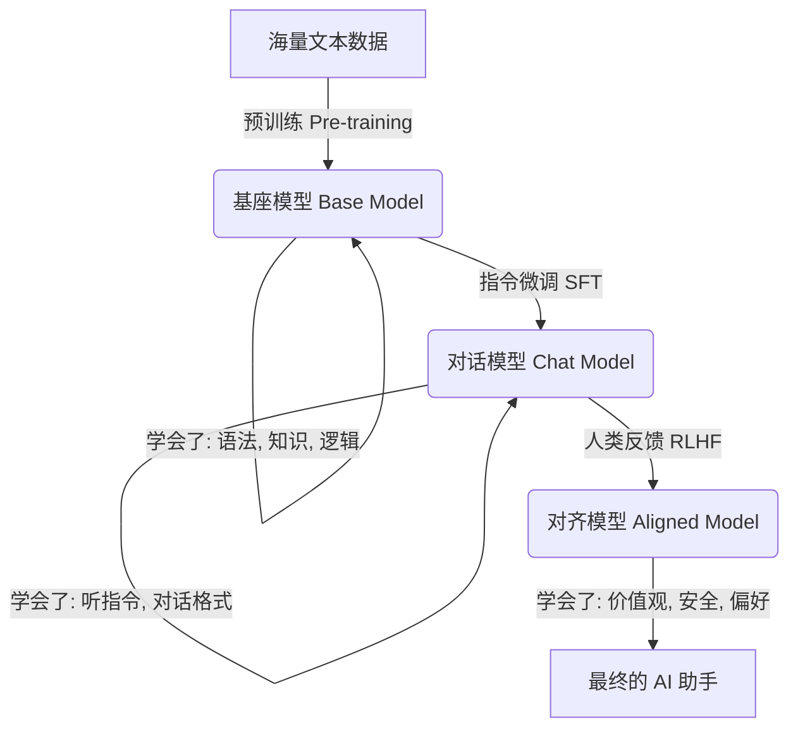

# AI 大模型全景深度解析：从神经元到世界模型

如果之前的解释让你觉得太浅，还在云里雾里，那么这篇文章将带你走进大模型的"引擎盖"下面。我们将不只是打比方，而是从**信息处理的本质**出发，系统地拆解大语言模型（LLM）是如何工作的。

大模型的本质，是一个**巨大的数学函数**。
$$ Y = F(X) $$
输入 $X$ 是你的一段话，输出 $Y$ 是接下来的一个字。
为了实现这个函数，LLM 经历了以下几个关键步骤：

---

## 第一阶段：如何把语言变成数学 (输入层)

计算机不认识中文或英文，它只认识数字。

### 1. Tokenization (切词)
这是第一步。模型并不按"字"读，而是按 "Token"（词元）读。
*   **英文**：Token 通常是一个单词或单词的一部分（如 "ing"）。
*   **中文**：通常是一个汉字或词组。

> **例子**：
> 输入："我喜欢AI"
> 转化：`["我", "喜欢", "AI"]` -> 查表 -> `[2301, 567, 102]`
> 此时，这句话变成了一串整数 ID。

### 2. Embedding (词嵌入) —— 赋予数字意义
如果只用 ID（如 2301），计算机无法理解"苹果"和"梨"是相似的，而"苹果"和"卡车"是不相关的。
**Embedding** 是把每个 Token 映射到一个**高维向量空间**中。

想象一个巨大的多维坐标系：
*   **苹果** 的坐标可能是 `[0.1, 0.5, 0.9, ...]`
*   **梨** 的坐标可能是 `[0.1, 0.6, 0.8, ...]` (距离很近)
*   **卡车** 的坐标可能是 `[0.9, -0.2, 0.1, ...]` (距离很远)

**神奇的数学性质**：
在这个空间里，意义是可以计算的。经典的例子是：
$$ \text{国王} - \text{男人} + \text{女人} \approx \text{女王} $$
模型通过这一步，把"符号"变成了"语义"。

---

## 第二阶段：大脑的运转 (Transformer 核心)

这是大模型最核心的部分。当一组向量进入 Transformer 后，会经过几十层（Layer）的处理。每一层主要做两件事：

### 1. Self-Attention (自注意力机制) —— 寻找上下文关联
这是 Transformer 的灵魂。它的作用是解决**"这就话里的这个词，和那句话里的那个词有什么关系？"**

想象你在读侦探小说，读到"凶手"这个词时，你的大脑会立刻回忆起前文出现过的所有嫌疑人。
Attention 机制就是在做这件事：
*   它让每个 Token 都能"看"到句子里的其他所有 Token。
*   它计算每两个 Token 之间的**相关性权重**。

> **Q: Query (查询)**：我在找什么？
> **K: Key (索引)**：你有什么特征？
> **V: Value (内容)**：你的具体信息是什么？

如果 "it" (Query) 和 "animal" (Key) 的匹配度很高，那么 "it" 就会吸收 "animal" 的信息 (Value)。这样，模型就理解了指代关系和长距离依赖。

### 2. Feed-Forward Networks (前馈神经网络) —— 知识的存储与加工
如果说 Attention 是在"路由"信息，那么前馈网络（FFN）就是在"思考"和"记忆"。
大部分的**事实性知识**（比如"巴黎是法国的首都"）被认为存储在这些神经网络的权重参数中。

---

## 第三阶段：训练 (Training) —— 压缩人类知识

模型是如何获得这些权重参数的？通过**自监督学习 (Self-Supervised Learning)**。

### 1. 猜词游戏 (Next Token Prediction)
我们不需要人工标注数据，只需要把互联网上的书、文章、代码喂给它。
训练过程很简单：
1.  遮住句子的最后一个词。
2.  让模型猜这个词是什么。
3.  **计算损失 (Loss)**：如果模型猜错了（比如原文是"天气晴"，模型猜"天气雨"），就产生一个"误差值"。
4.  **反向传播 (Backpropagation)**：根据这个误差，微调模型里数千亿个参数，让它下次猜得更准一点。

这个过程重复万亿次后，模型就"压缩"了全人类的语言规律和知识。

---

## 第四阶段：推理 (Inference) —— 生成回答

当你和 ChatGPT 聊天时，发生的是**推理**过程。

### 概率分布 (Probability Distribution)
模型算完后，输出的不是一个确定的词，而是一个**概率列表**：
*   "好"：60%
*   "棒"：30%
*   "行"：9%
*   "坏"：1%

### 采样策略 (Sampling)
*   **Greedy Search**：每次只选概率最大的词。优点是稳定，缺点是容易死板、重复。
*   **Temperature (温度)**：
    *   **温度低 (0.1)**：倾向于选高概率词，回答严谨、准确。
    *   **温度高 (0.8)**：有机会选中低概率词，回答更有创造力，但也更容易胡说八道（幻觉）。

---

## 第五阶段：从"懂语言"到"懂人类" (Alignment)

刚预训练完的基座模型（Base Model）其实很难用。
如果你问它："如何毁灭世界？"
它可能会接着写："毁灭世界的一百种方法..."（因为它在做文本续写）。

为了让它成为助手，需要后两步：
1.  **SFT (监督微调)**：给它看高质量的对话数据（"问题" + "标准答案"），教它通过对话模式来交互。
2.  **RLHF (人类反馈强化学习)**：
    *   模型生成两个回答。
    *   人类标记：A 比 B 好。
    *   训练一个"裁判模型"（Reward Model）来模仿人类的喜好。
    *   用这个裁判模型去惩罚或奖励大模型，让它学会"诚实、无害、有帮助"。

---

## 总结一张图

这就是大模型的全景。它不是魔法，它是**统计学、线性代数和算力**的暴力美学。
