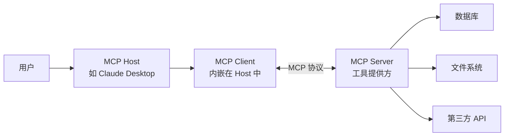
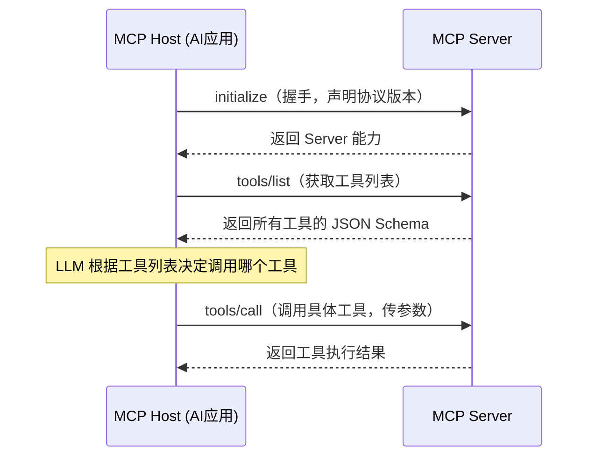

# MCP 完全指南：让 AI 真正连接世界的协议

你有没有遇到过这样的场景：你对 Claude 或 GPT 说"帮我查一下我们数据库里今天的订单"，它却只能回答"对不起，我无法访问您的数据库"？

这不是 LLM 不够聪明，而是它根本没有**连接外部世界的标准通道**。

**Model Context Protocol（MCP）** 就是为了解决这个问题而生的。它是由 Anthropic 于 2024 年 11 月开源的协议，定义了 AI 模型与外部工具、数据源之间通信的标准方式——就像 AI 世界里的 USB 接口。

---

## 1. 为什么需要 MCP？

### 1.1 没有 MCP 时的困境

在 MCP 出现之前，如果你想让 AI 助手调用你的内部系统，唯一的办法是**手动实现 Function Calling**：

```python
# 传统做法：为每个 LLM 分别实现工具调用
def call_openai_with_tools(query):
    tools = [
        {
            "type": "function",
            "function": {
                "name": "query_database",
                "description": "查询数据库",
                "parameters": {
                    "type": "object",
                    "properties": {
                        "sql": {"type": "string"}
                    }
                }
            }
        }
    ]
    # OpenAI 的格式
    response = openai.chat.completions.create(
        model="gpt-4",
        messages=[{"role": "user", "content": query}],
        tools=tools
    )
    # ... 手动处理 tool_calls 响应

def call_claude_with_tools(query):
    # Claude 有自己的格式，要重新写一遍
    # ...
```

这带来了三个痛点：

1. **碎片化**：每个 LLM 的工具调用格式不同，同一个工具要为每个模型写一套
2. **不可复用**：你在 A 项目里写的数据库工具，B 项目无法直接复用
3. **维护成本高**：工具逻辑和 AI 调用逻辑混在一起，迭代困难

### 1.2 MCP 的解法：标准化

MCP 的核心思路非常简单：**把工具从 AI 里解耦出来，定义一套统一的通信协议**。

```
没有 MCP（紧耦合）：
  Claude ──自定义代码──> 数据库工具
  GPT-4  ──自定义代码──> 数据库工具（重复实现）
  Gemini ──自定义代码──> 数据库工具（再重复实现）

有了 MCP（松耦合）：
  Claude ──MCP──> MCP Server（数据库工具）
  GPT-4  ──MCP──> MCP Server（同一个 Server，直接复用）
  Gemini ──MCP──> MCP Server（同一个 Server）
```

一次实现，到处运行。

---

## 2. MCP 的核心架构

MCP 采用的是经典的 **Client-Server 架构**，但角色分工和你平时理解的可能有些不同：



### 2.1 三个角色

**MCP Host（宿主）**

运行 AI 模型、管理用户交互的应用程序，比如：
- Claude Desktop
- Cursor 编辑器
- 你自己开发的 AI 应用

Host 负责创建和管理 MCP Client 的生命周期。

**MCP Client（客户端）**

内嵌在 Host 中的协议客户端，负责与 MCP Server 建立连接、发送请求、接收响应。通常一个 Client 对应一个 Server。

**MCP Server（服务端）**

这是你作为开发者最常打交道的部分。Server 向外暴露以下三类能力：

| 能力类型 | 说明 | 典型场景 |
| :--- | :--- | :--- |
| **Tools（工具）** | 可被 AI 调用的函数，有副作用 | 执行 SQL、调用 API、写文件 |
| **Resources（资源）** | 只读数据，供 AI 读取上下文 | 读取文件、获取数据库 schema |
| **Prompts（提示词模板）** | 预定义的提示词，带参数 | 标准化的代码审查提示词 |

### 2.2 通信机制

MCP 使用 **JSON-RPC 2.0** 作为消息格式，支持两种传输方式：

**Stdio（标准输入输出）**

本地进程间通信，适合本地工具：

```
Host 进程 ──stdin/stdout──> MCP Server 子进程
```

**HTTP + SSE（Server-Sent Events）**

远程通信，适合云端服务或多客户端共享场景：

```
MCP Client ──HTTP POST──> MCP Server
MCP Server ──SSE 推送──> MCP Client（实时响应）
```

---

## 3. MCP 协议消息格式

了解底层格式有助于调试和理解协议的工作方式。

### 3.1 工具调用流程

一次完整的工具调用包含以下几个步骤：



### 3.2 JSON-RPC 消息示例

```json
// 1. Host 请求工具列表
{
  "jsonrpc": "2.0",
  "id": 1,
  "method": "tools/list"
}

// 2. Server 返回工具列表
{
  "jsonrpc": "2.0",
  "id": 1,
  "result": {
    "tools": [
      {
        "name": "query_orders",
        "description": "查询订单数据",
        "inputSchema": {
          "type": "object",
          "properties": {
            "date": {
              "type": "string",
              "description": "查询日期，格式 YYYY-MM-DD"
            },
            "status": {
              "type": "string",
              "enum": ["pending", "paid", "shipped"]
            }
          },
          "required": ["date"]
        }
      }
    ]
  }
}

// 3. Host 调用工具
{
  "jsonrpc": "2.0",
  "id": 2,
  "method": "tools/call",
  "params": {
    "name": "query_orders",
    "arguments": {
      "date": "2026-05-14",
      "status": "pending"
    }
  }
}

// 4. Server 返回结果
{
  "jsonrpc": "2.0",
  "id": 2,
  "result": {
    "content": [
      {
        "type": "text",
        "text": "查询到 23 条待支付订单，总金额 ¥15,680"
      }
    ]
  }
}
```

---

## 4. 动手写一个 MCP Server

理论够了，来实战。我们用 Python 写一个简单的"天气查询" MCP Server。

### 4.1 安装依赖

```bash
pip install mcp
```

`mcp` 是 Anthropic 官方发布的 Python SDK，已包含 Server 框架和传输层实现。

### 4.2 最简单的 MCP Server

```python
# weather_server.py
from mcp.server import Server
from mcp.server.stdio import stdio_server
from mcp.types import Tool, TextContent
import json

# 创建 Server 实例
app = Server("weather-server")

# 注册工具列表
@app.list_tools()
async def list_tools() -> list[Tool]:
    return [
        Tool(
            name="get_weather",
            description="获取指定城市的当前天气",
            inputSchema={
                "type": "object",
                "properties": {
                    "city": {
                        "type": "string",
                        "description": "城市名称，如 '北京'、'上海'"
                    }
                },
                "required": ["city"]
            }
        )
    ]

# 实现工具调用逻辑
@app.call_tool()
async def call_tool(name: str, arguments: dict) -> list[TextContent]:
    if name == "get_weather":
        city = arguments["city"]
        # 实际项目中这里会调用真实的天气 API
        # 这里用模拟数据演示
        weather_data = {
            "北京": {"temp": "22°C", "condition": "晴", "humidity": "45%"},
            "上海": {"temp": "28°C", "condition": "多云", "humidity": "70%"},
            "广州": {"temp": "32°C", "condition": "阵雨", "humidity": "85%"},
        }
        
        if city not in weather_data:
            return [TextContent(type="text", text=f"暂不支持查询 {city} 的天气")]
        
        w = weather_data[city]
        result = f"{city}天气：{w['condition']}，温度 {w['temp']}，湿度 {w['humidity']}"
        return [TextContent(type="text", text=result)]
    
    return [TextContent(type="text", text=f"未知工具：{name}")]

# 启动 Server（stdio 模式）
if __name__ == "__main__":
    import asyncio
    asyncio.run(stdio_server(app))
```

就这么多。约 50 行代码，一个功能完整的 MCP Server 就写好了。

### 4.3 接入 Claude Desktop 测试

将上面的 Server 配置到 Claude Desktop（`claude_desktop_config.json`）：

```json
{
  "mcpServers": {
    "weather": {
      "command": "python",
      "args": ["/path/to/weather_server.py"]
    }
  }
}
```

重启 Claude Desktop 后，你就可以直接对 Claude 说"北京今天天气怎么样"，它会自动调用你的 Server。

:::tip
Claude Desktop 的配置文件路径：
- macOS：`~/Library/Application Support/Claude/claude_desktop_config.json`
- Windows：`%APPDATA%\Claude\claude_desktop_config.json`
:::

### 4.4 加入 Resources（只读数据）

除了 Tools，Server 还可以提供 Resources——供 AI 读取上下文用的静态或动态数据：

```python
from mcp.types import Resource
import pathlib

# 注册资源列表
@app.list_resources()
async def list_resources() -> list[Resource]:
    return [
        Resource(
            uri="file:///config/cities.json",
            name="支持的城市列表",
            description="返回所有支持天气查询的城市",
            mimeType="application/json"
        )
    ]

# 实现资源读取
@app.read_resource()
async def read_resource(uri: str) -> str:
    if uri == "file:///config/cities.json":
        cities = ["北京", "上海", "广州", "深圳", "杭州"]
        return json.dumps({"cities": cities}, ensure_ascii=False)
    raise ValueError(f"未知资源：{uri}")
```

AI 可以先读取城市列表作为上下文，再决定是否调用天气查询工具。

---

## 5. 用 TypeScript 写 MCP Server

如果你更熟悉 JavaScript 生态，官方也提供了 TypeScript SDK：

```bash
npm install @modelcontextprotocol/sdk
```

```typescript
// weather-server.ts
import { Server } from '@modelcontextprotocol/sdk/server/index.js';
import { StdioServerTransport } from '@modelcontextprotocol/sdk/server/stdio.js';
import {
  CallToolRequestSchema,
  ListToolsRequestSchema,
} from '@modelcontextprotocol/sdk/types.js';

const server = new Server(
  { name: 'weather-server', version: '1.0.0' },
  { capabilities: { tools: {} } }
);

// 注册工具列表
server.setRequestHandler(ListToolsRequestSchema, async () => ({
  tools: [
    {
      name: 'get_weather',
      description: '获取指定城市的当前天气',
      inputSchema: {
        type: 'object',
        properties: {
          city: { type: 'string', description: '城市名称' },
        },
        required: ['city'],
      },
    },
  ],
}));

// 实现工具调用
server.setRequestHandler(CallToolRequestSchema, async (request) => {
  const { name, arguments: args } = request.params;

  if (name === 'get_weather') {
    const city = args?.city as string;
    // 模拟天气数据
    const result = `${city}：晴，22°C，湿度 45%`;
    return {
      content: [{ type: 'text', text: result }],
    };
  }

  throw new Error(`未知工具：${name}`);
});

// 启动
const transport = new StdioServerTransport();
await server.connect(transport);
```

---

## 6. Resources vs Tools vs Prompts 的使用场景

这三种能力经常让人困惑，这里明确区分一下：

### Tools（工具）—— 有副作用的操作

适合：执行动作、写入数据、调用外部 API

```python
# ✅ 适合作为 Tool
@app.call_tool()
async def call_tool(name, args):
    if name == "create_order":
        # 向数据库写入订单（有副作用）
        order_id = db.insert_order(args)
        return [TextContent(type="text", text=f"订单创建成功：{order_id}")]
    
    if name == "send_email":
        # 发送邮件（有副作用）
        email.send(args["to"], args["subject"], args["body"])
        return [TextContent(type="text", text="邮件已发送")]
```

### Resources（资源）—— 无副作用的只读数据

适合：给 AI 提供背景知识、配置信息、文档

```python
# ✅ 适合作为 Resource
@app.read_resource()
async def read_resource(uri):
    if uri == "db://schema":
        # 返回数据库结构（只读，供 AI 了解数据结构）
        return get_database_schema()
    
    if uri == "docs://api-reference":
        # 返回 API 文档（只读）
        return read_file("api-reference.md")
```

### Prompts（提示词模板）—— 可复用的提示词

适合：标准化任务的提示词，带参数

```python
from mcp.types import Prompt, PromptMessage

@app.list_prompts()
async def list_prompts():
    return [
        Prompt(
            name="code_review",
            description="代码审查提示词模板",
            arguments=[
                {"name": "language", "description": "编程语言", "required": True},
                {"name": "focus", "description": "审查重点", "required": False},
            ]
        )
    ]

@app.get_prompt()
async def get_prompt(name, arguments):
    if name == "code_review":
        lang = arguments.get("language", "代码")
        focus = arguments.get("focus", "代码质量、安全性和性能")
        return {
            "messages": [
                PromptMessage(
                    role="user",
                    content=TextContent(
                        type="text",
                        text=f"请对以下 {lang} 代码进行审查，重点关注：{focus}。\n\n{{code}}"
                    )
                )
            ]
        }
```

---

## 7. 完整实战：数据库查询 MCP Server

把前面学到的内容串起来，写一个真实可用的数据库查询 Server：

```python
# db_server.py
import sqlite3
import json
from mcp.server import Server
from mcp.server.stdio import stdio_server
from mcp.types import Tool, Resource, TextContent

app = Server("database-server")
DB_PATH = "orders.db"

# ── 初始化示例数据库 ──────────────────────────
def init_db():
    conn = sqlite3.connect(DB_PATH)
    conn.execute("""
        CREATE TABLE IF NOT EXISTS orders (
            id INTEGER PRIMARY KEY,
            customer TEXT,
            amount REAL,
            status TEXT,
            created_at TEXT
        )
    """)
    # 插入示例数据
    conn.execute("INSERT OR IGNORE INTO orders VALUES (1, '张三', 299.00, 'paid', '2026-05-14')")
    conn.execute("INSERT OR IGNORE INTO orders VALUES (2, '李四', 599.00, 'pending', '2026-05-14')")
    conn.commit()
    conn.close()

# ── Resources：提供 Schema 给 AI 了解数据结构 ──
@app.list_resources()
async def list_resources():
    return [
        Resource(
            uri="db://schema",
            name="数据库 Schema",
            description="查看所有表的结构，帮助 AI 生成正确的 SQL",
            mimeType="application/json"
        )
    ]

@app.read_resource()
async def read_resource(uri: str):
    if uri == "db://schema":
        conn = sqlite3.connect(DB_PATH)
        cursor = conn.execute("SELECT name FROM sqlite_master WHERE type='table'")
        tables = {}
        for (table_name,) in cursor.fetchall():
            col_cursor = conn.execute(f"PRAGMA table_info({table_name})")
            tables[table_name] = [
                {"name": row[1], "type": row[2]} for row in col_cursor.fetchall()
            ]
        conn.close()
        return json.dumps(tables, ensure_ascii=False, indent=2)

# ── Tools：执行 SQL 查询 ──────────────────────
@app.list_tools()
async def list_tools():
    return [
        Tool(
            name="query_sql",
            description="执行 SQL SELECT 查询，返回结果。只允许 SELECT 语句。",
            inputSchema={
                "type": "object",
                "properties": {
                    "sql": {
                        "type": "string",
                        "description": "要执行的 SQL SELECT 语句"
                    }
                },
                "required": ["sql"]
            }
        ),
        Tool(
            name="get_order_summary",
            description="获取今日订单汇总：总数、总金额、各状态数量",
            inputSchema={
                "type": "object",
                "properties": {
                    "date": {
                        "type": "string",
                        "description": "日期，格式 YYYY-MM-DD，默认今天"
                    }
                }
            }
        )
    ]

@app.call_tool()
async def call_tool(name: str, arguments: dict):
    conn = sqlite3.connect(DB_PATH)
    
    try:
        if name == "query_sql":
            sql = arguments["sql"].strip()
            # 安全检查：只允许 SELECT
            if not sql.upper().startswith("SELECT"):
                return [TextContent(type="text", text="错误：只允许执行 SELECT 语句")]
            
            cursor = conn.execute(sql)
            columns = [desc[0] for desc in cursor.description]
            rows = cursor.fetchall()
            
            # 格式化为表格
            result = f"查询返回 {len(rows)} 条记录\n\n"
            result += " | ".join(columns) + "\n"
            result += "-" * 40 + "\n"
            for row in rows[:20]:  # 最多返回 20 条
                result += " | ".join(str(v) for v in row) + "\n"
            
            return [TextContent(type="text", text=result)]
        
        elif name == "get_order_summary":
            date = arguments.get("date", "2026-05-14")
            cursor = conn.execute(
                "SELECT status, COUNT(*) as cnt, SUM(amount) as total "
                "FROM orders WHERE created_at = ? GROUP BY status",
                (date,)
            )
            rows = cursor.fetchall()
            
            summary = f"{date} 订单汇总：\n"
            total_count = total_amount = 0
            for status, cnt, total in rows:
                summary += f"  - {status}: {cnt} 笔，¥{total:.2f}\n"
                total_count += cnt
                total_amount += total
            summary += f"\n合计：{total_count} 笔，¥{total_amount:.2f}"
            
            return [TextContent(type="text", text=summary)]
    
    finally:
        conn.close()
    
    return [TextContent(type="text", text=f"未知工具：{name}")]

if __name__ == "__main__":
    import asyncio
    init_db()
    asyncio.run(stdio_server(app))
```

现在你可以对 AI 说：

- "帮我查一下今天的订单汇总" → 调用 `get_order_summary`
- "查出所有待支付的订单" → AI 先读 Schema，再生成 SQL 调用 `query_sql`
- "orders 表里金额最高的 5 笔是什么" → 同上

---

## 8. 常见问题与注意事项

### 8.1 工具描述要写清楚

LLM 靠 `description` 字段来决定是否调用某个工具，以及如何传参。描述越清晰，AI 的判断越准确：

```python
# ❌ 描述模糊，AI 容易误用
Tool(name="get_data", description="获取数据")

# ✅ 描述具体，AI 能精确判断使用时机和参数格式
Tool(
    name="query_orders_by_date",
    description="查询指定日期范围内的订单列表。返回订单 ID、客户名、金额和状态。"
                "日期格式必须是 YYYY-MM-DD。",
    ...
)
```

### 8.2 工具返回结果要结构化

返回自然语言 + 结构化数据，让 AI 更容易理解和再次使用结果：

```python
# ❌ 只返回原始 JSON，AI 难以用自然语言描述给用户
return [TextContent(type="text", text=json.dumps(raw_data))]

# ✅ 返回人类可读的摘要 + 原始数据
summary = f"找到 {len(orders)} 条订单，总金额 ¥{total:.2f}"
detail = json.dumps(orders, ensure_ascii=False)
return [
    TextContent(type="text", text=summary),
    TextContent(type="text", text=detail)
]
```

### 8.3 错误处理要给 AI 足够信息

```python
@app.call_tool()
async def call_tool(name, args):
    try:
        result = do_something(args)
        return [TextContent(type="text", text=result)]
    except ValueError as e:
        # 告诉 AI 参数有问题，它会自动修正后重试
        return [TextContent(
            type="text",
            text=f"参数错误：{e}。请检查参数格式后重试。"
        )]
    except Exception as e:
        # 严重错误，明确告知 AI 无法继续
        return [TextContent(
            type="text",
            text=f"服务内部错误，请联系管理员：{type(e).__name__}: {e}"
        )]
```

### 8.4 避免在 Tool 里做过重的操作

Tools 是同步调用的，执行时间过长会导致 AI 超时。如果有耗时操作：

- 大数据量查询：加 LIMIT，分批返回
- 文件生成：异步写入，返回"任务已提交"
- 外部 API：设置合理超时，做好降级

:::warning
MCP 目前（2025 年）尚在快速演进阶段，协议细节可能随版本更新而变化。生产使用时注意锁定 SDK 版本，关注官方 changelog。
:::

### 8.5 本地 Server 与远程 Server 的选型

| 场景 | 推荐方式 | 原因 |
| :--- | :--- | :--- |
| 个人开发工具、本机文件操作 | Stdio | 无需网络，零配置，权限好控制 |
| 团队共享、云端数据源 | HTTP + SSE | 多客户端同时接入，便于集中部署 |
| 需要认证授权 | HTTP + SSE | 可在 HTTP 层加 Token 验证 |

---

## 9. 生态与现有 MCP Server 资源

你不一定每次都要从头写 Server。MCP 社区已经积累了大量开箱即用的实现：

**官方维护（Anthropic）：**
- `filesystem` — 本地文件读写
- `github` — GitHub 仓库操作
- `google-drive` — Google Drive 文件访问
- `postgres` — PostgreSQL 查询
- `sqlite` — SQLite 数据库操作
- `brave-search` — Brave 搜索引擎
- `memory` — 持久化记忆存储

**社区维护：**
- `mcp-server-mysql` — MySQL 支持
- `mcp-server-redis` — Redis 操作
- `mcp-server-kubernetes` — K8s 集群管理
- `mcp-server-docker` — Docker 容器管理

使用方式都是在 `claude_desktop_config.json` 里加几行配置，非常方便。

:::note
所有官方 Server 的源码都在 `github.com/modelcontextprotocol/servers` 仓库，是很好的学习参考。
:::

---

## 总结

MCP 的意义在于**标准化 AI 与外部世界的连接方式**。它把原本散乱的工具调用实现统一成一套协议，让：

- **开发者**只需写一次 Server，就能服务于所有支持 MCP 的 AI 客户端
- **AI 应用**专注自身逻辑，通过配置接入任意能力
- **工具生态**像 npm 包一样可发现、可复用、可组合

如果你在构建 AI 应用，或者想把自己的系统能力暴露给 AI 使用，MCP 是目前最值得投入的标准。

::: details 参考资料
- [MCP 官方文档](https://modelcontextprotocol.io/docs)
- [MCP Python SDK](https://github.com/modelcontextprotocol/python-sdk)
- [MCP TypeScript SDK](https://github.com/modelcontextprotocol/typescript-sdk)
- [官方 Server 示例集合](https://github.com/modelcontextprotocol/servers)
:::
