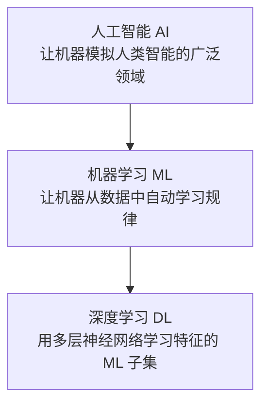
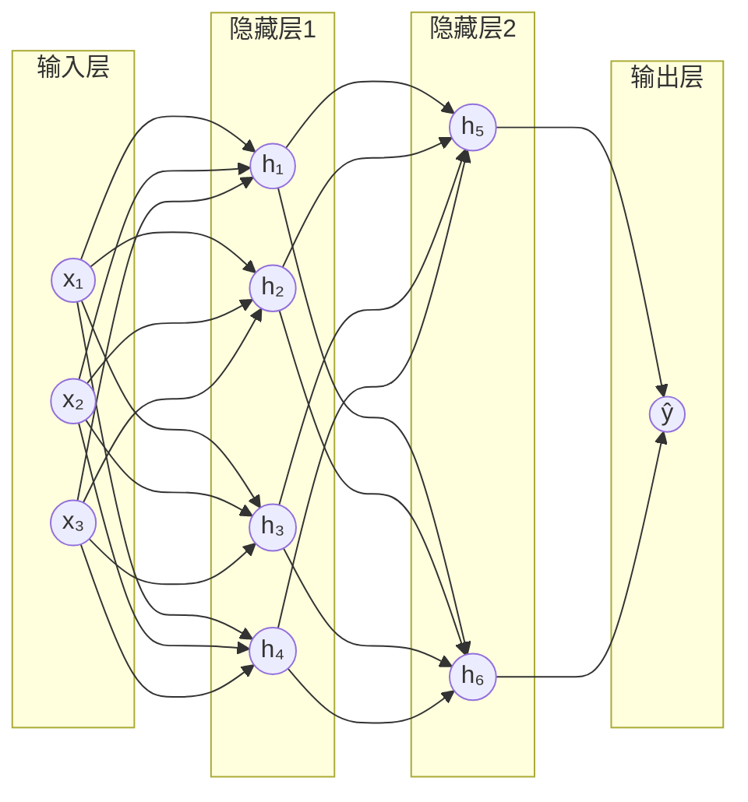
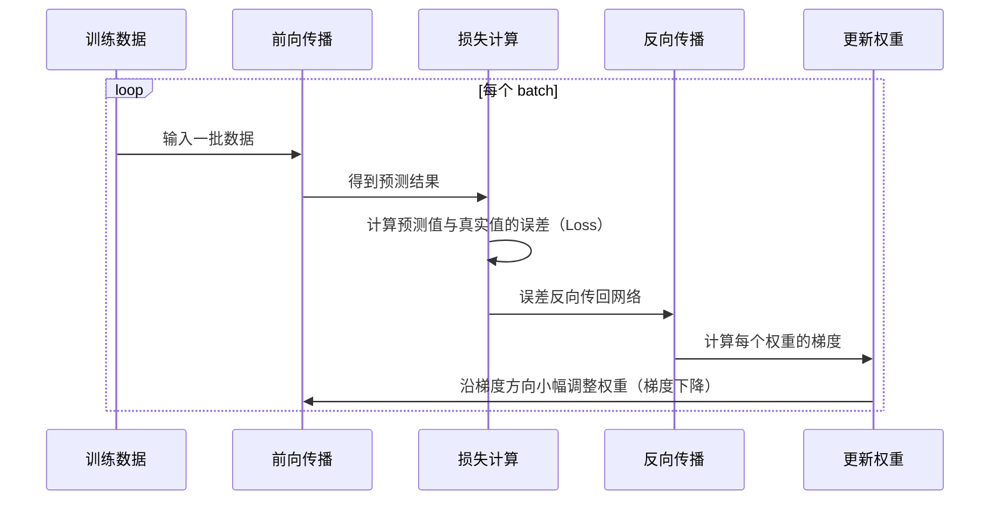
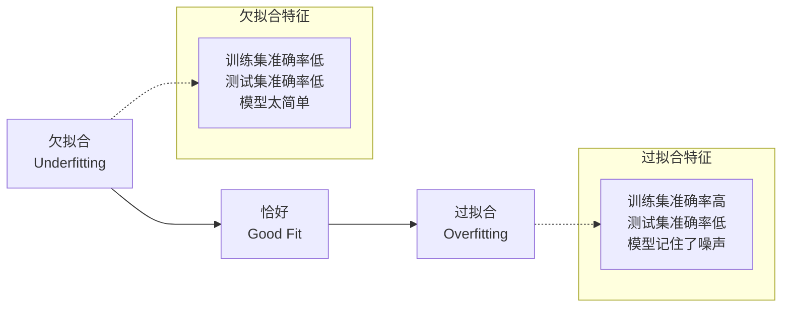
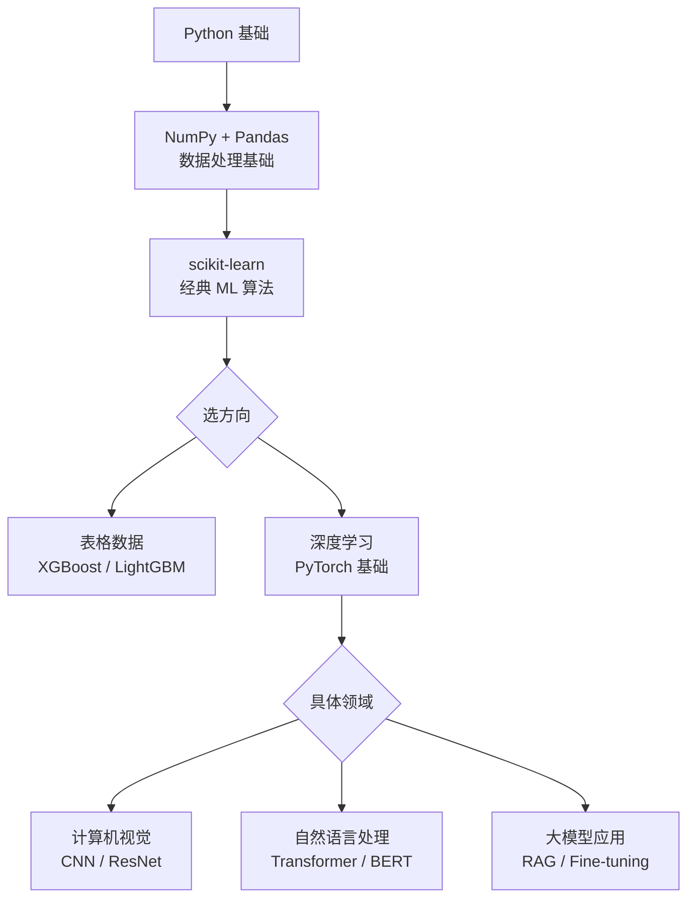

# ML 与 DL 全景入门：从零建立机器学习的完整认知

"机器学习"和"深度学习"这两个词出现得太频繁，以至于很多人分不清它们的关系，也不知道什么时候该用哪个。

这篇文章的目标是帮你建立一张**完整的认知地图**：ML 和 DL 分别是什么、关系如何、各自适合什么问题、核心原理是什么，以及如何用代码真正跑起来一个模型。

---

## 一、三个概念的关系：AI ⊃ ML ⊃ DL

很多人把这三个词混用，实际上它们是包含关系：



- **AI（人工智能）**：最大的概念，包括规则引擎、专家系统、搜索算法等所有让机器"表现智能"的方法
- **ML（机器学习）**：AI 的一个子领域，核心思想是"不手写规则，让机器从数据里自己学"
- **DL（深度学习）**：ML 的一个子集，用多层神经网络来学习，特别擅长处理图像、语音、文本等非结构化数据

一句话总结：**深度学习是机器学习的一种方法，机器学习是实现 AI 的一种途径。**

---

## 二、机器学习是什么：让数据说话

传统编程的逻辑是：**输入 + 规则 → 输出**

```python
# 传统方法：手写规则判断垃圾邮件
def is_spam(email: str) -> bool:
    keywords = ["免费", "中奖", "点击领取", "限时优惠"]
    return any(kw in email for kw in keywords)
```

这个方法的问题是：规则永远写不完，垃圾邮件会绕过规则。

机器学习的思路是：**输入 + 输出 → 让机器自己找规则**

```python
# 机器学习方法：给模型看大量带标签的邮件，它自己学出规律
from sklearn.naive_bayes import MultinomialNB

model = MultinomialNB()
model.fit(X_train_emails, y_train_labels)  # 让模型从数据里学

# 模型自己总结出了规律，不需要手写 if/else
prediction = model.predict(["限时免费领取优惠券"])  # → [1] 垃圾邮件
```

### 机器学习的三个要素

任何一个 ML 问题都可以拆成三个部分：

```
数据（Data）+ 模型（Model）+ 目标（Objective）
```

- **数据**：模型的"教材"，质量决定上限
- **模型**：学习数据规律的数学函数，如线性回归、决策树、神经网络
- **目标**：衡量模型好坏的指标，如分类准确率、预测误差

---

## 三、ML 的三大学习范式

根据数据是否有标签，机器学习分为三种范式：

### 3.1 监督学习（Supervised Learning）

**数据有标签**，模型学习"输入 → 输出"的映射关系。

```
输入: 房屋面积、地段、楼层    输出: 房价（回归）
输入: 邮件内容               输出: 垃圾/正常（分类）
```

日常用得最多的就是监督学习，绝大多数实际业务问题都属于这类。

### 3.2 无监督学习（Unsupervised Learning）

**数据没有标签**，让模型自己发现数据中的结构和规律。

```
输入: 10 万用户的行为数据    → 聚类：发现用户可以分成 5 类群体
输入: 高维特征               → 降维：压缩到 2 维便于可视化
```

### 3.3 强化学习（Reinforcement Learning）

**智能体通过和环境交互、获得奖惩来学习策略**，不依赖标注数据。

```
游戏 AI 学下围棋：
  每走一步 → 得到反馈（赢了 +1，输了 -1）→ 调整策略 → 循环
```

AlphaGo、ChatGPT 的 RLHF（人类反馈强化学习）都属于这一类。

---

## 四、经典 ML 算法全景

### 4.1 线性回归：最简单的起点

**适合场景**：预测连续数值，如价格、销量、温度。

核心思想：找一条直线（或超平面），使预测值和真实值的误差最小。

```python
import numpy as np
from sklearn.linear_model import LinearRegression
from sklearn.model_selection import train_test_split
from sklearn.metrics import mean_squared_error

# 模拟数据：房屋面积（平方米）→ 房价（万元）
np.random.seed(42)
X = np.random.uniform(50, 200, 200).reshape(-1, 1)  # 面积
y = X.flatten() * 0.8 + np.random.normal(0, 10, 200)  # 房价（含噪声）

X_train, X_test, y_train, y_test = train_test_split(X, y, test_size=0.2)

model = LinearRegression()
model.fit(X_train, y_train)

y_pred = model.predict(X_test)
rmse = mean_squared_error(y_test, y_pred) ** 0.5

print(f"斜率（每平方米价格）: {model.coef_[0]:.2f} 万元")
print(f"截距: {model.intercept_:.2f}")
print(f"测试集 RMSE: {rmse:.2f} 万元")
```

### 4.2 决策树：可解释的规则树

**适合场景**：分类或回归，需要可解释性（能看懂模型在做什么判断）。

核心思想：不断用特征把数据切分，直到每个子集尽量"纯"（只包含一个类别）。

```python
from sklearn.tree import DecisionTreeClassifier, export_text
from sklearn.datasets import load_iris

# 用经典的鸢尾花数据集
iris = load_iris()
X, y = iris.data, iris.target

model = DecisionTreeClassifier(max_depth=3, random_state=42)
model.fit(X, y)

# 打印决策规则，人类可读
print(export_text(model, feature_names=iris.feature_names))
# |--- petal length (cm) <= 2.45
# |   |--- class: 0          ← 花瓣长度 <= 2.45cm → setosa
# |--- petal length (cm) >  2.45
# |   |--- petal width (cm) <= 1.75
# |   |   |--- class: 1      ← 进一步按花瓣宽度分
# ...
```

### 4.3 随机森林：集成多棵决策树

**适合场景**：表格数据的分类/回归，效果稳定，不容易过拟合。

核心思想：训练很多棵决策树，每棵树只看部分数据和部分特征，最终投票决定结果。单棵树可能犯错，但大量树的投票结果往往更可靠——这就是"集成学习"的思想。

```python
from sklearn.ensemble import RandomForestClassifier
from sklearn.model_selection import cross_val_score

model = RandomForestClassifier(n_estimators=100, random_state=42)

# 交叉验证：更可靠地评估模型性能
scores = cross_val_score(model, X, y, cv=5, scoring="accuracy")
print(f"5 折交叉验证准确率: {scores.mean():.4f} ± {scores.std():.4f}")
# 5 折交叉验证准确率: 0.9667 ± 0.0211
```

### 4.4 算法选型参考

| 算法 | 适合数据 | 优点 | 缺点 |
|---|---|---|---|
| 线性回归 | 数值预测，特征和目标近似线性 | 简单、快、可解释 | 只能拟合线性关系 |
| 逻辑回归 | 二分类 | 输出概率，可解释 | 线性边界 |
| 决策树 | 表格数据，需要解释性 | 规则直观可读 | 容易过拟合 |
| 随机森林 | 表格数据（通用） | 稳定，不易过拟合 | 黑盒，速度中等 |
| XGBoost/LightGBM | 表格数据（竞赛首选） | 效果最好 | 调参复杂 |
| SVM | 中小规模，高维特征 | 理论性强 | 大数据集慢 |
| K-Means | 无监督聚类 | 简单直观 | 需要指定 K |

:::tip
**表格数据首选随机森林或 XGBoost**，不要上来就用神经网络。经典 ML 算法在结构化数据上往往比深度学习更快、效果更好，且更容易调试。
:::

---

## 五、深度学习：用神经网络学习特征

### 5.1 为什么需要深度学习

经典 ML 算法有一个隐含的前提：**特征需要人工设计**。

识别一张猫的图片，你需要告诉模型"看边缘、看纹理、看形状"——但这些特征怎么提取，需要大量专业知识。

深度学习的突破在于：**特征可以自动学习**。

```
传统 ML：原始数据 → [人工提特征] → 特征向量 → 模型 → 预测
深度学习：原始数据 ──────────────────────────→ 模型 → 预测
                            ↑
                    网络自动学习特征
```

### 5.2 神经网络的基本结构

神经网络由**层（Layer）**组成，每层包含若干**神经元（Neuron）**：



每个神经元做的事情非常简单：

```
输出 = 激活函数( 输入₁×权重₁ + 输入₂×权重₂ + ... + 偏置 )
```

单个神经元很简单，但成千上万个神经元堆叠多层之后，整个网络就能拟合极其复杂的函数。

### 5.3 训练过程：前向传播 + 反向传播

神经网络的训练分两步循环执行：



- **前向传播**：数据从输入层流向输出层，得到预测值
- **损失函数（Loss）**：衡量预测值和真实值的差距，如均方误差（MSE）、交叉熵
- **反向传播**：用链式法则把误差从输出层反向传回，计算每个权重对误差的贡献（梯度）
- **梯度下降**：沿着梯度的反方向更新权重，让 Loss 逐步减小

---

## 六、用 PyTorch 实战：训练一个分类器

用 PyTorch 从零训练一个神经网络，分类鸢尾花数据集。

### 第一步：准备数据

```python
import torch
import torch.nn as nn
from torch.utils.data import DataLoader, TensorDataset
from sklearn.datasets import load_iris
from sklearn.model_selection import train_test_split
from sklearn.preprocessing import StandardScaler

# 加载数据
iris = load_iris()
X, y = iris.data.astype("float32"), iris.target

# 标准化：让每个特征均值为 0，方差为 1
# 神经网络对特征尺度很敏感，这步不能省
scaler = StandardScaler()
X = scaler.fit_transform(X)

X_train, X_test, y_train, y_test = train_test_split(X, y, test_size=0.2, random_state=42)

# 转成 PyTorch 张量
X_train_t = torch.tensor(X_train)
y_train_t = torch.tensor(y_train, dtype=torch.long)
X_test_t  = torch.tensor(X_test)
y_test_t  = torch.tensor(y_test, dtype=torch.long)

# DataLoader 自动分批，shuffle 打乱顺序防止模型记住顺序
train_loader = DataLoader(
    TensorDataset(X_train_t, y_train_t),
    batch_size=16,
    shuffle=True
)
```

### 第二步：定义网络结构

```python
class IrisNet(nn.Module):
    def __init__(self):
        super().__init__()
        self.net = nn.Sequential(
            nn.Linear(4, 16),    # 输入 4 个特征，输出 16 个神经元
            nn.ReLU(),           # 激活函数，引入非线性
            nn.Linear(16, 16),   # 隐藏层
            nn.ReLU(),
            nn.Linear(16, 3),    # 输出 3 个类别的得分（logits）
        )

    def forward(self, x):
        return self.net(x)

model = IrisNet()
print(model)
# IrisNet(
#   (net): Sequential(
#     (0): Linear(in_features=4, out_features=16, ...)
#     (1): ReLU()
#     (2): Linear(in_features=16, out_features=16, ...)
#     (3): ReLU()
#     (4): Linear(in_features=16, out_features=3, ...)
#   )
# )
```

### 第三步：训练

```python
# 损失函数：交叉熵（分类任务的标准选择）
criterion = nn.CrossEntropyLoss()
# 优化器：Adam（自适应学习率，比普通梯度下降收敛更快）
optimizer = torch.optim.Adam(model.parameters(), lr=1e-3)

def train_epoch(model, loader, criterion, optimizer):
    model.train()
    total_loss, correct = 0, 0
    for X_batch, y_batch in loader:
        optimizer.zero_grad()          # 清空上一步的梯度
        logits = model(X_batch)        # 前向传播
        loss = criterion(logits, y_batch)  # 计算损失
        loss.backward()                # 反向传播，计算梯度
        optimizer.step()               # 更新权重
        total_loss += loss.item()
        correct += (logits.argmax(1) == y_batch).sum().item()
    return total_loss / len(loader), correct / len(loader.dataset)

def evaluate(model, X, y):
    model.eval()
    with torch.no_grad():  # 评估时不需要计算梯度，节省内存
        logits = model(X)
        acc = (logits.argmax(1) == y).float().mean().item()
    return acc

# 训练 100 轮
for epoch in range(1, 101):
    loss, train_acc = train_epoch(model, train_loader, criterion, optimizer)
    if epoch % 20 == 0:
        test_acc = evaluate(model, X_test_t, y_test_t)
        print(f"Epoch {epoch:3d} | Loss: {loss:.4f} | Train Acc: {train_acc:.4f} | Test Acc: {test_acc:.4f}")

# Epoch  20 | Loss: 0.5123 | Train Acc: 0.8250 | Test Acc: 0.8333
# Epoch  40 | Loss: 0.2841 | Train Acc: 0.9167 | Test Acc: 0.9333
# Epoch  60 | Loss: 0.1632 | Train Acc: 0.9583 | Test Acc: 0.9667
# Epoch  80 | Loss: 0.1124 | Train Acc: 0.9750 | Test Acc: 0.9667
# Epoch 100 | Loss: 0.0891 | Train Acc: 0.9833 | Test Acc: 0.9667
```

---

## 七、过拟合与欠拟合：训练中最常见的问题

训练完一个模型，最重要的事是判断它有没有真正"学到"规律，还是只是"记住了"训练数据。



### 判断方法

```python
train_acc = evaluate(model, X_train_t, y_train_t)
test_acc  = evaluate(model, X_test_t, y_test_t)

gap = train_acc - test_acc
if train_acc < 0.8:
    print("可能欠拟合：增加模型复杂度，或训练更多轮")
elif gap > 0.1:
    print(f"可能过拟合：训练集 {train_acc:.2%} vs 测试集 {test_acc:.2%}，差距 {gap:.2%}")
else:
    print(f"拟合正常：训练 {train_acc:.2%}，测试 {test_acc:.2%}")
```

### 解决过拟合的常用手段

```python
class RegularizedNet(nn.Module):
    def __init__(self, dropout_rate=0.3):
        super().__init__()
        self.net = nn.Sequential(
            nn.Linear(4, 64),
            nn.ReLU(),
            nn.Dropout(dropout_rate),   # Dropout：随机丢弃部分神经元，防止过度依赖特定特征
            nn.Linear(64, 32),
            nn.ReLU(),
            nn.Dropout(dropout_rate),
            nn.Linear(32, 3),
        )
    def forward(self, x):
        return self.net(x)

# 配合 L2 正则（weight_decay）：惩罚权重过大
optimizer = torch.optim.Adam(
    model.parameters(),
    lr=1e-3,
    weight_decay=1e-4   # L2 正则系数
)
```

---

## 八、ML vs DL：怎么选

这是初学者最常问的问题。答案取决于**数据类型**和**数据量**：

| 场景 | 推荐 | 原因 |
|---|---|---|
| 表格数据（销量预测、风控、推荐） | **ML（XGBoost / 随机森林）** | 表格数据特征已经结构化，DL 优势不明显，ML 更快更好调 |
| 图像识别、目标检测 | **DL（CNN）** | 图像特征需要自动学习，人工提特征不现实 |
| 文本分类、NLP | **DL（Transformer）** | 语义理解需要深层网络，LLM 时代直接用预训练模型微调 |
| 语音识别、合成 | **DL（RNN / Transformer）** | 序列数据，DL 天然适合 |
| 数据量很少（< 1000 条） | **ML** | DL 需要大量数据，数据少时容易过拟合 |
| 需要可解释性（如金融、医疗） | **ML（决策树、逻辑回归）** | 能解释每个决策的依据 |

:::note
2024 年后，很多原本需要自己训 DL 模型的任务（文本分类、图像理解、代码生成）都可以直接用大模型 API 解决，不再需要自己从头训练。ML 和 DL 的价值更多体现在：数据量极大、实时推理、或需要完全定制的场景。
:::

---

## 九、学习路径建议



**第一阶段（1～2 周）**：把 scikit-learn 跑通，理解"数据 → 训练 → 评估 → 预测"的完整流程

**第二阶段（2～4 周）**：学 PyTorch 基础，理解张量、自动求导、训练循环

**第三阶段（按需）**：根据实际业务方向深入 CV / NLP / 大模型应用

:::tip
**最高效的学习方式是找一个真实问题来做**。选一个你实际有数据的场景（哪怕只是 Kaggle 上的竞赛数据集），从数据清洗到训练评估完整跑一遍，比看十篇教程都有效。
:::

---

## 总结

| | 机器学习（ML） | 深度学习（DL） |
|---|---|---|
| **特征** | 需要人工设计 | 网络自动学习 |
| **数据量** | 中小量即可（千~万级） | 通常需要大量数据（万~百万级） |
| **计算资源** | CPU 即可 | 通常需要 GPU |
| **可解释性** | 部分算法可解释 | 普遍黑盒 |
| **适合数据类型** | 表格/结构化数据 | 图像、语音、文本 |
| **代表工具** | scikit-learn, XGBoost | PyTorch, TensorFlow |

两者不是竞争关系，而是工具箱里的不同工具。**遇到表格数据先试 ML，遇到图像/文本考虑 DL，需要理解语义就直接用大模型 API**——这是 2025 年最务实的选型思路。

::: details 延伸阅读
- [scikit-learn 官方文档](https://scikit-learn.org/stable/user_guide.html)
- [PyTorch 官方教程（强烈推荐）](https://pytorch.org/tutorials/)
- [fast.ai 实践课（自顶向下学 DL）](https://course.fast.ai/)
- [Kaggle Learn（免费互动课程）](https://www.kaggle.com/learn)
- [《动手学深度学习》（李沐，中文，免费）](https://zh.d2l.ai/)
:::
