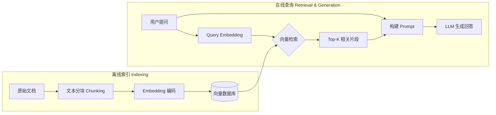
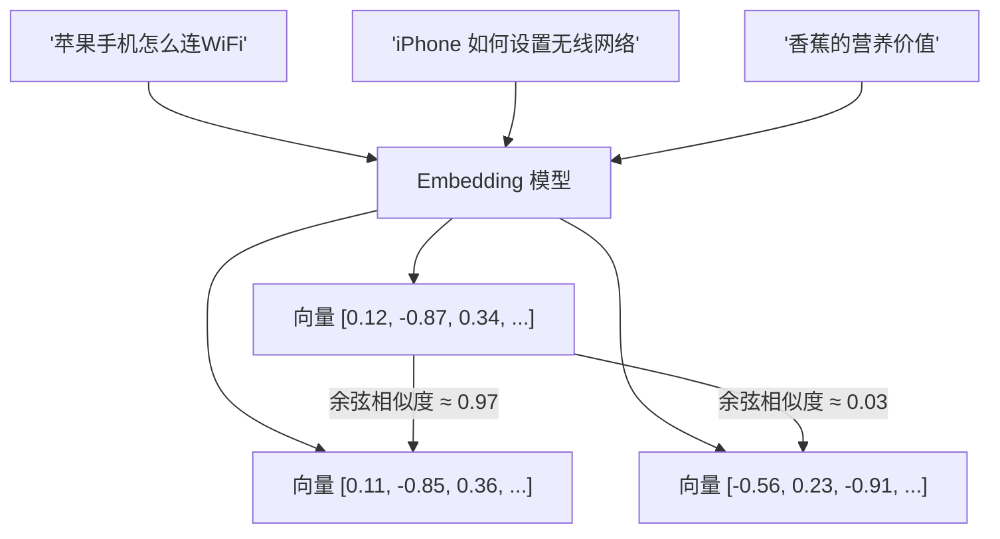
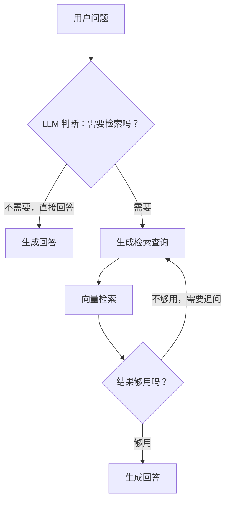

# 深入理解 RAG：让大模型用上你自己的知识库

你有没有遇到这类场景：

- 让 ChatGPT 回答公司内部系统的文档问题，它一问三不知
- 让模型分析最新发布的论文，它说"我的知识截止到 2024 年"
- 想让 AI 基于某份合同给出法律意见，但不敢直接贴进对话框

这些问题的核心是同一个：**大模型只有训练时见过的知识，它天然不知道你的私有数据。**

**RAG（Retrieval-Augmented Generation，检索增强生成）** 就是为了解决这件事。它不改变模型本身，而是在回答问题之前，先从你的知识库里检索出相关内容，再把这些内容连同问题一起送进模型，让模型"有据可查"地回答。

> 类比：RAG 就像开卷考试。模型不需要把所有知识背下来，考试时可以翻书找答案。

---

## 一、为什么不直接把所有文档放进 Prompt？

你可能会想：既然模型支持长上下文（比如 Claude 的 200K tokens），直接把文档全塞进去不就行了？

实际工程中这行不通，原因有几个：

**成本问题**：100 万字的文档每次都全量传输，API 费用会失控。

**精度问题**：模型在超长上下文中注意力会分散，["lost in the middle"](https://arxiv.org/abs/2307.03172) 问题表明，关键信息放在上下文中间时，模型的利用效率大幅下降。

**延迟问题**：超长 Prompt 的推理时间成倍增加，用户体验差。

**更新问题**：文档内容一旦变化，每次都要重新拼接，没有缓存机会。

RAG 用"先检索、再精选"的方式，只把最相关的片段喂给模型，在成本、精度和延迟上取得了更好的平衡。

---

## 二、RAG 的核心组件

一个完整的 RAG 系统由两条流水线组成：



### 2.1 文本分块（Chunking）

原始文档不能直接存入向量库，需要先切成适当大小的片段（chunk）。分块策略直接影响检索质量：

| 策略 | 适合场景 | 优缺点 |
|---|---|---|
| 固定字符数（如 512 字） | 快速上手 | 实现简单，但可能截断语义 |
| 按句子/段落分割 | 结构化文章 | 语义完整，大小不均匀 |
| 递归分割 | 通用场景（推荐） | 按换行→句子→词逐级回退 |
| 语义分块 | 高质量要求 | 用模型检测语义边界，成本高 |

:::tip
分块大小是个需要实验的超参数。一般建议 chunk_size 在 256～1024 tokens 之间，配合 overlap（重叠区域）避免边界处语义断裂。
:::

### 2.2 Embedding（向量化）

Embedding 模型把一段文本转换成一个高维向量（通常 768 ～ 3072 维），语义相近的文本在向量空间中距离也更近。



常用的 Embedding 模型：

- **OpenAI `text-embedding-3-small/large`**：效果好，调用方便
- **`BAAI/bge-m3`**：开源，中文效果出色，支持多语言
- **`sentence-transformers/all-MiniLM-L6-v2`**：轻量，适合本地部署

### 2.3 向量数据库

向量数据库专门用来存储和检索高维向量，支持近似最近邻（ANN）搜索，在海量向量中毫秒级找到最相似的 Top-K 条：

| 数据库 | 特点 |
|---|---|
| **Chroma** | 轻量，适合本地开发，Python 原生 |
| **Pinecone** | 托管服务，生产级可用 |
| **Weaviate** | 开源，支持混合检索 |
| **Milvus** | 大规模生产，高并发 |
| **pgvector** | PostgreSQL 扩展，无需额外基础设施 |

---

## 三、从零实现一个 Naive RAG

下面用 Python 实现一个最简单的 RAG，依赖：`openai`、`chromadb`、`tiktoken`。

### 第一步：文本分块

```python
import tiktoken

def chunk_text(text: str, chunk_size: int = 512, overlap: int = 64) -> list[str]:
    """
    按 token 数量分块，并在块之间保留 overlap 个 token 的重叠，
    避免语义在边界处断裂。
    """
    enc = tiktoken.get_encoding("cl100k_base")
    tokens = enc.encode(text)
    chunks = []
    start = 0

    while start < len(tokens):
        end = min(start + chunk_size, len(tokens))
        chunk_tokens = tokens[start:end]
        chunks.append(enc.decode(chunk_tokens))
        # 下一个块从 (end - overlap) 开始，形成滑动窗口
        start = end - overlap if end < len(tokens) else len(tokens)

    return chunks
```

### 第二步：构建向量索引

```python
import chromadb
from openai import OpenAI

client = OpenAI()
chroma = chromadb.Client()
collection = chroma.create_collection("my_docs")

def embed(texts: list[str]) -> list[list[float]]:
    """调用 OpenAI Embedding API，批量向量化文本。"""
    resp = client.embeddings.create(
        model="text-embedding-3-small",
        input=texts
    )
    return [item.embedding for item in resp.data]

def index_document(doc_text: str, doc_id: str):
    """把一份文档切块、向量化，然后存入 ChromaDB。"""
    chunks = chunk_text(doc_text)
    embeddings = embed(chunks)

    collection.add(
        ids=[f"{doc_id}_{i}" for i in range(len(chunks))],
        embeddings=embeddings,
        documents=chunks,
        # 存储原始文本，检索时直接返回
    )
    print(f"已索引 {len(chunks)} 个文本块")
```

### 第三步：检索 + 生成

```python
def rag_query(question: str, top_k: int = 5) -> str:
    """
    RAG 核心流程：
    1. 把问题向量化
    2. 从向量库检索 Top-K 相关片段
    3. 拼装 Prompt，调用 LLM 生成回答
    """
    # 1. 检索
    query_embedding = embed([question])[0]
    results = collection.query(
        query_embeddings=[query_embedding],
        n_results=top_k
    )
    retrieved_chunks = results["documents"][0]

    # 2. 构建 Prompt
    context = "\n\n---\n\n".join(retrieved_chunks)
    prompt = f"""你是一个知识库问答助手。请根据下面提供的参考资料回答用户的问题。
如果参考资料中没有相关信息，请明确说明"根据现有资料无法回答"，不要编造内容。

## 参考资料

{context}

## 用户问题

{question}

## 回答"""

    # 3. 生成
    response = client.chat.completions.create(
        model="gpt-4o-mini",
        messages=[{"role": "user", "content": prompt}],
        temperature=0.1,  # 降低随机性，保持准确
    )
    return response.choices[0].message.content


# 使用示例
document = """
RAG（Retrieval-Augmented Generation）是一种结合检索和生成的 AI 技术框架...
（此处省略文档内容）
"""
index_document(document, "rag_intro")
answer = rag_query("RAG 和微调有什么区别？")
print(answer)
```

:::note
上面的代码依赖 OpenAI API。如果需要完全本地化，可以用 `ollama` 替代 LLM，用 `sentence-transformers` 替代 Embedding API，用 `chromadb` 的持久化模式存储向量。
:::

---

## 四、Naive RAG 的局限

上面的实现能跑起来，但在生产中会遇到很多问题：

### 4.1 检索质量问题

**词汇鸿沟**：用户问"买了 AirPods 怎么连手机"，文档里写的是"蓝牙耳机配对步骤"——两者语义相近，但关键词差距很大，纯向量检索效果一般。

**解决方案：混合检索（Hybrid Search）** = 稀疏检索（BM25 关键词匹配）+ 稠密检索（向量相似度），再通过 RRF（Reciprocal Rank Fusion）融合两路排名。

```python
# 伪代码：混合检索
def hybrid_search(query: str, top_k: int = 10):
    # 向量检索
    dense_results = vector_search(query, top_k=top_k)
    # BM25 关键词检索
    sparse_results = bm25_search(query, top_k=top_k)
    # RRF 融合
    return reciprocal_rank_fusion(dense_results, sparse_results)
```

### 4.2 上下文窗口的利用

检索到 Top-K 片段后，直接全塞进 Prompt 不是最优策略：

- **Rerank（重排序）**：用专门的 Cross-Encoder 模型对检索结果做精排，去掉相关度低的片段
- **Contextual Compression**：让 LLM 从每个片段中只提取和问题直接相关的句子，压缩上下文

### 4.3 查询问题本身

用户提问往往模糊或不完整，直接拿用户原始问题做检索效果差：

- **Query Rewriting（查询改写）**：让 LLM 把模糊问题改写为更适合检索的形式
- **HyDE（Hypothetical Document Embeddings）**：先让 LLM 假设生成一段"理想答案"，再用这段假设答案去检索——因为答案比问题和文档语义更接近

```python
def hyde_query(question: str) -> str:
    """
    HyDE：先生成假设答案，再用假设答案做检索。
    适合问题和文档描述风格差异较大的场景。
    """
    hypothetical_answer = client.chat.completions.create(
        model="gpt-4o-mini",
        messages=[{
            "role": "user",
            "content": f"请针对以下问题写一段可能的答案（不需要准确，只需要风格接近文档）：\n{question}"
        }]
    ).choices[0].message.content

    # 用假设答案做向量检索
    return rag_query_with_text(hypothetical_answer, top_k=5)
```

---

## 五、RAG vs 微调：该选哪个？

这是工程中最常见的选型困惑：

| 维度 | RAG | 微调（Fine-tuning） |
|---|---|---|
| **知识更新** | 实时，改知识库即可 | 需要重新训练 |
| **幻觉控制** | 可引用来源，可验证 | 难以完全消除 |
| **实现成本** | 低，API + 向量库即可 | 高，需要数据标注 + GPU |
| **适合场景** | 私有文档问答、知识检索 | 改变输出风格、格式、行为 |
| **知识边界** | 明确（只回答检索到的内容） | 模糊（模型可能混合训练知识） |

:::important
大多数企业场景（内部文档、客服知识库、代码文档）优先选 RAG，而不是微调。微调更适合改变模型的输出格式或领域专用的语气，而不是注入具体知识。
:::

---

## 六、进阶：RAG 的演进方向

### 6.1 Modular RAG

把检索、排序、生成拆成独立模块，每个模块可以独立替换优化，形成更灵活的流水线。

### 6.2 Agentic RAG

让 LLM 自主决定"要不要检索"、"检索什么"、"检索几次"，而不是每次都无脑检索：



### 6.3 GraphRAG

微软提出的方案：先从文档中抽取实体和关系，构建知识图谱，检索时在图上做关联推理，特别适合需要跨文档关联分析的场景（如企业知识图谱、法律案例分析）。

---

## 七、评估 RAG 效果

RAG 系统上线前需要量化评估，常用框架是 [RAGAS](https://github.com/explodinggradients/ragas)，核心指标：

| 指标 | 含义 | 评估对象 |
|---|---|---|
| **Faithfulness** | 回答是否忠实于检索到的上下文，不编造 | 生成质量 |
| **Answer Relevancy** | 回答是否切题 | 生成质量 |
| **Context Precision** | 检索结果的精准率（噪声少不少） | 检索质量 |
| **Context Recall** | 检索结果的召回率（重要信息有没有找到） | 检索质量 |

```python
from ragas import evaluate
from ragas.metrics import faithfulness, answer_relevancy, context_precision

# 准备评估数据集
dataset = {
    "question": ["RAG 是什么？"],
    "answer": ["RAG 是检索增强生成..."],
    "contexts": [["RAG 全称 Retrieval-Augmented Generation..."]],
    "ground_truth": ["RAG（检索增强生成）是..."]
}

result = evaluate(dataset, metrics=[faithfulness, answer_relevancy, context_precision])
print(result)
```

---

## 总结

RAG 的核心思路很简单：**不让模型"背书"，而是让模型"查书"**。

| 阶段 | 关键决策点 |
|---|---|
| **分块** | chunk_size 和 overlap 需要根据文档类型调参 |
| **Embedding** | 中文场景优先选 bge-m3，通用场景选 OpenAI embedding |
| **检索** | 混合检索（向量 + BM25）优于单一检索 |
| **生成** | Prompt 里明确要求"资料外不回答"，减少幻觉 |
| **评估** | 用 RAGAS 量化检索和生成质量，持续迭代 |

对于大多数企业知识库、内部文档问答场景来说，一个搭建合理的 Naive RAG + Rerank 已经能覆盖 80% 的需求。在此基础上，再按实际业务瓶颈逐步引入 HyDE、混合检索、Agentic RAG 等进阶手段。

::: details 延伸阅读：推荐资料
- [原始 RAG 论文（Lewis et al., 2020）](https://arxiv.org/abs/2005.11401)
- [RAGAS 评估框架](https://github.com/explodinggradients/ragas)
- [GraphRAG 论文（Microsoft）](https://arxiv.org/abs/2404.16130)
- [LangChain RAG 文档](https://python.langchain.com/docs/tutorials/rag/)
- [LlamaIndex 文档](https://docs.llamaindex.ai/)
:::
