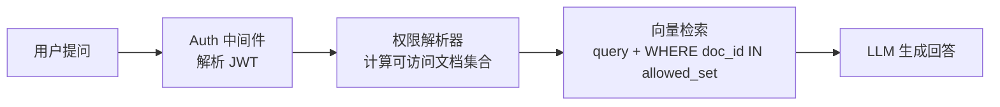
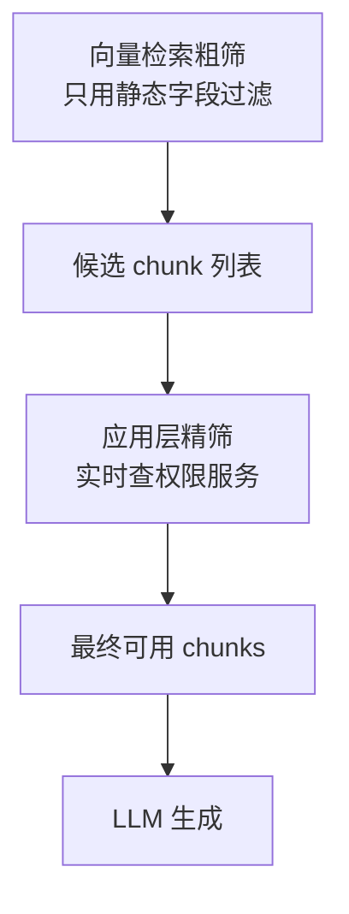
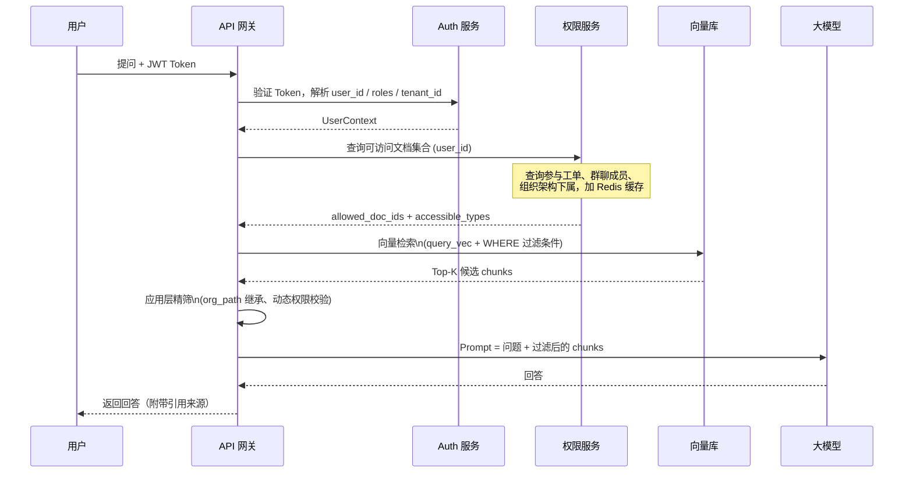

# RAG 多源数据权限控制：企业知识库的细粒度隔离方案

假设你正在为一家公司构建一个 AI 问答助手，接入的数据源包括：

- **OA 工单**：HR 审批流、行政申请，涉及薪资、考勤
- **员工对话**：和 AI 助手的历史私聊记录
- **个人文档**：员工自己上传的工作文件
- **群聊文档**：项目组内共享的文档
- **业务工单**：技术支持、产品反馈等工单系统
- **知识库**：公司公开的规章制度、产品手册

这些数据源的权限规则差异很大——知识库全员可见，个人文档只有本人能看，HR 工单只有 HR 和当事人能看，群聊文档只有群成员可见，上级还可以查看下属的部分内容……

如果不做权限控制，任何人向 AI 提问都可能拿到其他人的私密数据，这在企业场景中是不可接受的。

本文系统讲解：如何在 RAG 的检索链路中，正确地设计这套细粒度权限隔离方案。

---

## 一、先建立权限模型的心智框架

在动手之前，先把这个问题抽象清楚。

企业系统中的数据权限，本质上是在回答一个问题：**"当前用户能看到哪些文档 ID？"**

只要能在检索时把这个问题回答清楚，再把答案注入向量库的过滤条件，权限控制就做到了。



整个链路的核心在 **C：权限解析器**，它负责把用户身份翻译成一个可访问的文档 ID 集合（或等价的过滤条件）。

---

## 二、四种权限维度的拆解

企业数据的权限规则看似复杂，其实可以拆成四个正交的维度，每种数据源套用其中一个或多个：

### 2.1 角色权限（RBAC）

用角色决定能访问哪类数据源，这是最粗粒度的控制。

```
普通员工  → 访问：知识库、个人文档、自己参与的工单
部门经理  → 以上 + 本部门员工的绩效工单
HR       → 以上 + 全员 OA 审批记录
系统管理员 → 全部
```

实现方式：索引时在每个 chunk 的 metadata 里记录 `allowed_roles`，检索时用角色集合过滤。

```python
# 索引时
metadata = {
    "source_type": "oa_workorder",
    "doc_id": "oa_20250101_001",
    "allowed_roles": ["hr", "admin"],  # 只有 HR 和管理员能看
    "tenant_id": "company_abc"
}

# 检索时（ChromaDB 示例）
user_roles = ["employee"]  # 当前用户的角色列表

collection.query(
    query_embeddings=[query_vec],
    n_results=5,
    where={
        "$or": [
            {"allowed_roles": {"$contains": "employee"}},
            # ChromaDB 不直接支持数组交集，实际需用应用层过滤
            # 详见第四章的实现方案
        ]
    }
)
```

:::note
`allowed_roles` 是一个白名单，表示"哪些角色能看这条数据"。不同于把角色绑在用户上，这里是把角色要求绑在数据上，更灵活。
:::

### 2.2 组织架构继承（上级可见下级）

公司是有层级的，部门总监可以看到下属员工的绩效报告，但员工看不到其他人的。

这类权限不能只靠 `allowed_roles` 解决，需要引入组织架构树。

```
公司
├── 技术部
│   ├── 前端组（张三、李四）
│   └── 后端组（王五、赵六）
└── 产品部
    └── 产品一组（陈七）
```

规则：某个节点的数据，其所有祖先节点的成员都有权限访问。

实现方式：索引时记录 `owner_id` 和 `org_path`，检索时查出当前用户管辖的所有下属 ID。

```python
# 索引时：记录数据所有者的组织路径
metadata = {
    "source_type": "performance_review",
    "doc_id": "perf_zhangsan_2025q1",
    "owner_id": "user_zhangsan",
    # 组织路径：从根到当前节点
    "org_path": "/company/tech/frontend/zhangsan",
    "tenant_id": "company_abc"
}

# 检索时：查出当前用户管辖的路径前缀
def get_managed_org_prefixes(user_id: str) -> list[str]:
    """
    查出该用户在组织架构中管理的所有路径前缀。
    部门总监返回 ["/company/tech/"]，
    组长返回 ["/company/tech/frontend/"]。
    """
    return org_service.get_managed_prefixes(user_id)

# 在应用层过滤（向量库取出候选集后再筛选）
def filter_by_org(chunks: list[dict], user_id: str) -> list[dict]:
    prefixes = get_managed_org_prefixes(user_id)
    return [
        c for c in chunks
        if any(c["metadata"]["org_path"].startswith(p) for p in prefixes)
        or c["metadata"]["owner_id"] == user_id  # 自己的永远能看
    ]
```

### 2.3 参与关系隔离（只能看自己参与的）

群聊文档、业务工单这类数据，权限不取决于角色，而取决于"你是不是这件事的参与者"。

```
工单 #1001：参与者 = [张三, 李四, 王五（处理人）]
群聊 #group_dev：成员 = [张三, 李四, 赵六]
```

只有工单的参与者才能在 AI 问答里检索到该工单内容。

```python
# 索引时：记录参与者列表
metadata = {
    "source_type": "business_ticket",
    "doc_id": "ticket_1001",
    "participants": ["user_zhangsan", "user_lisi", "user_wangwu"],
    "tenant_id": "company_abc"
}

# 检索时：精确匹配参与者
def search_with_participation(query: str, user_id: str):
    # 先从业务系统拿到该用户参与的所有工单 ID
    ticket_ids = ticket_service.get_participated_ticket_ids(user_id)
    group_doc_ids = group_service.get_accessible_doc_ids(user_id)

    allowed_ids = ticket_ids + group_doc_ids

    return collection.query(
        query_embeddings=[embed(query)],
        n_results=10,
        where={"doc_id": {"$in": allowed_ids}}
    )
```

:::warning
参与关系是动态的——工单可以转给别人，群成员可以被踢出。这意味着**权限列表不能缓存太久**，每次查询前都要从业务系统拉最新的参与关系，或者用短 TTL 缓存（如 30 秒）。
:::

### 2.4 密级标签（公开 / 内部 / 机密）

部分文档有显式的密级标记，独立于角色和组织架构：

```
公开    → 全员可见（知识库、产品手册）
内部    → 员工可见，外部顾问不可见
机密    → 需要特定授权才能访问
```

```python
# 索引时
metadata = {
    "source_type": "knowledge_base",
    "doc_id": "kb_product_manual_v2",
    "security_level": 0,   # 0=公开, 1=内部, 2=机密
    "tenant_id": "company_abc"
}

# 检索时：根据用户的最高密级过滤
def get_user_clearance(user_id: str) -> int:
    """返回用户的最高访问密级，0/1/2"""
    return auth_service.get_clearance(user_id)

# 向量库过滤：只看 <= 自己密级的文档
user_clearance = get_user_clearance(current_user_id)
collection.query(
    query_embeddings=[embed(query)],
    n_results=10,
    where={"security_level": {"$lte": user_clearance}}
)
```

---

## 三、数据源 × 权限维度的映射关系

把前面四个维度套到具体数据源上：

| 数据源 | 主要权限维度 | 说明 |
|---|---|---|
| **知识库** | 密级标签 | 公开内容全员可见，机密内容需特殊权限 |
| **个人文档** | 参与关系（owner） | 只有本人；可明确分享给他人 |
| **群聊文档** | 参与关系（群成员） | 只有群成员可见 |
| **员工对话** | 参与关系（对话双方） | 只有当事人；HR/管理员在合规场景下可查 |
| **OA 工单** | 角色 + 参与关系 | 当事人 + HR + 直属上级 |
| **业务工单** | 参与关系 + 角色 | 参与者 + 对应部门主管 |
| **绩效/薪资** | 组织架构继承 | 本人 + 直属上级 + HR |

---

## 四、统一权限解析器的设计

四种维度在每次请求都要计算，如果分散在各处，代码很难维护。正确的做法是把它们收敛到一个**权限解析器**，统一输出"当前用户可访问的 doc_id 集合"。

```python
from dataclasses import dataclass
from typing import Optional

@dataclass
class UserContext:
    user_id: str
    tenant_id: str
    roles: list[str]           # ["employee", "manager"]
    clearance: int             # 密级上限: 0/1/2
    org_path: str              # 在组织树中的位置

class PermissionResolver:
    """
    统一权限解析器：把用户身份翻译成可访问的 doc_id 集合和过滤条件。
    每次 RAG 查询前调用一次。
    """

    def __init__(self, org_service, ticket_service, group_service):
        self.org_service = org_service
        self.ticket_service = ticket_service
        self.group_service = group_service

    def resolve(self, ctx: UserContext) -> dict:
        """
        返回可直接注入向量库查询的过滤条件。
        结构：{ "filters": [...], "allowed_doc_ids": [...] }
        """
        filters = []

        # 1. 密级过滤：所有数据源都要过这一关
        #    允许访问 security_level <= 用户密级的文档
        filters.append({
            "dimension": "security_level",
            "max": ctx.clearance
        })

        # 2. 租户隔离：永远只看自己公司的数据
        filters.append({
            "dimension": "tenant_id",
            "value": ctx.tenant_id
        })

        # 3. 参与关系：工单、群聊、个人文档
        ticket_ids = self.ticket_service.get_participated_ids(ctx.user_id)
        group_doc_ids = self.group_service.get_accessible_doc_ids(ctx.user_id)
        personal_doc_ids = [f"personal_{ctx.user_id}"]  # 个人文档命名规范
        participation_ids = ticket_ids + group_doc_ids + personal_doc_ids

        # 4. 组织架构：能看到哪些下属的文档
        managed_user_ids = self.org_service.get_subordinate_ids(ctx.user_id)
        # 把下属的个人文档、绩效文档 ID 也加进来
        subordinate_doc_ids = self._get_subordinate_docs(managed_user_ids)

        # 5. 角色权限：角色能访问的数据源类型
        role_accessible_types = self._get_types_by_roles(ctx.roles)

        return {
            "tenant_id": ctx.tenant_id,
            "max_security_level": ctx.clearance,
            "allowed_doc_ids": list(set(participation_ids + subordinate_doc_ids)),
            "role_accessible_source_types": role_accessible_types,
        }

    def _get_types_by_roles(self, roles: list[str]) -> list[str]:
        type_map = {
            "employee":  ["knowledge_base", "business_ticket", "group_doc", "personal_doc"],
            "manager":   ["knowledge_base", "business_ticket", "group_doc", "personal_doc", "performance_review"],
            "hr":        ["knowledge_base", "business_ticket", "group_doc", "personal_doc", "oa_workorder", "performance_review"],
            "admin":     ["*"],  # 全部
        }
        accessible = set()
        for role in roles:
            types = type_map.get(role, [])
            if "*" in types:
                return ["*"]
            accessible.update(types)
        return list(accessible)

    def _get_subordinate_docs(self, subordinate_ids: list[str]) -> list[str]:
        # 根据下属 ID 列表，查出对应的绩效文档 ID
        return [f"perf_{uid}" for uid in subordinate_ids]
```

---

## 五、把权限注入向量检索

有了权限解析器，在检索时组合过滤条件：

```python
def rag_search(query: str, user_ctx: UserContext, top_k: int = 10) -> list[dict]:
    """
    带权限控制的 RAG 检索。
    分两步：向量库粗筛 → 应用层精筛。
    """
    resolver = PermissionResolver(org_service, ticket_service, group_service)
    perm = resolver.resolve(user_ctx)

    query_vec = embed(query)

    # 第一步：向量库粗筛
    # 用 tenant_id + security_level + doc_id 做尽量多的前置过滤
    where_clause = {
        "$and": [
            {"tenant_id": {"$eq": perm["tenant_id"]}},
            {"security_level": {"$lte": perm["max_security_level"]}},
        ]
    }

    # 如果不是管理员，加上 doc_id 白名单
    if "*" not in perm["role_accessible_source_types"]:
        where_clause["$and"].append({
            "$or": [
                # 参与关系文档
                {"doc_id": {"$in": perm["allowed_doc_ids"]}},
                # 角色可访问的数据源类型（知识库等公共资源）
                {"source_type": {"$in": perm["role_accessible_source_types"]}}
            ]
        })

    raw_results = collection.query(
        query_embeddings=[query_vec],
        n_results=top_k * 2,  # 多取一些，给第二步精筛留余量
        where=where_clause,
        include=["documents", "metadatas", "distances"]
    )

    chunks = [
        {"text": doc, "metadata": meta, "score": 1 - dist}
        for doc, meta, dist in zip(
            raw_results["documents"][0],
            raw_results["metadatas"][0],
            raw_results["distances"][0]
        )
    ]

    # 第二步：应用层精筛（处理向量库过滤能力不足的边界情况）
    chunks = apply_org_hierarchy_filter(chunks, user_ctx, perm)

    return chunks[:top_k]


def apply_org_hierarchy_filter(
    chunks: list[dict],
    user_ctx: UserContext,
    perm: dict
) -> list[dict]:
    """
    组织架构继承在向量库里很难用一个简单条件表达，
    放在应用层用 org_path 前缀匹配来处理。
    """
    managed_prefixes = org_service.get_managed_prefixes(user_ctx.user_id)

    result = []
    for chunk in chunks:
        meta = chunk["metadata"]
        source_type = meta.get("source_type", "")

        # 知识库和角色可访问类型：直接放行（已在向量库过滤）
        if source_type in ["knowledge_base"] or \
           "*" in perm["role_accessible_source_types"]:
            result.append(chunk)
            continue

        # 绩效/薪资类：需要检查组织架构
        if source_type in ["performance_review", "salary"]:
            org_path = meta.get("org_path", "")
            owner_id = meta.get("owner_id", "")
            # 自己的 or 下属的
            if owner_id == user_ctx.user_id or \
               any(org_path.startswith(p) for p in managed_prefixes):
                result.append(chunk)
            continue

        # 其他：已在向量库白名单过滤，直接放行
        result.append(chunk)

    return result
```

---

## 六、索引阶段：统一的 Metadata Schema

权限控制能不能做好，很大程度上取决于索引时的 metadata 设计。以下是一个统一的 schema，覆盖所有数据源：

```python
from typing import Optional

def build_chunk_metadata(
    source_type: str,        # "knowledge_base" | "oa_workorder" | "personal_doc" | ...
    doc_id: str,             # 全局唯一文档 ID
    tenant_id: str,          # 租户 ID
    owner_id: str,           # 文档所有者 user_id
    org_path: str,           # 所有者在组织树的路径，如 "/company/tech/frontend/zhangsan"
    security_level: int,     # 0=公开, 1=内部, 2=机密
    participants: Optional[list[str]] = None,   # 参与者列表（工单/群聊用）
    allowed_roles: Optional[list[str]] = None,  # 可访问角色白名单
    chunk_index: int = 0,    # 在文档中的块序号
    created_at: str = "",    # ISO 时间，便于按时间过滤
) -> dict:
    return {
        "source_type": source_type,
        "doc_id": doc_id,
        "tenant_id": tenant_id,
        "owner_id": owner_id,
        "org_path": org_path,
        "security_level": security_level,
        "participants": ",".join(participants or []),  # 向量库通常不支持数组，用逗号拼接
        "allowed_roles": ",".join(allowed_roles or []),
        "chunk_index": chunk_index,
        "created_at": created_at,
    }

# 使用示例：索引一条 OA 工单
metadata = build_chunk_metadata(
    source_type="oa_workorder",
    doc_id="oa_20250101_001",
    tenant_id="company_abc",
    owner_id="user_zhangsan",
    org_path="/company/hr",
    security_level=1,                      # 内部可见
    participants=["user_zhangsan", "user_hr001"],
    allowed_roles=["hr", "admin"],
    chunk_index=0,
    created_at="2025-01-01T10:00:00Z"
)
```

:::tip
`participants` 和 `allowed_roles` 存为逗号分隔字符串，是因为大多数向量库（ChromaDB、Pinecone）的 metadata 只支持标量类型。应用层过滤时再 split 回数组做包含判断。
:::

---

## 七、权限变更时的索引同步

权限是动态的：员工离职、工单转让、群成员变更……这些变化需要同步到向量库的 metadata。

有两种策略：

**策略一：实时更新 metadata**

业务系统触发权限变更事件时，同步更新向量库中对应 doc_id 的所有 chunk metadata。

```python
def on_ticket_transferred(ticket_id: str, new_participants: list[str]):
    """工单转让时，更新向量库中该工单所有 chunk 的参与者列表。"""
    # 查出该 doc_id 下的所有 chunk ID
    chunks = collection.get(where={"doc_id": ticket_id})

    for chunk_id in chunks["ids"]:
        collection.update(
            ids=[chunk_id],
            metadatas=[{
                **chunks["metadatas"][0],  # 保留其他字段
                "participants": ",".join(new_participants)
            }]
        )
```

**策略二：权限旁路校验（推荐）**

向量库里只存粗粒度的静态字段（tenant_id、source_type、security_level），动态权限（参与者、组织架构）在应用层实时查业务系统校验。



这样向量库只负责语义相似度，权限完全由权限服务保证，两者解耦，权限变更不需要更新向量库。

:::warning
策略二会增加一次权限服务的网络调用，需要注意延迟。建议权限服务加短 TTL 缓存（Redis，TTL 30～60 秒），在实时性和性能之间取得平衡。
:::

---

## 八、完整的请求链路

把所有环节串起来，一次带权限控制的 RAG 查询完整流程如下：



---

## 九、常见陷阱

**陷阱一：在生成结果后再做权限过滤**

有些实现是先让 LLM 生成回答，再检查回答里是否包含无权限的内容。这是错误的——LLM 一旦看到了无权限的 chunk，信息就已经泄露进了回答，事后过滤根本来不及。**权限过滤必须在检索阶段完成。**

**陷阱二：allowed_doc_ids 列表过大**

当用户参与了几千个工单时，`WHERE doc_id IN (...)` 的列表会非常长，性能急剧下降。优化方案：

- 对参与关系类型，改用 **tag 打标签**，把 `user_id` 打进 metadata，检索时用 `participants_csv CONTAINS user_id` 的方式（应用层过滤）
- 或者按数据源类型分库，不同 source_type 存不同 collection，缩小检索范围

**陷阱三：忘记考虑删除和撤销权限**

员工被移出群组后，历史群聊文档是否还能看？工单关闭后，非参与者是否可以查阅？这些是业务规则，需要在索引时明确写进 metadata，不能只依赖"当前状态"来做判断。

---

## 总结

| 权限维度 | 适用数据源 | 实现位置 |
|---|---|---|
| 租户隔离 | 所有数据源 | 向量库过滤（tenant_id） |
| 密级标签 | 知识库、OA 文件 | 向量库过滤（security_level <= 用户密级） |
| 角色权限 | OA 工单、绩效数据 | 向量库过滤（source_type 白名单） |
| 参与关系 | 业务工单、群聊、个人文档 | 应用层过滤（实时查权限服务） |
| 组织架构继承 | 绩效、薪资、下属工单 | 应用层过滤（org_path 前缀匹配） |

设计原则只有一条：**在最早的环节把无权限的数据过滤掉，不要让它进入 LLM 的上下文。** 向量库能过滤的用向量库，向量库过滤能力不足的在应用层补上，两者组合覆盖所有权限规则。

::: details 技术选型参考：各向量库的过滤能力对比

| 向量库 | 过滤语法 | 数组支持 | 适合场景 |
|---|---|---|---|
| **ChromaDB** | `where={"key": {"$eq": val}}` | 不支持数组，需逗号拼接 | 本地开发、中小规模 |
| **Pinecone** | `filter={"key": {"$in": [...]}}` | 支持 `$in` | 托管服务，快速上线 |
| **Weaviate** | GraphQL where filter | 支持数组属性 | 复杂权限规则 |
| **pgvector** | 普通 SQL WHERE | 支持数组（`@>` 操作符） | 已有 PostgreSQL 基础设施 |
| **Milvus** | `expr="field in [...]"` | 支持 JSON 字段 | 大规模生产 |

pgvector 因为是 SQL 语法，在复杂权限过滤上表达能力最强，如果团队已经在用 PostgreSQL，优先考虑。
:::
