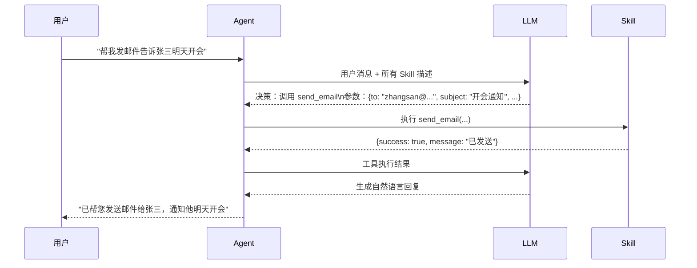

# AI Agent Skill 技能系统：原理、设计与实战

一个 AI Agent 能做什么，取决于它掌握了哪些**技能（Skill）**。

如果说 LLM 是 Agent 的大脑，那么 Skill 就是它的手和脚——负责把"想法"转化为真实世界里的动作：查数据库、调 API、操作文件、执行计算……

这篇文章不聊某个框架的使用方法，而是从根源讲清楚：**Skill 到底是什么、它的原理是什么、为什么要这样设计**。

---

## 1. 从工具调用（Function Calling）说起

要理解 Skill，必须先理解 LLM 的工具调用机制，因为 Skill 本质上就是对工具调用的结构化封装。

### 1.1 LLM 如何"知道"该用哪个工具？

这是很多人心里的疑问：我们给 LLM 注册了一堆工具，它怎么决定用哪个、传什么参数？

答案是：**把工具描述混入 System Prompt**。

当你调用支持工具调用的模型时，SDK 在底层会把所有工具的元数据序列化成文本，拼接到对话里：

```
[System Prompt]
你是一个助手，可以使用以下工具：

工具名：search_web
描述：搜索互联网上的最新信息
参数：{"query": "搜索关键词", "limit": "返回结果数量（默认5）"}

工具名：query_database
描述：执行 SQL 查询，返回数据库记录
参数：{"sql": "SELECT 语句"}

---
[用户消息]
帮我查一下今天北京的 PM2.5 数值
```

LLM 读完这段 Prompt，用自己的语言理解能力判断：这个任务需要"搜索互联网最新信息"，于是输出一个特殊格式的文本表示要调用 `search_web`：

```json
{
  "tool_call": {
    "name": "search_web",
    "arguments": {
      "query": "北京 PM2.5 今天",
      "limit": 1
    }
  }
}
```

这不是什么魔法，**模型在训练时学过大量"工具调用"格式的样本**，知道当任务需要外部数据时应该输出这种结构。

### 1.2 工具描述（Description）是大脑里的"目录"

这里有个关键认知：**工具的 description 字段不是给程序看的，是给 LLM 看的。**

LLM 靠 description 来建立对工具能力的认知，就像人靠函数名和注释来理解一段代码。

```python
# 这两个工具功能相同，但 LLM 的理解天差地别

# ❌ 描述模糊，LLM 不知道何时该调用
Tool(name="process", description="处理数据")

# ✅ 描述清晰，LLM 能精准判断使用时机
Tool(
    name="calculate_tax",
    description=(
        "根据中国税法计算个人所得税。"
        "输入月薪（税前），返回应纳税额和税后收入。"
        "适用于 2024 年及之后的税率标准。"
    )
)
```

这就是 Skill 设计的核心哲学之一：**技能的元数据（名称、描述、参数说明）决定了 LLM 能否正确使用它。**

---

## 2. Skill 的本质：能力的最小封装单元

### 2.1 定义

**Skill 是一个具有明确语义边界的可调用能力单元**，它封装了：

1. **做什么**（语义描述）— LLM 用来判断是否调用
2. **需要什么**（输入 Schema）— LLM 用来生成调用参数
3. **怎么做**（实现逻辑）— 程序实际执行的代码
4. **返回什么**（输出格式）— LLM 用来理解执行结果

用一张图表示：

```
┌─────────────────────────────────────┐
│              Skill                   │
│                                      │
│  ┌──────────┐     ┌──────────────┐  │
│  │ 语义层   │     │  实现层      │  │
│  │ ─────── │     │ ─────────── │  │
│  │ 名称     │     │ 函数/API调用 │  │
│  │ 描述     │     │ 数据库操作   │  │
│  │ 参数说明 │     │ 外部服务     │  │
│  └──────────┘     └──────────────┘  │
│       ↑                  ↑           │
│    LLM 理解          程序执行        │
└─────────────────────────────────────┘
```

### 2.2 Skill 与 Function 的区别

普通函数和 Skill 的最大区别在于**谁来调用它**：

| | 普通函数 | Skill |
| :--- | :--- | :--- |
| 调用方 | 程序代码（确定性） | LLM（概率性判断） |
| 选择依据 | 代码逻辑 | 语义理解 |
| 参数来源 | 上层代码传入 | LLM 从对话中提取/生成 |
| 错误处理 | 编译期/运行期错误 | LLM 自动重试或降级 |

这意味着 Skill 必须具备**语义自洽性**：仅凭名称和描述，LLM 就能判断出"这个任务该不该用这个技能"。

---

## 3. Skill 的内部结构原理

### 3.1 语义层：让 LLM 看懂

语义层的核心是 **JSON Schema 描述**，这是工具调用的通用标准：

```json
{
  "name": "send_email",
  "description": "向指定邮箱发送邮件。适用于通知、提醒、报告分发等场景。注意：每次调用只能发给一个收件人。",
  "parameters": {
    "type": "object",
    "properties": {
      "to": {
        "type": "string",
        "description": "收件人邮箱地址，格式：user@example.com"
      },
      "subject": {
        "type": "string",
        "description": "邮件主题，简明扼要，不超过50字"
      },
      "body": {
        "type": "string",
        "description": "邮件正文内容，支持纯文本"
      },
      "priority": {
        "type": "string",
        "enum": ["low", "normal", "high"],
        "description": "邮件优先级，默认 normal"
      }
    },
    "required": ["to", "subject", "body"]
  }
}
```

字段设计的每一个细节都在影响 LLM 的行为：

- **`description` 里的适用场景**：帮助 LLM 在多个类似工具间做出选择
- **`description` 里的限制说明**（"只能发给一个收件人"）：防止 LLM 传入数组
- **`enum` 类型**：约束参数值域，减少幻觉
- **`required` 数组**：告诉 LLM 哪些参数不可省略

### 3.2 实现层：真正干活的代码

实现层就是普通的代码逻辑，唯一的要求是**输入输出格式与语义层声明一致**：

```python
def send_email(to: str, subject: str, body: str, priority: str = "normal") -> dict:
    """
    实现层：真正发送邮件的逻辑
    返回结构化结果，方便 LLM 判断是否成功
    """
    try:
        smtp_client.send(
            to=to,
            subject=subject,
            body=body,
            priority=priority
        )
        return {
            "success": True,
            "message": f"邮件已成功发送至 {to}",
            "timestamp": datetime.now().isoformat()
        }
    except SMTPException as e:
        return {
            "success": False,
            "message": f"发送失败：{str(e)}",
            "suggestion": "请检查邮箱地址格式是否正确"
        }
```

注意错误返回中的 `suggestion` 字段——这是给 LLM 看的提示，当调用失败时 LLM 会读取这个字段来决定是否修正参数重试。

### 3.3 调用链路：一次完整的 Skill 调用



整个过程中 LLM 出现了**两次**：第一次决策调用哪个 Skill，第二次把结果翻译成自然语言给用户。

---

## 4. Skill 的分类

不同框架对 Skill 的分类方式略有不同，但原理层面可以归纳为三类：

### 4.1 原生技能（Native Skill）

用宿主语言（Python/TypeScript 等）直接实现，执行确定性代码：

```python
# Python 示例：文件操作技能
class FileSkill:
    
    @skill(
        name="read_file",
        description="读取本地文件内容。支持 txt、json、csv、md 格式。"
    )
    def read_file(self, path: str, encoding: str = "utf-8") -> str:
        with open(path, "r", encoding=encoding) as f:
            return f.read()
    
    @skill(
        name="write_file",
        description="将内容写入本地文件。如果文件不存在会自动创建。"
    )
    def write_file(self, path: str, content: str) -> dict:
        with open(path, "w", encoding="utf-8") as f:
            f.write(content)
        return {"success": True, "bytes_written": len(content.encode())}
```

特点：执行速度快、结果可预测、适合 IO 操作和计算任务。

### 4.2 语义技能（Semantic Skill）

**用自然语言提示词定义的技能**，本身就是一次 LLM 调用。适合文本处理类任务：

```
# skills/summarize/skprompt.txt
将以下文本压缩为不超过 {{$max_words}} 个字的摘要。
要求：
- 保留核心观点
- 去掉冗余细节
- 使用主动语态
- 结构清晰，可以使用要点列表

原文：
{{$input}}

摘要：
```

```python
# 加载并使用语义技能
summarize_skill = kernel.import_semantic_skill_from_directory("skills", "summarize")
result = await kernel.run_async(
    summarize_skill["summarize"],
    input_str=long_article,
    max_words="200"
)
```

语义技能的本质是**把常用的提示词工程抽象成可复用的组件**——不需要写代码，只需要写好 Prompt。

### 4.3 复合技能（Composite Skill / Pipeline）

把多个 Skill 串联成一个更复杂的工作流，对外表现为单一技能：

```python
# 复合技能：从 URL 抓取内容 → 翻译 → 摘要
async def fetch_and_summarize(url: str, language: str = "中文") -> str:
    # Step 1：原生技能 - 抓取网页
    html = await fetch_skill.fetch_url(url)
    
    # Step 2：原生技能 - 提取正文
    text = await parse_skill.extract_text(html)
    
    # Step 3：语义技能 - 翻译
    translated = await translate_skill.translate(text, target_lang=language)
    
    # Step 4：语义技能 - 摘要
    summary = await summarize_skill.summarize(translated, max_words=300)
    
    return summary
```

复合技能体现了技能系统最重要的设计原则：**组合性（Composability）**。简单技能是积木，复杂任务通过组合积木来完成。

---

## 5. 主流框架的 Skill 实现

### 5.1 Semantic Kernel（微软）

Semantic Kernel 是最早系统化提出 Skill 概念的框架（现在改名为 Plugin），其设计极具代表性。

**核心概念：**

```
Kernel（内核）
  └── Plugin（原来叫 Skill）
        ├── KernelFunction（原生函数 或 语义函数）
        ├── KernelFunction
        └── ...
```

**注册原生技能（Python SDK）：**

```python
from semantic_kernel import Kernel
from semantic_kernel.functions import kernel_function

kernel = Kernel()

class MathPlugin:
    @kernel_function(
        name="add",
        description="计算两个数字的和"
    )
    def add(self, a: float, b: float) -> float:
        return a + b
    
    @kernel_function(
        name="percentage",
        description="计算 value 占 total 的百分比，返回如 '42.5%' 的字符串"
    )
    def percentage(self, value: float, total: float) -> str:
        return f"{(value / total * 100):.1f}%"

# 注册到 Kernel
kernel.add_plugin(MathPlugin(), plugin_name="Math")
```

**自动规划（Planner）：**

Semantic Kernel 的精髓在于 **Planner**——它能根据用户目标自动决定调用哪些技能、以什么顺序组合：

```python
from semantic_kernel.planners import FunctionCallingStepwisePlanner

planner = FunctionCallingStepwisePlanner(kernel)

# 用户只提目标，Planner 自动规划执行步骤
result = await planner.invoke(
    kernel,
    "帮我把 sales_report.txt 里的数据翻译成英文，然后发邮件给 boss@company.com"
)
# Planner 自动串联：read_file → translate → send_email
```

### 5.2 LangChain（Tool 体系）

LangChain 把 Skill 称为 **Tool**，提供了更灵活的定义方式：

```python
from langchain.tools import tool
from langchain_openai import ChatOpenAI
from langchain.agents import AgentExecutor, create_tool_calling_agent

# 方式一：装饰器定义（推荐）
@tool
def get_stock_price(symbol: str) -> str:
    """
    获取股票的当前价格。
    输入股票代码（如 AAPL、000001.SZ），返回最新价格和涨跌幅。
    """
    # 实际实现调用金融数据 API
    price = stock_api.get_price(symbol)
    return f"{symbol}: ¥{price['current']:.2f}（{price['change']:+.2f}%）"

# 方式二：继承 BaseTool（适合复杂逻辑）
from langchain.tools import BaseTool
from pydantic import BaseModel, Field

class QueryInput(BaseModel):
    sql: str = Field(description="SQL SELECT 语句")
    limit: int = Field(default=10, description="最大返回行数")

class DatabaseQueryTool(BaseTool):
    name = "query_database"
    description = "执行 SQL 查询，从数据库中检索数据。只支持 SELECT 语句。"
    args_schema = QueryInput  # 用 Pydantic 做参数校验
    
    def _run(self, sql: str, limit: int = 10) -> str:
        results = db.execute(sql, limit=limit)
        return format_as_table(results)

# 组装 Agent
llm = ChatOpenAI(model="gpt-4o")
tools = [get_stock_price, DatabaseQueryTool()]
agent = create_tool_calling_agent(llm, tools, prompt)
executor = AgentExecutor(agent=agent, tools=tools)

response = executor.invoke({"input": "帮我查一下 AAPL 的最新股价"})
```

**LangChain 的工具路由原理：**

```python
# LangChain 内部做的事（简化）：
# 1. 将所有 tool 的 description 序列化为 System Prompt
# 2. 调用 LLM，获取工具调用决策
# 3. 根据 LLM 返回的工具名找到对应 Tool 对象
# 4. 用 args_schema 校验参数
# 5. 执行 _run()，返回结果给 LLM
# 6. LLM 根据结果决定是否继续调用工具或直接回答
```

---

## 6. Skill 的关键设计原则

### 6.1 单一职责：每个技能只做一件事

```python
# ❌ 职责过重，LLM 不知道何时该用
@tool
def manage_user(action: str, user_id: str, **kwargs) -> dict:
    """管理用户：创建/更新/删除/查询"""
    if action == "create": ...
    elif action == "update": ...
    elif action == "delete": ...
    elif action == "query": ...

# ✅ 拆分为独立技能，LLM 精准匹配
@tool
def create_user(name: str, email: str, role: str = "viewer") -> dict:
    """创建新用户账户。返回新用户的 ID 和初始密码。"""
    ...

@tool
def get_user(user_id: str) -> dict:
    """根据用户 ID 查询用户信息，包括姓名、邮箱、权限和注册时间。"""
    ...

@tool
def delete_user(user_id: str, reason: str) -> dict:
    """永久删除用户账户。此操作不可撤销，需要提供删除原因。"""
    ...
```

### 6.2 幂等性：重复调用结果一致

LLM 有时会因为网络延迟或理解偏差重复调用同一个技能。查询类技能天然幂等，写入类技能需要额外设计：

```python
@tool
def create_order(order_id: str, items: list, customer_id: str) -> dict:
    """
    创建订单。order_id 由调用方生成（UUID），重复传入相同 order_id 会返回已有订单，
    不会重复创建。
    """
    # 检查是否已存在
    existing = db.get_order(order_id)
    if existing:
        return {"created": False, "order": existing, "message": "订单已存在，返回已有记录"}
    
    # 创建新订单
    order = db.create_order(order_id=order_id, items=items, customer_id=customer_id)
    return {"created": True, "order": order, "message": "订单创建成功"}
```

### 6.3 结构化输出：让 LLM 容易消费结果

返回值要对 LLM 友好——既有人类可读的摘要，也有结构化数据：

```python
@tool
def search_products(keyword: str, limit: int = 5) -> str:
    """搜索商品，返回匹配的商品列表（名称、价格、库存状态）。"""
    products = db.search(keyword, limit=limit)
    
    if not products:
        return f"未找到与 '{keyword}' 匹配的商品"
    
    # 结构化 + 自然语言混合输出
    lines = [f"找到 {len(products)} 个匹配商品：\n"]
    for p in products:
        stock_str = f"库存 {p['stock']} 件" if p['stock'] > 0 else "暂时缺货"
        lines.append(f"- {p['name']}：¥{p['price']:.2f}，{stock_str}（ID: {p['id']}）")
    
    return "\n".join(lines)
```

### 6.4 防御性设计：假设 LLM 会传错参数

```python
@tool
def delete_file(path: str, confirm: bool = False) -> dict:
    """
    删除指定路径的文件。
    警告：此操作不可恢复。必须将 confirm 设为 true 才能执行删除。
    """
    # 二次确认机制
    if not confirm:
        return {
            "deleted": False,
            "message": f"删除操作需要确认。请再次调用并将 confirm 设为 true 以删除 {path}"
        }
    
    # 路径安全检查
    safe_path = pathlib.Path(path).resolve()
    forbidden = ["/etc", "/usr", "/bin", "C:\\Windows"]
    if any(str(safe_path).startswith(f) for f in forbidden):
        return {"deleted": False, "message": "禁止删除系统目录"}
    
    os.remove(safe_path)
    return {"deleted": True, "message": f"文件 {path} 已删除"}
```

---

## 7. 完整实战：构建一个任务管理 Skill 系统

把所有原则整合起来，实现一套可直接用于 Agent 的任务管理技能：

```python
# task_skills.py
from datetime import datetime
from langchain.tools import tool
from pydantic import BaseModel, Field
from typing import Optional
import json

# 模拟数据存储
_tasks: dict[str, dict] = {}

# ── 数据模型 ────────────────────────────────────

class Task(BaseModel):
    id: str
    title: str
    description: str = ""
    status: str = "todo"      # todo | in_progress | done
    priority: str = "medium"  # low | medium | high
    due_date: Optional[str] = None
    created_at: str = Field(default_factory=lambda: datetime.now().isoformat())

# ── 技能定义 ────────────────────────────────────

@tool
def create_task(title: str, description: str = "", priority: str = "medium", due_date: str = "") -> str:
    """
    创建一个新的待办任务。
    priority 可选值：low（低优先级）、medium（中等，默认）、high（高优先级，紧急任务）。
    due_date 格式：YYYY-MM-DD，不填则无截止日期。
    返回新创建任务的 ID。
    """
    import uuid
    task_id = str(uuid.uuid4())[:8]
    task = {
        "id": task_id,
        "title": title,
        "description": description,
        "status": "todo",
        "priority": priority,
        "due_date": due_date or None,
        "created_at": datetime.now().strftime("%Y-%m-%d %H:%M")
    }
    _tasks[task_id] = task
    return f"任务已创建，ID: {task_id}\n标题：{title}\n优先级：{priority}"


@tool
def list_tasks(status: str = "", priority: str = "") -> str:
    """
    列出任务清单。可按状态和优先级筛选。
    status 可选：todo（待办）、in_progress（进行中）、done（已完成）。
    priority 可选：low、medium、high。
    不传参数则返回所有任务。
    """
    tasks = list(_tasks.values())
    
    if status:
        tasks = [t for t in tasks if t["status"] == status]
    if priority:
        tasks = [t for t in tasks if t["priority"] == priority]
    
    if not tasks:
        return "没有符合条件的任务"
    
    # 按优先级排序
    priority_order = {"high": 0, "medium": 1, "low": 2}
    tasks.sort(key=lambda t: priority_order.get(t["priority"], 1))
    
    lines = [f"共 {len(tasks)} 个任务：\n"]
    for t in tasks:
        due = f"，截止 {t['due_date']}" if t.get("due_date") else ""
        lines.append(
            f"[{t['id']}] [{t['priority'].upper()}] {t['title']} "
            f"— {t['status']}{due}"
        )
    return "\n".join(lines)


@tool
def update_task_status(task_id: str, new_status: str) -> str:
    """
    更新任务的完成状态。
    new_status 可选：todo（重置为待办）、in_progress（标记为进行中）、done（标记为完成）。
    """
    if task_id not in _tasks:
        return f"未找到 ID 为 {task_id} 的任务，请先用 list_tasks 确认任务 ID"
    
    valid_statuses = ["todo", "in_progress", "done"]
    if new_status not in valid_statuses:
        return f"无效状态：{new_status}。可选值：{', '.join(valid_statuses)}"
    
    old_status = _tasks[task_id]["status"]
    _tasks[task_id]["status"] = new_status
    return f"任务 [{task_id}] 状态已从 {old_status} 更新为 {new_status}"


@tool
def get_task_summary() -> str:
    """
    获取所有任务的汇总统计：各状态数量、高优先级待办数量。
    适合用于了解当前工作负载总览。
    """
    if not _tasks:
        return "当前没有任何任务"
    
    total = len(_tasks)
    by_status = {"todo": 0, "in_progress": 0, "done": 0}
    high_priority_todo = 0
    
    for t in _tasks.values():
        by_status[t["status"]] = by_status.get(t["status"], 0) + 1
        if t["priority"] == "high" and t["status"] == "todo":
            high_priority_todo += 1
    
    summary = (
        f"任务总览（共 {total} 个）：\n"
        f"  待办：{by_status['todo']} 个\n"
        f"  进行中：{by_status['in_progress']} 个\n"
        f"  已完成：{by_status['done']} 个\n"
    )
    if high_priority_todo > 0:
        summary += f"\n⚠️ 有 {high_priority_todo} 个高优先级任务待处理"
    
    return summary


# ── 组装 Agent ──────────────────────────────────

from langchain_openai import ChatOpenAI
from langchain.agents import AgentExecutor, create_tool_calling_agent
from langchain_core.prompts import ChatPromptTemplate

tools = [create_task, list_tasks, update_task_status, get_task_summary]

prompt = ChatPromptTemplate.from_messages([
    ("system", "你是一个任务管理助手。帮用户管理他们的待办事项。"),
    ("human", "{input}"),
    ("placeholder", "{agent_scratchpad}"),
])

llm = ChatOpenAI(model="gpt-4o-mini", temperature=0)
agent = create_tool_calling_agent(llm, tools, prompt)
executor = AgentExecutor(agent=agent, tools=tools, verbose=True)

# 测试
if __name__ == "__main__":
    # 用自然语言操作任务
    print(executor.invoke({"input": "帮我创建一个高优先级任务：完成 Q2 财务报告，截止日期 2026-06-30"})["output"])
    print(executor.invoke({"input": "我现在有哪些任务？"})["output"])
    print(executor.invoke({"input": "把财务报告任务标记为进行中"})["output"])
```

---

## 8. 常见问题

### 技能太多时 LLM 如何选择？

当注册的技能超过 20 个时，全部塞进 System Prompt 会消耗大量 Token，也会让 LLM 的选择质量下降。

解决方案是**技能检索（Skill Retrieval）**：

```
所有技能的描述 → 向量化存入向量数据库
          ↓
用户输入 → 向量检索 → 取 Top-K 相关技能
          ↓
只把这 K 个技能注入 System Prompt
          ↓
LLM 从小范围内精确选择
```

这就是为什么大型 Agent 系统（如 AutoGPT）会引入向量数据库作为"技能索引"。

### 如何处理需要多步的任务？

单个技能不应该干太多事，多步任务由 **Planner** 来拆解：

```
用户："帮我分析竞品，生成一份报告，发给老板"

Planner 规划：
  Step 1 → search_web("竞品A 最新动态")
  Step 2 → search_web("竞品B 最新动态")
  Step 3 → summarize(Step1结果 + Step2结果)
  Step 4 → generate_report(Step3摘要)
  Step 5 → send_email(to="boss@...", body=Step4报告)
```

这种多步规划能力是 Agent 区别于普通聊天机器人的核心。

:::warning
**技能粒度是最难把握的设计决策。**
太细：LLM 需要调用很多次才能完成简单任务，效率低、Token 消耗大。
太粗：技能复用性差，LLM 难以精准匹配。
一个经验法则：**一个技能完成的事情，应该能用一句话说清楚。**
:::

---

## 总结

Skill 系统的本质是**在 LLM 的语义理解能力和确定性代码执行之间建立桥梁**。

理解了这一点，很多设计问题就有了答案：

- **为什么描述要写清楚** — LLM 靠描述来"理解"技能，描述不清就等于你的函数没有文档
- **为什么要拆细** — 细粒度技能组合更灵活，LLM 更容易精准匹配
- **为什么要结构化返回值** — LLM 需要消费执行结果来决定下一步，杂乱的文本会让它困惑
- **为什么需要 Planner** — 单个技能处理单一职责，复杂任务需要由规划层来协调

掌握 Skill 设计，你就掌握了构建可靠 Agent 系统的核心能力。
