# Transformer 模型详解

## 引言

2017 年，Google 研究团队发表了里程碑论文《Attention Is All You Need》[^1]，提出了完全基于注意力机制的 Transformer 架构。这篇论文彻底改变了自然语言处理领域的发展方向，为 GPT、BERT 等后续大语言模型奠定了坚实的基础。本文将深入解析 Transformer 的核心原理和架构设计。

> 本文主要参考自百度百科技术文章《Transformer 模型详解》[^4]，并结合原始论文进行补充说明。

## 1. 为什么需要 Transformer

### 1.1 RNN 的局限性

在 Transformer 出现之前，循环神经网络（RNN）及其变体 LSTM 和 GRU 是序列建模的主流方法。RNN 通过隐藏状态在序列中传递信息：

```
h_t = f(W · h_{t-1} + U · x_t)
```

然而，RNN 存在两个根本性问题：

1. **并行计算困难** - 序列中的每个词必须等待前一个词处理完成才能开始
2. **长距离依赖衰减** - 信息在长序列中传递时容易丢失

### 1.2 注意力机制的突破

注意力机制的核心思想是：直接建立序列中任意两个位置之间的联系，不再依赖隐藏状态的顺序传递。这使得模型能够：

- 并行计算所有位置的关系
- 直接捕捉长距离依赖

## 2. Transformer 整体架构

Transformer 采用经典的编码器-解码器架构，如下图所示[^4]：

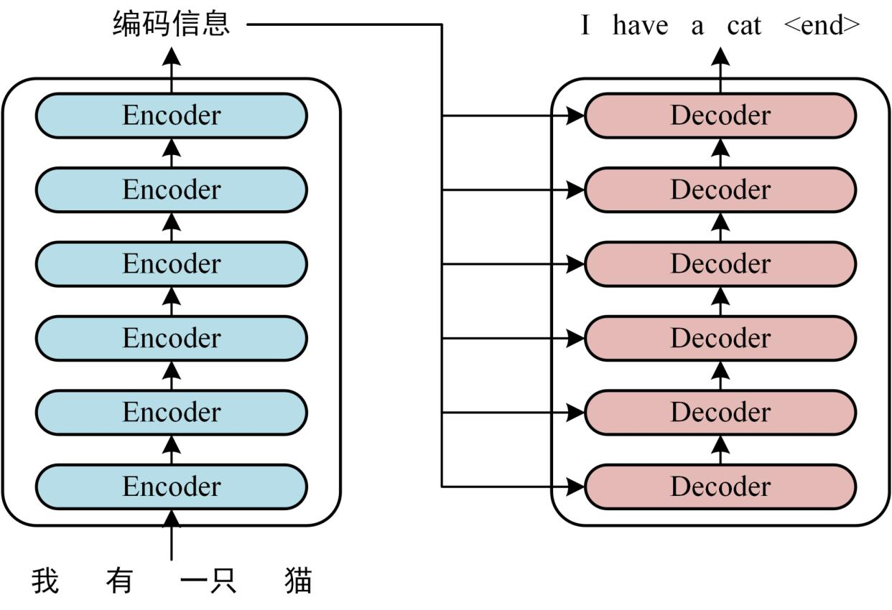

Transformer 由 **Encoder** 和 **Decoder** 两个部分组成，各包含 6 个 block。

**工作流程：**

1. **输入表示** - 获取输入句子每个单词的表示向量 X（词 Embedding + 位置 Embedding）

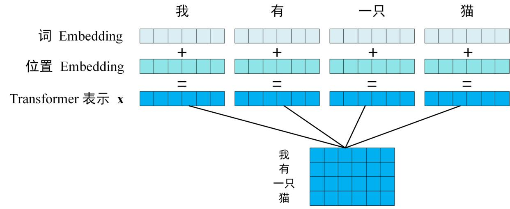

2. **编码** - 传入 Encoder，经过 6 个 Encoder block 后得到句子所有单词的编码信息矩阵 C

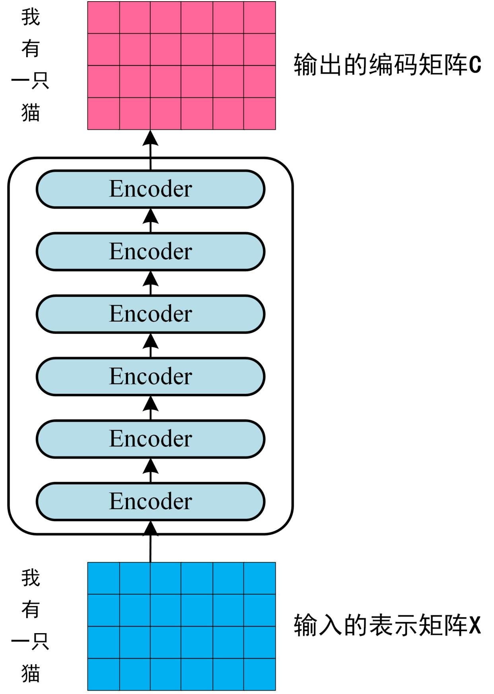

3. **解码** - 传递到 Decoder，依次根据当前翻译过的单词预测下一个单词

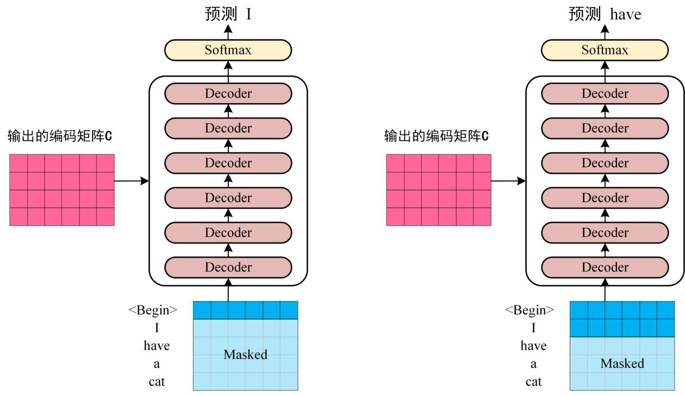

## 3. Transformer 的输入

### 3.1 单词 Embedding

单词的 Embedding 是将单词映射为固定维度的向量。有多种获取方式：

- 采用 Word2Vec、Glove 等算法预训练得到
- 在 Transformer 中训练得到

### 3.2 位置 Embedding

Transformer 不采用 RNN 的顺序结构，无法利用单词的顺序信息，因此需要位置 Embedding 来保存单词在序列中的相对或绝对位置[^4]。

**位置 Embedding 的计算公式：**

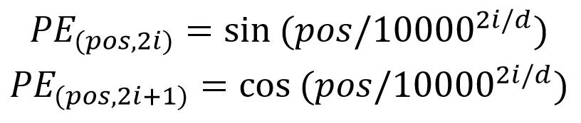

```
PE(pos, 2i) = sin(pos / 10000^(2i/d_model))
PE(pos, 2i+1) = cos(pos / 10000^(2i/d_model))
```

**公式说明：**
- `pos` 表示单词在句子中的位置
- `d` 表示 PE 的维度（与词 Embedding 相同）
- `2i` 表示偶数的维度，`2i+1` 表示奇数维度

**使用公式计算的优势：**
- 能够适应比训练集更长的句子
- 模型可以容易地计算出相对位置（固定间距 k 可用 PE(pos) 计算得到）

最终，单词的表示向量 = 词 Embedding + 位置 Embedding。

## 4. Self-Attention 机制

### 4.1 核心概念

Self-Attention 是 Transformer 的核心。注意力机制的核心是 Query（查询）、Key（键）和 Value（值）三个向量的交互[^1]：

```
Attention(Q, K, V) = softmax(Q·K^T / √d_k) × V
```

**直观理解：**
- **Query (Q)** - 你要查找的信息
- **Key (K)** - 信息源的索引标签
- **Value (V)** - 信息本身
- **Q·K^T** - 计算查询与所有键的相似度
- **softmax** - 将相似度转换为概率分布
- **加权求和** - 根据关注程度聚合信息

### 4.2 Q, K, V 的计算

在 Self-Attention 中，Q、K、V 通过输入矩阵进行线性变换得到[^4]：

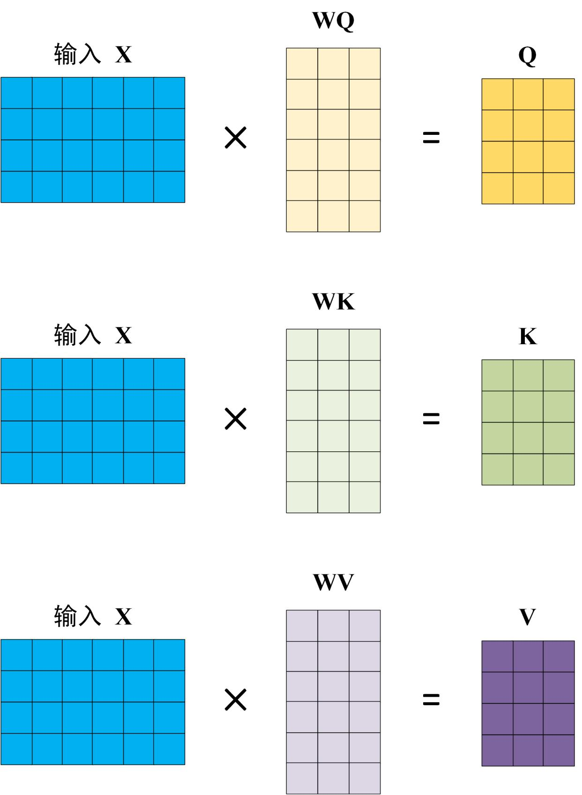

```
Q = X × W_Q
K = X × W_K
V = X × W_V
```

### 4.3 Self-Attention 的输出

计算步骤如下[^4]：

1. 计算 Q 和 K^T 的乘积（得到注意力强度矩阵）：

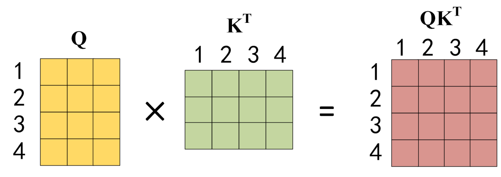

2. 除以 √d_k 防止内积过大

3. Softmax 计算 attention 系数（对每一行进行 Softmax）：

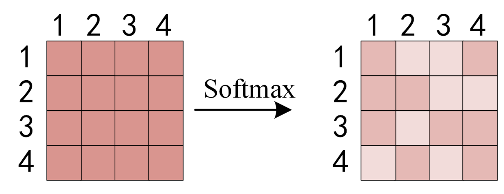

4. 与 V 相乘得到最终输出：

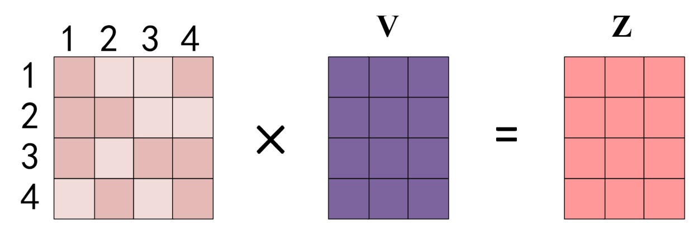

5. 每个位置输出 Z_i 是所有 V 的加权和：

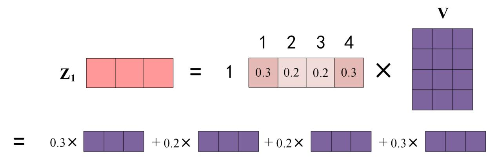

### 4.4 Multi-Head Attention

Multi-Head Attention 由多个 Self-Attention 组合形成[^4]：

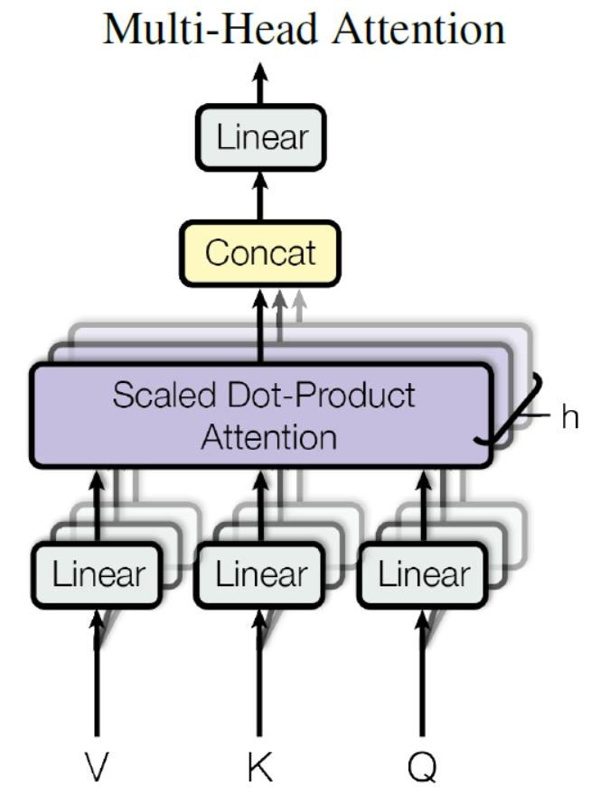

**计算过程：**
1. 将输入 X 传递到 h 个不同的 Self-Attention 中
2. 得到 h 个输出矩阵 Z1 到 Zh

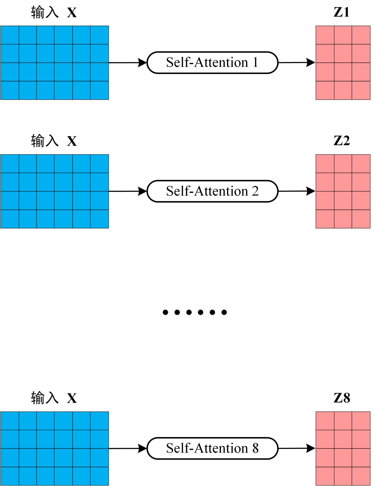

3. 拼接所有输出矩阵，然后传入 Linear 层得到最终输出

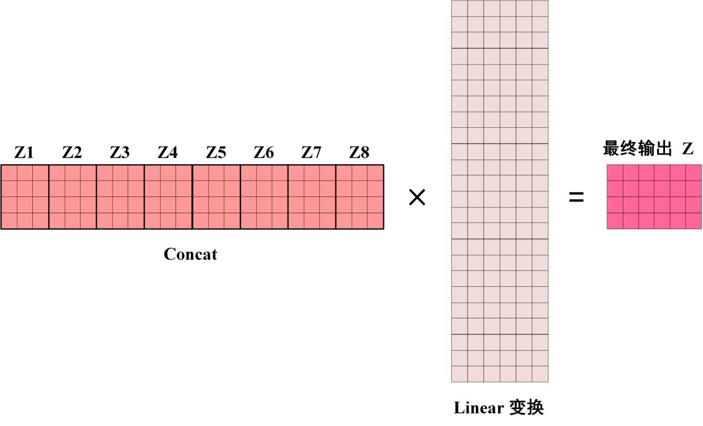

**Multi-Head Attention 的优势：**
- 不同头可以关注不同类型的信息（语法、语义、位置等）
- 增加了模型的表达能力
- 保持了计算效率

## 5. Encoder 架构

### 5.1 Encoder Block 结构

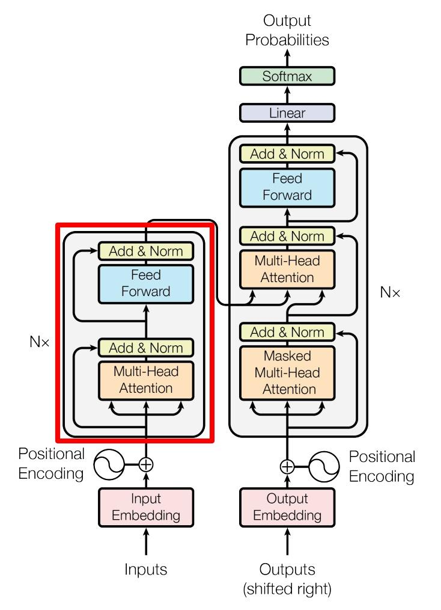

每个 Encoder Block 包含：
- Multi-Head Attention
- Add & Norm（残差连接 + 层归一化）
- Feed Forward（前馈神经网络）
- Add & Norm

### 5.2 Add & Norm

Add & Norm 层由 Add（残差连接）和 Norm（层归一化）两部分组成[^4]：

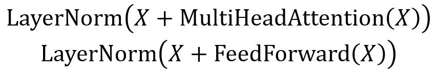

```
Output = LayerNorm(x + Sublayer(x))
```

**残差连接（Add）：**
- 防止网络退化
- 让网络只关注当前差异部分

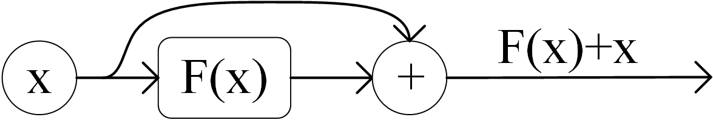

**层归一化（Norm）：**
- 加快收敛速度
- 每一层神经元的输入转成均值方差一致

### 5.3 Feed Forward

Feed Forward 是一个两层的全连接网络[^4]：

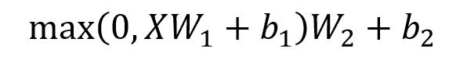

```
FFN(x) = max(0, xW_1 + b_1)W_2 + b_2
```

**作用：**
- 对注意力输出进行非线性变换
- 增加模型容量

### 5.4 多个 Encoder Block 叠加

通过多个 Encoder Block 叠加组成 Encoder：


- 第一个 Encoder block 的输入为句子单词的表示向量矩阵
- 后续 Encoder block 的输入是前一个 Encoder block 的输出
- 最后一个 Encoder block 输出的矩阵就是编码信息矩阵 C

## 6. Decoder 架构

### 6.1 Decoder Block 结构

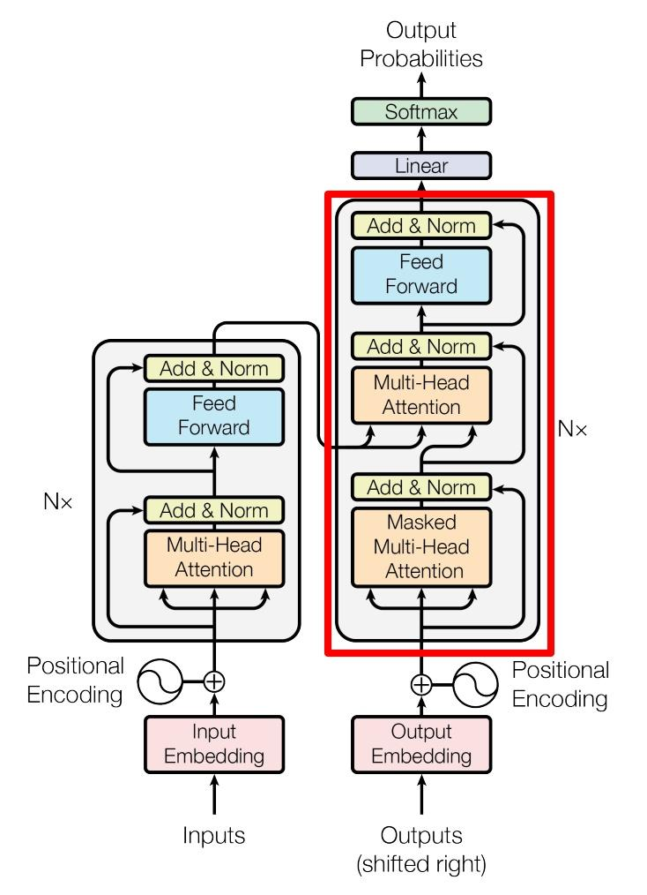

Decoder Block 与 Encoder Block 相似，但存在区别：
- 包含两个 Multi-Head Attention 层
- 第一个 Multi-Head Attention 采用 Masked 操作
- 第二个 Multi-Head Attention 的 K、V 使用 Encoder 的编码信息矩阵 C 计算

### 6.2 第一个 Multi-Head Attention（Masked）

在翻译过程中需要顺序翻译，Masked 操作防止第 i 个词知道 i+1 之后的信息[^4]：

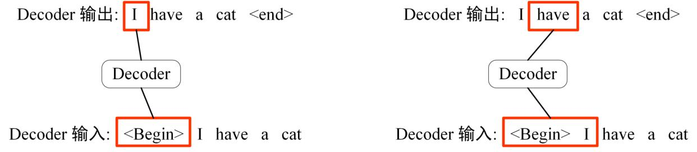

**Mask 操作步骤：**

1. 输入矩阵与 Mask 矩阵：

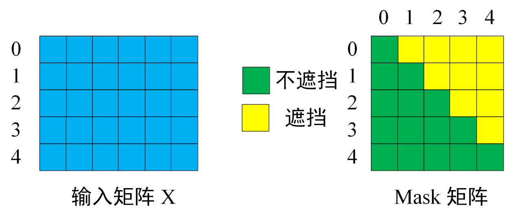

2. 计算 QKT：

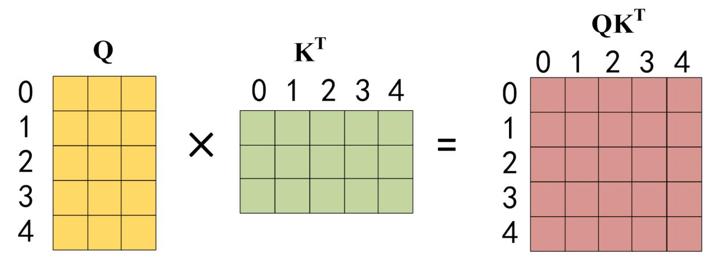

3. Softmax 前进行 Mask 遮挡：

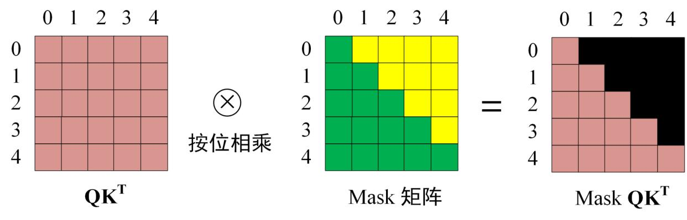

4. Mask 后的输出：

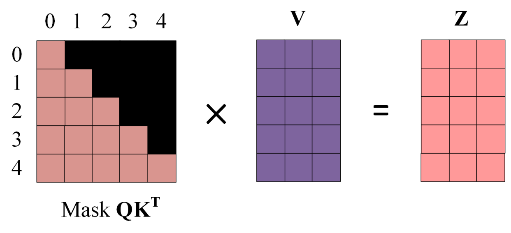

### 6.3 第二个 Multi-Head Attention

第二个 Multi-Head Attention 的不同之处：
- K、V 矩阵使用 Encoder 的编码信息矩阵 C 计算
- Q 使用上一个 Decoder block 的输出计算

这样可以让每个解码位置利用到编码器的所有信息。

### 6.4 Softmax 预测输出

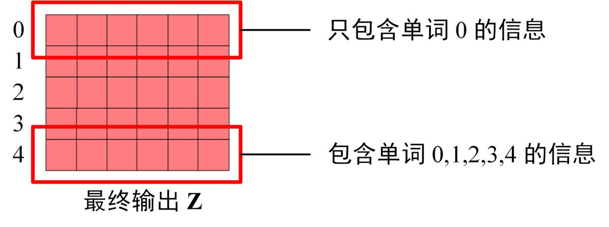

通过 Softmax 预测下一个单词：

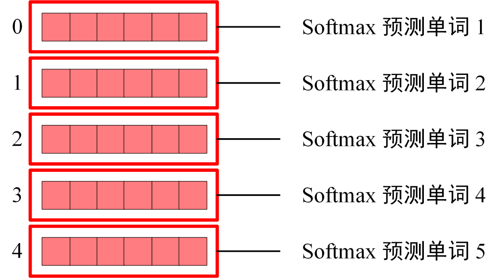

## 7. 内部结构总览

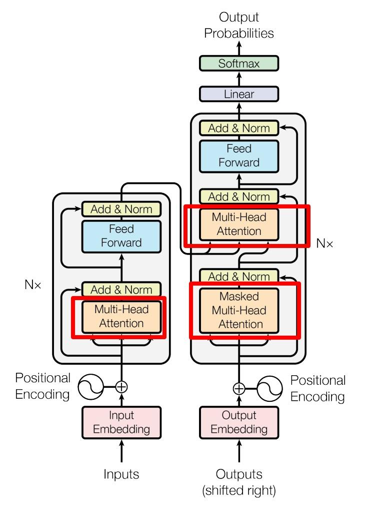

图中：
- 左侧为 Encoder block
- 右侧为 Decoder block
- 红色圈中为 Multi-Head Attention

## 8. 总结

### Transformer 的核心特点

| 特性 | 说明 |
|-----|-----|
| 并行计算 | 相比 RNN 可以完全并行化训练 |
| 全局信息 | Self-Attention 让每个位置都能关注所有位置 |
| 位置信息 | 通过位置 Embedding 注入序列位置 |
| 多头注意力 | 捕获多种维度的语义关系 |

### 关键要点

1. **Transformer 不能利用单词的顺序信息**，需要在输入中添加位置 Embedding，否则就变成了词袋模型

2. **Self-Attention** 是核心，通过 Q、K、V 矩阵建立序列中任意位置的联系

3. **Multi-Head Attention** 由多个 Self-Attention 组成，可以捕获不同类型的信息

4. **残差连接和层归一化** 确保深层网络的稳定训练

### Transformer 的影响

Transformer 架构催生了众多重要的模型：

| 模型 | 发布时间 | 特点 |
|-----|---------|-----|
| BERT | 2018 | 双向编码器，掩码语言模型 |
| GPT | 2018 | 单向解码器，下一个词预测 |
| GPT-2 | 2019 | 更大的模型，更好的生成 |
| GPT-3 | 2020 | 1750 亿参数，few-shot 学习 |
| ChatGPT | 2022 | RLHF 对话优化 |

---

## 参考资料

[^1]: Vaswani, A., et al. (2017). "Attention Is All You Need". *Advances in Neural Information Processing Systems*, 30.

[^2]: Jay Alammar. "The Illustrated Transformer". https://jalammar.github.io/illustrated-transformer/

[^3]: Harvard NLP. "The Annotated Transformer". https://nlp.seas.harvard.edu/2018/04/03/attention.html

[^4]: 百度百科. "Transformer 模型详解". https://baijiahao.baidu.com/s?id=1651219987457222196

[^5]: Google AI Blog. "Transformer: A Novel Neural Network Architecture for Language Understanding". https://research.google/blog/transformer-a-novel-neural-network-architecture-for-language-understanding/
