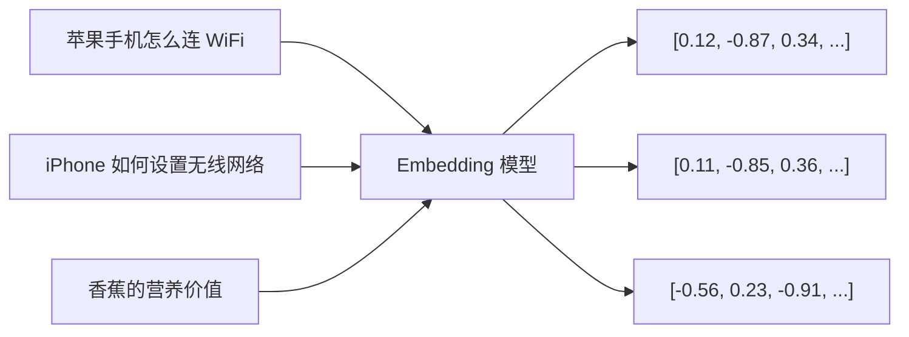

# 向量数据库是什么？从零理解 RAG 的检索引擎

在搭建 RAG 系统时，"向量数据库"几乎是出现频率最高的词之一。但如果你之前只接触过 MySQL、Redis 这类数据库，初次看到这个概念可能会觉得很陌生——向量是什么？为什么要专门建一个数据库来存它？

本文从头讲清楚这些问题。

---

## 一、普通数据库解决不了的问题

先看一个场景：你有一个包含 10 万篇文章的知识库，用户输入一句话"如何提高代码审查效率"，你想从中找出最相关的几篇文章。

用普通数据库怎么做？

```sql
-- 全文搜索
SELECT * FROM articles
WHERE content LIKE '%代码审查%' OR content LIKE '%code review%'
```

这个方案有个根本性的缺陷：它只能做**关键词匹配**，找不到语义相近但用词不同的内容。

比如有一篇文章标题是《PR Review 的最佳实践》，里面没出现"代码审查"这四个字，但内容完全对口——普通数据库就找不到它。

这就是向量数据库要解决的问题：**基于语义相似度来检索，而不是关键词匹配。**

---

## 二、向量是什么

向量（Vector）在这里就是一个**高维浮点数数组**，比如：

```
[0.12, -0.87, 0.34, 0.56, -0.21, 0.78, ...]  # 通常有 768 到 3072 个数字
```

这个数组是由 **Embedding 模型**生成的——Embedding 模型的作用，就是把任意一段文字（或图片、音频）压缩成一个定长的数字数组，并且保证**语义相近的内容，生成的向量在空间中距离也更近**。



A 和 B 语义相近，它们生成的向量 VA 和 VB 在高维空间中距离很近。A 和 C 语义无关，VA 和 VC 距离很远。

有了这个性质，"找语义最相关的文章"就变成了一个纯数学问题：**找向量空间中距离最近的 Top-K 个向量。**

---

## 三、相似度是怎么计算的

向量之间的"距离"有几种常用的度量方式：

### 余弦相似度（最常用）

衡量两个向量的**方向**是否一致，忽略长度。结果在 -1 到 1 之间，1 表示完全相同，0 表示无关，-1 表示完全相反。

```
cosine_similarity(A, B) = (A · B) / (|A| × |B|)
```

```python
import numpy as np

def cosine_similarity(a: list[float], b: list[float]) -> float:
    a, b = np.array(a), np.array(b)
    # 点积除以两个向量的模长之积
    return np.dot(a, b) / (np.linalg.norm(a) * np.linalg.norm(b))

va = [0.12, -0.87, 0.34]
vb = [0.11, -0.85, 0.36]
vc = [-0.56, 0.23, -0.91]

print(cosine_similarity(va, vb))  # 约 0.999，非常相似
print(cosine_similarity(va, vc))  # 约 -0.98，语义相反
```

### 欧式距离（L2）

衡量两个点在空间中的**直线距离**，适合向量已经归一化的场景。

### 点积（Dot Product）

OpenAI 的 Embedding 模型推荐用点积，因为它的向量已经归一化，点积等价于余弦相似度，但计算更快。

---

## 四、为什么不用普通数据库存向量

你可能会想：向量不就是一个数组吗，存进 MySQL 的 JSON 字段不行吗？

理论上可以，但实际上完全不可行——原因是**性能**。

假设你有 100 万条文档，每条向量 1536 维（OpenAI text-embedding-3-small 的维度）。用户每次查询时，如果暴力计算当前向量和所有 100 万条向量的相似度：

```
100万 × 1536 次乘法和加法 = 每次查询约 15 亿次浮点运算
```

这在任何常规数据库里都会超时。

向量数据库的核心价值就在于：它在写入时提前建好特殊的**向量索引**，把检索从暴力的 O(n) 降到接近 O(log n)，在百万级向量中实现毫秒级检索。

---

## 五、向量索引是怎么工作的：HNSW 算法

目前最主流的向量索引算法是 **HNSW（Hierarchical Navigable Small World，分层导航小世界图）**。

### 核心思想

HNSW 的灵感来自"六度分隔理论"——世界上任意两个人，最多通过 6 个中间人就能建立联系。

HNSW 把所有向量构建成一个多层图结构：

```
第 2 层（稀疏，远程跳转）：  A ——————————————— G
                              |                   |
第 1 层（中等密度）：        A ——— C ——— E ——— G
                              |       |       |
第 0 层（最密，近邻连接）：  A - B - C - D - E - F - G
```

- **底层（第 0 层）**：每个节点和它最近的邻居相连，连接最密集
- **上层**：只保留部分节点，连接更稀疏，但每条边跨越的距离更远

### 搜索过程

1. 从最顶层的入口节点出发
2. 在当前层贪心移动：每次跳到离查询向量更近的邻居
3. 到达当前层的局部最优点后，下沉到下一层，继续搜索
4. 到达底层后，返回最近的 Top-K 个节点

```mermaid
graph TD
    subgraph 第2层
        A2((A)) --> G2((G))
    end
    subgraph 第1层
        A1((A)) --> C1((C)) --> E1((E)) --> G1((G))
    end
    subgraph 第0层 查询目标★在此
        A0((A)) --- B0((B)) --- C0((C)) --- D0((D))
        D0 --- E0((E★)) --- F0((F)) --- G0((G))
    end

    A2 -.下沉.-> A1
    G2 -.下沉.-> G1
    E1 -.下沉.-> E0
```

这种设计让搜索在高层快速跨越大距离，在低层精确定位近邻，整体复杂度接近 O(log n)。

:::note
HNSW 是一种**近似**最近邻搜索（ANN），不保证找到绝对最近的向量，但在精度和速度之间取得了极好的平衡。实践中，HNSW 的召回率通常在 95% 以上，而速度比暴力搜索快几个数量级。
:::

---

## 六、向量库能存什么

向量库存储的不只是向量本身，还有和向量绑定的**元数据（metadata）**：

```python
# 一条完整的向量库记录
{
    "id": "doc_001_chunk_3",          # 唯一 ID
    "embedding": [0.12, -0.87, ...],  # 向量，由 Embedding 模型生成
    "document": "RAG 的核心思路是...", # 原始文本
    "metadata": {                      # 附加信息，用于过滤
        "source": "rag_guide.pdf",
        "page": 3,
        "tenant_id": "company_abc",
        "created_at": "2025-01-01"
    }
}
```

检索时可以同时使用**向量相似度 + metadata 过滤**：

```python
# 找和查询最相似的 5 条，且只在 tenant_id = "company_abc" 的数据里找
results = collection.query(
    query_embeddings=[query_vec],
    n_results=5,
    where={"tenant_id": "company_abc"}
)
```

---

## 七、用 ChromaDB 从零实现一个向量库

ChromaDB 是目前最容易上手的向量库，纯 Python，无需额外部署服务，适合本地开发和原型验证。

### 安装

```bash
pip install chromadb openai
```

### 建库 + 写入

```python
import chromadb
from openai import OpenAI

openai_client = OpenAI()
chroma_client = chromadb.Client()  # 内存模式，进程退出后数据消失

# 持久化到磁盘：chromadb.PersistentClient(path="./chroma_db")
collection = chroma_client.create_collection(
    name="my_knowledge_base",
    metadata={"hnsw:space": "cosine"}  # 指定用余弦相似度
)

def get_embedding(text: str) -> list[float]:
    resp = openai_client.embeddings.create(
        model="text-embedding-3-small",
        input=text
    )
    return resp.data[0].embedding

# 准备几条文档
docs = [
    {"id": "doc_1", "text": "HNSW 是一种用于近似最近邻搜索的图索引算法，通过分层结构实现高效检索。"},
    {"id": "doc_2", "text": "余弦相似度衡量两个向量的方向夹角，常用于文本语义相似度计算。"},
    {"id": "doc_3", "text": "Python 的 asyncio 模块提供了基于协程的并发编程能力。"},
]

# 批量写入
collection.add(
    ids=[d["id"] for d in docs],
    embeddings=[get_embedding(d["text"]) for d in docs],
    documents=[d["text"] for d in docs],
)

print(f"已写入 {collection.count()} 条记录")
```

### 检索

```python
def search(query: str, top_k: int = 3) -> list[dict]:
    query_vec = get_embedding(query)

    results = collection.query(
        query_embeddings=[query_vec],
        n_results=top_k,
        include=["documents", "distances"]
    )

    return [
        {
            "text": doc,
            "score": round(1 - dist, 4)  # 余弦距离转相似度分数
        }
        for doc, dist in zip(
            results["documents"][0],
            results["distances"][0]
        )
    ]

# 语义相似的查询，能找到 doc_1 和 doc_2
hits = search("怎么快速找到最相似的向量？")
for h in hits:
    print(f"[{h['score']:.4f}] {h['text'][:50]}...")
```

运行结果（示意）：

```
[0.8821] HNSW 是一种用于近似最近邻搜索的图索引算法...
[0.7643] 余弦相似度衡量两个向量的方向夹角...
[0.2104] Python 的 asyncio 模块提供了基于协程...
```

注意第三条 asyncio 文档得分很低，因为语义完全无关，即使没有关键词"向量"出现，向量库也能正确排除它。

---

## 八、主流向量库选型对比

| | **ChromaDB** | **Pinecone** | **Weaviate** | **pgvector** | **Milvus** |
|---|---|---|---|---|---|
| 部署方式 | 本地 / 自托管 | 托管服务 | 自托管 / 托管 | PostgreSQL 扩展 | 自托管 |
| 适合规模 | 百万以下 | 千万级 | 千万级 | 百万级 | 亿级 |
| 过滤能力 | 基础 | 较强 | 很强（GraphQL） | 最强（SQL） | 较强 |
| 上手难度 | 最低 | 低 | 中 | 低（会 SQL 即可） | 较高 |
| 适合场景 | 本地开发、原型 | 快速上线、SaaS | 复杂业务逻辑 | 已有 PG 基础设施 | 超大规模生产 |

**选型建议：**

- 刚开始学 RAG、本地跑 demo → **ChromaDB**
- 要快速上线、不想运维 → **Pinecone**
- 团队已在用 PostgreSQL → **pgvector**（无需新增基础设施，直接加扩展）
- 业务权限规则复杂、需要混合检索 → **Weaviate**
- 数据量超过千万、高并发生产 → **Milvus**

:::tip
pgvector 是被严重低估的选项。大多数业务系统本身就有 PostgreSQL，直接 `CREATE EXTENSION vector` 就能用，支持完整的 SQL WHERE 过滤，对小团队来说运维成本几乎为零。
:::

---

## 九、向量库 vs 传统数据库 vs 搜索引擎

|  | 传统数据库（MySQL） | 搜索引擎（Elasticsearch） | 向量数据库 |
|---|---|---|---|
| **检索方式** | 精确匹配 | 关键词全文搜索（TF-IDF/BM25） | 语义相似度（向量距离） |
| **能找到同义词** | 否 | 部分（需配置同义词表） | 是（天然支持） |
| **能理解语义** | 否 | 否 | 是 |
| **适合场景** | 结构化数据查询 | 关键词搜索、日志检索 | 语义搜索、RAG、推荐 |

:::note
这三类并不互斥。很多生产级 RAG 系统会用**混合检索**：向量库做语义检索 + Elasticsearch 做关键词检索，再把两路结果融合排序（RRF），兼顾语义理解和关键词精准匹配。
:::

---

## 总结

向量数据库的本质：**把"语义相似"这个模糊概念，转化成可以高效计算的数学问题。**

| 概念 | 一句话解释 |
|---|---|
| **向量（Embedding）** | 把文本压缩成一个高维数字数组，语义近的向量距离近 |
| **余弦相似度** | 度量两个向量方向是否一致，值越接近 1 越相似 |
| **ANN / HNSW** | 提前建索引，避免暴力遍历，实现毫秒级近似检索 |
| **向量库** | 专门存储向量并支持高效 ANN 检索的数据库 |
| **在 RAG 中的角色** | 负责"从海量文档里找出和用户问题语义最相关的片段" |

如果你之后还想深入了解 Embedding 模型本身是怎么训练的，或者混合检索（向量 + BM25）的具体实现，可以作为这篇文章的延伸阅读。

::: details 延伸阅读
- [HNSW 原始论文](https://arxiv.org/abs/1603.09320)
- [ChromaDB 官方文档](https://docs.trychroma.com/)
- [pgvector GitHub](https://github.com/pgvector/pgvector)
- [Pinecone 学习中心](https://www.pinecone.io/learn/)
- [ANN Benchmarks（各算法性能对比）](https://ann-benchmarks.com/)
:::
