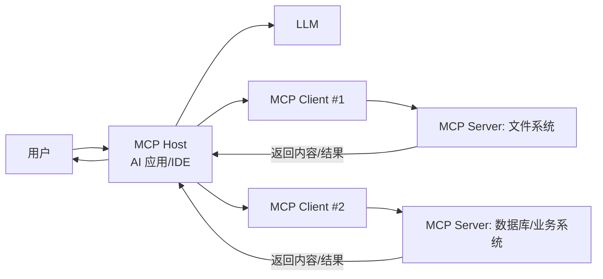

# 什么是 MCP？一文读懂 Model Context Protocol（通俗版）

你可能有过这种体验：
*   你让 AI “帮我查一下数据库里今天的订单量”，它说得头头是道，但其实它根本没连数据库。
*   你让 AI “帮我在项目里把所有 `foo` 改成 `bar`”，它能给你建议，却不能直接改文件、跑测试。

原因很简单：**大模型（LLM）擅长“想”和“说”，但它默认没有权限和能力去“做”。**

**MCP（Model Context Protocol）** 的出现，就是为了解决这件事：

> 让 AI 应用用一种标准方式，安全、可控地连接外部工具和数据源。

如果你把 AI Agent 想成“数字打工人”，那 MCP 就像给它配套的 **“通用 USB 接口”**：
*   插上“文件系统”这根线，它就能读写文件。
*   插上“数据库”这根线，它就能查表跑 SQL。
*   插上“Jira / GitHub / Sentry”这根线，它就能查任务、提 PR、看告警。

---

## 一、MCP 解决的到底是什么问题？

在 MCP 之前，AI 连接工具通常是“各写各的”：
*   你在 A 产品里集成一次 GitHub。
*   换到 B 产品，又要集成一次 GitHub。
*   工具越多，重复工作越多；权限、审计、安全策略也很难统一。

MCP 的核心价值是：
*   **标准化**：把“AI 怎么调用工具/拿数据”这件事，变成通用协议。
*   **可复用**：同一个 MCP Server，可以被多个 AI 应用复用。
*   **可控**：把能力收敛到可审计的接口上，减少“模型乱来”。

---

## 二、MCP 的三种“能力”：Tools / Resources / Prompts

你可以把 MCP Server 想象成一个“能力商店”，里面通常提供三类东西：

### 1. Tools：让 AI 能“动手”

Tool 就是一个可被调用的函数（但不是写在模型里，而是写在你的系统里）。
*   例子：`searchIssues(query)`、`readFile(path)`、`runSQL(sql)`、`createTicket(title)`

当 AI 需要行动时，它会选择调用某个 Tool，然后根据 Tool 返回的结果继续推理。

### 2. Resources：让 AI 能“看见”

Resource 更像“可读取的资料源”，用于把上下文喂给模型。
*   例子：`resource://repo/README.md`、`resource://db/schema`、`resource://sentry/incidents/today`

和 Tool 的差别：
*   Tool 更偏“动作”（会产生效果、执行操作）。
*   Resource 更偏“内容”（提供上下文，通常是只读或弱副作用）。

### 3. Prompts：让 AI 更“会用”

Prompt 在 MCP 里不是“用户随口写的提示词”，而是 **服务器提供的提示词模板**。
*   例子：`code_review(code)`、`incident_summary(incident_id)`

它的意义在于：
*   把团队沉淀的最佳实践写成模板，让 AI 用统一的方式做事。
*   降低使用门槛：用户不需要记复杂 Prompt，只要选一个模板并填参数。

---

## 三、MCP 的架构：Host / Client / Server（谁是谁？）

MCP 是典型的 Client-Server 架构：
*   **MCP Host**：真正的 AI 应用（例如桌面客户端、IDE 插件、代码助手）。它负责调度模型、管理连接、展示 UI。
*   **MCP Client**：Host 内部的“连接器”，负责和某个 MCP Server 建立会话、协商能力。
*   **MCP Server**：提供 Tools/Resources/Prompts 的程序。它可以跑在本地，也可以远程部署。

一个 Host 往往会连接多个 Server：文件系统一个、数据库一个、公司内部平台一个。

MCP 的通信协议基于 **JSON-RPC 2.0**，传输层既可以是本地进程的 **STDIO**，也可以是远程的 **HTTP（可流式）**（具体机制以官方规范为准）。参考：MCP Architecture Overview。

---

## 四、MCP 和 Function Calling 有什么区别？

很多人第一次听 MCP，会问：这不就是“函数调用”吗？

它们确实很像，但关注点不同：

| 维度 | Function Calling（常见） | MCP（更像生态协议） |
| --- | --- | --- |
| 目标 | 让模型选择调用哪个函数 | 让 AI 应用用标准方式接入外部能力 |
| 能力位置 | 通常在某个应用/某个 SDK 内部 | 能力通过 MCP Server 暴露，跨应用复用 |
| 能力类型 | 多为 tools（函数） | tools + resources + prompts |
| 集成成本 | 每个产品各集成一遍 | 写一次 MCP Server，多处可用 |
| 权限/审计 | 各自实现 | 更容易在 Server 层统一收口 |

一句话：
*   Function Calling 解决“模型怎么选函数”。
*   MCP 解决“外部能力怎么标准化地接进来”。

---

## 五、一个最常见的 Agent 工作流（通俗版）

以“帮我生成一份线上事故复盘”举例：

1.  用户：给我生成今天 10:00 的故障复盘。
2.  Host：把问题发给 LLM。
3.  LLM：判断需要数据，选择调用 `getIncident(incident_id)`（Tool）。
4.  MCP Server（Sentry/告警平台）：返回事件详情（Observation）。
5.  LLM：再调用 `getRelatedDeployments()`、`getLogs()`。
6.  Host：把这些结果作为上下文，最终让模型生成复盘文档。

你会发现：
*   LLM 负责“推理”和“写作”。
*   MCP 负责“把真实世界的数据和操作接进来”。

---

## 六、从 0 到 1 写一个 MCP Server，要考虑哪些事？

就算不写代码，你也可以用这张清单理解 MCP Server 的工程要点：

### 1. 你要暴露哪些能力？
*   Tools：哪些动作是允许 AI 做的？
*   Resources：哪些上下文是必要的？
*   Prompts：哪些流程需要模板化、标准化？

### 2. 你要怎么做权限控制？
*   **最小权限**：能只读就不写；能限定目录就不全盘。
*   **显式授权**：关键操作（删库、发钱、发邮件）最好要求用户确认。
*   **审计日志**：记录“谁在什么时候调用了什么工具、参数是什么、结果如何”。

### 3. 你要怎么处理“模型幻觉”？
*   不要相信模型给的参数，**服务端必须校验**。
*   所有工具都要设计“失败路径”（参数错误、权限不足、外部服务超时）。
*   返回结构化错误，让 Host 可以提示用户或引导模型重试。

### 4. 你要怎么做“可靠性”？
*   超时、重试、限流。
*   对长任务提供进度。
*   对外部依赖（数据库/第三方 API）做隔离。

---

## 七、MCP、Agent Skills、Agent：它们是什么关系？

用一句话串起来：
*   **LLM**：大脑（会推理和生成）。
*   **MCP**：标准接口（把工具和数据接进来）。
*   **Agent Skills**：操作手册（教 AI 用什么步骤做事）。
*   **Agent**：最终形态（能规划、能调用工具、能记忆、能完成任务的系统）。

你会发现，MCP 更像“能力供给侧”，Skills 更像“流程供给侧”。两者组合起来，Agent 才真正能从“会说”走向“会做”。

---

## 八、你什么时候该用 MCP？

如果你满足下面任意一条，就很适合用 MCP：
*   你想让 AI 访问企业内部系统（知识库、工单、监控、数据库）。
*   你想把某个工具能力做成“可复用组件”，供多个 AI 产品使用。
*   你希望权限与审计统一在服务端，而不是散落在各个客户端。

如果你只是做一个小 Demo、只有一个函数要调，用 Function Calling 也完全够。

---

## 参考资料

*   Model Context Protocol - Architecture overview：https://modelcontextprotocol.io/docs/learn/architecture
*   Model Context Protocol - Build an MCP server：https://modelcontextprotocol.io/docs/develop/build-server

