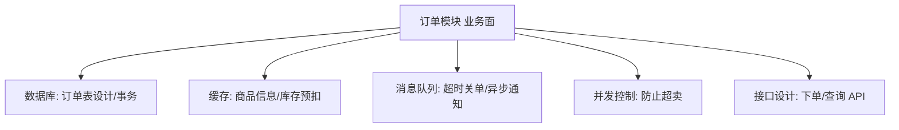
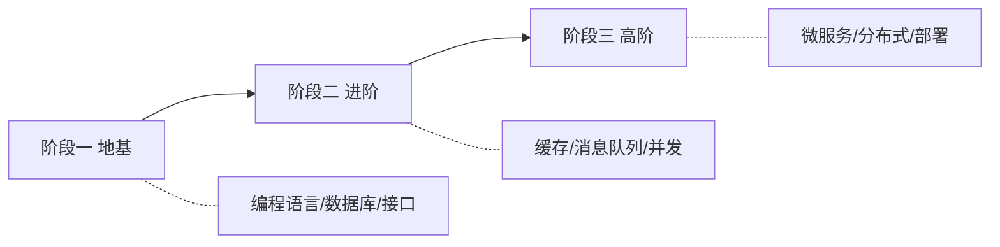

# 后端开发学习路线图：从零到系统掌握的完整地图

如果你刚入门后端，大概率会有这种感觉：

> 登录、订单、支付、缓存、消息队列、微服务、Docker……名词一大堆，到底先学哪个？每个又该学到什么程度？

这篇文章不是又一份"技术名词清单"，而是想解决一个更根本的问题：**帮你在脑子里建立一张有优先级、有层次的地图**，让你知道什么时候该学什么、什么可以先放着不管。

适合的读者：

- 刚开始学后端，面对一堆概念无从下手的人
- 会写增删改查，但不知道下一步该往哪走的人
- 想把零散知识点串成体系的人

:::note
本文只讲"学什么、按什么顺序学"，不深入每个技术的细节。文中会链接到本站更深入的专题文章，你可以按需展开。
:::

---

## 一、先建立一个心智模型：业务模块 vs 技术能力

初学者最大的困惑，往往来自把两类完全不同的东西混在一起记。它们分别是：

- **业务模块**：解决具体业务场景的功能。比如登录、订单、支付、评论。它们是"面"——面向用户的功能。
- **技术能力（基础设施）**：支撑所有业务模块的底层通用能力。比如数据库、缓存、消息队列、并发控制。它们是"里"——藏在功能背后的支柱。

这两者的关系是这样的：

> 任何一个业务模块，都是若干技术能力的组合。

举个例子，一个看似普通的"订单模块"，背后其实用到了：



:::important
这个模型是本文的核心。理解它，你就能想通一件事：**业务模块靠积累（遇到就学），技术能力靠钻研（是你的立身之本）。**

换个行业，业务模块可能完全不同（电商、金融、社交各一套），但底层技术能力是通用的。所以你真正要投入精力打磨的，是"里"，不是"面"。
:::

想深入理解"面向业务的模块该如何拆分设计"，可以参考本站的 [微服务架构设计与实践](/posts/architecture/microservices-architecture-design-and-practice)，这里先不展开。

---

## 二、常见的业务模块（"面"）——了解即可，不用死记

先把业务模块过一遍，让你心里有数。**这部分不需要背**，重点是知道它们大概解决什么问题、用到哪些技术能力。

| 业务模块 | 解决什么问题 | 主要用到的技术能力 |
|---------|------------|-----------------|
| [登录 / 权限](/posts/architecture/login-module-complete-guide) | 你是谁？你能干什么？ | 数据库、缓存、加密、Token |
| [订单](/posts/architecture/order-module-complete-guide) | 交易的生命周期管理 | 数据库事务、并发、消息队列 |
| [支付](/posts/architecture/payment-module-complete-guide) | 对接第三方收款/退款 | 幂等、状态一致性、回调处理 |
| [商品 / 库存](/posts/architecture/product-inventory-module-complete-guide) | 商品信息与库存管理 | 数据库、缓存、并发控制 |
| 购物车 | 临时的选购数据 | 缓存（Redis）为主 |
| [消息通知](/posts/architecture/notification-module-complete-guide) | 短信/邮件/推送 | 消息队列、异步任务 |
| [搜索](/posts/architecture/search-module-complete-guide) | 大数据量的模糊查询 | 搜索引擎（Elasticsearch） |
| [文件 / 媒体](/posts/architecture/file-media-module-complete-guide) | 图片视频上传存储 | 对象存储（OSS/MinIO） |

:::tip
业务逻辑通常是后端里**最容易学**的部分——它就是"把现实规则翻译成代码"。所以不要因为"业务模块列举不完"而焦虑，遇到具体需求时现学业务规则即可。表格里带链接的模块，本站都有从零讲透的完整指南，可以点进去深入。
:::

真正决定你水平上限的，是下面这些技术能力。

---

## 三、后端技术能力全景（"里"）——按重要性排序

这一章是全文的重点。我按**重要性和学习优先级**排列，越靠前越该先学、越该学透。

### 1. 数据库 —— 后端的地基，最重要，没有之一

如果只能学一样，那就是数据库。几乎所有后端问题最终都会落到"数据怎么存、怎么查、怎么保证不出错"。

你需要依次掌握：

- **SQL 基础**：增删改查、多表关联（JOIN）、分组聚合（GROUP BY）。
- **索引**：为什么查询慢、索引怎么加、什么情况下索引会失效。这是面试必考、实战必用。
- **事务与隔离级别**：什么是事务的 ACID，脏读、不可重复读、幻读分别是什么。
- **表结构设计**：怎么把业务需求拆成合理的表。

举个索引的直观例子。假设有一张百万行的用户表，下面这条查询没有索引时会**全表扫描**（逐行检查），非常慢：

```sql
-- 查某个邮箱的用户，email 列没有索引
SELECT * FROM users WHERE email = 'alice@example.com';
```

给 `email` 加上索引后，数据库就能像查字典一样快速定位，而不用一行行翻：

```sql
-- 加索引后，查询从"全表扫描"变成"索引查找"
CREATE INDEX idx_users_email ON users(email);
```

:::warning
索引不是加得越多越好。每个索引都会让**写入**（INSERT/UPDATE）变慢，因为写数据时索引也要跟着更新。索引是典型的"用写换读"的取舍。
:::

本站相关深入文章：[订单系统的表结构与索引设计](/posts/architecture/order-system-schema-and-index-design)。

### 2. 缓存（Redis）—— 扛住高并发读的第一道防线

数据库的读性能是有上限的。当读请求非常多时，就在数据库前面放一层内存缓存（Redis），大部分读请求直接从内存返回，不打到数据库。

核心认知：

- **缓存的本质**：拿"可能读到旧数据"的风险，换"快得多的读性能"。
- **三大经典问题**（面试高频）：
  - **缓存穿透**：查一个根本不存在的数据，缓存和数据库都没有，请求每次都穿透到数据库。
  - **缓存击穿**：某个热点 key 突然过期，瞬间大量请求同时打到数据库。
  - **缓存雪崩**：大量 key 在同一时刻集体过期，数据库瞬间被压垮。
- **数据一致性**：数据库更新了，缓存怎么同步？这是缓存最难的部分。

一个最基础的"缓存读取"逻辑长这样（伪代码，思路比语法重要）：

```js
// 可运行
// 模拟"先查缓存，miss 再查库并回填"的经典读缓存流程
const cache = new Map();          // 假装这是 Redis
const db = { 1: '张三', 2: '李四' }; // 假装这是数据库

function getUser(id) {
  // 1. 先查缓存
  if (cache.has(id)) {
    return `[缓存命中] ${cache.get(id)}`;
  }
  // 2. 缓存没有，查数据库
  const user = db[id];
  if (user) {
    cache.set(id, user); // 3. 回填缓存，下次就能命中
    return `[查库并回填] ${user}`;
  }
  return '[用户不存在]';
}

console.log(getUser(1)); // 第一次：查库并回填
console.log(getUser(1)); // 第二次：缓存命中
```

本站相关深入文章：[Redis 核心概念与数据结构](/posts/redis/redis-core-concepts)、[Redis 缓存实战](/posts/redis/redis-cache-in-depth)（三大问题、一致性、多级缓存讲透）。

### 3. 接口设计与网络基础 —— 后端对外的门面

你写的后端最终要通过接口被前端或其他服务调用，所以要懂：

- **RESTful API 设计**：URL 怎么规划、HTTP 方法（GET/POST/PUT/DELETE）分别什么语义、状态码（200/400/401/404/500）代表什么。
- **HTTP/HTTPS 基础**：请求-响应模型、请求头、Cookie、跨域（CORS）。
- **数据格式**：JSON 的序列化与反序列化。

:::tip
一个好接口的判断标准：别人不看你的代码，光看接口文档就知道怎么调、会返回什么。
:::

本站相关深入文章：[RESTful API 设计完全指南](/posts/architecture/restful-api-design-guide)（资源建模、状态码、错误码、版本管理讲透）。

### 4. 消息队列（Kafka / RabbitMQ / RocketMQ）—— 异步与解耦利器

消息队列有三大经典用途，记住这三个场景就懂了它为什么存在：

- **异步**：用户下单后，"发短信通知"这种慢操作不该让用户干等，丢进队列慢慢处理。
- **削峰**：秒杀瞬间上万请求，先进队列排队，后端按自己的节奏消费，避免被冲垮。
- **解耦**：订单模块不用直接调用库存、积分、通知模块，只发一条"订单已创建"的消息，各模块自己去订阅。

本站相关文章：[基于 Outbox 的消息可靠投递](/posts/architecture/nodejs-outbox-mq-reliable-delivery-guide)。

### 5. 并发与多线程 —— 高质量后端的分水岭

同一时刻多个请求一起操作同一份数据，就会出并发问题。前面订单模块的"超卖"就是典型例子。你需要理解：

- 什么是线程安全、竞态条件（race condition）。
- 锁的概念：乐观锁、悲观锁、分布式锁。
- 死锁是怎么产生的。

### 6. 日志、监控与排错 —— 工作中每天都在用

这块学校和教程往往不教，但工作里天天用：

- 怎么打日志、日志分级（DEBUG/INFO/WARN/ERROR）。
- 怎么通过日志定位线上 Bug。
- 基本的监控与告警意识。

本站相关文章：[Node.js 订单系统的可观测性与告警](/posts/architecture/nodejs-order-observability-alerting-guide)。

### 7. 定时任务与任务调度 —— 几乎每个系统都要用

订单超时关单、每日对账、通知重试、缓存预热……这些"到点自动执行"的活儿都靠定时任务。核心要掌握：

- cron 表达式与周期任务、延迟任务的区别。
- 分布式下"多实例重复执行"这个必踩的坑，以及分布式锁/调度中心的解法。
- 延迟任务的几种实现（扫表 / Redis ZSet / MQ 延迟消息）。

本站相关文章：[定时任务与任务调度完全指南](/posts/architecture/scheduled-task-job-scheduling-guide)。

### 8. 稳定性：限流、熔断、降级 —— 系统的自我保护（进阶）

系统扛不住流量、依赖挂掉、要防雪崩时的三件保命武器：

- **限流**：控制入口流量（令牌桶等算法）。
- **熔断**：切断故障的下游依赖，防止雪崩。
- **降级**：牺牲非核心功能，保住核心链路。

这块属于进阶内容，建议基础扎实后再深入。本站相关文章：[稳定性三板斧：限流、熔断与降级](/posts/architecture/rate-limiting-circuit-breaker-degradation-guide)。

---

## 四、分阶段学习路线（重点：什么时候学什么）

知道了要学什么，更关键的是**顺序**。下面把整个后端学习分成三个阶段，请一定按顺序来，不要跳级。



### 阶段一：地基（先在这里扎稳，别急着往上走）

目标是能**独立做出一个完整的、能跑起来的后端项目**。

1. **一门后端语言 + 一个 Web 框架**：比如 Java + Spring Boot、Node.js + Express/Nest、Python + Django/FastAPI、C# + ASP.NET Core。选一个，别贪多。
2. **关系型数据库**：MySQL 或 PostgreSQL，把 SQL、索引、事务学扎实。
3. **RESTful 接口设计**：能设计出清晰的增删改查接口。
4. **一个完整的"登录 + 权限"模块**：这是检验地基是否扎实的最佳练手项目（下一章详细说）。

:::warning 常见误区
很多初学者在阶段一就想着学微服务、上 Docker、搞高并发架构，结果基础不牢，越学越挫败。**阶段一没走完，请不要碰阶段三的内容。**
:::

### 阶段二：进阶（让系统"更快、更稳、更能扛")

目标是理解真实生产环境里的常见问题和应对手段。

1. **缓存（Redis）**：缓存三大问题、缓存与数据库一致性。
2. **消息队列**：异步、削峰、解耦。
3. **并发控制**：乐观锁/悲观锁、防止超卖、幂等设计。
4. **一个稍复杂的业务模块**：比如订单模块，把上面的能力综合用一遍。

### 阶段三：高阶（规模变大后的架构问题）

:::note
这一阶段是"公司业务做大了才需要"的能力。个人学习可以了解概念，但**不必在初学阶段死磕**，否则容易劝退。
:::

1. **微服务架构**：服务拆分、服务间通信、注册中心、网关。
2. **分布式系统**：分布式事务、分布式锁、一致性（可先读 [分布式系统全面指南](/posts/architecture/distributed-systems-complete-guide)）。
3. **高并发/高可用**：负载均衡、[限流、熔断、降级](/posts/architecture/rate-limiting-circuit-breaker-degradation-guide)。
4. **容器与部署**：Docker、CI/CD、Kubernetes。

---

## 五、把知识串起来：一个贯穿式练手项目

光看路线图没用，最好的学习方式是**做一个项目，随着能力增长不断迭代它**。推荐做一个"迷你电商后端"，分三步走，正好对应三个阶段：

### 第一步（对应阶段一）：能用就行

- 用你选的语言 + 框架搭起项目。
- 设计 `users`、`products`、`orders` 三张表。
- 实现：注册、登录（先用最简单的方式）、发布商品、下单。
- 加上基于角色的权限：普通用户只能下单，管理员能管理商品。

做完这一步，你就掌握了**数据库设计 + 接口设计 + 认证授权**这套地基。

### 第二步（对应阶段二）：让它更健壮

在第一步基础上，逐个加入：

- **登录改用 JWT**：理解无状态认证（详见[登录模块完全指南](/posts/architecture/login-module-complete-guide)）。
- **给商品列表加 Redis 缓存**：体会缓存命中和一致性问题（详见[商品/库存模块](/posts/architecture/product-inventory-module-complete-guide)）。
- **下单加幂等、库存扣减加锁**：防止重复下单和超卖（详见[订单模块完全指南](/posts/architecture/order-module-complete-guide)）。
- **接入支付**：处理支付回调与对账（详见[支付模块完全指南](/posts/architecture/payment-module-complete-guide)）。
- **下单成功后用消息队列异步发通知**（详见[消息通知模块](/posts/architecture/notification-module-complete-guide)）。

:::tip
关于订单状态如何合法流转（待支付 → 已支付 → 已发货……不能乱跳），本站有专门文章：[订单状态机的 Node.js 实现](/posts/architecture/order-state-machine-nodejs-guide)。
:::

### 第三步（对应阶段三，可选）：走向分布式

当你想挑战更高目标时，再考虑：

- 把单体应用拆成"用户服务、商品服务、订单服务"。
- 处理跨服务下单时的分布式事务。
- 用 Docker 把整套服务容器化部署。

本站有一篇完整的实战文章可以参考：[分布式订单系统实战指南](/posts/architecture/distributed-order-system-practical-guide)。

---

## 六、常见问题与注意事项

::: details 应该先学哪门后端语言？
没有标准答案，选一门主流的、你所在地区招聘需求大的即可：Java（企业/大厂多）、Node.js（前端转后端友好）、Python（上手快、AI 方向多）、Go（云原生/高并发）、C#（.NET 生态）。**关键不是选哪门，而是选定后别频繁横跳。** 后端的核心能力（数据库、缓存、架构思维）是跨语言通用的，换语言只是换语法。
:::

::: details 要不要先把数据结构和算法学好再学后端？
不用等。算法在日常业务后端里用得不多，但对**面试**和**理解底层原理**（比如索引为什么用 B+ 树、Redis 为什么快）有帮助。建议**并行推进**：一边做后端项目，一边刷基础算法题，不必等算法学完再动手。
:::

::: details 微服务是不是比单体架构更高级、应该直接上？
这是最大的误区之一。**单体不是落后，微服务不是先进**，它们只是适用于不同规模。小项目上微服务反而会带来巨大的复杂度（服务拆分、分布式事务、运维成本）。初学阶段请从单体做起，等你真切体会到单体的痛点时，自然就懂微服务在解决什么了。
:::

::: details 学了很多但一做项目就懵，怎么办？
这说明你在"输入"上花的时间远多于"输出"。后端是极度强调实践的领域，**看十篇教程不如自己踩一次坑**。把第五章的练手项目做起来，遇到不会的再针对性查——带着问题学，比漫无目的地看视频高效得多。
:::

---

## 总结

回到开头，后端要学的东西虽多，但只要抓住这几条主线就不会乱：

1. **分清"面"和"里"**：业务模块靠积累，技术能力靠钻研。
2. **按优先级投入**：`数据库 > 缓存 > 接口设计 > 消息队列 > 并发 > 微服务/分布式`。
3. **严格分阶段**：地基没扎稳，别碰高阶架构。
4. **用项目串联**：做一个迷你电商后端，随能力增长不断迭代它。

学习路线不是拿来焦虑的清单，而是帮你在每个阶段**知道下一步该干什么**。找准你现在所处的阶段，专注把当前这一层打透，就是最快的进步方式。
