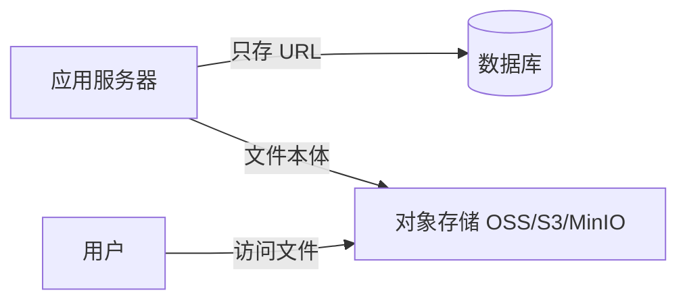
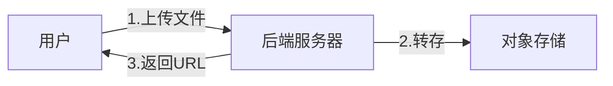
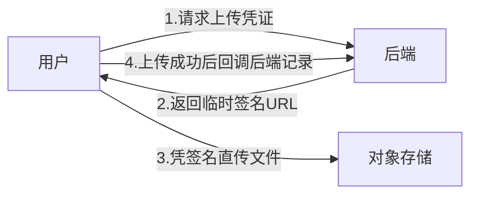
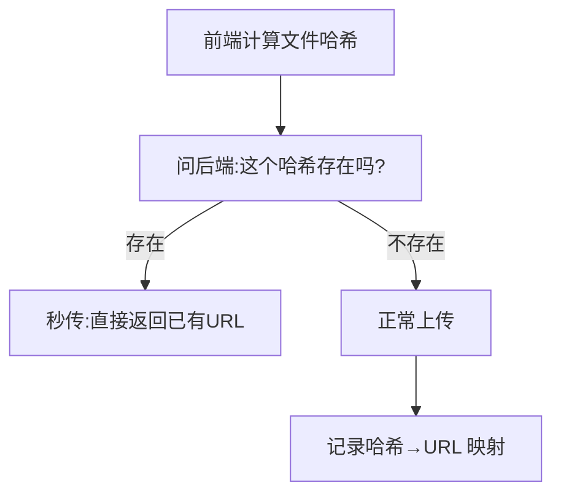
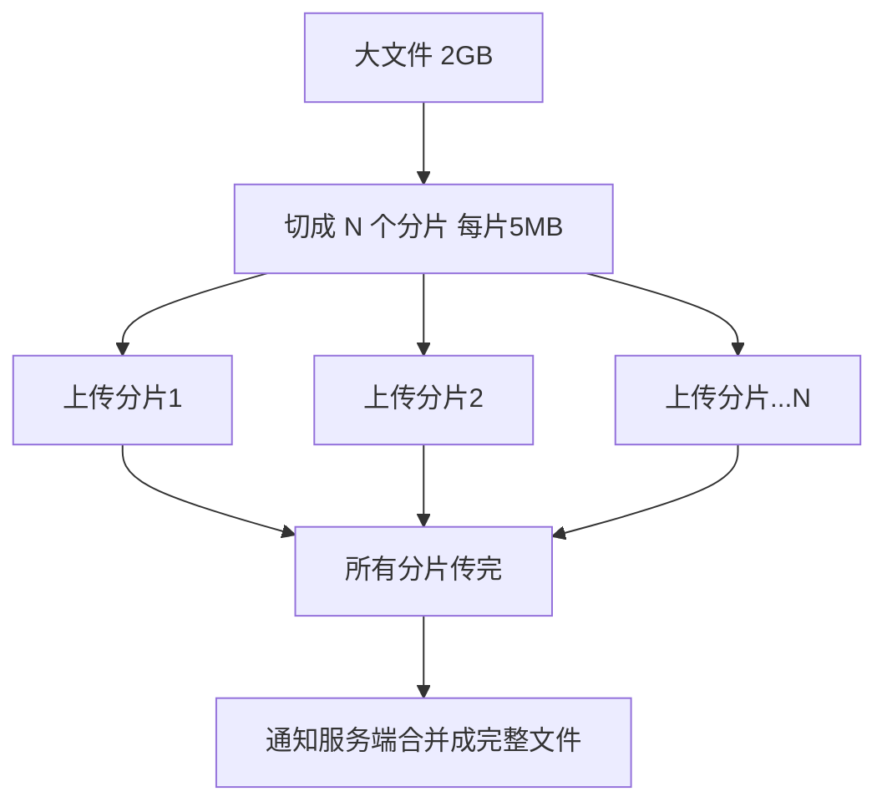
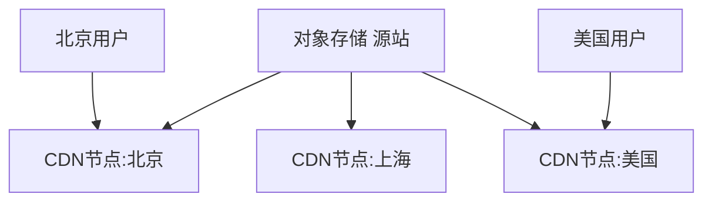
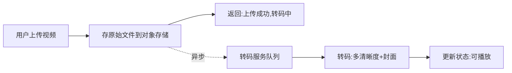
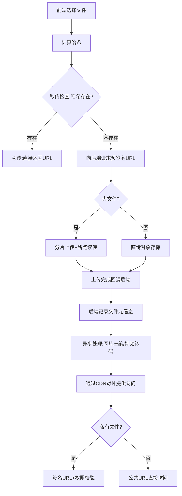

# 后端文件与媒体模块完全指南：从对象存储到直传、分片续传与 CDN

头像上传、商品图片、视频、附件……几乎每个系统都要处理文件。初学者的第一版实现通常是这样：前端把文件传给后端，后端保存到服务器的某个目录，把路径存进数据库。

小项目这样够用，但很快你会撞上一堆问题：

> 服务器磁盘满了怎么办？换了台机器文件就找不到了？上传一个 2G 的视频等半天还经常失败？同一张图一万个用户传了一万份浪费存储？图片直接原图加载页面卡到爆？

这些问题背后，是文件/媒体模块需要认真设计的几个维度：**存哪里、怎么传、怎么加速、怎么处理、怎么保证安全**。这篇文章会带你从零建立一套像样的文件服务认知，让你能独立负责这块业务。

:::note
代码以 Node.js 风格演示，重在讲清思路。对象存储以通用的 S3 兼容接口为例（阿里云 OSS、腾讯云 COS、AWS S3、自建 MinIO 用法类似），具体 API 以你使用的服务文档为准。
:::

---

## 一、第一个决策：文件该存在哪里

这是整个模块的地基。有三种存储方式，先搞清楚该选哪个。

### 1.1 方式一：存数据库（几乎总是错的）

把文件二进制内容（BLOB 字段）直接存进数据库。

:::warning
**除非是极小的特殊场景，否则不要把文件存数据库。** 大文件会让数据库急剧膨胀、备份变慢、查询性能暴跌，数据库是为结构化数据设计的，不是为存文件设计的。这是初学者要避开的第一个坑。
:::

### 1.2 方式二：存本地磁盘（小项目可用，有局限）

存在应用服务器的磁盘目录，数据库只存文件路径。

- 优点：简单，起步快。
- 缺点：**磁盘容量有限**；**多台服务器时文件不共享**（传到 A 机器，请求打到 B 机器就找不到）；服务器挂了文件可能丢失；难以做 CDN 加速。

### 1.3 方式三：对象存储（生产标准方案）

用专门的**对象存储服务**：阿里云 OSS、腾讯云 COS、AWS S3，或自建的 **MinIO**。数据库只存文件的访问 URL/key。



- 优点：**容量近乎无限**、高可用、多机共享、天然支持 CDN、有完善的权限和生命周期管理。
- 这是**生产环境的标准做法**。

:::important
记住核心原则：**文件本体放对象存储，数据库只存文件的元信息（URL、大小、类型、上传者、时间）。** 数据库和文件存储各司其职。
:::

对象存储里几个基本概念：
- **Bucket（存储桶）**：文件的容器，类似一个顶级目录。
- **Object（对象）**：存进去的一个文件。
- **Key（键）**：对象的唯一路径标识，如 `avatar/2026/07/user123.jpg`。

---

## 二、文件的元信息模型

无论文件存哪，数据库都要有一张表记录文件的**元信息**，用于管理和引用：

```sql
CREATE TABLE file_meta (
  id BIGINT PRIMARY KEY,
  file_key VARCHAR(255),   -- 对象存储里的 key
  url VARCHAR(500),        -- 访问地址
  origin_name VARCHAR(255),-- 原始文件名
  size BIGINT,             -- 大小(字节)
  mime_type VARCHAR(100),  -- 类型 image/jpeg
  hash VARCHAR(64),        -- 文件内容哈希(用于秒传/去重)
  uploader_id BIGINT,      -- 上传者
  created_at DATETIME
);
```

业务表（如商品、用户）引用文件时，存这张表的 id 或直接存 url 即可。

---

## 三、上传方式：普通上传 vs 客户端直传

文件怎么从用户传到对象存储？有两种架构，这是文件模块最重要的设计决策之一。

### 3.1 方式一：经过后端中转（普通上传）

前端把文件传给后端，后端再上传到对象存储。



- 优点：后端能完全控制（校验、处理）。
- 缺点：**文件流量全部经过后端**，占用后端带宽和内存，大文件/高并发时后端容易成为瓶颈。

### 3.2 方式二：客户端直传（推荐）

前端**直接**把文件传到对象存储，后端只负责发放一个"临时上传凭证"。文件本体不经过后端。



关键机制是**预签名 URL（Presigned URL）**：后端用自己的密钥生成一个有时效、有权限的临时上传地址，前端拿这个地址直接上传。这样：

- 文件流量**不经过后端**，后端压力小、成本低。
- 后端密钥不暴露给前端（前端只拿到临时凭证）。

```js
// 后端：生成预签名上传 URL（前端拿它直传对象存储）
async function getUploadUrl(fileName, userId) {
  const key = `upload/${userId}/${Date.now()}_${fileName}`;
  // 生成一个 5 分钟有效的临时上传地址
  const presignedUrl = await oss.getSignedUrl('putObject', {
    Bucket: 'my-bucket',
    Key: key,
    Expires: 300, // 5 分钟
  });
  return { presignedUrl, key };
}
```

:::important
**大文件、高并发场景一定要用客户端直传。** 让 GB 级的视频流量都经过后端是巨大的浪费和瓶颈。后端只做"发凭证 + 记录元信息"这种轻量工作。
:::

---

## 四、秒传：相同文件不重复上传

设想一万个用户上传同一张热门表情包，存一万份完全一样的文件，既浪费存储又浪费带宽。**秒传**就是解决这个问题的。

### 4.1 原理：用内容哈希做去重

核心思路：**用文件内容算一个哈希值（如 MD5/SHA256）作为文件的"指纹"。** 内容相同的文件，哈希一定相同。

上传前，前端先算出文件哈希，问后端"这个哈希的文件存过吗？":
- 存过 → 直接把已有文件的 URL 返回，**根本不用再传**（这就是"秒传"，一秒完成）。
- 没存过 → 正常上传。



```js
// 上传前先校验哈希是否已存在
async function checkQuickUpload(fileHash) {
  const existing = await db.file_meta.findByHash(fileHash);
  if (existing) {
    return { quickUpload: true, url: existing.url }; // 秒传
  }
  return { quickUpload: false }; // 需要真正上传
}
```

这就是网盘"秒传"功能的原理。它同时节省了存储空间（相同文件只存一份）和上传时间。

---

## 五、分片上传与断点续传：搞定大文件

上传一个 2G 的视频，如果一次性传，遇到网络抖动就前功尽弃，得从头再来。**分片上传**和**断点续传**就是为大文件设计的。

### 5.1 分片上传（Multipart Upload）

把大文件切成很多小块（如每块 5MB），一块一块地上传，最后通知服务端"合并"。



好处：
- 单个分片失败只需**重传那一片**，不用重来。
- 分片可以**并行上传**，速度更快。

对象存储都原生支持分片上传（Multipart Upload API），大致三步：初始化上传任务 → 逐片上传 → 完成合并。

### 5.2 断点续传（Resumable Upload）

在分片上传的基础上，记录"哪些分片已经传成功了"。如果上传中断（关了页面、断网），下次继续时**只传还没传成功的分片**，已传的跳过。

实现靠前面的哈希 + 分片记录：
- 每个分片也可以带编号和校验。
- 服务端记录该文件已收到哪些分片。
- 续传时前端先问"我已经传了哪些片了",然后只补传缺失的。

:::tip
分片上传解决"大文件传得快、单片失败不重来",断点续传解决"中断后能接着传"。两者配合，才能可靠地传大文件。视频、大附件场景几乎都要用。
:::

---

## 六、CDN 加速：让文件访问变快

文件存到对象存储后，用户访问还有一个问题：如果所有用户都从同一个地方（比如杭州的机房）下载文件，离得远的用户（比如美国）会很慢。

**CDN（内容分发网络）** 就是解决这个的：把文件缓存到全球各地的**边缘节点**，用户就近访问最近的节点，大幅提速。



- 用户访问的是 CDN 地址，CDN 有缓存就直接返回（快），没有才回源站（对象存储）取。
- 对**图片、视频、静态资源**这类"一次上传、多次读取"的文件效果极好。

:::important
文件/媒体是 CDN 最典型的应用场景（读多写少、内容不变）。生产系统里，对象存储 + CDN 几乎是标配组合：对象存储负责可靠存储，CDN 负责快速分发。
:::

---

## 七、媒体处理：图片与视频

存进来的原始媒体文件往往不能直接用，需要处理。

### 7.1 图片处理

原图往往几 MB，直接在列表页加载几十张原图会让页面卡死、流量爆炸。常见处理：

- **缩略图 / 多尺寸**：为列表、详情、头像生成不同尺寸的图。列表加载小图，点开才看大图。
- **格式转换 / 压缩**：转成更省流量的格式（如 WebP），在几乎无损的前提下大幅减小体积。
- **水印**：加版权或防盗水印。

:::tip
好消息是，主流对象存储（OSS/COS）都内置了**图片处理服务**：你不用自己写代码处理，只要在图片 URL 后加参数就能实时得到处理后的图。比如 `图片URL?x-oss-process=image/resize,w_200` 就能拿到宽 200 的缩略图。这是最省事的做法。
:::

```
原图:    https://cdn.example.com/photo.jpg
缩略图:  https://cdn.example.com/photo.jpg?x-oss-process=image/resize,w_200
```

### 7.2 视频处理：转码

用户上传的视频格式五花八门（MOV、AVI、各种编码），不一定能在所有浏览器/App 播放，而且原始视频往往很大。所以要**转码**：

- 转成通用格式（如 H.264 编码的 MP4）保证兼容性。
- 转成**多种清晰度**（360p/720p/1080p），支持根据网速自动切换（自适应码率）。
- 生成**视频封面图**。

视频转码很耗 CPU、耗时长，所以必须**异步处理**：用户上传后先返回，转码任务丢到队列里由专门的转码服务慢慢处理，转好了再更新状态。云服务商也提供现成的**媒体处理服务**，中小项目直接用即可，不必自建转码集群。



---

## 八、上传安全：不能忽视的红线

文件上传是常见的攻击入口，下面这些防护必须做：

- **文件类型校验**：只允许业务需要的类型。**不能只信前端传的后缀名和 Content-Type**（可伪造），要校验文件真实的**魔数（文件头字节）**。比如伪装成 `.jpg` 的实际是可执行脚本，靠文件头能识破。
- **文件大小限制**：限制单文件和总量大小，防止有人上传超大文件耗尽存储/带宽。
- **文件名处理**：不要直接用用户提供的文件名（可能含路径穿越 `../` 或特殊字符），重命名为随机/规范化的名字。
- **防止上传可执行文件**：尤其是上传目录如果能被 Web 服务器执行，上传一个脚本就可能被远程执行（严重漏洞）。存对象存储天然规避了这点。
- **防盗链**：别人把你的图片 URL 贴在他的网站上，盗用你的流量。对象存储/CDN 支持 **Referer 防盗链**或**签名 URL**（私有文件访问时才生成临时 URL）来防护。
- **敏感内容审核**：涉及用户上传的图片/视频，很多场景（尤其国内）要接入内容审核，过滤违规内容。

```js
// 校验文件真实类型（读文件头魔数，而不是信后缀）
function checkFileType(buffer, allowedTypes) {
  const magicNumbers = {
    'image/jpeg': [0xff, 0xd8, 0xff],
    'image/png': [0x89, 0x50, 0x4e, 0x47],
  };
  for (const type of allowedTypes) {
    const magic = magicNumbers[type];
    if (magic && magic.every((byte, i) => buffer[i] === byte)) {
      return type; // 真实类型匹配
    }
  }
  throw new Error('不允许的文件类型');
}
```

:::warning
公开可写的上传接口是黑客最爱的目标之一。**类型校验（查魔数）、大小限制、文件名重命名、私有文件用签名访问**这几项是底线，缺一不可。
:::

---

## 九、私有文件的访问控制

不是所有文件都能公开访问。用户的私密照片、付费内容、身份证件，不能让人拿到 URL 就能看。

对象存储支持两种访问权限：

- **公共读**：任何人有 URL 就能访问。适合商品图、公开头像这类。
- **私有**：必须用**临时签名 URL**才能访问。后端在用户有权限时，才生成一个短时效的签名 URL 给他。

```js
// 私有文件：为有权限的用户生成临时访问 URL
async function getPrivateFileUrl(fileKey, userId) {
  // 先校验该用户是否有权访问这个文件
  if (!(await hasPermission(userId, fileKey))) {
    throw new Error('无权访问');
  }
  // 生成 10 分钟有效的临时访问地址
  return await oss.getSignedUrl('getObject', {
    Bucket: 'my-bucket',
    Key: fileKey,
    Expires: 600,
  });
}
```

这样即使 URL 泄露，过了有效期也访问不了，且每次访问都经过权限校验。

---

## 十、把整条链路串起来

用一张图把一次完整的文件上传与访问串起来：



各知识点的落点：
- **对象存储** → 文件本体的可靠存储
- **客户端直传 + 预签名** → 文件不经过后端，减压
- **秒传（哈希去重）** → 相同文件不重复传
- **分片 + 断点续传** → 可靠上传大文件
- **CDN** → 就近加速访问
- **图片/视频处理** → 缩略图、转码，异步进行
- **安全 + 签名 URL** → 类型校验、防盗链、私有访问控制

---

## 十一、常见问题

::: details 文件可以存数据库吗？
几乎总是不该。大文件会让数据库急剧膨胀、备份变慢、性能下降。正确做法是文件存对象存储，数据库只存元信息（URL、大小、类型等）。
:::

::: details 本地磁盘存储和对象存储怎么选？
个人练手、单机小项目用本地磁盘够了。但只要涉及多台服务器、需要高可用、容量会增长、要 CDN 加速，就该用对象存储（OSS/COS/S3/MinIO）。生产环境几乎都用对象存储。
:::

::: details 为什么要客户端直传，让文件经过后端不行吗？
小文件经过后端没问题。但大文件、高并发时，让所有文件流量都经过后端会占满后端带宽和内存，成为瓶颈。客户端直传（用预签名 URL）让文件直达对象存储，后端只发凭证，压力小得多。
:::

::: details 秒传是怎么做到"一秒传完 1G 文件"的？
它并没有真的传。原理是用文件内容哈希做指纹，上传前先问服务端"这个哈希的文件存过没",存过就直接复用已有文件的 URL，根本不用传，所以是"秒传"。前提是别人之前传过完全相同的文件。
:::

::: details 只校验文件后缀名安全吗？
不安全。后缀名和 Content-Type 都能伪造。要校验文件真实的魔数（文件头字节）来确认类型，同时限制大小、重命名文件、私有文件用签名访问。上传接口是常见攻击入口，安全不能只靠后缀。
:::

---

## 小结

文件/媒体模块的核心，是围绕"文件本体"和"元信息"分离展开的一系列工程实践。回顾全文主线：

1. **存哪里**：文件本体放对象存储，数据库只存元信息。别存数据库。
2. **怎么传**：大文件/高并发用客户端直传（预签名 URL），文件不经过后端。
3. **秒传**：用内容哈希去重，相同文件不重复上传。
4. **大文件**：分片上传 + 断点续传，传得快、断了能续。
5. **加速**：对象存储 + CDN 就近分发，是标配组合。
6. **媒体处理**：图片生成缩略图/压缩，视频异步转码，多用云服务商现成能力。
7. **安全**：校验真实类型（魔数）、限制大小、重命名、防盗链，私有文件用签名 URL。

建议动手做一遍：先跑通"客户端直传对象存储 + 后端记录元信息",再加上秒传和图片缩略图，最后挑战分片上传大文件。这块和[商品/库存](/posts/architecture/product-inventory-module-complete-guide)（商品图片）等模块配合密切。文件/媒体属于[后端学习路线图](/posts/architecture/backend-developer-learning-roadmap)里的常用技术能力，掌握对象存储 + 直传这套模式，能覆盖绝大多数文件场景。
