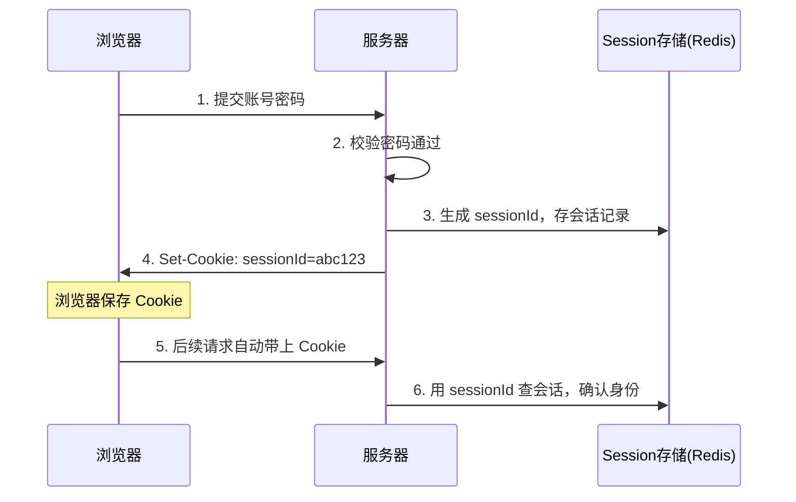
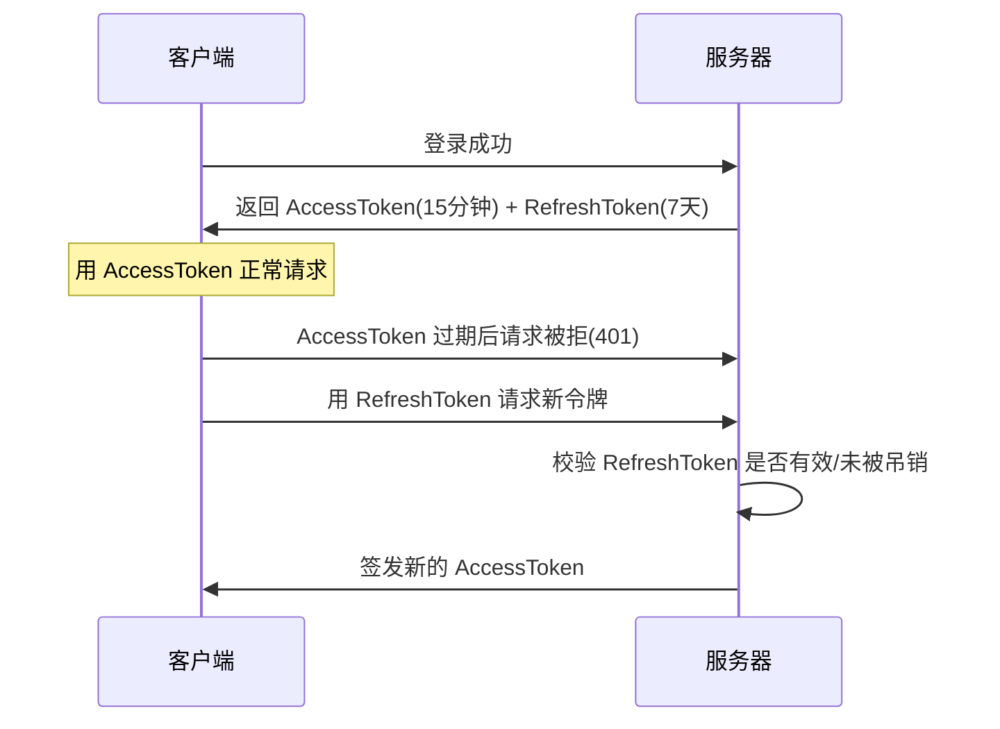
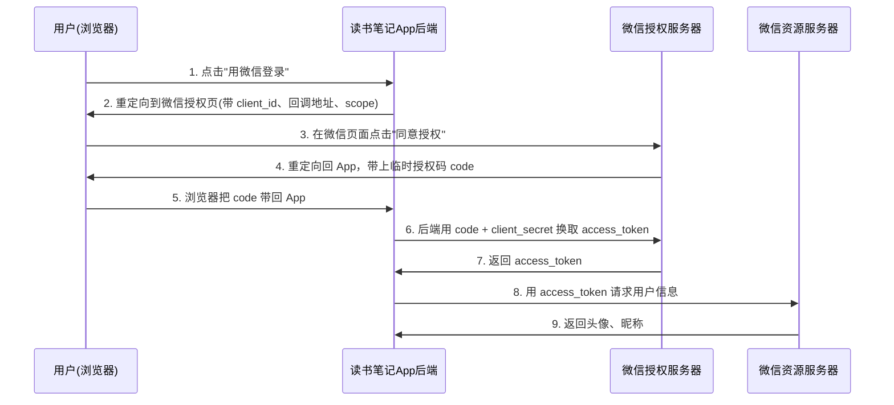
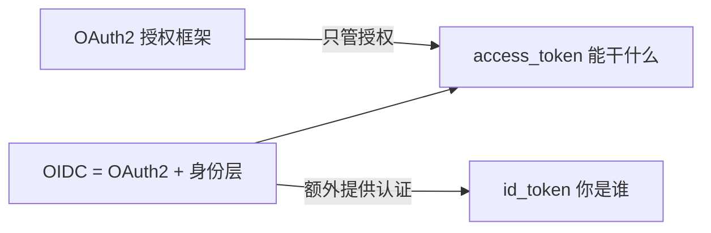
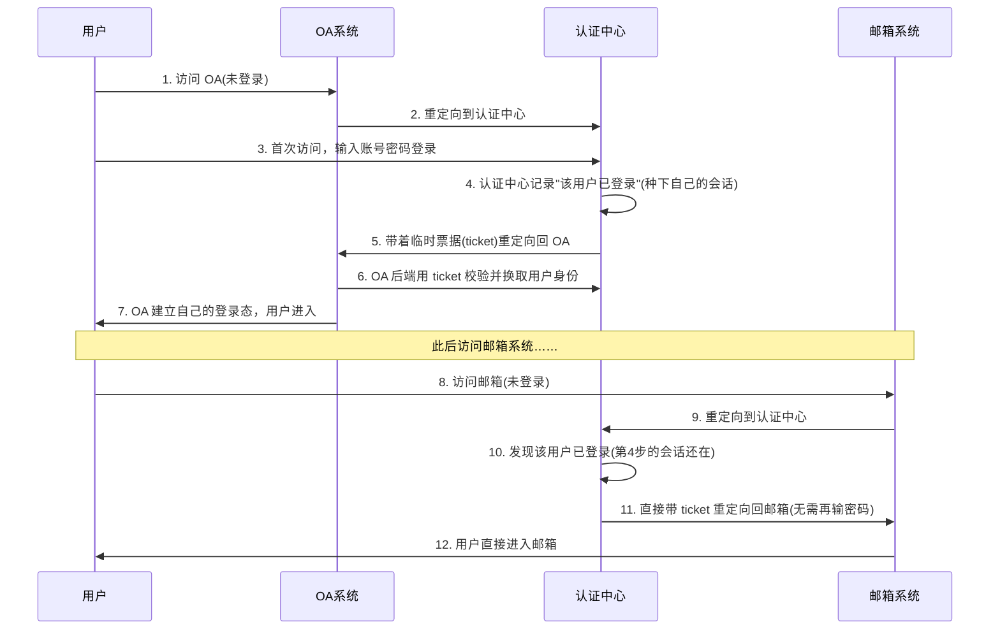
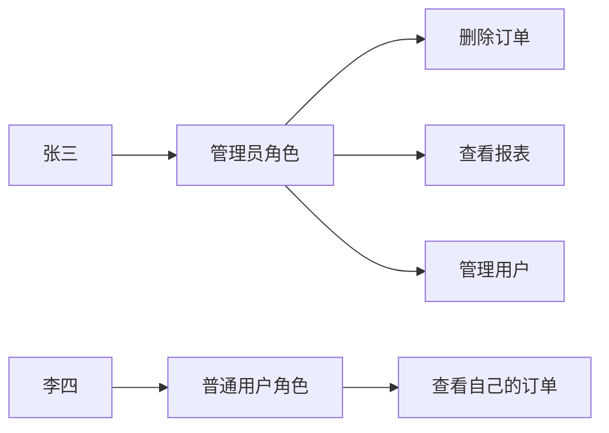
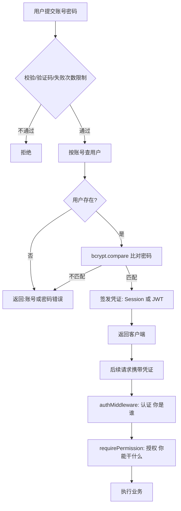

# 后端登录模块完全指南：从密码存储到 JWT、OAuth2 与单点登录

几乎每个后端系统都要做登录，但真正把它做对、做安全的人不多。原因在于：登录看起来只是"校验账号密码"，实际上它是一整条环环相扣的链路：

> 用户如何**注册** → 密码如何**安全存储** → 如何**验证身份**（认证）→ 验证后如何**记住用户**（会话保持）→ 每次请求如何**判断权限**（授权）→ 如何**抵御攻击**。

这篇文章会沿着这条链路，把每一环都讲透。特别是 JWT、OAuth2、单点登录这几个初学者最容易混淆的概念，我会详细展开它们的原理、流程和代码，而不是一笔带过。

适合读者：会写基本增删改查、想系统搞懂登录与权限的后端开发者。

:::note
文中代码以 Node.js 风格演示，重在讲清逻辑，换成 Java/Python/Go 思路完全一致。示例聚焦核心流程，生产使用时请结合成熟框架（如 Passport、Spring Security）与安全审计。
:::

---

## 一、地基：认证 vs 授权，先分清这两个词

登录模块所有知识都挂在这两个概念上，混淆它们是初学者一切困惑的根源：

- **认证（Authentication，简称 authn）**：你**是谁**？—— 验证身份。输入账号密码、扫码、指纹，都是认证。
- **授权（Authorization，简称 authz）**：你**能干什么**？—— 验证权限。登录后能否进入管理后台、能否删除别人的订单，都是授权。

:::important
**顺序永远是：先认证，再授权。** 系统先确认"你是张三"，再判断"张三能不能做这件事"。后面讲到的 JWT、Session 主要服务于**认证**（证明你是谁），而 RBAC 主要服务于**授权**（你能干什么）。把每个技术对号入座，你就不会乱。
:::

一个常见误区：以为 OAuth2 是"登录"。其实 OAuth2 的名字里就是 **Auth**orization——它本质是**授权**框架，"用它来登录"是后来衍生出的用法（这个后面详细讲）。

---

## 二、密码存储：最容易翻车的安全红线

用户注册时要存下密码。这里有一条不可逾越的红线：

:::warning
**绝对不要明文存储密码，也不要用可逆加密存储。** 数据库一旦泄露，明文密码等于把用户账户拱手送人——更糟的是，很多用户在多个网站用同一个密码，你的泄露会连累他们的其他账户。
:::

### 2.1 为什么用哈希而不是加密

- **加密**是可逆的：有密钥就能还原出原文。密钥一旦泄露，所有密码暴露。
- **哈希**是单向的：无法从哈希值反推出原始密码。验证时，把用户输入的密码用同样的哈希算法计算，比对哈希值是否一致即可——**服务器自始至终都不知道你的真实密码**。

### 2.2 为什么必须加盐（Salt）

如果只是简单哈希，会有两个问题：
- 相同的密码会得到相同的哈希值，黑客一眼看出哪些用户用了同样的密码。
- 黑客可以用**彩虹表**（预先算好的"常见密码 → 哈希值"对照表）批量反查。

**加盐**就是给每个用户的密码拼上一段**随机字符串**再哈希。这样即使两个人密码相同，哈希值也不同，彩虹表也彻底失效。

### 2.3 用对算法：bcrypt / scrypt / Argon2

:::warning
**不要用 MD5、SHA1、SHA256 存密码！** 它们是为"快"设计的，现代显卡每秒能算几十亿次，暴力破解很快。密码要用**故意设计得很慢**的专用算法：**bcrypt、scrypt、Argon2**。慢，正是它们的安全性所在。
:::

下面用 bcrypt 演示注册和验证（bcrypt 会自动生成盐并把盐嵌进结果里，无需自己单独存盐）：

```js
// 注册时：对密码加盐哈希后存库
const bcrypt = require('bcrypt');

async function register(username, plainPassword) {
  const saltRounds = 12; // 代价因子，越大越慢越安全（也越耗 CPU）
  // bcrypt 自动生成随机盐，并把盐一起编码进 hash 字符串
  const passwordHash = await bcrypt.hash(plainPassword, saltRounds);
  // 数据库里只存 passwordHash，绝不存明文
  await db.users.insert({ username, passwordHash });
}

// 登录时：比对，而不是"解密"
async function verifyPassword(plainPassword, passwordHash) {
  // bcrypt.compare 会从 hash 中取出盐，重新计算并比对
  return await bcrypt.compare(plainPassword, passwordHash);
}
```

下面用一段可运行代码演示"加盐后相同密码得到不同哈希"这个关键特性（用简化的哈希模拟，不依赖 bcrypt）：

```js
// 可运行
// 简化演示：加盐哈希的核心思想（真实项目请用 bcrypt/argon2）
const crypto = {
  // 用一个简单的字符串哈希模拟单向哈希
  hash: (s) => {
    let h = 0;
    for (let i = 0; i < s.length; i++) {
      h = (h * 31 + s.charCodeAt(i)) >>> 0;
    }
    return h.toString(16);
  },
};

function randomSalt() {
  return Math.random().toString(36).slice(2, 10);
}

function makePasswordRecord(password) {
  const salt = randomSalt();
  const hash = crypto.hash(password + salt); // 密码 + 盐 一起哈希
  return { salt, hash };
}

// 两个用户用了同样的密码 "123456"
const alice = makePasswordRecord('123456');
const bob = makePasswordRecord('123456');

console.log('Alice:', alice);
console.log('Bob:  ', bob);
console.log('两人密码相同，但哈希不同：', alice.hash !== bob.hash);

// 验证：用存下来的盐重新算，比对哈希
function verify(input, record) {
  return crypto.hash(input + record.salt) === record.hash;
}
console.log('Alice 输入正确密码：', verify('123456', alice));
console.log('Alice 输入错误密码：', verify('wrong', alice));
```

---

## 三、会话保持：登录后如何"记住"用户

密码验证通过后，问题来了：HTTP 是**无状态**的，服务器默认不记得你上次是谁。用户不可能每点一个页面就重新输一次密码。所以需要一个机制，让后续请求能证明"我就是刚才登录成功的那个人"。

有两大流派：**Session（服务端有状态）** 和 **Token/JWT（服务端无状态）**。

### 3.1 方案 A：Session + Cookie

思路是"服务器记账"：



1. 登录成功后，服务器在自己这边（内存或 Redis）存一条会话记录，生成一个随机的 `sessionId`。
2. 通过 `Set-Cookie` 把 `sessionId` 发给浏览器。
3. 之后浏览器每次请求自动带上这个 Cookie，服务器用 `sessionId` 查记录还原身份。

**优点**：服务器掌控一切，随时能让某个会话失效（踢人下线非常容易，删掉那条记录即可）。
**缺点**：服务器要存状态。当你有多台服务器时，会话记录必须放到共享存储（所以常用 Redis），否则请求打到没有该 session 的机器上就掉登录了。

### 3.2 方案 B：Token / JWT

思路是"发一张防伪凭证，服务器不记账"：

1. 登录成功后，服务器签发一张 **Token**，里面写着"你是谁、什么时候过期"，并用只有服务器知道的密钥**签名**。
2. Token 交给客户端自己保存，之后放在请求头里发回来：`Authorization: Bearer <token>`。
3. 服务器收到后**只验证签名**就能确认身份，**不需要查数据库或 Redis**。

**优点**：服务器不存状态，天然适合多服务、分布式、App 场景。
**缺点**：Token 一旦签发，在过期前**很难主动作废**（因为服务器没记录它），这带来了"登出、踢人"的难题。

JWT 就是目前最流行的 Token 格式，下一章专门详解。

### 3.3 两种方案怎么选

| 维度 | Session + Cookie | Token / JWT |
|------|-----------------|-------------|
| 状态存储 | 服务端存 | 服务端不存 |
| 踢人/登出 | 容易（删记录） | 难（需黑名单或短过期） |
| 跨域/App/微服务 | 较麻烦 | 天然友好 |
| 典型场景 | 传统服务端渲染网站 | 前后端分离、移动端、微服务 |

---

## 四、JWT 详解

JWT（JSON Web Token）是一种**自包含**的令牌格式。"自包含"意味着令牌本身就携带了用户信息，服务器验证时不用去查存储。

### 4.1 JWT 的结构：三段式

一个 JWT 是三段用点号（`.`）分隔的字符串：`Header.Payload.Signature`

```
eyJhbGciOiJIUzI1NiIsInR5cCI6IkpXVCJ9   ← Header（头部）
.eyJ1c2VySWQiOjEwMDEsImV4cCI6MTc1MTMyODAwMH0  ← Payload（载荷）
.SflKxwRJSMeKKF2QT4fwpMeJf36POk6yJV_adQssw5c  ← Signature（签名）
```

- **Header（头部）**：声明令牌类型和签名算法，如 `{"alg":"HS256","typ":"JWT"}`。
- **Payload（载荷）**：真正携带的数据，叫 **Claims（声明）**。比如用户 ID、过期时间。有一些标准字段：
  - `sub`（subject，主体，通常是用户 ID）
  - `exp`（expiration，过期时间戳）
  - `iat`（issued at，签发时间）
  - `iss`（issuer，签发者）
- **Signature（签名）**：用 Header 里指定的算法，对"Header + Payload"和**服务器密钥**一起计算出来的签名。

签名的计算方式（以 HS256 为例）：

```
signature = HMACSHA256(
  base64UrlEncode(header) + "." + base64UrlEncode(payload),
  secret   // 服务器密钥
)
```

:::warning
**JWT 的前两段只是 Base64 编码，不是加密！** 任何人拿到 JWT 都能把 Header 和 Payload 解码出来看到明文内容。你可以现在就把上面那段 Payload 复制到任意 Base64 解码工具里试试。

所以有两条铁律：
1. **不要在 Payload 里放密码、身份证号等敏感信息。**
2. JWT 的安全性**不来自"看不见"，而来自"改不了"**——别人能看内容，但只要没有服务器密钥，就无法伪造出合法的签名。
:::

### 4.2 JWT 是怎么防篡改的

假设黑客拿到你的 JWT，把 Payload 里的 `userId` 从 1001 改成 1（想冒充管理员）。他改完 Payload 后，签名就对不上了——因为签名是根据原始 Payload + 密钥算出来的。他没有密钥，算不出新 Payload 对应的正确签名。服务器一验签，发现不匹配，直接拒绝。这就是 JWT 防篡改的原理。

### 4.3 签发与验证的代码

```js
const jwt = require('jsonwebtoken');
const SECRET = process.env.JWT_SECRET; // 密钥必须保密，放环境变量，绝不硬编码

// 登录成功后：签发 JWT
function issueToken(user) {
  const payload = {
    sub: user.id,      // 用户标识
    role: user.role,   // 可以放角色，方便做授权
  };
  // expiresIn 会自动写入 exp 字段
  return jwt.sign(payload, SECRET, { expiresIn: '15m' });
}

// 每次请求：验证 JWT（通常写成中间件）
function authMiddleware(req, res, next) {
  const header = req.headers['authorization'] || '';
  const token = header.startsWith('Bearer ') ? header.slice(7) : null;
  if (!token) return res.status(401).json({ error: '未提供令牌' });

  try {
    // verify 会同时校验签名和过期时间，任何一项不过就抛错
    const decoded = jwt.verify(token, SECRET);
    req.user = decoded; // 把解析出的用户信息挂到请求上，供后续使用
    next();
  } catch (err) {
    return res.status(401).json({ error: '令牌无效或已过期' });
  }
}
```

### 4.4 JWT 的软肋：难以主动失效，用双 Token 解决

前面说过，JWT 一旦签发，服务器没存记录，过期前很难作废。可如果用户点了"登出"，或者管理员要"强制某用户下线"，怎么办？

这引出了 JWT 方案的标准实践——**双 Token（Access Token + Refresh Token）**：

- **Access Token**：有效期**短**（如 15 分钟），用于日常每次请求。因为命短，即使泄露，风险窗口也很小。
- **Refresh Token**：有效期**长**（如 7 天），**只用来换取新的 Access Token**，不参与日常请求。它通常会存在服务端（数据库/Redis），所以**可以被吊销**。



这样既保证了安全（访问令牌短命），又保证了体验（用户 7 天内不用重新登录）。**登出/踢人**时，只要把服务端存的 Refresh Token 作废，用户的 Access Token 最多再活 15 分钟就彻底失效。

如果要求"立即失效 Access Token"，还可以维护一个 Token 黑名单（存 Redis），但这其实又回到了"服务端有状态"，是 JWT 无状态优势和安全需求之间的取舍。

---

## 五、OAuth2 详解

到这里，"自家账号密码登录"已经讲完了。接下来是初学者最容易混的部分：第三方登录。先讲 OAuth2。

### 5.1 OAuth2 解决什么问题

设想一个场景：有个第三方应用"读书笔记 App"，想读取你的微信头像和昵称来创建账户。你**绝不可能**把微信密码告诉这个 App。

OAuth2 就是为解决这个问题而生的：

> **OAuth2 是一套授权框架，让第三方应用在"不接触用户密码"的前提下，获得对用户资源的、有限的、可被撤销的访问权限。**

注意关键词是**授权（拿到访问权限）**，而不是认证。这一点后面讲 OIDC 时会再强调。

### 5.2 四个角色

理解 OAuth2 先记住四个角色，用"读书笔记 App 想读你的微信信息"来对应：

| 角色 | 官方名称 | 在例子里是谁 |
|------|---------|-------------|
| 资源拥有者 | Resource Owner | 你（微信用户本人） |
| 客户端 | Client | 读书笔记 App |
| 授权服务器 | Authorization Server | 微信的授权系统（负责发令牌） |
| 资源服务器 | Resource Server | 微信存头像昵称的服务器 |

### 5.3 授权码模式（最重要，必须掌握）

OAuth2 定义了多种"授权模式"，其中**授权码模式（Authorization Code）** 是最常用、最安全的，适用于有后端的 Web 应用。完整流程如下：



**为什么要先给一个 code，再用 code 换 token，而不直接给 token？** 这是初学者最容易忽略的安全设计：

- 第 4 步的 `code` 是通过**浏览器重定向**（前端）传递的，可能被人看到，但 code 是**一次性、短命的**，且单独没用。
- 第 6 步用 code 换 token 是在 **App 后端到微信服务器**之间直接完成的（后端通道），而且必须带上只有 App 后端知道的 `client_secret`。access_token 从头到尾**没有暴露在浏览器**。

这样即使 code 泄露，攻击者没有 `client_secret` 也换不到 token。

用代码看第 6 步和第 8 步（App 后端的处理）：

```js
// 第 5 步：微信回调到这个接口，query 里带着 code
app.get('/oauth/wechat/callback', async (req, res) => {
  const { code } = req.query;

  // 第 6 步：后端用 code 换 access_token（带上 client_secret）
  const tokenResp = await fetch('https://api.weixin.qq.com/sns/oauth2/access_token', {
    method: 'POST',
    body: new URLSearchParams({
      appid: process.env.WX_CLIENT_ID,
      secret: process.env.WX_CLIENT_SECRET, // 只有后端知道，绝不发给前端
      code,
      grant_type: 'authorization_code',
    }),
  });
  const { access_token, openid } = await tokenResp.json();

  // 第 8 步：用 access_token 获取用户信息
  const userResp = await fetch(
    `https://api.weixin.qq.com/sns/userinfo?access_token=${access_token}&openid=${openid}`
  );
  const wxUser = await userResp.json();

  // 之后：在自己系统里查/建这个用户，然后签发"自己系统的"登录凭证(如 JWT)
  const localUser = await findOrCreateUser(wxUser);
  const myToken = issueToken(localUser);
  res.json({ token: myToken });
});
```

:::important
注意最后一步：拿到微信用户信息后，App 通常会在**自己的系统里**创建/关联一个用户，然后签发**自己系统的**登录凭证（比如自家的 JWT）。微信的 access_token 只用于那一次获取信息，之后用户在 App 里的登录态是 App 自己维护的。
:::

### 5.4 其他授权模式（了解）

除授权码模式外，OAuth2 还有几种模式，简单了解即可：

- **客户端凭证模式（Client Credentials）**：没有用户参与，用于服务器与服务器之间的授权（比如后台服务调用另一个 API）。
- **设备码模式（Device Code）**：用于智能电视、命令行等输入不便的设备（显示一个码，让你用手机去授权）。
- **隐式模式（Implicit）** 和 **密码模式（Password）**：早期模式，因安全问题**已不推荐使用**。

:::note
现在纯前端应用（无后端）通常用"授权码模式 + PKCE"扩展来替代已废弃的隐式模式，PKCE 通过动态生成的校验值防止 code 被截获利用。
:::

---

## 六、OIDC：OAuth2 之上的"认证"补丁

学完 OAuth2，你可能有个疑问：既然 OAuth2 能"用微信登录"，那它不就是登录（认证）吗？

**严格来说不是。** 回顾 5.1，OAuth2 只解决**授权**——它让 App 拿到"访问你资源的权限"，但 OAuth2 协议本身**没有规定**如何标准地告诉 App "这个用户到底是谁"。App 是通过"能拿到你的微信信息"这件事，间接推断"你就是这个微信用户"，这其实是一种不严谨的用法。

**OIDC（OpenID Connect）** 就是为补上这块而生：

> **OIDC 是构建在 OAuth2 之上的一层"身份认证"规范。** 它在 OAuth2 的流程里，额外规定返回一个专门用于**证明用户身份**的令牌——**ID Token**。

关键区别：

- OAuth2 返回 **access_token**：代表"访问资源的权限"（授权）。
- OIDC 额外返回 **id_token**：一个**标准的 JWT**，专门用来描述"用户是谁"（认证），里面有 `sub`（用户唯一标识）、`name`、`email` 等标准声明。



所以真正规范的"用 Google / 微信登录"，用的其实是 **OIDC**。你日常说的"OAuth 登录"，底层大多是 OIDC。记住这个关系：

> **OIDC = OAuth2（授权）+ ID Token（认证）**

---

## 七、单点登录（SSO）详解

前面讲的都是"单个系统"的登录。当一家公司有多个系统时，就有了新需求。

### 7.1 SSO 解决什么问题

设想公司有 OA、邮箱、报销三个系统。如果每个都要单独登录一次，体验很差。**单点登录（Single Sign-On, SSO）** 的目标是：

> **用户只登录一次，就能访问所有相互信任的系统；登出一次，所有系统也一起登出。**

:::important
先厘清关系，避免又一个混淆：**SSO 是一个"目标/场景"，不是一个具体协议。** 实现 SSO 可以用 CAS 协议，也可以用 OAuth2/OIDC，还可以用 SAML。它和 JWT、OAuth2 不是同一层的东西——SSO 是"要达成什么"，后者是"用什么手段达成"。
:::

### 7.2 SSO 的核心原理

SSO 的关键是设立一个独立的**认证中心（SSO Server / 身份提供方 IdP）**。所有业务系统都不自己管登录，而是把登录这件事**委托**给认证中心。

核心机制：**各业务系统在认证中心的域下共享登录状态。** 大致流程：



理解的关键在第 10 步：用户第一次在认证中心登录后，认证中心**自己记住了这个用户已登录**（通常是在认证中心的域名下种一个 Cookie）。当用户访问第二个系统被重定向到认证中心时，认证中心发现"这人我认识、已经登录过了"，于是**不再要求输密码**，直接放行。这就是"一次登录，处处通行"的本质。

### 7.3 SSO 的常见实现方式

- **CAS（Central Authentication Service）**：经典的企业 SSO 协议，就是上面那套"票据（ticket）"机制。
- **OIDC**：用前面讲的 OIDC，让认证中心作为身份提供方（IdP），各系统作为客户端。现代系统的主流选择。
- **SAML**：基于 XML 的老牌企业级 SSO 协议，在传统大企业里仍广泛使用。

### 7.4 别混淆：SSO ≠ 第三方登录

- **第三方登录**（用微信登录 B 站）：是**跨公司**的，你用 A 公司的账号登录 B 公司的产品。
- **SSO**（登了 OA 自动登录邮箱）：通常是**同一公司/同一组织**内部的多个系统共享登录。

两者技术上可能都用 OIDC，但场景和信任关系不同。

---

## 八、授权：登录之后的权限控制（RBAC）

认证解决了"你是谁"，接下来每次访问接口要判断"你能不能做这件事"（授权）。最主流的模型是 **RBAC（Role-Based Access Control，基于角色的访问控制）**。

### 8.1 核心模型

RBAC 不把权限直接绑给用户，而是引入"角色"作为中间层：



- **用户** 关联一到多个**角色**。
- **角色** 拥有一组**权限**。
- 用户的权限 = 他所有角色的权限之和。

好处很明显：新来一个管理员，只要给他分配"管理员"角色，不用逐条配权限；要调整管理员能做什么，改一次角色配置，所有管理员一起生效。

### 8.2 用中间件做权限校验

在 JWT 的 Payload 里带上角色后，授权就可以做成一个中间件：

```js
// 授权中间件：要求用户具备某个权限
function requirePermission(permission) {
  return (req, res, next) => {
    // req.user 是前面 authMiddleware 从 JWT 解析出来的
    const role = req.user.role;
    const permissions = getPermissionsOfRole(role); // 查该角色拥有的权限
    if (!permissions.includes(permission)) {
      return res.status(403).json({ error: '没有权限' }); // 403 表示"认证了但无权限"
    }
    next();
  };
}

// 使用：删除订单需要 'order:delete' 权限
app.delete('/orders/:id', authMiddleware, requirePermission('order:delete'), (req, res) => {
  // 走到这里说明：已登录(authMiddleware) 且 有权限(requirePermission)
  deleteOrder(req.params.id);
  res.json({ ok: true });
});
```

:::note
注意状态码的区别：**401 Unauthorized** 表示"没认证/认证失败"（你没登录或令牌无效）；**403 Forbidden** 表示"认证了但没权限"（你登录了，但不许做这件事）。别用反了。
:::

比 RBAC 更细粒度的还有 ABAC（基于属性的访问控制），能根据资源属性、环境等动态判断，这里不展开，感兴趣可参考 [RBAC/ABAC 权限系统](/posts/architecture/rbac-abac-permission-system)。

---

## 九、安全防护：登录是攻击的头号入口

登录接口是黑客最爱的目标，下面这些防护缺一不可：

- **全程 HTTPS**：不用 HTTPS，账号密码在网络中就是明文传输，随便抓包就能看到。这是底线。
- **防暴力破解**：限制单账号/单 IP 的登录失败次数（如错 5 次锁定 15 分钟），超过阈值弹**验证码**或 IP 限流。
- **模糊的错误提示**：登录失败统一提示"账号或密码错误"，**不要**分开提示"账号不存在"和"密码错误"——后者会帮攻击者枚举出哪些账号真实存在。
- **CSRF（跨站请求伪造）防护**：Session+Cookie 方案要重点防，常用手段是 CSRF Token 或给 Cookie 设 `SameSite` 属性。
- **XSS（跨站脚本）防护**：防止恶意脚本窃取 Token。这也影响"JWT 存哪里"的决策——存 `localStorage` 怕 XSS，存 `HttpOnly` Cookie 怕 CSRF，需要权衡。
- **敏感操作二次验证**：改密码、改绑手机等高危操作，要求重新输入密码或短信验证码。
- **密钥与配置安全**：JWT 密钥、OAuth 的 `client_secret` 必须放环境变量或密钥管理服务，**绝不能硬编码进代码或提交到 Git**。

---

## 十、把整条链路串起来

最后用一张图把一次完整的"账号密码登录 + 后续访问"串起来，帮你建立全局视角：



各技术在这条链路里的位置：
- **bcrypt** → 密码安全存储与比对
- **Session / JWT** → 认证态的保持
- **OAuth2 / OIDC** → 第三方登录的认证与授权
- **SSO** → 多系统共享登录态
- **RBAC** → 登录后的权限判断

---

## 十一、常见问题

::: details JWT 和 Session 到底该用哪个？
没有绝对答案，看场景。传统的服务端渲染网站、需要方便踢人下线的后台系统，用 Session 更省心；前后端分离、移动 App、微服务架构，用 JWT（配双 Token）更合适。很多系统甚至混用：Web 端用 Session，App 端用 JWT。
:::

::: details 把用户信息放进 JWT 安全吗？
放"非敏感的标识信息"（用户 ID、角色）是安全且推荐的，因为签名保证了不可篡改。但**绝不能放密码、身份证号、银行卡等敏感信息**，因为 Payload 是任何人都能 Base64 解码看到的明文。
:::

::: details OAuth2 和 OIDC 有什么区别，我该用哪个？
OAuth2 管授权（拿到访问权限），OIDC 在其基础上加了认证（标准地告诉你"用户是谁"）。如果你的目的是"让用户用第三方账号登录我的系统"，应该用 **OIDC**；如果只是"我的服务要访问用户在另一个平台的资源"，用 OAuth2 即可。
:::

::: details SSO 和"用微信登录"是一回事吗？
不是。"用微信登录"是跨公司的第三方登录，用你的微信账号登录别家产品。SSO 通常是同一组织内部多个系统共享登录（登了 OA 自动登录邮箱）。两者底层可能都用 OIDC，但信任关系和场景不同。
:::

::: details 登录做完了，权限一定要用 RBAC 吗？
不一定。小系统可能就一两种角色，简单判断即可。RBAC 是当角色和权限变多、需要灵活管理时的成熟方案。别为了"用上 RBAC"而在极简系统里过度设计。
:::

---

## 小结

登录模块的复杂度，来自它是一条**环环相扣的链路**，而不是单个功能点。回顾全文主线：

1. **认证 vs 授权** 是理解一切的地基：先确认你是谁，再判断你能干什么。
2. **密码存储** 用 bcrypt/Argon2 加盐哈希，绝不明文。
3. **会话保持** 在 Session（有状态、易踢人）和 JWT（无状态、易扩展）间按场景选择。
4. **JWT** 靠签名防篡改而非加密，敏感信息不入 Payload，用双 Token 解决作废难题。
5. **OAuth2** 是授权框架，授权码模式通过"code 换 token"保护令牌不泄露。
6. **OIDC** 在 OAuth2 上补齐认证，用 ID Token 标准地表达"用户是谁"。
7. **SSO** 是"一次登录处处通行"的目标，靠独立认证中心共享登录态实现。
8. **RBAC** 通过"用户-角色-权限"三层解耦，做灵活的权限控制。
9. **安全防护** 贯穿始终：HTTPS、防暴力破解、CSRF/XSS、密钥保护。

把这条链路走通，你就掌握了后端最核心的模块之一。建议动手做一遍：从最简单的账号密码登录起步，逐步加上 JWT、RBAC，最后尝试接入一个第三方 OIDC 登录。这也正是[后端学习路线图](/posts/architecture/backend-developer-learning-roadmap)里"阶段一"最好的练手项目。
