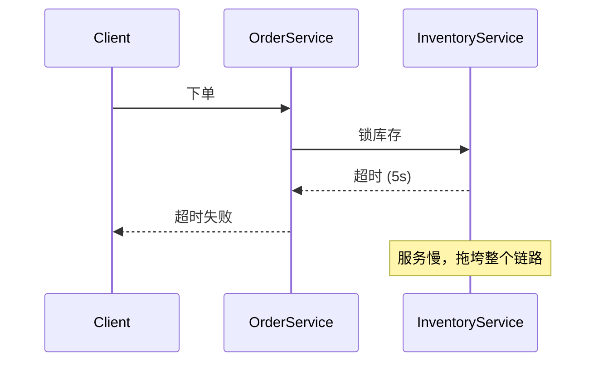
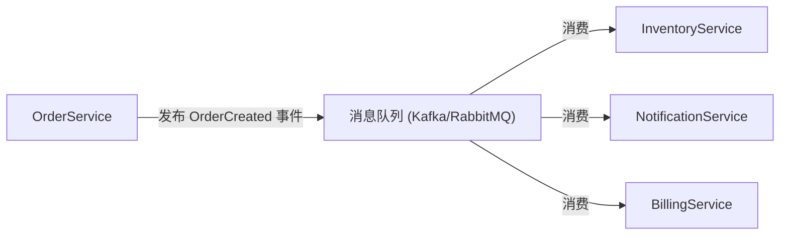
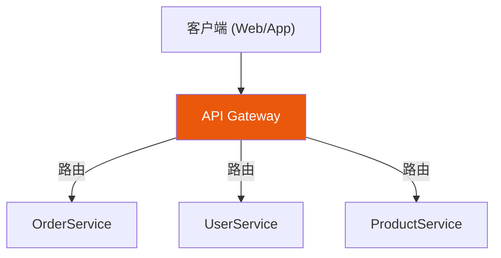
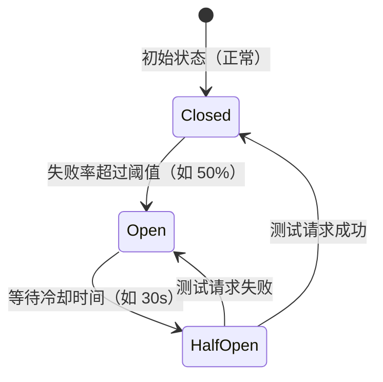
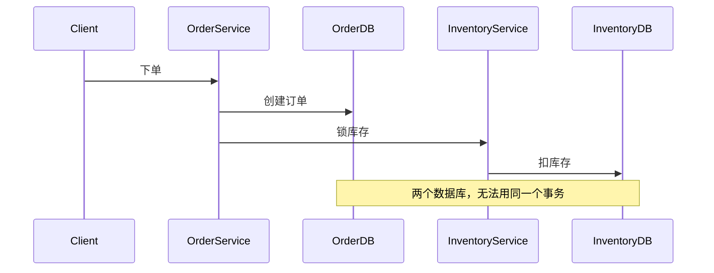
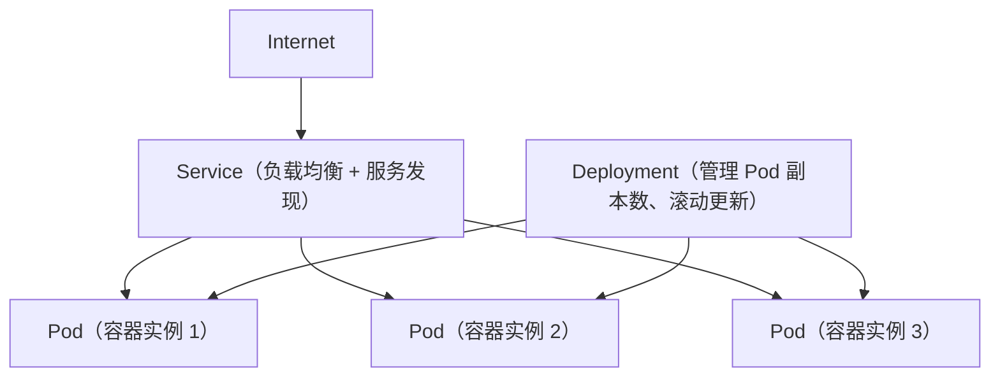

# 微服务架构设计与工程实践

很多团队"上了微服务"之后发现：

- 部署变复杂了，发一次需要改十个仓库
- 一个请求跨了七八个服务，出了问题不知道哪坏了
- 服务之间相互调用，一个挂了整条链路都慢
- 数据库还是共用的，拆了服务等于没拆

这些问题不是微服务本身的错，而是**没有做好微服务应有的设计决策**。

这篇文章系统讲清微服务架构的关键问题：从拆分原则到通信模式，从服务治理到数据隔离，从可观测性到容器化部署。

---

## 一、单体 → 微服务：什么时候值得拆

先说一个常见的错误认知：

> "微服务是现代架构，单体是落后架构。"

这是错的。

### 单体的优势

- 开发部署简单
- 本地调用，无网络开销
- 事务简单，ACID 天然支持
- 调试和排障直接

### 微服务的代价

- 需要处理网络超时、重试、熔断
- 数据一致性变复杂
- 需要配套的服务发现、链路追踪、CI/CD 流水线
- 运维复杂度指数级上升

:::note
**Netflix** 起初也是单体，直到业务和团队规模撑不住才逐步拆分微服务。如果你的团队不到 20 人、QPS 不到万级，单体往往更务实。
:::

### 值得拆分的信号

| 信号 | 说明 |
|---|---|
| 构建和部署极慢 | 改一行代码要编译整个项目 10 分钟 |
| 多团队改同一个代码库频繁冲突 | 组织边界和代码边界不对齐 |
| 局部扩容无法单独做 | 支付服务需要扩容，但带着整个应用一起扩 |
| 技术栈选型被绑死 | 想用 Go 写某个服务，但主体是 Java |
| 核心业务相互影响 | 一个非核心功能崩了，导致核心功能也挂 |

---

## 二、服务拆分原则：怎么分是对的

这是微服务最难的部分，拆错了比不拆还麻烦。

### 原则一：按业务领域拆（DDD 限界上下文）

最稳健的拆分依据是**业务边界**，而不是技术层（别按 Controller/Service/DAO 来拆）。

领域驱动设计（DDD）的**限界上下文（Bounded Context）**是拆分的核心工具：

```text
电商系统限界上下文划分示例：

用户上下文：注册、登录、个人信息
商品上下文：SKU、库存、分类
订单上下文：下单、支付状态、履约状态
支付上下文：支付渠道、账单、退款
物流上下文：快递单、轨迹、签收
```

每个限界上下文内部的领域模型是内聚的，跨上下文通过**防腐层（Anti-Corruption Layer）**或事件来通信。

:::tip
判断拆分是否合理的关键问题：**"改这个功能，只需要改一个服务吗？"** 如果答案经常是"不行，还要改另外三个"，那边界划错了。
:::

### 原则二：高内聚，低耦合

- **高内聚**：服务内的功能紧密相关，修改一个功能不影响其他
- **低耦合**：服务间依赖少，接口稳定，内部实现可以自由变化

反例：

```text
// 错误拆法：按技术层拆
数据层服务 / 业务逻辑服务 / 展示服务

// 问题：改一个业务功能要同时改三个服务
```

### 原则三：服务有明确的所有者

每个服务应该有一个清晰的负责团队。如果一个服务同时被三个团队维护，说明它的边界不清晰。

**康威定律**：系统的架构往往反映了组织的沟通结构。

### 原则四：服务粒度不要过细

微服务的"微"不是越小越好。

过细的粒度会导致：

- 大量网络跳转
- 部署和运维成本急剧上升
- 一个逻辑流程需要协调十几个服务

一个实用的判断标准：**一个服务的代码，一个人或一个小组能完全理解和负责**。

---

## 三、服务间通信：同步 vs 异步的选择

### 同步通信

请求方等待响应方返回结果，才能继续执行。

常见方式：

**REST（HTTP/JSON）**

```text
POST /orders HTTP/1.1
Host: order-service
Content-Type: application/json

{ "userId": "u123", "items": [...] }
```

- 简单、通用、人类可读
- 适合对外 API 或服务间简单查询

**gRPC（HTTP/2 + Protobuf）**

```protobuf
// order.proto
service OrderService {
  rpc CreateOrder(CreateOrderRequest) returns (CreateOrderResponse);
  rpc GetOrder(GetOrderRequest) returns (Order);
}

message CreateOrderRequest {
  string user_id = 1;
  repeated OrderItem items = 2;
}
```

- 比 REST 快 5~10 倍（二进制协议 + 多路复用）
- 接口定义严格，改接口有 schema 约束
- 适合内部高频服务间调用

同步通信的风险：



**级联故障**是同步通信最大的风险，需要配合超时 + 熔断来控制。

### 异步通信

生产者发出消息后不等待，消费者异步处理。

常见架构：



优势：

- 服务间彻底解耦
- 生产者不受消费者速度影响
- 天然削峰填谷

代价：

- 不能立即知道下游处理结果
- 幂等性、消息重复和顺序问题需要处理
- 排障难度更高

### 通信方式选型总结

| 场景 | 推荐方式 |
|---|---|
| 强实时查询（余额、库存） | 同步 RPC/REST |
| 下单后的后续处理（通知、积分、日志） | 异步 MQ |
| 跨服务的业务流程协调 | Saga（事件驱动） |
| 高频内部调用（毫秒级） | gRPC |
| 对外开放 API | REST |

---

## 四、服务发现与负载均衡

微服务是动态的：实例会扩缩容、会迁移 IP。硬编码地址是不可能的，必须有**服务发现**机制。

### 客户端发现模式

服务启动时向注册中心（Consul / Nacos / etcd）注册自己，调用方从注册中心获取地址，自己做负载均衡。

```text
流程：
1. OrderService 启动 → 注册到 Consul: order-service:192.168.1.10:8080
2. PaymentService 调用订单服务 → 查 Consul 获取地址列表
3. PaymentService 自己选一个实例（轮询/最少连接）发起调用
```

代表：Netflix Eureka（Spring Cloud）、Consul

### 服务端发现模式

调用方向统一的负载均衡器（LB）发请求，LB 内部查注册中心并转发。

```text
流程：
1. 所有服务注册到注册中心
2. 调用方只知道一个固定的 LB 地址
3. LB 负责选择健康实例转发
```

代表：AWS ALB + ECS、Kubernetes Service

### 健康检查

注册中心需要定期探测服务健康状态，将不健康实例从路由中摘除：

```yaml
# Consul 健康检查配置
checks:
  - id: "order-service-health"
    http: "http://localhost:8080/health"
    interval: "10s"
    timeout: "3s"
    deregister_critical_service_after: "30s"
```

:::warning
不要只检查"进程存活"，要检查"业务可用"。进程活着但数据库连接池耗尽，也是不健康的。
:::

---

## 五、API Gateway：统一的南北流量入口

所有来自客户端（浏览器、App）的请求，应该统一经过 API Gateway，而不是直接打到各个微服务。

### API Gateway 的职责



**认证与授权**：统一做 JWT 验证，不让未授权请求进入内网

**路由**：`/api/orders/*` → OrderService，`/api/users/*` → UserService

**协议转换**：外部 REST → 内部 gRPC

**限流**：每个接口或用户维度的 QPS 限制

**日志与追踪**：在入口注入 TraceId，所有请求都有上下文

**接口聚合（BFF）**：一次请求聚合多个服务的数据，减少客户端往返

### 常见 Gateway 方案

| 方案 | 特点 |
|---|---|
| Kong | 插件丰富，Nginx 内核，高性能 |
| APISIX | 国内活跃，插件多，支持动态配置 |
| Spring Cloud Gateway | Java 生态友好，配置灵活 |
| Nginx + Lua | 高性能，定制性强，运维成本高 |
| AWS API Gateway | 云原生，托管，按调用计费 |

:::tip
**BFF（Backend For Frontend）**模式：为不同客户端（PC Web、移动端、第三方）提供各自定制的 API 聚合层，避免通用 Gateway 为了兼顾所有客户端而变得臃肿。
:::

---

## 六、服务治理：让调用链路稳定

### 超时

每次跨服务调用**必须设置超时**，且要显式传递。

```js
// 错误：没有超时，可能永远等待
const result = await fetch('http://inventory-service/lock');

// 正确：设置合理超时
const result = await fetch('http://inventory-service/lock', {
  signal: AbortSignal.timeout(2000), // 2 秒超时
});
```

超时设置原则：

- 面向用户的接口：通常 ≤ 1s
- 后台业务接口：根据 P99 延迟设置，留 2~3 倍余量
- 超时链路：下游超时 < 上游超时（否则上游已超时返回，下游还在重试）

### 重试

重试能解决短暂的网络抖动，但**不能无限制重试**。

```js
// 可运行
async function withRetry(fn, maxRetries = 3, delay = 200) {
  for (let attempt = 1; attempt <= maxRetries; attempt++) {
    try {
      return await fn();
    } catch (err) {
      if (attempt === maxRetries) throw err;
      // 指数退避：200ms, 400ms, 800ms
      await new Promise(r => setTimeout(r, delay * Math.pow(2, attempt - 1)));
      console.log(`第 ${attempt} 次重试...`);
    }
  }
}

// 模拟调用（随机失败）
let callCount = 0;
const mockService = async () => {
  callCount++;
  if (callCount < 3) throw new Error('服务暂时不可用');
  return '成功';
};

withRetry(mockService).then(console.log).catch(console.error);
```

:::warning
**重试风暴**：如果上游大量请求同时重试，会让已经压力很大的下游更加雪崩。重试必须配合**指数退避 + 随机抖动**，以及**熔断器**来控制。
:::

**只对幂等接口重试**：GET 查询可以重试，POST 下单不能无脑重试（需先确认幂等性）。

### 熔断

当下游连续失败超过阈值，快速失败而不是继续等待：



状态说明：

- **Closed（关闭）**：正常放行请求
- **Open（打开）**：快速失败，不发真实请求
- **Half-Open（半开）**：放少量请求测试下游是否恢复

代表实现：Hystrix（已停维）、Resilience4j（Java）、go-breaker（Go）

### 降级

熔断触发后，不是直接报错，而是返回**降级兜底**数据：

```js
async function getRecommendations(userId) {
  try {
    // 尝试调用推荐服务
    return await recommendationService.get(userId, { timeout: 500 });
  } catch (err) {
    // 推荐服务不可用，返回兜底热门商品
    console.warn('推荐服务降级，返回默认推荐');
    return getDefaultHotItems();
  }
}
```

降级的本质：**保证核心功能可用，牺牲非核心体验**。

### 限流

保护服务不被超额流量压垮。常见算法：

**令牌桶**（Token Bucket）：允许短暂突发，适合接口级限流

**滑动窗口**：精确控制单位时间内的请求数

**漏桶**（Leaky Bucket）：严格平滑输出速率，适合对下游保护

```js
// 可运行
// 简单的令牌桶实现
class TokenBucket {
  constructor(capacity, refillRate) {
    this.capacity = capacity;    // 桶容量
    this.tokens = capacity;      // 当前令牌数
    this.refillRate = refillRate; // 每秒补充令牌数
    this.lastRefill = Date.now();
  }

  tryAcquire() {
    const now = Date.now();
    const elapsed = (now - this.lastRefill) / 1000;
    this.tokens = Math.min(this.capacity, this.tokens + elapsed * this.refillRate);
    this.lastRefill = now;

    if (this.tokens >= 1) {
      this.tokens--;
      return true; // 允许通过
    }
    return false; // 限流拒绝
  }
}

const bucket = new TokenBucket(5, 2); // 容量 5，每秒补充 2 个
let passed = 0, rejected = 0;

for (let i = 0; i < 10; i++) {
  if (bucket.tryAcquire()) {
    passed++;
    console.log(`请求 ${i+1}: 通过`);
  } else {
    rejected++;
    console.log(`请求 ${i+1}: 限流`);
  }
}

console.log(`通过: ${passed}, 拒绝: ${rejected}`);
```

---

## 七、数据隔离：Database Per Service

微服务最核心的数据原则：**每个服务有独立的数据库，不能共享数据库**。

### 为什么不能共库

```text
// 错误模式：共享数据库
OrderService ─┐
UserService  ─┼→ 同一个 MySQL 实例 (shop_db)
PaymentService─┘

问题：
1. 任一服务的重查询可以拖垮所有服务
2. 一个服务的 schema 变更影响所有服务
3. 无法按服务独立扩容数据层
4. 无法为不同服务选择不同的数据库类型
```

### 独立数据库的挑战

**跨服务关联查询**

```text
需求：查询用户及其最近 10 笔订单

// 单体时：一条 JOIN SQL
SELECT u.*, o.* FROM users u JOIN orders o ON u.id = o.user_id LIMIT 10;

// 微服务后：不能跨库 JOIN
方案 A：API Composition —— 先查 UserService，再查 OrderService，应用层组合
方案 B：CQRS 读模型 —— 维护一个专门的"查询数据库"（如 Elasticsearch）同步双写
```

**跨服务事务**



解决方案：**Saga 模式**

```text
Saga = 一组本地事务 + 补偿事务

成功路径：
  1. OrderService.createOrder() ✓
  2. InventoryService.lockStock() ✓
  3. PaymentService.charge() ✓

补偿路径（第 3 步失败）：
  3. PaymentService.charge() ✗
  ← 2. InventoryService.releaseStock()（补偿事务）
  ← 1. OrderService.cancelOrder()（补偿事务）
```

### 数据库类型按服务选型

独立数据库的另一个好处是**技术异构**：

| 服务 | 适合的数据库 | 原因 |
|---|---|---|
| 用户服务 | MySQL / PostgreSQL | 关系型，事务支持 |
| 商品搜索 | Elasticsearch | 全文检索、聚合分析 |
| 购物车 | Redis | 高频读写，TTL 过期 |
| 社交 Feed | MongoDB | 文档型，灵活 schema |
| 日志分析 | ClickHouse | 列式存储，批量写入 |

---

## 八、可观测性：分布式排障的核心

单体里加一行 `console.log` 就能调试，微服务里一个请求可能跨 8 个服务，必须系统性地建设可观测性。

### 三要素

**1. 日志（Logs）**

所有日志必须结构化，并携带 TraceId：

```json
{
  "timestamp": "2026-04-30T10:23:45.123Z",
  "level": "ERROR",
  "service": "order-service",
  "traceId": "abc-123-def",
  "spanId": "span-456",
  "userId": "u789",
  "message": "库存扣减失败",
  "error": "timeout after 2000ms",
  "orderId": "o-20260430-001"
}
```

**2. 指标（Metrics）**

关键指标（RED 方法）：

- **Rate**：QPS（每秒请求数）
- **Errors**：错误率
- **Duration**：延迟（P50 / P95 / P99）

```text
// Prometheus 指标示例
http_requests_total{service="order",method="POST",status="200"} 1234
http_request_duration_seconds{service="order",quantile="0.99"} 0.45
```

**3. 链路追踪（Distributed Tracing）**

```mermaid
gantt
  title 请求 abc-123 的调用链（总耗时 450ms）
  dateFormat X
  axisFormat %Lms

  section API Gateway
  鉴权+路由    :0, 20

  section OrderService
  创建订单逻辑  :20, 80

  section InventoryService
  锁库存        :80, 180

  section PaymentService
  发起支付      :180, 420

  section NotificationService
  发送通知（异步）:350, 450
```



每个 Span 记录：服务名、操作名、开始/结束时间、父 Span ID、Tags（HTTP 状态码、SQL 语句等）。

常用方案：Jaeger、Zipkin、OpenTelemetry（标准化推荐）

### OpenTelemetry 快速接入（Node.js）

```js
// instrumentation.js - 在应用最开头引入
const { NodeSDK } = require('@opentelemetry/sdk-node');
const { OTLPTraceExporter } = require('@opentelemetry/exporter-trace-otlp-http');
const { getNodeAutoInstrumentations } = require('@opentelemetry/auto-instrumentations-node');

const sdk = new NodeSDK({
  traceExporter: new OTLPTraceExporter({
    url: 'http://jaeger:4318/v1/traces',
  }),
  // 自动给 HTTP、gRPC、MySQL、Redis 等注入追踪
  instrumentations: [getNodeAutoInstrumentations()],
});

sdk.start();
```

接入后，所有 HTTP 请求自动传播 TraceId，无需手动埋点。

:::tip
**黄金指标**：每个微服务至少要有 QPS、错误率、P99 延迟的告警。当 P99 > 阈值或错误率 > 1% 时立即告警，不要等用户投诉。
:::

---

## 九、容器化与部署：Docker + Kubernetes

### 为什么微服务需要容器

微服务数量多，每个服务的运行环境、依赖、端口都不同。容器解决了**环境一致性**和**快速启停**问题。

**Dockerfile 最佳实践**：

```dockerfile
# 多阶段构建，减小镜像体积
FROM node:20-alpine AS builder
WORKDIR /app
COPY package*.json ./
RUN npm ci --only=production

FROM node:20-alpine AS runtime
WORKDIR /app

# 非 root 用户运行
RUN addgroup -g 1001 nodejs && adduser -S nodejs -u 1001
USER nodejs

COPY --from=builder --chown=nodejs:nodejs /app/node_modules ./node_modules
COPY --chown=nodejs:nodejs . .

EXPOSE 3000

# 健康检查
HEALTHCHECK --interval=30s --timeout=3s --start-period=10s \
  CMD wget -qO- http://localhost:3000/health || exit 1

CMD ["node", "server.js"]
```

### Kubernetes 核心概念（微服务视角）



**Deployment 示例**：

```yaml
apiVersion: apps/v1
kind: Deployment
metadata:
  name: order-service
spec:
  replicas: 3
  selector:
    matchLabels:
      app: order-service
  strategy:
    type: RollingUpdate
    rollingUpdate:
      maxUnavailable: 1    # 最多 1 个 Pod 不可用
      maxSurge: 1          # 最多多 1 个 Pod
  template:
    spec:
      containers:
        - name: order-service
          image: my-registry/order-service:v1.2.3
          resources:
            requests:
              memory: "256Mi"
              cpu: "250m"
            limits:
              memory: "512Mi"
              cpu: "500m"
          livenessProbe:
            httpGet:
              path: /health/live
              port: 3000
            initialDelaySeconds: 10
            periodSeconds: 15
          readinessProbe:
            httpGet:
              path: /health/ready
              port: 3000
            initialDelaySeconds: 5
            periodSeconds: 10
```

**liveness vs readiness probe 的区别**：

- `livenessProbe`：探测进程是否活着，失败则重启容器
- `readinessProbe`：探测服务是否准备好接流量，失败则从 Service 路由中摘除

### Service Mesh：下一层治理

当服务数量超过 20+，服务间治理的代码重复问题（每个服务都要写熔断、重试、mTLS）可以用 **Service Mesh** 解决。

```text
传统方式（代码内嵌治理逻辑）：
  OrderService 代码 = 业务逻辑 + 重试 + 熔断 + 限流 + mTLS

Service Mesh（Sidecar 模式）：
  OrderService 代码 = 只有业务逻辑
  Envoy Sidecar（同 Pod 内） = 重试 + 熔断 + 限流 + mTLS + 链路追踪
```

代表方案：Istio、Linkerd、AWS App Mesh

:::note
Service Mesh 学习成本和运维成本不低。如果团队规模不大，用 SDK 库（Resilience4j、go-zero 等）内嵌治理逻辑也完全合理，不必过早引入 Mesh。
:::

---

## 十、常见架构陷阱

### 陷阱 1：分布式单体（Distributed Monolith）

服务是拆了，但部署时必须一起发，数据库还是共用的，服务间有大量同步调用链。

```text
症状：
- 改一个功能要同时修改 4 个服务
- 部署顺序有严格要求，顺序错了就故障
- 一个服务挂了，所有服务都受影响
```

这是最糟糕的结果：拿到了微服务的复杂度，没拿到任何收益。

**解法**：重新审视服务边界，合并过度拆分的服务，消除共享数据库。

### 陷阱 2：过早拆分

在业务还没稳定时就拆微服务，导致大量服务因业务变化而频繁重构。

**解法**：先做单体，把业务跑通并稳定后，再按自然浮现的边界拆分。

### 陷阱 3：没有 API 版本控制

服务接口变更时不做版本管理，导致部署时各服务版本不兼容。

```text
// 推荐：URL 版本号
GET /api/v2/orders/{id}

// 或者：Header 版本号
GET /api/orders/{id}
API-Version: 2
```

**解法**：接口变更优先用兼容式扩展（加字段），破坏性变更必须升版本，老版本有过渡期。

### 陷阱 4：测试策略缺失

微服务的集成测试写起来很麻烦，很多团队放弃了。但没有测试的微服务变更时风险极高。

**推荐策略**：

```text
测试金字塔（微服务版本）：

    E2E 测试（少量）
       ↑
  契约测试（Consumer-Driven Contracts）← 每个服务间接口
       ↑
  服务集成测试（模拟下游）
       ↑
  单元测试（大量）
```

**契约测试**（Pact 等工具）：消费方定义期望的接口格式，提供方验证自己满足这些契约，无需真实跑通整个系统。

### 陷阱 5：忽视幂等性

网络重试是常态，每个会修改数据的接口**必须保证幂等**。

```js
// 使用幂等键（Idempotency Key）
async function createOrder(req) {
  const idempotencyKey = req.headers['x-idempotency-key'];

  // 检查是否已处理过这个请求
  const existing = await db.orders.findOne({ idempotencyKey });
  if (existing) {
    return existing; // 直接返回上次的结果
  }

  // 创建新订单，保存幂等键
  const order = await db.orders.create({
    ...req.body,
    idempotencyKey,
  });

  return order;
}
```

---

## 十一、微服务设计检查清单

在上线前，对照这个清单确认你的微服务架构是否就绪：

**拆分与边界**

- [ ] 每个服务有独立的业务边界（限界上下文）
- [ ] 服务有明确的负责团队
- [ ] 改一个业务功能通常只需要改一个服务

**通信**

- [ ] 所有同步调用都有超时设置
- [ ] 非幂等接口已禁止自动重试
- [ ] 核心调用链路有熔断保护

**数据**

- [ ] 每个服务有独立的数据库，无共库
- [ ] 跨服务流程使用 Saga 而不是分布式事务
- [ ] 所有写操作接口都有幂等保证

**可观测性**

- [ ] 所有日志结构化，且携带 TraceId
- [ ] 有 QPS、错误率、P99 延迟的 Metrics
- [ ] 接入了链路追踪（OpenTelemetry / Jaeger）
- [ ] 关键指标有告警规则

**部署**

- [ ] 服务容器化，有 Dockerfile
- [ ] readinessProbe 和 livenessProbe 已配置
- [ ] 支持滚动更新和快速回滚
- [ ] 有 CI/CD 流水线，不依赖手动部署

---

## 总结

微服务架构的价值不在于"把服务拆小"，而在于：

- **独立部署**：每个服务可以独立发布，互不影响
- **独立扩容**：按服务粒度弹性扩缩容
- **技术异构**：允许不同服务用不同的技术栈
- **故障隔离**：一个服务的故障不会无限扩散

但这些收益都有前提：

1. 服务边界划分正确（DDD + 高内聚低耦合）
2. 数据做到真正隔离（Database Per Service）
3. 服务治理配套完整（超时、重试、熔断、限流）
4. 可观测性建设充分（日志、指标、追踪）

否则你得到的不是微服务，是分布式单体——拿最高的复杂度，享受最差的体验。

:::tip
**经验法则**：先把一个模块做成独立可部署的"模块化单体"，再逐步提取为真正的微服务。不要一次性全部拆完，要渐进式演进。
:::
