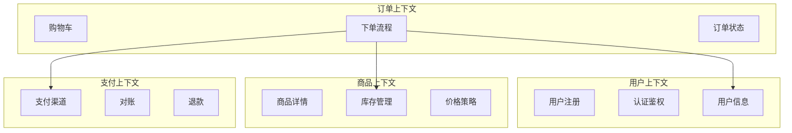
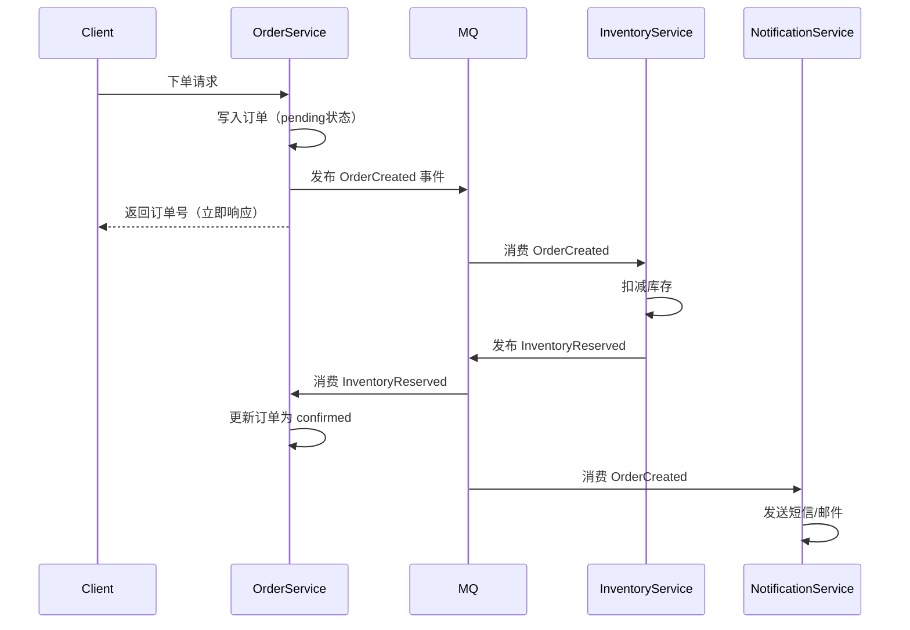
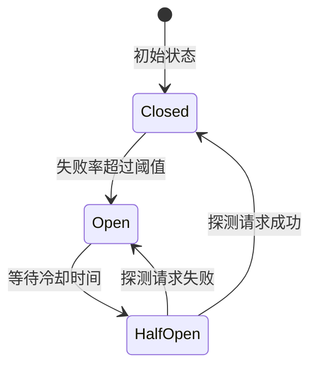
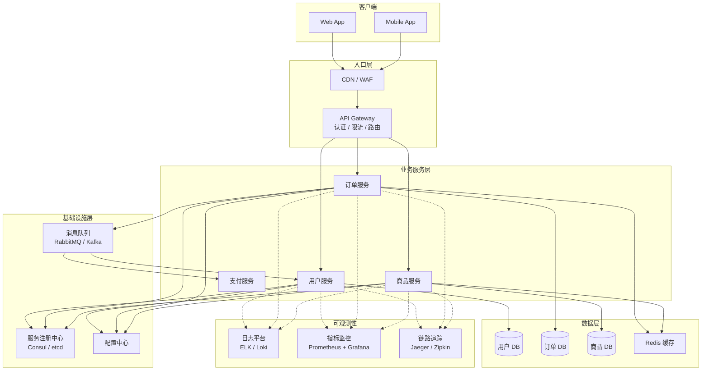

# 微服务架构设计与工程实践：从拆分到落地

微服务这个词被滥用太久了。

很多团队以为把一个单体应用拆成几个独立进程，就算"上了微服务"。结果上线之后，服务一多，问题接踵而来：

- 服务之间互相依赖，一个挂了拖垮一片
- 配置散落各处，每次发布改十几个地方
- 调用链路深，排查问题要翻十几个日志
- 本地开发越来越难，启动 8 个服务才能跑一个功能

这些都不是微服务本身的问题，而是**没有配套工程体系**的问题。

这篇文章从拆分方法论出发，系统讲清楚微服务架构的每一个关键环节，以及每个环节的工程落地方式。

---

## 一、微服务 vs 单体：先搞清楚各自的边界

在决定要不要拆分之前，先理解两种架构各自适合什么阶段。

### 单体架构的优势

```
┌─────────────────────────────┐
│          单体应用            │
│  ┌───────┐ ┌───────────┐   │
│  │用户模块│ │  订单模块  │   │
│  └───────┘ └───────────┘   │
│  ┌───────┐ ┌───────────┐   │
│  │商品模块│ │  支付模块  │   │
│  └───────┘ └───────────┘   │
└─────────────────────────────┘
           │
           ▼
       单个数据库
```

单体不是落后，它有真实优势：

- **开发效率高**：模块间直接函数调用，不需要序列化/网络开销
- **事务简单**：数据库事务天然跨模块
- **部署简单**：一个 Docker 镜像
- **调试容易**：本地一个进程，断点随便打

适合：**团队规模小、业务初期、流量可控**的场景。

### 微服务架构的优势

```
┌──────────┐   ┌──────────┐   ┌──────────┐
│ 用户服务  │   │ 订单服务  │   │ 商品服务  │
│  User DB │   │ Order DB │   │ Item DB  │
└──────────┘   └──────────┘   └──────────┘
      │               │               │
      └───────────────┴───────────────┘
                      │
                  MQ / RPC
```

微服务的真实价值在于：

- **独立部署**：订单服务改了，不需要重新发布用户服务
- **技术异构**：推荐系统用 Python，交易服务用 Java，互不干扰
- **独立扩缩容**：大促时只扩商品服务，不需要整体扩容
- **故障隔离**：通知服务挂了，不影响下单主流程

适合：**团队规模大、业务复杂度高、不同模块扩容需求差异大**的场景。

:::warning 微服务的真实代价
微服务的复杂度不是免费的。你需要额外建设：服务注册发现、配置中心、链路追踪、分布式事务、API 网关……这些基础设施如果没准备好，反而会降低整体效率。
:::

---

## 二、服务拆分：领域驱动设计（DDD）方法论

拆分是微服务最难的决策，拆错了比不拆更麻烦。

### 2.1 以业务领域为拆分边界

**错误做法**：按技术层拆分（数据层服务、逻辑层服务、接口层服务），这种拆法耦合最高。

**正确做法**：按**业务领域**拆分，每个服务拥有自己完整的业务能力和数据。

DDD 中的**限界上下文（Bounded Context）**是天然的拆分边界：



### 2.2 拆分粒度的判断标准

不要追求"越小越好"，要问这几个问题：

| 判断维度 | 说明 |
|---|---|
| 独立部署 | 这个服务会不会比其他服务更频繁发布？ |
| 独立扩容 | 这个服务的流量特征是否和其他服务差异大？ |
| 团队边界 | 有没有一个独立的团队在维护它？ |
| 数据归属 | 它的数据是否只被它自己拥有？ |

全都是"否"的情况下，没有理由拆出来。

### 2.3 数据隔离原则

微服务中最容易违反的原则：

> 每个服务只能访问自己的数据库，不能跨服务直连数据库。

```
# 错误的做法 ❌
订单服务 → 直接 JOIN 用户数据库表

# 正确的做法 ✓
订单服务 → 调用用户服务 API → 获取用户信息
```

跨服务直连数据库意味着：

- 两个服务的 schema 变更相互依赖
- 数据库连接数翻倍
- 无法独立演进

---

## 三、服务间通信

### 3.1 同步通信：REST vs gRPC

**REST over HTTP**：

```js
// 用户服务调用订单服务
const response = await fetch('http://order-service/api/orders', {
  method: 'POST',
  headers: { 'Content-Type': 'application/json' },
  body: JSON.stringify({ userId: 'u123', items: [...] })
});
const order = await response.json();
```

优点：通用、调试方便、对外接口标准  
缺点：文本协议开销大，接口契约依赖文档

**gRPC（Protocol Buffers）**：

```protobuf
// order.proto
syntax = "proto3";

service OrderService {
  rpc CreateOrder (CreateOrderRequest) returns (CreateOrderResponse);
  rpc GetOrder (GetOrderRequest) returns (Order);
}

message CreateOrderRequest {
  string user_id = 1;
  repeated OrderItem items = 2;
}

message Order {
  string id = 1;
  string status = 2;
  int64 total_amount = 3;
  int64 created_at = 4;
}
```

```js
// Node.js gRPC 客户端
const grpc = require('@grpc/grpc-js');
const protoLoader = require('@grpc/proto-loader');

const packageDef = protoLoader.loadSync('order.proto');
const orderProto = grpc.loadPackageDefinition(packageDef);

const client = new orderProto.OrderService(
  'order-service:50051',
  grpc.credentials.createInsecure()
);

client.createOrder({ userId: 'u123', items: [...] }, (err, response) => {
  if (err) throw err;
  console.log('创建订单:', response.id);
});
```

优点：强类型契约、二进制传输效率高、天然支持流式  
缺点：调试工具少，浏览器端使用受限

**选型建议**：

- 对外 API（面向客户端）→ REST
- 服务内部高频调用 → gRPC
- 需要双向流（实时推送等）→ gRPC Streaming

### 3.2 异步通信：消息队列

同步 RPC 的最大风险是**故障级联**：

```
用户发起下单
  → 订单服务（正常）
    → 库存服务（超时 3s）
      → 订单服务超时，返回用户报错
```

用消息队列解耦后：



下单主流程不再等待库存和通知，响应时间从 500ms 降到 50ms。

**消息队列使用关键点：**

```js
// 生产者：保证消息一定被发送（本地消息表模式）
async function createOrder(orderData) {
  const trx = await db.transaction();
  try {
    // 1. 写订单
    const order = await trx('orders').insert(orderData);
    
    // 2. 同一事务写入消息表（消息还未发送）
    await trx('outbox_messages').insert({
      event_type: 'OrderCreated',
      payload: JSON.stringify({ orderId: order.id }),
      status: 'pending',
    });
    
    await trx.commit();
  } catch (err) {
    await trx.rollback();
    throw err;
  }
}

// 后台轮询：从消息表读取并发布到 MQ
async function publishPendingMessages() {
  const messages = await db('outbox_messages')
    .where('status', 'pending')
    .limit(100);

  for (const msg of messages) {
    await mqClient.publish(msg.event_type, msg.payload);
    await db('outbox_messages')
      .where('id', msg.id)
      .update({ status: 'sent', sent_at: new Date() });
  }
}
```

**消费者：幂等处理**

```js
// 消费者必须保证幂等
async function handleOrderCreated(message) {
  const { orderId } = JSON.parse(message.body);
  
  // 用 message_id 去重，防止重复消费
  const processed = await db('processed_messages')
    .where('message_id', message.id)
    .first();
    
  if (processed) {
    console.log(`消息 ${message.id} 已处理，跳过`);
    return;
  }
  
  // 执行业务逻辑
  await reserveInventory(orderId);
  
  // 记录已处理
  await db('processed_messages').insert({
    message_id: message.id,
    processed_at: new Date(),
  });
}
```

---

## 四、API 网关：统一入口

微服务架构中，客户端不应该直接知道内部服务的地址。API 网关作为所有请求的统一入口，承担：

```
┌─────────────────────────────────────────────┐
│                  API Gateway                 │
│  ┌─────────┐ ┌──────────┐ ┌─────────────┐  │
│  │  路由   │ │  认证鉴权  │ │  限流/熔断  │  │
│  └─────────┘ └──────────┘ └─────────────┘  │
│  ┌─────────┐ ┌──────────┐ ┌─────────────┐  │
│  │ 协议转换 │ │  请求聚合  │ │  监控上报   │  │
│  └─────────┘ └──────────┘ └─────────────┘  │
└─────────────────────────────────────────────┘
     │              │               │
     ▼              ▼               ▼
 用户服务        订单服务         商品服务
```

### 4.1 用 Node.js 实现一个简单网关

```js
// 可运行
// gateway.js - 基于 http-proxy-middleware 的简单网关示意
const express = require('express');

const app = express();

// 路由表
const routes = [
  { prefix: '/api/users',    target: 'http://user-service:3001' },
  { prefix: '/api/orders',   target: 'http://order-service:3002' },
  { prefix: '/api/products', target: 'http://product-service:3003' },
];

// 认证中间件
async function authenticate(req, res, next) {
  const token = req.headers.authorization?.replace('Bearer ', '');
  
  if (!token) {
    return res.status(401).json({ error: 'Unauthorized' });
  }
  
  try {
    // 验证 JWT，解析用户信息
    const user = verifyJWT(token);
    req.user = user;
    // 将用户信息注入 header，传递给下游服务
    req.headers['x-user-id'] = user.id;
    req.headers['x-user-role'] = user.role;
    next();
  } catch (err) {
    return res.status(401).json({ error: 'Invalid token' });
  }
}

// 限流中间件（令牌桶）
const rateLimiter = new Map(); // userId -> { tokens, lastRefill }

function rateLimit(maxRPS = 100) {
  return (req, res, next) => {
    const key = req.user?.id || req.ip;
    const now = Date.now();
    const bucket = rateLimiter.get(key) || { tokens: maxRPS, lastRefill: now };
    
    // 补充令牌
    const elapsed = (now - bucket.lastRefill) / 1000;
    bucket.tokens = Math.min(maxRPS, bucket.tokens + elapsed * maxRPS);
    bucket.lastRefill = now;
    
    if (bucket.tokens < 1) {
      return res.status(429).json({ error: 'Too many requests' });
    }
    
    bucket.tokens -= 1;
    rateLimiter.set(key, bucket);
    next();
  };
}

app.use(authenticate);
app.use(rateLimit(100));

// 注册路由代理
// （实际用 http-proxy-middleware，此处为示意）
console.log('Gateway running on :8080');
```

### 4.2 BFF（Backend For Frontend）模式

当不同客户端（Web/App/小程序）需要不同的数据结构时，可以在网关层做聚合：

```js
// BFF 层：一次请求聚合多个服务数据
app.get('/api/order-detail/:orderId', authenticate, async (req, res) => {
  const { orderId } = req.params;
  
  // 并行调用多个内部服务
  const [order, user, items] = await Promise.all([
    orderService.getOrder(orderId),
    userService.getUser(req.user.id),
    productService.getItems(orderId),
  ]);
  
  // 组装前端需要的数据结构
  res.json({
    orderId: order.id,
    status: order.status,
    userInfo: {
      name: user.name,
      phone: user.phone.slice(0, 3) + '****' + user.phone.slice(-4),
    },
    items: items.map(item => ({
      name: item.name,
      price: item.price,
      quantity: item.quantity,
    })),
    totalAmount: order.totalAmount,
  });
});
```

---

## 五、服务注册与发现

微服务实例会动态增减（扩容、重启、故障），服务地址不能硬编码。

### 5.1 客户端发现 vs 服务端发现

**客户端发现**：客户端从注册中心拉取服务列表，自己做负载均衡。

```
Client → 注册中心（查询 order-service 的实例列表）
Client → 直接调用其中一个实例（本地负载均衡）
```

**服务端发现**：客户端请求负载均衡器，由其查询注册中心并转发。

```
Client → Load Balancer → 注册中心（查询实例列表）
                       → 选择实例并转发
```

Kubernetes 使用的是服务端发现模式（kube-proxy + DNS）。

### 5.2 用 Consul 实现服务注册

```js
const Consul = require('consul');

const consul = new Consul({ host: 'consul-agent', port: 8500 });

async function registerService() {
  await consul.agent.service.register({
    name: 'order-service',
    id: `order-service-${process.env.POD_NAME}`,   // 每个实例唯一 ID
    address: process.env.POD_IP,
    port: 3002,
    tags: ['v1', 'production'],
    check: {
      http: `http://${process.env.POD_IP}:3002/health`,
      interval: '10s',   // 每 10s 健康检查
      timeout: '3s',
      deregistercriticalserviceafter: '30s',  // 连续失败 30s 后自动注销
    },
  });
  
  console.log('服务注册成功');
}

// 优雅关闭时注销
process.on('SIGTERM', async () => {
  await consul.agent.service.deregister(`order-service-${process.env.POD_NAME}`);
  process.exit(0);
});
```

```js
// 服务发现：调用时动态查询地址
async function callOrderService(path, options = {}) {
  // 从 Consul 获取健康实例列表
  const { 0: services } = await consul.health.service({
    service: 'order-service',
    passing: true,   // 只返回健康实例
  });
  
  if (services.length === 0) {
    throw new Error('order-service 没有可用实例');
  }
  
  // 随机负载均衡（也可以轮询、最少连接等）
  const instance = services[Math.floor(Math.random() * services.length)];
  const { Address, Port } = instance.Service;
  
  const response = await fetch(`http://${Address}:${Port}${path}`, options);
  return response.json();
}
```

---

## 六、熔断、重试与降级

### 6.1 熔断器（Circuit Breaker）

熔断器防止故障扩散，有三个状态：



```js
class CircuitBreaker {
  constructor(options = {}) {
    this.failureThreshold = options.failureThreshold || 5;   // 失败次数阈值
    this.recoveryTimeout = options.recoveryTimeout || 30000; // 熔断后等待时间(ms)
    this.state = 'CLOSED';  // CLOSED / OPEN / HALF_OPEN
    this.failureCount = 0;
    this.lastFailureTime = null;
  }

  async call(fn) {
    if (this.state === 'OPEN') {
      // 冷却时间到了，进入半开
      if (Date.now() - this.lastFailureTime > this.recoveryTimeout) {
        this.state = 'HALF_OPEN';
      } else {
        throw new Error('Circuit breaker is OPEN');
      }
    }

    try {
      const result = await fn();
      this.onSuccess();
      return result;
    } catch (err) {
      this.onFailure();
      throw err;
    }
  }

  onSuccess() {
    this.failureCount = 0;
    this.state = 'CLOSED';
  }

  onFailure() {
    this.failureCount++;
    this.lastFailureTime = Date.now();
    if (this.failureCount >= this.failureThreshold) {
      this.state = 'OPEN';
      console.warn(`Circuit OPEN after ${this.failureCount} failures`);
    }
  }
}

// 使用示例
const breaker = new CircuitBreaker({ failureThreshold: 3, recoveryTimeout: 10000 });

async function callInventoryService(orderId) {
  return breaker.call(() =>
    fetch(`http://inventory-service/reserve/${orderId}`).then(r => r.json())
  );
}
```

### 6.2 重试策略

重试需要配合指数退避，避免雪崩：

```js
async function retryWithBackoff(fn, options = {}) {
  const {
    maxRetries = 3,
    baseDelay = 100,   // 初始延迟 100ms
    maxDelay = 5000,   // 最大延迟 5s
    retryOn = (err) => true,  // 哪些错误才重试
  } = options;

  let lastError;
  for (let attempt = 0; attempt <= maxRetries; attempt++) {
    try {
      return await fn();
    } catch (err) {
      lastError = err;
      
      if (attempt === maxRetries || !retryOn(err)) {
        throw err;
      }
      
      // 指数退避 + 随机抖动，避免惊群
      const delay = Math.min(
        baseDelay * Math.pow(2, attempt) + Math.random() * 100,
        maxDelay
      );
      
      console.log(`第 ${attempt + 1} 次失败，${delay.toFixed(0)}ms 后重试`);
      await new Promise(resolve => setTimeout(resolve, delay));
    }
  }
  throw lastError;
}

// 使用：只重试网络错误，不重试业务错误
const result = await retryWithBackoff(
  () => callOrderService('/orders/123'),
  {
    maxRetries: 3,
    retryOn: (err) => err.code === 'ECONNREFUSED' || err.status === 503,
  }
);
```

### 6.3 降级策略

```js
async function getProductDetail(productId) {
  try {
    // 正常路径：从商品服务获取完整信息
    return await productService.getDetail(productId);
  } catch (err) {
    console.error('商品服务调用失败，使用降级策略', err.message);
    
    // 降级：从缓存返回过期数据（宁可数据旧，也要有数据）
    const cached = await redis.get(`product:${productId}`);
    if (cached) {
      return { ...JSON.parse(cached), _degraded: true };
    }
    
    // 再次降级：返回最小化数据，保证页面不崩溃
    return {
      id: productId,
      name: '商品信息暂时不可用',
      price: null,
      _degraded: true,
    };
  }
}
```

---

## 七、配置中心：统一管理配置

微服务多了，配置文件散落各处是大坑。配置中心的核心价值：

- 配置集中管理，不需要重新部署就能修改
- 支持不同环境（dev/staging/prod）的配置隔离
- 配置变更有版本记录和审计
- 支持热更新（应用不重启就能生效）

### 7.1 用 etcd 实现配置热更新

```js
const { Etcd3 } = require('etcd3');

const etcd = new Etcd3({ hosts: 'http://etcd:2379' });

// 本地配置缓存
let config = {};

async function loadConfig(serviceName) {
  // 初始加载：读取该服务的所有配置
  const allKeys = await etcd.getAll().prefix(`/config/${serviceName}/`).strings();
  
  for (const [key, value] of Object.entries(allKeys)) {
    const configKey = key.replace(`/config/${serviceName}/`, '');
    try {
      config[configKey] = JSON.parse(value);
    } catch {
      config[configKey] = value;
    }
  }
  
  console.log('配置加载完成:', Object.keys(config));
  return config;
}

async function watchConfig(serviceName) {
  // 监听配置变更，实现热更新
  const watcher = await etcd.watch()
    .prefix(`/config/${serviceName}/`)
    .create();

  watcher.on('put', (kv) => {
    const key = kv.key.toString().replace(`/config/${serviceName}/`, '');
    const value = kv.value.toString();
    
    try {
      config[key] = JSON.parse(value);
    } catch {
      config[key] = value;
    }
    
    console.log(`配置热更新: ${key} = ${value}`);
    // 触发配置变更事件，业务代码可以监听
    configEmitter.emit('change', key, config[key]);
  });

  watcher.on('delete', (kv) => {
    const key = kv.key.toString().replace(`/config/${serviceName}/`, '');
    delete config[key];
  });
}

// 业务代码中获取配置
function getConfig(key, defaultValue) {
  return config[key] ?? defaultValue;
}

// 启动时
await loadConfig('order-service');
await watchConfig('order-service');

// 使用
const maxRetries = getConfig('max_retries', 3);
const featureFlag = getConfig('new_checkout_enabled', false);
```

---

## 八、容器化部署：Docker + Kubernetes

微服务最常见的运行环境是 Kubernetes，这里讲清楚关键配置。

### 8.1 Dockerfile 最佳实践

```dockerfile
# 多阶段构建，减小最终镜像体积
FROM node:20-alpine AS builder

WORKDIR /app

# 先复制依赖文件，利用 Docker 层缓存
# 只要 package.json 不变，这层就不会重新执行
COPY package*.json ./
RUN npm ci --only=production

COPY . .
RUN npm run build

# 生产镜像，只包含运行所需
FROM node:20-alpine AS runner

WORKDIR /app

# 以非 root 用户运行，提高安全性
RUN addgroup -g 1001 -S nodejs && adduser -S nodeuser -u 1001

COPY --from=builder /app/dist ./dist
COPY --from=builder /app/node_modules ./node_modules
COPY --from=builder /app/package.json ./

USER nodeuser

EXPOSE 3002

# 健康检查
HEALTHCHECK --interval=10s --timeout=3s --start-period=30s \
  CMD wget -q -O /dev/null http://localhost:3002/health || exit 1

CMD ["node", "dist/index.js"]
```

### 8.2 Kubernetes Deployment 配置

```yaml
# order-service.yaml
apiVersion: apps/v1
kind: Deployment
metadata:
  name: order-service
  namespace: production
spec:
  replicas: 3
  selector:
    matchLabels:
      app: order-service
  template:
    metadata:
      labels:
        app: order-service
        version: v1.2.3
    spec:
      containers:
        - name: order-service
          image: registry.example.com/order-service:v1.2.3
          ports:
            - containerPort: 3002
          
          # 资源限制：防止一个 Pod 吃掉全部资源
          resources:
            requests:
              cpu: "100m"
              memory: "256Mi"
            limits:
              cpu: "500m"
              memory: "512Mi"
          
          # 配置从 ConfigMap/Secret 注入，不要硬编码
          env:
            - name: DATABASE_URL
              valueFrom:
                secretKeyRef:
                  name: order-service-secrets
                  key: database_url
            - name: POD_IP
              valueFrom:
                fieldRef:
                  fieldPath: status.podIP
            - name: POD_NAME
              valueFrom:
                fieldRef:
                  fieldPath: metadata.name
          
          # 存活探针：失败后 K8s 重启 Pod
          livenessProbe:
            httpGet:
              path: /health/live
              port: 3002
            initialDelaySeconds: 30
            periodSeconds: 10
            failureThreshold: 3
          
          # 就绪探针：失败后不接收流量（但不重启）
          readinessProbe:
            httpGet:
              path: /health/ready
              port: 3002
            initialDelaySeconds: 10
            periodSeconds: 5
            failureThreshold: 3

  strategy:
    # 滚动更新：最多同时下线 1 个，最多多启动 1 个
    rollingUpdate:
      maxUnavailable: 1
      maxSurge: 1

---
apiVersion: v1
kind: Service
metadata:
  name: order-service
  namespace: production
spec:
  selector:
    app: order-service
  ports:
    - protocol: TCP
      port: 80
      targetPort: 3002
  type: ClusterIP  # 只在集群内可访问
```

### 8.3 健康检查接口实现

```js
// health.js
const router = require('express').Router();

// 存活检查：进程是否正常（简单判断）
router.get('/health/live', (req, res) => {
  res.status(200).json({ status: 'alive', timestamp: new Date().toISOString() });
});

// 就绪检查：是否能正常处理请求（检查依赖）
router.get('/health/ready', async (req, res) => {
  const checks = {};
  let isReady = true;

  // 检查数据库连接
  try {
    await db.raw('SELECT 1');
    checks.database = 'ok';
  } catch (err) {
    checks.database = 'error: ' + err.message;
    isReady = false;
  }

  // 检查 Redis 连接
  try {
    await redis.ping();
    checks.redis = 'ok';
  } catch (err) {
    checks.redis = 'error: ' + err.message;
    isReady = false;
  }

  res.status(isReady ? 200 : 503).json({
    status: isReady ? 'ready' : 'not ready',
    checks,
    timestamp: new Date().toISOString(),
  });
});
```

---

## 九、可观测性：日志、指标、追踪三件套

分布式系统出了问题，第一件事是：**能不能快速定位是哪个服务的哪行代码出了问题**。

### 9.1 结构化日志

```js
// logger.js - 基于 pino 的结构化日志
const pino = require('pino');

const logger = pino({
  level: process.env.LOG_LEVEL || 'info',
  base: {
    service: 'order-service',
    version: process.env.APP_VERSION,
    pod: process.env.POD_NAME,
  },
  // 生产环境输出 JSON，便于日志平台解析
  transport: process.env.NODE_ENV === 'development'
    ? { target: 'pino-pretty' }
    : undefined,
});

module.exports = logger;
```

```js
// 在请求处理中注入 traceId
app.use((req, res, next) => {
  // 从上游传入或生成新的 traceId
  req.traceId = req.headers['x-trace-id'] || generateTraceId();
  req.log = logger.child({ traceId: req.traceId, userId: req.user?.id });
  
  // 传递给下游服务
  res.setHeader('x-trace-id', req.traceId);
  next();
});

// 使用
async function createOrder(req, orderData) {
  req.log.info({ orderData }, '开始创建订单');
  
  try {
    const order = await db('orders').insert(orderData);
    req.log.info({ orderId: order.id }, '订单创建成功');
    return order;
  } catch (err) {
    req.log.error({ err, orderData }, '订单创建失败');
    throw err;
  }
}
```

输出的 JSON 日志（便于 ELK/Loki 解析）：

```json
{
  "level": "info",
  "service": "order-service",
  "pod": "order-service-7d9f8b-x2k",
  "traceId": "abc123def456",
  "userId": "u_789",
  "orderId": "ord_456",
  "msg": "订单创建成功",
  "time": "2026-04-30T10:23:45.123Z"
}
```

### 9.2 Prometheus 指标上报

```js
const promClient = require('prom-client');

// 初始化默认指标（CPU、内存、事件循环延迟等）
promClient.collectDefaultMetrics({ prefix: 'order_service_' });

// 自定义业务指标
const httpRequestDuration = new promClient.Histogram({
  name: 'http_request_duration_seconds',
  help: 'HTTP 请求处理时间',
  labelNames: ['method', 'route', 'status_code'],
  buckets: [0.01, 0.05, 0.1, 0.3, 0.5, 1, 2, 5],
});

const ordersCreatedTotal = new promClient.Counter({
  name: 'orders_created_total',
  help: '成功创建的订单总数',
  labelNames: ['payment_method'],
});

// 记录请求指标的中间件
app.use((req, res, next) => {
  const start = Date.now();
  res.on('finish', () => {
    const duration = (Date.now() - start) / 1000;
    httpRequestDuration
      .labels(req.method, req.route?.path || req.path, res.statusCode)
      .observe(duration);
  });
  next();
});

// 暴露指标接口（给 Prometheus 抓取）
app.get('/metrics', async (req, res) => {
  res.set('Content-Type', promClient.register.contentType);
  res.end(await promClient.register.metrics());
});

// 业务代码中记录业务指标
async function createOrder(orderData) {
  const order = await db('orders').insert(orderData);
  ordersCreatedTotal.labels(orderData.paymentMethod).inc();
  return order;
}
```

### 9.3 OpenTelemetry 链路追踪

```js
// tracing.js - 在应用入口最早引入
const { NodeSDK } = require('@opentelemetry/sdk-node');
const { OTLPTraceExporter } = require('@opentelemetry/exporter-trace-otlp-http');
const { HttpInstrumentation } = require('@opentelemetry/instrumentation-http');
const { ExpressInstrumentation } = require('@opentelemetry/instrumentation-express');

const sdk = new NodeSDK({
  serviceName: 'order-service',
  traceExporter: new OTLPTraceExporter({
    url: 'http://jaeger-collector:4318/v1/traces',
  }),
  instrumentations: [
    new HttpInstrumentation(),      // 自动追踪 HTTP 请求（包括 axios/fetch）
    new ExpressInstrumentation(),   // 自动追踪 Express 路由
  ],
});

sdk.start();

// 自动注入 traceId 到所有下游 HTTP 请求（W3C Trace Context 标准）
// 不需要手动传递，框架会自动处理
```

追踪效果：在 Jaeger 界面可以看到完整的请求链路：

```
POST /api/orders  (gateway, 350ms)
  └─ POST /orders  (order-service, 300ms)
       ├─ SELECT ... (MySQL, 10ms)
       ├─ GET /inventory  (inventory-service, 50ms)
       │    └─ SELECT ... (MySQL, 8ms)
       └─ PUBLISH OrderCreated  (RabbitMQ, 5ms)
```

---

## 十、完整架构示意

把以上所有部分串联起来，一个完整的微服务架构如下：



---

## 十一、常见陷阱与避坑指南

### 陷阱 1：过早拆分

团队 5 人就开始搞 20 个微服务，每个功能需要改 10 个仓库，效率反而不如单体。

**建议**：单体优先，当某个模块的独立部署需求、扩容需求或团队边界足够清晰时再拆。

### 陷阱 2：共享数据库

几个服务共用同一个数据库，表面上是微服务，实际上数据层还是耦合的。一个服务改了表结构，其他服务全受影响。

**建议**：严格执行数据库隔离，跨服务必须走 API 调用。

### 陷阱 3：同步调用链过深

A → B → C → D → E，任何一层慢，整个链路都超时。

**建议**：调用链超过 3 层就要警惕，考虑用事件驱动解耦，或者合并服务。

### 陷阱 4：没有幂等处理

网络重试会导致消息被消费多次，如果不做幂等，会出现重复下单、重复扣款。

**建议**：所有消息消费者和关键接口都要实现幂等，用唯一 ID 去重。

### 陷阱 5：配置分散在代码仓库

不同环境的配置（数据库地址、密钥等）分散在各个服务的代码里，发布复杂、容易出错、密钥还可能泄漏。

**建议**：统一使用配置中心，敏感信息用 Secret 管理（K8s Secrets / Vault）。

### 陷阱 6：没有熔断，雪崩一大片

一个下游服务超时，上游服务线程被全部占满，连带整个系统崩溃。

**建议**：所有 RPC 调用都要加超时 + 熔断器，宁可快速失败也不要无限等待。

---

## 总结

微服务架构的复杂度不在于服务本身，而在于把它们组织成一个可靠系统需要的工程体系。

一个可以落地的建设顺序：

1. **先把拆分做对**：业务域边界清晰、数据库隔离
2. **建服务通信基础**：REST/gRPC + MQ，解决同步和异步
3. **做服务治理**：注册发现、超时、重试、熔断
4. **统一入口**：API 网关处理认证、限流、路由
5. **配置与密钥管理**：配置中心 + K8s Secrets
6. **容器化部署**：Docker + K8s，健康检查、滚动更新
7. **可观测性**：结构化日志 + Prometheus 指标 + 链路追踪

每一步都要配合运行，而不是把所有基础设施建好再开发业务。

:::tip 微服务是一种权衡，不是目标
微服务带来了独立部署、弹性扩展和技术异构的能力，但代价是运维复杂度的大幅提升。评估是否值得时，问自己一个问题：**没有微服务，这个问题有没有更简单的解法？**
:::
