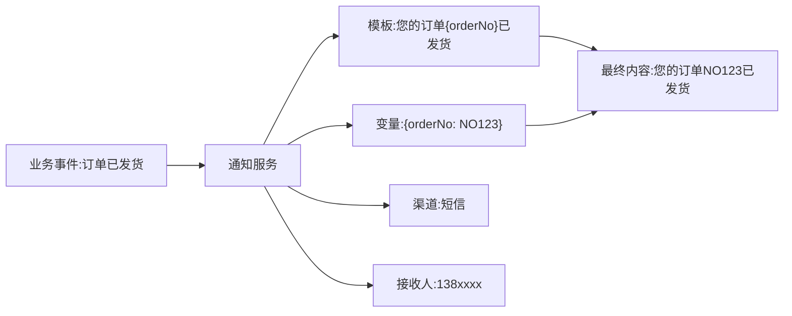
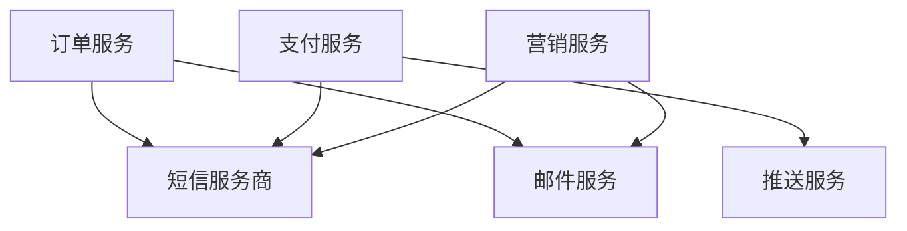
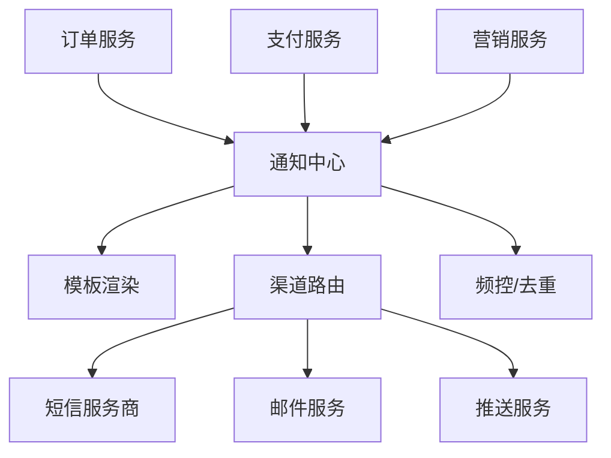
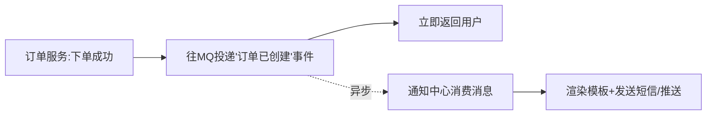
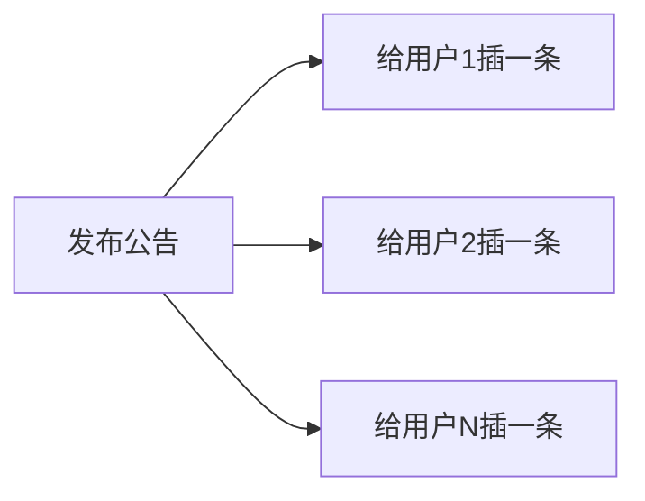
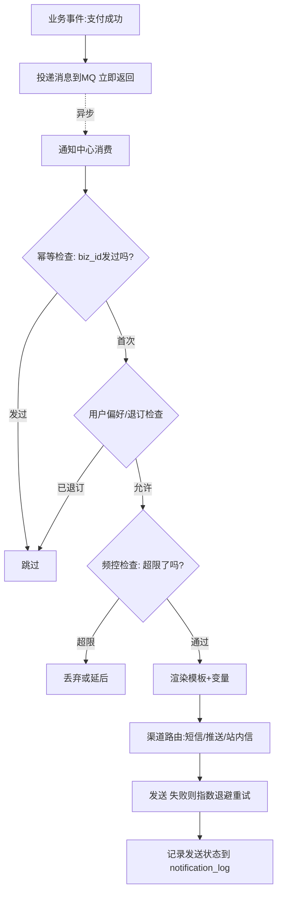

# 后端消息通知模块完全指南：从多渠道下发到模板、可靠投递与频控

"下单成功给用户发条短信""支付成功推个 App 通知""有人评论了发个站内信"——消息通知在几乎每个系统里都无处不在。正因为太常见，初学者往往低估它，直接在业务代码里塞一句 `sendSms()` 就完事了。

但当系统长大，你会踩到一连串坑：

> 发短信的接口挂了，把整个下单流程也拖垮了；同一条通知用户收到了三遍；促销短信一秒发了十万条把服务商额度烧光；用户投诉半夜被推送吵醒……

这些问题的背后，是消息通知模块需要认真设计的几个维度：**解耦、异步、可靠、幂等、频控**。这篇文章会从零讲清楚怎么搭一套像样的通知体系。

:::note
代码以 Node.js 风格演示，重在讲清逻辑。文中的"通知""消息"指的是发给用户的业务通知（短信/邮件/推送等），不要和作为基础设施的"消息队列（MQ）"混淆——后者是实现通知异步化的工具，本文会用到它。
:::

---

## 一、模块全景：通知都有哪些渠道

先建立全局视角。"消息通知"其实是多种下发**渠道**的统称：

| 渠道 | 说明 | 典型场景 | 特点 |
|------|------|---------|------|
| 短信（SMS） | 通过短信服务商下发 | 验证码、订单提醒 | 到达率高、有成本、有字数限制 |
| 邮件（Email） | 通过邮件服务发送 | 通知、营销、报表 | 便宜、可富文本、易进垃圾箱 |
| App 推送（Push） | 通过 APNs/FCM 等推送 | 活动、提醒 | 依赖设备在线、需用户授权 |
| 站内信 | 存在你自己数据库里 | 系统通知、消息中心 | 完全可控、需自己管已读未读 |
| IM/服务号 | 微信服务号、钉钉等 | 服务通知 | 依赖第三方平台规则 |

不同渠道特性差异很大，但从后端设计的角度，它们有大量**共性**（都要模板、都要异步、都要可靠、都要防重）。好的设计就是把共性抽象出来，做成一个统一的通知服务。

---

## 二、通知的核心组成

无论哪个渠道，一条通知都由这几个要素构成。理解它们，才能设计出通用的模型：

- **接收人（To）**：发给谁。可能是手机号、邮箱、用户 ID、设备 token。
- **渠道（Channel）**：走短信、邮件还是推送。
- **模板（Template）+ 变量**：通知内容通常不是写死的，而是"模板 + 动态数据"。比如模板"您的订单 `{orderNo}` 已发货",变量 `{orderNo}` 在发送时填入。
- **触发事件（Event）**：什么业务动作触发了这条通知（下单、支付、发货）。



---

## 三、通知模板：不要把内容写死在代码里

初学者常把通知内容直接写在业务代码里：`sendSms(phone, "您的订单" + orderNo + "已发货")`。这有几个问题：

- 改文案要改代码、重新发布。
- 多语言、多渠道时内容散落各处，难以维护。
- 运营想调整话术只能求开发。

正确做法是**模板化**：把通知内容抽成模板，存在数据库或配置里，用占位符表示动态部分。

```js
// 模板存储（数据库里的一条记录）
const template = {
  code: 'ORDER_SHIPPED',        // 模板编码，业务用它来引用
  channel: 'sms',
  content: '您的订单{orderNo}已发货，预计{days}天内送达。',
};

// 渲染：把变量填进模板
function render(template, vars) {
  return template.content.replace(/\{(\w+)\}/g, (_, key) => vars[key] ?? '');
}

const text = render(template, { orderNo: 'NO123', days: 3 });
console.log(text); // 您的订单NO123已发货，预计3天内送达。
```

这样业务代码只需要说"用 `ORDER_SHIPPED` 模板，变量是这些",不用关心具体文案，运营改模板也不用动代码。

:::tip
短信模板还有个现实约束：正规短信服务商要求模板**提前报备审核**。所以短信内容必须用报备过的模板，不能随意拼接，否则发不出去。这也是模板化的另一个必要原因。
:::

---

## 四、架构设计：统一通知中心

### 4.1 反例：业务系统各自发通知

最糟糕的架构是每个业务模块（订单、支付、营销）都自己直接调短信/邮件接口：



问题：每个业务都要重复写发送、重试、限流逻辑；换个短信服务商要改一堆地方；无法统一做频控和统计。

### 4.2 正解：抽出统一的通知中心

把通知能力收敛成一个独立的**通知中心（Notification Service）**。业务系统只负责"告诉通知中心：发生了什么事、发给谁",具体怎么发由通知中心统一处理：



好处：
- 业务系统**解耦**，不关心发送细节。
- 模板、重试、限流、统计**集中管理**。
- 换服务商、加渠道只改通知中心一处。

---

## 五、异步化：通知绝不能拖垮主流程

这是通知模块最重要的工程原则之一。

### 5.1 为什么必须异步

设想下单流程里同步调用发短信：

```
创建订单 → 扣库存 → 调短信接口(耗时/可能超时/可能失败) → 返回用户
```

如果短信服务商响应慢或挂了，用户下单就会卡住甚至失败——**一个非核心的通知，拖垮了核心的交易**。这是绝对不能接受的。

:::important
**通知是"锦上添花",绝不能阻塞核心业务。** 核心流程（下单、支付）成功后，通知应该"发出去让它自己慢慢处理",主流程立即返回，不等通知结果。这就是异步化。
:::

### 5.2 用消息队列实现异步

标准做法是引入**消息队列（MQ）**：业务完成后只往队列里投一条消息就立即返回；通知中心作为消费者，从队列里取消息慢慢发送。



```js
// 业务侧：只发消息，不等发送结果
async function afterOrderPaid(order) {
  await mq.publish('order.paid', {
    userId: order.userId,
    orderNo: order.orderNo,
    // ...
  });
  // 立即返回，不关心通知何时发出
}

// 通知中心侧：消费消息，异步处理发送
mq.subscribe('order.paid', async (event) => {
  const user = await getUser(event.userId);
  await notificationCenter.send({
    to: user.phone,
    channel: 'sms',
    templateCode: 'ORDER_PAID',
    vars: { orderNo: event.orderNo },
  });
});
```

这样即使短信服务商挂了，也只是通知延迟发送，下单支付主流程完全不受影响。这也解释了为什么消息队列是通知模块的标配基础设施。

---

## 六、可靠性：确保通知不丢、失败能重试

异步化解决了"不阻塞",但带来新问题：**消息或发送可能失败，怎么保证通知最终能送达？**

### 6.1 发送失败要重试

第三方渠道（短信、推送）随时可能临时失败（网络抖动、服务商限流）。通知中心要有**重试机制**：失败后隔一段时间再试，通常用**指数退避**（第一次隔 1 秒、第二次 2 秒、第三次 4 秒……）避免雪上加霜。

```js
async function sendWithRetry(task, maxRetries = 3) {
  for (let i = 0; i <= maxRetries; i++) {
    try {
      return await realSend(task); // 真正调用短信/推送接口
    } catch (err) {
      if (i === maxRetries) {
        await markAsFailed(task, err); // 重试用尽，记为失败待人工处理
        throw err;
      }
      await sleep(1000 * Math.pow(2, i)); // 指数退避：1s, 2s, 4s
    }
  }
}
```

### 6.2 记录发送状态

每条通知都应有一条**发送记录**，带状态（待发送 / 已发送 / 失败），便于排查、重试和统计：

```sql
CREATE TABLE notification_log (
  id BIGINT PRIMARY KEY,
  biz_id VARCHAR(64),      -- 业务唯一标识(幂等用)
  user_id BIGINT,
  channel VARCHAR(20),
  template_code VARCHAR(50),
  status TINYINT,          -- 0待发送 1成功 2失败
  retry_count INT,
  created_at DATETIME
);
```

### 6.3 消息本身不丢：可靠投递

如果连"往 MQ 投消息"这一步都可能因为宕机而丢失怎么办？这就需要**可靠投递**机制，最经典的是 **Outbox（本地消息表）模式**：把"要发的通知"和业务数据**在同一个事务里**写进本地表，再由后台任务可靠地投递到 MQ，保证"业务成功了，通知消息一定不会丢"。这块本站有专文：[基于 Outbox 的消息可靠投递](/posts/architecture/nodejs-outbox-mq-reliable-delivery-guide)。

---

## 七、幂等防重：用户不能收到重复通知

有了重试和 MQ，就带来一个必然的副作用：**消息可能被重复消费、重试可能重复发送**。如果不处理，用户就会收到两条、三条一模一样的短信——既骚扰用户，又浪费钱。

所以通知发送**必须幂等**：同一个业务事件，无论触发几次，用户只收到一次。

### 7.1 用业务唯一标识去重

给每条通知一个**业务唯一 ID**（`biz_id`），比如"订单 NO123 的支付成功通知"就是 `order_paid:NO123`。发送前先检查这个 ID 是否已发过：

```js
// 可运行
// 演示：用 biz_id 做幂等，重复事件只发一次
const sentLog = new Set(); // 模拟已发送记录(实际用数据库唯一索引或Redis)
let realSendCount = 0;

function sendNotificationIdempotent(bizId, content) {
  // 幂等检查：已发过就跳过
  if (sentLog.has(bizId)) {
    return `[跳过] ${bizId} 已发送过，忽略重复`;
  }
  // 标记 + 真正发送
  sentLog.add(bizId);
  realSendCount++;
  return `[发送] ${content}`;
}

// 模拟同一个"支付成功"事件因重试/重复消费触发了 3 次
const bizId = 'order_paid:NO123';
console.log(sendNotificationIdempotent(bizId, '订单NO123支付成功'));
console.log(sendNotificationIdempotent(bizId, '订单NO123支付成功'));
console.log(sendNotificationIdempotent(bizId, '订单NO123支付成功'));
console.log('实际发送次数:', realSendCount, '(必须是 1)');
```

生产中，`sentLog` 换成数据库唯一索引（`biz_id` 加唯一约束）或 Redis 的 `SET NX`,原理一样。这和[订单](/posts/architecture/order-module-complete-guide)、[支付](/posts/architecture/payment-module-complete-guide)里的幂等思想完全一致——**给操作找唯一标识，识别并跳过重复**。

---

## 八、频率控制：别把用户和额度都烧了

通知发多了会出两个问题：**骚扰用户**（半夜被推送、一天收十条）和**烧钱/被限流**（短信按条收费，营销群发一不小心额度就没了，服务商也会限流）。所以要做**频率控制（频控）**。

常见的频控策略：

- **单用户频次限制**：同一用户同一类通知，一天最多几条、一小时最多几条。用 Redis 计数器实现（和限流思路一样）。
- **免打扰时段**：比如营销类通知只在 8:00–22:00 发送，夜间的排到次日。
- **合并/聚合**：短时间内多条同类通知合并成一条（"您有 3 条新消息"），而不是发 3 条。
- **优先级区分**：验证码、支付这类**交易类通知**优先级最高、不受营销频控限制；促销类**营销通知**严格频控。

```js
// 用 Redis 做单用户单日频次控制
async function checkFrequency(userId, type, dailyLimit) {
  const key = `notify:freq:${type}:${userId}:${today()}`;
  const count = await redis.incr(key);
  if (count === 1) await redis.expire(key, 86400); // 首次设置当天过期
  return count <= dailyLimit; // 超过上限则不发
}
```

:::warning
一定要把**交易类通知**和**营销类通知**分开对待。验证码发不出去是严重故障，而营销短信少发几条没关系。二者的频控策略、优先级、重试力度都不同，混在一起管理会出问题。
:::

---

## 九、站内信：需要自己管理的通知

前面的短信、邮件、推送都是"发出去就不管了"（一次性触达）。**站内信**不一样——它存在你自己的数据库里，用户登录后在"消息中心"查看，你要自己管理它的存储、已读未读、列表分页。

### 9.1 站内信的两种投递模式

当一条通知要发给很多用户时（比如系统公告发给全体用户），有两种存储思路，这是站内信设计的核心决策：

**推模式（写扩散）**：发送时，给**每个**接收用户都插入一条站内信记录。



- 优点：用户读自己的消息很快（直接查自己的记录）。
- 缺点：发给百万用户就要写百万条，写入量巨大。
- 适合：**一对一或小范围**通知（如"你的订单发货了"）。

**拉模式（读扩散）**：公告只存**一条**，另用一张表记录"每个用户读到哪了"。用户查看时实时拉取。

- 优点：发布只写一条，省存储。
- 缺点：读取时计算较复杂。
- 适合：**全体/大范围**广播（如全站公告）。

:::tip
实践中常**混合使用**：个人通知用推模式（写扩散），全站公告用拉模式（读扩散）。这和社交产品的"feed 流/朋友圈"是同一套推拉权衡的思想。
:::

### 9.2 已读未读

站内信要管理已读状态，消息中心通常要显示未读红点数量：

```sql
CREATE TABLE user_message (
  id BIGINT PRIMARY KEY,
  user_id BIGINT,
  title VARCHAR(100),
  content TEXT,
  is_read TINYINT DEFAULT 0,  -- 0未读 1已读
  created_at DATETIME
);
-- 查未读数量
-- SELECT COUNT(*) FROM user_message WHERE user_id = ? AND is_read = 0;
```

未读数量这种高频读取，通常会缓存到 Redis，避免每次进页面都 `COUNT` 数据库。

---

## 十、用户偏好与退订

通知不是你想发就能发的——涉及合规和用户体验：

- **用户偏好设置**：允许用户选择"接收哪些类型的通知""走哪个渠道"。发送前要检查用户是否开启了对应通知。
- **退订机制**：营销类通知**必须提供退订入口**（这是很多国家和地区的法规要求，如短信要带"回 T 退订",邮件要有 unsubscribe 链接）。
- **交易类不可退订**：验证码、支付通知等交易必需的通知不在退订范围，但也不能拿它来夹带营销内容。

```js
async function shouldSend(userId, type) {
  // 交易类通知：无视偏好，必须发
  if (isTransactional(type)) return true;
  // 营销类：检查用户是否退订
  const pref = await getUserPreference(userId);
  return pref.marketingEnabled === true;
}
```

---

## 十一、把整条通知链路串起来

用一张图把一条通知从触发到送达的完整链路串起来：



各知识点的落点：
- **MQ 异步** → 不阻塞核心业务
- **幂等（biz_id）** → 防止重复通知
- **偏好/退订** → 合规与体验
- **频控** → 防骚扰、防烧额度
- **模板** → 内容与代码解耦
- **重试 + 状态记录** → 保证可靠送达

---

## 十二、常见问题

::: details 为什么发通知一定要走消息队列，直接调不行吗？
直接同步调用会让不可靠的通知拖垮核心业务——短信服务商一慢，你的下单就卡住。走 MQ 异步化后，主流程投个消息就返回，通知延迟或失败都不影响交易。这是通知模块的基本原则。
:::

::: details 用户收到重复通知怎么解决？
根源是消息重复消费或重试重复发送。解决办法是幂等：给每条通知一个业务唯一 ID（如 `order_paid:NO123`），发送前检查是否已发过，用数据库唯一索引或 Redis 保证同一事件只发一次。
:::

::: details 全站公告发给一百万用户，要给每人插一条记录吗？
不一定。小范围个人通知用"推模式（写扩散）",每人一条，读取快；全站大范围广播用"拉模式（读扩散）",只存一条 + 记录每个用户的已读位置，省存储。实践中两者混用。
:::

::: details 交易通知和营销通知需要区别对待吗？
必须。验证码、支付通知是交易必需的，优先级最高、不受频控和退订限制、失败要重点重试；营销通知要严格频控、支持退订、避开免打扰时段。二者混在一起管理会出大问题。
:::

::: details 通知发送失败了怎么办？
先重试（指数退避避免加剧故障），重试用尽仍失败则标记为失败状态并记录，交由人工或补偿任务处理。所以每条通知都要有发送记录和状态，不能发完就不管。
:::

---

## 小结

消息通知看似简单，做好却要兼顾多个维度。回顾全文主线：

1. **多渠道**：短信、邮件、推送、站内信各有特性，抽出共性统一处理。
2. **模板化**：内容与代码解耦，运营可改文案，短信还需报备模板。
3. **统一通知中心**：业务只说"发生了什么",发送细节集中管理。
4. **异步化**：走消息队列，通知绝不阻塞核心业务。
5. **可靠性**：失败重试（指数退避）+ 状态记录 + Outbox 保证消息不丢。
6. **幂等**：用业务唯一 ID 防止重复通知。
7. **频控**：防骚扰用户、防烧额度，交易类和营销类分开对待。
8. **站内信**：推/拉模式权衡，管理已读未读。
9. **偏好与退订**：合规红线，营销类必须可退订。

建议动手做一遍：先实现"模板渲染 + 单渠道发送",再加上 MQ 异步化和幂等，最后补齐频控和站内信。消息通知和[订单](/posts/architecture/order-module-complete-guide)、[支付](/posts/architecture/payment-module-complete-guide)模块紧密协作（它们是通知的主要触发方），可靠投递部分可深入[基于 Outbox 的消息可靠投递](/posts/architecture/nodejs-outbox-mq-reliable-delivery-guide)。想系统规划学习路径，参考[后端学习路线图](/posts/architecture/backend-developer-learning-roadmap)。
