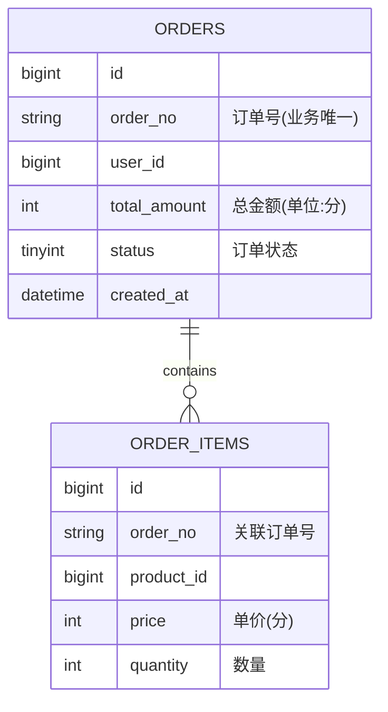
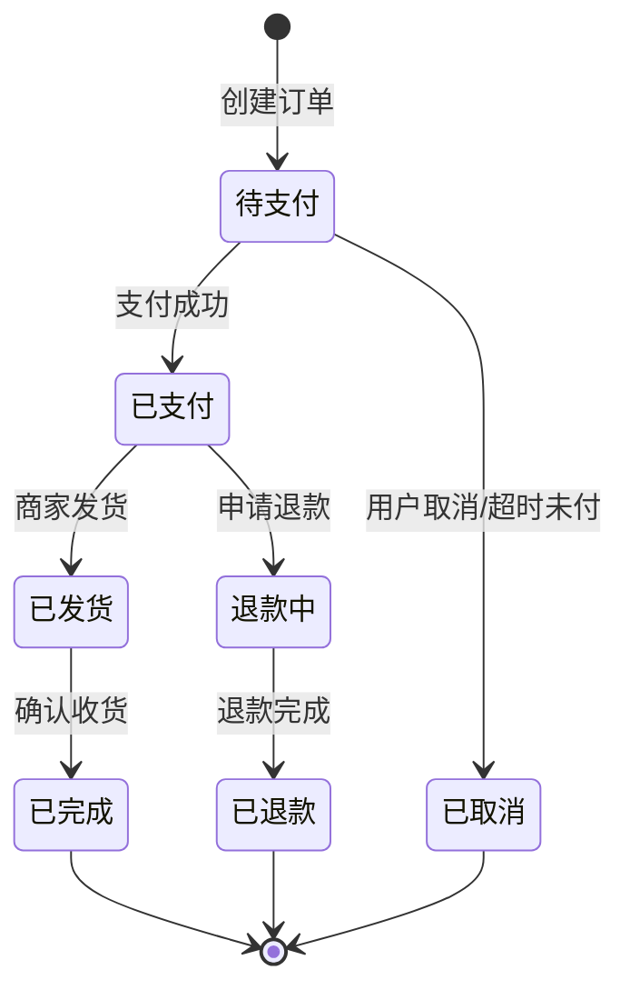
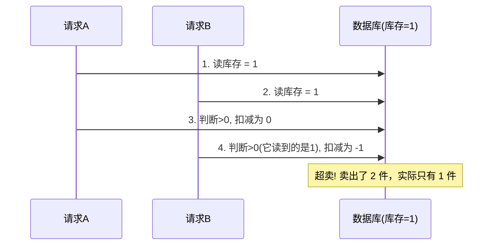
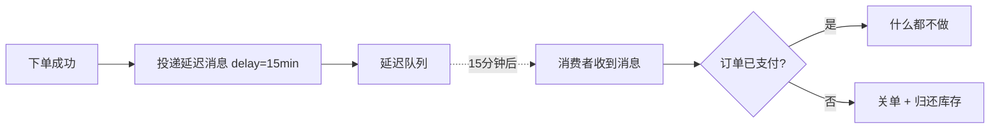
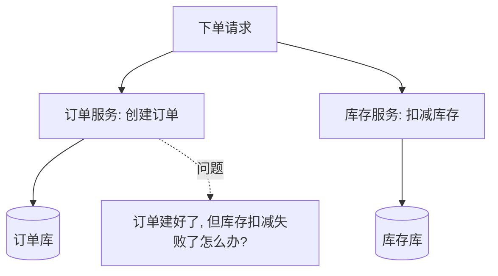
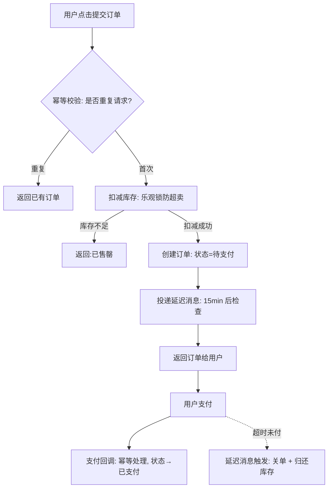

# 后端订单模块完全指南：状态机、幂等、库存与超时关单

如果说登录模块考验的是"安全",那订单模块考验的就是"一致性"。它是电商类系统的心脏，也是后端最能体现内功的地方。

初学者常有个误解：以为订单模块就是"往订单表插一条记录"。真到了高并发、真金白银的场景，你会发现难的根本不是"存",而是这些问题：

> 用户狂点提交会不会生成多个订单？只剩 1 件商品被 100 人同时抢会不会超卖？下单后不付款怎么自动取消？订单状态会不会乱跳？跨了订单库和库存库怎么保证不出错？

这篇文章就沿着一条完整链路，把订单模块的核心难题逐个讲透：**数据模型 → 状态机 → 幂等 → 库存扣减 → 超时关单 → 分布式事务**。

:::note
代码以 Node.js 风格演示，重在讲清逻辑，换成 Java/Python/Go 完全一致。本文是"建立全局认知 + 讲透核心概念"的导览，某些子主题（如表设计细节、状态机完整实现、可靠消息投递）在本站有独立深入文章，会在相应位置给出链接。
:::

---

## 一、订单模块到底包含什么

先建立全局视角。一个完整的订单模块，远不止"下单"这一个动作，它覆盖订单的整个生命周期：

- **下单（创建订单）**：校验参数、锁定库存、计算金额、生成订单。
- **支付**：对接支付、处理支付回调、更新订单状态。
- **履约**：发货、物流跟踪、确认收货。
- **售后**：取消、退款、退货。
- **查询**：订单列表、订单详情。

这些动作背后，贯穿着几个共同的技术难题——状态怎么流转、怎么防重复、怎么防超卖、怎么保证跨系统一致。这些"共性难题"才是本文的重点。

---

## 二、数据模型：订单表怎么设计

一切从数据结构开始。订单数据有个基本特征：**一个订单包含多个商品**。所以典型设计是"一主一子"两张表：

- **订单主表（orders）**：一条记录代表一个订单，存订单号、用户、总金额、状态、时间等。
- **订单明细表（order_items）**：一条记录代表订单里的一个商品，存商品、单价、数量，通过订单号关联主表。



这里有几个初学者要注意的设计点：

:::tip
1. **金额用整数存"分"，不要用浮点数。** 浮点数（float/double）有精度问题，`0.1 + 0.2 !== 0.3`，涉及钱绝对不能用。存"分"（整数）或用定点数 `decimal`。
2. **订单号（order_no）要有业务唯一性**，作为对外展示和幂等去重的依据，通常用"时间 + 机器标识 + 序列"生成，而不是直接暴露自增主键 id。
3. **状态用一个字段（如 tinyint）表示**，配合下一章的状态机管理。
:::

表结构和索引的深入设计（分库分表、冷热分离等），可以看本站的[订单系统表结构与索引设计](/posts/architecture/order-system-schema-and-index-design)。

---

## 三、订单状态机：订单模块的骨架

订单不是一条静态记录，它有**生命周期**。状态只能按规定的路径流转，绝不能乱跳——"已完成"的订单不能突然变回"待支付"。管理这套规则的模型，就叫**状态机（State Machine）**。

### 3.1 典型的订单状态流转



### 3.2 为什么必须用状态机

如果不管控流转，直接允许"随便改状态",会出现各种灾难：已取消的订单又被发货、没支付的订单被确认收货……状态机的价值就是**把"允许的流转"显式定义出来，拒绝一切非法跳转**。

### 3.3 代码实现

核心是维护一张"允许流转表",每次改状态前先校验：

```js
// 可运行
// 定义状态
const STATUS = {
  PENDING: '待支付',
  PAID: '已支付',
  SHIPPED: '已发货',
  COMPLETED: '已完成',
  CANCELLED: '已取消',
};

// 允许的流转：key 是当前状态，value 是允许转入的状态列表
const TRANSITIONS = {
  [STATUS.PENDING]: [STATUS.PAID, STATUS.CANCELLED],
  [STATUS.PAID]: [STATUS.SHIPPED],
  [STATUS.SHIPPED]: [STATUS.COMPLETED],
  [STATUS.COMPLETED]: [], // 终态，不能再流转
  [STATUS.CANCELLED]: [], // 终态
};

// 校验并执行流转
function changeStatus(order, targetStatus) {
  const allowed = TRANSITIONS[order.status] || [];
  if (!allowed.includes(targetStatus)) {
    throw new Error(`非法状态流转：${order.status} → ${targetStatus}`);
  }
  order.status = targetStatus;
  return order;
}

// 演示
let order = { orderNo: 'NO123', status: STATUS.PENDING };
console.log('初始:', order.status);

changeStatus(order, STATUS.PAID);   // 待支付 → 已支付 ✓
console.log('支付后:', order.status);

changeStatus(order, STATUS.SHIPPED); // 已支付 → 已发货 ✓
console.log('发货后:', order.status);

try {
  changeStatus(order, STATUS.PENDING); // 已发货 → 待支付 ✗ 非法!
} catch (e) {
  console.log('拦截:', e.message);
}
```

状态机的工程化实现（结合数据库、并发、事件驱动）可参考[订单状态机的 Node.js 实现](/posts/architecture/order-state-machine-nodejs-guide)。

---

## 四、幂等性：防止重复下单、重复支付

这是订单模块**最重要**的概念之一，也是面试高频考点。

### 4.1 什么是幂等

> **幂等**：同一个操作，执行一次和执行多次，产生的结果完全相同。

举例：
- "把订单状态设为已支付" 是幂等的——设一次和设十次，结果都是"已支付"。
- "库存减 1" 是**不**幂等的——执行十次会减十次。

### 4.2 为什么订单必须幂等

真实世界里，一个"下单"请求可能被执行多次：

- 用户网络卡顿，疯狂点了 5 次"提交订单"。
- 接口响应慢，前端**自动重试**。
- 支付平台的回调**可能重复发送**（这是支付回调的常态，不是异常）。

如果不做幂等，后果就是：生成 5 个订单、扣 5 次库存、加 5 次积分。这在涉及金钱的系统里是严重事故。

### 4.3 幂等的实现方案

**方案一：唯一索引（防重复创建）**

最简单可靠。给一个"业务上唯一"的字段加数据库唯一索引，重复插入会被数据库拒绝。

比如下单时，前端先获取一个唯一的**幂等号**，随请求带上，作为订单的唯一键：

```sql
-- 给幂等号加唯一索引
ALTER TABLE orders ADD UNIQUE INDEX uk_idempotency (idempotency_key);
```

```js
async function createOrder(userId, items, idempotencyKey) {
  try {
    // 幂等号有唯一索引，重复请求插入会失败
    const order = await db.orders.insert({
      orderNo: genOrderNo(),
      userId,
      idempotencyKey, // 前端生成的唯一号
      status: '待支付',
    });
    return order;
  } catch (err) {
    if (isDuplicateKeyError(err)) {
      // 重复请求：直接返回已创建的那个订单，而不是报错
      return await db.orders.findByIdempotencyKey(idempotencyKey);
    }
    throw err;
  }
}
```

**方案二：状态判断 + 唯一约束（防重复处理）**

处理支付回调这类"更新"操作时，先检查当前状态：

```js
async function handlePaymentCallback(orderNo) {
  const order = await db.orders.findByOrderNo(orderNo);
  // 如果已经是已支付，说明是重复回调，直接返回成功，不重复处理
  if (order.status === '已支付') {
    return { ok: true, message: '已处理，忽略重复回调' };
  }
  // 用带条件的更新保证并发安全：只有当前是"待支付"才更新
  const affected = await db.orders.update(
    { status: '已支付' },
    { where: { orderNo, status: '待支付' } } // 关键：where 里带上原状态
  );
  if (affected === 0) {
    return { ok: true, message: '状态已变更，忽略' }; // 并发下被别人先改了
  }
  // 只有这里才真正执行"加积分、发货通知"等副作用
  await addPoints(order.userId);
}
```

:::important
幂等设计的核心思路：**给操作找一个"唯一标识",并想办法让"重复的操作"被识别出来并跳过副作用。** 唯一索引、状态机、Redis 幂等号，都是围绕这个思路的手段。
:::

---

## 五、库存扣减与超卖：并发下的经典难题

**超卖**是指卖出的数量超过了实际库存——只剩 1 件，却让两个人都下单成功了。这是并发场景下最典型的问题。

### 5.1 为什么会超卖

问题出在"读"和"写"是两步操作，中间可能被其他请求插入。设想库存只剩 1：



两个请求都读到了"1",都以为自己能买，于是都扣减了。根源是"检查库存"和"扣减库存"之间没有互斥。

### 5.2 方案一：数据库乐观锁

不加真正的锁，而是在更新时把"库存必须足够"作为条件写进 SQL，靠数据库行锁保证这一句的原子性：

```sql
-- 关键：WHERE 里带上 stock >= 数量。扣减和检查在一条语句里原子完成
UPDATE products
SET stock = stock - 1
WHERE id = 2001 AND stock >= 1;
```

```js
async function deductStock(productId, quantity) {
  const affected = await db.query(
    'UPDATE products SET stock = stock - ? WHERE id = ? AND stock >= ?',
    [quantity, productId, quantity]
  );
  // affected 为 0 说明库存不足，扣减失败
  if (affected === 0) {
    throw new Error('库存不足');
  }
}
```

这条 SQL 里，数据库会对这一行加锁执行，两个并发请求会**排队**执行这句更新，第二个执行时 `stock >= 1` 不再成立，`affected` 为 0，扣减失败。超卖被杜绝。这是**最常用、最简单**的方案。

### 5.3 方案二：数据库悲观锁

先用 `SELECT ... FOR UPDATE` 把这行锁住，直到事务结束别人不能改：

```sql
BEGIN;
SELECT stock FROM products WHERE id = 2001 FOR UPDATE; -- 锁住这行
-- 应用层判断库存是否足够
UPDATE products SET stock = stock - 1 WHERE id = 2001;
COMMIT;
```

悲观锁在高并发下会让请求排队等锁，性能不如乐观锁，适合冲突非常激烈的场景。

### 5.4 方案三：Redis 预扣减（高并发首选）

秒杀这类超高并发场景，直接打数据库扛不住。思路是把库存**预热到 Redis**，用 Redis 的原子操作先扣减，挡住绝大部分流量，再异步落库：

```js
// 用 Lua 脚本保证"判断 + 扣减"在 Redis 中原子执行
const luaScript = `
  local stock = tonumber(redis.call('GET', KEYS[1]) or '0')
  if stock >= tonumber(ARGV[1]) then
    return redis.call('DECRBY', KEYS[1], ARGV[1])
  else
    return -1
  end
`;
async function deductStockRedis(productId, quantity) {
  const result = await redis.eval(luaScript, 1, `stock:${productId}`, quantity);
  if (result === -1) throw new Error('库存不足');
  // 扣减成功后，发消息异步扣减数据库库存、创建订单
}
```

:::warning
Redis 预扣减性能高，但要处理好"Redis 和数据库最终一致"的问题（比如订单最终没支付要把库存还回去），复杂度更高。**初学阶段先掌握乐观锁**，秒杀级场景再上 Redis 方案。
:::

### 5.5 三种方案对比

| 方案 | 原理 | 适用场景 | 复杂度 |
|------|------|---------|--------|
| 乐观锁 | UPDATE 带 `stock>=n` 条件 | 大多数普通场景 | 低 |
| 悲观锁 | `SELECT FOR UPDATE` 锁行 | 冲突极激烈 | 中 |
| Redis 预扣减 | Redis 原子扣减挡流量 | 秒杀等超高并发 | 高 |

---

## 六、超时未支付自动关单

用户下单后占用了库存，但一直不付款怎么办？不能让库存被无限占用。所以要做**超时自动关单**：下单后一段时间（如 15 分钟）未支付，自动取消订单并**归还库存**。

难点在于：怎么实现这个"15 分钟后触发"的延时动作？有三种主流方案。

### 6.1 方案一：定时任务轮询

起一个定时任务（如每分钟跑一次），扫描所有"待支付且超过 15 分钟"的订单，批量关闭：

```js
// 每分钟执行一次
async function cancelTimeoutOrders() {
  const deadline = Date.now() - 15 * 60 * 1000; // 15 分钟前
  const orders = await db.orders.find({
    status: '待支付',
    createdAt: { $lt: deadline },
  });
  for (const order of orders) {
    await changeStatus(order, '已取消');
    await returnStock(order); // 归还库存
  }
}
```

- **优点**：实现简单，最容易上手。
- **缺点**：有延迟（最多差一个扫描周期）；订单量大时全表扫描有压力；不够精准。

### 6.2 方案二：延迟队列

用消息队列的**延迟消息**（如 RocketMQ 延迟消息、RabbitMQ 死信队列）：下单时投递一条"15 分钟后到期"的消息，到点消费者收到后检查订单是否已支付，未支付则关单。



- **优点**：精准、实时、不用轮询扫库、天然分布式。
- **缺点**：依赖消息队列基础设施。这是**生产环境的主流方案**。

### 6.3 方案三：Redis 过期回调 / ZSet

也可以用 Redis 的 ZSet，把"订单号 → 到期时间戳"存进去，用定时任务取到期的部分。本质是自己实现一个轻量延迟队列（前面 Redis 系列文章讲过这个模式）。

:::tip
选型建议：练手/小项目用**定时任务**足够；正式生产用**消息队列延迟消息**。别一上来就追求复杂方案。
:::

---

## 七、分布式事务：跨服务的一致性

这是订单模块的**进阶难点**，初学阶段理解概念即可，不必深陷。

### 7.1 问题从哪来

在单体应用里，"扣库存"和"建订单"可以放在**一个数据库事务**里，要么全成功要么全回滚，很简单。

但当系统拆成微服务后（订单服务、库存服务各有各的数据库），一次下单要跨两个服务、两个数据库：



两个库不在一个事务里，没法用简单的 `COMMIT/ROLLBACK` 一起回滚。这就是**分布式事务**问题。

### 7.2 核心思路：从"强一致"退到"最终一致"

分布式环境下追求"实时强一致"代价极高。实践中通常接受**最终一致性**——允许短暂的不一致，但保证最终会达到一致状态。常见方案：

- **本地消息表 / Outbox 模式**：把"要通知库存服务"这件事，和订单数据**在同一个本地事务里**写进一张消息表，再由后台任务可靠地投递出去。保证"订单建了，通知也一定发得出去"。
- **可靠消息 + 最终一致**：借助消息队列，配合消费端幂等和重试。
- **TCC、Saga** 等分布式事务模式：把一个大事务拆成"预留—确认/取消"等步骤，适合更复杂的业务编排。

:::note
本站有一篇专门讲这个的：[基于 Outbox 的消息可靠投递](/posts/architecture/nodejs-outbox-mq-reliable-delivery-guide)，以及更全面的[分布式订单系统实战指南](/posts/architecture/distributed-order-system-practical-guide)。想深入分布式事务时再看，初学阶段知道"跨服务不能用普通事务，要靠最终一致"就够了。
:::

---

## 八、把整条下单链路串起来

用一张图把一次完整下单涉及的核心环节串起来，帮你建立全局视角：



各技术在链路里的位置：
- **幂等** → 防止重复下单、重复回调
- **状态机** → 管控订单状态合法流转
- **乐观锁/Redis** → 扣减库存、防超卖
- **延迟队列** → 超时未支付自动关单
- **分布式事务/最终一致** → 跨服务保证订单与库存一致

---

## 九、常见问题

::: details 幂等号（idempotency key）应该谁来生成？
通常由**客户端**在进入下单页时生成一个唯一值（如 UUID），提交订单时带上。这样用户在这个页面无论点多少次提交，用的都是同一个幂等号，服务端就能识别为重复请求。也有方案是下单前先调一个接口向服务端领取幂等号。
:::

::: details 乐观锁扣减库存失败了，要重试吗？
看业务。如果是"库存不足"导致的失败（`stock >= n` 不成立），不该重试，直接提示售罄。如果是并发冲突（用版本号的乐观锁场景）导致的失败，可以有限次重试。别无脑无限重试。
:::

::: details 超时关单后，如果用户又支付成功了怎么办？
这是个真实的边界情况：订单已关闭、库存已归还，但支付回调又来了。处理办法是在支付回调里判断订单状态——如果订单已取消，则触发**自动退款**流程，把钱退回给用户，而不是强行改回已支付。
:::

::: details 一定要用消息队列做超时关单吗？
不一定。练手项目或订单量不大时，定时任务轮询完全够用，实现也最简单。消息队列延迟消息是量大、要求精准时的生产级方案。按需选择，别过度设计。
:::

::: details 分布式事务是不是订单系统必须的？
不是。只有当你把系统拆成了多个服务、多个数据库时才会遇到。单体应用里用一个本地数据库事务就能解决。初学阶段做单体订单系统，根本用不到分布式事务。
:::

---

## 小结

订单模块的所有难点，都源于一个事实：**它是高并发下操作"真金白银 + 有限库存"的核心链路，容不得半点不一致。** 回顾全文主线：

1. **数据模型**：主表 + 明细表，金额用整数存"分",订单号业务唯一。
2. **状态机**：用"允许流转表"管控状态，拒绝一切非法跳转，是订单的骨架。
3. **幂等**：给操作找唯一标识，让重复请求被识别并跳过副作用，防重复下单/回调。
4. **库存扣减**：用乐观锁（`stock>=n` 条件更新）防超卖，秒杀级用 Redis 预扣减。
5. **超时关单**：延时任务归还被占库存，生产用消息队列延迟消息。
6. **分布式事务**：跨服务时从强一致退到最终一致，用 Outbox/可靠消息保证。

建议动手做一遍：从单体的"下单 + 状态机 + 乐观锁扣库存"起步，再逐步加幂等、超时关单。这正是[后端学习路线图](/posts/architecture/backend-developer-learning-roadmap)里"阶段二"最好的练手项目。想深入某一块，可以顺着文中链接看对应的专题文章。
