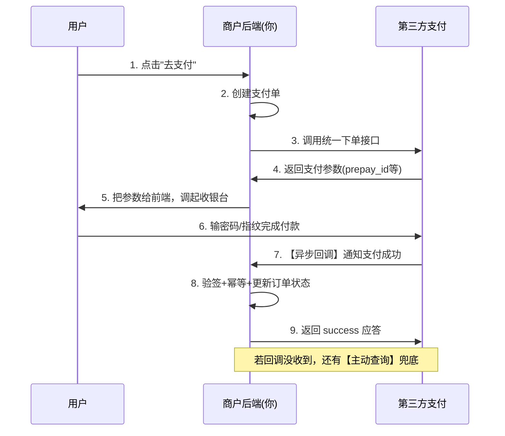
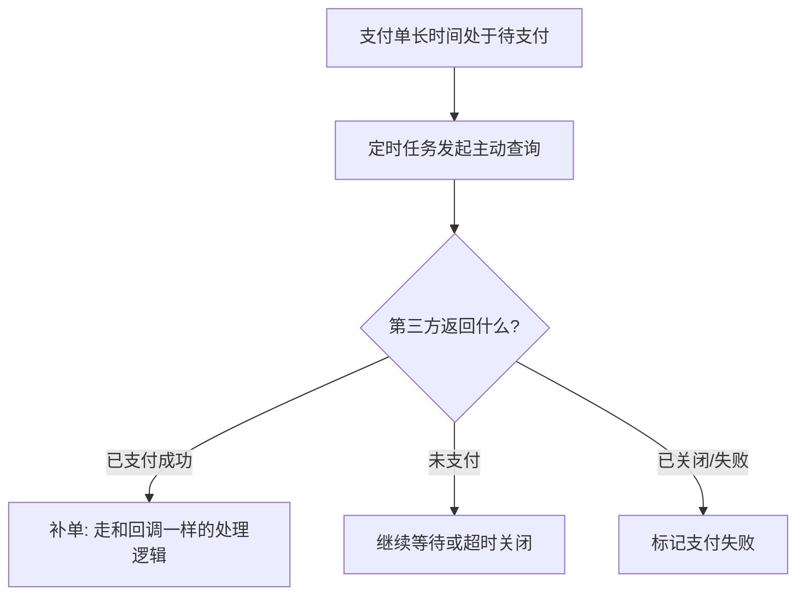
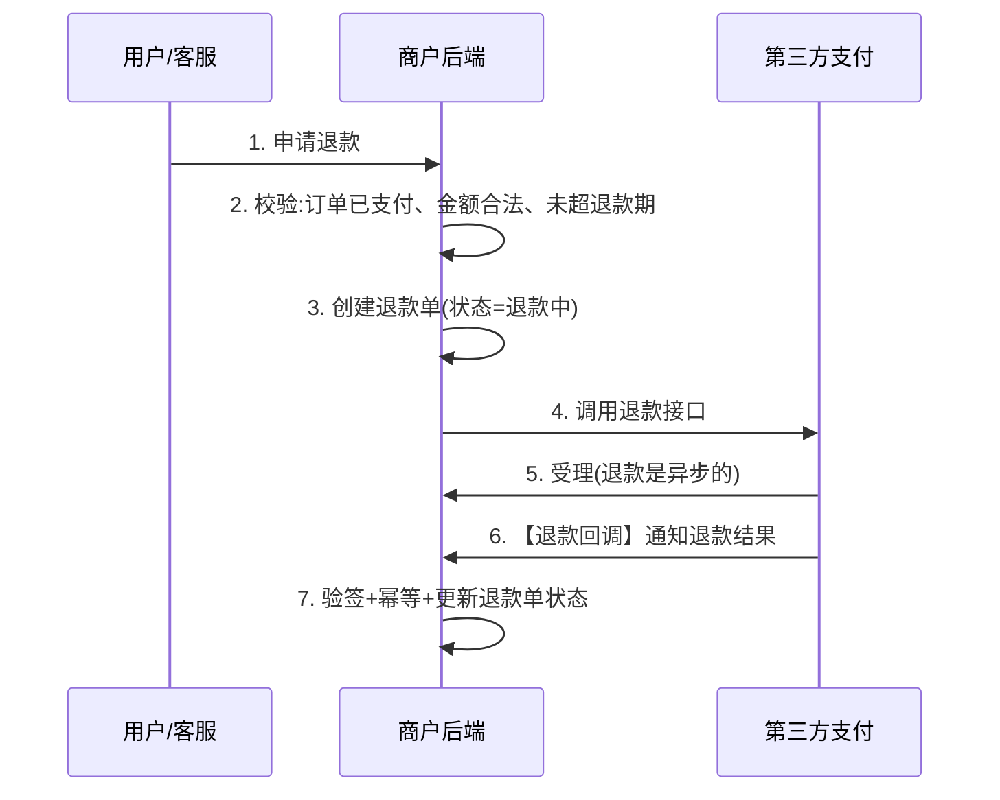
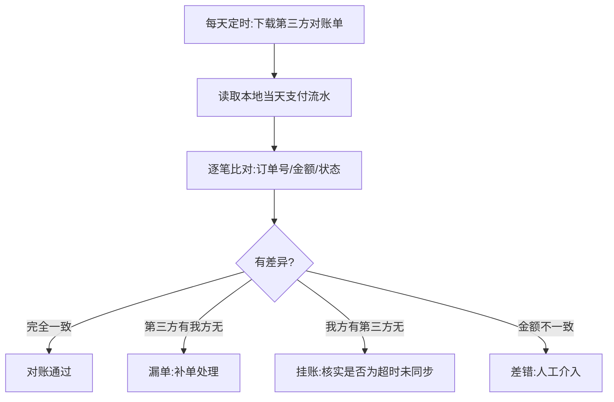
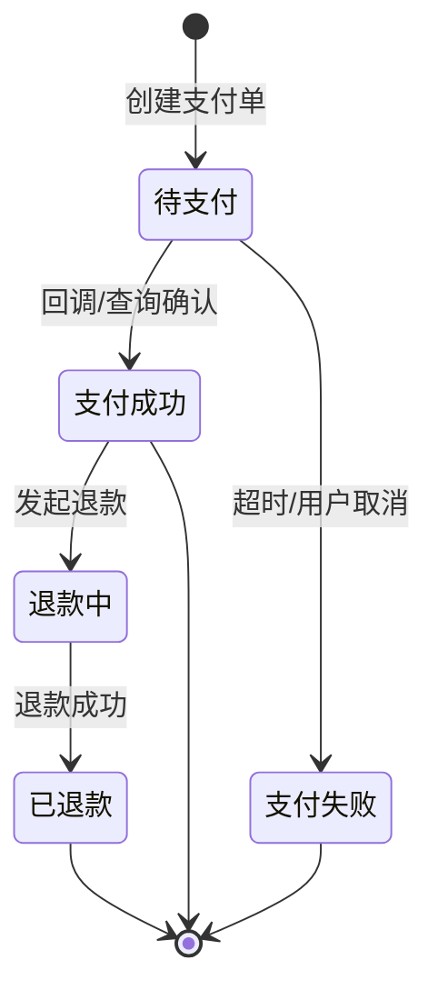
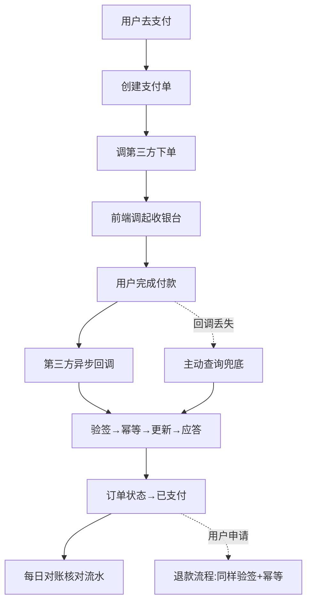

# 后端支付模块完全指南：从发起支付到回调、退款与对账

如果说订单模块考验"一致性",那支付模块就是把这种考验推到极致——因为它直接操作**真金白银**，而且**强依赖外部的第三方支付平台**（微信支付、支付宝、银行）。任何一个环节出错，轻则用户投诉，重则资金损失。

初学者对支付常有两个误解：

1. 以为支付就是"调一下微信支付的接口"。实际上，真正的难点在**支付成功后**——怎么可靠地知道用户付了钱、怎么防止重复入账、钱和账怎么对得上。
2. 以为第三方接口是可靠的。实际上，**回调可能丢失、可能重复、可能延迟**，你的系统必须在"第三方不可靠"的假设下依然正确。

这篇文章就沿着一条完整链路把支付讲透：**发起支付 → 异步回调 → 主动查询 → 幂等防重 → 退款 → 对账**，并贯穿安全与金额处理。

:::note
代码以 Node.js 风格演示，重在讲清逻辑。真实接入请以微信支付/支付宝的官方文档和 SDK 为准。本文聚焦"作为商户系统，如何正确地对接第三方支付"这一后端视角，不涉及支付牌照、清结算等金融资质话题。
:::

:::warning
支付涉及资金安全，本文用于讲解原理与工程思路。生产系统必须结合官方 SDK、安全审计、灰度发布和完善的监控告警，切勿仅凭示例代码上线。
:::

---

## 一、支付模块到底包含什么

先建立全局视角。一个完整的支付模块，远不止"付款"一个动作：

- **发起支付**：创建支付单、调用第三方下单接口、把支付参数返回给前端调起收银台。
- **支付结果通知（回调）**：接收第三方的异步通知，确认支付成功，更新订单状态。
- **主动查询**：在回调不可靠时，主动向第三方查询支付结果作为兜底。
- **退款**：发起退款、接收退款结果、处理部分退款。
- **对账**：每天和第三方核对流水，发现并处理差异（多付、少付、状态不一致）。

其中，**异步回调**和**对账**是初学者最容易忽视、却最能体现工程功力的地方。

---

## 二、核心角色与整体流程

理解支付先厘清参与方。以"用户在你的电商 App 里用微信支付买东西"为例：

| 角色 | 是谁 | 职责 |
|------|------|------|
| 用户 | 买家 | 发起并完成付款 |
| 商户系统 | 你的后端 | 发起支付、接收结果、管理订单 |
| 第三方支付 | 微信支付/支付宝 | 实际处理资金、扣款 |
| 银行 | 发卡行 | 最终的资金划转 |

整体流程可以先建立一个宏观印象（细节后面逐节展开）：



:::important
记住这个关键认知：**第 6 步"用户付款成功"和第 8 步"你的系统知道付款成功"是两件事，中间隔着一个不可靠的网络回调（第 7 步）。** 支付模块的绝大部分复杂度，都是为了确保"用户付了钱，你的系统一定能正确地、且只有一次地知道并处理"。
:::

---

## 三、发起支付：创建支付单并调起收银台

### 3.1 为什么要有独立的"支付单"

初学者容易直接拿订单去支付。但实践中通常在订单之外，再建一个**支付单（payment）**记录。原因：

- 一个订单可能**多次尝试支付**（第一次超时了、换个方式再付），每次都是一条支付流水。
- 支付单专门记录和第三方交互的信息（第三方交易号、支付状态、支付方式），职责清晰。

支付单和订单是"多对一"：一个订单可能对应多条支付尝试，但最终只有一条成功。

### 3.2 发起支付的代码

```js
async function createPayment(orderNo, userId) {
  const order = await db.orders.findByOrderNo(orderNo);
  // 校验：订单必须存在、属于该用户、且处于待支付状态
  if (!order || order.userId !== userId) throw new Error('订单不存在');
  if (order.status !== '待支付') throw new Error('订单状态不可支付');

  // 1. 创建本地支付单，生成商户侧唯一的支付单号
  const payNo = genPayNo();
  await db.payments.insert({
    payNo,
    orderNo,
    amount: order.totalAmount, // 单位:分
    status: '待支付',
  });

  // 2. 调用第三方统一下单接口
  const prepay = await wechatPay.unifiedOrder({
    out_trade_no: payNo,              // 商户支付单号(第三方用它回调)
    total_fee: order.totalAmount,     // 金额，单位:分
    notify_url: 'https://your.com/pay/callback', // 回调地址
    // ... 其他参数
  });

  // 3. 把调起支付需要的参数返回给前端
  return buildPayParams(prepay);
}
```

:::tip
`out_trade_no`（商户订单号/支付单号）非常关键：它由**你**生成并保证唯一，第三方在回调时会原样带回来。你就是靠它把回调和本地支付单对应起来的。
:::

---

## 四、支付回调：整个支付最核心的环节

用户付款后，第三方会通过你在下单时提供的 `notify_url`，**异步**地通知你"这笔钱付成功了"。处理好这个回调，是支付模块的重中之重。

一个正确的回调处理，必须依次做好这四件事：**验签 → 幂等 → 更新状态 → 应答**。

### 4.1 第一步：验签（确认通知真的来自第三方）

回调接口是暴露在公网的，任何人都能往上面发请求。如果不验证，黑客随便发一个"支付成功"的假通知，你就把没付钱的订单发货了。

所以第一件事是**验签**：第三方在通知里带了一个用它的密钥算出的**签名**，你用约定的规则重新计算，比对是否一致。签名对了，才证明通知确实来自第三方、且没被篡改。

```js
function verifySign(params, sign) {
  // 1. 按约定规则（通常是参数名字典序拼接 + 商户密钥）重新计算签名
  const calculated = calcSign(params, MERCHANT_KEY);
  // 2. 和通知里带的签名比对
  return calculated === sign;
}
```

:::warning
验签失败的通知必须**直接丢弃**，绝不能处理。这是支付安全的第一道门。
:::

### 4.2 第二步：幂等（防止重复通知被重复处理）

:::important
**第三方的回调是"至少一次"投递——它可能重复发送同一个成功通知。** 这不是 bug，是设计如此（因为第三方也不确定你有没有收到，所以会重发直到收到你的确认）。所以你的回调处理**必须幂等**：同一笔支付通知处理一次和处理十次，结果必须一样，绝不能重复给用户加两次积分、重复发两次货。
:::

幂等的做法和订单模块一致：先查支付单状态，如果已经处理过（已成功），直接返回成功、跳过所有副作用。

### 4.3 第三步：更新状态（带条件更新保证并发安全）

用带原状态条件的更新，保证并发下也只有一次真正生效。

### 4.4 第四步：应答（告诉第三方"我收到了")

处理完必须按第三方约定的格式返回一个成功应答（比如返回 `success`）。**只有收到你的应答，第三方才会停止重发。** 如果你没应答或应答失败，第三方会按策略隔一段时间再发一次。

### 4.5 完整的回调处理代码

```js
// 可运行
// 模拟支付回调的完整处理：验签 → 幂等 → 更新 → 应答
const paymentsDB = {
  PAY123: { payNo: 'PAY123', orderNo: 'NO1', status: '待支付', amount: 9900 },
};
let sideEffectCount = 0; // 记录副作用(如发货/加积分)执行了几次

function verifySign(params, sign) {
  // 演示：真实中是密钥+字典序拼接后哈希，这里简化为固定校验
  return sign === 'valid-sign';
}

function handlePayCallback(notify) {
  // 第一步：验签
  if (!verifySign(notify, notify.sign)) {
    return 'FAIL: 签名错误';
  }

  const payment = paymentsDB[notify.out_trade_no];
  if (!payment) return 'FAIL: 支付单不存在';

  // 校验金额，防止金额被篡改
  if (payment.amount !== notify.total_fee) {
    return 'FAIL: 金额不一致';
  }

  // 第二步：幂等 —— 已处理过就直接返回成功，不重复执行副作用
  if (payment.status === '已支付') {
    return 'SUCCESS(重复通知，已忽略)';
  }

  // 第三步：更新状态 + 执行副作用
  payment.status = '已支付';
  sideEffectCount++; // 真实场景：更新订单为已支付、加积分、通知发货
  console.log(`  订单 ${payment.orderNo} 标记为已支付，执行发货/加积分`);

  // 第四步：应答，告诉第三方别再重发了
  return 'SUCCESS';
}

// 模拟第三方重复发送同一个通知 3 次
const notify = { out_trade_no: 'PAY123', total_fee: 9900, sign: 'valid-sign' };
console.log('第1次通知:', handlePayCallback(notify));
console.log('第2次通知:', handlePayCallback(notify));
console.log('第3次通知:', handlePayCallback(notify));
console.log('副作用总共执行次数:', sideEffectCount, '(必须是 1)');
```

运行结果里，尽管通知发了 3 次，"发货/加积分"这个副作用只执行了 1 次——这就是幂等的价值。

---

## 五、主动查询：回调不可靠的兜底

回调虽然是主要的结果通知方式，但它**可能永远收不到**——你的服务器当时宕机了、网络抖动、回调被防火墙拦了。如果只依赖回调，用户明明付了钱，你的系统却一直显示"待支付",这是严重问题。

所以必须有**主动查询**作为兜底：商户系统**主动**去问第三方"这笔支付到底成没成"。常见触发时机：

- **定时轮询**：定时任务扫描"待支付但已超过一定时间"的支付单，逐个去第三方查询真实状态。
- **用户触发**：用户在订单页点"刷新支付状态"时查询。
- **关单前确认**：订单超时关闭前，先查一次，避免"用户其实付了但回调没到"就误关单。



:::important
主动查询和回调处理**应该复用同一套"确认支付成功"的逻辑**（都要经过幂等）。这样无论支付结果是通过回调还是查询得知的，处理都是一致且安全的。这就是为什么前面强调回调处理要做成幂等——因为它会被回调和查询两条路径同时调用。
:::

```js
// 定时任务：对长时间未收到回调的支付单主动查询
async function reconcilePendingPayments() {
  const pendings = await db.payments.find({
    status: '待支付',
    createdAt: { $lt: Date.now() - 5 * 60 * 1000 }, // 5 分钟前还没结果的
  });
  for (const p of pendings) {
    const result = await wechatPay.queryOrder({ out_trade_no: p.payNo });
    if (result.trade_state === 'SUCCESS') {
      // 复用回调的处理逻辑（幂等，不怕和回调重复）
      await confirmPaymentSuccess(p.payNo, result);
    }
  }
}
```

---

## 六、金额与安全：涉及钱的红线

支付模块的安全要求比其他模块更高，下面这些是红线。

### 6.1 金额一律用整数"分",严禁浮点数

```js
// 错误示范：浮点数有精度问题
console.log(0.1 + 0.2); // 0.30000000000000004 —— 涉及钱这是灾难

// 正确：用"分"作为整数单位。99.00 元 存为 9900
const amountInFen = 9900;
```

所有金额计算、存储、传输都用整数分，展示时再除以 100。数据库里也用整数或 `decimal`，绝不用 `float/double`。

### 6.2 回调必须校验金额

前面代码里那句 `payment.amount !== notify.total_fee` 很关键：即使验签通过，也要核对"通知里的金额"和"本地支付单金额"是否一致，防止金额被做手脚。

### 6.3 敏感信息与密钥安全

- 商户密钥、API 证书**绝不能硬编码或提交到 Git**，放密钥管理服务或环境变量。
- 回调接口只信任验签通过的请求。
- 记录完整的支付日志（脱敏后）用于排查和对账，但**不要记录密钥、卡号等敏感明文**。

### 6.4 防重放

除了验签，还要防止攻击者**重放**一个曾经合法的通知。靠"幂等 + 状态机"能天然抵御：重放一个已处理的成功通知，会因为"支付单已是已支付"而被跳过。

---

## 七、退款

退款是支付的逆向流程，同样要严谨。

### 7.1 退款流程



要点：

- **退款也要幂等**：同一笔退款申请不能退两次钱。用退款单号（`out_refund_no`）保证唯一。
- **退款是异步的**：调用退款接口通常只是"受理成功",真正到账要等退款回调，处理方式和支付回调一样。
- **支持部分退款**：一个订单可能只退其中一部分商品，退款金额不能超过原支付金额减去已退金额。

### 7.2 退款校验代码

```js
async function applyRefund(orderNo, refundAmount) {
  const order = await db.orders.findByOrderNo(orderNo);
  if (order.status !== '已支付' && order.status !== '已完成') {
    throw new Error('订单状态不支持退款');
  }
  // 累计已退金额 + 本次退款，不能超过订单总额
  const refunded = await db.refunds.sumAmount(orderNo);
  if (refunded + refundAmount > order.totalAmount) {
    throw new Error('退款金额超过可退额度');
  }
  const refundNo = genRefundNo(); // 商户退款单号，保证唯一(幂等)
  await db.refunds.insert({ refundNo, orderNo, amount: refundAmount, status: '退款中' });
  await wechatPay.refund({ out_trade_no: order.payNo, out_refund_no: refundNo, refund_fee: refundAmount });
  return refundNo;
}
```

---

## 八、对账：支付系统的最后一道防线

这是初学者最陌生、但支付系统**必不可少**的一环。

### 8.1 为什么必须对账

即使回调、查询、幂等都做了，仍可能出现"你的系统记录"和"第三方实际资金"对不上的情况：

- 回调丢了、查询也恰好没覆盖到，导致**用户付了钱但你系统显示未付**（少记）。
- 程序 bug 导致**重复入账**（多记）。
- 金额、状态不一致。

这些差异靠实时流程发现不了，必须靠**对账**——每天把自己的支付流水和第三方提供的流水**逐笔核对**，找出差异并处理。这是资金安全的最后一道防线。

### 8.2 对账流程



- **日切对账**：一般在每天凌晨，对前一天的全部交易做对账。
- **差错处理**：发现差异后，能自动补的自动补（比如漏单就补单），不能自动处理的生成差错工单，人工核实。

:::tip
对账的核心思想是"**以第三方（资金实际发生方）的数据为准**",反向校验和修正自己的记录。做支付一定要有对账，否则日积月累的小差异最终会变成难以追查的资金黑洞。
:::

---

## 九、支付状态机

和订单一样，支付单也有自己的状态机，管控合法流转：



和订单状态机的关系：支付单状态变化会**驱动**订单状态变化（支付成功 → 订单从待支付变为已支付）。两个状态机协同工作。

---

## 十、把整条支付链路串起来



各技术在链路里的位置：
- **支付单** → 记录每次支付尝试，是幂等和对账的基础
- **验签** → 确认通知来自第三方、未被篡改
- **幂等** → 抵御回调重复、查询与回调并发
- **主动查询** → 回调不可靠时的兜底
- **对账** → 发现并修正一切遗漏的差异
- **状态机** → 管控支付单与订单状态的合法流转

---

## 十一、常见问题

::: details 为什么支付结果要用"异步回调",不能同步返回吗？
用户付款和商户收到结果之间隔着第三方和银行的处理，耗时不确定，无法在一次同步请求里等到最终结果。所以第三方用异步回调通知，并配合商户主动查询。这也是为什么"用户点了支付成功"不等于"你的系统知道成功了"。
:::

::: details 回调一直收不到怎么办？
这正是**主动查询**要解决的。不要只依赖回调，一定要有定时任务对长时间无结果的支付单主动去第三方查询，把回调和查询做成同一套幂等处理逻辑互为兜底。
:::

::: details 用户重复付了两次钱怎么办？
这属于对账要发现、要处理的场景之一。通常是同一订单发起了多次支付且都成功了。处理办法是识别出重复支付后，对多出来的那笔发起自动退款。所以支付单设计成"一个订单可对应多条支付流水"很重要。
:::

::: details 金额为什么不能用浮点数？
浮点数在计算机里是二进制近似表示，`0.1 + 0.2` 不等于 `0.3`,涉及钱会产生难以察觉的误差，长期累积成资金差错。必须用整数（单位:分）或定点数 decimal。
:::

::: details 初学者做支付要做到什么程度？
练手项目能跑通"发起支付 → 接收回调（验签+幂等）→ 更新订单状态"这条主线即可。主动查询、退款、对账是生产系统必备，但可以在理解主线后逐步补充。切记：任何真实资金场景都要用官方 SDK 并做充分测试。
:::

---

## 小结

支付模块的所有复杂度，都源于两个事实：**它操作真金白银（错不起），且强依赖不可靠的第三方（回调会丢、会重、会延迟）**。回顾全文主线：

1. **发起支付**：独立的支付单是幂等和对账的基础，`out_trade_no` 由你生成并保证唯一。
2. **异步回调**：核心中的核心，必须做好"验签 → 幂等 → 更新 → 应答"四步。
3. **主动查询**：回调不可靠，必须有主动查询兜底，和回调复用同一套幂等逻辑。
4. **金额与安全**：金额用整数分、回调校验金额、密钥严格保护、靠幂等防重放。
5. **退款**：逆向流程，同样要幂等、异步、支持部分退款。
6. **对账**：以第三方为准逐笔核对，是资金安全的最后防线。

支付和订单是紧密协作的一对：支付单状态驱动订单状态。建议结合[订单模块完全指南](/posts/architecture/order-module-complete-guide)一起理解。如果要做可靠的异步通知与最终一致，还可以参考[基于 Outbox 的消息可靠投递](/posts/architecture/nodejs-outbox-mq-reliable-delivery-guide)。这块内容属于[后端学习路线图](/posts/architecture/backend-developer-learning-roadmap)里的进阶实战，建议在订单模块扎实后再深入。
