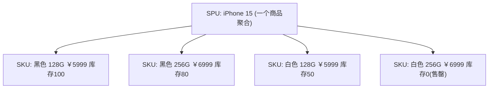
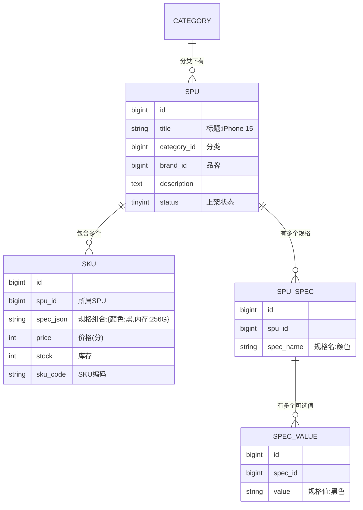
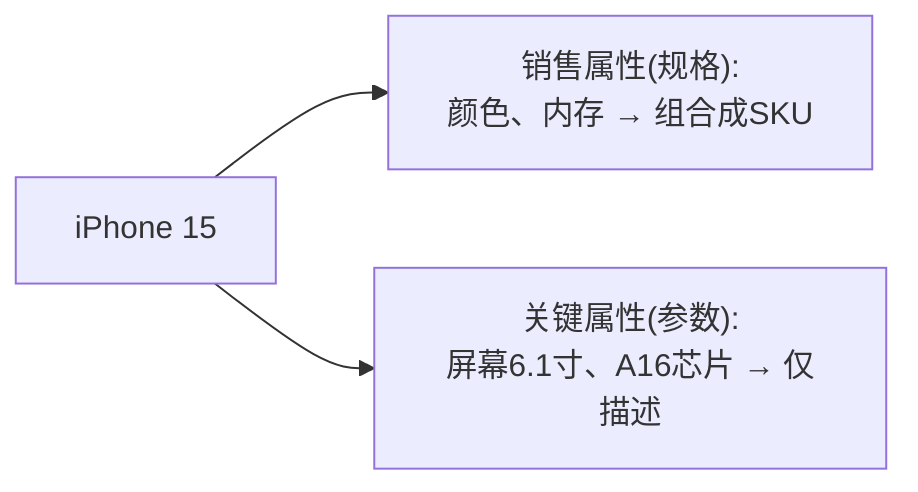
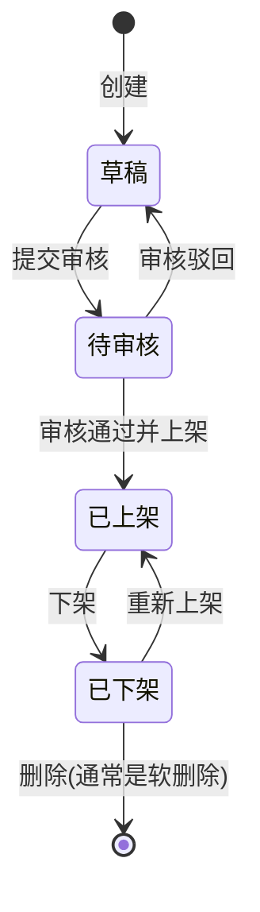
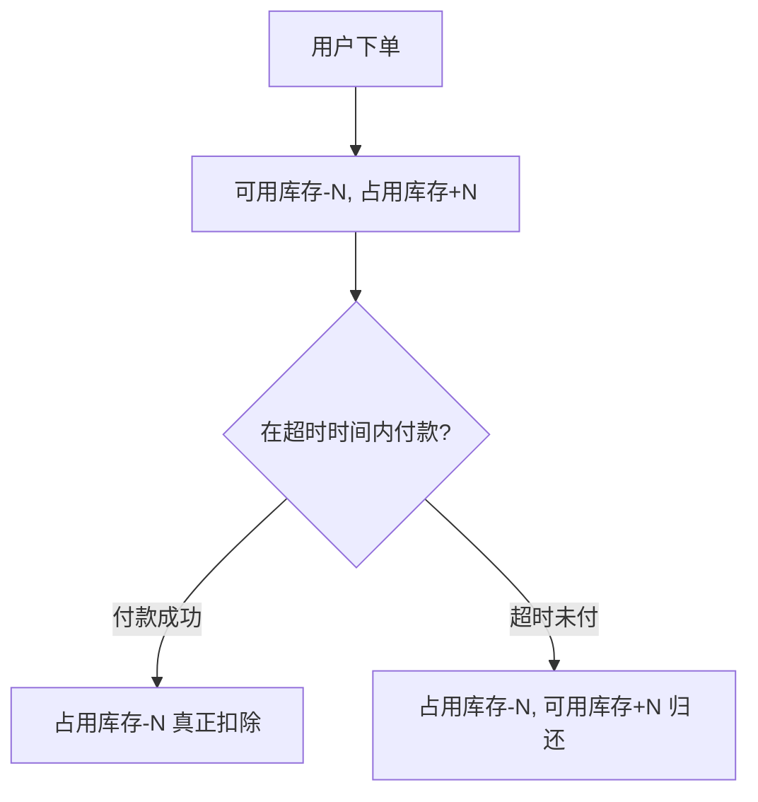
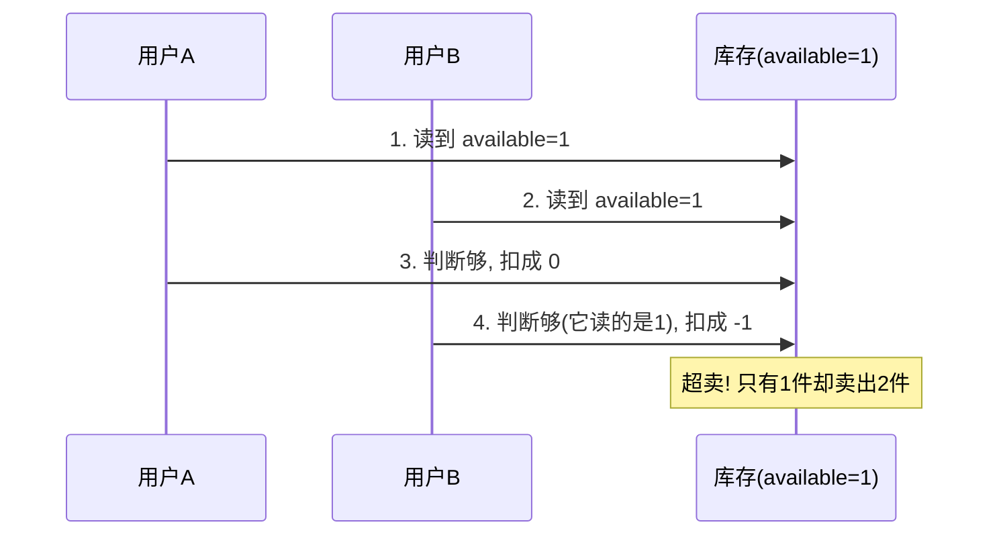
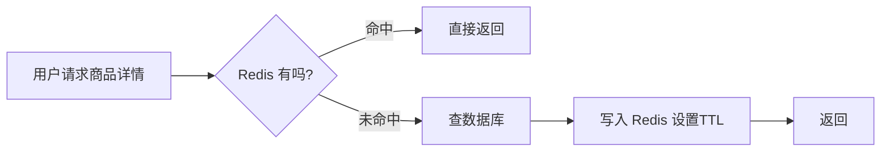
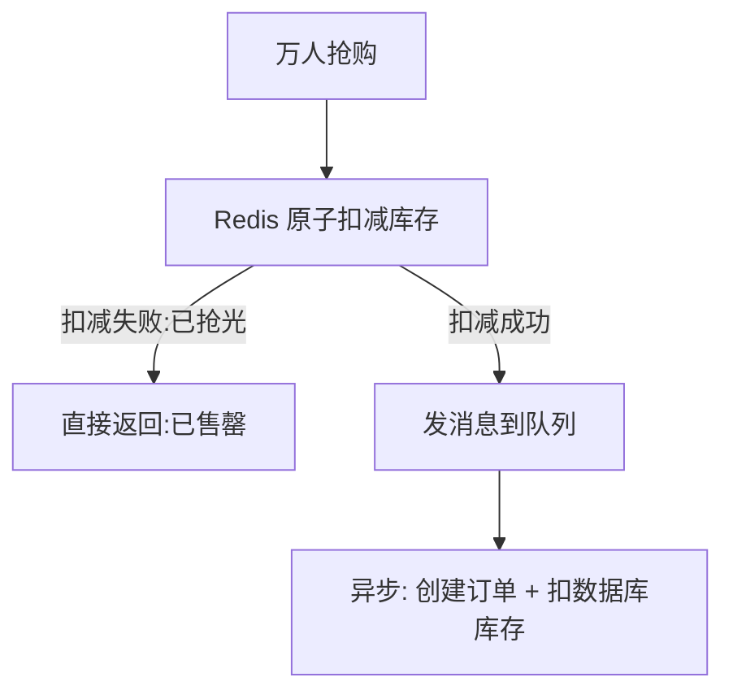
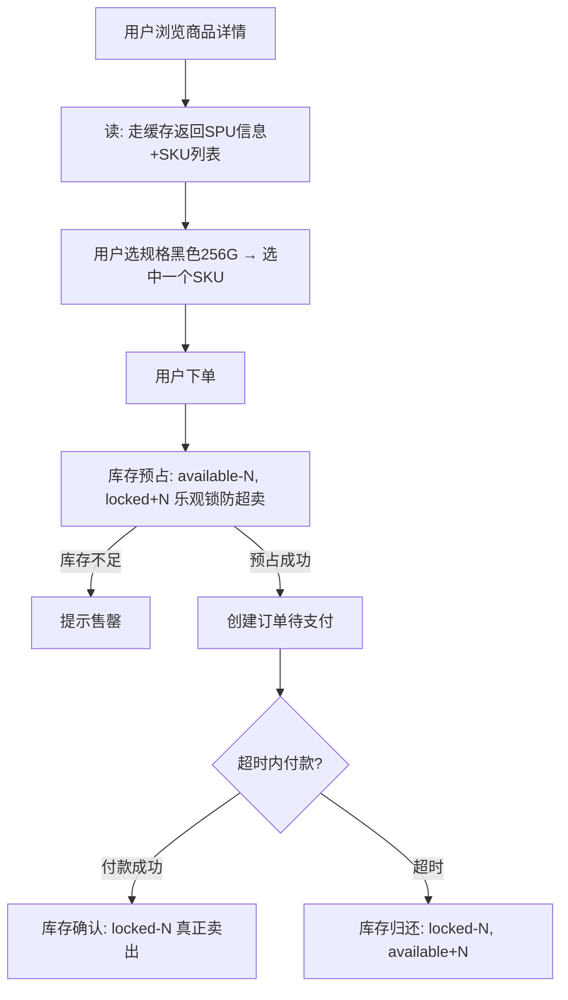

# 后端商品与库存模块完全指南：从 SPU/SKU 到库存扣减与秒杀

商品和库存是电商系统的基石——没有商品就没有可卖的东西，没有库存管理就会超卖或积压。这块业务看起来简单（"不就是商品的增删改查吗"），但真正做起来，你会遇到一连串让新手措手不及的问题：

> "iPhone 有黑色、白色，128G、256G，这些在数据库里怎么存？" "库存是什么时候扣的，下单就扣还是付款才扣？" "商品详情页一秒几万次访问，数据库扛得住吗？" "秒杀怎么保证不超卖？"

这篇文章的目标很明确：**让一个从没接触过商品/库存业务的后端开发者，看完能独立负责这块业务。** 所以我会从最基础的概念讲起，覆盖数据模型、并发、缓存、秒杀，尽量不留盲区。

:::note
代码以 Node.js 风格 + SQL 演示，重在讲清逻辑和数据结构，换成任何语言思路一致。文中的表结构是简化的教学版本，真实项目会更复杂（分库分表、字段更多），但核心模型是一样的。
:::

---

## 一、模块全景：商品/库存到底管什么

先建立全局视角。这块业务通常分成两大部分：

**商品侧（偏"读",给用户看）**
- 商品的基本信息（标题、图片、描述、价格）
- 商品的多规格（颜色、尺寸等）
- 商品分类、品牌、属性参数
- 商品的上架/下架/审核状态
- 商品的搜索与列表展示

**库存侧（偏"写",要精准）**
- 每个可售单元有多少货
- 下单时怎么扣、什么时候扣
- 高并发下怎么防超卖
- 库存的占用、冻结、归还
- 补货、盘点

商品侧的核心挑战是**读性能**（海量用户浏览），库存侧的核心挑战是**并发一致性**（不能超卖）。这两条主线贯穿全文。

---

## 二、最重要的概念：SPU 和 SKU

这是整个模块的地基，也是新手最容易懵的地方。**不理解 SPU/SKU，后面的数据模型全都无从谈起。** 请务必看透这一节。

### 2.1 用一个例子建立直觉

你在电商 App 上看到一个商品页："iPhone 15"。这个页面就是一个 **SPU**。

但你不能直接买"iPhone 15",你得选：什么颜色？多大内存？当你选定"**黑色 + 256G**"后，加入购物车的那个具体的、有确定价格和库存的东西，就是一个 **SKU**。



### 2.2 准确的定义

- **SPU（Standard Product Unit，标准产品单元）**：商品的**聚合**，代表"一款商品"。它承载所有规格共享的信息：标题、主图、描述、品牌、分类。用户浏览、搜索看到的是 SPU。
- **SKU（Stock Keeping Unit，库存量单位）**：**最小的、可购买、可管理库存的单元**。它是某个 SPU 在具体规格组合下的实例。**价格和库存是挂在 SKU 上的，不是 SPU 上的。**

:::important
记住这句话就抓住了核心：**用户"看"的是 SPU，"买"的是 SKU；价格和库存永远属于 SKU。** 因为黑色 256G 和白色 128G 的价格、库存都不一样，它们必须是独立的 SKU 各自记录。
:::

### 2.3 规格是怎么组合出 SKU 的

SKU 是由多个**规格（销售属性）**组合而成的。比如：

- 规格"颜色"：黑色、白色
- 规格"内存"：128G、256G

这两个规格**笛卡尔积**（两两组合）就得到 4 个 SKU：黑色128G、黑色256G、白色128G、白色256G。这就是商品详情页那个"选规格"的交互背后的数据逻辑。

---

## 三、商品数据模型

有了 SPU/SKU 的概念，就能设计表了。一个基础的商品模型至少需要这几张表：



各表职责：

- **spu**：商品主表，一款商品一条记录，存共享信息。
- **sku**：库存单元表，一个规格组合一条记录，**价格和库存在这里**。
- **spu_spec / spec_value**：描述这个 SPU 有哪些规格、每个规格有哪些可选值，用来渲染"选规格"的界面。
- **category**：分类。

:::tip
SKU 的规格组合怎么存？教学阶段可以像上面用一个 `spec_json` 字段存 `{"颜色":"黑色","内存":"256G"}`，简单直观。规模大、需要按规格筛选时，会用专门的关联表（sku 和 spec_value 的多对多）来存，便于查询。先理解简单方案即可。
:::

---

## 四、商品分类与属性

### 4.1 分类：通常是一棵树

商品分类一般是多级的：`电子产品 > 手机 > 智能手机`。用一张自关联的表实现树结构：

```sql
CREATE TABLE category (
  id BIGINT PRIMARY KEY,
  name VARCHAR(50),
  parent_id BIGINT,  -- 父分类 id，顶级分类为 0
  level TINYINT,     -- 层级
  sort INT           -- 同级排序
);
```

每条记录用 `parent_id` 指向父分类，顶级分类的 `parent_id` 为 0。这样就能表达任意层级的分类树。

### 4.2 属性：区分"销售属性"和"关键属性"

新手常把这两种属性搞混，它们用途完全不同：

- **销售属性（规格）**：会影响 SKU、影响用户购买选择的属性。如颜色、内存。**它们组合成 SKU。**
- **关键属性（参数）**：只用于描述和筛选、**不影响 SKU** 的属性。如"屏幕尺寸 6.1 英寸""处理器 A16"。同一个 SPU 的所有 SKU 共享这些参数。



区分它们的意义：销售属性要参与 SKU 组合和库存管理，关键属性只是展示和搜索筛选用的标签。

---

## 五、商品的状态与生命周期

商品不是建好就一直在卖，它有状态流转（又一个状态机）：



要点：

- **上架/下架**是最常用的状态，只有"已上架"的商品用户才能看到、才能买。
- **删除通常用"软删除"**（标记 `is_deleted=1`）而不是真删——因为历史订单还关联着这个商品，物理删除会导致订单查不到商品信息。

:::warning
初学者常直接 `DELETE` 商品记录，这会导致已产生的订单详情页里商品信息丢失、报表出错。**电商里的商品几乎从不物理删除，一律软删除。**
:::

---

## 六、库存模型：不只是一个数字

到这里进入库存侧。新手以为库存就是 SKU 表里的一个 `stock` 字段，其实真实的库存要区分几种状态。

### 6.1 可用库存 vs 占用库存

设想：商品有 100 件，有个用户下单了 3 件但还没付款。这 3 件应该怎么算？

- 如果还算"可用",可能被别人重复买走 → 超卖风险。
- 所以要引入"占用"的概念。

于是库存拆成：

- **可用库存（available）**：真正还能被下单的数量。
- **占用/冻结库存（locked）**：已经被下单锁定、但还没最终扣除的数量。

```
总库存 = 可用库存 + 占用库存
下单时：可用库存 -3，占用库存 +3
付款成功：占用库存 -3（真正卖出）
取消/超时：占用库存 -3，可用库存 +3（归还）
```

```sql
CREATE TABLE sku_stock (
  sku_id BIGINT PRIMARY KEY,
  available INT,  -- 可用库存
  locked INT      -- 占用(冻结)库存
);
```

这个"可用 + 占用"的模型是库存管理的核心，理解它，下一节的"扣减时机"就顺理成成章了。

---

## 七、库存扣减时机：一个重要的业务决策

**什么时候扣库存？** 这是库存业务里最关键的一个决策，直接影响超卖和用户体验。有两种主流策略，各有取舍。

### 7.1 方案 A：下单减库存（拍下即扣）

用户一提交订单就扣减可用库存。

- **优点**：不会超卖。下了单就一定有货。
- **缺点**：可能被"占用"——有人拍下不付款，库存被占着，真正想买的人买不到（**少卖**）。恶意用户还能靠疯狂下单不付款把库存占光。

### 7.2 方案 B：付款减库存（付了钱才扣）

下单时不扣，等支付成功才扣减库存。

- **优点**：不会因为占用导致少卖。
- **缺点**：可能**超卖**——100 件货，可能有 200 人都下了单，最后大家都去付款，就超卖了。

### 7.3 主流做法：下单预占 + 超时释放

实际生产中，最常用的是**结合"占用库存"模型的下单预占**：



这就把订单模块的"超时关单归还库存"和库存的"占用"模型串起来了：

- 下单：从**可用**扣，加到**占用**（预占，不会超卖）。
- 付款：从**占用**里真正扣掉。
- 超时未付：把**占用**还回**可用**（解决少卖）。

:::important
**这套"下单预占可用库存、超时归还"的机制，是电商库存的标准做法**，兼顾了"不超卖"和"减少恶意占用导致的少卖"。这也解释了为什么[订单模块](/posts/architecture/order-module-complete-guide)里要做超时关单——它就是为了归还这里被占用的库存。
:::

---

## 八、库存扣减的并发安全：防超卖

知道了"什么时候扣",还要保证"扣的时候不出错"。多个用户同时买最后一件，绝不能都成功。这是库存业务的核心技术难题。

### 8.1 超卖是怎么发生的

问题的根源在于"读库存"和"扣库存"是两步，中间可能被插入：



### 8.2 正确做法：把"判断"和"扣减"合并成一条原子 SQL

不要先查再扣，而是把"库存必须足够"作为更新条件写进 SQL，靠数据库的行锁保证原子性：

```sql
-- 关键：WHERE 带上 available >= 数量。判断和扣减在一条语句里完成
UPDATE sku_stock
SET available = available - #{num}, locked = locked + #{num}
WHERE sku_id = #{skuId} AND available >= #{num};
```

```js
async function lockStock(skuId, num) {
  const affected = await db.query(
    `UPDATE sku_stock
     SET available = available - ?, locked = locked + ?
     WHERE sku_id = ? AND available >= ?`,
    [num, num, skuId, num]
  );
  // affected 为 0，说明可用库存不足，预占失败
  if (affected === 0) {
    throw new Error('库存不足');
  }
}
```

两个并发请求执行这条 SQL 时，数据库会让它们**排队**（行锁）。第二个执行时 `available >= num` 已不成立，`affected` 返回 0，预占失败。超卖被从根本上杜绝。这就是**乐观锁**思路，是防超卖最常用、最简单的方案。

### 8.3 完整的库存流转代码

把"预占、确认扣减、归还"三个动作写全，这就是库存服务的核心：

```js
// 可运行
// 模拟 SKU 库存的完整流转：预占 → 确认扣减 / 归还
const stock = { available: 2, locked: 0 }; // 只剩 2 件

// 下单预占：可用 -> 占用（带库存校验，防超卖）
function lock(num) {
  if (stock.available < num) return false; // 相当于 SQL 的 WHERE available>=num
  stock.available -= num;
  stock.locked += num;
  return true;
}

// 付款成功：真正扣除占用的库存
function confirm(num) {
  stock.locked -= num;
}

// 超时/取消：把占用还回可用
function release(num) {
  stock.locked -= num;
  stock.available += num;
}

console.log('初始:', stock);                       // available:2 locked:0
console.log('用户A下单2件:', lock(2), stock);       // true, available:0 locked:2
console.log('用户B下单1件:', lock(1), stock);       // false(库存不足), 不超卖!

confirm(2); // 用户A付款成功
console.log('A付款后:', stock);                     // available:0 locked:0 (真正卖出2件)
```

### 8.4 需要更高并发时

如果是普通商品，上面的乐观锁足够了。当遇到**秒杀级**的超高并发（瞬间上万请求抢同一个 SKU），数据库单行会成为瓶颈，需要用 Redis 预扣减等方案，见第十一节。库存扣减的并发方案（乐观锁/悲观锁/Redis）在[订单模块指南](/posts/architecture/order-module-complete-guide)里也有对比，可以对照看。

---

## 九、商品详情的读性能：缓存架构

前面都在讲"写"（库存），现在讲商品侧的核心挑战——"读"。一个热门商品详情页，一秒可能有几万次访问。如果每次都查数据库，数据库瞬间就被打垮。解决办法是**缓存**。

### 9.1 商品详情缓存

商品信息**读多写少**（浏览量巨大，但改价改描述很少），是缓存的完美场景。用 Cache Aside 模式：



```js
async function getProductDetail(spuId) {
  const cacheKey = `product:detail:${spuId}`;
  const cached = await redis.get(cacheKey);
  if (cached) return JSON.parse(cached); // 命中缓存

  const detail = await db.loadProductDetail(spuId); // 未命中，查库
  // 回填缓存，TTL 加随机值防雪崩
  await redis.set(cacheKey, JSON.stringify(detail), 'EX', 3600 + Math.random() * 300);
  return detail;
}

// 商品信息更新时，要删除缓存（先更库，再删缓存）
async function updateProduct(spuId, data) {
  await db.updateProduct(spuId, data);
  await redis.del(`product:detail:${spuId}`);
}
```

:::tip
商品详情缓存要注意**缓存穿透、击穿、雪崩**三大问题（查不存在的商品、热点商品缓存失效、大量缓存同时过期）。这块的完整解决方案见[Redis 缓存实战](/posts/redis/redis-cache-in-depth)，这里不重复。
:::

### 9.2 库存能不能缓存？

这是个好问题。**商品信息可以放心缓存，但库存数字要谨慎缓存**，因为库存是频繁变动、要求相对准确的。

常见做法是分开处理：
- 商品的**基本信息**（标题、图片、参数）缓存，TTL 较长。
- **库存数字**要么实时查数据库，要么在秒杀场景用 Redis 作为库存的"主战场"（见下节），而不是简单当只读缓存。

---

## 十、商品搜索与列表

用户不只看单个商品，还要搜索、看列表。

- **简单列表/分类页**：普通的数据库分页查询 + 缓存即可。注意大数据量下的**深分页问题**（`LIMIT 1000000, 20` 会很慢），可以用"游标分页"（记住上一页最后一条的 id，`WHERE id > lastId`）优化。
- **全文搜索**：当商品量大、要按标题关键词模糊搜索时，用数据库的 `LIKE '%关键词%'` 性能很差（无法用索引）。这时要引入专门的**搜索引擎 Elasticsearch**，它为全文检索而生。初学阶段知道"复杂搜索用 ES,不要用 LIKE 硬扛"即可。

---

## 十一、秒杀场景：库存的终极考验

普通商品用数据库乐观锁就够了。但**秒杀**（限时抢购，瞬间海量请求砸向同一个 SKU）是另一个量级，直接打数据库必然崩溃。

### 11.1 核心思路：Redis 挡在数据库前面

把库存**预热到 Redis**，用 Redis 的原子操作扣减，挡住 99% 的无效请求，只让"抢到"的少量请求走后续流程：



### 11.2 用 Lua 保证 Redis 扣减的原子性

```js
// Lua 脚本：判断 + 扣减 在 Redis 中原子执行（不会超卖）
const seckillLua = `
  local stock = tonumber(redis.call('GET', KEYS[1]) or '0')
  if stock >= tonumber(ARGV[1]) then
    return redis.call('DECRBY', KEYS[1], ARGV[1])  -- 返回扣减后剩余
  else
    return -1  -- 库存不足
  end
`;

async function seckill(skuId, num, userId) {
  const left = await redis.eval(seckillLua, 1, `seckill:stock:${skuId}`, num);
  if (left === -1) throw new Error('已售罄');
  // 抢到了！发消息异步创建订单、扣数据库库存，让用户快速得到响应
  await mq.send('seckill_order', { skuId, num, userId });
  return { ok: true };
}
```

### 11.3 秒杀的关键要点

- **Redis 是库存的"第一道闸"**：绝大多数请求在这里就被"售罄"挡回，根本到不了数据库。
- **异步落库**：抢到的请求发消息到队列，由消费者慢慢创建订单、扣数据库库存，削峰。
- **最终一致**：Redis 和数据库库存要对得上，未支付的要归还（回补 Redis 和数据库）。
- **防超卖 + 防少卖**：Lua 原子扣减防超卖；超时归还防少卖。

:::warning
秒杀是高阶场景，复杂度很高（还涉及限流、防刷、热点隔离）。作为初学者，**先把普通商品的乐观锁库存做扎实**，秒杀等有了基础再深入。不要一上来就挑战秒杀。
:::

---

## 十二、完整示例：一次下单涉及的商品/库存动作

把前面的知识串成一次真实下单流程中商品/库存侧发生的事：



各知识点的落点：
- **SPU/SKU** → 用户看 SPU、买 SKU，库存挂在 SKU 上
- **缓存** → 商品详情读多写少，用 Redis 抗流量
- **可用/占用库存** → 下单预占、付款确认、超时归还
- **乐观锁** → 预占时防超卖
- **Redis 预扣** → 秒杀场景挡流量

---

## 十三、常见问题

::: details SPU 和 SKU 到底怎么区分？
一句话：用户浏览时看到的商品页是 SPU（如"iPhone 15"），选完规格后能加购物车、有确定价格和库存的那个具体单元是 SKU（如"iPhone 15 黑色 256G"）。价格和库存永远挂在 SKU 上。
:::

::: details 库存到底该下单扣还是付款扣？
主流做法是"下单预占 + 超时释放":下单时从可用库存扣、加到占用库存（不超卖），付款成功再真正扣除占用，超时未付则把占用还回可用（防少卖）。这套机制兼顾了两者的优点。
:::

::: details 为什么不能先查库存再扣减？
因为"查"和"扣"两步之间，其他请求可能插进来，导致多个请求都以为库存够而重复扣减，造成超卖。正确做法是把判断写进更新条件（`WHERE available >= num`），让判断和扣减在一条原子 SQL 里完成。
:::

::: details 商品能直接从数据库删除吗？
不能。历史订单还关联着商品信息，物理删除会导致订单详情、报表出错。电商里的商品一律用软删除（标记删除位），不物理删除。
:::

::: details 库存可以像商品信息一样缓存吗？
要谨慎。商品基本信息读多写少，适合缓存。但库存频繁变动且要求准确，不适合简单当只读缓存——普通场景实时查库，秒杀场景用 Redis 作为库存主战场配合异步落库，而不是当缓存用。
:::

::: details 我该用什么做商品搜索？
简单的分类筛选、按字段查询用数据库即可（注意深分页优化）。需要按标题关键词做全文模糊搜索时，用 Elasticsearch，不要用 `LIKE '%x%'` 硬扛，那样无法走索引、性能极差。
:::

---

## 小结

商品/库存模块有两条主线：**商品侧拼读性能，库存侧拼并发一致性。** 看完这篇，你应该已经掌握了独立负责这块业务所需的核心知识：

1. **SPU/SKU**：地基中的地基。用户看 SPU、买 SKU，价格和库存挂在 SKU 上。
2. **数据模型**：spu / sku / 规格 / 分类 几张表，区分销售属性（组合成 SKU）和关键属性（仅描述）。
3. **商品状态机**：上架/下架流转，商品用软删除。
4. **库存模型**：不是一个数字，要区分可用库存和占用库存。
5. **扣减时机**：主流是"下单预占 + 超时归还",兼顾防超卖与防少卖。
6. **并发防超卖**：把判断和扣减合并成一条原子 SQL（乐观锁）。
7. **缓存架构**：商品详情读多写少，用 Redis 抗流量；库存要谨慎缓存。
8. **秒杀**：Redis 预扣挡流量 + 异步落库，高阶场景循序渐进。

建议动手做一遍：先建 SPU/SKU 数据模型，实现商品的增删改查和上下架，再实现"可用/占用"库存的预占-确认-归还，最后加上商品详情缓存。这块和[订单模块](/posts/architecture/order-module-complete-guide)、[支付模块](/posts/architecture/payment-module-complete-guide)紧密协作，一起构成了电商交易的核心链路。想系统规划学习路径，可参考[后端学习路线图](/posts/architecture/backend-developer-learning-roadmap)。
