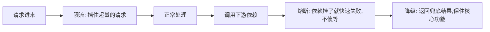
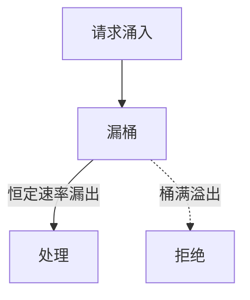
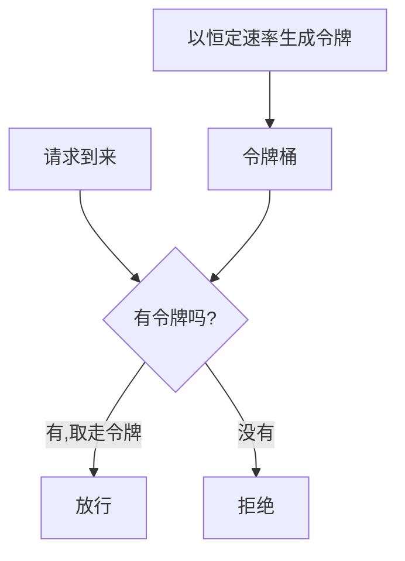
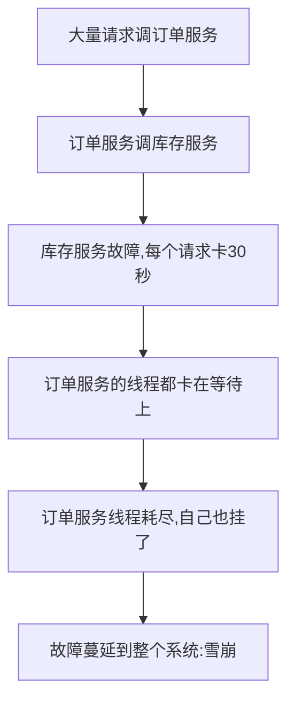
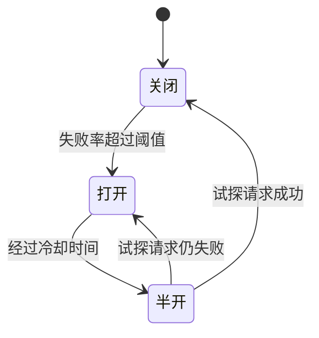
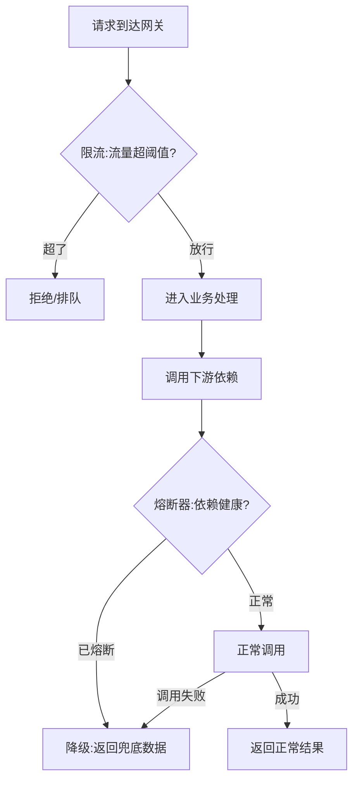

# 后端稳定性三板斧：限流、熔断与降级完全指南

系统正常时岁月静好，但真正考验后端功力的是异常时刻：

> 秒杀瞬间涌入百万请求把服务压垮；依赖的第三方接口挂了，请求全卡在那里，把自己也拖死；一个非核心的推荐服务故障，导致整个下单页面打不开……

应对这些情况，后端有三件保命的武器：**限流、熔断、降级**。它们常被并称为"稳定性三板斧"，但初学者几乎都会把它们搞混。这篇文章先帮你彻底分清三者，再逐一讲透原理和实现。

:::note
代码以 Node.js 风格演示，重在讲清算法和思路。这三个模式是跨语言、跨框架通用的（Sentinel、Hystrix、Resilience4j 等框架都是这些思想的封装）。
:::

---

## 一、先分清三者：它们各解决什么问题

这是最关键的一步。三者作用点和目的完全不同，用一个"餐厅"的类比最好理解：

| 概念 | 解决什么 | 餐厅类比 |
|------|---------|---------|
| **限流** | 入口流量太大，超过系统能力 | 餐厅满座，门口挂"稍等",控制进店人数 |
| **熔断** | 依赖的下游服务故障，别再徒劳调用 | 某个菜的供应商断货了，直接不接这道菜的单 |
| **降级** | 资源不够时，牺牲非核心保核心 | 高峰期停掉复杂菜品，只保证主食快速出餐 |



一句话记忆：

> **限流**是"控制进来的量"（对入口），**熔断**是"切断坏掉的依赖"（对下游），**降级**是"保住最重要的"（对自己的功能取舍）。

三者经常配合使用，但目的各异。下面分别详解。

---

## 二、限流：控制入口流量

限流的目的：**保护系统不被超过其处理能力的流量冲垮。** 超出阈值的请求被拒绝或排队，宁可拒绝一部分，也不让系统整个崩溃。

限流有四种经典算法，从简单到精确。

### 2.1 固定窗口计数

把时间切成固定窗口（如每 1 秒），每个窗口内计数，超过阈值就拒绝。

```js
// 每秒最多 100 次
let count = 0;
let windowStart = Date.now();

function fixedWindow() {
  const now = Date.now();
  if (now - windowStart >= 1000) { // 进入新窗口，重置
    count = 0;
    windowStart = now;
  }
  if (count < 100) { count++; return true; }
  return false; // 超限，拒绝
}
```

- 优点：简单。
- 缺点：**临界突刺问题**——如果在第 1 秒的最后 100ms 来了 100 个，第 2 秒的前 100ms 又来 100 个，这 200ms 内其实通过了 200 个，超过了预期。

### 2.2 滑动窗口

把大窗口切成多个小格子，随时间平滑移动，统计的是"最近 1 秒"而非"固定的这 1 秒",解决了临界突刺。前面[Redis 练习题](/posts/redis/redis-exercises-with-answers)里用 ZSet 实现的就是滑动窗口。

### 2.3 漏桶算法（Leaky Bucket）

请求像水一样进入一个"桶",桶以**恒定速率**漏出（处理）。桶满了就溢出（拒绝）。



特点：**强制平滑输出**，无论进来多快，出去的速率恒定。适合需要匀速处理的场景，但应对突发流量不灵活（即使系统有余力也不会加速）。

### 2.4 令牌桶算法（Token Bucket，最常用）

系统以**恒定速率**往桶里放令牌，请求来了先取一个令牌，取到才放行，取不到就拒绝。



关键优势：桶里可以**积攒**令牌，所以能**应对一定的突发流量**（攒了 100 个令牌，突然来 100 个请求也能一次放行）。这个"平时匀速、允许突发"的特性最符合真实业务，所以令牌桶是**最常用**的限流算法。

```js
// 可运行
// 令牌桶限流演示
class TokenBucket {
  constructor(capacity, refillPerSec) {
    this.capacity = capacity;      // 桶容量
    this.tokens = capacity;        // 当前令牌数
    this.refillPerSec = refillPerSec; // 每秒补充速率
    this.lastRefill = Date.now();
  }
  tryAcquire() {
    // 先按经过的时间补充令牌
    const now = Date.now();
    const elapsed = (now - this.lastRefill) / 1000;
    this.tokens = Math.min(this.capacity, this.tokens + elapsed * this.refillPerSec);
    this.lastRefill = now;
    // 尝试取一个令牌
    if (this.tokens >= 1) {
      this.tokens -= 1;
      return true;
    }
    return false;
  }
}

// 容量5、每秒补2个：初始能应对5个突发，之后每秒放行2个
const bucket = new TokenBucket(5, 2);
let passed = 0, rejected = 0;
for (let i = 0; i < 8; i++) {
  bucket.tryAcquire() ? passed++ : rejected++;
}
console.log(`瞬间来8个请求 → 放行${passed}个(桶里5个令牌), 拒绝${rejected}个`);
```

### 2.5 分布式限流

上面都是单机限流（限的是单个实例）。多实例时，要限制"整个集群"的总流量，就需要**分布式限流**——把计数放到共享的 Redis 里，用 Lua 脚本保证原子性：

```js
// Redis + Lua 实现分布式限流（原子的"取令牌"）
const rateLimitLua = `
  local current = tonumber(redis.call('GET', KEYS[1]) or '0')
  if current >= tonumber(ARGV[1]) then
    return 0  -- 超限
  end
  redis.call('INCR', KEYS[1])
  redis.call('EXPIRE', KEYS[1], ARGV[2])
  return 1    -- 放行
`;
```

:::tip
限流可以做在多个层次：网关层（Nginx/API 网关，最前置）、应用层（代码里）、甚至是接口级。**越前置的限流越能保护后面的一切**，所以网关限流是第一道防线。
:::

---

## 三、熔断：切断故障的依赖

### 3.1 雪崩问题：为什么需要熔断

设想你的订单服务要调用"库存服务"。突然库存服务故障了，每个调用都要等 30 秒超时才失败。这时会发生什么？



一个下游服务的故障，通过"调用方傻等"层层传导，最终拖垮整个系统。这就是**服务雪崩**。

**熔断器（Circuit Breaker）** 就是为了阻断这种传导：当发现某个依赖持续失败时，**直接快速失败，不再徒劳地调用它**，等它恢复了再放行。就像电路的保险丝——电流过大就断开，保护整个电路。

### 3.2 熔断器的三种状态

熔断器是一个状态机，有三个状态：



- **关闭（Closed）**：正常状态，请求正常通过。同时统计失败率。
- **打开（Open）**：当失败率超过阈值（如 10 秒内 50% 失败），熔断器"跳闸"。此后所有请求**直接快速失败**，不再调用下游，避免傻等。
- **半开（Half-Open）**：打开一段时间（冷却期）后，进入半开，**放少量试探请求**过去。如果成功，说明下游恢复了，切回关闭；如果还失败，继续打开。

### 3.3 熔断器代码骨架

```js
class CircuitBreaker {
  constructor() {
    this.state = 'CLOSED';
    this.failures = 0;
    this.threshold = 5;        // 连续失败 5 次就熔断
    this.cooldown = 10000;     // 打开后 10 秒进入半开
    this.openedAt = 0;
  }

  async call(fn) {
    // 打开状态：检查是否到了冷却期
    if (this.state === 'OPEN') {
      if (Date.now() - this.openedAt > this.cooldown) {
        this.state = 'HALF_OPEN'; // 进入半开，允许试探
      } else {
        throw new Error('熔断中，快速失败'); // 直接失败，不调用下游
      }
    }

    try {
      const result = await fn();      // 调用下游
      this.onSuccess();
      return result;
    } catch (err) {
      this.onFailure();
      throw err;
    }
  }

  onSuccess() {
    this.failures = 0;
    this.state = 'CLOSED'; // 成功则恢复
  }

  onFailure() {
    this.failures++;
    if (this.failures >= this.threshold) {
      this.state = 'OPEN';       // 失败够多，跳闸
      this.openedAt = Date.now();
    }
  }
}
```

生产中一般直接用成熟框架（Sentinel、Resilience4j、opossum 等），它们把这套逻辑和监控都封装好了。

---

## 四、降级：牺牲非核心，保住核心

### 4.1 什么是降级

**降级**是指在系统资源紧张或部分功能故障时，**主动放弃或简化非核心功能，把有限的资源留给核心功能**，保证核心链路可用。

典型场景：
- 双十一高峰期，暂时关闭"商品评价""个性化推荐"等非核心功能，全力保障"下单、支付"。
- 推荐服务挂了，商品详情页就**返回一个默认的热门商品列表**（兜底数据），而不是让整个页面报错。

### 4.2 降级和熔断的关系

初学者常把降级和熔断混为一谈。它们紧密配合但不同：

- **熔断**是"手段"：检测到依赖故障，切断调用。
- **降级**是"熔断后的善后"：切断后返回什么？返回一个兜底结果（默认值、缓存的旧数据、友好提示），这就是降级。

```js
// 熔断 + 降级配合：调用失败时返回兜底数据
async function getRecommendations(userId) {
  try {
    return await breaker.call(() => recommendService.get(userId));
  } catch (err) {
    // 熔断或失败了 → 降级：返回默认的热门商品，而不是报错
    return getDefaultHotProducts();
  }
}
```

### 4.3 降级的两种触发方式

- **自动降级**：由熔断器、超时、异常等自动触发（如上面代码）。
- **手动降级**：运营/开发通过开关（配置中心）手动关闭某些功能。大促前提前准备好降级开关，出问题一键降级，是常见的稳定性预案。

:::important
降级的核心是**想清楚"什么是核心，什么可以牺牲"**。下单支付是核心，绝不能降级；推荐、评价、广告是非核心，紧急时可以牺牲。这个优先级要在设计时就明确。
:::

---

## 五、三者如何协同

在一次真实请求里，三板斧往往一起上阵：



- **限流**在最前面挡住过量流量（防止自己被压垮）。
- **熔断**在调用下游时监控依赖健康（防止被下游拖垮）。
- **降级**在熔断或失败后提供兜底（保证核心功能可用）。

三者共同构成系统的"自我保护"能力，让系统在异常情况下**优雅地部分可用**，而不是彻底崩溃。

---

## 六、常见问题

::: details 限流、熔断、降级到底怎么区分？
限流控制"进来的流量"（保护自己不被冲垮）；熔断切断"故障的下游依赖"（防止被下游拖死）；降级是"牺牲非核心功能保核心"（资源不够时的取舍）。作用点分别是入口、下游、自身功能。
:::

::: details 令牌桶和漏桶有什么区别，用哪个？
漏桶强制恒定速率输出，不允许突发；令牌桶因为能积攒令牌，允许一定的突发流量。真实业务通常有突发但又要限总量，所以令牌桶更常用。
:::

::: details 熔断器为什么要有"半开"状态？
如果没有半开，熔断打开后就一直不敢再试，无法知道下游何时恢复。半开状态放少量试探请求，成功就恢复正常、失败就继续熔断，让系统能自动探测下游是否康复。
:::

::: details 降级返回的兜底数据从哪来？
可以是预设的默认值（如默认推荐列表）、缓存里的旧数据、或一个友好的提示。关键是让核心流程能继续走下去，而不是因为一个非核心依赖失败就整体报错。
:::

::: details 这些要自己写吗？
原理要懂，但生产中一般用成熟框架：限流熔断降级有 Sentinel、Hystrix（已停更）、Resilience4j、opossum 等，网关层限流用 Nginx/API 网关。自己写主要是为了理解原理。
:::

---

## 小结

限流、熔断、降级是后端系统的"自我保护"能力，回顾主线：

1. **三者区别**：限流控入口流量、熔断断故障依赖、降级保核心功能。
2. **限流**：固定窗口/滑动窗口/漏桶/令牌桶四种算法，令牌桶最常用；多实例用 Redis 分布式限流；越前置越好。
3. **熔断**：应对服务雪崩，熔断器三态（关闭/打开/半开）自动探测下游健康。
4. **降级**：熔断/失败后返回兜底数据，牺牲非核心保核心，支持自动和手动。
5. **协同**：三者在一次请求里配合，让系统异常时优雅地部分可用而非彻底崩溃。

这套能力是[高并发/高可用架构](/posts/architecture/deploy-50000-qps-system)的基础，也是[后端学习路线图](/posts/architecture/backend-developer-learning-roadmap)里进阶阶段的重要一环。建议在理解了数据库、缓存、消息队列等基础后再深入这块。
