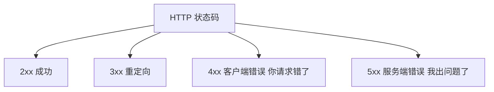
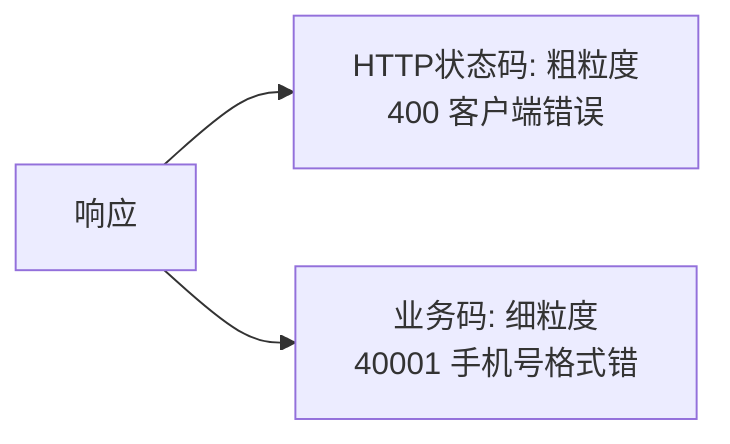
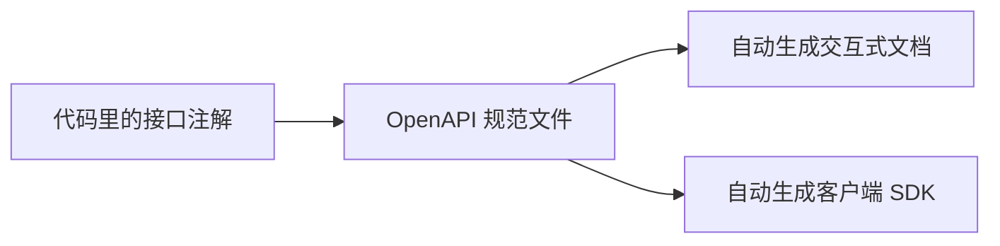

# RESTful API 设计完全指南：从资源建模到状态码、错误处理与版本管理

后端写的每一个功能，最终都要通过 **API（接口）** 暴露给前端、App 或其他服务调用。API 就是后端的"门面"——它设计得好不好，直接决定了对接方用得爽不爽、系统好不好维护。

但 API 又是最容易做烂的地方。很多初学者的接口是这样的：

> `POST /getUserList`、`POST /deleteUser?id=1`、成功返回 `{data}`、失败有时返回 `{error}` 有时直接报 500、状态码永远是 200……

这种接口能用，但对接方每次都要猜"这个接口怎么调、返回什么、出错了怎么判断"，协作成本极高。这篇文章会讲清楚怎么设计一套**一致、可预测、好用**的 API。

:::note
本文以目前最主流的 **RESTful 风格 + JSON** 为主线（也是绝大多数 Web API 的选择）。代码示例用 Node.js 风格，规范本身跨语言通用。文末也会简单提及 REST 之外的选择。
:::

---

## 一、什么是"好的 API"

在讲具体规范前，先立一个标准。判断一个 API 好不好，就看三点：

- **直观**：光看接口名和 URL，就能猜到它是干什么的。
- **一致**：所有接口遵循同一套规则（命名、响应结构、错误处理都统一）。
- **可预测**：对接方不看你的代码，光看文档就知道怎么调、会返回什么。

:::important
一句话总结好 API 的标准：**让对接方"不看你的代码"就能正确使用。** 后面所有规范，本质上都是为这个目标服务的。
:::

---

## 二、RESTful 的核心：把一切看作"资源"

REST 是目前最主流的 API 设计风格。理解它只需抓住一个核心思想：

> **把系统里的一切都看作"资源（Resource）"，用 URL 定位资源，用 HTTP 方法表达对资源的操作。**

### 2.1 URL 表示资源，用名词不用动词

初学者最常犯的错，是把"动作"放进 URL：

```
❌ POST /getUserList        （getUserList 是动作）
❌ POST /createUser
❌ POST /deleteUser?id=1
❌ POST /updateUserName
```

RESTful 的做法是：**URL 只表示"资源"（用名词），"做什么操作"交给 HTTP 方法表达：**

```
✅ GET    /users        获取用户列表
✅ POST   /users        创建用户
✅ GET    /users/1      获取 id=1 的用户
✅ PUT    /users/1      更新 id=1 的用户
✅ DELETE /users/1      删除 id=1 的用户
```

注意资源名用**复数**（`/users` 而非 `/user`），这是通行约定。

### 2.2 HTTP 方法的语义

REST 用 HTTP 方法（也叫动词）表达操作意图，每个方法有明确语义：

| 方法 | 语义 | 例子 |
|------|------|------|
| **GET** | 查询（获取资源） | `GET /orders` 查订单列表 |
| **POST** | 创建（新增资源） | `POST /orders` 下单 |
| **PUT** | 全量更新 | `PUT /users/1` 更新整个用户 |
| **PATCH** | 部分更新 | `PATCH /users/1` 只改某几个字段 |
| **DELETE** | 删除 | `DELETE /orders/1` 删订单 |

### 2.3 嵌套资源表达从属关系

当资源之间有从属关系时，用嵌套 URL 表达：

```
GET /users/1/orders        获取用户 1 的所有订单
GET /orders/100/items      获取订单 100 的所有商品项
```

:::tip
但嵌套不要太深，一般不超过两层。`/a/1/b/2/c/3` 这种超深嵌套很难用，超过两层时考虑用查询参数（如 `GET /items?orderId=100`）代替。
:::

---

## 三、HTTP 状态码：用对了对接方一眼就懂

这是初学者最容易忽视的一块——很多人所有响应都返回 200，靠响应体里的字段判断成功失败。这是反模式。**HTTP 状态码本身就是一套标准的"结果语义",应该正确使用。**

### 3.1 状态码分类

状态码按首位数字分五类，记住这个规律就不会乱用：



### 3.2 后端最常用的状态码

| 状态码 | 含义 | 什么时候用 |
|--------|------|-----------|
| **200** OK | 成功 | 查询、更新成功 |
| **201** Created | 已创建 | POST 创建资源成功 |
| **204** No Content | 成功但无内容 | 删除成功 |
| **400** Bad Request | 请求参数错误 | 参数校验不通过 |
| **401** Unauthorized | 未认证 | 没登录/token 无效 |
| **403** Forbidden | 无权限 | 登录了但没权限 |
| **404** Not Found | 资源不存在 | 查的东西不存在 |
| **409** Conflict | 冲突 | 重复创建、状态冲突 |
| **429** Too Many Requests | 请求过多 | 被限流了 |
| **500** Internal Server Error | 服务端错误 | 代码抛异常了 |

:::important
特别注意 **401 和 403 的区别**（初学者常混）：401 是"我不知道你是谁"（没认证/token 无效），403 是"我知道你是谁，但你没资格"（认证了但无权限）。这个区别在[登录模块](/posts/architecture/login-module-complete-guide)里也强调过。
:::

### 3.3 为什么不能全返回 200

如果所有响应都是 200，对接方（尤其是浏览器、监控系统、网关）就无法通过状态码快速判断结果，必须解析响应体才知道成功没成功。正确用状态码后，前端可以直接 `if (status === 401) 跳登录页`，监控可以直接统计 5xx 错误率，这些都是标准状态码带来的好处。

---

## 四、统一响应结构

同一个系统里，所有接口的返回格式必须**统一**，对接方才能用一套逻辑处理所有响应。

### 4.1 定义统一的响应体

一个常见的统一结构：

```js
// 成功
{
  "code": 0,           // 业务状态码，0 表示成功
  "message": "success",
  "data": { }          // 真正的数据
}

// 失败
{
  "code": 40001,       // 业务错误码
  "message": "手机号格式不正确", // 给人看的错误信息
  "data": null
}
```

### 4.2 业务码 vs HTTP 状态码

初学者常纠结："已经有 HTTP 状态码了，为什么还要响应体里的 `code`?" 两者分工不同：

- **HTTP 状态码**：表达**HTTP 层面**的结果（请求成功/客户端错/服务端错），粒度粗。
- **业务码（code）**：表达**具体的业务结果**，粒度细。比如同样是 400，业务码能区分"手机号格式错"(40001) 和"验证码过期"(40002)。



:::tip
用统一响应结构 + 拦截器/中间件自动包装，业务代码里只需 `return data` 或 `throw new BizError(...)`，框架自动包成统一格式，既规范又省事。
:::

---

## 五、错误处理与错误码设计

好的错误响应能让对接方快速定位问题，而不是对着一个模糊的 500 抓瞎。

### 5.1 错误响应要素

一个好的错误响应应包含：

- **合适的 HTTP 状态码**（4xx/5xx）。
- **明确的业务错误码**（便于程序判断和排查）。
- **给人看的错误信息**（便于前端提示用户）。

```js
// 一个清晰的错误响应
// HTTP 状态码 400
{
  "code": 40001,
  "message": "手机号格式不正确",
  "data": null
}
```

### 5.2 错误码设计约定

错误码通常用有规律的编号，便于分类和定位。一种常见方案是分段：

```
40001  40 表示客户端错误大类，001 是具体错误(手机号格式)
40002  验证码过期
50001  50 表示服务端错误大类，001 是具体错误(数据库连接失败)
```

:::warning
错误信息要注意**安全**：给用户看的 message 不要暴露系统内部细节（如数据库报错原文、堆栈信息、SQL 语句），这些是给攻击者的线索。内部细节记到日志里，返回给前端的只给友好提示。
:::

---

## 六、请求参数：分页、过滤、排序

列表类接口几乎都需要分页、过滤、排序，这些也有通行约定。

### 6.1 用查询参数（Query）传递

这些"如何获取列表"的条件，用 URL 的查询参数表达：

```
GET /orders?page=1&pageSize=20&status=paid&sort=-createdAt
```

- `page` / `pageSize`：分页。
- `status=paid`：按状态过滤。
- `sort=-createdAt`：按创建时间倒序（`-` 表示降序）。

### 6.2 分页响应要带总数

分页接口的响应，除了当前页数据，还要带上分页信息，前端才能渲染分页器：

```js
{
  "code": 0,
  "data": {
    "list": [ /* 当前页数据 */ ],
    "total": 158,      // 总条数
    "page": 1,
    "pageSize": 20
  }
}
```

:::tip
数据量很大时要注意**深分页问题**：`page=100000` 这种大偏移会很慢。可以改用"游标分页"（记住上一页最后一条的 id，用 `WHERE id > lastId` 继续查）。这块在[商品/库存模块](/posts/architecture/product-inventory-module-complete-guide)里也提过。
:::

### 6.3 参数校验必不可少

所有入参都要校验（类型、范围、必填），校验不通过返回 400 + 明确错误信息。**永远不要相信客户端传来的数据**——这既是健壮性也是安全要求。

```js
// 用校验库（如 Joi/zod）声明式校验
const schema = {
  phone: 'required|string|regex:^1[3-9]\\d{9}$',
  page: 'integer|min:1',
  pageSize: 'integer|min:1|max:100', // 限制上限，防止一次拉太多
};
```

---

## 七、API 版本管理

接口上线后被很多客户端使用，一旦要做**破坏性变更**（改字段名、改结构），直接改会让老客户端崩溃。所以需要**版本管理**，让新老版本共存、平滑过渡。

常见两种方式：

```
方式一：URL 里带版本（最常用、最直观）
GET /v1/users
GET /v2/users

方式二：请求头里带版本
GET /users
Header: Accept-Version: v2
```

:::important
什么算破坏性变更？**删字段、改字段名、改字段类型、改变返回结构**都是——它们会让老客户端解析出错。而**加一个新字段**通常是兼容的（老客户端忽略它即可）。做兼容变更时不用升版本，做破坏性变更时才需要。
:::

---

## 八、幂等性：哪些接口天生安全

[幂等](/posts/architecture/order-module-complete-guide)（同一请求执行多次结果一致）在 API 设计里有明确约定。HTTP 方法本身就规定了幂等性：

| 方法 | 是否幂等 | 说明 |
|------|---------|------|
| GET | 幂等 | 查询多次结果一样 |
| PUT | 幂等 | 全量更新，覆盖多次结果一样 |
| DELETE | 幂等 | 删多次，结果都是"没了" |
| **POST** | **不幂等** | 每次创建一个新资源 |

所以最需要防重的是 **POST**（创建）。前面订单、支付模块讲的"用幂等号防重复下单/回调",正是因为 POST 不幂等。设计创建类接口时，要考虑通过幂等号让它"重复调用也安全"。

---

## 九、API 文档：让接口可被理解

再好的接口，没有文档也没法协作。手写文档容易过时，主流做法是用 **OpenAPI（原 Swagger）** 规范：

- 用注解/配置描述接口，自动生成交互式文档页面。
- 对接方能在文档页面直接"试调用"接口。
- 文档和代码同步，不易过时。



:::tip
好文档要包含：接口用途、URL 和方法、请求参数（类型/必填/示例）、响应结构（含错误码）、示例。有了它，对接方才能真正做到"不看代码就会用"。
:::

---

## 十、REST 之外：了解即可

REST 不是唯一选择，了解一下其他风格有助于开阔视野：

- **GraphQL**：客户端自己声明要哪些字段，一次请求拿到刚好需要的数据，适合字段需求多变、聚合复杂的场景。
- **gRPC**：基于 HTTP/2 和 Protobuf 的高性能 RPC，多用于**服务之间**的内部调用（微服务间通信），性能好但对浏览器不友好。

初学阶段把 RESTful 用好就足够覆盖绝大多数场景，这两个等有具体需求时再了解。

---

## 十一、常见问题

::: details 为什么不能所有接口都用 POST、都返回 200？
能跑，但对接方无法通过 URL 和状态码快速理解接口。用对 HTTP 方法（GET/POST/PUT/DELETE）和状态码（2xx/4xx/5xx），对接方光看就懂、前端能按状态码分支处理、监控能统计错误率。这是协作效率和可维护性的巨大差异。
:::

::: details 有了 HTTP 状态码，为什么还要业务错误码？
状态码粒度粗（只分成功/客户端错/服务端错），业务码粒度细。同样是 400，业务码能区分"手机号格式错"和"验证码过期",让前端做精确的错误提示和处理。两者配合使用。
:::

::: details URL 里名词用单数还是复数？
通行约定用复数：`/users`、`/orders`。保持全站统一即可，最忌讳有的单数有的复数。
:::

::: details 什么时候需要给 API 升版本？
做破坏性变更时（删字段、改字段名/类型、改返回结构），这些会让老客户端崩溃。而只是新增字段这种兼容变更不用升版本。版本管理是为了新老客户端平滑过渡。
:::

::: details POST 和 PUT 都能创建，用哪个？
语义上 POST 用于"创建新资源"（服务端决定 id，不幂等），PUT 用于"把某个确定 id 的资源整体替换"（幂等）。创建新订单用 POST；用已知 id 覆盖式更新用 PUT。
:::

---

## 小结

API 设计的一切规范，都服务于一个目标：**让对接方不看代码就能正确使用**。回顾主线：

1. **RESTful 核心**：URL 表示资源（名词、复数），HTTP 方法表达操作。
2. **状态码**：2xx 成功、4xx 客户端错、5xx 服务端错，别全返回 200；分清 401 和 403。
3. **统一响应结构**：全站一致的成功/失败格式，业务码和状态码分工配合。
4. **错误处理**：合适状态码 + 业务错误码 + 友好信息，内部细节不外泄。
5. **分页过滤排序**：用查询参数，分页带总数，注意深分页和参数校验。
6. **版本管理**：破坏性变更才升版本，让新老客户端平滑过渡。
7. **幂等约定**：GET/PUT/DELETE 幂等，POST 不幂等、最需防重。
8. **文档**：用 OpenAPI 自动生成，让接口可被理解。

API 设计是后端每天都在做的基本功，把它做规范，能极大降低协作和维护成本。这块属于[后端学习路线图](/posts/architecture/backend-developer-learning-roadmap)里"接口设计"这一核心技术能力，建议尽早养成好习惯。
