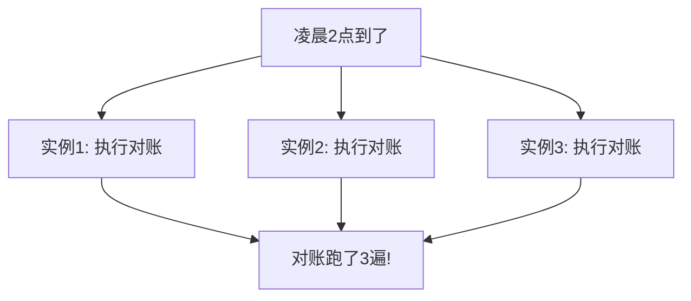
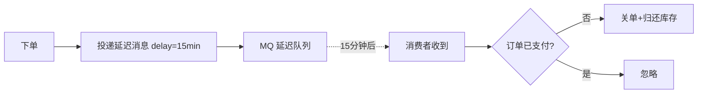
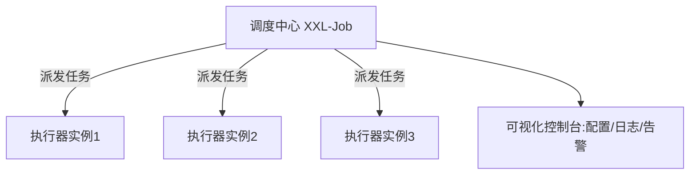

# 后端定时任务与任务调度完全指南：从 cron 到分布式调度与延迟任务

在前面的[订单](/posts/architecture/order-module-complete-guide)、[支付](/posts/architecture/payment-module-complete-guide)、[通知](/posts/architecture/notification-module-complete-guide)几篇里，反复出现一类需求：

> 订单超时未支付要自动关单、每天凌晨要和第三方对账、通知发送失败要定时重试、缓存要定期预热……

这些"到某个时间点/每隔一段时间自动执行"的活儿，就是**定时任务（Scheduled Task）**。它看起来简单——"不就是定个时器跑一下吗"，但一旦系统部署了多台机器，就会冒出一个让新手措手不及的严重问题：**同一个任务被执行了好几遍**。

这篇文章会带你从最基础的 cron 讲到分布式任务调度，把定时任务这块讲透。

:::note
代码以 Node.js 风格演示，重在讲清思路。cron 表达式、调度框架等概念是跨语言通用的。
:::

---

## 一、先分清三类"定时"需求

初学者容易把所有"和时间有关"的任务混为一谈。其实它们是三种不同的需求，实现方式也不同：

| 类型 | 含义 | 例子 |
|------|------|------|
| **周期任务** | 每隔固定时间重复执行 | 每天凌晨对账、每 5 分钟同步一次数据 |
| **延迟任务** | 在未来某个时刻执行一次 | 下单后 15 分钟未付款关单 |
| **定时触发** | 在指定的具体时间执行 | 每周一早 9 点发周报 |

其中"周期任务"和"定时触发"通常用 **cron** 表达式描述，"延迟任务"则需要专门的延迟队列机制。这个区分很重要，后面会分别讲。

---

## 二、单机定时任务：cron

### 2.1 cron 表达式

**cron** 是描述"什么时候执行"的标准语法，用几个字段表示时间：

```
┌───────── 分钟 (0-59)
│ ┌─────── 小时 (0-23)
│ │ ┌───── 日   (1-31)
│ │ │ ┌─── 月   (1-12)
│ │ │ │ ┌─ 星期 (0-6，0是周日)
│ │ │ │ │
* * * * *
```

几个例子：

```
0 2 * * *      每天凌晨 2 点（常用于对账、清理）
*/5 * * * *    每 5 分钟一次
0 9 * * 1      每周一早上 9 点
0 0 1 * *      每月 1 号零点
```

### 2.2 用代码跑一个定时任务

大多数语言都有 cron 库。Node.js 里常用 `node-cron`：

```js
const cron = require('node-cron');

// 每天凌晨 2 点执行对账
cron.schedule('0 2 * * *', async () => {
  console.log('开始每日对账...');
  await reconcile();
});

// 每分钟检查超时订单
cron.schedule('* * * * *', async () => {
  await cancelTimeoutOrders();
});
```

简单场景到这里就够了。但如果你的应用**部署了多个实例**（生产环境几乎都是），问题就来了。

---

## 三、分布式下的核心难题：重复执行

### 3.1 问题是怎么发生的

假设你的服务部署了 3 个实例（为了高可用和负载均衡）。每个实例里都跑着上面那段"每天凌晨 2 点对账"的代码。结果会怎样？



**同一个任务被 3 个实例各跑了一遍。** 对账跑 3 遍可能导致重复处理、数据错乱；发周报跑 3 遍用户会收到 3 封邮件。这就是分布式定时任务最核心、也最容易被新手忽略的坑。

:::warning
**只要你的应用有多个实例，单机 cron 就会导致任务重复执行。** 这不是偶发 bug，是必然结果。必须专门解决。
:::

### 3.2 解法一：分布式锁（抢到锁的才执行）

让所有实例在执行前先抢一把**分布式锁**，只有抢到锁的那个实例才真正执行，其他的跳过。用 Redis 实现最常见：

```js
const cron = require('node-cron');

cron.schedule('0 2 * * *', async () => {
  // 用 SET NX 抢锁，锁 key 带上任务名和日期，保证当天只有一个实例能抢到
  const lockKey = `cron:lock:reconcile:${today()}`;
  const locked = await redis.set(lockKey, instanceId, 'NX', 'EX', 3600);
  if (!locked) {
    console.log('其他实例已在执行，本实例跳过');
    return;
  }
  // 抢到锁，执行任务
  await reconcile();
});
```

关键点：
- `SET NX` 保证只有一个实例能设置成功（抢到锁）。
- 锁 key 带上**日期**，保证"今天这个任务"只被执行一次。
- 设置过期时间，防止实例挂了导致锁永不释放。

分布式锁的完整正确姿势（防误删、看门狗续期）见 [Redis 缓存实战与练习](/posts/redis/redis-exercises-with-answers) 里的分布式锁部分。

### 3.3 解法二：专门的任务调度中心

更彻底的方案是不让业务实例自己管调度，而是引入一个**任务调度中心**（后面第五节讲的 XXL-Job 等）。调度中心统一负责"什么时候、派给哪个实例执行",天然避免重复。这是大型系统的做法。

---

## 四、延迟任务：在未来某个时刻执行一次

前面讲的是"周期任务"。"延迟任务"（如"下单 15 分钟后关单"）是另一类需求——它不是周期性的，而是**为每个订单单独设定一个未来的触发时刻**。有几种实现方式。

### 4.1 方式一：定时轮询扫表（最简单）

用一个周期任务，每分钟扫描"待支付且超过 15 分钟"的订单。这个方案在[订单模块](/posts/architecture/order-module-complete-guide)里讲过：

- 优点：简单，无额外依赖。
- 缺点：有延迟（最多差一个扫描周期）、订单量大时扫表有压力、不够精准。

### 4.2 方式二：Redis ZSet 延迟队列

把"订单号 → 到期时间戳"存进 ZSet（用时间戳作为 score），定时取出到期的部分：

```js
// 下单时：把订单加入延迟队列，score 是到期时间
await redis.zadd('delay:close_order', Date.now() + 15 * 60 * 1000, orderNo);

// 后台循环：取出已到期的订单处理
async function pollDelayQueue() {
  const now = Date.now();
  // 取出 score <= now 的（已到期的）
  const dueOrders = await redis.zrangebyscore('delay:close_order', 0, now);
  for (const orderNo of dueOrders) {
    // 用原子操作移除，避免多实例重复处理
    const removed = await redis.zrem('delay:close_order', orderNo);
    if (removed) await closeOrder(orderNo);
  }
}
```

比扫数据库轻量、更精准。适合中等规模。

### 4.3 方式三：消息队列的延迟消息（生产主流）

RocketMQ 有原生延迟消息，RabbitMQ 可用死信队列实现延迟。下单时投递一条"15 分钟后投递"的消息，到点消费者收到后处理：



- 优点：精准、天然分布式、不用自己维护轮询。
- 缺点：依赖 MQ 基础设施。这是**大型生产系统的主流方案**。

### 4.4 各方案对比

| 方案 | 精准度 | 复杂度 | 适用 |
|------|--------|--------|------|
| 定时扫表 | 低（有周期延迟） | 低 | 练手、小项目 |
| Redis ZSet | 中高 | 中 | 中等规模 |
| MQ 延迟消息 | 高 | 高 | 大型生产 |

---

## 五、任务调度框架

当定时任务变多、变复杂时，自己用 cron + 分布式锁管理会越来越吃力。这时候用专门的**任务调度框架/平台**更省心。常见的有 **XXL-Job**（国内流行）、**Quartz**（Java 经典）、Elastic-Job 等。

它们通常提供这些开箱即用的能力：

- **可视化管理**：在网页上配置任务、启停、改 cron，不用改代码重新发布。
- **天然避免重复执行**：调度中心统一派发，一个任务只派给一个实例。
- **失败重试**：任务失败自动按策略重试。
- **任务分片**：一个大任务（如处理 100 万条数据）拆成多片，分给多个实例并行跑。
- **执行记录与告警**：记录每次执行的结果、耗时，失败了发告警。



:::tip
选型建议：**任务少、简单**，用语言自带的 cron + Redis 分布式锁就够；**任务多、要可视化管理和分片**，上 XXL-Job 这类调度平台。别为了几个简单任务就搭一套重型调度平台，也别用几十个裸 cron 硬扛复杂调度。
:::

---

## 六、任务设计的关键要点

无论用什么方案，写定时任务时都要注意这几点，否则很容易在生产出问题：

### 6.1 幂等：任务可能被重复执行

即使做了分布式锁，任务仍可能因为重试、超时等原因被执行多次。所以**任务逻辑本身要幂等**——多跑一次不能产生错误的副作用。这和[订单](/posts/architecture/order-module-complete-guide)、[通知](/posts/architecture/notification-module-complete-guide)里的幂等思想一脉相承。

### 6.2 控制单次处理量，别一次捞太多

```js
// 反例：一次性把所有超时订单查出来，可能几十万条，撑爆内存
const orders = await db.orders.findAllTimeout();

// 正例：分批处理，每批固定数量
async function processBatch() {
  let hasMore = true;
  while (hasMore) {
    const batch = await db.orders.findTimeout({ limit: 500 }); // 每批500条
    if (batch.length === 0) { hasMore = false; break; }
    for (const order of batch) await closeOrder(order);
  }
}
```

大批量任务一定要**分批**，避免一次性加载导致内存溢出或长事务。

### 6.3 防止任务重叠执行

如果一个任务执行时间超过了它的调度间隔（比如每分钟一次，但这次跑了 3 分钟），下一次调度可能在上一次还没结束时就启动，导致重叠。要加机制避免——比如执行前判断"上一次是否还在跑"。

### 6.4 超时、监控与错过补偿

- **超时控制**：给任务设超时时间，卡住了能中断，别让它无限占用资源和锁。
- **监控告警**：关键任务（如对账）失败或没按时执行，要能立即告警。
- **错过补偿（Misfire）**：如果到点时系统正好宕机，错过了执行，恢复后要不要补跑？重要任务需要考虑这个。

---

## 七、完整示例：一个健壮的分布式定时任务

把要点串起来，一个生产级的"每日对账"任务大致长这样：

```js
// 可运行
// 演示：分布式锁 + 幂等 + 分批 的定时任务骨架（用变量模拟环境）
const lockStore = new Set();       // 模拟 Redis 锁
const doneTasks = new Set();       // 模拟幂等记录
let batchProcessed = 0;

// 模拟抢分布式锁
function tryLock(key) {
  if (lockStore.has(key)) return false;
  lockStore.add(key);
  return true;
}

async function dailyReconcileTask(instanceId) {
  const day = '2026-07-01';
  const lockKey = `cron:reconcile:${day}`;

  // 1. 抢分布式锁，抢不到就跳过（避免多实例重复）
  if (!tryLock(lockKey)) {
    return `${instanceId}: 未抢到锁，跳过`;
  }

  // 2. 幂等检查：今天是否已对账
  if (doneTasks.has(day)) {
    return `${instanceId}: 今日已对账，跳过`;
  }

  // 3. 分批处理，避免一次捞太多
  const totalRecords = 1200;
  const batchSize = 500;
  for (let offset = 0; offset < totalRecords; offset += batchSize) {
    const thisBatch = Math.min(batchSize, totalRecords - offset);
    batchProcessed += thisBatch; // 模拟处理这一批
  }

  // 4. 标记完成
  doneTasks.add(day);
  return `${instanceId}: 对账完成，共处理 ${batchProcessed} 条`;
}

// 模拟 3 个实例同时到点执行
(async () => {
  console.log(await dailyReconcileTask('实例1'));
  console.log(await dailyReconcileTask('实例2'));
  console.log(await dailyReconcileTask('实例3'));
  console.log('实际处理总数:', batchProcessed, '(只被处理一遍，不是3600)');
})();
```

只有第一个抢到锁的实例真正执行，其余跳过；处理时分批进行。这就是分布式定时任务的核心骨架。

---

## 八、常见问题

::: details 为什么部署多个实例后定时任务会执行多次？
因为每个实例里都跑着相同的定时代码，到点后各自都触发了。解决办法是加分布式锁（只有抢到锁的实例执行）或用统一的任务调度中心派发。这是分布式定时任务必须处理的问题。
:::

::: details 周期任务和延迟任务有什么区别？
周期任务是"每隔固定时间重复执行"（如每天对账），用 cron 描述；延迟任务是"为某个具体的事在未来某时刻执行一次"（如某订单 15 分钟后关单），用延迟队列实现。两者机制不同。
:::

::: details 延迟任务用扫表还是消息队列？
练手/小项目用定时扫表最简单；中等规模用 Redis ZSet 延迟队列；大型生产用消息队列的延迟消息（精准、天然分布式）。按规模选择，别过度设计。
:::

::: details 什么时候该上 XXL-Job 这类调度平台？
任务数量多、需要可视化管理、需要任务分片并行、需要完善的失败重试和告警时。任务只有几个且简单，用语言自带 cron + Redis 锁就够，不必搭重型平台。
:::

::: details 定时任务需要幂等吗？
需要。即使有分布式锁，任务仍可能因重试、超时等被执行多次，任务逻辑必须幂等，多执行一次不能产生错误副作用。
:::

---

## 小结

定时任务看似简单，做好要跨过几道坎。回顾主线：

1. **三类需求**：周期任务（cron）、延迟任务（延迟队列）、定时触发，要分清。
2. **单机 cron**：简单场景够用，但多实例会重复执行。
3. **分布式核心难题**：多实例重复执行，用分布式锁或调度中心解决。
4. **延迟任务**：扫表 / Redis ZSet / MQ 延迟消息，按规模选。
5. **调度框架**：任务多且复杂时用 XXL-Job 等，提供可视化、分片、重试。
6. **设计要点**：幂等、分批处理、防重叠、超时监控与错过补偿。

定时任务贯穿在订单关单、支付对账、通知重试等几乎所有模块里，是后端的基础能力之一。想系统规划学习路径，参考[后端学习路线图](/posts/architecture/backend-developer-learning-roadmap)。
