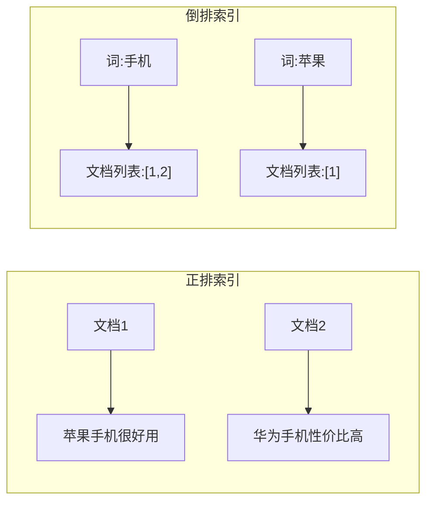
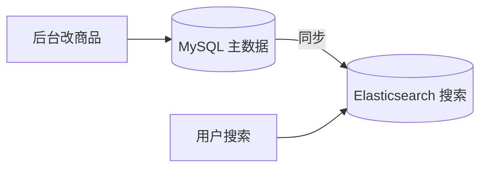
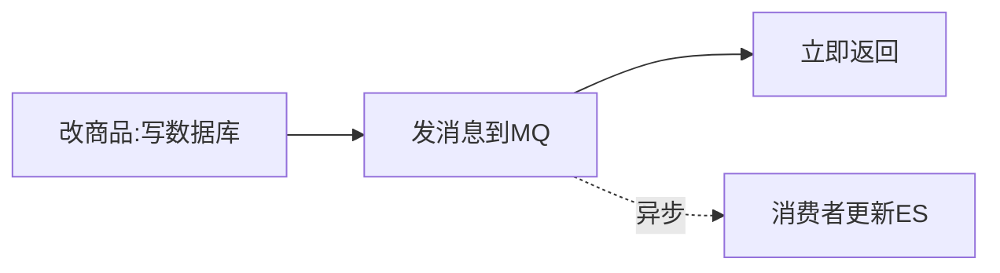
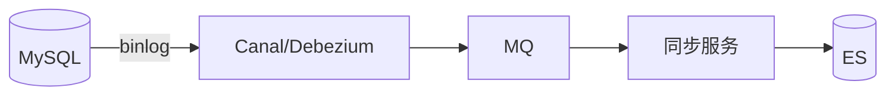
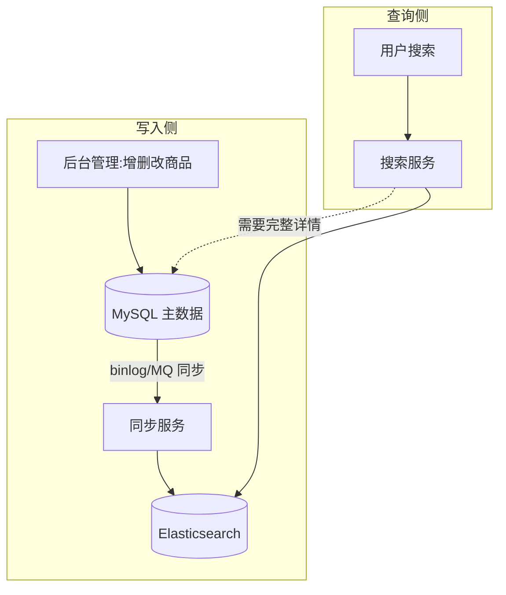

# 后端搜索模块完全指南：从倒排索引到 Elasticsearch 与数据同步

"加个搜索框，能按标题搜商品"——这个需求听起来简单，很多初学者第一反应就是写一句 SQL：

```sql
SELECT * FROM products WHERE title LIKE '%手机%';
```

在数据量小的时候它能用。但当商品涨到几百万条、访问量上来后，你会发现搜索又慢又烂：查一次要好几秒、搜"苹果手机"搜不出"苹果 手机"、想按相关性排序完全做不到。

这时候你需要真正理解：**搜索是一个独立的技术领域，它和普通的数据库查询是两回事。** 这篇文章会带你从"为什么 LIKE 不行"出发，理解搜索的核心——倒排索引，再到 Elasticsearch 的使用和数据同步，让你能独立负责搜索这块业务。

:::note
代码和示例以 Elasticsearch（简称 ES）为主，它是目前最主流的开源搜索引擎。文中重在讲清原理和思路，具体 API 以官方文档和你使用的 ES 版本为准。
:::

---

## 一、为什么数据库的 LIKE 搜不动

先搞清楚问题的根源，你才知道为什么需要专门的搜索引擎。

### 1.1 LIKE '%x%' 无法用索引

数据库索引（B+ 树）的原理是"从左到右按顺序排列",所以它只能加速**前缀匹配**：

```sql
WHERE title LIKE '手机%'   -- 能用索引（前缀匹配）
WHERE title LIKE '%手机%'  -- 用不了索引！只能全表扫描
```

`%手机%` 这种"包含"查询，因为不知道"手机"出现在哪，数据库只能**一行一行地读出来逐个检查**（全表扫描）。几百万行数据，每次搜索都全表扫一遍，能不慢吗？

### 1.2 LIKE 搜不出"语义"

`LIKE` 是纯粹的字符匹配，它不理解语言：

- 搜"苹果手机",匹配不到"苹果 智能手机"(中间多了字)。
- 搜"手机壳",无法理解你想要的是"壳",可能把"手机"权重更高的结果排前面。
- 没有**相关性排序**——搜出来的结果谁更匹配，`LIKE` 一无所知。

:::important
一句话总结：**数据库擅长"精确的结构化查询"（按 id、按状态、按范围），不擅长"模糊的全文检索"。** 全文搜索是另一套技术，核心就是下面要讲的倒排索引。
:::

---

## 二、搜索的核心：倒排索引

这是整个搜索领域最重要的概念，理解了它，你就理解了搜索引擎为什么快。

### 2.1 正排索引 vs 倒排索引

先看普通数据库的存储方式，叫**正排索引**——从"文档"找"内容":

```
文档1 → "苹果手机很好用"
文档2 → "华为手机性价比高"
文档3 → "苹果电脑很贵"
```

要搜"手机",正排索引只能挨个文档翻，看谁包含"手机"。这就是 LIKE 慢的本质。

**倒排索引**反过来——从"词"找"文档":

```
词         → 出现在哪些文档
"苹果"     → [文档1, 文档3]
"手机"     → [文档1, 文档2]
"华为"     → [文档2]
"电脑"     → [文档3]
"好用"     → [文档1]
```

现在搜"手机",直接查倒排索引这张表，一步就知道"手机"出现在文档 1 和文档 2 里，**根本不用扫描全部文档**。这就是搜索引擎快的根本原因。



:::tip
"倒排"这个名字来自英文 Inverted Index，意思是"从词反查文档",和正排（从文档查内容）方向相反。名字有点抽象，记住它的作用就好：**它是一张"词 → 文档列表"的映射表，让按关键词找文档变得极快。**
:::

### 2.2 分词：倒排索引的前提

上面有个关键问题：一句话"苹果手机很好用",怎么变成"苹果""手机""好用"这些词的？这个过程叫**分词（Tokenization / 词元分析）**。

- **英文分词简单**：天然用空格分隔，`"apple phone"` → `["apple", "phone"]`。
- **中文分词难**：中文没有空格，`"苹果手机"` 要靠算法切成 `["苹果", "手机"]` 而不是 `["苹","果手","机"]`。

搜索引擎在**存入数据时**和**用户查询时**都会做分词，然后用分好的词去建立/查询倒排索引。中文场景通常要装专门的中文分词器（ES 里最常用的是 **IK 分词器**）。


:::important
分词质量直接决定搜索质量。为什么 LIKE 搜"苹果手机"搜不出"苹果 智能手机"？因为 LIKE 不分词。而搜索引擎把两边都分成词再匹配，所以能搜到。**分词是全文搜索能"理解语言"的关键。**
:::

---

## 三、相关性打分：为什么这条排在前面

搜索和数据库查询还有一个本质区别：**数据库查询的结果没有"谁更符合"的概念（要么匹配要么不匹配），而搜索结果是按"相关性"排序的。**

搜"手机壳",为什么标题是"iPhone 手机壳"的排在"手机"前面？因为搜索引擎给每个结果算了一个**相关性得分（score）**，得分高的排前面。

打分大致考虑这些因素（了解思想即可）：

- **词频（TF）**：这个词在文档里出现得越多，越相关。
- **逆文档频率（IDF）**：越"稀有"的词越重要。比如"的""手机"到处都是（不重要），"壳"相对稀有（更能区分）。
- **字段权重**：标题里命中比描述里命中更重要。

现代搜索引擎（ES）默认用 **BM25** 算法综合这些因素打分。你不用手算，但要理解"搜索结果是按相关性得分排序的,不是随便排的",这样才知道怎么去调优排序。

---

## 四、Elasticsearch 核心概念

理解了倒排索引和分词，就能上手搜索引擎了。**Elasticsearch（ES）** 是目前最主流的开源搜索引擎，它把倒排索引、分词、打分、分布式都封装好了，开箱即用。

### 4.1 几个基本概念（和数据库类比）

| Elasticsearch | 类比数据库 | 说明 |
|---------------|-----------|------|
| Index（索引） | 表 | 一类文档的集合，如"商品索引" |
| Document（文档） | 行 | 一条数据，JSON 格式 |
| Field（字段） | 列 | 文档里的一个属性 |
| Mapping（映射） | 表结构 | 定义字段类型、用什么分词器 |

:::warning
注意"索引"这个词的歧义：在数据库里"索引"是加速查询的结构，在 ES 里 **Index 相当于"表"**。别被术语搞混。
:::

### 4.2 定义映射（Mapping）

存数据前，先告诉 ES 每个字段是什么类型、怎么分词：

```json
PUT /products
{
  "mappings": {
    "properties": {
      "title":    { "type": "text", "analyzer": "ik_max_word" },
      "price":    { "type": "integer" },
      "brand":    { "type": "keyword" },
      "created":  { "type": "date" }
    }
  }
}
```

两个关键字段类型初学者要分清：

- **text**：会**分词**，用于全文搜索。比如 `title` 要能被"手机"搜到，就用 text。
- **keyword**：**不分词**，整体作为一个词，用于精确匹配、聚合、排序。比如 `brand="Apple"` 要精确筛选，用 keyword。

:::tip
"华为Mate60" 如果是 text 会被拆成词可以模糊搜；如果是 keyword 则必须完整输入"华为Mate60"才能匹配。**要模糊搜的用 text，要精确筛选/聚合的用 keyword。** 实践中一个字段常同时建 text 和 keyword 两种（ES 的 multi-field）。
:::

### 4.3 查询

存入文档后就能搜了。一个基础的全文搜索：

```json
GET /products/_search
{
  "query": {
    "match": { "title": "苹果手机" }
  }
}
```

`match` 查询会把"苹果手机"分词成"苹果""手机",在倒排索引里查，返回按相关性打分排序的结果。ES 还支持组合查询（`bool`：must/should/filter）、范围查询、聚合等，能满足复杂的搜索需求。

---

## 五、数据同步：数据库和搜索引擎怎么保持一致

这是搜索模块最大的**工程难题**，也是初学者最容易忽视的。

### 5.1 问题：数据有两份

现实是：你的**主数据在数据库**（MySQL），但**搜索走 ES**。同一份商品数据存在了两个地方。当商品在数据库里被修改（改价、下架、改标题），ES 里的数据也要跟着更新，否则就会出现"数据库已下架，搜索还能搜到"这种问题。

所以必须有一套**数据同步**机制，把数据库的变更同步到 ES。有三种主流方案。



### 5.2 方案一：同步双写

业务代码在写数据库的同时，也直接写 ES：

```js
async function updateProduct(id, data) {
  await db.updateProduct(id, data);   // 写数据库
  await es.update('products', id, data); // 同时写 ES
}
```

- 优点：实现最简单，实时性好。
- 缺点：业务代码和 ES 强耦合；两次写不在一个事务里，写完数据库、写 ES 失败会导致不一致；ES 抖动会影响业务。

### 5.3 方案二：异步同步（MQ）

写完数据库后发一条消息到 MQ，由专门的消费者去更新 ES：



- 优点：业务和 ES 解耦，ES 抖动不影响主流程；可重试。
- 缺点：有短暂延迟（最终一致）；要维护 MQ 和消费者。

### 5.4 方案三：订阅数据库 binlog（推荐）

用工具（如 **Canal**、**Debezium**、Logstash）监听数据库的 **binlog**（数据库记录所有变更的日志），数据库一有变化就自动同步到 ES：



- 优点：**业务代码完全无感知**（不用改一行业务代码），解耦最彻底，同步最可靠。
- 缺点：需要额外搭建同步组件。这是**生产环境最推荐**的方案。

:::important
选型建议：小项目/低频更新用**同步双写**够了；要解耦、量大用 **MQ 异步**；追求业务零侵入、数据最可靠用 **binlog 订阅**。无论哪种，都要接受"搜索数据是最终一致的"——数据库刚改完，搜索结果可能有几秒延迟才更新，这在搜索场景通常是可以接受的。
:::

---

## 六、搜索模块的整体架构

把前面的知识拼起来，一个典型的搜索架构长这样：



要点：

- **数据库是主数据源**，ES 是"为搜索优化的副本"。所有写操作走数据库，再同步到 ES。
- **搜索请求走 ES**，拿到匹配的 ID 和摘要。
- ES 里通常只存**搜索和展示列表需要的字段**（标题、价格、图片），不必把整个大对象都塞进去。需要完整详情时再拿 ID 回数据库或缓存查。

---

## 七、实用功能：让搜索更好用

除了基础的关键词搜索，一个成熟的搜索模块通常还有这些功能，ES 都有内置支持：

### 7.1 高亮（Highlight）

把搜索结果里命中的关键词高亮显示（加粗/变色），提升体验：

```json
GET /products/_search
{
  "query": { "match": { "title": "手机" } },
  "highlight": { "fields": { "title": {} } }
}
```

ES 会在返回结果里把"手机"用标签包裹（如 `<em>手机</em>`），前端渲染成高亮。

### 7.2 自动补全 / 搜索建议

用户输入"手"就提示"手机""手机壳""手表"。这靠 ES 的 **Completion Suggester** 或前缀匹配实现，能显著提升搜索转化率。

### 7.3 聚合 / 分面搜索（Faceted Search）

就是电商搜索结果页左侧的"筛选面板"——按品牌、价格区间、分类聚合出数量：

```
品牌：  苹果(120)  华为(89)  小米(156)
价格：  0-1000(45)  1000-3000(88)  3000+(120)
```

这靠 ES 的**聚合（Aggregation）** 实现，是电商搜索的标配。注意用于聚合的字段要用 `keyword` 类型。

### 7.4 纠错与同义词

- **拼写纠错**："苹果手机" 打成 "苹果收集",提示"您是不是要找：苹果手机"。
- **同义词**：搜"土豆"也能搜到"马铃薯"。通过配置同义词词典实现。

:::tip
这些功能不用一开始全做。初学阶段先把"关键词搜索 + 高亮 + 分面筛选"这三个最常用的做扎实，其余按业务需要逐步增加。
:::

---

## 八、常见问题

::: details 什么时候该用 Elasticsearch，什么时候用数据库就够了？
判断标准是"是否需要全文模糊搜索 + 相关性排序"。如果只是按 id、状态、时间范围等结构化条件查询，数据库完全够用，别引入 ES 增加复杂度。当你需要按关键词模糊搜、要相关性排序、要分面聚合、数据量还大时，才上 ES。
:::

::: details 为什么不直接把所有查询都用 ES，抛弃数据库？
因为 ES 不擅长事务、强一致和频繁更新，也不适合做主数据存储。正确的分工是：**数据库做主数据存储和事务性操作，ES 做搜索**。两者配合，各司其职。
:::

::: details 数据库改了数据，搜索结果没变怎么办？
这是数据同步没做好或存在延迟。检查你的同步方案（双写/MQ/binlog）是否正常。要注意搜索是"最终一致"的，改完数据后 ES 更新有秒级延迟是正常的；如果长时间不更新，就是同步链路出了问题。
:::

::: details 中文搜索搜不准是什么原因？
大概率是分词问题。ES 默认分词器对中文支持差（会一个字一个字切）。中文场景要装专门的中文分词器（如 IK），并根据业务调整分词粒度和同义词词典。分词质量直接决定中文搜索质量。
:::

::: details text 和 keyword 到底怎么选？
要做模糊全文搜索的字段用 `text`（会分词），如商品标题；要精确匹配、排序、聚合的字段用 `keyword`（不分词），如品牌、状态、分类。很多字段两者都需要，可以同时建（multi-field）。
:::

---

## 小结

搜索是一个独立的技术领域，和普通数据库查询有本质区别。回顾全文主线：

1. **为什么不用 LIKE**：`%x%` 无法走索引（全表扫描慢），且不理解语言、不能相关性排序。
2. **倒排索引**：搜索引擎的核心，"词 → 文档列表"的映射，让按关键词找文档极快。
3. **分词**：把文本切成词元，是全文搜索能"理解语言"的前提，中文要用专门分词器。
4. **相关性打分**：搜索结果按 BM25 等算法算出的相关性排序，不是随便排的。
5. **Elasticsearch**：主流搜索引擎，理解 Index/Document/Mapping 和 text vs keyword。
6. **数据同步**：数据库是主数据、ES 是搜索副本，用双写/MQ/binlog 保持最终一致。
7. **实用功能**：高亮、自动补全、分面聚合、纠错同义词，按需增加。

建议动手做一遍：先搭一个 ES，把商品数据导进去，实现关键词搜索和高亮，再做分面筛选，最后接一套数据同步。搜索模块常和[商品/库存模块](/posts/architecture/product-inventory-module-complete-guide)配合（商品搜索是最典型的场景）。搜索属于[后端学习路线图](/posts/architecture/backend-developer-learning-roadmap)里的进阶技术能力，建议在数据库和缓存扎实之后再深入。
