"当你在浏览器地址栏输入 URL 并按下回车，发生了什么？"

这不仅仅是一道面试题，它是前端工程师的**世界地图**。每一个步骤的延迟，都直接影响着用户的体验。

今天，我们不走马观花，而是深入浏览器内部（以 Chrome 为例），看看**浏览器进程 (Browser Process)**、**网络进程 (Network Process)**、**渲染进程 (Renderer Process)** 和 **GPU 进程** 是如何协作完成这场接力赛的。


---

## 第一阶段：导航 (Navigation) —— "你要去哪？"

一切始于 **浏览器主进程 (Browser Process)**。它负责管理标签页、地址栏和书签。

### 1. 处理输入

当你输入文本时，浏览器主进程的 **UI 线程** 会判断：

- **是搜索查询？** → 组合成搜索引擎的 URL（如 `google.com/search?q=...`）。
- **是 URL？** → 补全协议（如 `https://`），准备访问。

### 2. 开始导航

当你按下回车，UI 线程通知 **网络进程 (Network Process)**："嘿，帮我抓取这个网站的内容"。
此时，标签页上的旋转图标开始转动。

---

## 第二阶段：网络 (Network) —— "建立连接"

**网络进程** 接手工作，开始在互联网上寻找目标服务器。

### 3. DNS 查询 (寻找门牌号)

浏览器需要知道域名（如 `example.com`）对应的 IP 地址。

- **缓存检查**：浏览器缓存 → 操作系统缓存 (hosts) → 路由器缓存。
- **递归查询**：如果没有缓存，向 DNS 服务器发起请求。

### 4. 建立 TCP 连接 (三次握手)

拿到 IP 后，浏览器与服务器建立可靠的连接通道。

- **SYN** → **SYN-ACK** → **ACK**。
- 这就好比打电话："喂，听得到吗？" "听到了，你呢？" "我也听到了，开始说正事吧。"

### 5. TLS 握手 (建立加密通道)

如果是 HTTPS（现在绝大多数都是），还需要进行 TLS 握手，交换证书和密钥，确保数据不被窃听。

### 6. 发送 HTTP 请求

连接建立，浏览器发送请求报文（GET /index.html）。

### 7. 读取响应

服务器返回响应报文。网络进程读取响应头。

- **重定向？** 如果状态码是 301/302，网络进程会通知 UI 线程重新导航。
- **Content-Type 检查**：如果是 `text/html`，说明是网页，准备交给渲染进程。如果是 `.zip`，则交给下载管理器。

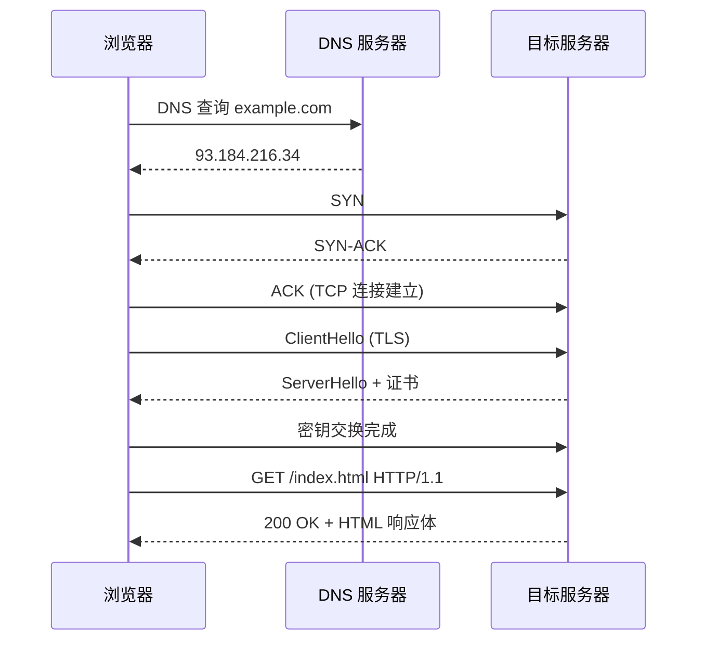

---

## 第三阶段：准备渲染 (Preparation) —— "准备交接"

### 8. 提交导航 (Commit Navigation)

网络进程告诉浏览器主进程："数据准备好了！"
浏览器主进程会寻找一个 **渲染进程 (Renderer Process)**（通常每个标签页一个）。

- **IPC 消息**：浏览器主进程向渲染进程发送 "CommitNavigation" 消息，并把网络进程的数据管道对接给渲染进程。

此时，地址栏更新，安全锁图标出现，页面开始变成白色（旧页面卸载）。

---

## 第四阶段：解析与构建 (Parsing) —— "理解内容"

现在，接力棒交到了 **渲染进程** 手中。这是前端开发者最熟悉的领域（主线程 Main Thread）。

### 9. 构建 DOM 树

渲染进程一边从网络管道接收 HTML 数据，一边进行解析。这个过程远比"字符变节点"复杂得多。

#### HTML 解析器的状态机

HTML 解析器的核心是一个**确定性有限状态自动机 (Deterministic Finite State Automaton)**。规范定义了 80+ 个状态，核心流转路径如下：

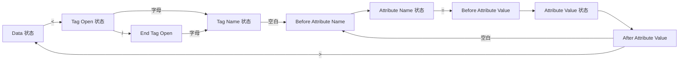

1. **Data 状态**：初始状态，逐字符读取内容。遇到 `<` 转入 Tag Open 状态。
2. **Tag Open 状态**：判断是开始标签还是结束标签。遇到字母转入 Tag Name 状态。
3. **Tag Name 状态**：收集标签名，遇到空白转入属性解析，遇到 `>` 回到 Data 状态。
4. **属性解析**：逐个解析属性名和属性值，构建令牌的属性列表。

解析器在每次产出令牌后，将其交给**树构建算法 (Tree Construction Algorithm)**，由它根据 HTML 规范定义的**插入模式 (Insertion Mode)** 将节点挂载到 DOM 树的正确位置。

#### 错误恢复与容错

HTML 是一种极其宽容的语言——浏览器从不因为语法错误而拒绝渲染。解析器内置了大量的错误恢复机制：

- **隐式闭合**：`<p>段落1<p>段落2` 中第二个 `<p>` 会自动闭合前一个 `<p>`，因为 `<p>` 不能嵌套。
- **隐式添加**：`<td>单元格</td>` 会被自动包裹在 `<table><tbody><tr>` 中。
- **禁止交叉**：`<b><i>文本</b></i>` 会被重新组织为 `<b><i>文本</i></b><i></i>`，标签按照嵌套规则重新排列。
- **换行符标准化**：`\r\n`、`\r` 统一转为 `\n`。

这些容错行为由规范精确定义（[HTML5 Spec: Parsing HTML Documents](https://html.spec.whatwg.org/multipage/parsing.html)），不同浏览器在同样的错误输入上会产生相同的 DOM 树——这是 HTML5 最重要的贡献之一。

#### `<script>` 的阻塞机制

这是 DOM 构建中最关键的阻塞点。当解析器遇到 `<script>` 标签时，会暂停 DOM 构建，等待 JavaScript 下载并执行完毕后才恢复。原因是 JS 可能通过 `document.write()` 等方式修改尚未解析的 DOM 结构。

三种加载策略的差异可以用时间线来理解：

```mermaid
gantt
  title Script 加载策略对比
  dateFormat X
  axisFormat %s

  section 普通 script
  HTML 解析       :a1, 0, 5
  下载 JS         :a2, 5, 10
  执行 JS         :a3, 10, 12
  HTML 解析继续    :a4, 12, 20

  section async
  HTML 解析       :b1, 0, 20
  下载 JS (并行)   :b2, 5, 10
  执行 JS (暂停)   :b3, 10, 12

  section defer
  HTML 解析       :c1, 0, 15
  下载 JS (并行)   :c2, 5, 10
  DOMContentLoaded 后执行 JS :c3, 15, 17
```

- **普通 `<script>`**：遇到即暂停解析，下载 + 执行完毕后恢复。最坏的情况下，多个串行脚本会严重阻塞首屏渲染。
- **`async`**：下载与 HTML 解析并行进行，但下载完成后立即执行，此时会暂停 HTML 解析。执行顺序不保证（谁先下载完谁先执行），适用于独立第三方脚本（如统计代码）。
- **`defer`**：下载与 HTML 解析并行，执行延迟到 HTML 解析完成后、`DOMContentLoaded` 事件触发前。执行顺序与文档中的出现顺序一致，适用于需要操作完整 DOM 的脚本。

:::warning
`async` 和 `defer` 仅对外部脚本有效（有 `src` 属性的 `<script>`）。内联 `<script>` 标签加上这两个属性没有任何效果，仍然会同步阻塞。
:::

#### 预加载扫描器 (Preload Scanner)

当主解析器被 `<script>` 阻塞时，Chrome 会启动一个**预加载扫描器 (Preload Scanner)**——一个轻量级的、只做前瞻扫描的解析器实例。

预加载扫描器不构建 DOM 树，它只扫描 HTML 字节流中的 `<script src>`、`<link rel="stylesheet">`、`` 等资源引用，提前交给网络进程开始下载。这样当主解析器恢复工作时，所需资源可能已经在缓存中就绪了。

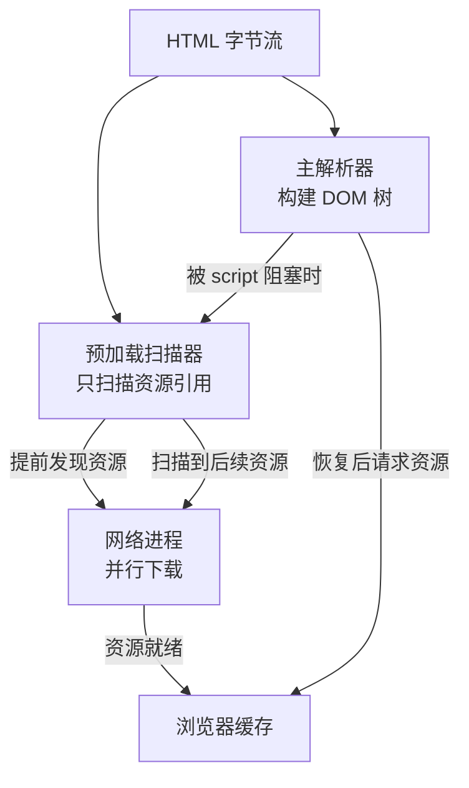

这就是为什么把 `<script>` 放在 `<head>` 中但加上 `defer`，性能依然不错——预加载扫描器会在主解析器遇到 `<script defer>` 时立即发起下载，而不会等主解析器真正执行到该脚本。

#### `document.write()` 的问题

`document.write()` 可以在 HTML 解析过程中直接向解析器的输入流中注入新的 HTML 字符串。这会导致 DOM 树被突变式修改——解析器必须立即处理注入的内容，当前已构建的 DOM 结构可能被彻底改变。

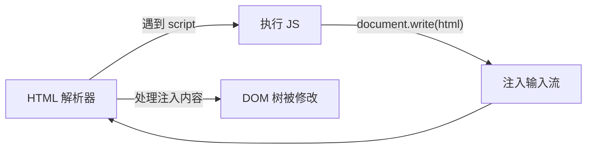

Chrome 对 `document.write()` 有特殊优化：如果注入的脚本是跨域的且在慢速网络下，Chrome 会直接忽略该 `document.write()` 调用。但在一般情况下，它仍然会强制同步解析注入的 HTML，造成严重的性能问题。

:::important
`document.write()` 是唯一能同步修改解析器输入流的 API。它在现代前端开发中已被视为反模式，React、Vue 等框架的虚拟 DOM 机制从根本上避免了这种直接 DOM 操作。
:::

---

### 10. 样式计算 (Style Calculation)

CSS 代码（外部文件、`<style>` 标签、内联样式）解析完成后，浏览器需要计算出 DOM 树中每个节点的**最终样式**。这个过程分为两个阶段：CSSOM 构建和样式决议。

#### CSSOM 构建过程

CSS 解析器将 CSS 文本转化为 **CSSOM (CSS Object Model)**——一棵由样式规则组成的树结构：

1. **词法分析 (Tokenization)**：将 CSS 文本分割为令牌（如 `ident`、`hash`、`string`、`number`）。
2. **语法分析 (Parsing)**：按照 CSS Grammar 将令牌组装为规则——`@` 规则（`@media`、`@keyframes`）和样式规则（选择器 + 声明块）。
3. **规则归一化**：将所有规则转换为统一的内部表示——每个声明被解析为 property-value 对，值被标准化（如 `color: red` 转为 `rgb(255, 0, 0)`，`font-weight: bold` 转为 `font-weight: 700`）。

与 DOM 树不同，CSSOM 不可被用户直接修改（只能通过 API 操作样式表），且它是**只增不减**的——后面解析的规则不会删除前面的规则，只会通过层叠优先级覆盖。

#### 样式决议算法 (Style Resolution)

样式决议是确定每个 DOM 元素最终样式值的过程，核心有三步：**选择器匹配**、**优先级计算**、**层叠排序**。

**选择器匹配**：浏览器从右向左匹配选择器。对于 `.nav .item a`，浏览器先找到所有 `<a>` 元素，再向上检查祖先是否匹配 `.nav .item`。这种"由下而上"的策略利用了 DOM 查询的高效性——先缩小候选集再验证。

**优先级 (Specificity)**：当多条规则同时作用于同一元素时，优先级决定谁胜出。优先级由四个维度组成，从高到低：

| 优先级层级 | 计数规则 | 示例 |
|---|---|---|
| Inline style | `style=""` 属性 | `style="color: red"` |
| ID | `#id` 选择器数量 | `#header` |
| Class / Attribute / Pseudo-class | `.class`、`[attr]`、`:hover` 数量 | `.nav`, `[type="text"]` |
| Type / Pseudo-element | 元素名、`::before` 数量 | `div`, `::after` |

通配符 `*` 和组合符（`>`, `+`, `~`, 空格）不参与优先级计算。`!important` 标记会使声明跳出优先级体系，获得最高权重。

**层叠 (Cascade)**：优先级相同时，按照来源排序。CSS 规范定义了三种来源，优先级从低到高：

1. **User Agent Stylesheet**：浏览器默认样式（如 `<h1>` 的 `font-size: 2em`）。
2. **User Stylesheet**：用户自定义样式（极少使用，可通过浏览器设置注入）。
3. **Author Stylesheet**：页面开发者编写的样式。

同一来源内，后声明的规则覆盖先声明的规则。加上 `!important` 后顺序反转——User Agent `!important` > User `!important` > Author `!important`。

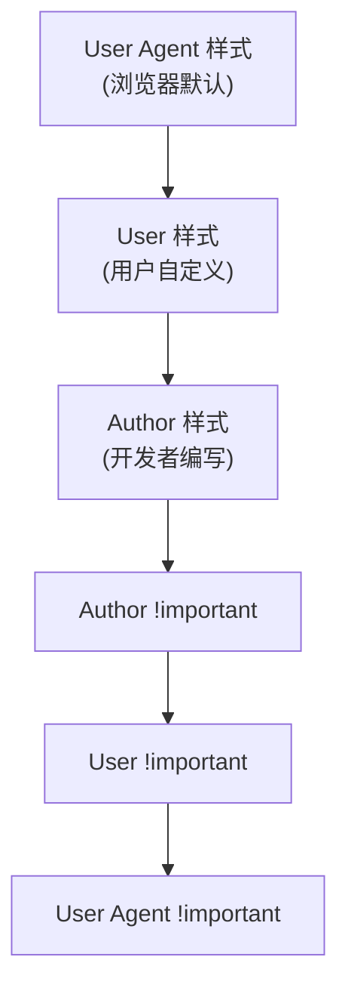

#### 值处理管线 (Value Processing Pipeline)

CSS 属性的值从书写到最终呈现在屏幕上，需要经过四个阶段的转换：

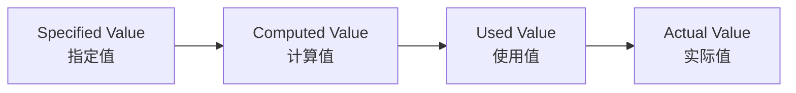

- **指定值 (Specified Value)**：样式表中声明的值，或缺省值（通过层叠决议得出）。如 `width: 50%`、`font-size: 2em`。
- **计算值 (Computed Value)**：将相对单位转为绝对值（`em` → `px`），解析依赖关系（`font-size` 先计算，再基于它计算 `line-height`）。百分比在此时**不转换**（因为没有参照容器）。如 `width: 50%` 仍为 `50%`，`font-size: 2em` 变为 `32px`。
- **使用值 (Used Value)**：布局阶段完成后的值。此时百分比已根据包含块 (Containing Block) 的尺寸转换为绝对像素值。如 `width: 50%` 变为 `width: 400px`（假定包含块宽度 800px）。
- **实际值 (Actual Value)**：使用值被约束到设备能呈现的范围内。如 `border-width: 0.7px` 在标准屏幕上会近似为 `1px`。

#### CSS 全局关键字与继承

CSS 提供了四个全局关键字，可以应用于任何属性，控制值在层叠中的回退行为：

- **`inherit`**：强制继承父元素的计算值。即使属性默认不可继承（如 `border-color`），也会被强制继承。
- **`initial`**：回退到属性的初始值（规范定义的默认值）。如 `color: initial` 等于 `color: #000`（取决于规范定义），`display: initial` 等于 `display: inline`。
- **`unset`**：如果属性默认可继承，则等同于 `inherit`；否则等同于 `initial`。这是最"自然"的重置方式。
- **`revert`**：回退到前一个层叠来源的值。在 Author 样式中使用 `revert` 会回退到 User Agent 样式；在 User Agent 样式中使用会回退到浏览器内置默认值。

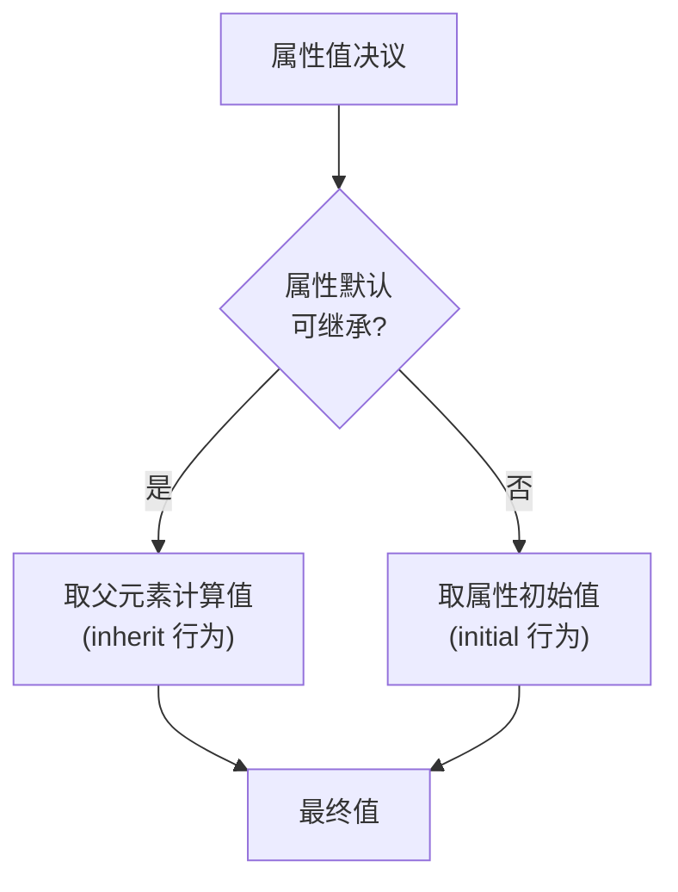

:::tip
`all: unset` 是一种常用的 CSS Reset 手法——它一次性将所有属性重置为"最自然"的状态，可继承的属性保留继承，不可继承的回退到初始值。
:::

---

### 11. 布局 (Layout)

有了 DOM 和计算样式，浏览器需要计算每个节点在屏幕上的**几何信息**——位置和尺寸。

#### 布局树与 DOM 树的差异

布局树 (Layout Tree) 不是 DOM 树的简单映射，它有显著的结构差异：

| 差异类型 | DOM 树 | 布局树 |
|---|---|---|
| `display: none` | 节点存在 | 节点不存在 |
| `::before` / `::after` | 不存在 | 生成匿名布局对象 |
| 匿名块 | 内联与块级元素混排时直接嵌套 | 自动生成匿名块级盒包裹内联内容 |
| `<head>` | 存在 | 不存在（`display: none`） |

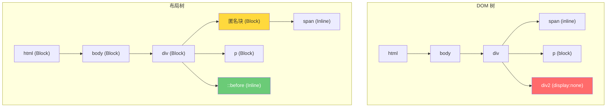

匿名块的生成规则：当一个块级容器内同时出现块级和内联内容时，浏览器会自动生成匿名块级盒来包裹内联内容，确保布局模型的一致性。例如：

```html
<div>
  Some inline text
  <p>Block paragraph</p>
  More inline text
</div>
```

此时 "Some inline text" 和 "More inline text" 会被分别包裹在两个匿名块级盒中，与 `<p>` 并列排列。

#### 盒模型计算

CSS 盒模型定义了一个元素占据的总空间：

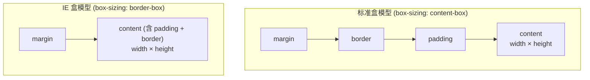

- **标准盒模型**：`width` / `height` 只指 content 区域。元素总宽度 = `margin-left + border-left + padding-left + width + padding-right + border-right + margin-right`。
- **IE 盒模型** (`border-box`)：`width` / `height` 包含 content + padding + border。这是现代开发中更常用的模式（通过 `* { box-sizing: border-box }` 全局设置）。

#### 布局模式 (Layout Modes)

浏览器支持多种布局模式，每个元素根据其 `display` 属性和上下文进入不同的布局算法：

**正常流 (Normal Flow)** 是最基础的布局模式，分为两种格式化上下文：

- **块级格式化上下文 (BFC, Block Formatting Context)**：块级盒在垂直方向上一个接一个排列，盒之间的垂直间距由 `margin` 决定，且相邻 `margin` 会发生折叠 (Margin Collapsing)。
- **内联格式化上下文 (IFC, Inline Formatting Context)**：内联盒在水平方向上一个接一个排列，在一行放不下时换行。垂直对齐由 `vertical-align` 控制。

**Float**：浮动元素脱离正常流，但仍然影响周围内容的排列。文本和内联内容会围绕浮动元素排列（这是 Float 的原始设计意图——图文混排），但块级盒不会。

**Position** 定位模式：

| 定位方式 | 脱离正常流 | 参照物 | 特点 |
|---|---|---|---|
| `static` | 否 | 无 | 默认值，正常流布局 |
| `relative` | 否 | 自身原始位置 | 偏移后原始空间保留 |
| `absolute` | 是 | 最近的定位祖先 | 完全脱离文档流 |
| `fixed` | 是 | 视口 (Viewport) | 滚动时固定位置 |
| `sticky` | 否/是 | 滚动容器 | 滚动到阈值前为 relative，之后为 fixed |

**Flexbox**：一维弹性布局，主轴 (main axis) 和交叉轴 (cross axis) 双向控制子元素排列、伸缩和对齐。

**Grid**：二维网格布局，同时定义行和列，子元素可以跨越任意数量的网格单元。

#### BFC (Block Formatting Context)

BFC 是 CSS 布局中最核心的概念之一。它是一个独立的布局区域，内部元素的布局不会影响外部元素，反之亦然。

**什么会创建 BFC：**

- 根元素 (`<html>`)
- `float` 不为 `none` 的元素
- `position` 为 `absolute` 或 `fixed` 的元素
- `display` 为 `inline-block`、`table-cell`、`flex`、`grid`、`flow-root` 的元素
- `overflow` 不为 `visible` 的元素
- `contain` 为 `layout`、`content` 或 `strict` 的元素

**BFC 的核心行为：**

1. **内部块盒垂直排列**，相邻 margin 折叠。
2. **BFC 区域不会与浮动元素重叠**——这是清除浮动的原理（`overflow: hidden` 创建 BFC，阻止浮动溢出）。
3. **BFC 可以包含浮动元素**——解决了"父元素高度塌陷"问题（`display: flow-root` 是专门为此设计的属性）。
4. **属于不同 BFC 的元素 margin 不会折叠**——这是阻止 margin 折叠的方法。

#### 包含块 (Containing Block)

包含块是元素尺寸和定位的参照物。理解包含块是理解百分比定位和尺寸的基础：

- 对于 `static` / `relative` 定位的元素，包含块是最近的**块级容器祖先**的 content 区域。
- 对于 `absolute` 定位的元素，包含块是最近的 `position` 不为 `static` 的祖先的 **padding 区域**（注意：包含 padding，不只是 content）。
- 对于 `fixed` 定位的元素，包含块通常是**视口**——除非某个祖先具有 `transform`、`perspective`、`filter` 等属性（此时该祖先成为包含块）。

这意味着 `width: 50%` 和 `left: 50%` 的参照对象可能不同，取决于元素的定位方式。

#### 触发回流的场景

回流 (Reflow / Layout) 是渲染管线中最昂贵的操作之一，因为它可能导致整棵布局树重新计算。以下操作会触发回流：

- **几何属性变更**：修改 `width`、`height`、`margin`、`padding`、`border-width` 等。
- **内容变更**：文本内容改变、输入框值改变。
- **类名切换**：导致一系列样式同时改变。
- **读取布局属性**：调用 `offsetWidth`、`offsetHeight`、`getBoundingClientRect()` 等会强制触发同步布局——即使你只是读取而非写入。

:::warning 布局抖动 (Layout Thrashing)
在同一个帧内交替读写布局属性会触发多次同步回流：

```js
for (const el of elements) {
  const height = el.offsetHeight; // 强制同步布局（读）
  el.style.height = height + 10 + 'px'; // 标记脏（写）
}
// 下一轮循环读取 offsetHeight 时，必须先完成上一轮的布局
```

正确做法是先批量读取，再批量写入：

```js
const heights = elements.map(el => el.offsetHeight);
elements.forEach((el, i) => {
  el.style.height = heights[i] + 10 + 'px';
});
```
:::

**布局偏移 (Layout Shift)** 是另一种回流相关的性能问题：元素的视觉位置发生意外变化，导致 CLS (Cumulative Layout Shift) 指标恶化。常见原因包括：未指定尺寸的图片/广告、动态插入内容、Web 字体加载导致文本重排。

---

## 第五阶段：绘制与光栅化 (Paint & Raster) —— "生成像素"

知道了元素在哪里（布局），还需要知道它长什么样。

### 12. 绘制 (Paint)

主线程遍历布局树，生成 **绘制记录 (Paint Records)**。这实际上是一个**显示列表 (Display List)**——一组有序的绘制指令，每条指令描述一个图形操作（画矩形、画文字、画图片等）。

```
Display List 示例：
  1. drawRect(x=0, y=0, w=800, h=600, color=#ffffff)   // 背景
  2. drawRect(x=10, y=10, w=200, h=40, color=#333333)   // 头部背景
  3. drawText(x=20, y=40, text="Hello", font=16px)       // 文字
  4. drawImage(x=0, y=60, src=logo.png)                  // 图片
```

#### 绘制顺序与层叠上下文

绘制顺序遵循 CSS 2.2 规范定义的**绘制阶段 (Paint Phase)**，从后到前：

1. **背景** (background-color, background-image)
2. **边框** (border)
3. **子元素内容** (children content)
4. **轮廓** (outline)

`z-index` 通过创建**层叠上下文 (Stacking Context)** 来改变绘制顺序。在同一层叠上下文内，元素按照以下顺序绘制（从后到前）：

1. 层叠上下文 `z-index` 为负值的子元素
2. 正常流中的块级后代（非定位、非浮动）
3. 浮动后代
4. 正常流中的内联后代
5. `z-index: auto` / `z-index: 0` 的定位后代
6. `z-index` 为正值的定位后代

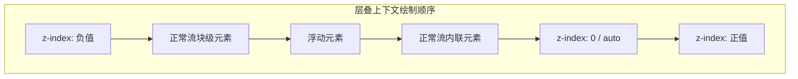

#### 回流与重绘的触发对比

| 操作 | 回流 | 重绘 | 代价 |
|---|---|---|---|
| 修改 `width` | ✓ | ✓ | 高 |
| 修改 `color` | ✗ | ✓ | 中 |
| 修改 `transform` | ✗ | ✗ | 低（合成层处理） |
| 修改 `opacity` | ✗ | ✗ | 低（合成层处理） |
| 读取 `offsetWidth` | ✓（强制同步） | ✗ | 高 |
| 修改 `class` | 可能 | 可能 | 取决于属性 |

重绘 (Repaint) 只需要重新生成 Display List 并光栅化受影响的区域，不涉及布局计算。比重流便宜，但仍然不是免费的——它需要占用主线程时间和 GPU 资源。

#### CSS 属性与绘制阶段映射

不同 CSS 属性影响不同的绘制阶段。浏览器利用这一特性做增量绘制——只重新绘制受影响的阶段：

| 绘制阶段 | 涉及的 CSS 属性 |
|---|---|
| 背景 | `background-color`, `background-image`, `background-size` |
| 边框 | `border-color`, `border-style`, `border-radius` |
| 内容 | `color`, `font-size`, `text-decoration` |
| 轮廓 | `outline-color`, `outline-width` |

例如，修改 `color` 只需要重绘"内容"阶段，不需要重绘背景和边框。

---

### 13. 图层分层 (Layering)

为了实现高效的滚动和动画，浏览器会将页面拆分成多个**合成层 (Compositing Layers / Compositing Layers)**。

#### 为什么需要图层分层

核心思想：**合成器 (Compositor) 可以在不重新绘制的情况下移动图层**。

当用户滚动页面时，合成器只需要改变各图层的偏移量并重新合成，而不需要回到主线程重新执行布局 → 绘制 → 光栅化的完整管线。同样，`transform` 动画和 `opacity` 动画可以在合成器线程上独立完成，不阻塞主线程。

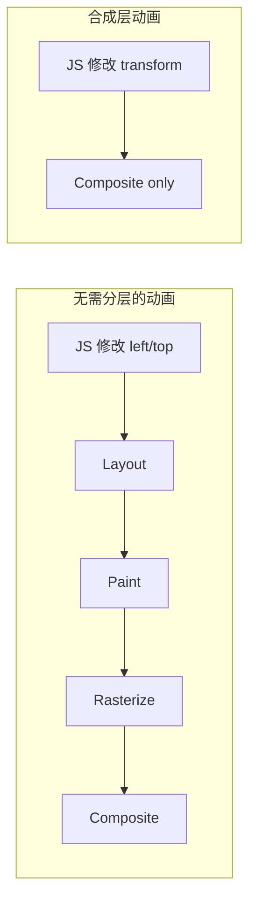

#### 图层提升条件

浏览器会在以下条件满足时将元素提升为独立的合成层：

- **3D 变换**：`transform: translate3d()`, `translateZ()`, `rotateX/Y/Z()`, `perspective()`
- **`will-change`**：`will-change: transform`, `will-change: opacity` 等
- **`opacity` 动画**：通过 CSS Animation 或 Transition 改变 `opacity`
- **`transform` 动画**：通过 CSS Animation 或 Transition 改变 `transform`
- **视频/Canvas/插件**：`<video>`, `<canvas>`, `<iframe>`, `<embed>`, `<object>`
- **`position: fixed`**：当存在已合成的祖先时
- **CSS Filter**：`filter: blur()`, `drop-shadow()` 等
- **剪裁/遮罩**：`clip-path`, `mask` 等
- **混合模式**：`mix-blend-mode` 不为 `normal`
- **反射**：`box-reflect`

:::tip
`will-change` 是告诉浏览器"这个元素即将发生变化"的提示，让浏览器提前做好优化准备（如提升为合成层、分配 GPU 资源）。但不要滥用——每个合成层都消耗 GPU 内存。
:::

#### 图层合并 (Layer Squashing)

如果一个元素满足提升条件，但它附近有多个也满足条件的元素，浏览器会将它们合并到同一个合成层中，以减少图层数量和 GPU 内存消耗。

例如，多个相邻的 `will-change: transform` 元素可能被合并为一个合成层，而不是各自拥有独立层。但如果它们在 z 轴上被其他未提升的元素隔开，则无法合并——因为合成层必须连续排列。

#### 过多图层的代价

合成层不是免费的。每个图层都需要：

- **GPU 内存**：一个 256×256 的图块需要约 256KB 显存（RGBA），一个全屏图层可能需要数 MB。
- **合成开销**：合成器需要将所有图层混合为最终帧，图层数越多，混合计算越重。
- **更新开销**：当图层内容变化时，整个图层需要重新光栅化。


#### 检查图层状态

Chrome DevTools 提供了图层检查工具：

1. 打开 DevTools → **Layers** 面板，可以查看当前页面的所有合成层及其层级关系。
2. 在 **Rendering** 面板中勾选 **Layer borders**，可以在页面上直观地看到每个合成层的边界（橙色边框）和图块边界（蓝色网格）。
3. 在 **Performance** 面板中录制滚动操作，查看合成层的创建和销毁时间线。

---

### 14. 光栅化 (Rasterization)

主线程把图层树提交给 **合成线程 (Compositor Thread)**。合成线程接管后续工作（此时主线程可以去处理 JS 了）。

#### 分块 (Tiling)

合成线程不会一次性光栅化整个图层——一个图层可能有数万像素高（如长页面），但屏幕只能显示一小部分。因此，合成线程将图层切割为多个**图块 (Tile)**，通常大小为 256×256 或 512×512 像素。

分块带来的关键优势：

- **按需光栅化**：只光栅化视口内及附近的图块，视口外的图块可以延迟处理。
- **优先级调度**：视口内的图块优先级最高，靠近视口的次之，远离视口的最低。
- **内存效率**：页面滚动时，离开视口的图块可以从 GPU 内存中释放，新进入视口的图块再按需光栅化。

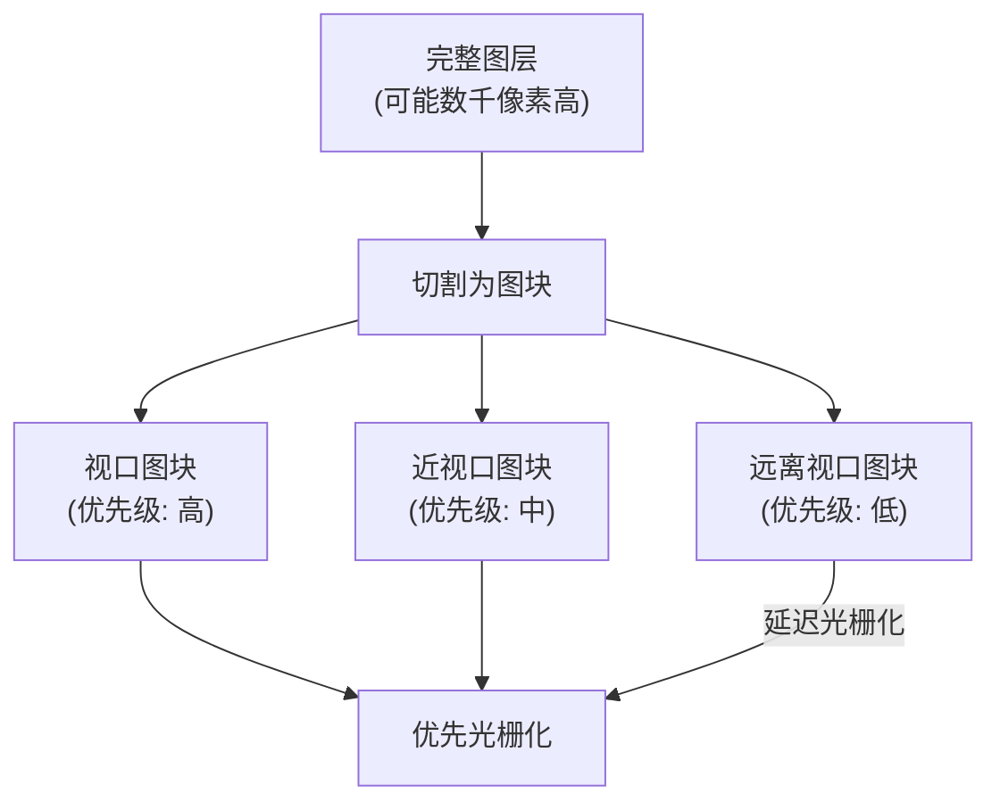

#### 软件光栅化 vs GPU 光栅化

光栅化有两种实现路径：

- **软件光栅化 (Software Rasterization)**：使用 CPU 将绘制指令逐像素渲染为位图。通过 Skia 库的 SkScan 模块执行。在低端设备或不支持 GPU 加速的场景下使用。
- **GPU 光栅化 (GPU Rasterization)**：将绘制指令转化为 GPU 可以理解的命令（如 OpenGL/Vulkan draw calls），在 GPU 上并行执行光栅化。这是现代 Chrome 的默认路径。

GPU 光栅化的调用链：

```
绘制指令 → Skia (2D 图形库)
         → Ganesh (Skia 的 GPU 后端)
         → OpenGL / Vulkan / Metal (图形 API)
         → GPU 硬件执行
         → 位图存储在 GPU 显存中
```

Chrome 通过 `--disable-gpu-rasterization` 命令行标志可以强制使用软件光栅化，用于调试。

#### Draw Quads

光栅化的输出是 **Draw Quads**——描述图块在屏幕上如何绘制的元数据。每个 Draw Quad 包含：

- 图块在图层中的位置
- 图块在屏幕上的目标位置
- 图块的纹理引用（指向 GPU 显存中的位图）
- 变换矩阵（旋转、缩放等）

Draw Quads 是光栅化和合成之间的接口——合成器只需要按照 Draw Quads 的描述将纹理贴到正确位置即可。

---

## 第六阶段：合成与显示 (Composite & Display) —— "屏幕成像"

### 15. 合成 (Composite)

当所有图块都被光栅化后，合成线程会生成一个 **合成帧 (Compositor Frame)**。

这个帧是一个包含所有 Draw Quads 的有序列表，描述了每个图块在屏幕上的最终位置。合成线程通过 IPC 将合成帧发送给 **GPU 进程**。

### 16. 显示 (Display)

GPU 进程收到合成帧后，将纹理数据绘制到屏幕的**帧缓冲区 (Frame Buffer)**，显示器以 60Hz（约每 16.67ms）的频率读取帧缓冲区并刷新屏幕像素，你终于看到了页面！

#### 合成器线程的独立工作

合成器线程最重要的特性是：**它可以在不涉及主线程的情况下处理滚动和部分输入事件**。

当用户滚动页面时，合成器线程只需要：

1. 更新每个 Draw Quad 的偏移量
2. 生成新的合成帧
3. 发送给 GPU 进程显示

整个过程不需要主线程参与——这就是为什么即使主线程被 JavaScript 阻塞，页面滚动仍然流畅。

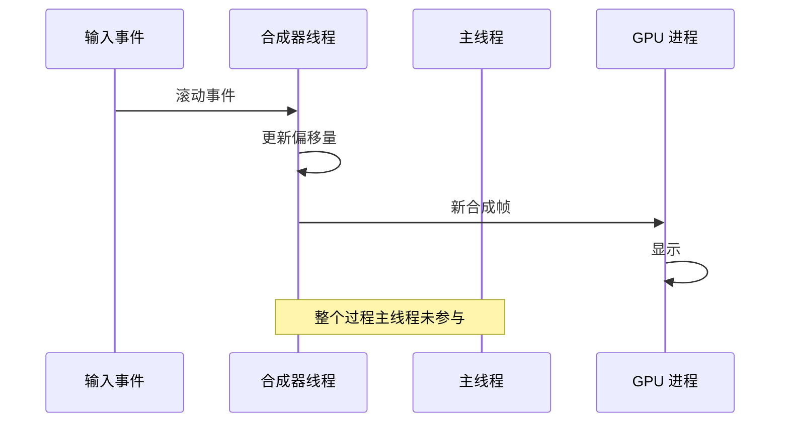

#### 输入事件流

输入事件从硬件到浏览器内核再到渲染进程的流转路径：

1. **浏览器进程**接收操作系统传来的原始输入事件（鼠标移动、键盘按键、触摸）。
2. 浏览器进程通过 IPC 将事件发送给**渲染进程的合成器线程**。
3. 合成器线程判断事件是否需要主线程处理：
   - **纯滚动**：合成器线程直接处理，不通知主线程。
   - **需要 JS 处理**（如绑定了 `touchstart` / `click` 事件）：合成器线程将事件转发给主线程。

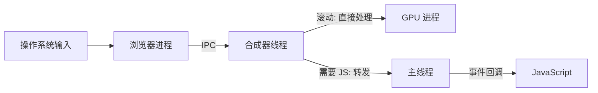

如果主线程正在执行耗时 JS，合成器线程会将事件排队等待。`setTimeout` / `setInterval` 的回调同样会排队到主线程的任务队列中。

#### `requestAnimationFrame` 的时机

`requestAnimationFrame` (rAF) 是与渲染管线紧密耦合的调度 API。浏览器保证 rAF 回调在下一帧的样式计算和布局之前执行，这样开发者可以在回调中修改样式，然后在同一帧中看到效果。

```
一帧的执行顺序：
  1. 处理输入事件
  2. 执行 rAF 回调
  3. 样式计算 (Style)
  4. 布局 (Layout)
  5. 绘制 (Paint)
  6. 合成 (Composite)
  7. 显示 (Display)
```

:::important
在 rAF 回调中读取布局属性（如 `offsetWidth`）会强制触发同步布局——浏览器必须在 rAF 回调返回前完成布局计算，然后在后续步骤中再次布局，造成"双重布局"的性能浪费。应该先读取布局属性，再修改样式，或将读取操作放在 rAF 回调的开头。
:::

#### 帧生命周期与 VSync

显示器以固定频率刷新——60Hz 意味着每 16.67ms 刷新一次。浏览器需要在这个时间窗口内完成从输入到显示的所有工作。

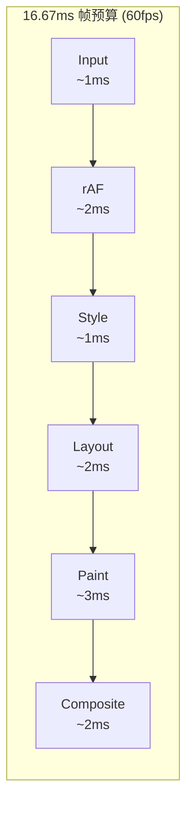

当一帧的渲染工作超过 16.67ms 时，该帧会被**丢弃 (Dropped Frame)**，用户感知到的就是卡顿 (Jank)。帧率从 60fps 降到 30fps 意味着每两帧才渲染一次，滚动和动画明显不流畅。

常见的帧超时原因：

- **长任务 (Long Task)**：主线程上的 JS 执行超过 50ms，阻塞了整个渲染管线。
- **强制同步布局**：在修改样式后立即读取布局属性。
- **大量 DOM 操作**：导致布局树和绘制列表的重建成本极高。
- **CSS 复杂选择器**：增加样式计算时间。

---

## 渲染性能：关键路径与优化策略

### 关键渲染路径 (Critical Rendering Path)

关键渲染路径是指从接收 HTML 到首次像素渲染（First Paint）必须经过的管线。任何阻塞这条管线的资源都是**关键资源**——它们会延迟首次渲染。

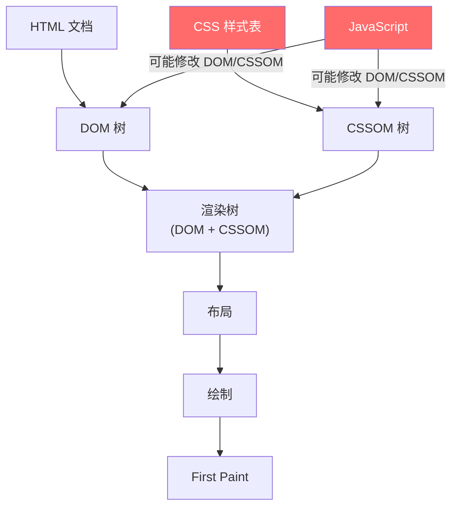

关键资源的特征：

- **阻塞渲染的 CSS**：CSS 是渲染阻塞资源——没有 CSSOM，渲染树无法构建。所有 `<link rel="stylesheet">` 都会阻塞首次渲染，无论它是否在首屏可见区域内使用。
- **阻塞解析的 JS**：没有 `async` / `defer` 的 `<script>` 会阻塞 DOM 构建。
- **阻塞渲染的字体**：如果使用了 `font-display: auto`（默认值），字体加载会阻塞文字渲染。

### 核心性能指标与渲染管线的关系

现代 Web 性能指标 (Core Web Vitals) 直接对应渲染管线的不同阶段：

| 指标 | 全称 | 衡量内容 | 对应管线阶段 |
|---|---|---|---|
| **FP** | First Paint | 首次像素渲染（任何像素） | Paint 首次完成 |
| **FCP** | First Contentful Paint | 首次有意义内容渲染 | Paint 首次绘制文字/图片 |
| **LCP** | Largest Contentful Paint | 最大内容元素渲染完成 | Paint + Raster + Composite |
| **CLS** | Cumulative Layout Shift | 视觉稳定性 | Layout（意外偏移） |
| **FID** | First Input Delay | 首次交互响应延迟 | Main Thread 可用性 |
| **INP** | Interaction to Next Paint | 交互到下一帧的延迟 | Main Thread + Pipeline |

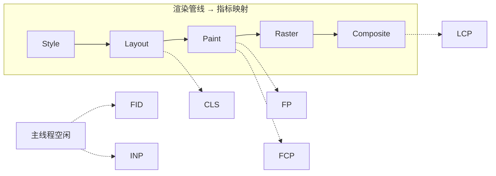

- **FP / FCP** 优化重点是减少关键资源数量和大小——减少阻塞渲染的 CSS 和 JS。
- **LCP** 优化重点是加速最大内容元素（通常是图片或大段文字）的加载和渲染管线。
- **CLS** 优化重点是避免布局偏移——为图片/视频预设尺寸、避免动态插入内容。
- **FID / INP** 优化重点是减少主线程长任务——保持主线程快速响应。

### 性能优化技术与管线阶段映射

```mermaid
flowchart TD
  subgraph CRP["关键渲染路径"]
    HTML2["HTML"] --> DOM2["DOM"] --> STYLE3["Style"] --> LAYOUT3["Layout"] --> PAINT3["Paint"] --> COMP3["Composite"]
    CSS2["CSS"] --> CSSOM2["CSSOM"] --> STYLE3
    JS2["JS"] --> DOM2
  end

  PRELOAD["preload<br/>(预加载关键资源)"] -.-> CSS2
  PRECONNECT["preconnect<br/>(提前建立连接)"] -.-> HTML2
  DEFER["defer / async<br/>(非阻塞 JS)"] -.-> JS2
  CRITICAL_CSS["Critical CSS<br/>(内联首屏样式)"] -.-> CSS2
  LAZY["Lazy Loading<br/>(延迟加载非关键资源)"] -.-> PAINT3

  style PRELOAD fill:#6bcb77,color:#fff
  style PRECONNECT fill:#6bcb77,color:#fff
  style DEFER fill:#6bcb77,color:#fff
  style CRITICAL_CSS fill:#6bcb77,color:#fff
  style LAZY fill:#6bcb77,color:#fff
```

#### 资源提示 (Resource Hints)

| 提示类型 | 作用 | 优化管线阶段 |
|---|---|---|
| `preconnect` | 提前完成 DNS + TCP + TLS 握手 | 网络阶段 |
| `dns-prefetch` | 提前完成 DNS 解析 | 网络阶段 |
| `preload` | 提前下载关键资源（CSS、字体、关键 JS） | 网络阶段 → 解析阶段 |
| `prefetch` | 预取下一页面可能需要的资源 | 网络阶段（低优先级） |
| `modulepreload` | 预加载 ES Module 及其依赖 | 网络阶段 → 解析阶段 |

```html
<link rel="preconnect" href="https://fonts.googleapis.com" />
<link rel="dns-prefetch" href="https://cdn.example.com" />
<link rel="preload" href="/fonts/main.woff2" as="font" type="font/woff2" crossorigin />
<link rel="preload" href="/css/critical.css" as="style" />
<link rel="prefetch" href="/js/next-page.js" as="script" />
```

#### CSS 优化

- **关键 CSS 内联**：将首屏可见区域的 CSS 直接内联到 `<head>` 的 `<style>` 标签中，消除额外的网络请求。剩余 CSS 异步加载（`<link rel="preload" as="style" onload="this.rel='stylesheet'"`）。
- **消除未使用 CSS**：使用 PurgeCSS / UnoCSS 等工具移除未使用的样式规则，减少 CSSOM 构建时间。
- **避免 `@import`**：`@import` 会导致串行加载——浏览器必须先下载外层样式表，解析到 `@import` 后再下载内层样式表。使用 `<link>` 并行加载。

#### JavaScript 优化

- **Code Splitting**：将应用拆分为多个 chunk，只加载当前路由需要的代码。Webpack 的 `import()` / React 的 `React.lazy()` / Next.js 的 `dynamic()` 实现按需加载。
- **Tree Shaking**：构建时移除未使用的导出代码，减少 JS 体积。依赖 ES Module 的静态结构。
- **`defer` / `async`**：如前文所述，`defer` 保证执行顺序且不阻塞 DOM 构建，`async` 适用于独立脚本。
- **避免长任务**：将超过 50ms 的任务拆分为多个小任务，使用 `requestIdleCallback`、`scheduler.yield()` 或简单的 `setTimeout` 分割执行。

#### 图片优化

- **懒加载 (Lazy Loading)**：`loading="lazy"` 让浏览器延迟加载视口外的图片，减少初始网络请求和渲染工作量。
- **响应式图片**：`<picture>` + `srcset` 让不同设备加载不同尺寸/格式的图片。
- **现代格式**：WebP / AVIF 比 JPEG/PNG 小 25%-50%，减少网络传输和解码时间。
- **预设尺寸**：`width` / `height` 属性让浏览器在图片加载前就计算出布局空间，避免 CLS。

#### 字体优化

- **`font-display: swap`**：让浏览器在字体加载完成前先用系统字体渲染文字，加载完成后再切换。避免字体加载阻塞文字渲染 (FOIT - Flash of Invisible Text)。
- **`preload` 字体**：`<link rel="preload" href="font.woff2" as="font" type="font/woff2" crossorigin />` 提前发起字体下载。
- **字体子集化 (Subsetting)**：只包含实际使用的字符，大幅减小字体文件体积。

---

## 浏览器渲染的并发模型

### 多线程协作架构

Chrome 渲染进程不是单线程的——它包含多个协作线程，各自负责渲染管线的不同阶段：

```mermaid
graph TD
  subgraph "渲染进程"
    MT["主线程<br/>(Main Thread)<br/>JS 执行 · Style · Layout · Paint"]
    CT["合成器线程<br/>(Compositor Thread)<br/>图层合成 · 滚动处理 · 输入分发"]
    RT["光栅化线程池<br/>(Raster Threads)<br/>图块光栅化"]
  end

  subgraph "GPU 进程"
    GPU["GPU 线程<br/>纹理上传 · 帧合成 · 显示"]
  end

  MT --> |"图层树 + Display List"| CT
  CT --> |"图块任务"| RT
  RT --> |"光栅化结果"| CT
  CT --> |"合成帧"| GPU
```

线程间的数据流转：

1. **主线程**完成 Style → Layout → Paint，生成图层树和 Display List，通过** Commit** 操作提交给合成器线程。Commit 是同步的——主线程会等待合成器线程接收完毕后才继续。
2. **合成器线程**接收图层树后，分块并分配给光栅化线程池。光栅化完成后，合成器线程生成合成帧。
3. **光栅化线程池**通常包含 1-4 个线程（取决于设备核心数），并行执行图块的光栅化任务。
4. **GPU 进程**独立于渲染进程，负责将合成帧绘制到屏幕。多个渲染进程的合成帧都由同一个 GPU 进程处理。

### 长任务与线程阻塞

主线程同时承担 JS 执行和渲染工作（Style、Layout、Paint），这意味着**长 JS 任务会阻塞渲染**。

```mermaid
gantt
  title 主线程时间线：长任务导致丢帧
  dateFormat X
  axisFormat %sms

  section 主线程
  JS 长任务 (40ms)   :a1, 0, 40
  Style              :a2, 40, 42
  Layout             :a3, 42, 44
  Paint              :a4, 44, 48
  Composite          :a5, 48, 50

  section 帧预算
  第1帧 (0-16ms)     :done, f1, 0, 16
  第2帧 (16-33ms)    :done, f2, 16, 33
  第3帧 (33-50ms)    :active, f3, 33, 50
```

上例中，40ms 的 JS 任务跨越了 2 个帧预算，导致第 1 帧和第 2 帧都被丢弃。用户直到第 3 帧才看到更新——帧率从 60fps 降到约 20fps。

#### 任务拆分策略

**`scheduler.yield()`** (新的调度 API) 告诉浏览器"我可以暂停，先处理渲染和高优先级任务，然后再回来继续"：

```js
async function processItems(items) {
  for (const item of items) {
    processItem(item);
    await scheduler.yield();
  }
}
```

**`requestIdleCallback()`** 在浏览器空闲时执行低优先级任务：

```js
requestIdleCallback((deadline) => {
  while (deadline.timeRemaining() > 0 && tasks.length > 0) {
    doSmallTask();
  }
  if (tasks.length > 0) {
    requestIdleCallback(processRemainingTasks);
  }
});
```

`deadline.timeRemaining()` 返回当前空闲期剩余的毫秒数（通常最多 50ms），确保回调不会占用过多时间。

**`setTimeout(fn, 0)`** 也可以实现简单的让步——将剩余工作放到新的宏任务中，给浏览器一个处理渲染和输入事件的机会。但这不如 `scheduler.yield()` 精确，因为 `setTimeout` 的最小延迟约为 4ms。

### Service Worker 与网络/渲染管线

Service Worker 是运行在独立线程中的脚本，充当浏览器和网络之间的代理。它对渲染管线的影响主要体现在网络阶段：

```mermaid
sequenceDiagram
  participant Page as 页面请求
  participant SW as Service Worker
  participant Cache as Cache Storage
  participant Net as 网络进程
  participant Server as 服务器

  Page->>SW: 请求拦截 (fetch 事件)
  alt Cache 命中
    SW->>Cache: 读取缓存
    Cache-->>SW: 返回响应
    SW-->>Page: 返回响应 (无需网络)
  else Cache 未命中
    SW->>Net: 转发请求
    Net->>Server: 发起网络请求
    Server-->>Net: 返回响应
    Net-->>SW: 返回响应
    SW->>Cache: 写入缓存
    SW-->>Page: 返回响应
  end
```

Service Worker 的关键影响：

- **缓存命中时**：完全跳过 DNS → TCP → TLS → HTTP 的网络管线，响应时间从数百毫秒降至数毫秒。这是 PWA 离线可用的基础。
- **Cache API 优先于 HTTP 缓存**：Service Worker 的 `fetch` 事件先于浏览器内置的 HTTP 缓存检查，可以精确控制缓存策略。
- **安装与激活生命周期**：Service Worker 首次安装后需要等页面刷新后才能激活（`skipWaiting` + `clients.claim()` 可以绕过），确保不会在旧页面运行时引入不兼容的缓存行为。
- **线程独立**：Service Worker 运行在独立线程，不会阻塞主线程。但 `fetch` 事件的响应速度取决于 Service Worker 代码的执行效率——如果 Service Worker 中有复杂逻辑，反而可能增加延迟。

---

## 总结：为什么这很重要？

回顾整个流程，我们可以得出性能优化的底层逻辑——每项优化技术都对应渲染管线的特定阶段：

| 优化技术 | 优化的管线阶段 | 核心原理 |
|---|---|---|
| DNS 预解析 / preconnect | 网络阶段 | 提前完成连接建立 |
| CDN / HTTP/2 | 网络阶段 | 缩短传输时间 |
| Critical CSS 内联 | 样式计算 | 消除渲染阻塞资源 |
| `defer` / `async` | DOM 构建 | 避免 JS 阻塞解析器 |
| Code Splitting | DOM 构建 + 样式计算 | 减少关键 JS 体积 |
| 预设图片尺寸 | 布局 | 避免 Layout Shift |
| 批量 DOM 操作 | 布局 | 减少回流次数 |
| `transform` / `opacity` 动画 | 合成 | 跳过 Layout + Paint + Raster |
| `will-change` 提示 | 图层分层 | 提前提升合成层 |
| 图片懒加载 | 绘制 + 光栅化 | 减少首帧工作量 |
| `font-display: swap` | 绘制 | 避免字体阻塞文字渲染 |
| `scheduler.yield()` | 帧调度 | 避免长任务阻塞渲染 |
| Service Worker 缓存 | 网络 | 跳过整个网络管线 |

最重要的一个结论：**使用 `transform` 和 `opacity` 做动画，是因为它直接在合成阶段修改合成帧，完全跳过了布局、绘制和光栅化**！这就是 60 帧丝滑动画的秘密。

浏览器是一个庞大而精密的工业系统。理解它，你就不再是写代码的工匠，而是驾驭性能的工程师。
