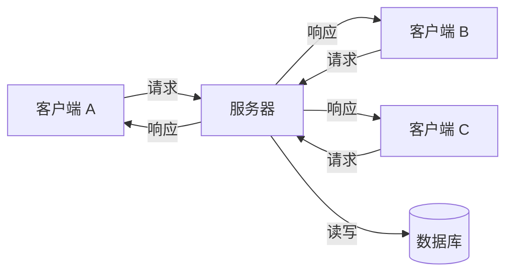
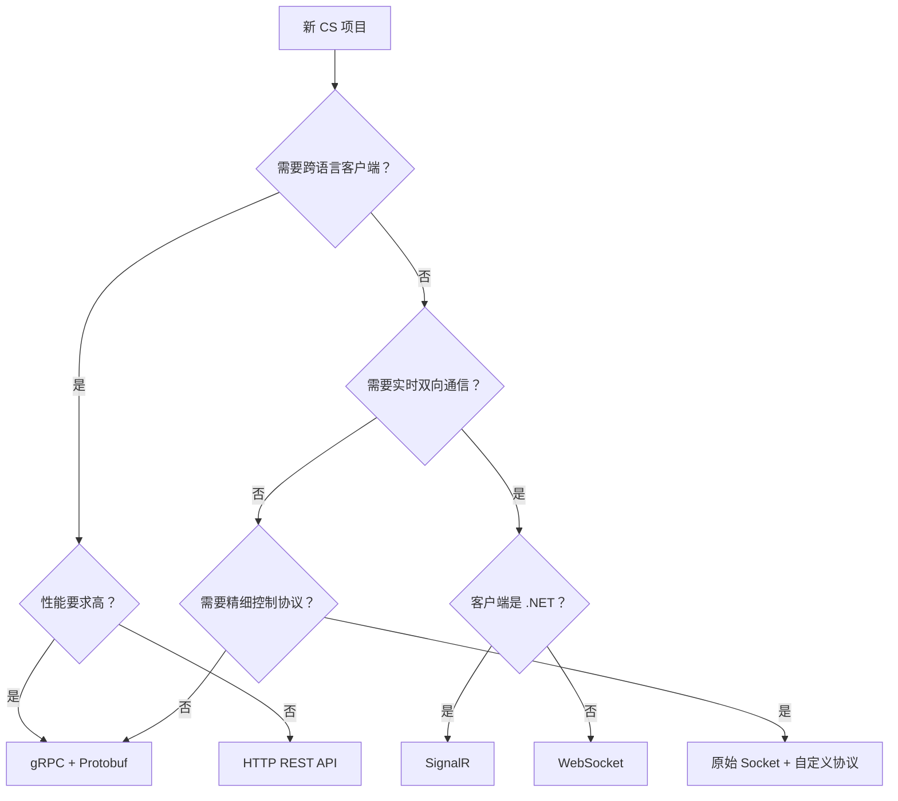

# C# CS 架构开发完全指南

## 引言

CS（Client-Server）架构是软件开发中最经典、最持久的架构模式之一。尽管 Web 时代的 BS（Browser-Server）架构大行其道，但在以下场景中，CS 架构仍然是不可替代的选择：

- **实时通信系统**：即时聊天、在线游戏、股票交易终端
- **工业控制软件**：SCADA 系统、设备监控、数据采集
- **企业内部工具**：ERP 客户端、POS 收银系统、文件同步工具
- **高性能计算**：分布式计算节点、数据处理管道

本文面向有一定 C# 基础的开发者，将从底层 Socket 编程开始，逐步演进到现代化的 gRPC 方案，帮你建立完整的 CS 架构知识体系。

---

## CS 架构核心概念

### 什么是 CS 架构

CS 架构将应用拆分为两个独立的程序：

- **Client（客户端）**：运行在用户机器上，负责界面展示和用户交互
- **Server（服务端）**：运行在服务器上，负责业务逻辑、数据存储和资源协调

两者通过**网络协议**进行通信，各司其职。



### CS vs BS 架构对比

| 维度 | CS 架构 | BS 架构 |
|------|---------|---------|
| 客户端 | 独立安装的桌面程序 | 浏览器 |
| 性能 | 高（本地渲染，直接通信） | 中（受浏览器沙箱限制） |
| 更新部署 | 需要客户端升级 | 服务端更新即生效 |
| 通信协议 | 自由选择（TCP/UDP/自定义） | HTTP/WebSocket |
| 离线能力 | 强（本地缓存） | 弱 |
| 安全性 | 客户端可被逆向 | 逻辑在服务端更安全 |
| 开发成本 | 高（需维护两端） | 中 |

### 通信协议选型

在 CS 架构中，选择合适的通信协议至关重要：

| 协议 | 特点 | 适用场景 |
|------|------|----------|
| TCP | 可靠、有序、面向连接 | 聊天、文件传输、业务系统 |
| UDP | 快速、无连接、可能丢包 | 游戏同步、视频流、广播发现 |
| HTTP/REST | 简单、通用、无状态 | 低频请求、CRUD 操作 |
| WebSocket | 全双工、持久连接 | 实时推送、协作编辑 |
| gRPC | 高性能、强类型、流式支持 | 微服务通信、高吞吐场景 |

---

## 从 TCP Socket 开始：最底层的 CS 通信

Socket 是网络通信的基石。理解 Socket 编程，才能真正理解上层框架在做什么。

### 最简单的 TCP 服务器

```csharp
using System.Net;
using System.Net.Sockets;
using System.Text;

// 创建监听 Socket
var listener = new TcpListener(IPAddress.Any, 8080);
listener.Start();
Console.WriteLine("服务器已启动，等待连接...");

while (true)
{
    // 接受客户端连接（阻塞等待）
    TcpClient client = await listener.AcceptTcpClientAsync();
    Console.WriteLine($"客户端已连接: {client.Client.RemoteEndPoint}");

    // 为每个客户端启动独立处理
    _ = HandleClientAsync(client);
}

async Task HandleClientAsync(TcpClient client)
{
    using var stream = client.GetStream();
    var buffer = new byte[1024];

    try
    {
        while (true)
        {
            // 读取客户端发送的数据
            int bytesRead = await stream.ReadAsync(buffer);
            if (bytesRead == 0) break; // 客户端断开

            string message = Encoding.UTF8.GetString(buffer, 0, bytesRead);
            Console.WriteLine($"收到: {message}");

            // 回复客户端
            string response = $"服务器收到: {message}";
            byte[] responseBytes = Encoding.UTF8.GetBytes(response);
            await stream.WriteAsync(responseBytes);
        }
    }
    finally
    {
        client.Close();
        Console.WriteLine("客户端已断开");
    }
}
```

### 对应的 TCP 客户端

```csharp
using System.Net.Sockets;
using System.Text;

// 连接到服务器
using var client = new TcpClient();
await client.ConnectAsync("127.0.0.1", 8080);
Console.WriteLine("已连接到服务器");

using var stream = client.GetStream();
var buffer = new byte[1024];

while (true)
{
    Console.Write("输入消息: ");
    string? input = Console.ReadLine();
    if (string.IsNullOrEmpty(input)) break;

    // 发送数据
    byte[] data = Encoding.UTF8.GetBytes(input);
    await stream.WriteAsync(data);

    // 接收响应
    int bytesRead = await stream.ReadAsync(buffer);
    string response = Encoding.UTF8.GetString(buffer, 0, bytesRead);
    Console.WriteLine($"服务器回复: {response}");
}
```

:::warning
上面的代码能跑，但存在严重的生产问题：**TCP 粘包**。TCP 是流式协议，不保证一次 `Read` 能读到完整的一条消息。下一节会解决这个问题。
:::

### 解决 TCP 粘包：消息协议设计

TCP 是字节流协议，没有"消息边界"的概念。你发两条消息 `"Hello"` 和 `"World"`，接收方可能收到 `"HelloWorld"`，也可能收到 `"Hel"` 和 `"loWorld"`。

解决方案是设计**应用层协议**，常见方式有三种：

| 方式 | 原理 | 优缺点 |
|------|------|---------|
| 固定长度 | 每条消息固定 N 字节 | 简单但浪费带宽 |
| 分隔符 | 用特殊字符分割消息 | 需要转义，不适合二进制 |
| 长度前缀 | 消息头标明消息体长度 | **推荐**，灵活高效 |

以下是**长度前缀协议**的实现：

```csharp
/// <summary>
/// 基于长度前缀的消息协议
/// 格式: [4字节消息长度][消息体]
/// </summary>
public class MessageProtocol
{
    /// <summary>
    /// 发送一条完整消息
    /// </summary>
    public static async Task SendMessageAsync(NetworkStream stream, byte[] message)
    {
        // 先发送 4 字节的长度头（大端序）
        byte[] lengthPrefix = BitConverter.GetBytes(IPAddress.HostToNetworkOrder(message.Length));
        await stream.WriteAsync(lengthPrefix);

        // 再发送消息体
        await stream.WriteAsync(message);
    }

    /// <summary>
    /// 接收一条完整消息
    /// </summary>
    public static async Task<byte[]?> ReceiveMessageAsync(NetworkStream stream)
    {
        // 先读取 4 字节的长度头
        byte[] lengthBuffer = new byte[4];
        if (!await ReadExactAsync(stream, lengthBuffer, 4))
            return null; // 连接断开

        int messageLength = IPAddress.NetworkToHostOrder(BitConverter.ToInt32(lengthBuffer, 0));

        // 防止恶意超大消息
        if (messageLength <= 0 || messageLength > 10 * 1024 * 1024) // 最大 10MB
            throw new InvalidOperationException($"无效的消息长度: {messageLength}");

        // 读取完整的消息体
        byte[] messageBuffer = new byte[messageLength];
        if (!await ReadExactAsync(stream, messageBuffer, messageLength))
            return null;

        return messageBuffer;
    }

    /// <summary>
    /// 确保读取到指定数量的字节（处理分片读取）
    /// </summary>
    private static async Task<bool> ReadExactAsync(NetworkStream stream, byte[] buffer, int count)
    {
        int totalRead = 0;
        while (totalRead < count)
        {
            int bytesRead = await stream.ReadAsync(
                buffer.AsMemory(totalRead, count - totalRead));

            if (bytesRead == 0) return false; // 连接断开
            totalRead += bytesRead;
        }
        return true;
    }
}
```

使用这个协议后，通信就变得可靠了：

```csharp
// 服务端发送
string json = JsonSerializer.Serialize(new { Type = "chat", Content = "你好" });
await MessageProtocol.SendMessageAsync(stream, Encoding.UTF8.GetBytes(json));

// 客户端接收 —— 保证读到完整的一条 JSON
byte[]? data = await MessageProtocol.ReceiveMessageAsync(stream);
if (data != null)
{
    string json = Encoding.UTF8.GetString(data);
    var message = JsonSerializer.Deserialize<ChatMessage>(json);
}
```

---

## 并发模型：处理成千上万的客户端连接

生产环境的 CS 服务器必须能同时处理大量客户端。C# 提供了多种并发模型。

### 异步 I/O 模型（推荐）

.NET 的 `async/await` 天然适合网络 I/O 密集型场景。一个线程可以服务上万个连接：

```csharp
public class AsyncTcpServer
{
    private readonly TcpListener _listener;
    private readonly ConcurrentDictionary<string, TcpClient> _clients = new();

    public AsyncTcpServer(int port)
    {
        _listener = new TcpListener(IPAddress.Any, port);
    }

    public async Task StartAsync(CancellationToken ct)
    {
        _listener.Start();
        Console.WriteLine($"服务器启动，监听端口 {((IPEndPoint)_listener.LocalEndpoint).Port}");

        while (!ct.IsCancellationRequested)
        {
            var client = await _listener.AcceptTcpClientAsync(ct);
            var clientId = client.Client.RemoteEndPoint!.ToString()!;
            _clients.TryAdd(clientId, client);

            // 不等待，让每个客户端独立运行
            _ = ProcessClientAsync(clientId, client, ct);
        }
    }

    private async Task ProcessClientAsync(string clientId, TcpClient client, CancellationToken ct)
    {
        Console.WriteLine($"[{clientId}] 已连接，当前在线: {_clients.Count}");
        using var stream = client.GetStream();

        try
        {
            while (!ct.IsCancellationRequested)
            {
                byte[]? message = await MessageProtocol.ReceiveMessageAsync(stream);
                if (message == null) break;

                // 处理消息
                await HandleMessageAsync(clientId, message);
            }
        }
        catch (Exception ex) when (ex is IOException or OperationCanceledException)
        {
            // 正常断开，不需要报错
        }
        finally
        {
            _clients.TryRemove(clientId, out _);
            client.Close();
            Console.WriteLine($"[{clientId}] 已断开，当前在线: {_clients.Count}");
        }
    }

    /// <summary>
    /// 向所有在线客户端广播消息
    /// </summary>
    public async Task BroadcastAsync(byte[] message)
    {
        var tasks = _clients.Values.Select(async client =>
        {
            try
            {
                await MessageProtocol.SendMessageAsync(client.GetStream(), message);
            }
            catch
            {
                // 发送失败的客户端会在 ProcessClientAsync 中被清理
            }
        });
        await Task.WhenAll(tasks);
    }

    private Task HandleMessageAsync(string clientId, byte[] message)
    {
        string text = Encoding.UTF8.GetString(message);
        Console.WriteLine($"[{clientId}] 收到: {text}");
        // 实际业务逻辑...
        return Task.CompletedTask;
    }
}
```

### System.IO.Pipelines：高性能缓冲区管理

对于更高性能的场景，.NET 提供了 `System.IO.Pipelines`，它解决了传统 Socket 编程中频繁的内存分配和复制问题：

```csharp
using System.Buffers;
using System.IO.Pipelines;

public class PipelineServer
{
    public async Task ProcessConnectionAsync(Stream stream)
    {
        var pipe = new Pipe();

        // 两个独立的任务：读取数据填充 Pipe，从 Pipe 解析消息
        Task writing = FillPipeAsync(stream, pipe.Writer);
        Task reading = ReadPipeAsync(pipe.Reader);

        await Task.WhenAll(reading, writing);
    }

    private async Task FillPipeAsync(Stream stream, PipeWriter writer)
    {
        const int minimumBufferSize = 512;

        while (true)
        {
            // 从 PipeWriter 获取缓冲区（零拷贝，复用内存）
            Memory<byte> memory = writer.GetMemory(minimumBufferSize);
            int bytesRead = await stream.ReadAsync(memory);

            if (bytesRead == 0) break;

            // 告诉 PipeWriter 写入了多少数据
            writer.Advance(bytesRead);

            // 通知 PipeReader 有数据可读
            FlushResult result = await writer.FlushAsync();
            if (result.IsCompleted) break;
        }

        await writer.CompleteAsync();
    }

    private async Task ReadPipeAsync(PipeReader reader)
    {
        while (true)
        {
            ReadResult result = await reader.ReadAsync();
            ReadOnlySequence<byte> buffer = result.Buffer;

            // 尝试从缓冲区解析完整消息
            while (TryParseMessage(ref buffer, out var message))
            {
                ProcessMessage(message);
            }

            // 告诉 PipeReader 消费了多少数据
            reader.AdvanceTo(buffer.Start, buffer.End);

            if (result.IsCompleted) break;
        }

        await reader.CompleteAsync();
    }

    private bool TryParseMessage(ref ReadOnlySequence<byte> buffer, out ReadOnlySequence<byte> message)
    {
        message = default;
        if (buffer.Length < 4) return false;

        // 读取长度前缀
        Span<byte> lengthSpan = stackalloc byte[4];
        buffer.Slice(0, 4).CopyTo(lengthSpan);
        int messageLength = IPAddress.NetworkToHostOrder(BitConverter.ToInt32(lengthSpan));

        if (buffer.Length < 4 + messageLength) return false;

        // 提取完整消息
        message = buffer.Slice(4, messageLength);
        buffer = buffer.Slice(4 + messageLength);
        return true;
    }

    private void ProcessMessage(ReadOnlySequence<byte> message)
    {
        // 处理消息...
    }
}
```

:::tip
`System.IO.Pipelines` 的核心优势：
- **零分配读取**：从内存池获取缓冲区，避免 `new byte[]`
- **背压支持**：当消费者跟不上生产者时自动暂停读取
- **分片读取天然处理**：Buffer 可能跨多个内存段，`ReadOnlySequence<byte>` 原生支持

Kestrel（ASP.NET Core 的 HTTP 服务器）底层就使用 Pipelines。
:::

---

## 消息序列化：定义通信语言

客户端和服务端需要一种共同的"语言"来编解码消息。

### JSON 序列化（简单直观）

```csharp
using System.Text.Json;
using System.Text.Json.Serialization;

// 定义消息基类
[JsonDerivedType(typeof(LoginRequest), "login")]
[JsonDerivedType(typeof(ChatMessage), "chat")]
[JsonDerivedType(typeof(HeartbeatPing), "ping")]
public abstract class MessageBase
{
    public string Id { get; set; } = Guid.NewGuid().ToString("N");
    public long Timestamp { get; set; } = DateTimeOffset.UtcNow.ToUnixTimeMilliseconds();
}

public class LoginRequest : MessageBase
{
    public required string Username { get; set; }
    public required string Token { get; set; }
}

public class ChatMessage : MessageBase
{
    public required string From { get; set; }
    public required string To { get; set; }
    public required string Content { get; set; }
}

public class HeartbeatPing : MessageBase { }

// 序列化/反序列化
public static class MessageSerializer
{
    private static readonly JsonSerializerOptions Options = new()
    {
        PropertyNamingPolicy = JsonNamingPolicy.CamelCase,
        WriteIndented = false // 网络传输不需要格式化
    };

    public static byte[] Serialize(MessageBase message)
    {
        return JsonSerializer.SerializeToUtf8Bytes(message, Options);
    }

    public static MessageBase? Deserialize(byte[] data)
    {
        return JsonSerializer.Deserialize<MessageBase>(data, Options);
    }
}
```

### Protobuf 序列化（高性能）

当性能要求更高时，Protobuf（Protocol Buffers）是更好的选择。体积比 JSON 小 3-10 倍，解析速度快 20-100 倍：

```protobuf
// messages.proto
syntax = "proto3";
package chat;

message LoginRequest {
    string username = 1;
    string token = 2;
}

message ChatMessage {
    string from = 1;
    string to = 2;
    string content = 3;
    int64 timestamp = 4;
}

message ServerResponse {
    bool success = 1;
    string error_message = 2;
}
```

```csharp
// 使用 Google.Protobuf NuGet 包
using Google.Protobuf;

// 序列化
var msg = new ChatMessage
{
    From = "alice",
    To = "bob",
    Content = "你好",
    Timestamp = DateTimeOffset.UtcNow.ToUnixTimeMilliseconds()
};
byte[] bytes = msg.ToByteArray(); // 通常只有 JSON 的 1/5 大小

// 反序列化
var parsed = ChatMessage.Parser.ParseFrom(bytes);
```

### MessagePack（平衡之选）

MessagePack 是二进制格式的 JSON，兼具可读性调试便利和高性能：

```csharp
using MessagePack;

[MessagePackObject]
public class PlayerState
{
    [Key(0)] public int PlayerId { get; set; }
    [Key(1)] public float X { get; set; }
    [Key(2)] public float Y { get; set; }
    [Key(3)] public float Z { get; set; }
    [Key(4)] public int Health { get; set; }
}

// 序列化（比 JSON 快 10 倍，体积更小）
byte[] bytes = MessagePackSerializer.Serialize(new PlayerState
{
    PlayerId = 1, X = 10.5f, Y = 0f, Z = 3.2f, Health = 100
});

// 反序列化
var state = MessagePackSerializer.Deserialize<PlayerState>(bytes);
```

---

## gRPC：现代 CS 通信的首选方案

gRPC 是 Google 开源的高性能 RPC 框架，基于 HTTP/2 + Protobuf，是现代 CS 架构的最佳选择之一。

### 为什么选 gRPC

- **强类型契约**：通过 `.proto` 文件定义接口，自动生成客户端和服务端代码
- **高性能**：HTTP/2 多路复用 + Protobuf 二进制序列化
- **流式通信**：支持客户端流、服务端流、双向流
- **跨语言**：同一个 `.proto` 文件可以生成 C#、Go、Java、Python 等各语言代码
- **生态完善**：内建超时、重试、负载均衡、健康检查

### 定义服务契约

```protobuf
// Protos/chat.proto
syntax = "proto3";

option csharp_namespace = "ChatApp.Grpc";

package chat;

// 聊天服务定义
service ChatService {
    // 一元调用：登录
    rpc Login (LoginRequest) returns (LoginResponse);

    // 服务端流：订阅消息
    rpc Subscribe (SubscribeRequest) returns (stream ChatMessage);

    // 客户端流：批量上传文件
    rpc UploadFile (stream FileChunk) returns (UploadResponse);

    // 双向流：实时聊天
    rpc Chat (stream ChatMessage) returns (stream ChatMessage);
}

message LoginRequest {
    string username = 1;
    string password = 2;
}

message LoginResponse {
    bool success = 1;
    string token = 2;
    string error = 3;
}

message SubscribeRequest {
    string channel = 1;
}

message ChatMessage {
    string from = 1;
    string content = 2;
    int64 timestamp = 3;
}

message FileChunk {
    string filename = 1;
    bytes data = 2;
    bool is_last = 3;
}

message UploadResponse {
    bool success = 1;
    string file_id = 2;
}
```

### gRPC 服务端实现

```csharp
using Grpc.Core;
using ChatApp.Grpc;
using System.Collections.Concurrent;

public class ChatServiceImpl : ChatService.ChatServiceBase
{
    // 在线用户的消息通道
    private static readonly ConcurrentDictionary<string, Channel<ChatMessage>> _channels = new();

    /// <summary>
    /// 一元调用：用户登录
    /// </summary>
    public override Task<LoginResponse> Login(LoginRequest request, ServerCallContext context)
    {
        // 实际项目中应该验证密码、生成 JWT 等
        if (string.IsNullOrEmpty(request.Username))
        {
            return Task.FromResult(new LoginResponse
            {
                Success = false,
                Error = "用户名不能为空"
            });
        }

        var token = Guid.NewGuid().ToString("N");
        return Task.FromResult(new LoginResponse
        {
            Success = true,
            Token = token
        });
    }

    /// <summary>
    /// 服务端流：客户端订阅某个频道的消息
    /// </summary>
    public override async Task Subscribe(
        SubscribeRequest request,
        IServerStreamWriter<ChatMessage> responseStream,
        ServerCallContext context)
    {
        var channel = _channels.GetOrAdd(request.Channel, _ => Channel.CreateUnbounded<ChatMessage>());

        // 持续推送消息，直到客户端断开
        await foreach (var message in channel.Reader.ReadAllAsync(context.CancellationToken))
        {
            await responseStream.WriteAsync(message);
        }
    }

    /// <summary>
    /// 双向流：实时聊天
    /// </summary>
    public override async Task Chat(
        IAsyncStreamReader<ChatMessage> requestStream,
        IServerStreamWriter<ChatMessage> responseStream,
        ServerCallContext context)
    {
        // 读取客户端发来的每条消息
        await foreach (var message in requestStream.ReadAllAsync())
        {
            Console.WriteLine($"[{message.From}]: {message.Content}");

            // 广播给其他用户（简化示例：直接回显）
            var response = new ChatMessage
            {
                From = "server",
                Content = $"收到来自 {message.From} 的消息: {message.Content}",
                Timestamp = DateTimeOffset.UtcNow.ToUnixTimeMilliseconds()
            };

            await responseStream.WriteAsync(response);
        }
    }
}
```

### gRPC 客户端实现

```csharp
using Grpc.Net.Client;
using ChatApp.Grpc;

// 创建 gRPC 通道
using var channel = GrpcChannel.ForAddress("https://localhost:5001");
var client = new ChatService.ChatServiceClient(channel);

// 1. 一元调用：登录
var loginResponse = await client.LoginAsync(new LoginRequest
{
    Username = "alice",
    Password = "secret123"
});
Console.WriteLine($"登录{(loginResponse.Success ? "成功" : "失败")}: {loginResponse.Token}");

// 2. 服务端流：订阅消息
using var subscription = client.Subscribe(new SubscribeRequest { Channel = "general" });
_ = Task.Run(async () =>
{
    await foreach (var msg in subscription.ResponseStream.ReadAllAsync())
    {
        Console.WriteLine($"[{msg.From}]: {msg.Content}");
    }
});

// 3. 双向流：实时聊天
using var chat = client.Chat();

// 启动接收任务
var receiveTask = Task.Run(async () =>
{
    await foreach (var msg in chat.ResponseStream.ReadAllAsync())
    {
        Console.WriteLine($"服务器: {msg.Content}");
    }
});

// 发送消息
while (true)
{
    Console.Write("> ");
    string? input = Console.ReadLine();
    if (string.IsNullOrEmpty(input)) break;

    await chat.RequestStream.WriteAsync(new ChatMessage
    {
        From = "alice",
        Content = input,
        Timestamp = DateTimeOffset.UtcNow.ToUnixTimeMilliseconds()
    });
}

// 关闭发送流
await chat.RequestStream.CompleteAsync();
await receiveTask;
```

### ASP.NET Core 注册 gRPC 服务

```csharp
// Program.cs
var builder = WebApplication.CreateBuilder(args);

// 注册 gRPC 服务
builder.Services.AddGrpc(options =>
{
    options.MaxReceiveMessageSize = 16 * 1024 * 1024; // 16MB
    options.EnableDetailedErrors = builder.Environment.IsDevelopment();
});

var app = builder.Build();

// 映射 gRPC 服务端点
app.MapGrpcService<ChatServiceImpl>();

app.Run();
```

---

## SignalR：全双工实时通信的高层抽象

如果你的客户端是 .NET 程序（WPF/MAUI/Console），SignalR 提供了比原始 Socket 更易用的实时通信方案。

### 服务端 Hub

```csharp
using Microsoft.AspNetCore.SignalR;

public class ChatHub : Hub
{
    // 连接/断开生命周期
    public override async Task OnConnectedAsync()
    {
        var username = Context.GetHttpContext()?.Request.Query["username"].ToString();
        await Groups.AddToGroupAsync(Context.ConnectionId, "general");
        await Clients.Others.SendAsync("UserJoined", username);
    }

    public override async Task OnDisconnectedAsync(Exception? exception)
    {
        await Clients.Others.SendAsync("UserLeft", Context.ConnectionId);
    }

    // 客户端可调用的方法
    public async Task SendMessage(string message)
    {
        var sender = Context.ConnectionId;
        await Clients.Others.SendAsync("ReceiveMessage", sender, message);
    }

    public async Task JoinRoom(string roomName)
    {
        await Groups.AddToGroupAsync(Context.ConnectionId, roomName);
        await Clients.Group(roomName).SendAsync("SystemMessage", $"有人加入了 {roomName}");
    }

    public async Task SendToRoom(string roomName, string message)
    {
        await Clients.Group(roomName).SendAsync("ReceiveMessage", Context.ConnectionId, message);
    }
}
```

### .NET 客户端

```csharp
using Microsoft.AspNetCore.SignalR.Client;

// 构建连接
var connection = new HubConnectionBuilder()
    .WithUrl("https://localhost:5001/chat?username=alice")
    .WithAutomaticReconnect(new[] { TimeSpan.Zero, TimeSpan.FromSeconds(2), TimeSpan.FromSeconds(5) })
    .Build();

// 注册服务端推送的事件处理
connection.On<string, string>("ReceiveMessage", (sender, message) =>
{
    Console.WriteLine($"[{sender}]: {message}");
});

connection.On<string>("UserJoined", username =>
{
    Console.WriteLine($">> {username} 加入了聊天");
});

connection.On<string>("SystemMessage", msg =>
{
    Console.WriteLine($"[系统] {msg}");
});

// 连接状态监控
connection.Reconnecting += error =>
{
    Console.WriteLine($"连接断开，正在重连... ({error?.Message})");
    return Task.CompletedTask;
};

connection.Reconnected += connectionId =>
{
    Console.WriteLine($"重连成功: {connectionId}");
    return Task.CompletedTask;
};

// 启动连接
await connection.StartAsync();
Console.WriteLine("已连接到聊天服务器");

// 发送消息
while (true)
{
    string? input = Console.ReadLine();
    if (string.IsNullOrEmpty(input)) break;
    await connection.InvokeAsync("SendMessage", input);
}

await connection.StopAsync();
```

---

## 生产级 CS 架构设计要点

从 Demo 到生产，还需要解决很多工程问题。

### 心跳与断线重连

```csharp
public class ReliableConnection
{
    private TcpClient? _client;
    private readonly string _host;
    private readonly int _port;
    private readonly Timer _heartbeatTimer;
    private DateTime _lastPongTime = DateTime.UtcNow;

    public event Action? OnDisconnected;
    public event Action? OnReconnected;

    public ReliableConnection(string host, int port)
    {
        _host = host;
        _port = port;
        // 每 10 秒发送一次心跳
        _heartbeatTimer = new Timer(SendHeartbeat, null, Timeout.Infinite, 10_000);
    }

    public async Task ConnectAsync()
    {
        await ConnectInternalAsync();
        _heartbeatTimer.Change(0, 10_000); // 启动心跳
    }

    private async Task ConnectInternalAsync()
    {
        _client = new TcpClient();
        await _client.ConnectAsync(_host, _port);
        _lastPongTime = DateTime.UtcNow;
    }

    private async void SendHeartbeat(object? state)
    {
        try
        {
            // 检查是否超时（30 秒没有收到 Pong）
            if ((DateTime.UtcNow - _lastPongTime).TotalSeconds > 30)
            {
                await ReconnectAsync();
                return;
            }

            // 发送 Ping
            var ping = new HeartbeatPing();
            await SendAsync(MessageSerializer.Serialize(ping));
        }
        catch
        {
            await ReconnectAsync();
        }
    }

    private async Task ReconnectAsync()
    {
        OnDisconnected?.Invoke();
        _client?.Close();

        // 指数退避重连
        int delay = 1000;
        for (int attempt = 0; attempt < 10; attempt++)
        {
            try
            {
                await Task.Delay(delay);
                await ConnectInternalAsync();
                OnReconnected?.Invoke();
                return;
            }
            catch
            {
                delay = Math.Min(delay * 2, 30_000); // 最大 30 秒
            }
        }

        throw new Exception("重连失败，已达到最大重试次数");
    }

    private Task SendAsync(byte[] data)
    {
        if (_client?.Connected != true)
            throw new InvalidOperationException("未连接到服务器");
        return MessageProtocol.SendMessageAsync(_client.GetStream(), data);
    }
}
```

### 身份认证与授权

```csharp
public class AuthenticatedServer
{
    private readonly ConcurrentDictionary<string, UserSession> _sessions = new();

    private async Task<bool> AuthenticateClientAsync(TcpClient client)
    {
        var stream = client.GetStream();

        // 等待客户端发送登录消息（5 秒超时）
        using var cts = new CancellationTokenSource(TimeSpan.FromSeconds(5));

        byte[]? data = await MessageProtocol.ReceiveMessageAsync(stream);
        if (data == null) return false;

        var message = MessageSerializer.Deserialize(data);
        if (message is not LoginRequest login) return false;

        // 验证 Token（实际项目中验证 JWT）
        bool isValid = await ValidateTokenAsync(login.Token);

        // 发送认证结果
        var response = new LoginResponse { Success = isValid };
        await MessageProtocol.SendMessageAsync(stream, MessageSerializer.Serialize(response));

        if (isValid)
        {
            _sessions.TryAdd(login.Username, new UserSession
            {
                Username = login.Username,
                Client = client,
                ConnectedAt = DateTime.UtcNow
            });
        }

        return isValid;
    }

    private Task<bool> ValidateTokenAsync(string token)
    {
        // JWT 验证逻辑...
        return Task.FromResult(!string.IsNullOrEmpty(token));
    }
}

public class UserSession
{
    public required string Username { get; set; }
    public required TcpClient Client { get; set; }
    public DateTime ConnectedAt { get; set; }
}
```

### 请求-响应匹配（多路复用）

当客户端同时发多个请求时，需要将响应正确匹配到对应的请求：

```csharp
public class RpcClient
{
    private readonly ConcurrentDictionary<string, TaskCompletionSource<byte[]>> _pendingRequests = new();
    private readonly NetworkStream _stream;

    public RpcClient(NetworkStream stream)
    {
        _stream = stream;
        // 启动后台接收循环
        _ = ReceiveLoopAsync();
    }

    /// <summary>
    /// 发送请求并等待响应（带超时）
    /// </summary>
    public async Task<TResponse> RequestAsync<TResponse>(MessageBase request, TimeSpan timeout)
    {
        var tcs = new TaskCompletionSource<byte[]>();
        _pendingRequests.TryAdd(request.Id, tcs);

        try
        {
            // 发送请求
            await MessageProtocol.SendMessageAsync(_stream, MessageSerializer.Serialize(request));

            // 等待响应（带超时）
            using var cts = new CancellationTokenSource(timeout);
            cts.Token.Register(() => tcs.TrySetCanceled());

            byte[] responseData = await tcs.Task;
            return JsonSerializer.Deserialize<TResponse>(responseData)!;
        }
        finally
        {
            _pendingRequests.TryRemove(request.Id, out _);
        }
    }

    private async Task ReceiveLoopAsync()
    {
        while (true)
        {
            byte[]? data = await MessageProtocol.ReceiveMessageAsync(_stream);
            if (data == null) break;

            // 解析响应中的 requestId，匹配到对应的等待者
            var envelope = JsonSerializer.Deserialize<ResponseEnvelope>(data);
            if (envelope?.RequestId != null &&
                _pendingRequests.TryRemove(envelope.RequestId, out var tcs))
            {
                tcs.TrySetResult(data);
            }
        }
    }
}

public class ResponseEnvelope
{
    public string? RequestId { get; set; }
    public object? Payload { get; set; }
}
```

---

## 完整实战：聊天室系统

将前面的知识串联起来，构建一个完整的聊天室系统。

### 项目结构

```
ChatApp/
├── ChatApp.Shared/          # 共享消息定义
│   ├── Messages.cs
│   └── Protocol.cs
├── ChatApp.Server/          # 服务端
│   ├── Program.cs
│   ├── ChatServer.cs
│   └── RoomManager.cs
└── ChatApp.Client/          # 客户端
    ├── Program.cs
    └── ChatClient.cs
```

### 共享消息定义

```csharp
// ChatApp.Shared/Messages.cs
using System.Text.Json.Serialization;

namespace ChatApp.Shared;

[JsonDerivedType(typeof(JoinRoomRequest), "join")]
[JsonDerivedType(typeof(LeaveRoomRequest), "leave")]
[JsonDerivedType(typeof(SendMessageRequest), "send")]
[JsonDerivedType(typeof(RoomMessageEvent), "room_msg")]
[JsonDerivedType(typeof(UserEvent), "user_event")]
[JsonDerivedType(typeof(ErrorResponse), "error")]
public abstract class Message
{
    public string Id { get; set; } = Guid.NewGuid().ToString("N")[..8];
}

// === 客户端 → 服务端 ===
public class JoinRoomRequest : Message
{
    public required string Username { get; set; }
    public required string Room { get; set; }
}

public class LeaveRoomRequest : Message
{
    public required string Room { get; set; }
}

public class SendMessageRequest : Message
{
    public required string Room { get; set; }
    public required string Content { get; set; }
}

// === 服务端 → 客户端 ===
public class RoomMessageEvent : Message
{
    public required string Room { get; set; }
    public required string From { get; set; }
    public required string Content { get; set; }
    public long Timestamp { get; set; } = DateTimeOffset.UtcNow.ToUnixTimeMilliseconds();
}

public class UserEvent : Message
{
    public required string Room { get; set; }
    public required string Username { get; set; }
    public required string Action { get; set; } // "joined" | "left"
}

public class ErrorResponse : Message
{
    public required string Error { get; set; }
}
```

### 服务端核心逻辑

```csharp
// ChatApp.Server/ChatServer.cs
using System.Collections.Concurrent;
using System.Net;
using System.Net.Sockets;
using System.Text;
using System.Text.Json;
using ChatApp.Shared;

namespace ChatApp.Server;

public class ChatServer
{
    private readonly TcpListener _listener;
    private readonly RoomManager _rooms = new();
    private readonly ConcurrentDictionary<string, ClientContext> _clients = new();

    public ChatServer(int port)
    {
        _listener = new TcpListener(IPAddress.Any, port);
    }

    public async Task RunAsync(CancellationToken ct)
    {
        _listener.Start();
        Console.WriteLine($"聊天服务器已启动 - 端口 {((IPEndPoint)_listener.LocalEndpoint).Port}");

        while (!ct.IsCancellationRequested)
        {
            var tcpClient = await _listener.AcceptTcpClientAsync(ct);
            _ = HandleClientAsync(tcpClient, ct);
        }
    }

    private async Task HandleClientAsync(TcpClient tcpClient, CancellationToken ct)
    {
        var clientId = tcpClient.Client.RemoteEndPoint!.ToString()!;
        var context = new ClientContext(clientId, tcpClient);
        _clients.TryAdd(clientId, context);

        Console.WriteLine($"[连接] {clientId}");

        try
        {
            var stream = tcpClient.GetStream();
            while (!ct.IsCancellationRequested)
            {
                byte[]? data = await MessageProtocol.ReceiveMessageAsync(stream);
                if (data == null) break;

                var message = JsonSerializer.Deserialize<Message>(data);
                if (message != null)
                {
                    await DispatchMessageAsync(context, message);
                }
            }
        }
        catch (Exception ex) when (ex is IOException or OperationCanceledException)
        {
            // 正常断开
        }
        finally
        {
            // 清理：从所有房间移除
            foreach (var room in context.JoinedRooms)
            {
                _rooms.Leave(room, context);
                await BroadcastToRoomAsync(room, new UserEvent
                {
                    Room = room,
                    Username = context.Username ?? clientId,
                    Action = "left"
                });
            }

            _clients.TryRemove(clientId, out _);
            tcpClient.Close();
            Console.WriteLine($"[断开] {clientId} ({context.Username})");
        }
    }

    private async Task DispatchMessageAsync(ClientContext client, Message message)
    {
        switch (message)
        {
            case JoinRoomRequest join:
                client.Username = join.Username;
                client.JoinedRooms.Add(join.Room);
                _rooms.Join(join.Room, client);

                await BroadcastToRoomAsync(join.Room, new UserEvent
                {
                    Room = join.Room,
                    Username = join.Username,
                    Action = "joined"
                });
                Console.WriteLine($"[加入] {join.Username} → {join.Room}");
                break;

            case SendMessageRequest send:
                await BroadcastToRoomAsync(send.Room, new RoomMessageEvent
                {
                    Room = send.Room,
                    From = client.Username ?? client.Id,
                    Content = send.Content
                });
                break;

            case LeaveRoomRequest leave:
                _rooms.Leave(leave.Room, client);
                client.JoinedRooms.Remove(leave.Room);

                await BroadcastToRoomAsync(leave.Room, new UserEvent
                {
                    Room = leave.Room,
                    Username = client.Username ?? client.Id,
                    Action = "left"
                });
                break;
        }
    }

    private async Task BroadcastToRoomAsync(string room, Message message)
    {
        var members = _rooms.GetMembers(room);
        byte[] data = JsonSerializer.SerializeToUtf8Bytes(message);

        var tasks = members.Select(async client =>
        {
            try
            {
                await MessageProtocol.SendMessageAsync(client.TcpClient.GetStream(), data);
            }
            catch { /* 发送失败的在读取循环中处理 */ }
        });

        await Task.WhenAll(tasks);
    }
}

public class ClientContext
{
    public string Id { get; }
    public TcpClient TcpClient { get; }
    public string? Username { get; set; }
    public HashSet<string> JoinedRooms { get; } = new();

    public ClientContext(string id, TcpClient tcpClient)
    {
        Id = id;
        TcpClient = tcpClient;
    }
}

public class RoomManager
{
    private readonly ConcurrentDictionary<string, ConcurrentBag<ClientContext>> _rooms = new();

    public void Join(string room, ClientContext client)
    {
        var members = _rooms.GetOrAdd(room, _ => new ConcurrentBag<ClientContext>());
        members.Add(client);
    }

    public void Leave(string room, ClientContext client)
    {
        if (_rooms.TryGetValue(room, out var members))
        {
            // ConcurrentBag 不支持直接删除，重建（简化处理）
            var newBag = new ConcurrentBag<ClientContext>(
                members.Where(c => c.Id != client.Id));
            _rooms.TryUpdate(room, newBag, members);
        }
    }

    public IEnumerable<ClientContext> GetMembers(string room)
    {
        return _rooms.TryGetValue(room, out var members)
            ? members.ToArray()
            : Enumerable.Empty<ClientContext>();
    }
}
```

### 客户端

```csharp
// ChatApp.Client/Program.cs
using System.Net.Sockets;
using System.Text;
using System.Text.Json;
using ChatApp.Shared;

Console.Write("输入用户名: ");
string username = Console.ReadLine()!;
Console.Write("输入房间名: ");
string room = Console.ReadLine()!;

using var client = new TcpClient();
await client.ConnectAsync("127.0.0.1", 8080);
var stream = client.GetStream();

Console.WriteLine($"已连接！加入房间 [{room}]...");

// 发送加入请求
await SendAsync(new JoinRoomRequest { Username = username, Room = room });

// 启动接收消息的后台任务
_ = Task.Run(async () =>
{
    while (true)
    {
        byte[]? data = await MessageProtocol.ReceiveMessageAsync(stream);
        if (data == null) break;

        var message = JsonSerializer.Deserialize<Message>(data);
        switch (message)
        {
            case RoomMessageEvent msg:
                Console.WriteLine($"\r[{msg.From}]: {msg.Content}");
                Console.Write("> ");
                break;
            case UserEvent evt:
                Console.WriteLine($"\r>> {evt.Username} {(evt.Action == "joined" ? "加入了" : "离开了")}房间");
                Console.Write("> ");
                break;
        }
    }
});

// 主循环：发送消息
Console.WriteLine("开始聊天（输入 /quit 退出）:");
while (true)
{
    Console.Write("> ");
    string? input = Console.ReadLine();
    if (input == "/quit") break;
    if (string.IsNullOrEmpty(input)) continue;

    await SendAsync(new SendMessageRequest { Room = room, Content = input });
}

await SendAsync(new LeaveRoomRequest { Room = room });

async Task SendAsync(Message message)
{
    byte[] data = JsonSerializer.SerializeToUtf8Bytes(message);
    await MessageProtocol.SendMessageAsync(stream, data);
}
```

---

## 架构选型决策树

面对一个新的 CS 项目，如何选择合适的技术栈？



| 场景 | 推荐方案 | 理由 |
|------|----------|------|
| 企业内部 .NET 全栈 | SignalR | 开发效率最高，自动处理重连 |
| 微服务间通信 | gRPC | 强类型、高性能、流式支持 |
| 游戏服务器 | Socket + UDP/TCP | 需要极致性能和自定义协议 |
| 跨平台客户端（移动+桌面） | gRPC | 一份 proto 生成所有平台代码 |
| 物联网/嵌入式 | MQTT 或原始 TCP | 低带宽、低功耗要求 |

---

## 常见问题与注意事项

### 1. TCP 连接数限制

Windows 默认允许的 TCP 连接数有上限（通常约 16000 个端口用于动态分配）。服务端需要：

```csharp
// 调整 Socket 选项以支持大量连接
listener.Server.SetSocketOption(SocketOptionLevel.Socket, SocketOptionName.ReuseAddress, true);
// Linux 下还需调整 ulimit 和 somaxconn
```

### 2. 内存管理

长连接服务器最大的敌人是内存泄漏。关键原则：

- 每个连接的 buffer 要有上限（防止恶意大消息）
- 使用 `ArrayPool<byte>.Shared` 而非 `new byte[]`
- 断开的连接要及时清理引用

```csharp
// 使用 ArrayPool 避免频繁 GC
byte[] buffer = ArrayPool<byte>.Shared.Rent(4096);
try
{
    int bytesRead = await stream.ReadAsync(buffer);
    // 处理数据...
}
finally
{
    ArrayPool<byte>.Shared.Return(buffer);
}
```

### 3. 线程安全

多个客户端并发访问共享资源时，务必使用线程安全的集合或加锁：

```csharp
// ✅ 线程安全
private readonly ConcurrentDictionary<string, ClientContext> _clients = new();

// ❌ 非线程安全
private readonly Dictionary<string, ClientContext> _clients = new(); // 并发写入会崩溃
```

### 4. 优雅关闭

服务端关闭时，应通知所有客户端并等待连接清理完毕：

```csharp
public async Task StopAsync()
{
    // 1. 停止接受新连接
    _listener.Stop();

    // 2. 通知所有客户端即将关闭
    await BroadcastAsync(new ServerShutdownEvent { Reason = "服务器维护" });

    // 3. 等待现有连接处理完毕（最多等 10 秒）
    using var cts = new CancellationTokenSource(TimeSpan.FromSeconds(10));
    while (_clients.Count > 0 && !cts.IsCancellationRequested)
    {
        await Task.Delay(100, cts.Token);
    }

    // 4. 强制关闭残留连接
    foreach (var client in _clients.Values)
    {
        client.TcpClient.Close();
    }
}
```

### 5. 安全考量

- **TLS 加密**：生产环境必须使用 `SslStream` 包装 `NetworkStream`
- **认证超时**：连接后必须在限定时间内完成认证，否则断开
- **消息大小限制**：防止内存耗尽攻击
- **频率限制**：防止单个客户端刷消息

```csharp
// 使用 SslStream 加密通信
var sslStream = new SslStream(client.GetStream(), false);
await sslStream.AuthenticateAsServerAsync(
    serverCertificate,
    clientCertificateRequired: false,
    SslProtocols.Tls12 | SslProtocols.Tls13,
    checkCertificateRevocation: true
);
```

---

## 总结

C# CS 架构开发的技术演进路径：

1. **Socket + 自定义协议** → 理解底层原理，适合特殊需求
2. **SignalR** → .NET 生态首选，开发体验最好
3. **gRPC** → 跨语言、高性能、生产级首选

选择的核心标准：
- 如果客户端和服务端都是 .NET → **SignalR**
- 如果需要跨语言 + 高性能 → **gRPC**
- 如果需要极致控制（游戏/IoT） → **原始 Socket**

无论选择哪种方案，核心工程问题是相通的：消息协议设计、并发处理、断线重连、身份认证、优雅关闭。掌握了这些底层原理，使用任何框架都能得心应手。
