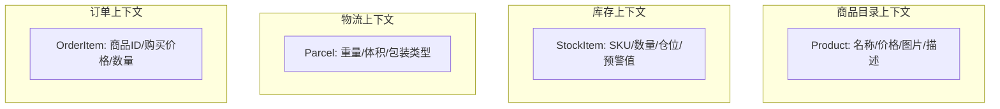
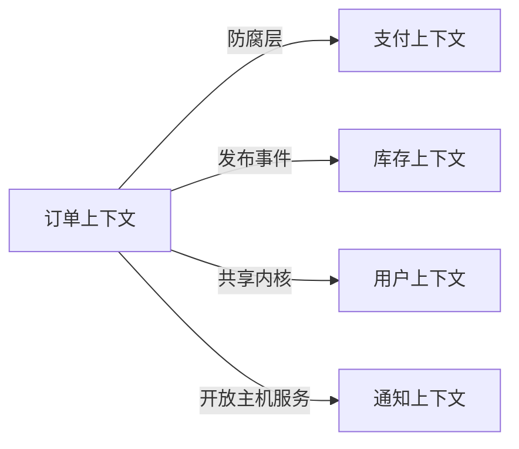

# 领域驱动设计（DDD）完全实战指南

## 引言

DDD（Domain-Driven Design，领域驱动设计）是 Eric Evans 在 2003 年提出的一套软件设计方法论。它的核心思想很简单：**软件的复杂性来源于业务本身，所以应该让代码结构反映业务结构**。

但 DDD 的落地一直是个难题。很多团队学了 DDD 之后：

- 把 Entity 和 Value Object 当 CRUD 的变种来用
- 把 Repository 写成了另一种 DAO
- Aggregate 拆得支离破碎，或者干脆整个模块一个大聚合
- Domain Event 变成了另一种回调函数

这篇文章不会重复那些书本定义。我会从"为什么需要 DDD"出发，用一个电商订单系统作为贯穿全文的案例，讲清楚每个概念在代码里到底长什么样、为什么要这样设计。

所有代码基于 .NET 8 / C# 12。

---

## 一、什么时候需要 DDD

DDD 不是银弹。它有明确的适用场景和不适用场景。

### 适合用 DDD 的场景

- **业务逻辑复杂**：规则多、状态流转多、多方协作
- **业务频繁变化**：需求每周都在调整，代码必须易于修改
- **多团队协作**：需要明确的边界来降低沟通成本
- **核心域**：系统中最关键、最有竞争力的部分

### 不适合用 DDD 的场景

- **纯 CRUD**：管理后台、数据录入系统，用不着
- **技术驱动**：算法密集型、基础设施类项目
- **原型验证**：快速试错阶段，过度设计会拖慢速度
- **团队太小**：3 人团队搞 DDD，仪式感大于收益

:::warning
判断标准很简单：如果你的 Service 层只是从 Controller 接参数、调 Repository 存数据、没有任何 if-else 业务判断——你不需要 DDD。
:::

### DDD 解决什么问题

传统三层架构（Controller → Service → Repository）在业务复杂后会退化成"贫血模型"：

```csharp
// 贫血模型：业务逻辑散落在 Service 中，Entity 只是数据容器
public class OrderService
{
    public void CancelOrder(int orderId)
    {
        var order = _repository.GetById(orderId);

        // 业务规则散落在 Service 里
        if (order.Status == OrderStatus.Shipped)
            throw new Exception("已发货不能取消");

        if (order.Status == OrderStatus.Cancelled)
            throw new Exception("已经取消过了");

        if (order.PaidAt.HasValue &&
            DateTime.UtcNow - order.PaidAt.Value > TimeSpan.FromDays(7))
            throw new Exception("支付超过 7 天不能取消");

        // 修改状态
        order.Status = OrderStatus.Cancelled;
        order.CancelledAt = DateTime.UtcNow;

        // 还要记得退库存
        foreach (var item in order.Items)
        {
            var product = _productRepository.GetById(item.ProductId);
            product.Stock += item.Quantity;
            _productRepository.Update(product);
        }

        // 还要退款
        if (order.PaidAt.HasValue)
        {
            _paymentService.Refund(order.PaymentId);
        }

        _repository.Update(order);
    }
}
```

问题在哪？

1. **Order 实体是空壳**——它不知道自己能不能被取消
2. **业务规则无法复用**——其他地方要判断"能否取消"得复制粘贴
3. **Service 越写越胖**——所有逻辑堆在一个类里，上千行
4. **测试困难**——要 mock 一堆 Repository 才能测一个业务规则

DDD 的做法是让 Entity 自己承载业务逻辑：

```csharp
// 充血模型：Entity 知道自己的规则
public class Order : AggregateRoot
{
    public void Cancel(IClock clock)
    {
        if (Status == OrderStatus.Shipped)
            throw new OrderDomainException("已发货的订单不能取消");

        if (Status == OrderStatus.Cancelled)
            throw new OrderDomainException("订单已取消，不能重复操作");

        if (PaidAt.HasValue && clock.UtcNow - PaidAt.Value > TimeSpan.FromDays(7))
            throw new OrderDomainException("支付超过 7 天的订单不能取消");

        Status = OrderStatus.Cancelled;
        CancelledAt = clock.UtcNow;

        // 发布领域事件，让其他关注方（库存、支付）自行处理
        AddDomainEvent(new OrderCancelledDomainEvent(Id, BuyerId, Items));
    }
}
```

区别一目了然：**规则跟着数据走**，而不是散落在外部 Service 里。

---

## 二、战略设计：划清边界

战略设计解决的是"系统怎么拆"的问题。在写代码之前，先把业务领域的边界画清楚。

### 2.1 统一语言（Ubiquitous Language）

DDD 的第一条原则：**开发团队和业务团队使用同一套术语**。

不是开发者自己发明数据库字段名，而是和业务方达成共识：

| 业务术语 | 代码中的命名 | 不要这样命名 |
|---------|-------------|-------------|
| 订单 | Order | OrderInfo, OrderData |
| 下单 | PlaceOrder | CreateOrder, AddOrder |
| 买家 | Buyer | User, Customer（如果业务方叫"买家"） |
| 收货地址 | ShippingAddress | Address, Addr |
| 订单项 | OrderItem | OrderDetail, OrderLine |
| 取消订单 | CancelOrder | DeleteOrder, RemoveOrder |

:::tip
判断方法：拿着你的代码去和产品经理/业务方讨论需求，如果他们能看懂方法名和类名，说明统一语言做到位了。
:::

### 2.2 限界上下文（Bounded Context）

同一个词在不同业务场景下含义不同。"商品"在商品目录中是名称+价格+图片，在库存中是SKU+数量+仓库位置，在物流中是重量+体积+包装方式。

限界上下文就是**给同一个词画出它的有效范围**：



**每个限界上下文有自己独立的模型**，它们之间通过"上下文映射"进行协作，而不是共享一个全局数据模型。

### 2.3 上下文映射（Context Mapping）

不同上下文之间的协作关系有几种模式：



| 映射模式 | 含义 | 适用场景 |
|---------|------|---------|
| 共享内核（Shared Kernel） | 两个上下文共享一小部分模型 | 紧密协作的团队 |
| 防腐层（ACL） | 翻译外部模型为内部模型 | 对接第三方或遗留系统 |
| 发布-订阅 | 通过事件异步通信 | 松耦合的上下文 |
| 开放主机服务（OHS） | 提供标准化 API | 被多个上下文依赖 |
| 客户-供应商 | 下游依赖上游，上游主导 | 有明确上下游关系 |

### 2.4 在代码中体现限界上下文

一个限界上下文对应一个独立模块（或微服务）：

```
src/
├── Ordering/           ← 订单上下文
│   ├── Ordering.Domain/
│   ├── Ordering.Application/
│   ├── Ordering.Infrastructure/
│   └── Ordering.API/
├── Catalog/            ← 商品目录上下文
│   ├── Catalog.Domain/
│   ├── Catalog.Application/
│   └── Catalog.API/
├── Inventory/          ← 库存上下文
│   └── ...
└── SharedKernel/       ← 共享内核（极少量共享代码）
    ├── Entity.cs
    ├── ValueObject.cs
    ├── DomainEvent.cs
    └── IAggregateRoot.cs
```

---

## 三、战术设计：构建领域模型

战术设计是 DDD 的代码层面。它定义了一组构建块（Building Blocks），用来实现领域逻辑。

### 3.1 实体（Entity）

**有唯一标识、生命周期内身份不变的对象。**

判断依据：两个对象即使所有属性相同，如果 ID 不同就是不同的对象——它是实体。

```csharp
// SharedKernel/Entity.cs
public abstract class Entity
{
    public int Id { get; protected set; }

    // 基于 ID 判等
    public override bool Equals(object? obj)
    {
        if (obj is not Entity other) return false;
        if (ReferenceEquals(this, other)) return true;
        if (GetType() != other.GetType()) return false;
        if (Id == default || other.Id == default) return false;
        return Id == other.Id;
    }

    public override int GetHashCode() => Id.GetHashCode();

    public static bool operator ==(Entity? left, Entity? right)
        => Equals(left, right);

    public static bool operator !=(Entity? left, Entity? right)
        => !Equals(left, right);
}
```

具体实体示例：

```csharp
// Ordering.Domain/Entities/OrderItem.cs
public class OrderItem : Entity
{
    public int ProductId { get; private set; }
    public string ProductName { get; private set; }
    public Money UnitPrice { get; private set; }
    public int Quantity { get; private set; }
    public decimal Discount { get; private set; }

    // 私有构造函数：只能通过工厂方法创建
    private OrderItem() { } // EF Core 需要

    internal OrderItem(int productId, string productName,
        Money unitPrice, int quantity, decimal discount = 0)
    {
        if (quantity <= 0)
            throw new OrderDomainException("购买数量必须大于 0");
        if (discount < 0 || discount > unitPrice.Amount * quantity)
            throw new OrderDomainException("折扣金额无效");

        ProductId = productId;
        ProductName = productName;
        UnitPrice = unitPrice;
        Quantity = quantity;
        Discount = discount;
    }

    /// <summary>
    /// 计算该订单项的实付金额
    /// </summary>
    public Money GetSubtotal()
        => new(UnitPrice.Amount * Quantity - Discount, UnitPrice.Currency);

    /// <summary>
    /// 修改数量（仅在未支付时允许）
    /// </summary>
    internal void UpdateQuantity(int newQuantity)
    {
        if (newQuantity <= 0)
            throw new OrderDomainException("数量必须大于 0");
        Quantity = newQuantity;
    }
}
```

### 3.2 值对象（Value Object）

**没有唯一标识，由属性值完全定义的对象。两个值对象只要属性相同就认为相等。**

典型例子：金额（Money）、地址（Address）、日期范围（DateRange）、坐标（Coordinate）。

```csharp
// SharedKernel/ValueObject.cs
public abstract class ValueObject
{
    protected abstract IEnumerable<object?> GetEqualityComponents();

    public override bool Equals(object? obj)
    {
        if (obj is null || obj.GetType() != GetType()) return false;
        var other = (ValueObject)obj;
        return GetEqualityComponents()
            .SequenceEqual(other.GetEqualityComponents());
    }

    public override int GetHashCode()
    {
        return GetEqualityComponents()
            .Aggregate(1, (current, obj) =>
                HashCode.Combine(current, obj?.GetHashCode() ?? 0));
    }

    public static bool operator ==(ValueObject? left, ValueObject? right)
        => Equals(left, right);

    public static bool operator !=(ValueObject? left, ValueObject? right)
        => !Equals(left, right);
}
```

具体值对象示例：

```csharp
// Ordering.Domain/ValueObjects/Money.cs
public class Money : ValueObject
{
    public decimal Amount { get; }
    public string Currency { get; }

    public Money(decimal amount, string currency)
    {
        if (amount < 0)
            throw new ArgumentException("金额不能为负数", nameof(amount));
        if (string.IsNullOrWhiteSpace(currency))
            throw new ArgumentException("货币代码不能为空", nameof(currency));

        Amount = amount;
        Currency = currency.ToUpperInvariant();
    }

    public Money Add(Money other)
    {
        EnsureSameCurrency(other);
        return new Money(Amount + other.Amount, Currency);
    }

    public Money Subtract(Money other)
    {
        EnsureSameCurrency(other);
        return new Money(Amount - other.Amount, Currency);
    }

    public Money Multiply(int factor)
        => new(Amount * factor, Currency);

    private void EnsureSameCurrency(Money other)
    {
        if (Currency != other.Currency)
            throw new InvalidOperationException(
                $"不能对不同货币进行运算: {Currency} vs {other.Currency}");
    }

    protected override IEnumerable<object?> GetEqualityComponents()
    {
        yield return Amount;
        yield return Currency;
    }

    public override string ToString() => $"{Amount:F2} {Currency}";

    // 静态工厂方法
    public static Money Zero(string currency = "CNY") => new(0, currency);
    public static Money Of(decimal amount, string currency = "CNY") => new(amount, currency);
}
```

```csharp
// Ordering.Domain/ValueObjects/Address.cs
public class Address : ValueObject
{
    public string Province { get; }
    public string City { get; }
    public string District { get; }
    public string Street { get; }
    public string ZipCode { get; }
    public string ReceiverName { get; }
    public string ReceiverPhone { get; }

    public Address(string province, string city, string district,
        string street, string zipCode, string receiverName, string receiverPhone)
    {
        if (string.IsNullOrWhiteSpace(province))
            throw new ArgumentException("省份不能为空");
        if (string.IsNullOrWhiteSpace(city))
            throw new ArgumentException("城市不能为空");
        if (string.IsNullOrWhiteSpace(street))
            throw new ArgumentException("街道地址不能为空");
        if (string.IsNullOrWhiteSpace(receiverName))
            throw new ArgumentException("收件人不能为空");
        if (string.IsNullOrWhiteSpace(receiverPhone))
            throw new ArgumentException("联系电话不能为空");

        Province = province;
        City = city;
        District = district;
        Street = street;
        ZipCode = zipCode;
        ReceiverName = receiverName;
        ReceiverPhone = receiverPhone;
    }

    public string FullAddress => $"{Province}{City}{District}{Street}";

    protected override IEnumerable<object?> GetEqualityComponents()
    {
        yield return Province;
        yield return City;
        yield return District;
        yield return Street;
        yield return ZipCode;
        yield return ReceiverName;
        yield return ReceiverPhone;
    }
}
```

:::tip
**Entity vs Value Object 速判法：**

问自己一个问题："如果两个对象的所有属性都相同，它们是同一个东西吗？"
- 是 → 值对象（两张 100 元人民币是等价的）
- 不是 → 实体（两个叫张三的人不是同一个人）
:::

### 3.3 聚合与聚合根（Aggregate & Aggregate Root）

**聚合是一组必须保持一致性的对象集合，聚合根是外部访问这个集合的唯一入口。**

这是 DDD 最核心也最容易用错的概念。

#### 聚合设计规则

1. **外部只能引用聚合根**——不能直接操作聚合内部的实体
2. **一个事务只修改一个聚合**——跨聚合用最终一致性
3. **聚合尽量小**——只包含必须保持强一致性的对象
4. **通过 ID 引用其他聚合**——不要直接持有其他聚合根的对象引用

```csharp
// Ordering.Domain/AggregateRoots/Order.cs
public class Order : AggregateRoot
{
    // === 状态 ===
    public string BuyerId { get; private set; }
    public OrderStatus Status { get; private set; }
    public Address ShippingAddress { get; private set; }
    public Money TotalAmount { get; private set; }
    public DateTime CreatedAt { get; private set; }
    public DateTime? PaidAt { get; private set; }
    public DateTime? ShippedAt { get; private set; }
    public DateTime? CancelledAt { get; private set; }
    public string? CancellationReason { get; private set; }
    public string? PaymentIntentId { get; private set; }

    // 订单项集合（聚合内部实体）
    private readonly List<OrderItem> _items = new();
    public IReadOnlyCollection<OrderItem> Items => _items.AsReadOnly();

    // === 构造函数 ===
    private Order() { } // EF Core

    public Order(string buyerId, Address shippingAddress)
    {
        if (string.IsNullOrWhiteSpace(buyerId))
            throw new OrderDomainException("买家ID不能为空");

        BuyerId = buyerId;
        ShippingAddress = shippingAddress
            ?? throw new OrderDomainException("收货地址不能为空");
        Status = OrderStatus.Draft;
        CreatedAt = DateTime.UtcNow;
        TotalAmount = Money.Zero();

        AddDomainEvent(new OrderCreatedDomainEvent(this));
    }

    // === 行为方法 ===

    /// <summary>
    /// 添加订单项
    /// </summary>
    public void AddItem(int productId, string productName,
        Money unitPrice, int quantity, decimal discount = 0)
    {
        EnsureOrderIsModifiable();

        // 如果同一商品已存在，合并数量
        var existingItem = _items.FirstOrDefault(i => i.ProductId == productId);
        if (existingItem is not null)
        {
            existingItem.UpdateQuantity(existingItem.Quantity + quantity);
        }
        else
        {
            _items.Add(new OrderItem(productId, productName,
                unitPrice, quantity, discount));
        }

        RecalculateTotal();
    }

    /// <summary>
    /// 移除订单项
    /// </summary>
    public void RemoveItem(int productId)
    {
        EnsureOrderIsModifiable();

        var item = _items.FirstOrDefault(i => i.ProductId == productId)
            ?? throw new OrderDomainException($"订单中不存在商品 {productId}");

        _items.Remove(item);
        RecalculateTotal();
    }

    /// <summary>
    /// 提交订单（从草稿变为待支付）
    /// </summary>
    public void Submit()
    {
        if (Status != OrderStatus.Draft)
            throw new OrderDomainException("只有草稿状态的订单可以提交");

        if (!_items.Any())
            throw new OrderDomainException("订单至少需要一个商品");

        Status = OrderStatus.PendingPayment;

        AddDomainEvent(new OrderSubmittedDomainEvent(Id, BuyerId,
            _items.Select(i => new OrderItemSnapshot(
                i.ProductId, i.Quantity)).ToList()));
    }

    /// <summary>
    /// 确认支付
    /// </summary>
    public void ConfirmPayment(string paymentIntentId, IClock clock)
    {
        if (Status != OrderStatus.PendingPayment)
            throw new OrderDomainException("当前状态不允许确认支付");

        if (string.IsNullOrWhiteSpace(paymentIntentId))
            throw new OrderDomainException("支付凭证不能为空");

        Status = OrderStatus.Paid;
        PaidAt = clock.UtcNow;
        PaymentIntentId = paymentIntentId;

        AddDomainEvent(new OrderPaidDomainEvent(Id, BuyerId, TotalAmount));
    }

    /// <summary>
    /// 发货
    /// </summary>
    public void Ship(string trackingNumber)
    {
        if (Status != OrderStatus.Paid)
            throw new OrderDomainException("只有已支付的订单可以发货");

        Status = OrderStatus.Shipped;
        ShippedAt = DateTime.UtcNow;

        AddDomainEvent(new OrderShippedDomainEvent(
            Id, BuyerId, trackingNumber, ShippingAddress));
    }

    /// <summary>
    /// 取消订单
    /// </summary>
    public void Cancel(string reason, IClock clock)
    {
        if (Status == OrderStatus.Shipped || Status == OrderStatus.Completed)
            throw new OrderDomainException("已发货/已完成的订单不能取消");

        if (Status == OrderStatus.Cancelled)
            throw new OrderDomainException("订单已取消");

        if (PaidAt.HasValue && clock.UtcNow - PaidAt.Value > TimeSpan.FromDays(7))
            throw new OrderDomainException("支付超过 7 天不能取消");

        var previousStatus = Status;
        Status = OrderStatus.Cancelled;
        CancelledAt = clock.UtcNow;
        CancellationReason = reason;

        AddDomainEvent(new OrderCancelledDomainEvent(
            Id, BuyerId, previousStatus, _items.ToList()));
    }

    /// <summary>
    /// 确认收货
    /// </summary>
    public void Complete()
    {
        if (Status != OrderStatus.Shipped)
            throw new OrderDomainException("只有已发货的订单可以确认收货");

        Status = OrderStatus.Completed;

        AddDomainEvent(new OrderCompletedDomainEvent(Id, BuyerId));
    }

    // === 私有方法 ===

    private void EnsureOrderIsModifiable()
    {
        if (Status != OrderStatus.Draft)
            throw new OrderDomainException("只有草稿状态的订单可以修改商品");
    }

    private void RecalculateTotal()
    {
        TotalAmount = _items.Aggregate(
            Money.Zero(),
            (sum, item) => sum.Add(item.GetSubtotal()));
    }
}
```

#### 聚合根基类

```csharp
// SharedKernel/AggregateRoot.cs
public abstract class AggregateRoot : Entity
{
    private readonly List<IDomainEvent> _domainEvents = new();
    public IReadOnlyCollection<IDomainEvent> DomainEvents
        => _domainEvents.AsReadOnly();

    protected void AddDomainEvent(IDomainEvent domainEvent)
        => _domainEvents.Add(domainEvent);

    public void ClearDomainEvents()
        => _domainEvents.Clear();
}
```

#### 订单状态枚举

```csharp
// Ordering.Domain/Enums/OrderStatus.cs
public enum OrderStatus
{
    Draft = 0,           // 草稿：正在编辑
    PendingPayment = 1,  // 待支付：已提交
    Paid = 2,            // 已支付
    Shipped = 3,         // 已发货
    Completed = 4,       // 已完成（确认收货）
    Cancelled = 5        // 已取消
}
```

### 3.4 领域事件（Domain Event）

**聚合内部发生的重要业务事实。用于解耦同一限界上下文内的副作用，以及通知其他上下文。**

```csharp
// SharedKernel/IDomainEvent.cs
public interface IDomainEvent
{
    DateTime OccurredAt { get; }
}

public abstract record DomainEvent : IDomainEvent
{
    public DateTime OccurredAt { get; init; } = DateTime.UtcNow;
}
```

定义具体事件：

```csharp
// Ordering.Domain/Events/OrderCancelledDomainEvent.cs
public record OrderCancelledDomainEvent(
    int OrderId,
    string BuyerId,
    OrderStatus PreviousStatus,
    List<OrderItem> Items) : DomainEvent;

public record OrderPaidDomainEvent(
    int OrderId,
    string BuyerId,
    Money Amount) : DomainEvent;

public record OrderSubmittedDomainEvent(
    int OrderId,
    string BuyerId,
    List<OrderItemSnapshot> Items) : DomainEvent;

public record OrderShippedDomainEvent(
    int OrderId,
    string BuyerId,
    string TrackingNumber,
    Address ShippingAddress) : DomainEvent;

public record OrderCompletedDomainEvent(
    int OrderId,
    string BuyerId) : DomainEvent;

// 快照 DTO，避免事件引用可变的实体对象
public record OrderItemSnapshot(int ProductId, int Quantity);
```

### 3.5 领域服务（Domain Service）

**当业务逻辑不属于任何一个实体/值对象时，放在领域服务中。**

典型场景：涉及多个聚合的业务规则、外部信息查询。

```csharp
// Ordering.Domain/Services/OrderPricingService.cs
public class OrderPricingService
{
    private readonly IPromotionRuleRepository _promotionRepo;

    public OrderPricingService(IPromotionRuleRepository promotionRepo)
    {
        _promotionRepo = promotionRepo;
    }

    /// <summary>
    /// 计算订单的折扣金额
    /// 这个逻辑涉及促销规则查询，不适合放在 Order 实体内部
    /// </summary>
    public async Task<Money> CalculateDiscountAsync(Order order)
    {
        var rules = await _promotionRepo.GetActiveRulesAsync();
        var totalDiscount = Money.Zero();

        foreach (var rule in rules.OrderByDescending(r => r.Priority))
        {
            if (rule.IsApplicable(order))
            {
                var discount = rule.CalculateDiscount(order);
                totalDiscount = totalDiscount.Add(discount);

                // 某些规则互斥，命中一个就停
                if (rule.IsExclusive) break;
            }
        }

        return totalDiscount;
    }
}
```

```csharp
// Ordering.Domain/Services/OrderUniquenessChecker.cs
/// <summary>
/// 检查重复下单（防重）
/// 属于领域服务：需要查询仓储，但规则本身是领域规则
/// </summary>
public class OrderUniquenessChecker
{
    private readonly IOrderRepository _orderRepo;

    public OrderUniquenessChecker(IOrderRepository orderRepo)
    {
        _orderRepo = orderRepo;
    }

    public async Task<bool> IsDuplicateAsync(
        string buyerId, List<int> productIds, TimeSpan window)
    {
        var cutoff = DateTime.UtcNow - window;

        var recentOrders = await _orderRepo
            .GetByBuyerSinceAsync(buyerId, cutoff);

        return recentOrders.Any(order =>
            order.Items.Select(i => i.ProductId)
                .OrderBy(id => id)
                .SequenceEqual(productIds.OrderBy(id => id)));
    }
}
```

:::warning
**领域服务 ≠ 应用服务。** 领域服务包含业务规则，应用服务只做编排（调用领域对象 + 基础设施）。如果你的"领域服务"里只有 `_repository.Save(entity)` 这种代码，那它其实是应用服务。
:::

### 3.6 仓储（Repository）

**为聚合根提供持久化和查询能力的抽象。**

仓储的接口定义在 Domain 层，实现在 Infrastructure 层。

```csharp
// Ordering.Domain/Repositories/IOrderRepository.cs
public interface IOrderRepository
{
    Task<Order?> GetByIdAsync(int orderId);
    Task<Order?> GetByIdWithItemsAsync(int orderId);
    Task<List<Order>> GetByBuyerSinceAsync(string buyerId, DateTime since);
    Task AddAsync(Order order);
    void Update(Order order);
    Task<int> SaveChangesAsync(CancellationToken cancellationToken = default);
}
```

EF Core 实现：

```csharp
// Ordering.Infrastructure/Repositories/OrderRepository.cs
public class OrderRepository : IOrderRepository
{
    private readonly OrderDbContext _db;

    public OrderRepository(OrderDbContext db) => _db = db;

    public async Task<Order?> GetByIdAsync(int orderId)
        => await _db.Orders.FindAsync(orderId);

    public async Task<Order?> GetByIdWithItemsAsync(int orderId)
        => await _db.Orders
            .Include(o => o.Items)
            .FirstOrDefaultAsync(o => o.Id == orderId);

    public async Task<List<Order>> GetByBuyerSinceAsync(
        string buyerId, DateTime since)
        => await _db.Orders
            .Where(o => o.BuyerId == buyerId && o.CreatedAt >= since)
            .Include(o => o.Items)
            .ToListAsync();

    public async Task AddAsync(Order order)
        => await _db.Orders.AddAsync(order);

    public void Update(Order order)
        => _db.Orders.Update(order);

    public async Task<int> SaveChangesAsync(CancellationToken cancellationToken)
        => await _db.SaveChangesAsync(cancellationToken);
}
```

:::tip
**仓储的粒度：一个聚合根对应一个仓储。** OrderItem 不需要独立的仓储，因为它属于 Order 聚合内部，只能通过 Order 来访问。
:::

---

## 四、应用层：编排业务流程

应用层的职责是**编排**——它调用领域对象执行业务逻辑，但自己不包含业务规则。

### 4.1 命令与处理器（CQRS 风格）

```csharp
// Ordering.Application/Commands/PlaceOrderCommand.cs
public record PlaceOrderCommand(
    string BuyerId,
    AddressDto ShippingAddress,
    List<OrderItemDto> Items) : IRequest<PlaceOrderResult>;

public record PlaceOrderResult(int OrderId, string Status);

public record OrderItemDto(
    int ProductId,
    string ProductName,
    decimal UnitPrice,
    int Quantity);

public record AddressDto(
    string Province,
    string City,
    string District,
    string Street,
    string ZipCode,
    string ReceiverName,
    string ReceiverPhone);
```

```csharp
// Ordering.Application/Commands/PlaceOrderCommandHandler.cs
public class PlaceOrderCommandHandler
    : IRequestHandler<PlaceOrderCommand, PlaceOrderResult>
{
    private readonly IOrderRepository _orderRepo;
    private readonly OrderUniquenessChecker _uniquenessChecker;
    private readonly OrderPricingService _pricingService;
    private readonly ILogger<PlaceOrderCommandHandler> _logger;

    public PlaceOrderCommandHandler(
        IOrderRepository orderRepo,
        OrderUniquenessChecker uniquenessChecker,
        OrderPricingService pricingService,
        ILogger<PlaceOrderCommandHandler> logger)
    {
        _orderRepo = orderRepo;
        _uniquenessChecker = uniquenessChecker;
        _pricingService = pricingService;
        _logger = logger;
    }

    public async Task<PlaceOrderResult> Handle(
        PlaceOrderCommand command, CancellationToken cancellationToken)
    {
        // 1. 防重检查（领域服务）
        var productIds = command.Items.Select(i => i.ProductId).ToList();
        var isDuplicate = await _uniquenessChecker
            .IsDuplicateAsync(command.BuyerId, productIds, TimeSpan.FromMinutes(5));

        if (isDuplicate)
            throw new ApplicationException("检测到重复下单，请勿重复提交");

        // 2. 创建订单聚合（领域对象自己保证业务规则）
        var address = new Address(
            command.ShippingAddress.Province,
            command.ShippingAddress.City,
            command.ShippingAddress.District,
            command.ShippingAddress.Street,
            command.ShippingAddress.ZipCode,
            command.ShippingAddress.ReceiverName,
            command.ShippingAddress.ReceiverPhone);

        var order = new Order(command.BuyerId, address);

        foreach (var item in command.Items)
        {
            order.AddItem(item.ProductId, item.ProductName,
                Money.Of(item.UnitPrice), item.Quantity);
        }

        // 3. 计算折扣（领域服务）
        var discount = await _pricingService.CalculateDiscountAsync(order);
        // 这里可以把折扣应用到订单...

        // 4. 提交订单
        order.Submit();

        // 5. 持久化
        await _orderRepo.AddAsync(order);
        await _orderRepo.SaveChangesAsync(cancellationToken);

        _logger.LogInformation("订单 {OrderId} 创建成功，买家: {BuyerId}",
            order.Id, command.BuyerId);

        return new PlaceOrderResult(order.Id, order.Status.ToString());
    }
}
```

### 4.2 领域事件处理器

领域事件在同一个事务中、同一个进程内处理副作用：

```csharp
// Ordering.Application/EventHandlers/OrderPaidDomainEventHandler.cs
public class OrderPaidDomainEventHandler
    : INotificationHandler<OrderPaidDomainEvent>
{
    private readonly IIntegrationEventPublisher _integrationEvents;
    private readonly ILogger<OrderPaidDomainEventHandler> _logger;

    public OrderPaidDomainEventHandler(
        IIntegrationEventPublisher integrationEvents,
        ILogger<OrderPaidDomainEventHandler> logger)
    {
        _integrationEvents = integrationEvents;
        _logger = logger;
    }

    public async Task Handle(
        OrderPaidDomainEvent notification, CancellationToken cancellationToken)
    {
        _logger.LogInformation("处理订单支付事件，订单: {OrderId}，金额: {Amount}",
            notification.OrderId, notification.Amount);

        // 将领域事件转为集成事件，发布给其他限界上下文
        await _integrationEvents.PublishAsync(
            new OrderPaidIntegrationEvent(
                notification.OrderId,
                notification.BuyerId,
                notification.Amount.Amount,
                notification.Amount.Currency),
            cancellationToken);
    }
}
```

### 4.3 分发领域事件（通过 EF Core SaveChanges 拦截）

```csharp
// Ordering.Infrastructure/DomainEventDispatcher.cs
public class DomainEventDispatcher
{
    private readonly IMediator _mediator;

    public DomainEventDispatcher(IMediator mediator)
        => _mediator = mediator;

    public async Task DispatchEventsAsync(OrderDbContext context)
    {
        // 从所有被跟踪的聚合根中收集领域事件
        var aggregatesWithEvents = context.ChangeTracker
            .Entries<AggregateRoot>()
            .Where(e => e.Entity.DomainEvents.Any())
            .Select(e => e.Entity)
            .ToList();

        var domainEvents = aggregatesWithEvents
            .SelectMany(a => a.DomainEvents)
            .ToList();

        // 先清除事件（避免重复发布）
        aggregatesWithEvents.ForEach(a => a.ClearDomainEvents());

        // 逐一发布
        foreach (var domainEvent in domainEvents)
        {
            await _mediator.Publish(domainEvent);
        }
    }
}

// 重写 SaveChangesAsync 来自动分发事件
public class OrderDbContext : DbContext
{
    private readonly DomainEventDispatcher _dispatcher;

    public OrderDbContext(
        DbContextOptions<OrderDbContext> options,
        DomainEventDispatcher dispatcher) : base(options)
    {
        _dispatcher = dispatcher;
    }

    public DbSet<Order> Orders => Set<Order>();

    public override async Task<int> SaveChangesAsync(
        CancellationToken cancellationToken = default)
    {
        // 保存前分发领域事件（同一个事务内）
        await _dispatcher.DispatchEventsAsync(this);

        return await base.SaveChangesAsync(cancellationToken);
    }

    protected override void OnModelCreating(ModelBuilder modelBuilder)
    {
        modelBuilder.ApplyConfigurationsFromAssembly(
            typeof(OrderDbContext).Assembly);
    }
}
```

---

## 五、EF Core 映射配置

DDD 的领域模型和数据库模型是分离的。EF Core 的 Fluent API 负责桥接两者。

### 5.1 聚合根映射

```csharp
// Ordering.Infrastructure/EntityConfigurations/OrderConfiguration.cs
public class OrderConfiguration : IEntityTypeConfiguration<Order>
{
    public void Configure(EntityTypeBuilder<Order> builder)
    {
        builder.ToTable("orders");
        builder.HasKey(o => o.Id);

        // === 基础字段 ===
        builder.Property(o => o.BuyerId)
            .HasMaxLength(64)
            .IsRequired();

        builder.Property(o => o.Status)
            .HasConversion<string>()
            .HasMaxLength(32)
            .IsRequired();

        builder.Property(o => o.CreatedAt)
            .IsRequired();

        builder.Property(o => o.PaymentIntentId)
            .HasMaxLength(128);

        builder.Property(o => o.CancellationReason)
            .HasMaxLength(500);

        // === 值对象映射：Address ===
        builder.OwnsOne(o => o.ShippingAddress, address =>
        {
            address.Property(a => a.Province).HasColumnName("shipping_province")
                .HasMaxLength(32).IsRequired();
            address.Property(a => a.City).HasColumnName("shipping_city")
                .HasMaxLength(32).IsRequired();
            address.Property(a => a.District).HasColumnName("shipping_district")
                .HasMaxLength(64);
            address.Property(a => a.Street).HasColumnName("shipping_street")
                .HasMaxLength(256).IsRequired();
            address.Property(a => a.ZipCode).HasColumnName("shipping_zipcode")
                .HasMaxLength(16);
            address.Property(a => a.ReceiverName).HasColumnName("receiver_name")
                .HasMaxLength(64).IsRequired();
            address.Property(a => a.ReceiverPhone).HasColumnName("receiver_phone")
                .HasMaxLength(32).IsRequired();
        });

        // === 值对象映射：Money ===
        builder.OwnsOne(o => o.TotalAmount, money =>
        {
            money.Property(m => m.Amount).HasColumnName("total_amount")
                .HasPrecision(18, 2).IsRequired();
            money.Property(m => m.Currency).HasColumnName("currency")
                .HasMaxLength(3).IsRequired();
        });

        // === 导航属性：OrderItems ===
        builder.HasMany(o => o.Items)
            .WithOne()
            .HasForeignKey("OrderId")
            .OnDelete(DeleteBehavior.Cascade);

        // === 访问私有字段 ===
        builder.Metadata.FindNavigation(nameof(Order.Items))!
            .SetPropertyAccessMode(PropertyAccessMode.Field);

        // === 索引 ===
        builder.HasIndex(o => o.BuyerId);
        builder.HasIndex(o => o.Status);
        builder.HasIndex(o => o.CreatedAt);

        // === 忽略领域事件（不映射到数据库）===
        builder.Ignore(o => o.DomainEvents);
    }
}
```

### 5.2 订单项映射

```csharp
// Ordering.Infrastructure/EntityConfigurations/OrderItemConfiguration.cs
public class OrderItemConfiguration : IEntityTypeConfiguration<OrderItem>
{
    public void Configure(EntityTypeBuilder<OrderItem> builder)
    {
        builder.ToTable("order_items");
        builder.HasKey(i => i.Id);

        builder.Property(i => i.ProductId).IsRequired();

        builder.Property(i => i.ProductName)
            .HasMaxLength(256)
            .IsRequired();

        builder.Property(i => i.Quantity).IsRequired();

        builder.Property(i => i.Discount)
            .HasPrecision(18, 2);

        // 值对象：UnitPrice
        builder.OwnsOne(i => i.UnitPrice, money =>
        {
            money.Property(m => m.Amount).HasColumnName("unit_price")
                .HasPrecision(18, 2).IsRequired();
            money.Property(m => m.Currency).HasColumnName("price_currency")
                .HasMaxLength(3).IsRequired();
        });

        builder.HasIndex(i => i.ProductId);
    }
}
```

:::note
**`OwnsOne` 的本质**：EF Core 把值对象的属性展平到宿主表中（或用 `ToTable` 拆到独立表）。值对象在数据库层面不是独立实体，它和宿主共生。
:::

---

## 六、规约模式（Specification Pattern）

当查询条件复杂、需要复用、或者需要在领域层表达"什么样的订单满足某个条件"时，用规约模式。

### 6.1 规约基类

```csharp
// SharedKernel/Specification.cs
using System.Linq.Expressions;

public abstract class Specification<T>
{
    public abstract Expression<Func<T, bool>> ToExpression();

    public bool IsSatisfiedBy(T entity)
    {
        var predicate = ToExpression().Compile();
        return predicate(entity);
    }

    // 组合规约
    public Specification<T> And(Specification<T> other)
        => new AndSpecification<T>(this, other);

    public Specification<T> Or(Specification<T> other)
        => new OrSpecification<T>(this, other);

    public Specification<T> Not()
        => new NotSpecification<T>(this);
}

// 组合实现
internal class AndSpecification<T> : Specification<T>
{
    private readonly Specification<T> _left;
    private readonly Specification<T> _right;

    public AndSpecification(Specification<T> left, Specification<T> right)
    {
        _left = left;
        _right = right;
    }

    public override Expression<Func<T, bool>> ToExpression()
    {
        var leftExpr = _left.ToExpression();
        var rightExpr = _right.ToExpression();
        var param = Expression.Parameter(typeof(T));

        var body = Expression.AndAlso(
            Expression.Invoke(leftExpr, param),
            Expression.Invoke(rightExpr, param));

        return Expression.Lambda<Func<T, bool>>(body, param);
    }
}

internal class OrSpecification<T> : Specification<T>
{
    private readonly Specification<T> _left;
    private readonly Specification<T> _right;

    public OrSpecification(Specification<T> left, Specification<T> right)
    {
        _left = left;
        _right = right;
    }

    public override Expression<Func<T, bool>> ToExpression()
    {
        var leftExpr = _left.ToExpression();
        var rightExpr = _right.ToExpression();
        var param = Expression.Parameter(typeof(T));

        var body = Expression.OrElse(
            Expression.Invoke(leftExpr, param),
            Expression.Invoke(rightExpr, param));

        return Expression.Lambda<Func<T, bool>>(body, param);
    }
}

internal class NotSpecification<T> : Specification<T>
{
    private readonly Specification<T> _spec;

    public NotSpecification(Specification<T> spec) => _spec = spec;

    public override Expression<Func<T, bool>> ToExpression()
    {
        var expr = _spec.ToExpression();
        var param = Expression.Parameter(typeof(T));
        var body = Expression.Not(Expression.Invoke(expr, param));
        return Expression.Lambda<Func<T, bool>>(body, param);
    }
}
```

### 6.2 业务规约示例

```csharp
// Ordering.Domain/Specifications/OrderSpecifications.cs

/// <summary>
/// 可取消的订单
/// </summary>
public class CancellableOrderSpec : Specification<Order>
{
    private readonly IClock _clock;

    public CancellableOrderSpec(IClock clock) => _clock = clock;

    public override Expression<Func<Order, bool>> ToExpression()
    {
        var now = _clock.UtcNow;
        var sevenDaysAgo = now.AddDays(-7);

        return order =>
            order.Status != OrderStatus.Shipped &&
            order.Status != OrderStatus.Completed &&
            order.Status != OrderStatus.Cancelled &&
            (!order.PaidAt.HasValue || order.PaidAt.Value > sevenDaysAgo);
    }
}

/// <summary>
/// 某买家的待支付订单
/// </summary>
public class BuyerPendingPaymentOrderSpec : Specification<Order>
{
    private readonly string _buyerId;

    public BuyerPendingPaymentOrderSpec(string buyerId) => _buyerId = buyerId;

    public override Expression<Func<Order, bool>> ToExpression()
        => order => order.BuyerId == _buyerId
                 && order.Status == OrderStatus.PendingPayment;
}

/// <summary>
/// 超时未支付的订单（超过 30 分钟）
/// </summary>
public class ExpiredUnpaidOrderSpec : Specification<Order>
{
    private readonly IClock _clock;

    public ExpiredUnpaidOrderSpec(IClock clock) => _clock = clock;

    public override Expression<Func<Order, bool>> ToExpression()
    {
        var cutoff = _clock.UtcNow.AddMinutes(-30);
        return order =>
            order.Status == OrderStatus.PendingPayment &&
            order.CreatedAt < cutoff;
    }
}
```

### 6.3 在仓储中使用规约

```csharp
// 仓储接口扩展
public interface IOrderRepository
{
    // ... 其他方法
    Task<List<Order>> FindAsync(Specification<Order> spec);
    Task<int> CountAsync(Specification<Order> spec);
}

// 实现
public class OrderRepository : IOrderRepository
{
    public async Task<List<Order>> FindAsync(Specification<Order> spec)
        => await _db.Orders
            .Where(spec.ToExpression())
            .ToListAsync();

    public async Task<int> CountAsync(Specification<Order> spec)
        => await _db.Orders
            .CountAsync(spec.ToExpression());
}

// 使用示例：关闭超时未支付订单的后台任务
public class CloseExpiredOrdersJob : BackgroundService
{
    protected override async Task ExecuteAsync(CancellationToken stoppingToken)
    {
        while (!stoppingToken.IsCancellationRequested)
        {
            using var scope = _scopeFactory.CreateScope();
            var repo = scope.ServiceProvider.GetRequiredService<IOrderRepository>();
            var clock = scope.ServiceProvider.GetRequiredService<IClock>();

            var spec = new ExpiredUnpaidOrderSpec(clock);
            var expiredOrders = await repo.FindAsync(spec);

            foreach (var order in expiredOrders)
            {
                order.Cancel("超时未支付，系统自动关闭", clock);
            }

            await repo.SaveChangesAsync(stoppingToken);
            await Task.Delay(TimeSpan.FromMinutes(1), stoppingToken);
        }
    }
}
```

---

## 七、防腐层（Anti-Corruption Layer）

当你的领域需要和外部系统（第三方支付、遗留系统、其他上下文）交互时，不要让外部的模型"污染"你的领域模型。用防腐层做翻译。

### 7.1 支付网关防腐层

```csharp
// Ordering.Domain/Ports/IPaymentGateway.cs（领域层定义接口）
public interface IPaymentGateway
{
    /// <summary>
    /// 创建支付意图
    /// </summary>
    Task<PaymentIntent> CreatePaymentIntentAsync(
        Money amount, string buyerId, int orderId);

    /// <summary>
    /// 退款
    /// </summary>
    Task<RefundResult> RefundAsync(string paymentIntentId, Money amount);
}

// 领域层的支付概念（干净的领域模型）
public record PaymentIntent(string IntentId, string Status, Money Amount);
public record RefundResult(bool Success, string? RefundId, string? ErrorMessage);
```

```csharp
// Ordering.Infrastructure/ExternalServices/StripePaymentGateway.cs
// 防腐层实现：将 Stripe 的复杂 SDK 模型翻译为领域模型
using Stripe;

public class StripePaymentGateway : IPaymentGateway
{
    private readonly PaymentIntentService _stripeService;
    private readonly RefundService _refundService;
    private readonly ILogger<StripePaymentGateway> _logger;

    public StripePaymentGateway(
        PaymentIntentService stripeService,
        RefundService refundService,
        ILogger<StripePaymentGateway> logger)
    {
        _stripeService = stripeService;
        _refundService = refundService;
        _logger = logger;
    }

    public async Task<PaymentIntent> CreatePaymentIntentAsync(
        Money amount, string buyerId, int orderId)
    {
        // Stripe SDK 的模型（外部模型）
        var options = new PaymentIntentCreateOptions
        {
            Amount = (long)(amount.Amount * 100), // Stripe 用分为单位
            Currency = amount.Currency.ToLower(),
            Metadata = new Dictionary<string, string>
            {
                ["buyer_id"] = buyerId,
                ["order_id"] = orderId.ToString()
            }
        };

        var stripeIntent = await _stripeService.CreateAsync(options);

        // 翻译为领域模型（内部模型）
        return new PaymentIntent(
            stripeIntent.Id,
            MapStatus(stripeIntent.Status),
            amount);
    }

    public async Task<RefundResult> RefundAsync(
        string paymentIntentId, Money amount)
    {
        try
        {
            var options = new RefundCreateOptions
            {
                PaymentIntent = paymentIntentId,
                Amount = (long)(amount.Amount * 100)
            };

            var stripeRefund = await _refundService.CreateAsync(options);

            return new RefundResult(
                stripeRefund.Status == "succeeded",
                stripeRefund.Id,
                null);
        }
        catch (StripeException ex)
        {
            _logger.LogError(ex, "Stripe 退款失败: {PaymentIntentId}",
                paymentIntentId);

            return new RefundResult(false, null, ex.Message);
        }
    }

    private static string MapStatus(string stripeStatus) => stripeStatus switch
    {
        "requires_payment_method" => "pending",
        "requires_confirmation" => "pending",
        "succeeded" => "completed",
        "canceled" => "cancelled",
        _ => "unknown"
    };
}
```

:::tip
**防腐层的核心价值**：当 Stripe 更换 SDK 版本、或者你换成支付宝时，只需要改 Infrastructure 层的实现，Domain 层一行代码都不用动。
:::

---

## 八、分层架构总览

把所有层串起来看：

```
┌──────────────────────────────────────────────────────────────┐
│                         API 层                                │
│  Controllers / Minimal APIs / GraphQL Resolvers              │
│  职责：HTTP 协议处理、参数验证、DTO 转换                       │
├──────────────────────────────────────────────────────────────┤
│                       Application 层                          │
│  Commands / Queries / Event Handlers / DTOs                  │
│  职责：用例编排、事务管理、调用领域对象                         │
├──────────────────────────────────────────────────────────────┤
│                        Domain 层                             │
│  Entities / Value Objects / Aggregates / Domain Events       │
│  Domain Services / Specifications / Repository 接口          │
│  职责：核心业务逻辑、领域规则、不依赖任何外部框架              │
├──────────────────────────────────────────────────────────────┤
│                     Infrastructure 层                         │
│  EF Core / Redis / MQ / External APIs / Repository 实现      │
│  职责：技术细节实现、持久化、外部系统集成                      │
└──────────────────────────────────────────────────────────────┘
```

**依赖方向**：API → Application → Domain ← Infrastructure

Domain 层不依赖任何其他层。Infrastructure 依赖 Domain（实现其接口）。这是**依赖倒置原则**的体现。

### 项目引用关系

```xml
<!-- Ordering.Domain.csproj：不引用任何项目 -->
<Project Sdk="Microsoft.NET.Sdk">
  <PropertyGroup>
    <TargetFramework>net8.0</TargetFramework>
  </PropertyGroup>
  <!-- 只允许引用极少量的纯抽象包 -->
  <ItemGroup>
    <PackageReference Include="MediatR.Contracts" Version="2.0.0" />
  </ItemGroup>
</Project>

<!-- Ordering.Application.csproj：引用 Domain -->
<Project Sdk="Microsoft.NET.Sdk">
  <ItemGroup>
    <ProjectReference Include="..\Ordering.Domain\Ordering.Domain.csproj" />
  </ItemGroup>
  <ItemGroup>
    <PackageReference Include="MediatR" Version="12.2.0" />
    <PackageReference Include="FluentValidation" Version="11.9.0" />
  </ItemGroup>
</Project>

<!-- Ordering.Infrastructure.csproj：引用 Domain + Application -->
<Project Sdk="Microsoft.NET.Sdk">
  <ItemGroup>
    <ProjectReference Include="..\Ordering.Domain\Ordering.Domain.csproj" />
    <ProjectReference Include="..\Ordering.Application\Ordering.Application.csproj" />
  </ItemGroup>
  <ItemGroup>
    <PackageReference Include="Microsoft.EntityFrameworkCore" Version="8.0.0" />
    <PackageReference Include="Npgsql.EntityFrameworkCore.PostgreSQL" Version="8.0.0" />
  </ItemGroup>
</Project>

<!-- Ordering.API.csproj：引用所有层 -->
<Project Sdk="Microsoft.NET.Sdk.Web">
  <ItemGroup>
    <ProjectReference Include="..\Ordering.Application\Ordering.Application.csproj" />
    <ProjectReference Include="..\Ordering.Infrastructure\Ordering.Infrastructure.csproj" />
  </ItemGroup>
</Project>
```

---

## 九、领域异常处理

领域层应该抛出自己的异常类型，而不是用通用的 `Exception`：

```csharp
// Ordering.Domain/Exceptions/OrderDomainException.cs
/// <summary>
/// 表示订单领域规则被违反
/// </summary>
public class OrderDomainException : Exception
{
    public OrderDomainException(string message) : base(message) { }

    public OrderDomainException(string message, Exception innerException)
        : base(message, innerException) { }
}
```

在 API 层统一处理领域异常：

```csharp
// Ordering.API/Middleware/DomainExceptionMiddleware.cs
public class DomainExceptionMiddleware
{
    private readonly RequestDelegate _next;
    private readonly ILogger<DomainExceptionMiddleware> _logger;

    public DomainExceptionMiddleware(
        RequestDelegate next, ILogger<DomainExceptionMiddleware> logger)
    {
        _next = next;
        _logger = logger;
    }

    public async Task InvokeAsync(HttpContext context)
    {
        try
        {
            await _next(context);
        }
        catch (OrderDomainException ex)
        {
            // 领域规则违反 → 400 Bad Request
            _logger.LogWarning("领域规则违反: {Message}", ex.Message);
            context.Response.StatusCode = StatusCodes.Status400BadRequest;
            await context.Response.WriteAsJsonAsync(new ProblemDetails
            {
                Status = 400,
                Title = "业务规则校验失败",
                Detail = ex.Message,
                Type = "https://api.example.com/errors/domain-rule-violation"
            });
        }
        catch (EntityNotFoundException ex)
        {
            // 实体不存在 → 404
            context.Response.StatusCode = StatusCodes.Status404NotFound;
            await context.Response.WriteAsJsonAsync(new ProblemDetails
            {
                Status = 404,
                Title = "资源不存在",
                Detail = ex.Message
            });
        }
    }
}
```

---

## 十、完整项目的依赖注入配置

```csharp
// Ordering.API/Program.cs
var builder = WebApplication.CreateBuilder(args);

// === Domain Services ===
builder.Services.AddScoped<OrderPricingService>();
builder.Services.AddScoped<OrderUniquenessChecker>();

// === Application: MediatR ===
builder.Services.AddMediatR(cfg =>
{
    cfg.RegisterServicesFromAssemblyContaining<PlaceOrderCommandHandler>();
});

// === Application: Validation Pipeline ===
builder.Services.AddTransient(
    typeof(IPipelineBehavior<,>),
    typeof(ValidationBehavior<,>));

builder.Services.AddValidatorsFromAssemblyContaining<PlaceOrderCommandValidator>();

// === Infrastructure: EF Core ===
builder.Services.AddDbContext<OrderDbContext>(options =>
    options.UseNpgsql(builder.Configuration.GetConnectionString("OrderingDb")));

// === Infrastructure: Repositories ===
builder.Services.AddScoped<IOrderRepository, OrderRepository>();

// === Infrastructure: External Services (ACL) ===
builder.Services.AddScoped<IPaymentGateway, StripePaymentGateway>();

// === Infrastructure: Domain Event Dispatcher ===
builder.Services.AddScoped<DomainEventDispatcher>();

// === Infrastructure: Clock ===
builder.Services.AddSingleton<IClock, SystemClock>();

// === API ===
builder.Services.AddControllers();

var app = builder.Build();

app.UseMiddleware<DomainExceptionMiddleware>();
app.MapControllers();

app.Run();
```

验证行为管道（拦截请求，在 Handler 之前执行验证）：

```csharp
// Ordering.Application/Behaviors/ValidationBehavior.cs
public class ValidationBehavior<TRequest, TResponse>
    : IPipelineBehavior<TRequest, TResponse>
    where TRequest : IRequest<TResponse>
{
    private readonly IEnumerable<IValidator<TRequest>> _validators;

    public ValidationBehavior(IEnumerable<IValidator<TRequest>> validators)
        => _validators = validators;

    public async Task<TResponse> Handle(
        TRequest request,
        RequestHandlerDelegate<TResponse> next,
        CancellationToken cancellationToken)
    {
        if (!_validators.Any())
            return await next();

        var context = new ValidationContext<TRequest>(request);
        var failures = (await Task.WhenAll(
            _validators.Select(v => v.ValidateAsync(context, cancellationToken))))
            .SelectMany(r => r.Errors)
            .Where(f => f is not null)
            .ToList();

        if (failures.Count != 0)
            throw new ValidationException(failures);

        return await next();
    }
}
```

---

## 十一、测试策略

DDD 的一大优势是**领域层极易测试**——不依赖数据库、HTTP、消息队列，纯内存操作。

### 11.1 领域模型单元测试

```csharp
public class OrderTests
{
    private readonly FakeClock _clock = new(new DateTime(2026, 5, 1, 12, 0, 0));

    private Order CreateValidOrder()
    {
        var address = new Address("北京", "北京", "海淀区",
            "中关村大街1号", "100080", "张三", "13800138000");
        var order = new Order("buyer-001", address);
        order.AddItem(1, "机械键盘", Money.Of(299), 1);
        return order;
    }

    [Fact]
    public void Submit_WithItems_ChangesStatusToPendingPayment()
    {
        var order = CreateValidOrder();

        order.Submit();

        Assert.Equal(OrderStatus.PendingPayment, order.Status);
    }

    [Fact]
    public void Submit_WithoutItems_ThrowsDomainException()
    {
        var address = new Address("北京", "北京", "海淀区",
            "中关村大街1号", "100080", "张三", "13800138000");
        var order = new Order("buyer-001", address);

        var ex = Assert.Throws<OrderDomainException>(() => order.Submit());
        Assert.Contains("至少需要一个商品", ex.Message);
    }

    [Fact]
    public void Cancel_WhenShipped_ThrowsDomainException()
    {
        var order = CreateValidOrder();
        order.Submit();
        order.ConfirmPayment("pi_123", _clock);
        order.Ship("SF123456");

        var ex = Assert.Throws<OrderDomainException>(
            () => order.Cancel("不想要了", _clock));
        Assert.Contains("不能取消", ex.Message);
    }

    [Fact]
    public void Cancel_WhenPaidOverSevenDays_ThrowsDomainException()
    {
        var order = CreateValidOrder();
        order.Submit();
        order.ConfirmPayment("pi_123", _clock);

        // 时间快进 8 天
        var laterClock = new FakeClock(_clock.UtcNow.AddDays(8));

        var ex = Assert.Throws<OrderDomainException>(
            () => order.Cancel("不想要了", laterClock));
        Assert.Contains("7 天", ex.Message);
    }

    [Fact]
    public void Cancel_EmitsOrderCancelledEvent()
    {
        var order = CreateValidOrder();
        order.Submit();

        order.Cancel("不想要了", _clock);

        var @event = order.DomainEvents
            .OfType<OrderCancelledDomainEvent>()
            .SingleOrDefault();

        Assert.NotNull(@event);
        Assert.Equal("buyer-001", @event.BuyerId);
    }

    [Fact]
    public void AddItem_SameProduct_MergesQuantity()
    {
        var order = CreateValidOrder(); // 已有 1 个键盘
        order.AddItem(1, "机械键盘", Money.Of(299), 2);

        Assert.Single(order.Items);
        Assert.Equal(3, order.Items.First().Quantity);
    }

    [Fact]
    public void TotalAmount_CalculatesCorrectly()
    {
        var address = new Address("北京", "北京", "海淀区",
            "中关村大街1号", "100080", "张三", "13800138000");
        var order = new Order("buyer-001", address);

        order.AddItem(1, "键盘", Money.Of(299), 2);    // 598
        order.AddItem(2, "鼠标", Money.Of(149), 1);    // 149

        Assert.Equal(747m, order.TotalAmount.Amount);
    }
}
```

### 11.2 值对象测试

```csharp
public class MoneyTests
{
    [Fact]
    public void SameAmountAndCurrency_AreEqual()
    {
        var m1 = Money.Of(100, "CNY");
        var m2 = Money.Of(100, "CNY");

        Assert.Equal(m1, m2);
        Assert.True(m1 == m2);
    }

    [Fact]
    public void DifferentCurrency_AreNotEqual()
    {
        var cny = Money.Of(100, "CNY");
        var usd = Money.Of(100, "USD");

        Assert.NotEqual(cny, usd);
    }

    [Fact]
    public void Add_DifferentCurrency_Throws()
    {
        var cny = Money.Of(100, "CNY");
        var usd = Money.Of(50, "USD");

        Assert.Throws<InvalidOperationException>(() => cny.Add(usd));
    }

    [Fact]
    public void Negative_Amount_Throws()
    {
        Assert.Throws<ArgumentException>(() => Money.Of(-1, "CNY"));
    }
}

public class AddressTests
{
    [Fact]
    public void SameProperties_AreEqual()
    {
        var a1 = new Address("北京", "北京", "海淀区",
            "中关村大街1号", "100080", "张三", "13800138000");
        var a2 = new Address("北京", "北京", "海淀区",
            "中关村大街1号", "100080", "张三", "13800138000");

        Assert.Equal(a1, a2);
    }

    [Fact]
    public void EmptyProvince_Throws()
    {
        Assert.Throws<ArgumentException>(() =>
            new Address("", "北京", "海淀区",
                "中关村大街1号", "100080", "张三", "13800138000"));
    }
}
```

### 11.3 规约测试

```csharp
public class SpecificationTests
{
    private readonly FakeClock _clock = new(new DateTime(2026, 5, 1));

    [Fact]
    public void CancellableOrderSpec_ExcludesShippedOrders()
    {
        var order = CreateOrderWithStatus(OrderStatus.Shipped);
        var spec = new CancellableOrderSpec(_clock);

        Assert.False(spec.IsSatisfiedBy(order));
    }

    [Fact]
    public void ExpiredUnpaidOrderSpec_IncludesOldPendingOrders()
    {
        var order = CreateOrderWithCreatedAt(
            _clock.UtcNow.AddMinutes(-45),
            OrderStatus.PendingPayment);

        var spec = new ExpiredUnpaidOrderSpec(_clock);

        Assert.True(spec.IsSatisfiedBy(order));
    }
}
```

---

## 十二、常见反模式与纠正

### 反模式 1：贫血领域模型

```csharp
// ❌ Entity 只有 getter/setter，没有行为
public class Order
{
    public int Id { get; set; }
    public string Status { get; set; }  // 任何人都能随意改状态
    public List<OrderItem> Items { get; set; }
}

// "业务逻辑"全在 Service 里
public class OrderService
{
    public void Cancel(Order order) { order.Status = "Cancelled"; }
}
```

```csharp
// ✅ Entity 封装自己的规则
public class Order : AggregateRoot
{
    public OrderStatus Status { get; private set; } // 外部只读

    public void Cancel(string reason, IClock clock)
    {
        // 规则在实体内部
        if (Status == OrderStatus.Shipped)
            throw new OrderDomainException("已发货不能取消");
        Status = OrderStatus.Cancelled;
    }
}
```

### 反模式 2：聚合太大

```csharp
// ❌ 把整个电商系统塞进一个聚合
public class Order : AggregateRoot
{
    public Buyer Buyer { get; set; }          // 应该通过 BuyerId 引用
    public Product Product { get; set; }      // 应该通过 ProductId 引用
    public Payment Payment { get; set; }      // 应该是独立聚合
    public Shipment Shipment { get; set; }    // 应该是独立聚合
    public Review Review { get; set; }        // 应该是独立聚合
}
```

```csharp
// ✅ 聚合只包含必须强一致的数据
public class Order : AggregateRoot
{
    public string BuyerId { get; private set; }     // 通过 ID 引用
    public List<OrderItem> Items { get; }           // 必须和订单一起一致
    public Address ShippingAddress { get; }         // 值对象，属于订单
    // Payment、Shipment、Review 是独立聚合，通过事件协作
}
```

### 反模式 3：仓储暴露 IQueryable

```csharp
// ❌ 这等于把 EF Core 的实现细节泄露给领域层
public interface IOrderRepository
{
    IQueryable<Order> GetAll(); // 调用方可以写任意 LINQ
}
```

```csharp
// ✅ 仓储接口只暴露有业务含义的方法
public interface IOrderRepository
{
    Task<Order?> GetByIdAsync(int id);
    Task<List<Order>> FindAsync(Specification<Order> spec);
    Task AddAsync(Order order);
}
```

### 反模式 4：领域层引用框架

```csharp
// ❌ Domain 层依赖 EF Core
using Microsoft.EntityFrameworkCore; // 不应该出现

public class Order
{
    [Required]
    [MaxLength(64)]
    public string BuyerId { get; set; }  // 数据注解属于基础设施
}
```

```csharp
// ✅ Domain 层零框架依赖，映射配置放 Infrastructure
public class Order
{
    public string BuyerId { get; private set; }
    // 验证规则用代码表达，不用 Attribute
    public Order(string buyerId)
    {
        if (string.IsNullOrWhiteSpace(buyerId))
            throw new OrderDomainException("买家ID不能为空");
        BuyerId = buyerId;
    }
}
```

### 反模式 5：跨聚合直接修改

```csharp
// ❌ 在一个事务中修改多个聚合
public class OrderService
{
    public void CancelOrder(int orderId)
    {
        var order = _orderRepo.GetById(orderId);
        order.Cancel();

        // 直接改另一个聚合的数据！违反"一个事务一个聚合"
        foreach (var item in order.Items)
        {
            var product = _productRepo.GetById(item.ProductId);
            product.Stock += item.Quantity;
        }

        _unitOfWork.SaveChanges(); // 两个聚合在同一事务
    }
}
```

```csharp
// ✅ 通过领域事件异步协作
public class Order : AggregateRoot
{
    public void Cancel(string reason, IClock clock)
    {
        Status = OrderStatus.Cancelled;
        // 发事件，让库存上下文自己处理
        AddDomainEvent(new OrderCancelledDomainEvent(Id, BuyerId, Items));
    }
}

// 库存上下文订阅事件，在自己的事务中恢复库存
public class OrderCancelledEventHandler
{
    public async Task Handle(OrderCancelledIntegrationEvent @event)
    {
        foreach (var item in @event.Items)
        {
            var stock = await _stockRepo.GetByProductIdAsync(item.ProductId);
            stock.Restore(item.Quantity);
        }
        await _stockRepo.SaveChangesAsync();
    }
}
```

---

## 十三、DDD 实施路线图

如果你决定在项目中引入 DDD，建议按这个顺序：

### 第一步：统一语言（0 代码）

和业务方一起梳理术语表，画出核心业务流程。产出物是一张**领域词汇表**和**业务流程图**。

### 第二步：识别限界上下文

根据业务边界划分上下文，明确每个上下文的职责和它们之间的关系。产出物是**上下文映射图**。

### 第三步：只在核心域用 DDD

不要全面推行。识别出系统中最复杂、最有业务价值的部分（核心域），只在那里用 DDD。支撑域和通用域可以继续用简单的 CRUD。

### 第四步：从聚合设计开始

在核心域内，识别聚合根，定义聚合边界。这一步决定了数据一致性边界和事务边界。

### 第五步：逐步演进

不要试图一次把所有战术模式都用上。先把 Entity + Value Object + Aggregate Root 用好，再引入 Domain Event、Specification 等。

:::warning
**最重要的忠告**：DDD 是为了驯服复杂性，不是为了增加复杂性。如果引入 DDD 后代码更难理解了，说明用法有问题——要么业务不够复杂不需要 DDD，要么你的 DDD 实践偏离了本意。
:::

---

## 总结

DDD 的核心要点一张表：

| 概念 | 核心思想 | 代码体现 |
|------|---------|---------|
| 统一语言 | 代码即业务文档 | 类名/方法名 = 业务术语 |
| 限界上下文 | 模型只在边界内有效 | 独立项目/模块，独立数据库 |
| 实体 | 有唯一标识 | 基于 ID 判等，有行为方法 |
| 值对象 | 由属性定义相等 | 不可变，属性判等 |
| 聚合根 | 一致性边界的入口 | 对外唯一操作入口，一事务一聚合 |
| 领域事件 | 已发生的业务事实 | 聚合内发布，Handler 处理副作用 |
| 领域服务 | 不属于单个实体的逻辑 | 无状态，操作多个对象 |
| 仓储 | 聚合的持久化抽象 | 接口在 Domain，实现在 Infrastructure |
| 规约 | 可复用的查询/验证条件 | `Specification<T>` + 表达式树 |
| 防腐层 | 隔离外部模型污染 | 翻译外部 ↔ 内部模型 |

记住：DDD 的目标不是写出"符合 DDD 标准"的代码，而是写出**能准确表达业务意图、容易被团队理解和修改**的代码。如果做到了这一点，就算你没用 DDD 的全部模式，你也在做领域驱动设计。
