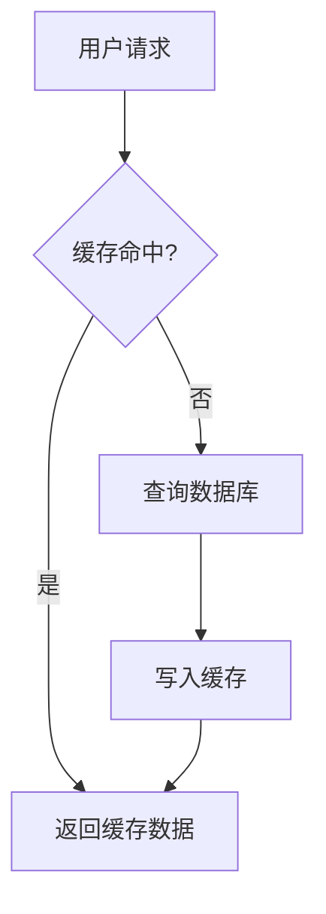

<ProgressIndicator
  current="demo/components-showcase"
  items={[
    { slug: "demo/components-showcase", title: "组件展示" },
    { slug: "demo/admonitions-deep", title: "告示块详解" },
    { slug: "demo/code-features", title: "代码功能" },
    { slug: "demo/details-syntax", title: "折叠语法" },
    { slug: "demo/code-tabs", title: "代码切换" },
    { slug: "demo/code-annotation", title: "代码注解" },
    { slug: "demo/steps-guide", title: "步骤引导" },
    { slug: "demo/file-tree", title: "文件树" },
    { slug: "demo/diff-compare", title: "代码对比" },
    { slug: "demo/glossary-tips", title: "术语提示" },
    { slug: "demo/progress-nav", title: "进度导航" },
    { slug: "demo/interactive-html", title: "交互组件" },
    { slug: "demo/codepen-demo", title: "CodePen" },
    { slug: "demo/sql-simulator", title: "SQL模拟" },
    { slug: "demo/function-plot", title: "函数绘图" },
    { slug: "demo/shader-preview", title: "着色器" },
    { slug: "demo/mermaid-diagram", title: "Mermaid" },
    { slug: "demo/math-formula", title: "数学公式" },
    { slug: "demo/table-layout", title: "表格排版" },
    { slug: "demo/media-images", title: "媒体图片" },
  ]}
/>

这是一篇**展示文章**，包含博客所有内置组件和特色语法，方便实时查看渲染效果。

## 告示块（Admonitions）

6 种告示块，各有不同的左边框颜色和背景色：

:::note
这是一条**注意**信息，左边框为蓝色。用于补充说明或容易忽略的细节。
:::

:::tip
这是一条**提示**，左边框为绿色。用于分享技巧或更优做法。
:::

:::warning 部署前必读
这是一条**警告**，带自定义标题。用于必须注意的风险点。
:::

:::important
这是**重要**信息，左边框为红色。用于不可跳过的关键内容。
:::

:::info
这是**普通信息**，左边框为青色。用于背景知识或参考链接。
:::

## 折叠块（Details）

### 基础折叠

::: details 点击展开查看答案
折叠块的内容支持 **Markdown** 格式，也可以包含代码：

```javascript
console.log('Hello from details!');
```
:::

### 带 Hover 提示的折叠

::: details 深入理解闭包 | 鼠标悬停 ❓ 图标查看简介
闭包是指函数可以访问其**词法作用域**中的变量，即使函数在该作用域之外执行。

核心要点：
- 函数 + 其引用的外部变量 = 闭包
- 闭包会"记住"创建时的环境
- 常见用途：回调、防抖、模块模式
:::

### 多个折叠块对比

::: details 什么是 AOT 编译？ | Ahead-of-Time 的缩写
AOT（Ahead-of-Time）编译指在程序运行**之前**将代码编译为机器码，与 JIT 相对。
:::

::: details 什么是 JIT 编译？ | Just-In-Time 的缩写
JIT（Just-In-Time）编译指在程序运行**期间**将代码编译为机器码，可以针对实际运行情况进行优化。
:::

## 代码组切换（CodeTabs）

同一功能，不同包管理器：

<CodeTabs items={["npm", "yarn", "pnpm"]}>
```bash
npm install next react react-dom
```
---
```bash
yarn add next react react-dom
```
---
```bash
pnpm add next react react-dom
```
</CodeTabs>

多语言示例：

<CodeTabs items={["JavaScript", "Python", "Go"]}>
```javascript
function fibonacci(n) {
  if (n <= 1) return n;
  return fibonacci(n - 1) + fibonacci(n - 2);
}
```
---
```python
def fibonacci(n):
    if n <= 1:
        return n
    return fibonacci(n - 1) + fibonacci(n - 2)
```
---
```go
func fibonacci(n int) int {
    if n <= 1 {
        return n
    }
    return fibonacci(n-1) + fibonacci(n-2)
}
```
</CodeTabs>

## 代码行注解（CodeAnnotation）

鼠标悬停高亮行，右侧浮出解释面板：

<CodeAnnotation
  language="typescript"
  lines={[
    { code: 'interface Cache<T> {' },
    { code: '  get(key: string): T | undefined;', note: '缓存命中返回值，未命中返回 undefined' },
    { code: '  set(key: string, value: T): void;', note: '写入缓存，T 泛型保证类型安全' },
    { code: '  delete(key: string): boolean;', note: '删除成功返回 true，key 不存在返回 false' },
    { code: '}' },
    { code: '' },
    { code: 'const cache: Cache<string> = new Map();', note: 'Map 实现了 Cache 接口，是最常用的内存缓存方案' },
    { code: 'cache.set("name", "Alice");' },
    { code: 'console.log(cache.get("name")); // "Alice"' },
  ]}
/>

## 步骤指示器（Steps）

<Steps>
### 安装项目依赖

使用你喜欢的包管理器安装：

```bash
pnpm install
```

### 配置环境变量

创建 `.env.local` 文件：

```bash
NEXT_PUBLIC_API_URL=https://api.example.com
DATABASE_URL=postgres://localhost:5432/mydb
```

:::warning
不要将 `.env.local` 提交到 Git，它包含敏感信息。
:::

### 启动开发服务器

```bash
pnpm dev
```

打开 `http://localhost:3000` 即可看到效果。

### 构建生产版本

```bash
pnpm build
```

构建产物在 `out/` 目录下，可以直接部署到静态托管。
</Steps>

## 文件树（FileTree）

项目目录结构展示：

<FileTree tree={[
  { name: "app", type: "folder", comment: "Next.js App Router", children: [
    { name: "layout.tsx", type: "file", comment: "根布局" },
    { name: "page.tsx", type: "file", comment: "首页" },
    { name: "(pages)", type: "folder", children: [
      { name: "posts", type: "folder", children: [
        { name: "[...slug]", type: "folder", children: [
          { name: "page.tsx", type: "file", comment: "文章页" },
        ]},
      ]},
      { name: "about", type: "folder", children: [
        { name: "page.tsx", type: "file" },
      ]},
    ]},
  ]},
  { name: "components", type: "folder", comment: "React 组件", children: [
    { name: "MDXComponents.tsx", type: "file", comment: "MDX 组件映射" },
    { name: "CodeBlock.tsx", type: "file", comment: "代码块容器" },
    { name: "CodeTabs.tsx", type: "file", comment: "代码 Tab 切换" },
    { name: "Steps.tsx", type: "file", comment: "步骤指示器" },
    { name: "FileTree.tsx", type: "file", comment: "文件树" },
  ]},
  { name: "lib", type: "folder", children: [
    { name: "markdown.ts", type: "file", comment: "Markdown 处理" },
  ]},
  { name: "posts", type: "folder", comment: "文章源文件" },
  { name: "next.config.ts", type: "file", comment: "Next.js 配置" },
  { name: "package.json", type: "file", comment: "项目依赖" },
]} />

## 代码对比（DiffCompare）

展示重构前后的代码变更：

<DiffCompare
  language="typescript"
  title="重构：字符串拼接 → 模板字面量"
  diff={[
    { type: "context", content: "function getUserPath(id: string, action: string) {", oldLineNum: 1, newLineNum: 1 },
    { type: "remove", content: "  return '/api/user/' + id + '/' + action;", oldLineNum: 2 },
    { type: "add", content: "  return `/api/user/${id}/${action}`;", newLineNum: 2 },
    { type: "context", content: "}", oldLineNum: 3, newLineNum: 3 },
    { type: "context", content: "", oldLineNum: 4, newLineNum: 4 },
    { type: "context", content: "function buildQuery(params: Record<string, string>) {", oldLineNum: 5, newLineNum: 5 },
    { type: "remove", content: "  const parts: string[] = [];", oldLineNum: 6 },
    { type: "remove", content: "  for (const key in params) {", oldLineNum: 7 },
    { type: "remove", content: "    parts.push(key + '=' + params[key]);", oldLineNum: 8 },
    { type: "remove", content: "  }", oldLineNum: 9 },
    { type: "remove", content: "  return '?' + parts.join('&');", oldLineNum: 10 },
    { type: "add", content: "  const searchParams = new URLSearchParams(params);", newLineNum: 6 },
    { type: "add", content: "  return '?' + searchParams.toString();", newLineNum: 7 },
    { type: "context", content: "}", oldLineNum: 11, newLineNum: 8 },
  ]}
/>

## 术语提示（Glossary）

行内术语下划虚线，悬停弹出释义：

前端开发中常用 <Glossary term="SSR：Server-Side Rendering，服务端渲染。页面在服务器上生成 HTML，客户端接收后直接展示，有利于 SEO 和首屏性能">SSR</Glossary> 和 <Glossary term="SSG：Static Site Generation，静态站点生成。构建时预先生成所有页面的 HTML 文件，适合内容不频繁变化的站点">SSG</Glossary> 两种渲染策略。本站使用 Next.js 的 <Glossary term="output: export 模式 — Next.js 静态导出，构建产物为纯 HTML/CSS/JS，可部署到任何静态托管服务">静态导出</Glossary> 模式，属于 SSG。

## 交互式 HTML（InteractiveComponent）

在文章中嵌入可交互的 HTML + Script：

<InteractiveComponent
  html={`
    <div style="text-align:center; padding:16px;">
      <div id="counter-display" style="font-size:2rem; font-weight:bold; margin-bottom:12px;">0</div>
      <button id="dec-btn" style="padding:6px 16px; margin:0 4px; border:1px solid #d4d4d4; border-radius:6px; background:#fafafa; cursor:pointer;">−</button>
      <button id="inc-btn" style="padding:6px 16px; margin:0 4px; border:1px solid #d4d4d4; border-radius:6px; background:#fafafa; cursor:pointer;">+</button>
      <button id="reset-btn" style="padding:6px 16px; margin:0 4px; border:1px solid #d4d4d4; border-radius:6px; background:#fafafa; cursor:pointer;">重置</button>
    </div>
  `}
  script={`
    var count = 0;
    var display = document.getElementById('counter-display');
    function render() { display.textContent = count; }
    document.getElementById('inc-btn').addEventListener('click', function() { count++; render(); });
    document.getElementById('dec-btn').addEventListener('click', function() { count--; render(); });
    document.getElementById('reset-btn').addEventListener('click', function() { count = 0; render(); });
  `}
/>

## CodePen 风格演示（CodePenDemo）

带实时预览的代码编辑器：

<CodePenDemo title="交互式计数器" height="240px" code={`function Demo() {
  const [count, setCount] = useState(0);
  return (
    <div style={{ textAlign: "center", padding: "20px" }}>
      <div style={{ fontSize: "2rem", fontWeight: "bold", marginBottom: "12px" }}>{count}</div>
      <button onClick={() => setCount(c => c - 1)} style={{ margin: "0 4px", padding: "6px 16px", border: "1px solid #d4d4d4", borderRadius: "6px", background: "#fafafa", cursor: "pointer" }}>-</button>
      <button onClick={() => setCount(c => c + 1)} style={{ margin: "0 4px", padding: "6px 16px", border: "1px solid #d4d4d4", borderRadius: "6px", background: "#fafafa", cursor: "pointer" }}>+</button>
      <button onClick={() => setCount(0)} style={{ margin: "0 4px", padding: "6px 16px", border: "1px solid #d4d4d4", borderRadius: "6px", background: "#fafafa", cursor: "pointer" }}>Reset</button>
    </div>
  );
}`} />

## SQL 模拟器（SqlSimulator）

在文章中嵌入可交互的 SQL 练习环境：

<SqlSimulator
  title="SQL 查询练习"
  description="尝试查询用户表中年龄大于 25 的记录"
  initialSql={`
CREATE TABLE users (
  id INTEGER PRIMARY KEY,
  name TEXT,
  age INTEGER,
  city TEXT
);

INSERT INTO users VALUES (1, 'Alice', 28, 'Beijing');
INSERT INTO users VALUES (2, 'Bob', 22, 'Shanghai');
INSERT INTO users VALUES (3, 'Carol', 31, 'Guangzhou');
INSERT INTO users VALUES (4, 'Dave', 25, 'Shenzhen');
INSERT INTO users VALUES (5, 'Eve', 35, 'Hangzhou');
  `}
  defaultQuery="SELECT * FROM users WHERE age > 25"
  answerSql="SELECT name, age, city FROM users WHERE age > 25 ORDER BY age"
/>

## 函数绘图器（FunctionPlotter）

交互式数学函数可视化，支持拖拽缩放：

<FunctionPlotter
  expressions={[
    { expr: 'sin(x)', color: '#ea580c' },
    { expr: 'cos(x)', color: '#6bcb77' },
    { expr: 'x^2 / 5', color: '#4d96ff' },
  ]}
  xMin={-6}
  xMax={6}
  yMin={-3}
  yMax={3}
  height={320}
/>

## Shader 预览（ShaderPreview）

实时 GLSL 着色器预览与编辑：

<ShaderPreview
  title="渐变波浪"
  editable={false}
  code={`
precision mediump float;
uniform float uTime;
varying vec2 vUv;

void main() {
  vec2 uv = vUv * 2.0 - 1.0;
  float wave = sin(uv.x * 3.0 + uTime * 2.0) * 0.3;
  float d = length(vec2(uv.x, uv.y - wave));
  float glow = 0.02 / d;
  vec3 col = mix(vec3(0.91, 0.35, 0.05), vec3(0.97, 0.65, 0.15), uv.y * 0.5 + 0.5);
  gl_FragColor = vec4(col * glow, 1.0);
}
  `}
/>

## 可运行代码块

代码块内加 `// 可运行` 注释，会渲染为带运行按钮的交互式代码块：

```js
// 可运行
function memoize(fn) {
  const cache = new Map();
  return (...args) => {
    const key = JSON.stringify(args);
    if (cache.has(key)) return cache.get(key);
    const result = fn(...args);
    cache.set(key, result);
    return result;
  };
}

const expensive = (n) => {
  console.log(`计算 fibonacci(${n})`);
  return n <= 1 ? n : expensive(n - 1) + expensive(n - 2);
};

const fastFib = memoize(expensive);
console.log(fastFib(10));
console.log(fastFib(10));
```

## 数学公式

行内公式：质能方程 $E = mc^2$，欧拉公式 $e^{i\pi} + 1 = 0$。

块级公式：

$$
\int_{-\infty}^{\infty} e^{-x^2} dx = \sqrt{\pi}
$$

贝叶斯定理：

$$
P(A|B) = \frac{P(B|A) \cdot P(A)}{P(B)}
$$

## Mermaid 图表



## 表格与排版

| 组件 | 用途 | 交互 |
|---|---|---|
| CodeTabs | 多语言切换 | 点击 Tab |
| CodeAnnotation | 行级注解 | Hover 行 |
| Steps | 步骤引导 | 视觉编号 |
| FileTree | 目录展示 | 点击展开 |
| DiffCompare | 代码对比 | 静态展示 |
| Glossary | 术语提示 | Hover 词汇 |
| ProgressIndicator | 系列进度 | 点击跳转 |

> 引用块：好的文档不是把所有细节塞进正文，而是通过交互组件让读者**按需探索**。点击、悬停、展开——信息在需要时才出现。

**加粗文本**、*斜体文本*、~~删除线~~、`行内代码`，以及 [链接示例](/posts)。

1. 有序列表第一项
2. 有序列表第二项
3. 有序列表第三项

- 无序列表项 A
- 无序列表项 B
- 无序列表项 C

---

以上就是所有组件和语法的完整展示。
