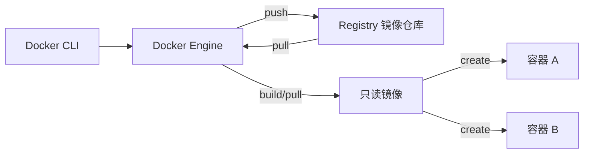
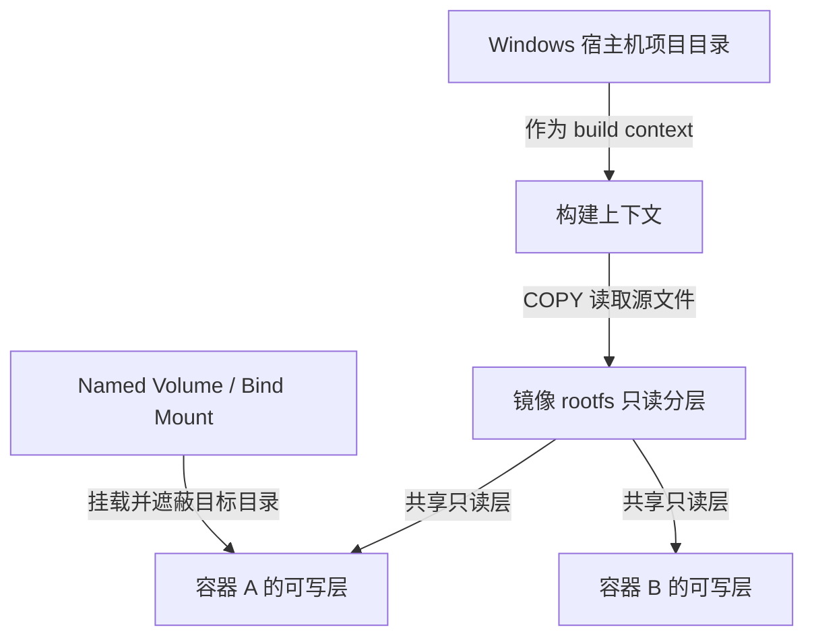

# Docker 入门到实战：镜像、容器、存储、网络与 Compose

## 1. 阅读目标与实验环境

这篇文章默认你使用 **Windows 10/11 + PowerShell + Docker Desktop**，以 **Linux 容器**为主线。命令尽量是一行，复制后即可执行；需要发 HTTP 请求时使用 `curl.exe`，避免 PowerShell 中 `curl` 别名带来的差异。

读完并完成实验后，你应该能：

- 解释 Engine、Image、Container、Registry 的关系；
- 分清宿主机目录、构建上下文、镜像层、容器可写层和挂载；
- 构建并运行一个 Node.js 镜像，判断缓存是否合理；
- 正确使用端口、用户自定义网络、服务名 DNS、Volume 和 Bind Mount；
- 用现代 Compose 管理一个 Node.js + Redis 项目；
- 按固定顺序排查常见故障，并说明安全与生产边界。

:::important Windows 上的 Linux 容器运行在哪里
Linux 容器需要 Linux 内核。Windows 上的 Docker Desktop 通常通过 **WSL2 后端或 Linux 虚拟机**提供这个内核；容器并不是直接共享 Windows 内核。镜像中的 Alpine、Debian 等提供 Linux **用户空间**，多个容器仍共享 Docker Desktop 后端的 Linux 内核。
:::

本文示例采用明确版本，例如 `nginx:1.27.4-alpine`、`node:22.14.0-alpine3.21`、`redis:7.4.2-alpine`。教程版本便于复现，但正式项目还应固定团队验证过的**补丁版本**，高要求场景可固定镜像 **digest**，并由升级流程定期更新。

## 2. Docker 解决什么，又不解决什么

传统交付经常出现“开发机能运行，测试机缺运行时或系统库”的问题。Docker 把应用、运行时和所需用户空间文件打成镜像，用同一镜像创建容器，从而减少环境漂移，并让启动、停止、替换和回滚方式更一致。

Docker 擅长解决：

- 应用与运行依赖的可重复打包；
- 开发、测试、CI 和部署环境的一致交付；
- 进程、文件系统、网络等维度的隔离；
- 一台主机上多个服务的标准化运行。

Docker **不自动解决**：

- 程序本身的 bug、数据模型和架构问题；
- 跨 CPU 架构兼容、内核功能差异和所有系统调用差异；
- 数据备份、灾难恢复、监控、证书、秘密管理与高可用；
- 完整虚拟机级别的隔离。容器共享同一 Linux 内核，安全边界需要持续加固。

## 3. Engine、Image、Container 与 Registry



- **Docker CLI**：你输入 `docker ...` 的客户端。
- **Docker Engine**：接收请求，负责构建镜像、创建容器、管理网络和存储。
- **Image（镜像）**：只读、分层的运行模板，包含应用和用户空间文件。
- **Container（容器）**：镜像的运行实例；本质上是受隔离和资源约束的进程及其文件系统视图。
- **Registry（镜像仓库服务）**：存放和分发镜像，例如公共仓库或企业私有仓库。

```powershell
# 拉取明确版本并查看本地镜像
docker pull alpine:3.21.3
docker image ls alpine

# 创建并运行一个短任务；主进程 echo 结束后，容器随即退出
docker run --name hello-docker alpine:3.21.3 echo "hello from a Linux container"
docker ps -a
```

预期看到输出 `hello from a Linux container`，并在 `docker ps -a` 中看到状态为 `Exited` 的容器。

`docker run` 可以理解为 **`docker create` + `docker start`**：先基于镜像创建容器，再启动它。容器的生命周期取决于它的**主进程（PID 1）**；主进程结束，容器就停止。容器不是必须长期运行，批处理任务正常执行完退出也很常见。

### 基础命令与缩写记忆表

下面只建立命令地图，后文在具体场景中使用，不再重复罗列。

| 简短写法 | 完整分组写法 | 记忆来源 | 作用 |
|---|---|---|---|
| `docker ps` | `docker container ls` | process status / list | 列出运行中的容器 |
| `docker ps -a` | `docker container ls -a` | all | 列出全部容器 |
| `docker images` | `docker image ls` | images / list | 列出本地镜像 |
| `docker rm demo` | `docker container rm demo` | remove | 删除容器 |
| `docker rmi image:tag` | `docker image rm image:tag` | remove image | 删除镜像 |
| `docker exec` | `docker container exec` | execute | 在运行中容器执行新命令 |
| `docker cp` | `docker container cp` | copy | 在宿主机与容器之间复制文件 |

| 参数 | 英文 | 常见含义 |
|---|---|---|
| `-a` | all | 显示全部对象 |
| `-d` | detach | 后台运行 |
| `-f` | follow / force | `logs` 中持续跟随；`rm` 中强制删除 |
| `-i` | interactive | 保持标准输入打开 |
| `-t` | TTY | 分配终端，常与 `-i` 合写为 `-it` |
| `-p` | publish | 发布端口 |
| `-q` | quiet | 仅输出 ID |

进入精简镜像时先尝试 `sh`，不要假设镜像安装了 Bash：

```powershell
docker run --rm -it alpine:3.21.3 sh
```

输入 `exit` 离开。`--rm` 表示主进程退出后自动删除这个临时容器。

:::tip `exec` 与 `run` 的区别
`docker run` 创建新容器；`docker exec` 只是在一个**已运行**容器中启动额外命令。`docker cp` 可复制调试文件，但不应代替可复现的 Dockerfile 或正式数据挂载。
:::

清理本节资源：

```powershell
docker rm hello-docker
```

## 4. 文件系统心智模型：先分清五个位置

Docker 初学者最容易混淆“我的文件到底在哪”。先建立从宿主机到容器的完整链路：



### 4.1 `/app` 是容器里的 Linux 路径

`/app` 从 Linux 根目录 `/` 开始，是**镜像或容器内部**的目录，不是 Windows 的 `C:\app`。同理，容器里的 `/etc`、`/tmp`、`/var` 都属于容器看到的 Linux 文件系统。

```dockerfile
WORKDIR /app
```

`WORKDIR /app` 在**构建镜像时**设置后续指令的工作目录；目录不存在时会创建。它会影响：

- 后续 `RUN` 的当前目录；
- `COPY` 使用相对目标路径时的落点；
- 容器启动后 `CMD` 的默认工作目录。

例如：

```dockerfile
WORKDIR /app
COPY app.js ./
RUN pwd
CMD ["node", "app.js"]
```

这里 `COPY app.js ./` 的目标是镜像内的 `/app/app.js`，`RUN pwd` 输出 `/app`，启动命令也在 `/app` 下执行。

### 4.2 `COPY` 的源和目标属于两个世界

```dockerfile
COPY src/app.js ./app.js
```

- 源 `src/app.js` 相对于 `docker build` 最后参数指定的 **build context（构建上下文）**；
- 相对目标 `./app.js` 相对于当前 `WORKDIR`；
- `COPY` 不能读取构建上下文之外的文件，例如上下文是当前目录时，不能用 `COPY ../secret.txt ./`；
- `.dockerignore` 会先从构建上下文排除文件，被排除的文件同样不能 `COPY`。

构建上下文不是“Dockerfile 所在目录”的固定别名。下面命令中的最后一个 `.` 才明确表示当前目录：

```powershell
docker build -t demo:v1.0 .
```

### 4.3 rootfs 分层与容器可写层

镜像的 rootfs（根文件系统）由只读层叠加而成。多个容器可以共享同一组只读镜像层，但每个容器都有自己的可写层：

- 在容器内新建、修改、删除文件，变化写入该容器自己的可写层；
- `docker stop` / `docker start` 不删除容器，可写层仍在；
- `docker rm` 删除容器，也删除它的可写层；
- 另一个基于同一镜像创建的容器看不到前一个容器可写层里的变化。

下面是可执行验证：

```powershell
docker run -d --name layer-demo alpine:3.21.3 sh -c "echo hello > /note.txt; while true; do sleep 3600; done"
docker exec layer-demo cat /note.txt
docker stop layer-demo
docker start layer-demo
docker exec layer-demo cat /note.txt
```

两次 `cat` 都应输出 `hello`。现在删除并重新创建：

```powershell
docker rm -f layer-demo
docker run -d --name layer-demo alpine:3.21.3 sh -c "while true; do sleep 3600; done"
docker exec layer-demo sh -c "if [ -f /note.txt ]; then cat /note.txt; else echo file-missing; fi"
```

预期输出 `file-missing`，说明旧容器的可写层已随 `rm` 消失。最后清理：

```powershell
docker rm -f layer-demo
```

### 4.4 Mount 会遮蔽目标目录

挂载不是“把两边目录智能合并”。挂载到容器目标目录后，目标目录在镜像层里的原内容会被**遮蔽**；移除挂载后，镜像原内容仍在，并没有被删除。

- **Named Volume**：由 Docker 管理实际位置，适合数据库等容器数据；易迁移容器，弱化宿主机路径耦合。
- **Bind Mount**：直接使用指定宿主机文件或目录，适合把源码、配置或待编辑内容映射进去；权限、路径和宿主机文件变化会直接影响容器。

先创建一个已有内容的数据卷，再把它挂到原本也有内容的 `/etc`：

```powershell
docker volume create mask-demo
docker run --rm --mount type=volume,src=mask-demo,dst=/data alpine:3.21.3 sh -c "echo from-volume > /data/source.txt"
docker run --rm --mount type=volume,src=mask-demo,dst=/etc alpine:3.21.3 sh -c "ls /etc; if [ -f /etc/alpine-release ]; then echo image-visible; else echo image-hidden; fi"
docker run --rm alpine:3.21.3 sh -c "test -f /etc/alpine-release && echo image-visible-again"
```

挂载时预期只看到卷中的 `source.txt` 和结果 `image-hidden`，说明镜像原本 `/etc` 的内容被遮蔽；不带挂载的新容器输出 `image-visible-again`，说明镜像层原内容没有被删除。移除卷前确认它只属于本实验：

:::warning 破坏性操作
下一条命令会永久删除 `mask-demo` 卷及其中数据。生产数据卷应先确认名称并完成备份。
:::

```powershell
docker volume rm mask-demo
```

后面的“持久化”章节会分别用 `--mount` 完整练习 Named Volume 和 Bind Mount。

## 5. 安装验证与容器生命周期

### 5.1 Windows：Docker Desktop + WSL2

1. 在 Windows 功能和 BIOS/UEFI 中启用 CPU 虚拟化；任务管理器“性能 → CPU”通常会显示“虚拟化：已启用”。
2. 在管理员 PowerShell 中检查 WSL：

```powershell
wsl --status
wsl --version
```

3. 安装 Docker Desktop，设置中选择使用 WSL2 后端，并保持 Linux containers 模式。
4. 启动 Docker Desktop，等待 Engine 就绪后验证客户端与服务端：

```powershell
docker version
docker info
docker run --rm alpine:3.21.3 echo "Docker works"
```

`docker version` 应同时显示 Client 和 Server；只有 Client 通常表示 Docker Desktop 尚未启动或连接上下文不正确。`docker info` 可查看存储驱动、运行容器数等服务端信息。

:::note
Docker Desktop、WSL2 和 Windows 的具体支持范围会变化。安装界面与系统要求应以 Docker 官方安装文档和 Microsoft WSL 文档为准；正文实验本身不依赖联网阅读。
:::

### 5.2 Linux：按发行版使用官方安装步骤

Linux 的软件源签名、仓库地址和发行版代号会变化，本文不复制容易过时的长安装脚本。请在 Docker 官方文档中选择你的发行版（Ubuntu、Debian、Fedora 等）安装 Docker Engine 和 Compose 插件，完成后执行：

```bash
docker version
docker info
docker compose version
docker run --rm alpine:3.21.3 echo "Docker works"
```

若普通用户无权访问 Docker socket，请按官方文档配置权限。把用户加入可控制 Docker 的组通常等价于授予较高主机权限，不应把它当成无风险操作。

### 5.3 生命周期：create、start、stop、rm

```powershell
# 只创建，不启动
docker create --name life-demo alpine:3.21.3 sh -c "echo started; sleep 300"

# 启动已有容器
docker start life-demo

# 容器运行时观察状态、日志、配置和一次资源快照
docker ps
docker logs life-demo
docker inspect life-demo
docker stats --no-stream life-demo

# 停止后容器仍然存在，可以再次启动
docker stop life-demo
docker ps -a
docker start life-demo
docker stop life-demo

# 确认不再需要后删除容器
docker rm life-demo
```

`docker start` 会重新执行容器创建时记录的启动命令，但不会创建新容器。`docker stop` 先请求主进程优雅退出，超时后才强制结束；`docker rm -f` 会直接强制删除运行中的容器，更适合清理明确可丢弃的练习资源。

查看其他容器时，也可以使用：

```powershell
docker logs -f <容器名>  # 持续跟随日志，按 Ctrl+C 退出
docker inspect <容器名> # 查看完整配置与运行状态
docker stats             # 持续查看所有运行中容器的资源占用
```

## 6. 端口：容器能监听，不等于宿主机能访问

启动固定版本 Nginx：

```powershell
docker run -d --name port-demo -p 127.0.0.1:8080:80 nginx:1.27.4-alpine
curl.exe http://127.0.0.1:8080
```

预期返回 Nginx 欢迎页 HTML。端口参数按下面理解：

```text
-p 宿主机地址:宿主机端口:容器端口
-p 127.0.0.1:8080:80
```

请求先到 Windows 的 `127.0.0.1:8080`，再由 Docker 转发到容器的 `80` 端口。

| 写法 | 含义 |
|---|---|
| `-p 127.0.0.1:8080:80` | 只绑定宿主机回环地址，通常仅本机可访问 |
| `-p 8080:80` | 绑定宿主机所有接口，可能被局域网或外部网络访问，仍受防火墙和网络策略影响 |

:::warning
开发服务若不需要被其他机器访问，优先显式绑定 `127.0.0.1`。`-p 8080:80` 的实际可达范围还取决于 Windows 防火墙、路由、云安全组和公司网络策略。
:::

Dockerfile 中的：

```dockerfile
EXPOSE 80
```

只记录“镜像预期监听 80 端口”的元数据，**不会发布端口**。真正发布仍需 `docker run -p` 或 Compose 的 `ports`。

应用在容器中还应监听 `0.0.0.0`，而不是仅监听容器自己的 `127.0.0.1`。后者只接受容器内部回环请求，即使写了 `-p`，宿主机通常也无法访问。

检查映射并清理：

```powershell
docker port port-demo
docker rm -f port-demo
```

## 7. Dockerfile 逐步项目：Node.js 内置 HTTP 服务

这一节只使用 Node.js 内置模块，不安装第三方依赖。固定使用宿主机 `3000` 到容器 `3000`，避免命令和验证 URL 不一致。


<Steps>

### 1. 创建并进入项目目录

```powershell
New-Item -ItemType Directory -Path docker-node-demo -Force
Set-Location docker-node-demo
```

最终目录应为：

```text
docker-node-demo/
├── app.js
├── package.json
├── .dockerignore
└── Dockerfile
```

Windows 资源管理器可能隐藏扩展名。`Dockerfile` 必须正好叫 `Dockerfile`，不能是 `Dockerfile.txt`。

### 2. 创建 `app.js`

```javascript
const http = require('node:http');

const port = 3000;

const server = http.createServer((request, response) => {
  response.writeHead(200, {
    'Content-Type': 'application/json; charset=utf-8',
  });

  response.end(JSON.stringify({
    message: 'Hello from Docker!',
    path: request.url,
  }));
});

// 必须监听 0.0.0.0，端口发布后宿主机才能访问。
server.listen(port, '0.0.0.0', () => {
  console.log(`Server is running on port ${port}`);
});
```

### 3. 创建 `package.json`

```json
{
  "name": "docker-node-demo",
  "version": "1.0.0",
  "private": true,
  "scripts": {
    "start": "node app.js"
  }
}
```

此项目没有第三方依赖，所以不需要 `npm install`，也不会生成 lockfile。

### 4. 创建 `.dockerignore`

```text
node_modules
npm-debug.log
.git
.gitignore
.env
.env.*
```

`.dockerignore` 减少发送给构建器的内容、降低无关缓存失效，也降低误复制本地文件的风险。但它不是秘密管理工具；真正的秘密根本不应进入构建上下文。

### 5. 创建 `Dockerfile`

```dockerfile
# 提供 Linux 用户空间和 Node.js；容器仍共享后端 Linux 内核。
FROM node:22.14.0-alpine3.21

# 创建并设置镜像内工作目录，后续相对路径都以 /app 为基准。
WORKDIR /app

# 源文件来自 build context；目标 ./ 表示镜像内的 /app。
COPY --chown=node:node package.json ./
COPY --chown=node:node app.js ./

EXPOSE 3000

# 降低应用进程以 root 身份运行的风险。
USER node

CMD ["npm", "start"]
```

`FROM` 提供的是 Linux 用户空间文件和 Node.js，不是给每个容器安装一套独立 Linux 内核。`WORKDIR` 不存在时会创建，并影响 `COPY` 相对目标和 `CMD` 的运行目录。

### 6. 构建镜像

```powershell
docker build -t my-node-app:v1.0 .
docker image ls my-node-app
```

最后的 `.` 是构建上下文，不能漏。预期镜像列表中出现 `my-node-app` 和 `v1.0`。

### 7. 启动容器

```powershell
docker run -d --name node-app -p 127.0.0.1:3000:3000 my-node-app:v1.0
```

预期 `docker ps` 显示 `node-app` 为 `Up`，并显示 `127.0.0.1:3000->3000/tcp`。

### 8. 验证

```powershell
docker ps
curl.exe http://127.0.0.1:3000
docker logs node-app
```

预期响应：

```json
{"message":"Hello from Docker!","path":"/"}
```

日志应包含 `Server is running on port 3000`。

### 9. 修改代码、构建新 tag、替换容器

把 `app.js` 中消息改为 `Hello from Docker v2!`，然后执行：

```powershell
docker build -t my-node-app:v2.0 .
docker rm -f node-app
docker run -d --name node-app -p 127.0.0.1:3000:3000 my-node-app:v2.0
curl.exe http://127.0.0.1:3000
```

镜像是构建结果。只修改宿主机源码不会改变旧镜像或旧容器；标准替换过程是：**修改代码 → 构建新 tag → 删除旧容器 → 用新镜像创建容器**。

### 10. 清理

```powershell
docker rm -f node-app
docker image rm my-node-app:v1.0 my-node-app:v2.0
Set-Location ..
```

</Steps>

## 8. 构建缓存：为什么指令顺序会影响速度

Dockerfile 中多数指令会产生或复用构建层。某一步的输入发生变化，该步及其**后续步骤**通常都需要重新执行，这叫上游失效向下传导。


对于有 npm 依赖且提交了 `package-lock.json` 的项目，常见顺序是：

```dockerfile
FROM node:22.14.0-alpine3.21
WORKDIR /app
COPY package.json package-lock.json ./
RUN npm ci --omit=dev
COPY . .
CMD ["npm", "start"]
```

原因是依赖清单通常比源码变化少：

1. 只改业务源码时，`COPY package.json package-lock.json ./` 的输入不变；
2. `npm ci --omit=dev` 可复用缓存；
3. 只有后面的 `COPY . .` 和其后步骤失效。

本文 Node 示例没有第三方依赖，也没有 lockfile，因此 Dockerfile 中**没有 `RUN npm ci`**。不要为了“看起来标准”执行一个没有输入条件的安装步骤。

可以连续构建两次观察输出中的缓存命中；需要确认全量重建时才使用：

```powershell
docker build --no-cache -t my-node-app:cache-check .
```

`--no-cache` 适合诊断，不应成为日常默认，因为它会放弃可复现且有价值的缓存。

### `.dockerignore` 与秘密

构建上下文越大，上传和计算缓存越慢。通常排除 `.git`、日志、测试输出、宿主机 `node_modules` 和本地环境文件。

不要用以下方式把秘密写进镜像：

```dockerfile
# 错误示意：值可能留在镜像配置、层或构建记录中。
ARG API_TOKEN
ENV API_TOKEN=$API_TOKEN
COPY .env ./
```

应由运行平台在启动时注入秘密，或使用平台的 secret 能力。即使后续 `RUN rm`，秘密也可能仍存在于较早的镜像层。

### 多阶段构建什么时候有用

多阶段构建把“编译工具链”和“最终运行环境”分开：前一阶段编译，后一阶段只复制运行产物。它适合 TypeScript、Go、Java 等需要构建的项目。本文服务直接运行 `app.js`，没有编译产物，强行增加阶段只会让示例复杂，并不会自然获得收益。

不要机械追求层数最少。合并相关的包管理命令可以避免缓存和临时文件留层，但可读性、缓存粒度与正确清理同样重要；“所有 `RUN` 都合成一行”不是通用规则。

## 9. 持久化：可写层、Named Volume 与 Bind Mount

先用表格确定边界：

| 位置 | 谁管理 | `stop/start` | `rm` 容器 | 适用场景 |
|---|---|---|---|---|
| 容器可写层 | Docker，绑定单个容器 | 保留 | 删除 | 临时文件、可丢弃缓存 |
| Named Volume | Docker | 保留 | 默认保留 | 数据库、需要跨容器复用的数据 |
| Bind Mount | 用户指定宿主机路径 | 保留 | 宿主机文件不受影响 | 本地源码、配置、导入导出目录 |

可写层的保留与删除已在第 4 节验证。现在使用推荐的 `--mount` 语法完成两个实验。

### 9.1 Named Volume：由 Docker 管理的数据

```powershell
docker volume create notes-data
docker run --rm --mount type=volume,src=notes-data,dst=/data alpine:3.21.3 sh -c "echo persistent > /data/note.txt"
docker run --rm --mount type=volume,src=notes-data,dst=/data alpine:3.21.3 cat /data/note.txt
docker volume inspect notes-data
```

第二个容器应输出 `persistent`。两个临时容器都已被 `--rm` 删除，但数据仍在卷里，说明卷的生命周期独立于容器。

只读挂载可防止容器修改卷：

```powershell
docker run --rm --mount type=volume,src=notes-data,dst=/data,readonly alpine:3.21.3 cat /data/note.txt
```

:::warning 删除卷会删除数据
确认 `notes-data` 只是练习数据后再执行。被容器使用中的卷不能直接删除；数据库卷删除前应先备份并核对名称。
:::

```powershell
docker volume rm notes-data
```

### 9.2 Bind Mount：直接映射 Windows 目录

在 PowerShell 中，优先用 `--mount` 和绝对路径，减少盘符与冒号解析歧义：

```powershell
New-Item -ItemType Directory -Path .\bind-demo -Force
Set-Content -Path .\bind-demo\index.html -Value '<h1>Hello from bind mount</h1>'
$sitePath = (Resolve-Path .\bind-demo).Path
docker run -d --name bind-web -p 127.0.0.1:8080:80 --mount "type=bind,src=$sitePath,dst=/usr/share/nginx/html,readonly" nginx:1.27.4-alpine
curl.exe http://127.0.0.1:8080
```

预期返回你写入的 HTML。这里宿主机目录遮蔽了镜像中 `/usr/share/nginx/html` 原有欢迎页；`readonly` 防止容器通过该挂载修改宿主机文件。

修改宿主机文件后无需重建镜像：

```powershell
Set-Content -Path .\bind-demo\index.html -Value '<h1>Changed on Windows</h1>'
curl.exe http://127.0.0.1:8080
docker rm -f bind-web
Remove-Item -Recurse -Force .\bind-demo
```

Bind Mount 依赖宿主机路径和权限，可移植性弱于 Named Volume。Docker Desktop 会在 Windows 与后端 Linux 环境之间共享该目录，文件监听、大小写、权限和性能行为可能与原生 Linux 不同。

## 10. 网络与 DNS：先确定“从哪里访问”

Docker 常见网络驱动：

| 网络 | 特点 | 典型用途与边界 |
|---|---|---|
| 默认 `bridge` | 未指定网络的 Linux 容器通常接入；按容器名发现能力不如用户自定义网络 | 简单单容器实验 |
| 用户自定义 `bridge` | 同一网络内有内置 DNS，可按容器名或网络别名访问 | 单主机多容器应用，推荐 |
| `host` | 容器共享主机网络命名空间，端口模型不同 | 特殊性能或网络工具场景；Docker Desktop 与原生 Linux 行为有差异 |
| `none` | 只有回环接口，不接入外部网络 | 明确要求断网的任务 |

不要把“能互相访问”与“自动公开给宿主机”混为一谈。容器间通信通常不需要 `-p`；`-p` 是把容器端口发布到宿主机。

### 10.1 用户自定义 bridge + 服务名 DNS

创建网络，启动 Nginx，再用包含 `wget` 的明确 Alpine 镜像发 HTTP 请求，不假设 Nginx 镜像有 `ping`：

```powershell
docker network create demo-net
docker run -d --name web --network demo-net nginx:1.27.4-alpine
docker run --rm --network demo-net alpine:3.21.3 wget -qO- http://web
docker network inspect demo-net
```

预期返回 Nginx HTML。`web` 被 Docker 内置 DNS 解析为同一网络上的容器地址；应用应使用稳定的服务名，而不是会变化的容器 IP。

不在同一网络时，服务名通常无法解析：

```powershell
docker run --rm alpine:3.21.3 wget -qO- -T 2 http://web
```

这条命令预期失败，说明网络边界生效。清理：

```powershell
docker rm -f web
docker network rm demo-net
```

### 10.2 四种 `localhost` 视角

| 请求发起位置 | 目标写法 | 实际含义 |
|---|---|---|
| 容器 A 内 | `localhost` / `127.0.0.1` | 容器 A 自己，不是容器 B，也不是 Windows |
| 容器 A 内 | `http://web:80` | 同一用户自定义网络中名为 `web` 的服务 |
| Windows 宿主机 | `http://localhost:8080` | Windows 自己的 8080；需通过 `-p` 转到容器 |
| Docker Desktop 容器内 | `host.docker.internal` | Docker Desktop 提供的宿主机入口名称 |

在原生 Linux Engine 上，`host.docker.internal` 不一定默认存在；有需要时可显式配置 host gateway，例如运行参数 `--add-host host.docker.internal:host-gateway`，并结合安全策略判断是否应该让容器访问宿主机服务。

## 11. Compose 完整项目：Node.js + Redis

Compose 用一个 `compose.yaml` 描述多个服务、网络和卷。这里的 Web 服务通过 Node.js 内置 `net` 模块直接发送 Redis RESP 命令，无第三方依赖；每次访问都会执行 `INCR visits`。这样既能演示服务名 DNS，也能验证 Redis 数据卷。

<Steps>

### 1. 创建项目目录

```powershell
New-Item -ItemType Directory -Path compose-counter -Force
Set-Location compose-counter
```

创建以下文件：

```text
compose-counter/
├── app.js
├── package.json
├── Dockerfile
├── .dockerignore
└── compose.yaml
```

### 2. 创建 `app.js`

```javascript
const http = require('node:http');
const net = require('node:net');

const redisHost = process.env.REDIS_HOST ?? 'redis';
const redisPort = Number(process.env.REDIS_PORT ?? 6379);
const port = 3000;

// 每次请求建立一个短连接，并发送 RESP 格式的 INCR visits。
function incrementOnce() {
  return new Promise((resolve, reject) => {
    const socket = net.createConnection({ host: redisHost, port: redisPort });
    let response = '';

    socket.setTimeout(2000);

    socket.on('connect', () => {
      socket.write('*2\r\n$4\r\nINCR\r\n$6\r\nvisits\r\n');
    });

    socket.on('data', (chunk) => {
      response += chunk.toString('utf8');
      const match = response.match(/^:(\d+)\r\n/);
      if (match) {
        socket.end();
        resolve(Number(match[1]));
      }
    });

    socket.on('timeout', () => socket.destroy(new Error('Redis timeout')));
    socket.on('error', reject);
  });
}

// 即使 Compose 等待过健康检查，运行期连接仍可能短暂失败，所以应用也要重试。
async function incrementWithRetry(maxAttempts = 10) {
  let lastError;
  for (let attempt = 1; attempt <= maxAttempts; attempt += 1) {
    try {
      return await incrementOnce();
    } catch (error) {
      lastError = error;
      await new Promise((resolve) => setTimeout(resolve, 500));
    }
  }
  throw lastError;
}

const server = http.createServer(async (request, response) => {
  if (request.url === '/health') {
    response.writeHead(200, { 'Content-Type': 'text/plain; charset=utf-8' });
    response.end('ok');
    return;
  }

  try {
    const visits = await incrementWithRetry();
    response.writeHead(200, { 'Content-Type': 'application/json; charset=utf-8' });
    response.end(JSON.stringify({ visits, redisHost }));
  } catch (error) {
    console.error('Redis request failed:', error.message);
    response.writeHead(503, { 'Content-Type': 'application/json; charset=utf-8' });
    response.end(JSON.stringify({ error: 'Redis unavailable' }));
  }
});

server.listen(port, '0.0.0.0', () => {
  console.log(`Counter API listening on ${port}`);
});
```

### 3. 创建 `package.json`

```json
{
  "name": "compose-counter",
  "version": "1.0.0",
  "private": true,
  "scripts": {
    "start": "node app.js"
  }
}
```

这里没有第三方包，因此无需 lockfile 和安装步骤。真实项目一旦加入依赖，就应提交 `package-lock.json`，并在镜像中使用 `npm ci`；不要只提交带范围的依赖声明后期待每次构建结果完全一致。

### 4. 创建 `.dockerignore`

```text
node_modules
.git
.env
.env.*
npm-debug.log
```

### 5. 创建 `Dockerfile`

```dockerfile
FROM node:22.14.0-alpine3.21
WORKDIR /app
COPY --chown=node:node package.json ./
COPY --chown=node:node app.js ./
EXPOSE 3000
USER node
CMD ["npm", "start"]
```

### 6. 创建 `compose.yaml`

```yaml
services:
  app:
    build:
      context: .
    ports:
      - "127.0.0.1:3000:3000"
    environment:
      REDIS_HOST: redis
      REDIS_PORT: "6379"
    depends_on:
      redis:
        condition: service_healthy
    healthcheck:
      test: ["CMD", "node", "-e", "fetch('http://127.0.0.1:3000/health').then(r => process.exit(r.ok ? 0 : 1)).catch(() => process.exit(1))"]
      interval: 5s
      timeout: 3s
      retries: 5
    restart: unless-stopped

  redis:
    image: redis:7.4.2-alpine
    command: ["redis-server", "--appendonly", "yes"]
    volumes:
      - redis-data:/data
    healthcheck:
      test: ["CMD", "redis-cli", "ping"]
      interval: 5s
      timeout: 3s
      retries: 10
    restart: unless-stopped

volumes:
  redis-data:
```

现代 Compose 使用 `compose.yaml` 和 `docker compose` 子命令，不需要顶层格式版本字段。

Compose 会为该项目创建默认用户自定义网络。服务名 `redis` 自动成为网络内 DNS 名，所以应用使用 `REDIS_HOST=redis`，而不是 `localhost`。宿主机浏览器不在 Compose 网络里，不能解析 `redis`；浏览器应访问已发布的 `http://127.0.0.1:3000`。

### 7. 启动并验证

```powershell
docker compose up -d --build --wait
docker compose ps
docker compose logs app
curl.exe http://127.0.0.1:3000
curl.exe http://127.0.0.1:3000
docker compose exec redis redis-cli -h redis ping
```

预期两次 HTTP 响应中的 `visits` 依次增加，例如：

```json
{"visits":1,"redisHost":"redis"}
{"visits":2,"redisHost":"redis"}
```

最后一条命令预期输出 `PONG`，它明确通过服务名 `redis` 访问 Redis。

`healthcheck` 只定义“怎样判断服务健康”。`depends_on` 的 `service_healthy` 条件会让 Compose 在 Redis 通过健康检查后再启动 app，但它不保证 Redis 在整个运行期永不重启或断线，因此应用仍需要超时、重试和错误处理。

### 8. 验证数据卷跨容器保留

```powershell
docker compose down
docker compose up -d --wait
curl.exe http://127.0.0.1:3000
```

`down` 删除项目容器和网络，但默认保留命名卷。新的 Redis 容器挂载同一卷后，计数应继续增加。

### 9. 清理

保留数据卷，只删除容器与网络：

```powershell
docker compose down
```

:::warning `down -v` 会删除项目数据
下面命令会同时删除 Compose 声明的 `redis-data` 卷，访问计数会永久丢失。只在确认数据可丢弃时执行。
:::

```powershell
docker compose down -v
Set-Location ..
```

</Steps>

## 12. 安全与生产边界

容器化不是安全结论，而是一组可以正确或错误使用的机制。上线前至少考虑：

1. **可信基础镜像**：优先官方或经过组织审核的来源；记录来源和更新流程。体积小不等于漏洞少，Alpine 也不必然更安全或更兼容。
2. **固定并更新版本**：固定团队验证过的补丁 tag；要求更强可复现性时固定 digest。固定不代表永不升级，应定期重建和验证。
3. **非 root 与文件权限**：镜像中使用 `USER`，并让应用只拥有必需目录的读写权。非 root 能降低风险，但不能消除内核或配置漏洞。
4. **秘密不进镜像**：不要把口令、令牌、私钥放进 `COPY`、`ARG` 或 `ENV`。`.env` 仅适合本地非敏感配置或开发注入，并应加入 `.gitignore`；生产使用专门的秘密管理能力。
5. **漏洞扫描**：可使用组织批准的镜像扫描器或 Docker Desktop/Registry 集成能力。工具可能需要额外安装、数据库更新或登录；扫描结果要结合可利用性、基础镜像更新和误报处理。
6. **缩小运行权限**：按需使用只读根文件系统、临时目录、移除 Linux capabilities、seccomp/AppArmor 等；先验证应用确实可运行。
7. **资源与可用性**：配置 CPU、内存、进程数限制，避免单个容器拖垮主机。健康检查能提供状态信号，不等于自动修复、负载均衡或高可用。
8. **生产数据**：数据卷不是备份。必须独立设计备份、恢复演练、加密、访问控制和保留策略。

例如，确认应用不写根文件系统后，可在测试环境尝试：

```powershell
docker run --rm --read-only --tmpfs /tmp --memory 256m --cpus 0.5 node:22.14.0-alpine3.21 node -e "console.log('limited container')"
```

这些限制只是进阶加固边界；数值应来自实际压测和监控，不应盲目复制。

## 13. Windows 注意事项

### 13.1 PowerShell、续行与 `curl.exe`

本文命令默认 PowerShell。Bash 用反斜杠做续行，但不要把这种写法直接复制到 PowerShell。PowerShell 续行符是反引号，并且反引号后**不能有空格**；初学阶段优先使用本文的一行命令。

PowerShell 中 `curl` 在部分环境可能是其他命令的别名，教程统一写：

```powershell
curl.exe http://127.0.0.1:3000
```

### 13.2 Linux 路径与 Windows 路径

- Dockerfile 和容器命令使用 Linux 路径，如 `/app`、`/data`；
- Windows 宿主机路径如 `C:\Users\me\project` 只在宿主机侧存在；
- Bind Mount 优先用 `$path = (Resolve-Path .).Path` 配合 `--mount`；
- 不要把 `C:\app` 当成容器里的 `/app`，两者只有显式挂载时才建立关系。

### 13.3 CRLF、大小写和执行权限

Windows 文本常用 CRLF，Linux 常用 LF。Shell 脚本若出现 `/bin/sh^M` 或解释器找不到，通常需要把文件行尾改为 LF。Git 可通过仓库约定统一行尾，但不要在不理解团队规则时全局改写文件。

Linux 文件名区分大小写，`App.js` 与 `app.js` 是不同文件；Windows 默认文件系统通常不敏感，构建后才可能暴露问题。Linux 可执行位也不能仅靠 Windows 文件扩展名表达，脚本应在仓库和 Dockerfile 中正确设置权限。

### 13.4 `Dockerfile.txt` 与隐藏扩展名

如果构建提示找不到 Dockerfile，先执行：

```powershell
Get-Location
Get-ChildItem -Force
```

确保文件名是 `Dockerfile`，不是记事本保存出的 `Dockerfile.txt`，并确保 `docker build ... .` 的当前目录正确。

### 13.5 WSL2 文件性能

在 WSL2 中进行大量小文件读写（例如 Node.js 依赖安装）时，把源码放在 WSL 的 Linux 文件系统内通常比从 `/mnt/c` 跨文件系统访问更快。若主要从 Windows IDE 操作，也要权衡编辑体验、文件监听和团队工具链；不要同时在 Windows 与 WSL 两侧对同一依赖目录重复安装。

## 14. 排障与安全清理

遇到“容器访问不了”时，不要随机重建。按下面顺序缩小范围。

### 14.1 第一步：`ps -a` 看状态

```powershell
docker ps -a
```

- `Up`：主进程仍运行，继续检查日志和端口；
- `Exited (0)`：主进程正常结束，可能本来就是短任务，也可能启动命令没有持续运行；
- 非零退出码：应用或启动命令出错；
- `Restarting`：重启策略正在掩盖持续失败，立即看日志。

### 14.2 第二步：`logs` 看应用输出

```powershell
docker logs --tail 100 node-app
docker logs -f node-app
```

先找启动异常、配置缺失、权限错误和实际监听端口。`logs` 只能看到进程写到标准输出和标准错误的内容；应用若只写容器内文件，需要调整日志策略。

### 14.3 第三步：`inspect` 看真实配置

```powershell
docker inspect node-app
docker inspect --format '{{json .State}}' node-app
docker inspect --format '{{json .NetworkSettings.Ports}}' node-app
docker inspect --format '{{json .Mounts}}' node-app
```

核对镜像 tag、启动命令、环境变量、退出状态、端口、网络和挂载目标，不要只凭记忆判断。

### 14.4 第四步：检查监听地址与端口

应用必须监听容器内正确端口和 `0.0.0.0`。检查 Docker 发布结果：

```powershell
docker port node-app
```

检查 Windows 宿主机端口占用：

```powershell
Get-NetTCPConnection -LocalPort 3000 -ErrorAction SilentlyContinue
netstat -ano | findstr :3000
```

如果宿主机端口被占用，可以更换**宿主机侧**端口，例如 `-p 127.0.0.1:8080:3000`，随后访问 `http://127.0.0.1:8080`。

### 14.5 第五步：检查 network 与 DNS

```powershell
docker network ls
docker network inspect demo-net
```

确认通信双方在同一用户自定义网络，并且应用使用服务名而非 `localhost`。可启动临时工具容器验证 HTTP：

```powershell
docker run --rm --network demo-net alpine:3.21.3 wget -qO- http://web
```

若临时容器能访问而应用不能，继续检查应用配置；若 DNS 解析失败，检查网络连接和服务名拼写。

### 14.6 第六步：检查 mount 与权限

```powershell
docker inspect --format '{{json .Mounts}}' node-app
```

重点检查：

- 宿主机源路径是否存在；
- `src` 与 `dst` 是否写反；
- 挂载是否遮蔽了镜像中原有程序文件；
- 是否错误设置 `readonly`；
- 容器运行用户是否有权访问目标文件；
- Docker Desktop 是否允许共享对应 Windows 路径。

### 14.7 第七步：检查 build context 与缓存

```powershell
Get-Location
Get-ChildItem -Force
docker build --progress=plain -t my-node-app:debug .
```

确认最后的构建上下文、`.dockerignore`、`COPY` 大小写和 Dockerfile 指令顺序。怀疑缓存时，可用 `--no-cache` 做一次对照；如果问题仍在，就不是旧缓存造成的。

### 14.8 按范围清理，不要“一键全删”

先查看，再删除具体资源最安全：

```powershell
docker ps -a
docker image ls
docker volume ls
docker network ls
```

| 命令 | 删除范围 | 风险提示 |
|---|---|---|
| `docker container prune` | 所有已停止容器 | 会删除其可写层；先确认无待取文件 |
| `docker image prune` | 悬空镜像 | 通常较温和，之后可能需要重新构建 |
| `docker image prune -a` | 没有被任何容器引用的镜像 | 范围更大，之后可能重新拉取或构建 |
| `docker network prune` | 未被容器使用的网络 | 自定义但暂未使用的网络也会删除 |
| `docker volume prune` | 未被容器引用的卷 | **可能永久删除重要数据**，必须备份并逐项确认 |

:::warning
不要把包含镜像、容器、网络、构建缓存和卷的全局清理当作普通维护手段。共享开发机或生产机上，应按资源名称逐个确认和删除；数据卷尤其需要先备份。
:::

## 15. 综合验收、工作检查表与面试题

### 15.1 综合验收

完成下面任务，才算真正掌握本文主线：

1. 用第 7 节项目构建 `my-node-app:v1.0`，运行并访问 HTTP；
2. 在容器里创建临时文件，证明 stop/start 后仍在、rm 后消失；
3. 用 Named Volume 让两个不同容器读到同一数据；
4. 用只读 Bind Mount 发布一份 Windows 本地 HTML；
5. 创建用户自定义网络，用临时 Alpine 容器通过服务名访问 Nginx；
6. 启动 Compose 计数器，证明 `redis` DNS、健康检查和数据卷生效；
7. 不看答案说明 `EXPOSE`、`-p`、`COPY`、`WORKDIR`、Volume 与 Bind Mount 的边界；
8. 按 `ps -a → logs → inspect → 端口 → 网络 → 挂载 → 缓存` 顺序定位一个故意制造的端口错误。

### 15.2 常见工作检查表

构建前：

- [ ] 基础镜像来源可信，版本经过团队验证；
- [ ] build context 正确，`.dockerignore` 排除无关文件；
- [ ] lockfile 已提交，依赖安装使用可重复命令；
- [ ] 没有把秘密放入源码、构建参数、环境层或镜像；
- [ ] 依赖清单先复制、源码后复制，缓存顺序合理。

运行前：

- [ ] 应用监听 `0.0.0.0` 和预期容器端口；
- [ ] 仅发布必要端口，开发环境优先绑定 `127.0.0.1`；
- [ ] 容器使用非 root 用户且文件权限正确；
- [ ] 持久数据放在合适的卷中，并有独立备份；
- [ ] 同网络服务使用服务名，不写死容器 IP；
- [ ] 健康检查、重试、日志和资源限制符合实际负载。

变更与排障：

- [ ] 代码变化后构建新镜像 tag，再替换容器；
- [ ] 先检查容器状态与日志，不先做全局清理；
- [ ] 删除容器、镜像、网络或卷前核对作用范围；
- [ ] Compose 删除数据卷前已明确确认并备份。

### 15.3 常见面试题

::: details 1. 镜像和容器是什么关系？
镜像是只读、分层的模板；容器是镜像的运行实例。多个容器可共享镜像只读层，但各自有独立可写层、进程和网络视图。删除容器不会自动删除镜像。
:::

::: details 2. `docker run` 做了什么？为什么容器会退出？
`docker run` 等价于先 create 再 start，并可同时配置端口、网络、挂载等。容器生命周期由主进程决定；PID 1 结束时容器停止。退出不一定是故障，短任务完成后退出是正常行为。
:::

::: details 3. `WORKDIR /app` 中的 `/app` 在哪里？
它位于镜像或容器看到的 Linux 根文件系统下，不是 Windows 的 `C:\app`。`WORKDIR` 在构建时设置后续工作目录，不存在会创建，并影响 `RUN`、`COPY` 相对目标和启动命令的默认目录。
:::

::: details 4. `COPY app.js ./` 的两个路径分别相对哪里？
源 `app.js` 相对于 build context；目标 `./` 相对于当前 `WORKDIR`。构建器不能复制 context 外文件，且 `.dockerignore` 排除的文件不会进入 context。
:::

::: details 5. stop、start 与 rm 对容器文件有什么影响？
stop 只停止主进程，容器及可写层保留；start 重新启动同一容器，因此文件仍在。rm 删除容器和它的可写层。需要独立于容器生命周期的数据应放入 Volume 或 Bind Mount。
:::

::: details 6. Volume 与 Bind Mount 如何选择？
Named Volume 由 Docker 管理路径，适合数据库和容器数据，宿主机耦合较弱；Bind Mount 直接映射明确的宿主机路径，适合本地源码和配置，但受宿主机权限、路径、行尾和性能影响。两者挂载后都会遮蔽目标目录原内容。
:::

::: details 7. `EXPOSE 3000` 为什么不能让浏览器直接访问？
`EXPOSE` 只记录镜像预期端口，是元数据和文档。宿主机访问需要 `-p 宿主机端口:容器端口` 或 Compose `ports`。应用本身还必须监听容器内正确端口与 `0.0.0.0`。
:::

::: details 8. 容器 A 为什么不能用 `localhost` 访问容器 B？
每个容器有自己的网络命名空间，A 中的 `localhost` 指向 A 自己。应把两者加入同一用户自定义网络，并使用 B 的容器名、服务名或网络别名访问。
:::

::: details 9. 为什么推荐用户自定义 bridge？
它为同一网络中的容器提供内置 DNS，可用稳定名称通信，也能用多个网络划分边界。直接依赖容器 IP 容易在重建后失效；默认 bridge 的名称发现体验和隔离管理也较弱。
:::

::: details 10. 为什么先复制依赖清单，再复制源码？
Docker 构建缓存从上游向下游失效。把变化较少的依赖清单放前面，可在只改源码时复用依赖安装层；如果先复制全部源码，任意源码变化都可能让耗时的依赖安装重新执行。
:::

::: details 11. Compose 的 `depends_on` 是否保证依赖永远可用？
不保证。配合 `service_healthy` 可控制初次启动顺序和条件，但运行期依赖仍可能重启、断网或过载。应用必须设置连接超时、有限重试、退避和可观察的错误处理。
:::

::: details 12. 固定镜像版本后是否就不用升级？
不是。固定版本提高复现性，digest 更严格，但也会固定已有漏洞。团队仍需定期扫描、评估、更新基础镜像、重建应用并做回归测试，固定与升级流程必须同时存在。
:::

::: details 13. 健康检查与进程正在运行有什么区别？
`Up` 只说明主进程尚未退出；健康检查可以验证应用是否能响应某个探针。但探针设计过浅会漏报，过重会制造负载。健康状态本身也不等于具备自动修复或高可用能力。
:::

::: details 14. 为什么非 root 容器仍不能视为绝对安全？
非 root 能限制许多文件和进程操作，降低攻击影响，但容器仍共享内核，还可能存在过度 capabilities、危险挂载、泄露 socket、依赖漏洞或错误网络暴露。安全需要镜像、运行权限、主机和供应链多层控制。
:::

完成这些实验后，你已经具备处理常见 Docker 开发任务的主干能力。下一步应把同样的文件系统、网络和生命周期模型应用到团队真实项目，并通过 CI 构建、镜像仓库、日志监控、备份恢复和部署平台补齐生产链路。
