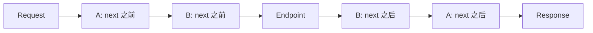

# ASP.NET Core Middleware：请求管道与中间件顺序

Middleware 是 ASP.NET Core 最核心的概念。一个 HTTP 请求进入应用后，不会直接到 Controller，而是先经过一条中间件管道。

理解 Middleware，你才能理解异常处理、HTTPS、静态文件、CORS、认证、授权、路由为什么要按特定顺序配置。

:::tip 阶段一阅读顺序
建议先读 [启动模型](/posts/dotnet/aspnet-core-startup-model)，再阅读本文。后续继续看 [Routing 与 Endpoint](/posts/dotnet/aspnet-core-routing-endpoint)、[Controller](/posts/dotnet/aspnet-core-webapi-controller) 和 [参数绑定与模型验证](/posts/dotnet/aspnet-core-model-binding-validation)。
:::

## 什么是 Middleware

Middleware 是请求管道中的一个处理环节。它可以：

- 在请求进入后执行逻辑
- 调用下一个中间件
- 在响应返回前执行逻辑
- 直接返回响应，短路后续管道

请求流程可以理解为：

```text
Request
 -> Middleware A
 -> Middleware B
 -> Middleware C
 -> Endpoint
 <- Middleware C
 <- Middleware B
 <- Middleware A
Response
```

## app.Use

`app.Use` 可以在调用下一个中间件前后执行逻辑。

```csharp
app.Use(async (context, next) =>
{
    Console.WriteLine("请求进入");

    await next();

    Console.WriteLine("响应返回");
});
```

`next()` 表示继续执行后面的管道。如果不调用 `next()`，后续中间件不会执行。

这段代码信息量比看上去大，下面逐个拆开讲。

### app.Use 就是中间件吗

这里要分清两个词：**中间件是概念，`app.Use` 是注册它的方法之一。**

准确地说，一个中间件就是"接收 `HttpContext`、并且能决定是否调用下一环"的一段处理逻辑。ASP.NET Core 里有三种写法，它们注册出来的东西**在管道里地位完全一样**：

```csharp
// 写法 1：内联 lambda —— 最直观，适合几行的简单逻辑
app.Use(async (context, next) =>
{
    Console.WriteLine("请求进入");
    await next();
});

// 写法 2：独立的中间件类 —— 逻辑复杂、需要注入服务时用
app.UseMiddleware<RequestTimingMiddleware>();

// 写法 3：框架/库提供的 UseXxx() 扩展方法 —— 内部就是在调用上面两种之一
app.UseHttpsRedirection();
app.UseAuthentication();
app.UseStaticFiles();
```

也就是说，`app.UseAuthentication()` 并不是什么特殊语法，它只是一个扩展方法，内部帮你 `UseMiddleware<AuthenticationMiddleware>()`。这和上一篇讲的 `builder.Services.AddXxx()` 是同一个套路：**`Use` 开头的扩展方法 = 往管道里加中间件**。

:::note 两个容易混的点
**`app.Use` 和 `builder.Services.Add...` 完全是两回事。** `Add` 是在 `Build()` 之前注册服务（谁能被注入），`Use` 是在 `Build()` 之后配置管道（请求经过什么）。写反位置会直接编译不过或抛异常。

**不是所有 `Use` 开头的方法都是加中间件。** 少数 `UseXxx()` 是配置类方法，比如 `builder.WebHost.UseUrls()`、EF Core 的 `options.UseSqlServer()`，它们跟管道无关。判断标准看接收者：`app.UseXxx()` 才是中间件。
:::

### 执行顺序：注册顺序进，逆序出

是的，请求方向严格按注册顺序执行。但完整的模型比"按顺序"多一层：**去程按注册顺序，回程按逆序**，因为每个中间件都把后面的整条管道"包"在自己的 `await next()` 里。这个结构通常被叫做洋葱模型。

```csharp
app.Use(async (context, next) =>
{
    Console.WriteLine("A 进");
    await next();
    Console.WriteLine("A 出");
});

app.Use(async (context, next) =>
{
    Console.WriteLine("B 进");
    await next();
    Console.WriteLine("B 出");
});

app.MapGet("/api/hello", () =>
{
    Console.WriteLine("Endpoint 执行");
    return "Hello";
});
```

访问 `/api/hello`，控制台输出：

```text
A 进
B 进
Endpoint 执行
B 出
A 出
```

注意 `A 出` 在最后 —— 第一个注册的中间件，它的"后半段"是最后执行的。理解这一点，你就明白为什么计时、日志、异常处理这类需要"包住全程"的中间件必须注册在最前面。



所以写在 `await next()` **之前**的代码，是在请求还没被处理时执行的（此时能改请求、能拦截）；写在 `await next()` **之后**的代码，是在响应已经生成后执行的（此时能读状态码、能记录耗时）。

:::tip Map 写在哪里不影响中间件先执行
初学者常有个疑问：如果我把 `app.MapGet(...)` 写在 `app.Use(...)` 前面，是不是 Endpoint 就先执行了？

不会。`Map*` 注册的 Endpoint 不占管道位置，它由框架自动添加在管道**末尾**的终结点中间件负责执行。所以无论 `MapGet` 写在代码的哪一行，`app.Use` 注册的中间件都在它之前运行。

但中间件之间的相对顺序是**严格按代码行顺序**的，这个必须自己排对。
:::

### 参数 context 和 next 是什么

```csharp
app.Use(async (HttpContext context, Func<Task> next) => { /* ... */ });
```

**`context` 是 `HttpContext`**，代表这一次请求的全部上下文，一个请求一个实例。常用成员：

| 成员 | 用途 |
|---|---|
| `context.Request` | 读路径、方法、请求头、查询串、Body |
| `context.Response` | 写状态码、响应头、响应体 |
| `context.User` | 当前用户身份（由认证中间件填充） |
| `context.Items` | 本次请求内的临时字典，中间件之间传数据用 |
| `context.RequestServices` | 本次请求作用域的 DI 容器，可解析 Scoped 服务 |
| `context.RequestAborted` | 客户端断开时会被取消的 `CancellationToken` |

```csharp
app.Use(async (context, next) =>
{
    // 读请求信息
    var method = context.Request.Method;          // "GET"
    var path = context.Request.Path;              // "/api/hello"
    var ua = context.Request.Headers.UserAgent;   // 请求头
    var page = context.Request.Query["page"];     // 查询参数 ?page=2

    // 往 Items 里塞数据，后面的中间件或 Controller 可以取
    context.Items["TraceId"] = Guid.NewGuid().ToString("N");

    await next();

    // 响应已生成，可以读状态码
    Console.WriteLine($"{method} {path} -> {context.Response.StatusCode}");
});
```

**`next` 是"后面整条管道"的引用**。调用它就把控制权交给下一个中间件；不调用就短路（后面单独有一节讲）。

### 三个高频踩坑点

**坑一：忘了 `await`**

```csharp
// ❌ 错误：没有 await，next() 返回的 Task 没人等
app.Use(async (context, next) =>
{
    next();  // 编译器会给警告 CS4014
    Console.WriteLine("这行会在后续管道还没跑完时就执行");
});
```

后果是执行顺序错乱，严重时会出现"响应已经返回了，你的代码还在跑"、访问已释放的 `HttpContext` 抛异常。**只要调用 `next()`，就必须 `await`。**

**坑二：在 `next()` 之后改状态码或响应头**

```csharp
// ❌ 大概率抛异常
app.Use(async (context, next) =>
{
    await next();

    context.Response.StatusCode = 500;                    // 抛 InvalidOperationException
    context.Response.Headers["X-Trace"] = "abc";          // 同上
});
```

报错内容是：

```text
System.InvalidOperationException: StatusCode cannot be set because the
response has already started.
```

原因是 HTTP 协议里响应头必须先于响应体发送。后续管道一旦往 Body 写过东西，响应头就已经发出去了，改不了。正确做法是先判断：

```csharp
app.Use(async (context, next) =>
{
    // ✅ 想加响应头，就在 next() 之前注册回调，由框架在真正发送头之前调用
    context.Response.OnStarting(() =>
    {
        context.Response.Headers["X-Trace"] = Guid.NewGuid().ToString("N");
        return Task.CompletedTask;
    });

    await next();

    // ✅ 只读不写是安全的；确实要写就先判断 HasStarted
    if (!context.Response.HasStarted)
    {
        context.Response.Headers["X-Elapsed"] = "0ms";
    }
});
```

**坑三：以为 `app.Use` 每个请求都会执行一遍**

```csharp
app.Use(async (context, next) =>   // ← 这一行：应用启动时只执行 1 次，用来注册
{
    // ← 这里面：每个请求执行 1 次
    await next();
});
```

`app.Use(...)` 本身是**启动期**的注册动作，整个应用生命周期只跑一次。传进去的那个 lambda 才是每个请求都执行。所以别在 lambda 外面做每请求的初始化，也别在 lambda 里做只需一次的重活（比如读配置文件、建连接池）。

### .NET 7 之后推荐的重载

`app.Use` 有两个重载，语义相同，性能有细微差别：

```csharp
// 旧重载：next 是 Func<Task>，调用时不传 context
app.Use(async (context, next) =>
{
    await next();
});

// .NET 7+ 新增重载：next 是 RequestDelegate，调用时要传 context
// 少一层闭包分配，官方推荐在性能敏感场景使用
app.Use(async (context, next) =>
{
    await next(context);
});
```

区别只有 `next()` 和 `next(context)` 这一处。只要你在 lambda 里调用了 `next`，两种写法都能编译，日常写哪种都行，看到别人代码里是 `next(context)` 不用疑惑。

:::warning 完全不用 next 会报二义性错误
新重载带来一个副作用：如果你在 `app.Use` 的 lambda 里**根本不使用** `next`，编译器无法判断你想用哪个重载，会直接报错：

```text
error CS0121: The call is ambiguous between the following methods or properties:
'UseExtensions.Use(IApplicationBuilder, Func<HttpContext, Func<Task>, Task>)' and
'UseExtensions.Use(IApplicationBuilder, Func<HttpContext, RequestDelegate, Task>)'
```

```csharp
// ❌ CS0121：next 一次都没用到
app.Use(async (context, next) =>
{
    await context.Response.WriteAsync("done");
});

// ✅ 压根不需要 next 的场景，本来就该用 app.Run
app.Run(async context =>
{
    await context.Response.WriteAsync("done");
});
```

官方给出的修复方式就是改用 `app.Run` —— 这在语义上也更准确：不调用 `next` 意味着这是一个终端中间件。参考 [官方破坏性变更说明](https://learn.microsoft.com/zh-cn/aspnet/core/breaking-changes/6/middleware-new-use-overload)。
:::

## app.Run

`app.Run` 会终止管道，通常用于最后处理请求。

```csharp
app.Run(async context =>
{
    await context.Response.WriteAsync("Hello from Run");
});
```

如果 `Run` 放在前面，后面的中间件和 Endpoint 都不会执行。

```csharp
app.Run(async context =>
{
    await context.Response.WriteAsync("Stopped");
});

// 这里不会执行
app.MapGet("/api/hello", () => "hello");
```

## app.Map

`app.Map` 用于根据路径创建分支管道。

```csharp
app.Map("/admin", adminApp =>
{
    adminApp.Run(async context =>
    {
        await context.Response.WriteAsync("Admin Area");
    });
});

app.Run(async context =>
{
    await context.Response.WriteAsync("Default Area");
});
```

访问 `/admin` 会进入分支管道，其他路径走默认管道。

## 自定义中间件类

复杂逻辑建议写成独立中间件类。

```csharp
public class RequestTimingMiddleware
{
    private readonly RequestDelegate _next;
    private readonly ILogger<RequestTimingMiddleware> _logger;

    public RequestTimingMiddleware(
        RequestDelegate next,
        ILogger<RequestTimingMiddleware> logger)
    {
        _next = next;
        _logger = logger;
    }

    public async Task InvokeAsync(HttpContext context)
    {
        var start = DateTimeOffset.UtcNow;

        await _next(context);

        var elapsed = DateTimeOffset.UtcNow - start;
        _logger.LogInformation(
            "Request {Method} {Path} completed in {Elapsed}ms",
            context.Request.Method,
            context.Request.Path,
            elapsed.TotalMilliseconds);
    }
}
```

注册：

```csharp
app.UseMiddleware<RequestTimingMiddleware>();
```

## 短路请求

中间件可以不调用 `_next`，直接返回响应。

```csharp
app.Use(async (context, next) =>
{
    if (!context.Request.Headers.ContainsKey("X-App-Id"))
    {
        context.Response.StatusCode = StatusCodes.Status400BadRequest;
        await context.Response.WriteAsync("Missing X-App-Id");
        return;
    }

    await next();
});
```

这叫短路，常用于简单拦截、健康检查、权限预处理等场景。

## 中间件顺序为什么重要

中间件按注册顺序执行。顺序错了，功能可能直接失效。

常见顺序：

```csharp
if (app.Environment.IsDevelopment())
{
    app.UseSwagger();
    app.UseSwaggerUI();
}

app.UseExceptionHandler();

app.UseHttpsRedirection();

app.UseRouting();
app.UseCors();
app.UseAuthentication();
app.UseAuthorization();

app.MapControllers();
```

每条规则背后都有明确的原因：

**异常处理必须最前面**：异常处理中间件用 try-catch 包裹后续管道。如果它不在最前面，前面注册的中间件抛出的异常就没人捕获。请求到达异常处理中间件之前如果就已经出错了，这个错误就会直接返回原始 500 页面，没有友好的错误格式。

**UseRouting 在认证授权之前**：Endpoint Routing 分两阶段工作——先匹配路由确定 Endpoint，再执行中间件和 Endpoint。认证授权中间件需要读取已匹配 Endpoint 上的元数据（如 `[Authorize]` 特性）才能工作。路由还没匹配，授权中间件就不知道当前请求需要什么权限。

**UseAuthentication 必须在 UseAuthorization 前面**：授权（Authorization）的前提是知道"你是谁"，这正是认证（Authentication）做的事。认证中间件解析 Token / Cookie，把用户身份写入 `HttpContext.User`。授权中间件读取 `HttpContext.User` 来判断权限。顺序反了，授权看到的是未认证用户，所有需要权限的请求都会被拒绝。

**CORS 在认证授权之前**：浏览器在跨域请求时会先发 OPTIONS 预检请求。如果 CORS 中间件在认证之后，预检请求可能被认证拦截（401），浏览器连 CORS 协商都完不成。

**MapControllers 在最后**：`Map...` 注册的是 Endpoint 终点，不是中间件。它应该在所有管道环节配置完成后注册，确保请求到达 Endpoint 之前所有中间件都已就位。

### app.Map 分支 vs app.MapGet 终点

`app.Map` 和 `app.MapGet` 都叫 "Map"，但语义完全不同：

```csharp
app.Map("/admin", adminApp =>
{
    adminApp.Use(async (context, next) =>
    {
        Console.WriteLine("Admin branch");
        await next();
    });

    adminApp.MapGet("/dashboard", () => "Admin Dashboard");
});
```

```csharp
app.MapGet("/api/hello", () => "Hello");
```

| 对比 | `app.Map("/path", ...)` | `app.MapGet("/path", ...)` |
|---|---|---|
| 作用 | 创建分支管道 | 注册 Endpoint 终点 |
| 参数 | 路径前缀 + 分支管道配置委托 | 路由模板 + 请求处理委托 |
| 语义 | "匹配这个路径前缀的请求走这条独立的管道" | "这个路径和 Method 对应这个处理函数" |
| 是否短路 | 分支内如果不调用后续中间件则短路 | 直接返回响应，是管道终点 |

初学者常混淆这两个方法。记住：`app.Map` 是管道分支，`app.MapGet` / `app.MapPost` 是 Endpoint 注册。

## Middleware 和 Filter 的区别

Middleware 面向整个 HTTP 请求管道，Filter 面向 MVC / Controller 执行过程。

| 对比 | Middleware | Filter |
|---|---|---|
| 作用范围 | 整个请求管道 | MVC / Controller |
| 执行位置 | 路由前后都可以 | Action 前后 |
| 适合场景 | 异常、日志、CORS、认证、租户识别 | Action 日志、参数检查、结果处理 |

阶段一先掌握 Middleware。Filter 会在应用基础设施阶段进一步展开。

## 一个完整示例

```csharp
var builder = WebApplication.CreateBuilder(args);

builder.Services.AddControllers();

var app = builder.Build();

app.Use(async (context, next) =>
{
    Console.WriteLine($"Before: {context.Request.Method} {context.Request.Path}");
    await next();
    Console.WriteLine($"After: {context.Response.StatusCode}");
});

app.MapGet("/api/hello", () => "Hello Middleware");

app.MapControllers();

app.Run();
```

访问 `/api/hello` 时，可以看到请求前后日志。

## 总结

Middleware 是 ASP.NET Core 的请求处理骨架。你可以把它理解成一条可组合的流水线：每个中间件处理一部分横切逻辑，然后决定是否继续交给后面的环节。

掌握 `Use`、`Run`、`Map`、短路和顺序之后，再学习 Routing、Controller、认证授权、异常处理会更自然。
