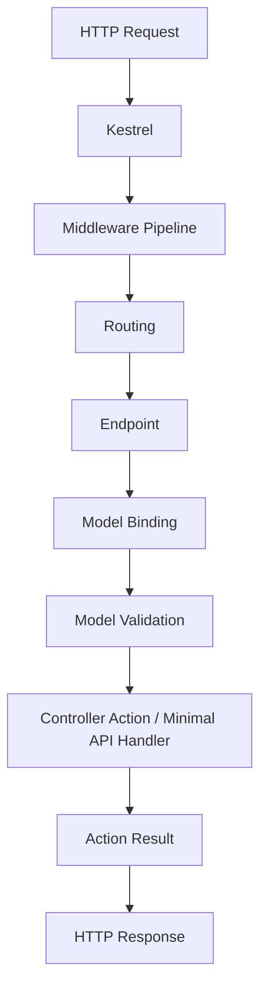

# ASP.NET Core 入门路线：从 HTTP 请求到 Web API

ASP.NET Core 入门最容易踩的坑，是一开始就去背 `AddControllers`、`UseRouting`、`MapControllers` 这些 API，却没有理解一个 HTTP 请求在框架里到底经历了什么。

阶段一的目标不是讲完 ASP.NET Core 的全部能力，而是建立一条最核心的主线：**一个请求如何进入应用、如何匹配路由、如何绑定参数、如何执行 Action、最后如何返回 HTTP 响应。**

## 阶段一要解决什么问题

读完阶段一后，你应该能回答这些问题：

- HTTP 请求和响应由哪些部分组成
- RESTful API 为什么要围绕资源设计
- `Program.cs` 里的 `builder`、`services`、`app` 分别负责什么
- Middleware 请求管道为什么有顺序要求
- Routing 和 Endpoint 如何把 URL 映射到处理逻辑
- Controller 和 Action 如何返回不同状态码
- ASP.NET Core 如何从 Route、Query、Body、Header 绑定参数
- `[ApiController]` 和模型验证如何工作
- Minimal API 适合什么场景，和 Controller 有什么区别

## 阶段一阅读顺序

### 1. HTTP 与 RESTful API 基础

先读：[HTTP 与 RESTful API 基础：ASP.NET Core 开发前置知识](/posts/dotnet/aspnet-core-http-rest-basics)

ASP.NET Core 是 Web 框架，Web API 的输入和输出本质都是 HTTP。先理解 Method、URL、Header、Body、Status Code，后面看 Controller、ActionResult、认证、缓存都会更清楚。

### 2. ASP.NET Core 启动模型

再读：[ASP.NET Core 启动模型：Program.cs、Builder 与 WebApplication](/posts/dotnet/aspnet-core-startup-model)

`Program.cs` 是应用入口。你需要知道服务在哪里注册、中间件在哪里配置、Endpoint 在哪里映射。

### 3. Middleware 请求管道

再读：[ASP.NET Core Middleware：请求管道与中间件顺序](/posts/dotnet/aspnet-core-middleware)

Middleware 是 ASP.NET Core 的核心。异常处理、HTTPS、静态文件、路由、认证、授权、CORS 都在请求管道中协作。

### 4. Routing 与 Endpoint

再读：[ASP.NET Core Routing：路由与 Endpoint 机制](/posts/dotnet/aspnet-core-routing-endpoint)

Routing 解决“这个 URL 应该由谁处理”。Endpoint 是最终可执行的处理单元。

### 5. Web API Controller

再读：[ASP.NET Core Web API：Controller、Action 与结果返回](/posts/dotnet/aspnet-core-webapi-controller)

Controller 是企业 Web API 项目最常见的组织方式。你需要掌握 `ControllerBase`、`ActionResult`、状态码和 DTO。

### 6. 参数绑定与模型验证

再读：[ASP.NET Core 参数绑定与模型验证：FromRoute、FromQuery、FromBody](/posts/dotnet/aspnet-core-model-binding-validation)

请求数据来自很多地方：路由、查询字符串、请求体、Header、Form。模型验证负责把非法输入挡在业务逻辑之前。

### 7. Minimal API

最后读：[ASP.NET Core Minimal API：轻量接口开发实践](/posts/dotnet/aspnet-core-minimal-api)

Minimal API 更轻量，适合小服务、网关、BFF 和快速原型。它不是 Controller 的替代品，而是另一种组织 API 的方式。

## 一条请求的完整链路



阶段一所有文章都围绕这条链路展开。后续阶段的配置、依赖注入、日志、异常处理、认证授权、EF Core、缓存和测试，都会挂到这条主线上。

## 推荐练习项目

阶段一可以用一个最小商品 API 项目练习：

```text
ProductApi/
├── Program.cs
├── Controllers/
│   └── ProductsController.cs
└── Models/
    ├── ProductDto.cs
    └── CreateProductRequest.cs
```

实现这些接口即可：

| 方法 | 路径 | 作用 |
|---|---|---|
| `GET` | `/api/products` | 查询商品列表 |
| `GET` | `/api/products/{id}` | 查询商品详情 |
| `POST` | `/api/products` | 创建商品 |
| `PUT` | `/api/products/{id}` | 更新商品 |
| `DELETE` | `/api/products/{id}` | 删除商品 |

阶段一暂时可以用内存集合保存数据，不急着接数据库。等主链路理解清楚，再进入 EF Core。

## 总结

ASP.NET Core 入门阶段不要追求“功能多”，而要先把请求链路理解透：HTTP 请求进入 Kestrel，经过 Middleware，路由到 Endpoint，绑定和验证参数，执行 Controller 或 Minimal API，最后返回响应。

掌握这条线，后面的配置、DI、日志、异常、认证、授权、数据库和部署才有落点。
