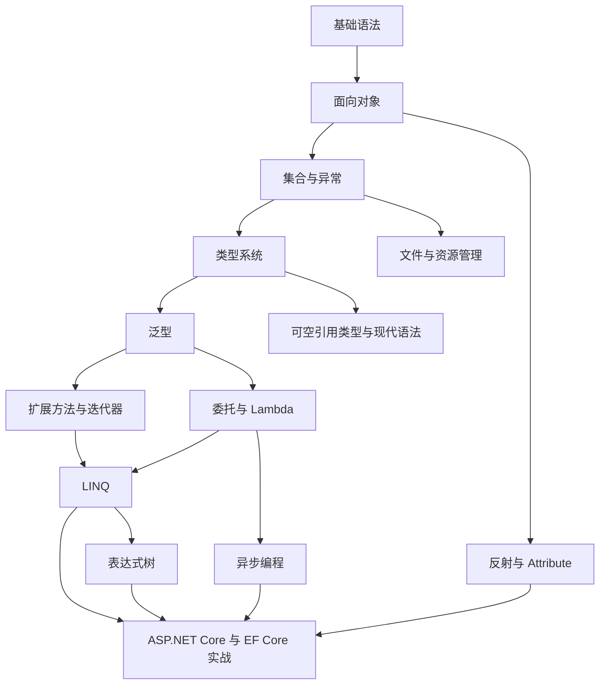

# C# 语言核心知识路线：从入门语法到现代特性

`.NET` 后端开发不只是会写 Controller 和 Service。真正影响代码质量的，往往是 C# 语言本身的基础能力：基础语法、类型系统、面向对象、集合、异常处理、泛型、扩展方法、迭代器、委托、Lambda、LINQ、表达式树、异步、反射、Attribute 和现代语法。

这些知识点如果孤立学习，很容易变成“看过语法，但项目里不知道怎么用”。更合理的方式是按能力递进：先会写基本程序，再学会用对象建模，然后处理集合和错误，最后进入泛型、委托、LINQ、异步和框架扩展机制。

## 这组文章解决什么问题

这组文章面向两类读者：一类是刚开始学习 C#，需要从基础语法入门；另一类是已经能写一些 C# 代码，但希望把语言能力补系统。

读完后你应该能回答这些问题：

- 一个 C# 程序的基本结构是什么
- 变量、类型、条件、循环、方法分别解决什么问题
- 类、对象、封装、继承、接口如何表达业务模型
- 数组、`List<T>`、`Dictionary<TKey, TValue>` 适合什么场景
- 异常应该什么时候捕获，什么时候抛出
- 值类型、引用类型、`enum`、`struct` 和装箱拆箱有什么区别
- 泛型为什么比 `object` 更安全
- 扩展方法和迭代器为什么是 LINQ 的语言基础
- 委托、事件、Lambda 到底是什么关系
- LINQ 为什么能统一操作集合、数据库和其他数据源
- `async/await` 为什么不是简单地“开新线程”
- 反射和 Attribute 为什么是很多 .NET 框架的基础
- 现代 C# 语法应该用在哪里，不应该滥用在哪里

## 推荐阅读顺序

### 1. 基础语法：先能写出完整程序

先读：[C# 基础语法：程序结构、变量、运算符与流程控制](/posts/dotnet/csharp-basic-syntax)

这一篇解决最基础的问题：程序从哪里开始执行、变量怎么声明、常用类型怎么选、条件和循环怎么写、方法怎么封装逻辑。

如果这一层不稳，后面看到类、泛型、LINQ 和异步代码时，很容易只会复制，不知道代码为什么这样组织。

### 2. 面向对象：用类型表达业务概念

再读：[C# 面向对象基础：类、对象、封装、继承与接口](/posts/dotnet/csharp-object-oriented-basics)

面向对象解决的是“业务概念如何建模”。ASP.NET Core 中的 Controller、Service、Options、Entity、DbContext，本质上都离不开类、对象、构造函数、接口和封装。

这一层也是后续理解依赖注入、领域模型和测试替身的基础。

### 3. 集合与异常：处理多条数据和错误流程

再读：[C# 集合与异常处理：数组、List、Dictionary 与 try/catch](/posts/dotnet/csharp-collections-exceptions)

真实项目很少只处理一个值。你需要用集合保存订单、用户、商品、权限，也需要在输入错误、数据不存在、状态非法时给出明确处理。

掌握集合和异常后，再进入泛型和 LINQ 会更自然。

### 4. 类型系统：理解值、引用和状态表达

再读：[C# 类型系统：值类型、引用类型、enum、struct 与装箱拆箱](/posts/dotnet/csharp-type-system)

这一篇补齐 `class`、`struct`、`enum`、可空值类型、装箱拆箱和参数传递的底层差异。它能帮助你判断什么时候用类，什么时候用结构体，状态字段要不要用枚举。

### 5. 泛型：建立类型复用能力

再读：[C# 泛型：类型安全的复用机制](/posts/dotnet/csharp-generics)

泛型解决的是“同一套逻辑如何适配不同类型，同时保持类型安全”。它是集合、依赖注入、仓储接口、Options、LINQ 等大量 .NET API 的基础。

如果不理解泛型，看到 `List<T>`、`IOptions<T>`、`IRepository<TEntity>`、`Func<T, TResult>` 时就只能机械使用，无法理解它们的设计意图。

### 6. 扩展方法与迭代器：理解 LINQ 的语言基础

再读：[C# 扩展方法与迭代器：LINQ 背后的语言基础](/posts/dotnet/csharp-extension-methods-iterators)

扩展方法解释了为什么 `Where`、`Select` 可以像实例方法一样链式调用；迭代器和 `yield return` 解释了 LINQ 延迟执行的语言基础。

### 7. 委托、事件与 Lambda：理解行为如何被传递

再读：[C# 委托、事件与 Lambda 表达式完全指南](/posts/dotnet/csharp-delegate-event-lambda)

委托让“方法”可以像数据一样传递，Lambda 是创建委托的简洁语法，事件是在委托基础上提供的发布订阅模型。

这部分是理解 LINQ、中间件、回调、事件通知和很多框架扩展点的前置知识。

### 8. LINQ：用声明式方式处理数据

再读：[C# LINQ：声明式数据查询完全指南](/posts/dotnet/csharp-linq)

LINQ 建立在泛型、扩展方法、委托和 Lambda 之上。它让你用统一的方式处理集合、数据库查询和数据转换。

学习 LINQ 时不要只记操作符，更要理解延迟执行、立即执行、`IEnumerable<T>` 和 `IQueryable<T>` 的区别。需要查操作符时，可以看 [C# LINQ 操作符速查](/posts/dotnet/csharp-linq-cheatsheet)。

### 9. 表达式树：理解 IQueryable 和 EF Core 查询翻译

再读：[C# 表达式树 Expression Tree：从 Lambda 到 IQueryable](/posts/dotnet/csharp-expression-tree)

表达式树是 LINQ 和 EF Core 之间的重要桥梁。它解释了为什么某些 Lambda 可以被翻译成 SQL，而有些普通 C# 方法不能被数据库执行。

### 10. 异步编程：理解现代 .NET I/O 模型

再读：[C# async/await 异步编程从原理到实践](/posts/dotnet/csharp-async-await)

Web API、EF Core、HttpClient、消息队列和文件 I/O 都大量依赖异步编程。

这部分重点不是背 `async` 和 `await` 语法，而是理解 `Task`、异常、取消、并发控制，以及为什么不要用 `.Result` 和 `.Wait()` 阻塞异步代码。

### 11. 文件与资源管理：理解外部资源生命周期

再读：[C# 文件与资源管理：File、Stream、using 与 IDisposable](/posts/dotnet/csharp-file-resource-management)

文件、网络流、数据库连接、日志写入都涉及资源释放。理解 `using`、`IDisposable` 和 `await using`，能避免文件占用和连接泄漏。

### 12. 反射与 Attribute：理解框架如何读取元数据

再读：[C# 反射与 Attribute：框架扩展能力的基础](/posts/dotnet/csharp-reflection-attribute)

ASP.NET Core 路由、模型验证、ORM 映射、依赖注入扫描、序列化库，都离不开反射和 Attribute。

业务代码里不应该滥用反射，但理解它能帮助你看懂很多框架“自动生效”的原因。

### 13. 可空引用类型：把 null 风险前移到编译期

再读：[C# 可空引用类型：null 安全与项目实践](/posts/dotnet/csharp-nullable-reference-types)

可空引用类型让 `string` 和 `string?` 表达不同含义。它不是运行时保护机制，而是编译期静态分析，适合在 DTO、实体、配置对象中建立更清晰的空值契约。

### 14. 现代 C# 语法：提升建模表达力

最后读：[C# 现代语法：record、模式匹配与简洁建模](/posts/dotnet/csharp-modern-syntax)

`record`、`init`、模式匹配、可空引用类型、集合表达式和主构造函数能减少样板代码，让模型更清晰。

这部分建议放在最后学，因为你需要先理解类型、对象、方法和数据处理，再判断这些新语法应该用于哪些场景。

## 知识之间的关系

这条线的核心逻辑是：

- 基础语法让你能写出完整可运行的程序
- 面向对象让你能用类型表达业务模型
- 集合与异常让你能处理多条数据和错误流程
- 类型系统让你理解值类型、引用类型和状态表达
- 泛型提供类型安全的复用能力
- 扩展方法和迭代器解释 LINQ 的链式调用和延迟执行
- 委托和 Lambda 提供行为传递能力
- LINQ 把类型和行为组合成声明式数据处理
- 表达式树解释 `IQueryable<T>` 和 EF Core 查询翻译
- 文件与资源管理让你正确释放外部资源
- 异步编程解决 I/O 等待和并发协作问题
- 反射和 Attribute 支撑框架读取元数据
- 现代语法让模型表达更简洁、更安全

## 学习时容易踩的坑

### 不要跳过基础语法直接学框架

ASP.NET Core 看起来是 Web 框架，但它大量使用 C# 语言能力。基础语法、类、接口、集合和异常不稳，后面学依赖注入、中间件、过滤器、EF Core 都会吃力。

### 不要把类只当成字段容器

类不仅能保存数据，也应该封装行为和规则。比如余额不能随便改，库存不能扣成负数，这些规则应该尽量靠近对应对象。

### 不要把泛型理解成简单替换类型

泛型不仅是少写几个重载方法，更重要的是把类型约束提前到编译期。它让错误更早暴露，也让 API 的意图更明确。

### 不要把委托和事件混为一谈

委托是一种类型，事件是基于委托的封装。外部代码可以调用委托变量，但不能直接触发事件，这就是 `event` 的封装价值。

### 不要只背 LINQ 操作符

LINQ 的难点不在 `Where`、`Select`、`GroupBy` 名字，而在延迟执行、表达式树、内存查询和数据库查询的边界。

### 不要把异步等同于多线程

I/O 异步的核心是等待期间不占用线程，不是给每个请求新开一个线程。CPU 密集型任务和 I/O 密集型任务的处理方式不同。

### 不要在业务代码里滥用反射

反射适合框架和基础设施代码。普通业务逻辑如果能直接调用，就不要为了“通用”而牺牲可读性和类型安全。

## 建议配套实践

学完这组语言知识后，可以用一个小项目把它们串起来：

- 用基础语法实现订单金额计算器
- 用类和对象实现购物车
- 用 `List<T>` 和 `Dictionary<TKey, TValue>` 管理商品和库存
- 用异常处理非法输入和库存不足
- 用泛型写一个 `Result<T>` 响应模型
- 用委托或接口实现一个简单规则引擎
- 用 LINQ 实现订单统计查询
- 用 `async/await` 模拟异步读取订单和库存
- 用 Attribute 标记需要校验的请求字段
- 用反射实现一个最小验证器
- 用 `record` 表达 DTO 和值对象

这样语言知识就不会停留在语法层，而会变成后续学习 ASP.NET Core、EF Core 和架构设计的基础。

## 总结

C# 语言层面的学习顺序可以简单记成一句话：**先基础语法，再对象建模，再集合异常，再类型复用和行为传递，最后进入数据查询、异步协作、框架元数据和现代建模。**

这条路线补齐后，再回头看 ASP.NET Core、EF Core、依赖注入、中间件和微服务文章，会顺很多。
